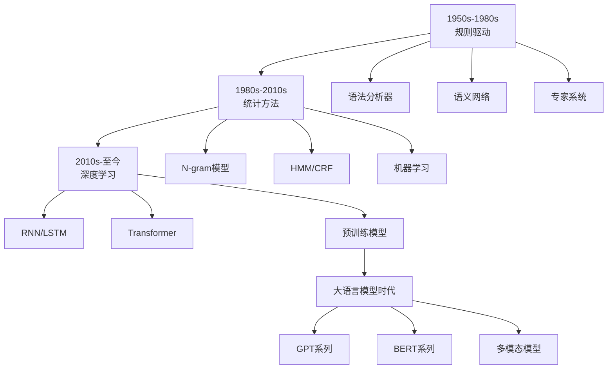

# NLP技术发展脉络

## 概述

自然语言处理（NLP）技术的发展经历了从规则驱动到统计方法，再到深度学习的演进过程。了解这一发展脉络有助于深入理解NLP技术的本质和未来趋势。

## 发展历程

### 1. 早期阶段（1950s-1980s）

#### 规则驱动方法
- **理论基础**：基于语言学规则和语法分析
- **核心思想**：通过人工设计的规则系统处理语言
- **主要技术**：
  - 语法分析器
  - 语义网络
  - 专家系统

#### 代表性工作
- **1950年**：图灵测试提出
- **1957年**：乔姆斯基语法理论
- **1960s**：ELIZA聊天机器人
- **1970s**：SHRDLU自然语言理解系统

### 2. 统计方法时代（1980s-2010s）

#### 统计语言模型
- **N-gram模型**：基于统计的词汇序列概率
- **隐马尔可夫模型（HMM）**：序列标注任务
- **条件随机场（CRF）**：改进的序列标注

#### 机器学习方法
- **支持向量机（SVM）**：文本分类
- **朴素贝叶斯**：垃圾邮件过滤
- **决策树**：文本挖掘

#### 代表性突破
- **1990s**：统计机器翻译
- **2000s**：搜索引擎技术
- **2006年**：Word2Vec词向量

### 3. 深度学习革命（2010s-至今）

#### 神经网络语言模型
- **循环神经网络（RNN）**：序列建模
- **长短期记忆网络（LSTM）**：解决梯度消失
- **门控循环单元（GRU）**：简化LSTM

#### Transformer架构
- **2017年**：Attention Is All You Need
- **2018年**：BERT双向编码器
- **2019年**：GPT-2大规模生成模型
- **2020年**：GPT-3超大规模模型

## 技术演进图谱



## 关键技术突破

### 1. 词向量技术演进

#### 传统方法
```python
# 词袋模型
def bag_of_words(texts):
    """
    词袋模型：简单的词频统计
    """
    from sklearn.feature_extraction.text import CountVectorizer
    
    vectorizer = CountVectorizer()
    X = vectorizer.fit_transform(texts)
    return X, vectorizer.get_feature_names_out()
```

#### Word2Vec突破
```python
# Word2Vec实现
def word2vec_evolution():
    """
    Word2Vec技术演进
    """
    import gensim
    from gensim.models import Word2Vec
    
    # 训练Word2Vec模型
    sentences = [
        ['I', 'love', 'machine', 'learning'],
        ['Deep', 'learning', 'is', 'amazing'],
        ['NLP', 'technology', 'evolves', 'rapidly']
    ]
    
    model = Word2Vec(
        sentences,
        vector_size=100,
        window=5,
        min_count=1,
        workers=4
    )
    
    # 词向量相似度
    similarity = model.wv.similarity('learning', 'technology')
    print(f"相似度: {similarity}")
    
    return model
```

### 2. 序列建模技术演进

#### RNN到LSTM的演进
```python
import torch
import torch.nn as nn

class RNNEvolution:
    def __init__(self):
        self.models = {}
    
    def simple_rnn(self, input_size, hidden_size, output_size):
        """
        简单RNN模型
        """
        class SimpleRNN(nn.Module):
            def __init__(self):
                super().__init__()
                self.rnn = nn.RNN(input_size, hidden_size, batch_first=True)
                self.fc = nn.Linear(hidden_size, output_size)
            
            def forward(self, x):
                output, _ = self.rnn(x)
                return self.fc(output[:, -1, :])
        
        return SimpleRNN()
    
    def lstm_model(self, input_size, hidden_size, output_size):
        """
        LSTM模型
        """
        class LSTMModel(nn.Module):
            def __init__(self):
                super().__init__()
                self.lstm = nn.LSTM(input_size, hidden_size, batch_first=True)
                self.fc = nn.Linear(hidden_size, output_size)
            
            def forward(self, x):
                output, (hidden, cell) = self.lstm(x)
                return self.fc(hidden[-1])
        
        return LSTMModel()
    
    def gru_model(self, input_size, hidden_size, output_size):
        """
        GRU模型
        """
        class GRUModel(nn.Module):
            def __init__(self):
                super().__init__()
                self.gru = nn.GRU(input_size, hidden_size, batch_first=True)
                self.fc = nn.Linear(hidden_size, output_size)
            
            def forward(self, x):
                output, hidden = self.gru(x)
                return self.fc(hidden[-1])
        
        return GRUModel()
```

### 3. Transformer架构革命

#### 自注意力机制
```python
import torch
import torch.nn as nn
import torch.nn.functional as F

class SelfAttention(nn.Module):
    def __init__(self, d_model):
        super().__init__()
        self.d_model = d_model
        self.W_q = nn.Linear(d_model, d_model)
        self.W_k = nn.Linear(d_model, d_model)
        self.W_v = nn.Linear(d_model, d_model)
        self.W_o = nn.Linear(d_model, d_model)
    
    def forward(self, x):
        batch_size, seq_len, d_model = x.size()
        
        # 计算Q, K, V
        Q = self.W_q(x)
        K = self.W_k(x)
        V = self.W_v(x)
        
        # 计算注意力分数
        scores = torch.matmul(Q, K.transpose(-2, -1)) / (d_model ** 0.5)
        attention_weights = F.softmax(scores, dim=-1)
        
        # 计算输出
        output = torch.matmul(attention_weights, V)
        output = self.W_o(output)
        
        return output, attention_weights

class MultiHeadAttention(nn.Module):
    def __init__(self, d_model, num_heads):
        super().__init__()
        self.d_model = d_model
        self.num_heads = num_heads
        self.d_k = d_model // num_heads
        
        self.W_q = nn.Linear(d_model, d_model)
        self.W_k = nn.Linear(d_model, d_model)
        self.W_v = nn.Linear(d_model, d_model)
        self.W_o = nn.Linear(d_model, d_model)
    
    def forward(self, x):
        batch_size, seq_len, d_model = x.size()
        
        # 计算Q, K, V
        Q = self.W_q(x).view(batch_size, seq_len, self.num_heads, self.d_k).transpose(1, 2)
        K = self.W_k(x).view(batch_size, seq_len, self.num_heads, self.d_k).transpose(1, 2)
        V = self.W_v(x).view(batch_size, seq_len, self.num_heads, self.d_k).transpose(1, 2)
        
        # 计算注意力
        scores = torch.matmul(Q, K.transpose(-2, -1)) / (self.d_k ** 0.5)
        attention_weights = F.softmax(scores, dim=-1)
        
        # 计算输出
        output = torch.matmul(attention_weights, V)
        output = output.transpose(1, 2).contiguous().view(batch_size, seq_len, d_model)
        output = self.W_o(output)
        
        return output, attention_weights
```

## 里程碑事件

### 1. 重要论文时间线

| 年份 | 论文/技术 | 影响 | 技术突破 |
|------|-----------|------|----------|
| 1950 | 图灵测试 | 奠基性 | 机器智能测试标准 |
| 1957 | 乔姆斯基语法 | 理论突破 | 形式语言理论 |
| 1986 | 反向传播算法 | 技术突破 | 神经网络训练 |
| 1997 | LSTM | 技术突破 | 解决梯度消失问题 |
| 2003 | Word2Vec | 技术突破 | 词向量表示 |
| 2013 | Word2Vec论文 | 技术突破 | 高效词向量训练 |
| 2014 | Seq2Seq | 技术突破 | 序列到序列学习 |
| 2015 | Attention机制 | 技术突破 | 注意力机制引入 |
| 2017 | Transformer | 革命性 | 自注意力架构 |
| 2018 | BERT | 革命性 | 双向预训练 |
| 2019 | GPT-2 | 革命性 | 大规模生成模型 |
| 2020 | GPT-3 | 革命性 | 超大规模模型 |
| 2022 | ChatGPT | 应用突破 | 对话AI普及 |
| 2023 | GPT-4 | 技术突破 | 多模态大模型 |

### 2. 技术发展特点

#### 早期特点
- **规则驱动**：依赖人工设计的语言规则
- **局限性**：难以处理语言的复杂性和多样性
- **应用范围**：主要限于特定领域

#### 统计方法特点
- **数据驱动**：基于大规模语料库
- **概率模型**：使用统计概率方法
- **性能提升**：在特定任务上表现良好

#### 深度学习特点
- **端到端学习**：从原始数据到最终输出
- **表示学习**：自动学习特征表示
- **通用性**：一个模型处理多种任务

## 技术发展趋势

### 1. 模型规模演进

```python
def model_size_evolution():
    """
    模型规模演进趋势
    """
    models = {
        'GPT-1 (2018)': {'parameters': '117M', 'tokens': '4.5B'},
        'GPT-2 (2019)': {'parameters': '1.5B', 'tokens': '40B'},
        'GPT-3 (2020)': {'parameters': '175B', 'tokens': '300B'},
        'GPT-4 (2023)': {'parameters': '1.7T', 'tokens': '13T'},
        'PaLM (2022)': {'parameters': '540B', 'tokens': '780B'},
        'Chinchilla (2022)': {'parameters': '70B', 'tokens': '1.4T'}
    }
    
    print("模型规模演进趋势:")
    for model, specs in models.items():
        print(f"{model}: {specs['parameters']} 参数, {specs['tokens']} 训练tokens")
    
    return models
```

### 2. 技术发展方向

#### 多模态融合
- **视觉-语言模型**：CLIP、DALL-E
- **多模态理解**：GPT-4V、Gemini
- **跨模态生成**：文本到图像、图像到文本

#### 效率优化
- **模型压缩**：量化、剪枝、蒸馏
- **推理加速**：硬件优化、算法优化
- **训练效率**：分布式训练、混合精度

#### 应用拓展
- **代码生成**：GitHub Copilot、CodeT5
- **科学计算**：AlphaFold、科学文献理解
- **创意内容**：写作助手、艺术创作

## 未来展望

### 1. 技术发展趋势

#### 模型架构创新
- **更高效的注意力机制**
- **新的神经网络架构**
- **混合专家模型（MoE）**

#### 训练方法改进
- **自监督学习**
- **强化学习结合**
- **持续学习能力**

#### 应用场景扩展
- **个性化AI助手**
- **专业领域应用**
- **实时交互系统**

### 2. 挑战与机遇

#### 技术挑战
- **计算资源需求**
- **数据质量要求**
- **模型可解释性**

#### 应用挑战
- **伦理和安全问题**
- **偏见和公平性**
- **隐私保护**

#### 发展机遇
- **技术民主化**
- **产业应用拓展**
- **科学研究加速**

## 学习建议

### 1. 技术学习路径
1. **基础理论**：语言学、统计学、机器学习
2. **经典方法**：N-gram、HMM、CRF
3. **深度学习**：RNN、LSTM、Transformer
4. **现代技术**：预训练模型、大语言模型

### 2. 实践建议
1. **动手实现**：从简单模型开始
2. **项目驱动**：选择感兴趣的应用场景
3. **持续学习**：关注最新技术发展
4. **社区参与**：加入开源项目

## 总结

NLP技术的发展体现了人工智能领域的整体演进规律：

1. **从规则到数据**：从人工设计到数据驱动
2. **从特定到通用**：从单一任务到多任务学习
3. **从浅层到深层**：从简单模型到复杂架构
4. **从单模态到多模态**：从文本处理到多模态理解

理解这一发展脉络有助于：
- 把握技术本质和发展规律
- 预测未来技术趋势
- 选择合适的学习路径
- 做出正确的技术决策

## 相关链接

- [[03-02-01-文本预处理技术]] - 基础技术
- [[03-02-02-词向量技术]] - 表示学习
- [[03-02-03-语言模型发展]] - 模型演进
- [[03-02-04-大语言模型原理]] - 现代技术
- [[03-02-05-NLP应用案例]] - 实际应用
- [[03-02-06-文本数据特征工程]] - 工程实践
