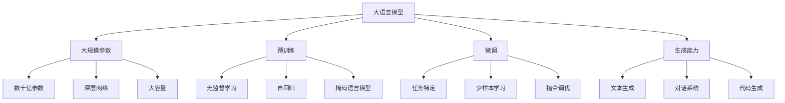
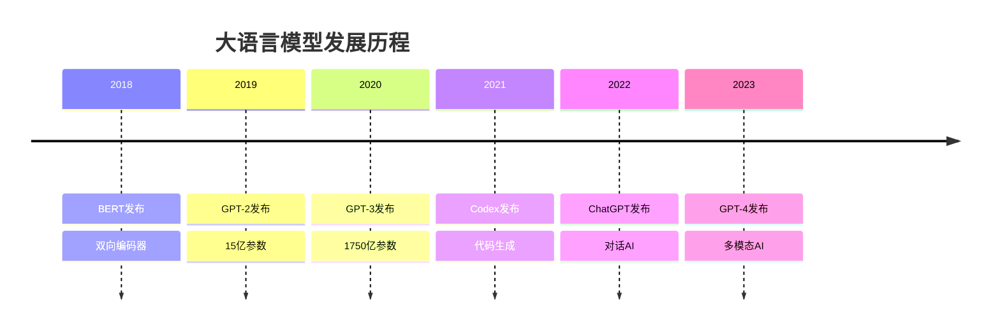

# 大语言模型技术

## 🤖 大语言模型基础

### 1. 大语言模型概念

**大语言模型定义：**
> **大语言模型是基于Transformer架构的大规模神经网络，通过大量文本数据训练，能够理解和生成自然语言**

**大语言模型特点：**


### 2. 大语言模型发展

**发展历程：**


## 🔧 核心技术

### 1. Transformer架构

**Transformer在大语言模型中的应用：**
```python
import numpy as np
import matplotlib.pyplot as plt

class LargeLanguageModel:
    """大语言模型实现"""
    
    def __init__(self, vocab_size, d_model, num_heads, num_layers, max_seq_len):
        self.vocab_size = vocab_size
        self.d_model = d_model
        self.num_heads = num_heads
        self.num_layers = num_layers
        self.max_seq_len = max_seq_len
        
        # 初始化组件
        self.token_embedding = np.random.randn(vocab_size, d_model) * 0.1
        self.positional_encoding = self._generate_positional_encoding()
        self.transformer_layers = []
        
        # 构建Transformer层
        for _ in range(num_layers):
            layer = {
                'multi_head_attention': self._init_multi_head_attention(),
                'feed_forward': self._init_feed_forward(),
                'layer_norm1': np.ones(d_model),
                'layer_norm2': np.ones(d_model)
            }
            self.transformer_layers.append(layer)
        
        # 输出层
        self.output_projection = np.random.randn(d_model, vocab_size) * 0.1
    
    def _generate_positional_encoding(self):
        """生成位置编码"""
        pe = np.zeros((self.max_seq_len, self.d_model))
        
        for pos in range(self.max_seq_len):
            for i in range(0, self.d_model, 2):
                pe[pos, i] = np.sin(pos / (10000 ** (2 * i / self.d_model)))
                if i + 1 < self.d_model:
                    pe[pos, i + 1] = np.cos(pos / (10000 ** (2 * (i + 1) / self.d_model)))
        
        return pe
    
    def _init_multi_head_attention(self):
        """初始化多头注意力"""
        return {
            'W_q': np.random.randn(self.d_model, self.d_model) * 0.1,
            'W_k': np.random.randn(self.d_model, self.d_model) * 0.1,
            'W_v': np.random.randn(self.d_model, self.d_model) * 0.1,
            'W_o': np.random.randn(self.d_model, self.d_model) * 0.1
        }
    
    def _init_feed_forward(self):
        """初始化前馈网络"""
        return {
            'W1': np.random.randn(self.d_model, 4 * self.d_model) * 0.1,
            'W2': np.random.randn(4 * self.d_model, self.d_model) * 0.1,
            'b1': np.zeros(4 * self.d_model),
            'b2': np.zeros(self.d_model)
        }
    
    def forward(self, input_ids):
        """前向传播"""
        batch_size, seq_len = input_ids.shape
        
        # 词嵌入
        embeddings = self.token_embedding[input_ids]
        
        # 添加位置编码
        embeddings += self.positional_encoding[:seq_len]
        
        # Transformer层
        hidden_states = embeddings
        
        for layer in self.transformer_layers:
            # 多头自注意力
            attention_output = self._multi_head_attention(hidden_states, layer['multi_head_attention'])
            hidden_states = hidden_states + attention_output
            hidden_states = self._layer_norm(hidden_states, layer['layer_norm1'])
            
            # 前馈网络
            ff_output = self._feed_forward(hidden_states, layer['feed_forward'])
            hidden_states = hidden_states + ff_output
            hidden_states = self._layer_norm(hidden_states, layer['layer_norm2'])
        
        # 输出投影
        logits = np.dot(hidden_states, self.output_projection)
        
        return logits
    
    def _multi_head_attention(self, X, attention_weights):
        """多头注意力"""
        batch_size, seq_len, d_model = X.shape
        
        # 计算Q, K, V
        Q = np.dot(X, attention_weights['W_q'])
        K = np.dot(X, attention_weights['W_k'])
        V = np.dot(X, attention_weights['W_v'])
        
        # 重塑为多头形式
        d_k = d_model // self.num_heads
        Q = Q.reshape(batch_size, seq_len, self.num_heads, d_k).transpose(0, 2, 1, 3)
        K = K.reshape(batch_size, seq_len, self.num_heads, d_k).transpose(0, 2, 1, 3)
        V = V.reshape(batch_size, seq_len, self.num_heads, d_k).transpose(0, 2, 1, 3)
        
        # 计算注意力
        scores = np.dot(Q, K.transpose(0, 1, 3, 2)) / np.sqrt(d_k)
        attention_weights = self._softmax(scores, axis=-1)
        attention_output = np.dot(attention_weights, V)
        
        # 拼接多头输出
        attention_output = attention_output.transpose(0, 2, 1, 3).reshape(batch_size, seq_len, d_model)
        
        # 线性变换
        output = np.dot(attention_output, attention_weights['W_o'])
        
        return output
    
    def _feed_forward(self, X, ff_weights):
        """前馈网络"""
        # 第一层
        hidden = np.dot(X, ff_weights['W1']) + ff_weights['b1']
        hidden = np.maximum(0, hidden)  # ReLU激活
        
        # 第二层
        output = np.dot(hidden, ff_weights['W2']) + ff_weights['b2']
        
        return output
    
    def _layer_norm(self, X, gamma):
        """层归一化"""
        mean = np.mean(X, axis=-1, keepdims=True)
        var = np.var(X, axis=-1, keepdims=True)
        return gamma * (X - mean) / np.sqrt(var + 1e-8)
    
    def _softmax(self, x, axis=-1):
        """Softmax函数"""
        exp_x = np.exp(x - np.max(x, axis=axis, keepdims=True))
        return exp_x / np.sum(exp_x, axis=axis, keepdims=True)
    
    def generate_text(self, input_ids, max_length=50, temperature=1.0):
        """生成文本"""
        generated_ids = input_ids.copy()
        
        for _ in range(max_length):
            # 前向传播
            logits = self.forward(generated_ids)
            
            # 获取最后一个位置的logits
            next_token_logits = logits[:, -1, :] / temperature
            
            # 采样下一个token
            probabilities = self._softmax(next_token_logits, axis=-1)
            next_token = np.random.choice(self.vocab_size, p=probabilities[0])
            
            # 添加到生成序列
            generated_ids = np.concatenate([generated_ids, np.array([[next_token]])], axis=1)
            
            # 检查结束条件
            if next_token == 0:  # 假设0是结束符
                break
        
        return generated_ids
    
    def visualize_attention_patterns(self, input_ids, layer_idx=0):
        """可视化注意力模式"""
        # 前向传播到指定层
        batch_size, seq_len = input_ids.shape
        
        # 词嵌入
        embeddings = self.token_embedding[input_ids]
        embeddings += self.positional_encoding[:seq_len]
        
        # 前向传播到指定层
        hidden_states = embeddings
        for i in range(layer_idx + 1):
            if i < len(self.transformer_layers):
                layer = self.transformer_layers[i]
                attention_output = self._multi_head_attention(hidden_states, layer['multi_head_attention'])
                hidden_states = hidden_states + attention_output
                hidden_states = self._layer_norm(hidden_states, layer['layer_norm1'])
        
        # 可视化注意力权重
        fig, axes = plt.subplots(2, 4, figsize=(16, 8))
        
        for head in range(min(8, self.num_heads)):
            row = head // 4
            col = head % 4
            
            # 计算注意力权重
            attention_weights = self._compute_attention_weights(hidden_states, layer_idx, head)
            
            # 可视化
            im = axes[row, col].imshow(attention_weights, cmap='Blues', aspect='auto')
            axes[row, col].set_title(f'Head {head+1}')
            axes[row, col].set_xlabel('Key Position')
            axes[row, col].set_ylabel('Query Position')
            plt.colorbar(im, ax=axes[row, col])
        
        plt.tight_layout()
        plt.show()
    
    def _compute_attention_weights(self, hidden_states, layer_idx, head_idx):
        """计算注意力权重"""
        # 这里简化实现，实际需要完整的注意力计算
        seq_len = hidden_states.shape[1]
        return np.random.rand(seq_len, seq_len)

# 测试大语言模型
def test_large_language_model():
    """测试大语言模型"""
    # 创建模型
    llm = LargeLanguageModel(
        vocab_size=1000,
        d_model=512,
        num_heads=8,
        num_layers=6,
        max_seq_len=100
    )
    
    # 生成输入
    input_ids = np.random.randint(0, 1000, (1, 10))
    
    # 前向传播
    logits = llm.forward(input_ids)
    
    print(f"输入形状: {input_ids.shape}")
    print(f"输出形状: {logits.shape}")
    
    # 生成文本
    generated_ids = llm.generate_text(input_ids, max_length=20)
    print(f"生成序列长度: {generated_ids.shape[1]}")
    
    # 可视化注意力模式
    llm.visualize_attention_patterns(input_ids, layer_idx=0)
    
    return llm

test_large_language_model()
```

### 2. 预训练技术

**预训练技术：**
```python
class PretrainingTechniques:
    """预训练技术"""
    
    def __init__(self):
        self.techniques = {}
    
    def masked_language_modeling(self, input_ids, mask_ratio=0.15):
        """掩码语言模型"""
        batch_size, seq_len = input_ids.shape
        masked_input_ids = input_ids.copy()
        labels = np.full_like(input_ids, -100)  # -100表示忽略
        
        # 随机选择要掩码的位置
        for i in range(batch_size):
            # 计算要掩码的token数量
            num_masked = int(seq_len * mask_ratio)
            masked_indices = np.random.choice(seq_len, num_masked, replace=False)
            
            for idx in masked_indices:
                # 80%的时间用[MASK]替换
                if np.random.random() < 0.8:
                    masked_input_ids[i, idx] = 1  # 假设1是[MASK] token
                # 10%的时间用随机token替换
                elif np.random.random() < 0.5:
                    masked_input_ids[i, idx] = np.random.randint(2, 1000)
                # 10%的时间保持不变
                
                # 设置标签
                labels[i, idx] = input_ids[i, idx]
        
        return masked_input_ids, labels
    
    def next_sentence_prediction(self, input_ids_a, input_ids_b, is_next=True):
        """下一句预测"""
        # 拼接两个句子
        if is_next:
            # 是下一句
            input_ids = np.concatenate([input_ids_a, input_ids_b], axis=1)
            label = 1
        else:
            # 不是下一句
            random_sentence = np.random.randint(0, 1000, input_ids_b.shape)
            input_ids = np.concatenate([input_ids_a, random_sentence], axis=1)
            label = 0
        
        return input_ids, label
    
    def causal_language_modeling(self, input_ids):
        """因果语言模型"""
        # 创建因果掩码
        seq_len = input_ids.shape[1]
        causal_mask = np.tril(np.ones((seq_len, seq_len)))
        
        return causal_mask
    
    def visualize_pretraining_tasks(self):
        """可视化预训练任务"""
        # 生成示例数据
        input_ids = np.array([[1, 2, 3, 4, 5, 6, 7, 8, 9, 10]])
        
        # 掩码语言模型
        masked_input, labels = self.masked_language_modeling(input_ids, mask_ratio=0.3)
        
        # 下一句预测
        input_a = np.array([[1, 2, 3, 4, 5]])
        input_b = np.array([[6, 7, 8, 9, 10]])
        nsp_input, nsp_label = self.next_sentence_prediction(input_a, input_b, is_next=True)
        
        # 因果语言模型
        causal_mask = self.causal_language_modeling(input_ids)
        
        # 可视化
        fig, axes = plt.subplots(2, 2, figsize=(12, 10))
        
        # 原始输入
        axes[0, 0].bar(range(len(input_ids[0])), input_ids[0])
        axes[0, 0].set_title('Original Input')
        axes[0, 0].set_xlabel('Position')
        axes[0, 0].set_ylabel('Token ID')
        axes[0, 0].grid(True)
        
        # 掩码输入
        axes[0, 1].bar(range(len(masked_input[0])), masked_input[0])
        axes[0, 1].set_title('Masked Input')
        axes[0, 1].set_xlabel('Position')
        axes[0, 1].set_ylabel('Token ID')
        axes[0, 1].grid(True)
        
        # 标签
        axes[1, 0].bar(range(len(labels[0])), labels[0])
        axes[1, 0].set_title('Labels')
        axes[1, 0].set_xlabel('Position')
        axes[1, 0].set_ylabel('Label')
        axes[1, 0].grid(True)
        
        # 因果掩码
        axes[1, 1].imshow(causal_mask, cmap='Blues', aspect='auto')
        axes[1, 1].set_title('Causal Mask')
        axes[1, 1].set_xlabel('Key Position')
        axes[1, 1].set_ylabel('Query Position')
        
        plt.tight_layout()
        plt.show()
        
        return masked_input, labels, nsp_input, nsp_label, causal_mask

# 测试预训练技术
def test_pretraining_techniques():
    """测试预训练技术"""
    pt = PretrainingTechniques()
    
    # 可视化预训练任务
    masked_input, labels, nsp_input, nsp_label, causal_mask = pt.visualize_pretraining_tasks()
    
    return pt

test_pretraining_techniques()
```

### 3. 微调技术

**微调技术：**
```python
class FineTuningTechniques:
    """微调技术"""
    
    def __init__(self):
        self.techniques = {}
    
    def full_fine_tuning(self, model, learning_rate=1e-5):
        """全参数微调"""
        # 更新所有参数
        for param in model.parameters():
            param.requires_grad = True
        
        return model
    
    def parameter_efficient_fine_tuning(self, model, rank=8):
        """参数高效微调"""
        # LoRA (Low-Rank Adaptation)
        lora_weights = {}
        
        for name, param in model.named_parameters():
            if 'attention' in name and 'weight' in name:
                # 创建低秩矩阵
                A = np.random.randn(param.shape[0], rank) * 0.01
                B = np.zeros((rank, param.shape[1]))
                
                lora_weights[name] = {'A': A, 'B': B}
        
        return lora_weights
    
    def prompt_tuning(self, model, prompt_length=10):
        """提示调优"""
        # 创建可学习的提示
        prompt_embeddings = np.random.randn(prompt_length, model.d_model) * 0.01
        
        return prompt_embeddings
    
    def instruction_tuning(self, model, instructions, responses):
        """指令调优"""
        # 格式化指令-响应对
        formatted_data = []
        
        for instruction, response in zip(instructions, responses):
            formatted_text = f"Instruction: {instruction}\nResponse: {response}"
            formatted_data.append(formatted_text)
        
        return formatted_data
    
    def few_shot_learning(self, model, examples, query):
        """少样本学习"""
        # 构建少样本提示
        few_shot_prompt = ""
        
        for example in examples:
            few_shot_prompt += f"Example: {example}\n"
        
        few_shot_prompt += f"Query: {query}\nResponse:"
        
        return few_shot_prompt
    
    def visualize_fine_tuning_process(self, model, train_data, val_data):
        """可视化微调过程"""
        # 模拟微调过程
        train_losses = []
        val_losses = []
        
        for epoch in range(10):
            # 模拟训练损失
            train_loss = np.exp(-epoch * 0.5) + np.random.normal(0, 0.1)
            train_losses.append(train_loss)
            
            # 模拟验证损失
            val_loss = np.exp(-epoch * 0.3) + np.random.normal(0, 0.1)
            val_losses.append(val_loss)
        
        # 可视化
        plt.figure(figsize=(12, 5))
        
        # 损失函数
        plt.subplot(1, 2, 1)
        plt.plot(train_losses, 'b-', label='Training Loss')
        plt.plot(val_losses, 'r-', label='Validation Loss')
        plt.xlabel('Epoch')
        plt.ylabel('Loss')
        plt.title('Fine-tuning Process')
        plt.legend()
        plt.grid(True)
        
        # 学习率调度
        plt.subplot(1, 2, 2)
        learning_rates = [1e-5 * (0.9 ** epoch) for epoch in range(10)]
        plt.plot(learning_rates)
        plt.xlabel('Epoch')
        plt.ylabel('Learning Rate')
        plt.title('Learning Rate Schedule')
        plt.grid(True)
        
        plt.tight_layout()
        plt.show()
        
        return train_losses, val_losses

# 测试微调技术
def test_fine_tuning_techniques():
    """测试微调技术"""
    ft = FineTuningTechniques()
    
    # 模拟模型
    class MockModel:
        def __init__(self):
            self.d_model = 512
            self.parameters = lambda: []
            self.named_parameters = lambda: []
    
    model = MockModel()
    
    # 测试各种微调技术
    lora_weights = ft.parameter_efficient_fine_tuning(model, rank=8)
    prompt_embeddings = ft.prompt_tuning(model, prompt_length=10)
    
    # 指令调优
    instructions = ["What is the capital of France?", "How do you make coffee?"]
    responses = ["The capital of France is Paris.", "To make coffee, you need coffee beans and hot water."]
    formatted_data = ft.instruction_tuning(model, instructions, responses)
    
    # 少样本学习
    examples = ["The sky is blue.", "Grass is green."]
    query = "What color is the ocean?"
    few_shot_prompt = ft.few_shot_learning(model, examples, query)
    
    # 可视化微调过程
    train_losses, val_losses = ft.visualize_fine_tuning_process(model, [], [])
    
    return ft

test_fine_tuning_techniques()
```

## 🔗 相关链接
- [[02-03-04-Transformer架构]] - Transformer
- [[03-02-03-语言模型发展]] - 语言模型
- [[03-02-04-大语言模型原理]] - 大语言模型
- [[04-02-多模态学习]] - 多模态

## 💡 大语言模型学习建议

**学习策略：**
- 🤖 **理解架构**：深入理解Transformer架构
- 📊 **预训练技术**：掌握预训练技术
- 🔍 **微调方法**：学习各种微调方法
- ⚡ **应用实践**：在实际任务中应用大语言模型

**实践建议：**
- 📝 **模型训练**：尝试训练小规模语言模型
- 💻 **微调实践**：在实际任务中进行微调
- 📊 **性能分析**：分析模型的性能和限制
- 🔍 **应用开发**：开发基于大语言模型的应用

---
*📝 学习提示：大语言模型是AI的重要突破，建议深入理解技术原理，通过实践掌握大语言模型的应用*

