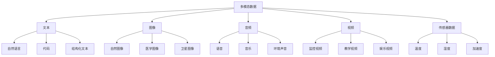

# 多模态学习

## 🎨 多模态学习基础

### 1. 多模态概念

**多模态定义：**
> **多模态学习是指同时处理和理解多种不同类型数据（如文本、图像、音频、视频）的机器学习方法**

**多模态数据类型：**


### 2. 多模态学习任务

**多模态任务类型：**
| 任务类型 | 输入 | 输出 | 例子 |
|----------|------|------|------|
| **多模态分类** | 文本+图像 | 类别 | 图像描述分类 |
| **多模态回归** | 文本+图像 | 数值 | 情感强度预测 |
| **多模态生成** | 文本 | 图像 | 文本到图像生成 |
| **多模态检索** | 查询 | 相关项 | 跨模态搜索 |
| **多模态对齐** | 多模态数据 | 对齐关系 | 图像-文本对齐 |

## 🔧 多模态架构

### 1. 多模态融合

**多模态融合架构：**
```python
import numpy as np
import matplotlib.pyplot as plt

class MultimodalFusion:
    """多模态融合"""
    
    def __init__(self, text_dim, image_dim, fusion_dim):
        self.text_dim = text_dim
        self.image_dim = image_dim
        self.fusion_dim = fusion_dim
        
        # 文本编码器
        self.text_encoder = {
            'linear1': np.random.randn(text_dim, 256) * 0.1,
            'linear2': np.random.randn(256, fusion_dim) * 0.1,
            'bias1': np.zeros(256),
            'bias2': np.zeros(fusion_dim)
        }
        
        # 图像编码器
        self.image_encoder = {
            'linear1': np.random.randn(image_dim, 256) * 0.1,
            'linear2': np.random.randn(256, fusion_dim) * 0.1,
            'bias1': np.zeros(256),
            'bias2': np.zeros(fusion_dim)
        }
        
        # 融合层
        self.fusion_layer = {
            'linear': np.random.randn(fusion_dim * 2, fusion_dim) * 0.1,
            'bias': np.zeros(fusion_dim)
        }
    
    def encode_text(self, text_features):
        """编码文本特征"""
        # 第一层
        hidden = np.dot(text_features, self.text_encoder['linear1']) + self.text_encoder['bias1']
        hidden = np.maximum(0, hidden)  # ReLU激活
        
        # 第二层
        text_encoded = np.dot(hidden, self.text_encoder['linear2']) + self.text_encoder['bias2']
        
        return text_encoded
    
    def encode_image(self, image_features):
        """编码图像特征"""
        # 第一层
        hidden = np.dot(image_features, self.image_encoder['linear1']) + self.image_encoder['bias1']
        hidden = np.maximum(0, hidden)  # ReLU激活
        
        # 第二层
        image_encoded = np.dot(hidden, self.image_encoder['linear2']) + self.image_encoder['bias2']
        
        return image_encoded
    
    def fuse_modalities(self, text_encoded, image_encoded, fusion_type='concat'):
        """融合多模态特征"""
        if fusion_type == 'concat':
            # 拼接融合
            fused = np.concatenate([text_encoded, image_encoded], axis=-1)
            output = np.dot(fused, self.fusion_layer['linear']) + self.fusion_layer['bias']
        
        elif fusion_type == 'add':
            # 相加融合
            fused = text_encoded + image_encoded
            output = np.dot(fused, self.fusion_layer['linear']) + self.fusion_layer['bias']
        
        elif fusion_type == 'multiply':
            # 相乘融合
            fused = text_encoded * image_encoded
            output = np.dot(fused, self.fusion_layer['linear']) + self.fusion_layer['bias']
        
        elif fusion_type == 'attention':
            # 注意力融合
            attention_weights = self._compute_attention_weights(text_encoded, image_encoded)
            fused = attention_weights * text_encoded + (1 - attention_weights) * image_encoded
            output = np.dot(fused, self.fusion_layer['linear']) + self.fusion_layer['bias']
        
        return output
    
    def _compute_attention_weights(self, text_encoded, image_encoded):
        """计算注意力权重"""
        # 简化的注意力计算
        attention_scores = np.sum(text_encoded * image_encoded, axis=-1, keepdims=True)
        attention_weights = 1 / (1 + np.exp(-attention_scores))  # Sigmoid
        return attention_weights
    
    def forward(self, text_features, image_features, fusion_type='concat'):
        """前向传播"""
        # 编码各模态
        text_encoded = self.encode_text(text_features)
        image_encoded = self.encode_image(image_features)
        
        # 融合
        fused_output = self.fuse_modalities(text_encoded, image_encoded, fusion_type)
        
        return fused_output
    
    def visualize_fusion_process(self, text_features, image_features):
        """可视化融合过程"""
        # 编码各模态
        text_encoded = self.encode_text(text_features)
        image_encoded = self.encode_image(image_features)
        
        # 不同融合方式
        fusion_types = ['concat', 'add', 'multiply', 'attention']
        fusion_outputs = {}
        
        for fusion_type in fusion_types:
            fusion_outputs[fusion_type] = self.fuse_modalities(text_encoded, image_encoded, fusion_type)
        
        # 可视化
        fig, axes = plt.subplots(2, 3, figsize=(15, 10))
        
        # 原始特征
        axes[0, 0].bar(range(len(text_features[0])), text_features[0])
        axes[0, 0].set_title('Text Features')
        axes[0, 0].set_xlabel('Feature Index')
        axes[0, 0].set_ylabel('Feature Value')
        axes[0, 0].grid(True)
        
        axes[0, 1].bar(range(len(image_features[0])), image_features[0])
        axes[0, 1].set_title('Image Features')
        axes[0, 1].set_xlabel('Feature Index')
        axes[0, 1].set_ylabel('Feature Value')
        axes[0, 1].grid(True)
        
        # 编码后特征
        axes[0, 2].bar(range(len(text_encoded[0])), text_encoded[0])
        axes[0, 2].set_title('Encoded Text Features')
        axes[0, 2].set_xlabel('Feature Index')
        axes[0, 2].set_ylabel('Feature Value')
        axes[0, 2].grid(True)
        
        # 融合结果
        for i, (fusion_type, output) in enumerate(fusion_outputs.items()):
            if i < 3:
                axes[1, i].bar(range(len(output[0])), output[0])
                axes[1, i].set_title(f'{fusion_type.capitalize()} Fusion')
                axes[1, i].set_xlabel('Feature Index')
                axes[1, i].set_ylabel('Feature Value')
                axes[1, i].grid(True)
        
        plt.tight_layout()
        plt.show()
        
        return fusion_outputs

# 测试多模态融合
def test_multimodal_fusion():
    """测试多模态融合"""
    # 创建融合模型
    fusion = MultimodalFusion(text_dim=100, image_dim=200, fusion_dim=128)
    
    # 生成示例数据
    text_features = np.random.randn(1, 100)
    image_features = np.random.randn(1, 200)
    
    # 前向传播
    output = fusion.forward(text_features, image_features, fusion_type='concat')
    
    print(f"文本特征形状: {text_features.shape}")
    print(f"图像特征形状: {image_features.shape}")
    print(f"融合输出形状: {output.shape}")
    
    # 可视化融合过程
    fusion_outputs = fusion.visualize_fusion_process(text_features, image_features)
    
    return fusion

test_multimodal_fusion()
```

### 2. 跨模态对齐

**跨模态对齐实现：**
```python
class CrossModalAlignment:
    """跨模态对齐"""
    
    def __init__(self, text_dim, image_dim, alignment_dim):
        self.text_dim = text_dim
        self.image_dim = image_dim
        self.alignment_dim = alignment_dim
        
        # 文本投影层
        self.text_projection = {
            'linear': np.random.randn(text_dim, alignment_dim) * 0.1,
            'bias': np.zeros(alignment_dim)
        }
        
        # 图像投影层
        self.image_projection = {
            'linear': np.random.randn(image_dim, alignment_dim) * 0.1,
            'bias': np.zeros(alignment_dim)
        }
        
        # 温度参数
        self.temperature = 0.07
    
    def project_text(self, text_features):
        """投影文本特征"""
        text_projected = np.dot(text_features, self.text_projection['linear']) + self.text_projection['bias']
        text_projected = text_projected / np.linalg.norm(text_projected, axis=-1, keepdims=True)
        return text_projected
    
    def project_image(self, image_features):
        """投影图像特征"""
        image_projected = np.dot(image_features, self.image_projection['linear']) + self.image_projection['bias']
        image_projected = image_projected / np.linalg.norm(image_projected, axis=-1, keepdims=True)
        return image_projected
    
    def compute_similarity(self, text_projected, image_projected):
        """计算相似度"""
        # 计算余弦相似度
        similarity = np.dot(text_projected, image_projected.T) / self.temperature
        return similarity
    
    def contrastive_loss(self, text_features, image_features, labels):
        """对比损失"""
        # 投影到共同空间
        text_projected = self.project_text(text_features)
        image_projected = self.project_image(image_features)
        
        # 计算相似度矩阵
        similarity = self.compute_similarity(text_projected, image_projected)
        
        # 计算对比损失
        batch_size = text_features.shape[0]
        
        # 文本到图像的损失
        text_to_image_loss = 0
        for i in range(batch_size):
            # 正样本相似度
            positive_sim = similarity[i, i]
            # 负样本相似度
            negative_sims = np.concatenate([similarity[i, :i], similarity[i, i+1:]])
            
            # 计算损失
            loss = -np.log(np.exp(positive_sim) / (np.exp(positive_sim) + np.sum(np.exp(negative_sims))))
            text_to_image_loss += loss
        
        # 图像到文本的损失
        image_to_text_loss = 0
        for i in range(batch_size):
            # 正样本相似度
            positive_sim = similarity[i, i]
            # 负样本相似度
            negative_sims = np.concatenate([similarity[:i, i], similarity[i+1:, i]])
            
            # 计算损失
            loss = -np.log(np.exp(positive_sim) / (np.exp(positive_sim) + np.sum(np.exp(negative_sims))))
            image_to_text_loss += loss
        
        total_loss = (text_to_image_loss + image_to_text_loss) / (2 * batch_size)
        
        return total_loss
    
    def visualize_alignment(self, text_features, image_features):
        """可视化对齐结果"""
        # 投影到共同空间
        text_projected = self.project_text(text_features)
        image_projected = self.project_image(image_features)
        
        # 计算相似度矩阵
        similarity = self.compute_similarity(text_projected, image_projected)
        
        # 可视化
        fig, axes = plt.subplots(2, 2, figsize=(12, 10))
        
        # 相似度矩阵
        im = axes[0, 0].imshow(similarity, cmap='viridis', aspect='auto')
        axes[0, 0].set_title('Similarity Matrix')
        axes[0, 0].set_xlabel('Image Index')
        axes[0, 0].set_ylabel('Text Index')
        plt.colorbar(im, ax=axes[0, 0])
        
        # 文本特征分布
        axes[0, 1].scatter(text_projected[:, 0], text_projected[:, 1], alpha=0.7)
        axes[0, 1].set_title('Text Features in Alignment Space')
        axes[0, 1].set_xlabel('Dimension 1')
        axes[0, 1].set_ylabel('Dimension 2')
        axes[0, 1].grid(True)
        
        # 图像特征分布
        axes[1, 0].scatter(image_projected[:, 0], image_projected[:, 1], alpha=0.7)
        axes[1, 0].set_title('Image Features in Alignment Space')
        axes[1, 0].set_xlabel('Dimension 1')
        axes[1, 0].set_ylabel('Dimension 2')
        axes[1, 0].grid(True)
        
        # 对齐质量
        diagonal_similarities = np.diag(similarity)
        off_diagonal_similarities = similarity[np.where(~np.eye(similarity.shape[0], dtype=bool))]
        
        axes[1, 1].hist(diagonal_similarities, alpha=0.7, label='Positive Pairs')
        axes[1, 1].hist(off_diagonal_similarities, alpha=0.7, label='Negative Pairs')
        axes[1, 1].set_title('Alignment Quality')
        axes[1, 1].set_xlabel('Similarity')
        axes[1, 1].set_ylabel('Frequency')
        axes[1, 1].legend()
        axes[1, 1].grid(True)
        
        plt.tight_layout()
        plt.show()
        
        return similarity, text_projected, image_projected

# 测试跨模态对齐
def test_cross_modal_alignment():
    """测试跨模态对齐"""
    # 创建对齐模型
    alignment = CrossModalAlignment(text_dim=100, image_dim=200, alignment_dim=64)
    
    # 生成示例数据
    text_features = np.random.randn(10, 100)
    image_features = np.random.randn(10, 200)
    labels = np.arange(10)  # 假设文本和图像一一对应
    
    # 计算对比损失
    loss = alignment.contrastive_loss(text_features, image_features, labels)
    
    print(f"对比损失: {loss:.4f}")
    
    # 可视化对齐结果
    similarity, text_projected, image_projected = alignment.visualize_alignment(text_features, image_features)
    
    return alignment

test_cross_modal_alignment()
```

### 3. 多模态生成

**多模态生成实现：**
```python
class MultimodalGeneration:
    """多模态生成"""
    
    def __init__(self, text_dim, image_dim, latent_dim):
        self.text_dim = text_dim
        self.image_dim = image_dim
        self.latent_dim = latent_dim
        
        # 文本编码器
        self.text_encoder = {
            'linear1': np.random.randn(text_dim, 256) * 0.1,
            'linear2': np.random.randn(256, latent_dim) * 0.1,
            'bias1': np.zeros(256),
            'bias2': np.zeros(latent_dim)
        }
        
        # 图像生成器
        self.image_generator = {
            'linear1': np.random.randn(latent_dim, 256) * 0.1,
            'linear2': np.random.randn(256, 512) * 0.1,
            'linear3': np.random.randn(512, image_dim) * 0.1,
            'bias1': np.zeros(256),
            'bias2': np.zeros(512),
            'bias3': np.zeros(image_dim)
        }
        
        # 图像编码器
        self.image_encoder = {
            'linear1': np.random.randn(image_dim, 256) * 0.1,
            'linear2': np.random.randn(256, latent_dim) * 0.1,
            'bias1': np.zeros(256),
            'bias2': np.zeros(latent_dim)
        }
        
        # 文本生成器
        self.text_generator = {
            'linear1': np.random.randn(latent_dim, 256) * 0.1,
            'linear2': np.random.randn(256, text_dim) * 0.1,
            'bias1': np.zeros(256),
            'bias2': np.zeros(text_dim)
        }
    
    def encode_text(self, text_features):
        """编码文本"""
        # 第一层
        hidden = np.dot(text_features, self.text_encoder['linear1']) + self.text_encoder['bias1']
        hidden = np.maximum(0, hidden)  # ReLU激活
        
        # 第二层
        text_encoded = np.dot(hidden, self.text_encoder['linear2']) + self.text_encoder['bias2']
        
        return text_encoded
    
    def encode_image(self, image_features):
        """编码图像"""
        # 第一层
        hidden = np.dot(image_features, self.image_encoder['linear1']) + self.image_encoder['bias1']
        hidden = np.maximum(0, hidden)  # ReLU激活
        
        # 第二层
        image_encoded = np.dot(hidden, self.image_encoder['linear2']) + self.image_encoder['bias2']
        
        return image_encoded
    
    def generate_image_from_text(self, text_features):
        """从文本生成图像"""
        # 编码文本
        text_encoded = self.encode_text(text_features)
        
        # 生成图像
        # 第一层
        hidden1 = np.dot(text_encoded, self.image_generator['linear1']) + self.image_generator['bias1']
        hidden1 = np.maximum(0, hidden1)  # ReLU激活
        
        # 第二层
        hidden2 = np.dot(hidden1, self.image_generator['linear2']) + self.image_generator['bias2']
        hidden2 = np.maximum(0, hidden2)  # ReLU激活
        
        # 第三层
        generated_image = np.dot(hidden2, self.image_generator['linear3']) + self.image_generator['bias3']
        generated_image = np.tanh(generated_image)  # Tanh激活，输出范围[-1, 1]
        
        return generated_image
    
    def generate_text_from_image(self, image_features):
        """从图像生成文本"""
        # 编码图像
        image_encoded = self.encode_image(image_features)
        
        # 生成文本
        # 第一层
        hidden = np.dot(image_encoded, self.text_generator['linear1']) + self.text_generator['bias1']
        hidden = np.maximum(0, hidden)  # ReLU激活
        
        # 第二层
        generated_text = np.dot(hidden, self.text_generator['linear2']) + self.text_generator['bias2']
        generated_text = np.tanh(generated_text)  # Tanh激活，输出范围[-1, 1]
        
        return generated_text
    
    def cycle_consistency_loss(self, text_features, image_features):
        """循环一致性损失"""
        # 文本 -> 图像 -> 文本
        generated_image = self.generate_image_from_text(text_features)
        reconstructed_text = self.generate_text_from_image(generated_image)
        
        # 图像 -> 文本 -> 图像
        generated_text = self.generate_text_from_image(image_features)
        reconstructed_image = self.generate_image_from_text(generated_text)
        
        # 计算损失
        text_cycle_loss = np.mean((text_features - reconstructed_text)**2)
        image_cycle_loss = np.mean((image_features - reconstructed_image)**2)
        
        total_loss = text_cycle_loss + image_cycle_loss
        
        return total_loss
    
    def visualize_generation_process(self, text_features, image_features):
        """可视化生成过程"""
        # 文本到图像生成
        generated_image = self.generate_image_from_text(text_features)
        
        # 图像到文本生成
        generated_text = self.generate_text_from_image(image_features)
        
        # 循环一致性
        reconstructed_text = self.generate_text_from_image(generated_image)
        reconstructed_image = self.generate_image_from_text(generated_text)
        
        # 可视化
        fig, axes = plt.subplots(2, 3, figsize=(15, 10))
        
        # 原始文本
        axes[0, 0].bar(range(len(text_features[0])), text_features[0])
        axes[0, 0].set_title('Original Text')
        axes[0, 0].set_xlabel('Feature Index')
        axes[0, 0].set_ylabel('Feature Value')
        axes[0, 0].grid(True)
        
        # 生成的图像
        axes[0, 1].bar(range(len(generated_image[0])), generated_image[0])
        axes[0, 1].set_title('Generated Image')
        axes[0, 1].set_xlabel('Feature Index')
        axes[0, 1].set_ylabel('Feature Value')
        axes[0, 1].grid(True)
        
        # 重构的文本
        axes[0, 2].bar(range(len(reconstructed_text[0])), reconstructed_text[0])
        axes[0, 2].set_title('Reconstructed Text')
        axes[0, 2].set_xlabel('Feature Index')
        axes[0, 2].set_ylabel('Feature Value')
        axes[0, 2].grid(True)
        
        # 原始图像
        axes[1, 0].bar(range(len(image_features[0])), image_features[0])
        axes[1, 0].set_title('Original Image')
        axes[1, 0].set_xlabel('Feature Index')
        axes[1, 0].set_ylabel('Feature Value')
        axes[1, 0].grid(True)
        
        # 生成的文本
        axes[1, 1].bar(range(len(generated_text[0])), generated_text[0])
        axes[1, 1].set_title('Generated Text')
        axes[1, 1].set_xlabel('Feature Index')
        axes[1, 1].set_ylabel('Feature Value')
        axes[1, 1].grid(True)
        
        # 重构的图像
        axes[1, 2].bar(range(len(reconstructed_image[0])), reconstructed_image[0])
        axes[1, 2].set_title('Reconstructed Image')
        axes[1, 2].set_xlabel('Feature Index')
        axes[1, 2].set_ylabel('Feature Value')
        axes[1, 2].grid(True)
        
        plt.tight_layout()
        plt.show()
        
        return generated_image, generated_text, reconstructed_text, reconstructed_image

# 测试多模态生成
def test_multimodal_generation():
    """测试多模态生成"""
    # 创建生成模型
    generator = MultimodalGeneration(text_dim=100, image_dim=200, latent_dim=64)
    
    # 生成示例数据
    text_features = np.random.randn(1, 100)
    image_features = np.random.randn(1, 200)
    
    # 文本到图像生成
    generated_image = generator.generate_image_from_text(text_features)
    
    # 图像到文本生成
    generated_text = generator.generate_text_from_image(image_features)
    
    # 循环一致性损失
    cycle_loss = generator.cycle_consistency_loss(text_features, image_features)
    
    print(f"循环一致性损失: {cycle_loss:.4f}")
    
    # 可视化生成过程
    generated_image, generated_text, reconstructed_text, reconstructed_image = generator.visualize_generation_process(text_features, image_features)
    
    return generator

test_multimodal_generation()
```

## 🔗 相关链接
- [[02-03-04-Transformer架构]] - Transformer
- [[03-01-01-图像处理基础]] - 图像处理
- [[03-02-01-文本预处理技术]] - 文本处理
- [[04-01-大语言模型技术]] - 大语言模型

## 💡 多模态学习建议

**学习策略：**
- 🎨 **理解多模态**：深入理解多模态数据的特性
- 📊 **融合技术**：掌握多模态融合技术
- 🔍 **对齐方法**：学习跨模态对齐方法
- ⚡ **生成模型**：了解多模态生成模型

**实践建议：**
- 📝 **数据准备**：准备多模态数据集
- 💻 **模型实现**：实现多模态模型
- 📊 **性能评估**：评估多模态模型性能
- 🔍 **应用开发**：开发多模态应用

---
*📝 学习提示：多模态学习是AI的重要发展方向，建议理解多模态特性，掌握融合和对齐技术，通过实践应用多模态学习*


