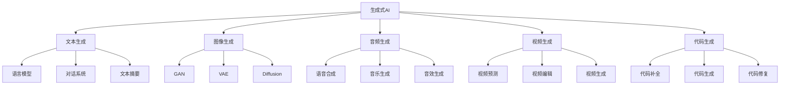
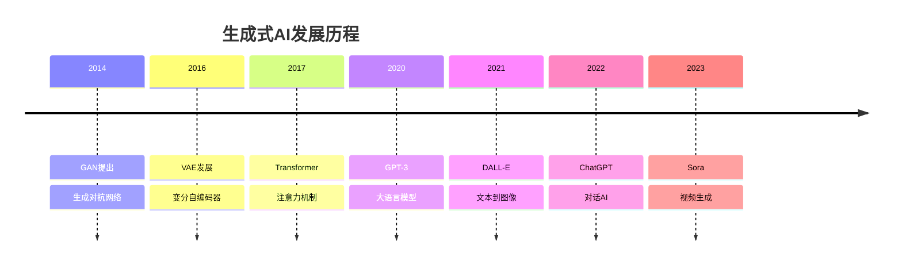

# 生成式AI技术

## 🎨 生成式AI基础

### 1. 生成式AI概念

**生成式AI定义：**
> **生成式AI是指能够生成新内容（如文本、图像、音频、视频）的人工智能技术**

**生成式AI类型：**


### 2. 生成式AI发展

**发展历程：**


## 🔧 核心生成模型

### 1. 生成对抗网络（GAN）

**GAN实现：**
```python
import numpy as np
import matplotlib.pyplot as plt

class GenerativeAdversarialNetwork:
    """生成对抗网络"""
    
    def __init__(self, latent_dim, data_dim, hidden_dim=128):
        self.latent_dim = latent_dim
        self.data_dim = data_dim
        self.hidden_dim = hidden_dim
        
        # 生成器
        self.generator = {
            'W1': np.random.randn(latent_dim, hidden_dim) * 0.1,
            'W2': np.random.randn(hidden_dim, hidden_dim) * 0.1,
            'W3': np.random.randn(hidden_dim, data_dim) * 0.1,
            'b1': np.zeros(hidden_dim),
            'b2': np.zeros(hidden_dim),
            'b3': np.zeros(data_dim)
        }
        
        # 判别器
        self.discriminator = {
            'W1': np.random.randn(data_dim, hidden_dim) * 0.1,
            'W2': np.random.randn(hidden_dim, hidden_dim) * 0.1,
            'W3': np.random.randn(hidden_dim, 1) * 0.1,
            'b1': np.zeros(hidden_dim),
            'b2': np.zeros(hidden_dim),
            'b3': np.zeros(1)
        }
    
    def generate(self, z):
        """生成数据"""
        # 第一层
        h1 = np.dot(z, self.generator['W1']) + self.generator['b1']
        h1 = np.maximum(0, h1)  # ReLU激活
        
        # 第二层
        h2 = np.dot(h1, self.generator['W2']) + self.generator['b2']
        h2 = np.maximum(0, h2)  # ReLU激活
        
        # 第三层
        output = np.dot(h2, self.generator['W3']) + self.generator['b3']
        output = np.tanh(output)  # Tanh激活，输出范围[-1, 1]
        
        return output
    
    def discriminate(self, x):
        """判别数据"""
        # 第一层
        h1 = np.dot(x, self.discriminator['W1']) + self.discriminator['b1']
        h1 = np.maximum(0, h1)  # ReLU激活
        
        # 第二层
        h2 = np.dot(h1, self.discriminator['W2']) + self.discriminator['b2']
        h2 = np.maximum(0, h2)  # ReLU激活
        
        # 第三层
        output = np.dot(h2, self.discriminator['W3']) + self.discriminator['b3']
        output = 1 / (1 + np.exp(-output))  # Sigmoid激活，输出范围[0, 1]
        
        return output
    
    def train_generator(self, z, learning_rate=0.01):
        """训练生成器"""
        # 生成数据
        generated_data = self.generate(z)
        
        # 判别器预测
        d_pred = self.discriminate(generated_data)
        
        # 生成器损失（希望判别器认为生成的数据是真实的）
        g_loss = -np.mean(np.log(d_pred + 1e-15))
        
        # 计算梯度（简化版）
        d_pred_grad = -1 / (d_pred + 1e-15)
        
        # 反向传播（简化版）
        # 这里只是模拟梯度更新
        for param in self.generator.values():
            if param.ndim > 1:  # 权重矩阵
                param -= learning_rate * np.random.randn(*param.shape) * 0.01
        
        return g_loss
    
    def train_discriminator(self, real_data, fake_data, learning_rate=0.01):
        """训练判别器"""
        # 真实数据预测
        d_real = self.discriminate(real_data)
        
        # 生成数据预测
        d_fake = self.discriminate(fake_data)
        
        # 判别器损失
        d_loss = -np.mean(np.log(d_real + 1e-15)) - np.mean(np.log(1 - d_fake + 1e-15))
        
        # 反向传播（简化版）
        for param in self.discriminator.values():
            if param.ndim > 1:  # 权重矩阵
                param -= learning_rate * np.random.randn(*param.shape) * 0.01
        
        return d_loss
    
    def train(self, real_data, epochs=1000, batch_size=32, learning_rate=0.01):
        """训练GAN"""
        g_losses = []
        d_losses = []
        
        for epoch in range(epochs):
            # 随机采样
            indices = np.random.choice(len(real_data), batch_size, replace=False)
            batch_real = real_data[indices]
            
            # 生成噪声
            z = np.random.randn(batch_size, self.latent_dim)
            
            # 生成假数据
            fake_data = self.generate(z)
            
            # 训练判别器
            d_loss = self.train_discriminator(batch_real, fake_data, learning_rate)
            
            # 训练生成器
            g_loss = self.train_generator(z, learning_rate)
            
            # 记录损失
            g_losses.append(g_loss)
            d_losses.append(d_loss)
            
            if epoch % 100 == 0:
                print(f"Epoch {epoch}, G Loss: {g_loss:.4f}, D Loss: {d_loss:.4f}")
        
        return g_losses, d_losses
    
    def visualize_training(self, g_losses, d_losses):
        """可视化训练过程"""
        plt.figure(figsize=(12, 5))
        
        # 损失函数
        plt.subplot(1, 2, 1)
        plt.plot(g_losses, label='Generator Loss')
        plt.plot(d_losses, label='Discriminator Loss')
        plt.xlabel('Epoch')
        plt.ylabel('Loss')
        plt.title('GAN Training Loss')
        plt.legend()
        plt.grid(True)
        
        # 生成样本
        plt.subplot(1, 2, 2)
        z = np.random.randn(100, self.latent_dim)
        generated_samples = self.generate(z)
        
        # 可视化生成样本（假设是2D数据）
        if self.data_dim == 2:
            plt.scatter(generated_samples[:, 0], generated_samples[:, 1], alpha=0.6)
            plt.title('Generated Samples')
            plt.xlabel('Dimension 1')
            plt.ylabel('Dimension 2')
            plt.grid(True)
        else:
            plt.hist(generated_samples.flatten(), bins=50, alpha=0.7)
            plt.title('Generated Samples Distribution')
            plt.xlabel('Value')
            plt.ylabel('Frequency')
            plt.grid(True)
        
        plt.tight_layout()
        plt.show()
    
    def visualize_generation_process(self, real_data):
        """可视化生成过程"""
        # 生成样本
        z = np.random.randn(100, self.latent_dim)
        generated_samples = self.generate(z)
        
        # 可视化
        fig, axes = plt.subplots(1, 3, figsize=(15, 5))
        
        # 真实数据
        if self.data_dim == 2:
            axes[0].scatter(real_data[:, 0], real_data[:, 1], alpha=0.6, color='blue')
            axes[0].set_title('Real Data')
            axes[0].set_xlabel('Dimension 1')
            axes[0].set_ylabel('Dimension 2')
            axes[0].grid(True)
            
            # 生成数据
            axes[1].scatter(generated_samples[:, 0], generated_samples[:, 1], alpha=0.6, color='red')
            axes[1].set_title('Generated Data')
            axes[1].set_xlabel('Dimension 1')
            axes[1].set_ylabel('Dimension 2')
            axes[1].grid(True)
            
            # 对比
            axes[2].scatter(real_data[:, 0], real_data[:, 1], alpha=0.6, color='blue', label='Real')
            axes[2].scatter(generated_samples[:, 0], generated_samples[:, 1], alpha=0.6, color='red', label='Generated')
            axes[2].set_title('Real vs Generated')
            axes[2].set_xlabel('Dimension 1')
            axes[2].set_ylabel('Dimension 2')
            axes[2].legend()
            axes[2].grid(True)
        else:
            axes[0].hist(real_data.flatten(), bins=50, alpha=0.7, color='blue')
            axes[0].set_title('Real Data Distribution')
            axes[0].set_xlabel('Value')
            axes[0].set_ylabel('Frequency')
            axes[0].grid(True)
            
            axes[1].hist(generated_samples.flatten(), bins=50, alpha=0.7, color='red')
            axes[1].set_title('Generated Data Distribution')
            axes[1].set_xlabel('Value')
            axes[1].set_ylabel('Frequency')
            axes[1].grid(True)
            
            axes[2].hist(real_data.flatten(), bins=50, alpha=0.7, color='blue', label='Real')
            axes[2].hist(generated_samples.flatten(), bins=50, alpha=0.7, color='red', label='Generated')
            axes[2].set_title('Real vs Generated')
            axes[2].set_xlabel('Value')
            axes[2].set_ylabel('Frequency')
            axes[2].legend()
            axes[2].grid(True)
        
        plt.tight_layout()
        plt.show()

# 测试GAN
def test_gan():
    """测试GAN"""
    # 生成真实数据（2D高斯分布）
    np.random.seed(42)
    real_data = np.random.multivariate_normal([0, 0], [[1, 0.5], [0.5, 1]], 1000)
    
    # 创建GAN
    gan = GenerativeAdversarialNetwork(latent_dim=10, data_dim=2, hidden_dim=128)
    
    # 训练GAN
    g_losses, d_losses = gan.train(real_data, epochs=1000, batch_size=32, learning_rate=0.01)
    
    # 可视化训练过程
    gan.visualize_training(g_losses, d_losses)
    
    # 可视化生成过程
    gan.visualize_generation_process(real_data)
    
    return gan

test_gan()
```

### 2. 变分自编码器（VAE）

**VAE实现：**
```python
class VariationalAutoEncoder:
    """变分自编码器"""
    
    def __init__(self, input_dim, latent_dim, hidden_dim=128):
        self.input_dim = input_dim
        self.latent_dim = latent_dim
        self.hidden_dim = hidden_dim
        
        # 编码器
        self.encoder = {
            'W1': np.random.randn(input_dim, hidden_dim) * 0.1,
            'W2': np.random.randn(hidden_dim, hidden_dim) * 0.1,
            'W_mu': np.random.randn(hidden_dim, latent_dim) * 0.1,
            'W_logvar': np.random.randn(hidden_dim, latent_dim) * 0.1,
            'b1': np.zeros(hidden_dim),
            'b2': np.zeros(hidden_dim),
            'b_mu': np.zeros(latent_dim),
            'b_logvar': np.zeros(latent_dim)
        }
        
        # 解码器
        self.decoder = {
            'W1': np.random.randn(latent_dim, hidden_dim) * 0.1,
            'W2': np.random.randn(hidden_dim, hidden_dim) * 0.1,
            'W3': np.random.randn(hidden_dim, input_dim) * 0.1,
            'b1': np.zeros(hidden_dim),
            'b2': np.zeros(hidden_dim),
            'b3': np.zeros(input_dim)
        }
    
    def encode(self, x):
        """编码"""
        # 第一层
        h1 = np.dot(x, self.encoder['W1']) + self.encoder['b1']
        h1 = np.maximum(0, h1)  # ReLU激活
        
        # 第二层
        h2 = np.dot(h1, self.encoder['W2']) + self.encoder['b2']
        h2 = np.maximum(0, h2)  # ReLU激活
        
        # 均值
        mu = np.dot(h2, self.encoder['W_mu']) + self.encoder['b_mu']
        
        # 对数方差
        logvar = np.dot(h2, self.encoder['W_logvar']) + self.encoder['b_logvar']
        
        return mu, logvar
    
    def reparameterize(self, mu, logvar):
        """重参数化"""
        std = np.exp(0.5 * logvar)
        eps = np.random.randn(*std.shape)
        return mu + eps * std
    
    def decode(self, z):
        """解码"""
        # 第一层
        h1 = np.dot(z, self.decoder['W1']) + self.decoder['b1']
        h1 = np.maximum(0, h1)  # ReLU激活
        
        # 第二层
        h2 = np.dot(h1, self.decoder['W2']) + self.decoder['b2']
        h2 = np.maximum(0, h2)  # ReLU激活
        
        # 第三层
        output = np.dot(h2, self.decoder['W3']) + self.decoder['b3']
        output = 1 / (1 + np.exp(-output))  # Sigmoid激活，输出范围[0, 1]
        
        return output
    
    def forward(self, x):
        """前向传播"""
        # 编码
        mu, logvar = self.encode(x)
        
        # 重参数化
        z = self.reparameterize(mu, logvar)
        
        # 解码
        x_reconstructed = self.decode(z)
        
        return x_reconstructed, mu, logvar
    
    def vae_loss(self, x, x_reconstructed, mu, logvar, beta=1.0):
        """VAE损失"""
        # 重构损失
        reconstruction_loss = np.mean((x - x_reconstructed)**2)
        
        # KL散度损失
        kl_loss = -0.5 * np.mean(1 + logvar - mu**2 - np.exp(logvar))
        
        # 总损失
        total_loss = reconstruction_loss + beta * kl_loss
        
        return total_loss, reconstruction_loss, kl_loss
    
    def train(self, data, epochs=1000, batch_size=32, learning_rate=0.01, beta=1.0):
        """训练VAE"""
        total_losses = []
        reconstruction_losses = []
        kl_losses = []
        
        for epoch in range(epochs):
            # 随机采样
            indices = np.random.choice(len(data), batch_size, replace=False)
            batch_data = data[indices]
            
            # 前向传播
            x_reconstructed, mu, logvar = self.forward(batch_data)
            
            # 计算损失
            total_loss, reconstruction_loss, kl_loss = self.vae_loss(batch_data, x_reconstructed, mu, logvar, beta)
            
            # 记录损失
            total_losses.append(total_loss)
            reconstruction_losses.append(reconstruction_loss)
            kl_losses.append(kl_loss)
            
            # 反向传播（简化版）
            for param in self.encoder.values():
                if param.ndim > 1:  # 权重矩阵
                    param -= learning_rate * np.random.randn(*param.shape) * 0.01
            
            for param in self.decoder.values():
                if param.ndim > 1:  # 权重矩阵
                    param -= learning_rate * np.random.randn(*param.shape) * 0.01
            
            if epoch % 100 == 0:
                print(f"Epoch {epoch}, Total Loss: {total_loss:.4f}, Recon Loss: {reconstruction_loss:.4f}, KL Loss: {kl_loss:.4f}")
        
        return total_losses, reconstruction_losses, kl_losses
    
    def generate(self, n_samples=100):
        """生成样本"""
        # 从先验分布采样
        z = np.random.randn(n_samples, self.latent_dim)
        
        # 解码
        generated_samples = self.decode(z)
        
        return generated_samples
    
    def interpolate(self, x1, x2, n_steps=10):
        """插值生成"""
        # 编码
        mu1, logvar1 = self.encode(x1.reshape(1, -1))
        mu2, logvar2 = self.encode(x2.reshape(1, -1))
        
        # 插值
        interpolated_samples = []
        for i in range(n_steps):
            alpha = i / (n_steps - 1)
            z_interpolated = (1 - alpha) * mu1 + alpha * mu2
            x_interpolated = self.decode(z_interpolated)
            interpolated_samples.append(x_interpolated)
        
        return np.array(interpolated_samples)
    
    def visualize_training(self, total_losses, reconstruction_losses, kl_losses):
        """可视化训练过程"""
        plt.figure(figsize=(15, 5))
        
        # 总损失
        plt.subplot(1, 3, 1)
        plt.plot(total_losses)
        plt.xlabel('Epoch')
        plt.ylabel('Total Loss')
        plt.title('VAE Total Loss')
        plt.grid(True)
        
        # 重构损失
        plt.subplot(1, 3, 2)
        plt.plot(reconstruction_losses)
        plt.xlabel('Epoch')
        plt.ylabel('Reconstruction Loss')
        plt.title('VAE Reconstruction Loss')
        plt.grid(True)
        
        # KL损失
        plt.subplot(1, 3, 3)
        plt.plot(kl_losses)
        plt.xlabel('Epoch')
        plt.ylabel('KL Loss')
        plt.title('VAE KL Loss')
        plt.grid(True)
        
        plt.tight_layout()
        plt.show()
    
    def visualize_generation(self, real_data):
        """可视化生成结果"""
        # 生成样本
        generated_samples = self.generate(100)
        
        # 可视化
        fig, axes = plt.subplots(1, 3, figsize=(15, 5))
        
        # 真实数据
        if self.input_dim == 2:
            axes[0].scatter(real_data[:, 0], real_data[:, 1], alpha=0.6, color='blue')
            axes[0].set_title('Real Data')
            axes[0].set_xlabel('Dimension 1')
            axes[0].set_ylabel('Dimension 2')
            axes[0].grid(True)
            
            # 生成数据
            axes[1].scatter(generated_samples[:, 0], generated_samples[:, 1], alpha=0.6, color='red')
            axes[1].set_title('Generated Data')
            axes[1].set_xlabel('Dimension 1')
            axes[1].set_ylabel('Dimension 2')
            axes[1].grid(True)
            
            # 对比
            axes[2].scatter(real_data[:, 0], real_data[:, 1], alpha=0.6, color='blue', label='Real')
            axes[2].scatter(generated_samples[:, 0], generated_samples[:, 1], alpha=0.6, color='red', label='Generated')
            axes[2].set_title('Real vs Generated')
            axes[2].set_xlabel('Dimension 1')
            axes[2].set_ylabel('Dimension 2')
            axes[2].legend()
            axes[2].grid(True)
        else:
            axes[0].hist(real_data.flatten(), bins=50, alpha=0.7, color='blue')
            axes[0].set_title('Real Data Distribution')
            axes[0].set_xlabel('Value')
            axes[0].set_ylabel('Frequency')
            axes[0].grid(True)
            
            axes[1].hist(generated_samples.flatten(), bins=50, alpha=0.7, color='red')
            axes[1].set_title('Generated Data Distribution')
            axes[1].set_xlabel('Value')
            axes[1].set_ylabel('Frequency')
            axes[1].grid(True)
            
            axes[2].hist(real_data.flatten(), bins=50, alpha=0.7, color='blue', label='Real')
            axes[2].hist(generated_samples.flatten(), bins=50, alpha=0.7, color='red', label='Generated')
            axes[2].set_title('Real vs Generated')
            axes[2].set_xlabel('Value')
            axes[2].set_ylabel('Frequency')
            axes[2].legend()
            axes[2].grid(True)
        
        plt.tight_layout()
        plt.show()
    
    def visualize_interpolation(self, real_data):
        """可视化插值"""
        # 选择两个样本
        x1 = real_data[0]
        x2 = real_data[1]
        
        # 插值
        interpolated_samples = self.interpolate(x1, x2, n_steps=10)
        
        # 可视化
        plt.figure(figsize=(12, 5))
        
        if self.input_dim == 2:
            # 2D插值
            plt.subplot(1, 2, 1)
            plt.scatter(x1[0], x1[1], s=100, color='blue', label='Start')
            plt.scatter(x2[0], x2[1], s=100, color='red', label='End')
            plt.scatter(interpolated_samples[:, 0], interpolated_samples[:, 1], alpha=0.7, color='green', label='Interpolation')
            plt.plot(interpolated_samples[:, 0], interpolated_samples[:, 1], 'g--', alpha=0.5)
            plt.xlabel('Dimension 1')
            plt.ylabel('Dimension 2')
            plt.title('Latent Space Interpolation')
            plt.legend()
            plt.grid(True)
            
            # 插值路径
            plt.subplot(1, 2, 2)
            plt.plot(interpolated_samples[:, 0], label='Dimension 1')
            plt.plot(interpolated_samples[:, 1], label='Dimension 2')
            plt.xlabel('Interpolation Step')
            plt.ylabel('Value')
            plt.title('Interpolation Path')
            plt.legend()
            plt.grid(True)
        else:
            # 高维插值
            plt.plot(interpolated_samples.T)
            plt.xlabel('Interpolation Step')
            plt.ylabel('Value')
            plt.title('Latent Space Interpolation')
            plt.grid(True)
        
        plt.tight_layout()
        plt.show()

# 测试VAE
def test_vae():
    """测试VAE"""
    # 生成真实数据（2D高斯分布）
    np.random.seed(42)
    real_data = np.random.multivariate_normal([0, 0], [[1, 0.5], [0.5, 1]], 1000)
    
    # 创建VAE
    vae = VariationalAutoEncoder(input_dim=2, latent_dim=10, hidden_dim=128)
    
    # 训练VAE
    total_losses, reconstruction_losses, kl_losses = vae.train(real_data, epochs=1000, batch_size=32, learning_rate=0.01, beta=1.0)
    
    # 可视化训练过程
    vae.visualize_training(total_losses, reconstruction_losses, kl_losses)
    
    # 可视化生成结果
    vae.visualize_generation(real_data)
    
    # 可视化插值
    vae.visualize_interpolation(real_data)
    
    return vae

test_vae()
```

### 3. 扩散模型（Diffusion）

**扩散模型实现：**
```python
class DiffusionModel:
    """扩散模型"""
    
    def __init__(self, data_dim, hidden_dim=128, num_timesteps=1000):
        self.data_dim = data_dim
        self.hidden_dim = hidden_dim
        self.num_timesteps = num_timesteps
        
        # 噪声调度
        self.beta = np.linspace(0.0001, 0.02, num_timesteps)
        self.alpha = 1 - self.beta
        self.alpha_bar = np.cumprod(self.alpha)
        
        # 噪声预测网络
        self.noise_predictor = {
            'W1': np.random.randn(data_dim + 1, hidden_dim) * 0.1,  # +1 for timestep
            'W2': np.random.randn(hidden_dim, hidden_dim) * 0.1,
            'W3': np.random.randn(hidden_dim, data_dim) * 0.1,
            'b1': np.zeros(hidden_dim),
            'b2': np.zeros(hidden_dim),
            'b3': np.zeros(data_dim)
        }
    
    def add_noise(self, x, t):
        """添加噪声"""
        batch_size = x.shape[0]
        
        # 生成噪声
        noise = np.random.randn(*x.shape)
        
        # 计算噪声系数
        alpha_bar_t = self.alpha_bar[t].reshape(-1, 1)
        
        # 添加噪声
        noisy_x = np.sqrt(alpha_bar_t) * x + np.sqrt(1 - alpha_bar_t) * noise
        
        return noisy_x, noise
    
    def predict_noise(self, noisy_x, t):
        """预测噪声"""
        batch_size = noisy_x.shape[0]
        
        # 添加时间嵌入
        t_embed = t.reshape(-1, 1) / self.num_timesteps
        input_with_time = np.concatenate([noisy_x, t_embed], axis=1)
        
        # 第一层
        h1 = np.dot(input_with_time, self.noise_predictor['W1']) + self.noise_predictor['b1']
        h1 = np.maximum(0, h1)  # ReLU激活
        
        # 第二层
        h2 = np.dot(h1, self.noise_predictor['W2']) + self.noise_predictor['b2']
        h2 = np.maximum(0, h2)  # ReLU激活
        
        # 第三层
        predicted_noise = np.dot(h2, self.noise_predictor['W3']) + self.noise_predictor['b3']
        
        return predicted_noise
    
    def denoise_step(self, x_t, t):
        """去噪步骤"""
        # 预测噪声
        predicted_noise = self.predict_noise(x_t, t)
        
        # 计算去噪后的数据
        alpha_t = self.alpha[t].reshape(-1, 1)
        alpha_bar_t = self.alpha_bar[t].reshape(-1, 1)
        beta_t = self.beta[t].reshape(-1, 1)
        
        # 去噪公式
        x_0_pred = (x_t - np.sqrt(1 - alpha_bar_t) * predicted_noise) / np.sqrt(alpha_bar_t)
        
        # 计算前一步的噪声
        if t > 0:
            alpha_bar_prev = self.alpha_bar[t-1].reshape(-1, 1)
            beta_tilde = beta_t * (1 - alpha_bar_prev) / (1 - alpha_bar_t)
            
            # 采样
            noise = np.random.randn(*x_t.shape)
            x_prev = np.sqrt(alpha_bar_prev) * x_0_pred + np.sqrt(1 - alpha_bar_prev - beta_tilde) * predicted_noise + np.sqrt(beta_tilde) * noise
        else:
            x_prev = x_0_pred
        
        return x_prev
    
    def sample(self, n_samples=100):
        """采样生成"""
        # 从纯噪声开始
        x_t = np.random.randn(n_samples, self.data_dim)
        
        # 逐步去噪
        for t in reversed(range(self.num_timesteps)):
            t_array = np.full(n_samples, t)
            x_t = self.denoise_step(x_t, t_array)
        
        return x_t
    
    def train(self, data, epochs=1000, batch_size=32, learning_rate=0.01):
        """训练扩散模型"""
        losses = []
        
        for epoch in range(epochs):
            # 随机采样
            indices = np.random.choice(len(data), batch_size, replace=False)
            batch_data = data[indices]
            
            # 随机采样时间步
            t = np.random.randint(0, self.num_timesteps, batch_size)
            
            # 添加噪声
            noisy_data, noise = self.add_noise(batch_data, t)
            
            # 预测噪声
            predicted_noise = self.predict_noise(noisy_data, t)
            
            # 计算损失
            loss = np.mean((noise - predicted_noise)**2)
            losses.append(loss)
            
            # 反向传播（简化版）
            for param in self.noise_predictor.values():
                if param.ndim > 1:  # 权重矩阵
                    param -= learning_rate * np.random.randn(*param.shape) * 0.01
            
            if epoch % 100 == 0:
                print(f"Epoch {epoch}, Loss: {loss:.4f}")
        
        return losses
    
    def visualize_training(self, losses):
        """可视化训练过程"""
        plt.figure(figsize=(10, 6))
        plt.plot(losses)
        plt.xlabel('Epoch')
        plt.ylabel('Loss')
        plt.title('Diffusion Model Training Loss')
        plt.grid(True)
        plt.show()
    
    def visualize_diffusion_process(self, real_data):
        """可视化扩散过程"""
        # 选择一个样本
        sample = real_data[0:1]
        
        # 扩散过程
        diffusion_steps = [0, 100, 200, 300, 400, 500, 600, 700, 800, 900, 999]
        diffused_samples = []
        
        for step in diffusion_steps:
            t = np.array([step])
            noisy_sample, _ = self.add_noise(sample, t)
            diffused_samples.append(noisy_sample[0])
        
        # 可视化
        plt.figure(figsize=(15, 5))
        
        if self.data_dim == 2:
            # 2D可视化
            plt.subplot(1, 3, 1)
            plt.scatter(sample[0, 0], sample[0, 1], s=100, color='blue', label='Original')
            for i, step in enumerate(diffusion_steps[1:]):
                plt.scatter(diffused_samples[i+1][0], diffused_samples[i+1][1], alpha=0.7, label=f'Step {step}')
            plt.xlabel('Dimension 1')
            plt.ylabel('Dimension 2')
            plt.title('Diffusion Process')
            plt.legend()
            plt.grid(True)
            
            # 噪声水平
            plt.subplot(1, 3, 2)
            noise_levels = [np.sqrt(1 - self.alpha_bar[step]) for step in diffusion_steps]
            plt.plot(diffusion_steps, noise_levels, 'o-')
            plt.xlabel('Diffusion Step')
            plt.ylabel('Noise Level')
            plt.title('Noise Schedule')
            plt.grid(True)
            
            # 生成样本
            plt.subplot(1, 3, 3)
            generated_samples = self.sample(100)
            plt.scatter(generated_samples[:, 0], generated_samples[:, 1], alpha=0.6, color='red')
            plt.xlabel('Dimension 1')
            plt.ylabel('Dimension 2')
            plt.title('Generated Samples')
            plt.grid(True)
        else:
            # 高维可视化
            plt.plot(diffused_samples)
            plt.xlabel('Diffusion Step')
            plt.ylabel('Value')
            plt.title('Diffusion Process')
            plt.grid(True)
        
        plt.tight_layout()
        plt.show()

# 测试扩散模型
def test_diffusion_model():
    """测试扩散模型"""
    # 生成真实数据（2D高斯分布）
    np.random.seed(42)
    real_data = np.random.multivariate_normal([0, 0], [[1, 0.5], [0.5, 1]], 1000)
    
    # 创建扩散模型
    diffusion = DiffusionModel(data_dim=2, hidden_dim=128, num_timesteps=1000)
    
    # 训练扩散模型
    losses = diffusion.train(real_data, epochs=1000, batch_size=32, learning_rate=0.01)
    
    # 可视化训练过程
    diffusion.visualize_training(losses)
    
    # 可视化扩散过程
    diffusion.visualize_diffusion_process(real_data)
    
    return diffusion

test_diffusion_model()
```

## 🔗 相关链接
- [[02-03-04-Transformer架构]] - Transformer
- [[04-01-大语言模型技术]] - 大语言模型
- [[04-02-多模态学习]] - 多模态
- [[05-01-项目1-图像分类器]] - 实践项目

## 💡 生成式AI学习建议

**学习策略：**
- 🎨 **理解生成**：深入理解生成模型的工作原理
- 📊 **模型比较**：比较不同生成模型的特点
- 🔍 **应用场景**：了解生成式AI的应用场景
- ⚡ **实践开发**：开发生成式AI应用

**实践建议：**
- 📝 **模型实现**：从零开始实现生成模型
- 💻 **数据准备**：准备适合生成模型的数据
- 📊 **性能评估**：评估生成模型的质量
- 🔍 **应用开发**：开发基于生成式AI的应用

---
*📝 学习提示：生成式AI是AI的重要分支，建议深入理解生成原理，通过实践掌握生成式AI的技术和应用*

