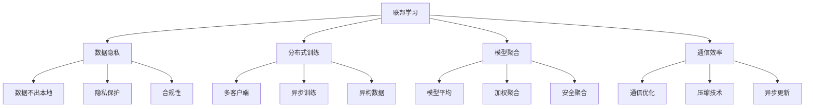
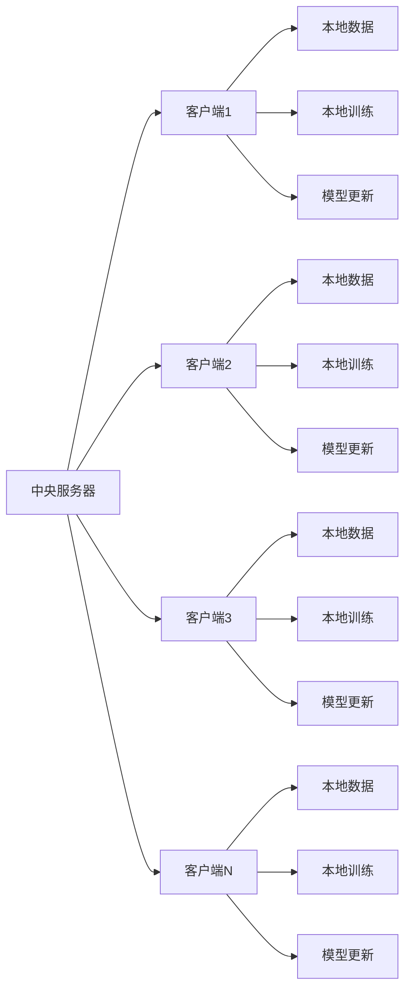

# 联邦学习

## 🌐 联邦学习基础

### 1. 联邦学习概念

**联邦学习定义：**
> **联邦学习是一种分布式机器学习方法，允许多个参与方在不共享原始数据的情况下协同训练模型**

**联邦学习特点：**


### 2. 联邦学习架构

**联邦学习架构：**


## 🔧 联邦学习实现

### 1. 基础联邦学习

**基础联邦学习实现：**
```python
import numpy as np
import matplotlib.pyplot as plt

class FederatedLearning:
    """联邦学习实现"""
    
    def __init__(self, model_dim, num_clients, learning_rate=0.01):
        self.model_dim = model_dim
        self.num_clients = num_clients
        self.learning_rate = learning_rate
        
        # 全局模型
        self.global_model = np.random.randn(model_dim) * 0.1
        
        # 客户端模型
        self.client_models = [np.random.randn(model_dim) * 0.1 for _ in range(num_clients)]
        
        # 客户端数据
        self.client_data = []
        self.client_labels = []
        
        # 训练历史
        self.global_losses = []
        self.client_losses = [[] for _ in range(num_clients)]
    
    def generate_client_data(self, data_per_client=100, noise_level=0.1):
        """生成客户端数据"""
        for i in range(self.num_clients):
            # 生成不同的数据分布
            center = np.random.randn(self.model_dim) * 2
            X = np.random.randn(data_per_client, self.model_dim) + center
            y = np.random.randn(data_per_client) + np.dot(X, center) + noise_level * np.random.randn(data_per_client)
            
            self.client_data.append(X)
            self.client_labels.append(y)
    
    def local_train(self, client_id, epochs=10):
        """本地训练"""
        X = self.client_data[client_id]
        y = self.client_labels[client_id]
        
        # 初始化本地模型
        local_model = self.global_model.copy()
        
        # 本地训练
        for epoch in range(epochs):
            # 前向传播
            y_pred = np.dot(X, local_model)
            
            # 计算损失
            loss = np.mean((y - y_pred)**2)
            self.client_losses[client_id].append(loss)
            
            # 计算梯度
            gradient = -2 * np.dot(X.T, (y - y_pred)) / len(y)
            
            # 更新模型
            local_model -= self.learning_rate * gradient
        
        # 更新客户端模型
        self.client_models[client_id] = local_model
        
        return local_model
    
    def federated_averaging(self, client_weights=None):
        """联邦平均"""
        if client_weights is None:
            # 等权重平均
            client_weights = [1.0 / self.num_clients] * self.num_clients
        
        # 加权平均
        global_model = np.zeros(self.model_dim)
        for i in range(self.num_clients):
            global_model += client_weights[i] * self.client_models[i]
        
        # 更新全局模型
        self.global_model = global_model
        
        return global_model
    
    def evaluate_global_model(self):
        """评估全局模型"""
        total_loss = 0
        total_samples = 0
        
        for i in range(self.num_clients):
            X = self.client_data[i]
            y = self.client_labels[i]
            
            # 预测
            y_pred = np.dot(X, self.global_model)
            
            # 计算损失
            loss = np.mean((y - y_pred)**2)
            total_loss += loss * len(y)
            total_samples += len(y)
        
        avg_loss = total_loss / total_samples
        self.global_losses.append(avg_loss)
        
        return avg_loss
    
    def train_federated(self, rounds=100, local_epochs=10, client_weights=None):
        """联邦训练"""
        for round_num in range(rounds):
            # 本地训练
            for client_id in range(self.num_clients):
                self.local_train(client_id, epochs=local_epochs)
            
            # 联邦平均
            self.federated_averaging(client_weights)
            
            # 评估全局模型
            global_loss = self.evaluate_global_model()
            
            if round_num % 10 == 0:
                print(f"Round {round_num}, Global Loss: {global_loss:.4f}")
        
        return self.global_losses
    
    def visualize_training(self):
        """可视化训练过程"""
        plt.figure(figsize=(15, 5))
        
        # 全局损失
        plt.subplot(1, 3, 1)
        plt.plot(self.global_losses)
        plt.xlabel('Round')
        plt.ylabel('Global Loss')
        plt.title('Federated Learning Global Loss')
        plt.grid(True)
        
        # 客户端损失
        plt.subplot(1, 3, 2)
        for i in range(self.num_clients):
            plt.plot(self.client_losses[i], alpha=0.7, label=f'Client {i}')
        plt.xlabel('Local Epoch')
        plt.ylabel('Local Loss')
        plt.title('Client Local Losses')
        plt.legend()
        plt.grid(True)
        
        # 模型差异
        plt.subplot(1, 3, 3)
        model_differences = []
        for i in range(self.num_clients):
            diff = np.linalg.norm(self.client_models[i] - self.global_model)
            model_differences.append(diff)
        
        plt.bar(range(self.num_clients), model_differences)
        plt.xlabel('Client')
        plt.ylabel('Model Difference')
        plt.title('Model Differences from Global')
        plt.grid(True)
        
        plt.tight_layout()
        plt.show()
    
    def analyze_convergence(self):
        """分析收敛性"""
        # 计算收敛指标
        if len(self.global_losses) > 10:
            recent_losses = self.global_losses[-10:]
            convergence_rate = (recent_losses[0] - recent_losses[-1]) / recent_losses[0]
            
            print(f"收敛率: {convergence_rate:.4f}")
            
            # 可视化收敛
            plt.figure(figsize=(10, 6))
            plt.plot(self.global_losses)
            plt.xlabel('Round')
            plt.ylabel('Global Loss')
            plt.title('Federated Learning Convergence')
            plt.grid(True)
            plt.show()
            
            return convergence_rate
        
        return None

# 测试联邦学习
def test_federated_learning():
    """测试联邦学习"""
    # 创建联邦学习系统
    fl = FederatedLearning(model_dim=10, num_clients=5, learning_rate=0.01)
    
    # 生成客户端数据
    fl.generate_client_data(data_per_client=100, noise_level=0.1)
    
    # 联邦训练
    global_losses = fl.train_federated(rounds=100, local_epochs=10)
    
    # 可视化训练过程
    fl.visualize_training()
    
    # 分析收敛性
    convergence_rate = fl.analyze_convergence()
    
    return fl

test_federated_learning()
```

### 2. 安全联邦学习

**安全联邦学习实现：**
```python
class SecureFederatedLearning:
    """安全联邦学习"""
    
    def __init__(self, model_dim, num_clients, learning_rate=0.01, noise_scale=0.1):
        self.model_dim = model_dim
        self.num_clients = num_clients
        self.learning_rate = learning_rate
        self.noise_scale = noise_scale
        
        # 全局模型
        self.global_model = np.random.randn(model_dim) * 0.1
        
        # 客户端模型
        self.client_models = [np.random.randn(model_dim) * 0.1 for _ in range(num_clients)]
        
        # 客户端数据
        self.client_data = []
        self.client_labels = []
        
        # 训练历史
        self.global_losses = []
        self.privacy_budgets = []
    
    def generate_client_data(self, data_per_client=100, noise_level=0.1):
        """生成客户端数据"""
        for i in range(self.num_clients):
            # 生成不同的数据分布
            center = np.random.randn(self.model_dim) * 2
            X = np.random.randn(data_per_client, self.model_dim) + center
            y = np.random.randn(data_per_client) + np.dot(X, center) + noise_level * np.random.randn(data_per_client)
            
            self.client_data.append(X)
            self.client_labels.append(y)
    
    def add_differential_privacy(self, gradient, sensitivity=1.0, epsilon=1.0):
        """添加差分隐私"""
        # 计算噪声
        noise = np.random.laplace(0, sensitivity / epsilon, gradient.shape)
        
        # 添加噪声
        noisy_gradient = gradient + noise
        
        return noisy_gradient
    
    def secure_aggregation(self, client_updates, threshold=0.5):
        """安全聚合"""
        # 选择参与聚合的客户端
        num_participants = int(self.num_clients * threshold)
        participant_indices = np.random.choice(self.num_clients, num_participants, replace=False)
        
        # 聚合参与客户端的更新
        aggregated_update = np.zeros(self.model_dim)
        for idx in participant_indices:
            aggregated_update += client_updates[idx]
        
        # 平均化
        aggregated_update /= num_participants
        
        return aggregated_update
    
    def local_train_secure(self, client_id, epochs=10, epsilon=1.0):
        """安全本地训练"""
        X = self.client_data[client_id]
        y = self.client_labels[client_id]
        
        # 初始化本地模型
        local_model = self.global_model.copy()
        
        # 本地训练
        for epoch in range(epochs):
            # 前向传播
            y_pred = np.dot(X, local_model)
            
            # 计算梯度
            gradient = -2 * np.dot(X.T, (y - y_pred)) / len(y)
            
            # 添加差分隐私
            noisy_gradient = self.add_differential_privacy(gradient, sensitivity=1.0, epsilon=epsilon)
            
            # 更新模型
            local_model -= self.learning_rate * noisy_gradient
        
        # 更新客户端模型
        self.client_models[client_id] = local_model
        
        return local_model
    
    def train_secure_federated(self, rounds=100, local_epochs=10, epsilon=1.0, participation_rate=0.8):
        """安全联邦训练"""
        for round_num in range(rounds):
            # 选择参与的客户端
            num_participants = int(self.num_clients * participation_rate)
            participant_indices = np.random.choice(self.num_clients, num_participants, replace=False)
            
            # 本地训练
            client_updates = []
            for client_id in participant_indices:
                local_model = self.local_train_secure(client_id, epochs=local_epochs, epsilon=epsilon)
                client_updates.append(local_model - self.global_model)
            
            # 安全聚合
            aggregated_update = self.secure_aggregation(client_updates, threshold=participation_rate)
            
            # 更新全局模型
            self.global_model += aggregated_update
            
            # 评估全局模型
            global_loss = self.evaluate_global_model()
            
            # 计算隐私预算
            privacy_budget = epsilon * num_participants
            self.privacy_budgets.append(privacy_budget)
            
            if round_num % 10 == 0:
                print(f"Round {round_num}, Global Loss: {global_loss:.4f}, Privacy Budget: {privacy_budget:.4f}")
        
        return self.global_losses
    
    def evaluate_global_model(self):
        """评估全局模型"""
        total_loss = 0
        total_samples = 0
        
        for i in range(self.num_clients):
            X = self.client_data[i]
            y = self.client_labels[i]
            
            # 预测
            y_pred = np.dot(X, self.global_model)
            
            # 计算损失
            loss = np.mean((y - y_pred)**2)
            total_loss += loss * len(y)
            total_samples += len(y)
        
        avg_loss = total_loss / total_samples
        self.global_losses.append(avg_loss)
        
        return avg_loss
    
    def visualize_secure_training(self):
        """可视化安全训练过程"""
        plt.figure(figsize=(15, 5))
        
        # 全局损失
        plt.subplot(1, 3, 1)
        plt.plot(self.global_losses)
        plt.xlabel('Round')
        plt.ylabel('Global Loss')
        plt.title('Secure Federated Learning Global Loss')
        plt.grid(True)
        
        # 隐私预算
        plt.subplot(1, 3, 2)
        plt.plot(self.privacy_budgets)
        plt.xlabel('Round')
        plt.ylabel('Privacy Budget')
        plt.title('Privacy Budget Consumption')
        plt.grid(True)
        
        # 模型稳定性
        plt.subplot(1, 3, 3)
        model_norms = [np.linalg.norm(self.global_model) for _ in range(len(self.global_losses))]
        plt.plot(model_norms)
        plt.xlabel('Round')
        plt.ylabel('Model Norm')
        plt.title('Model Stability')
        plt.grid(True)
        
        plt.tight_layout()
        plt.show()
    
    def analyze_privacy_utility_tradeoff(self, epsilon_values=[0.1, 0.5, 1.0, 2.0]):
        """分析隐私-效用权衡"""
        results = {}
        
        for epsilon in epsilon_values:
            # 重新初始化
            self.global_model = np.random.randn(self.model_dim) * 0.1
            self.client_models = [np.random.randn(self.model_dim) * 0.1 for _ in range(self.num_clients)]
            self.global_losses = []
            self.privacy_budgets = []
            
            # 训练
            losses = self.train_secure_federated(rounds=50, local_epochs=5, epsilon=epsilon)
            
            results[epsilon] = {
                'final_loss': losses[-1],
                'privacy_budget': self.privacy_budgets[-1],
                'convergence_rate': (losses[0] - losses[-1]) / losses[0]
            }
        
        # 可视化权衡
        plt.figure(figsize=(12, 5))
        
        # 隐私预算vs最终损失
        plt.subplot(1, 2, 1)
        epsilons = list(results.keys())
        final_losses = [results[eps]['final_loss'] for eps in epsilons]
        privacy_budgets = [results[eps]['privacy_budget'] for eps in epsilons]
        
        plt.scatter(privacy_budgets, final_losses, s=100, alpha=0.7)
        for i, eps in enumerate(epsilons):
            plt.annotate(f'ε={eps}', (privacy_budgets[i], final_losses[i]), 
                        xytext=(5, 5), textcoords='offset points')
        plt.xlabel('Privacy Budget')
        plt.ylabel('Final Loss')
        plt.title('Privacy-Utility Tradeoff')
        plt.grid(True)
        
        # 收敛率vs隐私预算
        plt.subplot(1, 2, 2)
        convergence_rates = [results[eps]['convergence_rate'] for eps in epsilons]
        
        plt.scatter(privacy_budgets, convergence_rates, s=100, alpha=0.7)
        for i, eps in enumerate(epsilons):
            plt.annotate(f'ε={eps}', (privacy_budgets[i], convergence_rates[i]), 
                        xytext=(5, 5), textcoords='offset points')
        plt.xlabel('Privacy Budget')
        plt.ylabel('Convergence Rate')
        plt.title('Privacy-Convergence Tradeoff')
        plt.grid(True)
        
        plt.tight_layout()
        plt.show()
        
        return results

# 测试安全联邦学习
def test_secure_federated_learning():
    """测试安全联邦学习"""
    # 创建安全联邦学习系统
    sfl = SecureFederatedLearning(model_dim=10, num_clients=5, learning_rate=0.01, noise_scale=0.1)
    
    # 生成客户端数据
    sfl.generate_client_data(data_per_client=100, noise_level=0.1)
    
    # 安全联邦训练
    global_losses = sfl.train_secure_federated(rounds=100, local_epochs=10, epsilon=1.0)
    
    # 可视化训练过程
    sfl.visualize_secure_training()
    
    # 分析隐私-效用权衡
    results = sfl.analyze_privacy_utility_tradeoff()
    
    return sfl

test_secure_federated_learning()
```

### 3. 异构联邦学习

**异构联邦学习实现：**
```python
class HeterogeneousFederatedLearning:
    """异构联邦学习"""
    
    def __init__(self, model_dim, num_clients, learning_rate=0.01):
        self.model_dim = model_dim
        self.num_clients = num_clients
        self.learning_rate = learning_rate
        
        # 全局模型
        self.global_model = np.random.randn(model_dim) * 0.1
        
        # 客户端模型
        self.client_models = [np.random.randn(model_dim) * 0.1 for _ in range(num_clients)]
        
        # 客户端数据
        self.client_data = []
        self.client_labels = []
        
        # 客户端特性
        self.client_characteristics = {
            'data_size': [],
            'data_quality': [],
            'compute_capability': [],
            'communication_cost': []
        }
        
        # 训练历史
        self.global_losses = []
        self.client_contributions = []
    
    def generate_heterogeneous_client_data(self, base_data_per_client=100, noise_level=0.1):
        """生成异构客户端数据"""
        for i in range(self.num_clients):
            # 随机生成客户端特性
            data_size = np.random.randint(50, 200)  # 不同的数据量
            data_quality = np.random.uniform(0.5, 1.0)  # 不同的数据质量
            compute_capability = np.random.uniform(0.3, 1.0)  # 不同的计算能力
            communication_cost = np.random.uniform(0.1, 1.0)  # 不同的通信成本
            
            # 存储客户端特性
            self.client_characteristics['data_size'].append(data_size)
            self.client_characteristics['data_quality'].append(data_quality)
            self.client_characteristics['compute_capability'].append(compute_capability)
            self.client_characteristics['communication_cost'].append(communication_cost)
            
            # 生成数据
            center = np.random.randn(self.model_dim) * 2
            X = np.random.randn(data_size, self.model_dim) + center
            y = np.random.randn(data_size) + np.dot(X, center) + noise_level * np.random.randn(data_size)
            
            # 根据数据质量添加噪声
            if data_quality < 1.0:
                noise = np.random.randn(data_size) * (1 - data_quality)
                y += noise
            
            self.client_data.append(X)
            self.client_labels.append(y)
    
    def adaptive_local_train(self, client_id, epochs=10):
        """自适应本地训练"""
        X = self.client_data[client_id]
        y = self.client_labels[client_id]
        
        # 根据计算能力调整训练轮数
        compute_capability = self.client_characteristics['compute_capability'][client_id]
        adaptive_epochs = int(epochs * compute_capability)
        
        # 初始化本地模型
        local_model = self.global_model.copy()
        
        # 本地训练
        for epoch in range(adaptive_epochs):
            # 前向传播
            y_pred = np.dot(X, local_model)
            
            # 计算损失
            loss = np.mean((y - y_pred)**2)
            
            # 计算梯度
            gradient = -2 * np.dot(X.T, (y - y_pred)) / len(y)
            
            # 根据数据质量调整学习率
            data_quality = self.client_characteristics['data_quality'][client_id]
            adaptive_lr = self.learning_rate * data_quality
            
            # 更新模型
            local_model -= adaptive_lr * gradient
        
        # 更新客户端模型
        self.client_models[client_id] = local_model
        
        return local_model
    
    def weighted_federated_averaging(self):
        """加权联邦平均"""
        # 计算客户端权重
        client_weights = []
        for i in range(self.num_clients):
            # 基于数据量、数据质量和计算能力的综合权重
            data_size_weight = self.client_characteristics['data_size'][i] / sum(self.client_characteristics['data_size'])
            data_quality_weight = self.client_characteristics['data_quality'][i]
            compute_weight = self.client_characteristics['compute_capability'][i]
            
            # 综合权重
            weight = data_size_weight * data_quality_weight * compute_weight
            client_weights.append(weight)
        
        # 归一化权重
        total_weight = sum(client_weights)
        client_weights = [w / total_weight for w in client_weights]
        
        # 加权平均
        global_model = np.zeros(self.model_dim)
        for i in range(self.num_clients):
            global_model += client_weights[i] * self.client_models[i]
        
        # 更新全局模型
        self.global_model = global_model
        
        # 记录客户端贡献
        self.client_contributions.append(client_weights)
        
        return global_model, client_weights
    
    def client_selection(self, selection_ratio=0.8):
        """客户端选择"""
        # 基于通信成本和计算能力选择客户端
        scores = []
        for i in range(self.num_clients):
            compute_score = self.client_characteristics['compute_capability'][i]
            comm_cost = self.client_characteristics['communication_cost'][i]
            data_quality = self.client_characteristics['data_quality'][i]
            
            # 综合评分
            score = compute_score * data_quality / (comm_cost + 0.1)
            scores.append(score)
        
        # 选择客户端
        num_selected = int(self.num_clients * selection_ratio)
        selected_indices = np.argsort(scores)[-num_selected:]
        
        return selected_indices
    
    def train_heterogeneous_federated(self, rounds=100, local_epochs=10, selection_ratio=0.8):
        """异构联邦训练"""
        for round_num in range(rounds):
            # 客户端选择
            selected_clients = self.client_selection(selection_ratio)
            
            # 本地训练
            for client_id in selected_clients:
                self.adaptive_local_train(client_id, epochs=local_epochs)
            
            # 加权联邦平均
            global_model, client_weights = self.weighted_federated_averaging()
            
            # 评估全局模型
            global_loss = self.evaluate_global_model()
            
            if round_num % 10 == 0:
                print(f"Round {round_num}, Global Loss: {global_loss:.4f}, Selected Clients: {len(selected_clients)}")
        
        return self.global_losses
    
    def evaluate_global_model(self):
        """评估全局模型"""
        total_loss = 0
        total_samples = 0
        
        for i in range(self.num_clients):
            X = self.client_data[i]
            y = self.client_labels[i]
            
            # 预测
            y_pred = np.dot(X, self.global_model)
            
            # 计算损失
            loss = np.mean((y - y_pred)**2)
            total_loss += loss * len(y)
            total_samples += len(y)
        
        avg_loss = total_loss / total_samples
        self.global_losses.append(avg_loss)
        
        return avg_loss
    
    def visualize_heterogeneous_training(self):
        """可视化异构训练过程"""
        plt.figure(figsize=(15, 10))
        
        # 全局损失
        plt.subplot(2, 3, 1)
        plt.plot(self.global_losses)
        plt.xlabel('Round')
        plt.ylabel('Global Loss')
        plt.title('Heterogeneous Federated Learning Global Loss')
        plt.grid(True)
        
        # 客户端特性
        plt.subplot(2, 3, 2)
        characteristics = ['data_size', 'data_quality', 'compute_capability', 'communication_cost']
        for char in characteristics:
            plt.plot(self.client_characteristics[char], 'o-', label=char)
        plt.xlabel('Client')
        plt.ylabel('Value')
        plt.title('Client Characteristics')
        plt.legend()
        plt.grid(True)
        
        # 客户端贡献
        plt.subplot(2, 3, 3)
        if self.client_contributions:
            contributions = np.array(self.client_contributions)
            plt.plot(contributions)
            plt.xlabel('Round')
            plt.ylabel('Contribution Weight')
            plt.title('Client Contributions Over Time')
            plt.legend([f'Client {i}' for i in range(self.num_clients)])
            plt.grid(True)
        
        # 数据分布
        plt.subplot(2, 3, 4)
        data_sizes = self.client_characteristics['data_size']
        plt.bar(range(self.num_clients), data_sizes)
        plt.xlabel('Client')
        plt.ylabel('Data Size')
        plt.title('Client Data Sizes')
        plt.grid(True)
        
        # 计算能力分布
        plt.subplot(2, 3, 5)
        compute_capabilities = self.client_characteristics['compute_capability']
        plt.bar(range(self.num_clients), compute_capabilities)
        plt.xlabel('Client')
        plt.ylabel('Compute Capability')
        plt.title('Client Compute Capabilities')
        plt.grid(True)
        
        # 通信成本分布
        plt.subplot(2, 3, 6)
        communication_costs = self.client_characteristics['communication_cost']
        plt.bar(range(self.num_clients), communication_costs)
        plt.xlabel('Client')
        plt.ylabel('Communication Cost')
        plt.title('Client Communication Costs')
        plt.grid(True)
        
        plt.tight_layout()
        plt.show()
    
    def analyze_heterogeneity_impact(self):
        """分析异构性影响"""
        # 计算异构性指标
        data_size_std = np.std(self.client_characteristics['data_size'])
        data_quality_std = np.std(self.client_characteristics['data_quality'])
        compute_std = np.std(self.client_characteristics['compute_capability'])
        comm_std = np.std(self.client_characteristics['communication_cost'])
        
        heterogeneity_metrics = {
            'data_size_heterogeneity': data_size_std,
            'data_quality_heterogeneity': data_quality_std,
            'compute_heterogeneity': compute_std,
            'communication_heterogeneity': comm_std
        }
        
        # 可视化异构性指标
        plt.figure(figsize=(10, 6))
        
        metrics = list(heterogeneity_metrics.keys())
        values = list(heterogeneity_metrics.values())
        
        plt.bar(metrics, values)
        plt.xlabel('Heterogeneity Metric')
        plt.ylabel('Standard Deviation')
        plt.title('Client Heterogeneity Analysis')
        plt.xticks(rotation=45)
        plt.grid(True)
        plt.show()
        
        return heterogeneity_metrics

# 测试异构联邦学习
def test_heterogeneous_federated_learning():
    """测试异构联邦学习"""
    # 创建异构联邦学习系统
    hfl = HeterogeneousFederatedLearning(model_dim=10, num_clients=5, learning_rate=0.01)
    
    # 生成异构客户端数据
    hfl.generate_heterogeneous_client_data(base_data_per_client=100, noise_level=0.1)
    
    # 异构联邦训练
    global_losses = hfl.train_heterogeneous_federated(rounds=100, local_epochs=10, selection_ratio=0.8)
    
    # 可视化训练过程
    hfl.visualize_heterogeneous_training()
    
    # 分析异构性影响
    heterogeneity_metrics = hfl.analyze_heterogeneity_impact()
    
    return hfl

test_heterogeneous_federated_learning()
```

## 🔗 相关链接
- [[02-01-01-监督学习原理]] - 监督学习
- [[02-02-01-神经网络原理]] - 神经网络
- [[03-04-01-数据工程基础]] - 数据工程
- [[03-04-04-AI伦理与安全]] - AI伦理

## 💡 联邦学习建议

**学习策略：**
- 🌐 **理解分布式**：深入理解分布式机器学习
- 📊 **隐私保护**：掌握隐私保护技术
- 🔍 **通信优化**：学习通信优化方法
- ⚡ **异构处理**：了解异构数据处理

**实践建议：**
- 📝 **系统实现**：实现联邦学习系统
- 💻 **隐私技术**：应用差分隐私等技术
- 📊 **性能评估**：评估联邦学习性能
- 🔍 **应用开发**：开发联邦学习应用

---
*📝 学习提示：联邦学习是隐私保护的重要技术，建议理解分布式原理，掌握隐私保护方法，通过实践应用联邦学习*


