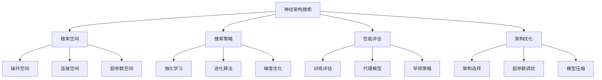

# 神经架构搜索

## 🔍 神经架构搜索基础

### 1. NAS概念

**神经架构搜索定义：**
> **神经架构搜索是一种自动化机器学习方法，通过算法自动搜索最优的神经网络架构**

**NAS核心思想：**


### 2. NAS方法分类

**NAS方法分类：**

| 方法 | 搜索策略 | 评估方式 | 优点 | 缺点 |
|------|----------|----------|------|------|
| **强化学习** | 策略梯度 | 完整训练 | 效果好 | 计算量大 |
| **进化算法** | 遗传算法 | 完整训练 | 稳定 | 速度慢 |
| **梯度优化** | 可微分 | 代理模型 | 快速 | 近似解 |
| **随机搜索** | 随机采样 | 完整训练 | 简单 | 效率低 |

## 🔧 NAS实现

### 1. 强化学习NAS

**强化学习NAS实现：**
```python
import numpy as np
import matplotlib.pyplot as plt

class ReinforcementLearningNAS:
    """强化学习神经架构搜索"""
    
    def __init__(self, search_space, max_layers=10):
        self.search_space = search_space
        self.max_layers = max_layers
        
        # 控制器网络（LSTM）
        self.controller = {
            'W1': np.random.randn(64, 128) * 0.1,
            'W2': np.random.randn(128, 128) * 0.1,
            'W3': np.random.randn(128, len(search_space)) * 0.1,
            'b1': np.zeros(128),
            'b2': np.zeros(128),
            'b3': np.zeros(len(search_space))
        }
        
        # 训练历史
        self.architectures = []
        self.rewards = []
        self.controller_losses = []
    
    def sample_architecture(self):
        """采样架构"""
        architecture = []
        hidden_state = np.zeros(128)
        
        for layer in range(self.max_layers):
            # 控制器前向传播
            h1 = np.tanh(np.dot(hidden_state, self.controller['W1']) + self.controller['b1'])
            h2 = np.tanh(np.dot(h1, self.controller['W2']) + self.controller['b2'])
            logits = np.dot(h2, self.controller['W3']) + self.controller['b3']
            
            # 采样操作
            probabilities = self._softmax(logits)
            operation = np.random.choice(len(self.search_space), p=probabilities)
            
            architecture.append(operation)
            hidden_state = h2
        
        return architecture
    
    def _softmax(self, x):
        """Softmax函数"""
        exp_x = np.exp(x - np.max(x))
        return exp_x / np.sum(exp_x)
    
    def evaluate_architecture(self, architecture):
        """评估架构"""
        # 简化的架构评估（实际中需要训练模型）
        # 这里使用随机奖励模拟
        
        # 计算架构复杂度
        complexity = len(architecture)
        
        # 计算操作多样性
        unique_operations = len(set(architecture))
        diversity = unique_operations / len(self.search_space)
        
        # 模拟性能（实际中需要训练模型）
        base_performance = np.random.uniform(0.5, 0.9)
        
        # 奖励函数
        reward = base_performance + 0.1 * diversity - 0.05 * complexity
        
        return reward
    
    def train_controller(self, architectures, rewards, learning_rate=0.01):
        """训练控制器"""
        # 计算基线
        baseline = np.mean(rewards)
        
        # 计算优势
        advantages = np.array(rewards) - baseline
        
        # 计算策略梯度
        policy_gradients = []
        
        for i, architecture in enumerate(architectures):
            gradient = np.zeros_like(self.controller['W3'])
            
            for layer, operation in enumerate(architecture):
                # 计算梯度
                hidden_state = np.zeros(128)
                
                for l in range(layer + 1):
                    h1 = np.tanh(np.dot(hidden_state, self.controller['W1']) + self.controller['b1'])
                    h2 = np.tanh(np.dot(h1, self.controller['W2']) + self.controller['b2'])
                    logits = np.dot(h2, self.controller['W3']) + self.controller['b3']
                    probabilities = self._softmax(logits)
                    
                    if l == layer:
                        # 计算策略梯度
                        gradient += advantages[i] * np.outer(h2, probabilities)
                        gradient[operation] -= advantages[i] * h2
                    
                    hidden_state = h2
            
            policy_gradients.append(gradient)
        
        # 更新控制器参数
        avg_gradient = np.mean(policy_gradients, axis=0)
        self.controller['W3'] += learning_rate * avg_gradient
        
        # 记录损失
        controller_loss = -np.mean(advantages * np.log(np.array(rewards) + 1e-15))
        self.controller_losses.append(controller_loss)
    
    def search(self, num_episodes=1000, num_samples_per_episode=10):
        """搜索最优架构"""
        best_architecture = None
        best_reward = -np.inf
        
        for episode in range(num_episodes):
            # 采样架构
            architectures = []
            rewards = []
            
            for _ in range(num_samples_per_episode):
                architecture = self.sample_architecture()
                reward = self.evaluate_architecture(architecture)
                
                architectures.append(architecture)
                rewards.append(reward)
                
                # 更新最佳架构
                if reward > best_reward:
                    best_reward = reward
                    best_architecture = architecture
            
            # 训练控制器
            self.train_controller(architectures, rewards)
            
            # 记录历史
            self.architectures.extend(architectures)
            self.rewards.extend(rewards)
            
            if episode % 100 == 0:
                print(f"Episode {episode}, Best Reward: {best_reward:.4f}, Avg Reward: {np.mean(rewards):.4f}")
        
        return best_architecture, best_reward
    
    def visualize_search_process(self):
        """可视化搜索过程"""
        plt.figure(figsize=(15, 10))
        
        # 奖励变化
        plt.subplot(2, 3, 1)
        plt.plot(self.rewards)
        plt.xlabel('Sample')
        plt.ylabel('Reward')
        plt.title('Reward Over Time')
        plt.grid(True)
        
        # 最佳奖励
        plt.subplot(2, 3, 2)
        best_rewards = np.maximum.accumulate(self.rewards)
        plt.plot(best_rewards)
        plt.xlabel('Sample')
        plt.ylabel('Best Reward')
        plt.title('Best Reward Over Time')
        plt.grid(True)
        
        # 控制器损失
        plt.subplot(2, 3, 3)
        plt.plot(self.controller_losses)
        plt.xlabel('Episode')
        plt.ylabel('Controller Loss')
        plt.title('Controller Training Loss')
        plt.grid(True)
        
        # 架构分布
        plt.subplot(2, 3, 4)
        all_operations = [op for arch in self.architectures for op in arch]
        operation_counts = np.bincount(all_operations, minlength=len(self.search_space))
        plt.bar(range(len(self.search_space)), operation_counts)
        plt.xlabel('Operation')
        plt.ylabel('Count')
        plt.title('Operation Distribution')
        plt.grid(True)
        
        # 奖励分布
        plt.subplot(2, 3, 5)
        plt.hist(self.rewards, bins=50, alpha=0.7)
        plt.xlabel('Reward')
        plt.ylabel('Frequency')
        plt.title('Reward Distribution')
        plt.grid(True)
        
        # 架构长度分布
        plt.subplot(2, 3, 6)
        architecture_lengths = [len(arch) for arch in self.architectures]
        plt.hist(architecture_lengths, bins=20, alpha=0.7)
        plt.xlabel('Architecture Length')
        plt.ylabel('Frequency')
        plt.title('Architecture Length Distribution')
        plt.grid(True)
        
        plt.tight_layout()
        plt.show()
    
    def analyze_search_results(self):
        """分析搜索结果"""
        # 计算统计信息
        avg_reward = np.mean(self.rewards)
        std_reward = np.std(self.rewards)
        max_reward = np.max(self.rewards)
        min_reward = np.min(self.rewards)
        
        # 计算架构统计
        architecture_lengths = [len(arch) for arch in self.architectures]
        avg_length = np.mean(architecture_lengths)
        std_length = np.std(architecture_lengths)
        
        # 计算操作统计
        all_operations = [op for arch in self.architectures for op in arch]
        operation_counts = np.bincount(all_operations, minlength=len(self.search_space))
        most_common_operation = np.argmax(operation_counts)
        
        statistics = {
            'avg_reward': avg_reward,
            'std_reward': std_reward,
            'max_reward': max_reward,
            'min_reward': min_reward,
            'avg_length': avg_length,
            'std_length': std_length,
            'most_common_operation': most_common_operation
        }
        
        print("搜索结果统计:")
        for key, value in statistics.items():
            print(f"{key}: {value:.4f}")
        
        return statistics

# 测试强化学习NAS
def test_rl_nas():
    """测试强化学习NAS"""
    # 定义搜索空间
    search_space = ['conv3x3', 'conv5x5', 'max_pool', 'avg_pool', 'identity', 'zero']
    
    # 创建NAS系统
    rl_nas = ReinforcementLearningNAS(search_space, max_layers=8)
    
    # 搜索最优架构
    best_architecture, best_reward = rl_nas.search(num_episodes=500, num_samples_per_episode=10)
    
    print(f"最佳架构: {best_architecture}")
    print(f"最佳奖励: {best_reward:.4f}")
    
    # 可视化搜索过程
    rl_nas.visualize_search_process()
    
    # 分析搜索结果
    statistics = rl_nas.analyze_search_results()
    
    return rl_nas

test_rl_nas()
```

### 2. 进化算法NAS

**进化算法NAS实现：**
```python
class EvolutionaryNAS:
    """进化算法神经架构搜索"""
    
    def __init__(self, search_space, population_size=50, max_layers=10):
        self.search_space = search_space
        self.population_size = population_size
        self.max_layers = max_layers
        
        # 初始化种群
        self.population = []
        self.fitness_scores = []
        
        # 进化历史
        self.generation_history = []
        self.best_fitness_history = []
        self.avg_fitness_history = []
    
    def initialize_population(self):
        """初始化种群"""
        self.population = []
        
        for _ in range(self.population_size):
            # 随机生成架构
            architecture = []
            for _ in range(np.random.randint(3, self.max_layers + 1)):
                operation = np.random.choice(len(self.search_space))
                architecture.append(operation)
            
            self.population.append(architecture)
        
        # 评估初始种群
        self.evaluate_population()
    
    def evaluate_population(self):
        """评估种群"""
        self.fitness_scores = []
        
        for architecture in self.population:
            fitness = self.evaluate_architecture(architecture)
            self.fitness_scores.append(fitness)
        
        # 记录历史
        self.generation_history.append(self.population.copy())
        self.best_fitness_history.append(np.max(self.fitness_scores))
        self.avg_fitness_history.append(np.mean(self.fitness_scores))
    
    def evaluate_architecture(self, architecture):
        """评估架构"""
        # 简化的架构评估
        complexity = len(architecture)
        unique_operations = len(set(architecture))
        diversity = unique_operations / len(self.search_space)
        
        # 模拟性能
        base_performance = np.random.uniform(0.5, 0.9)
        
        # 适应度函数
        fitness = base_performance + 0.1 * diversity - 0.05 * complexity
        
        return fitness
    
    def selection(self, selection_ratio=0.5):
        """选择"""
        # 按适应度排序
        sorted_indices = np.argsort(self.fitness_scores)[::-1]
        
        # 选择前50%的个体
        num_selected = int(self.population_size * selection_ratio)
        selected_indices = sorted_indices[:num_selected]
        
        return selected_indices
    
    def crossover(self, parent1, parent2):
        """交叉"""
        # 单点交叉
        min_length = min(len(parent1), len(parent2))
        crossover_point = np.random.randint(1, min_length)
        
        child1 = parent1[:crossover_point] + parent2[crossover_point:]
        child2 = parent2[:crossover_point] + parent1[crossover_point:]
        
        return child1, child2
    
    def mutation(self, architecture, mutation_rate=0.1):
        """变异"""
        mutated_architecture = architecture.copy()
        
        for i in range(len(mutated_architecture)):
            if np.random.random() < mutation_rate:
                # 随机改变操作
                mutated_architecture[i] = np.random.choice(len(self.search_space))
        
        return mutated_architecture
    
    def evolve(self, num_generations=100):
        """进化"""
        # 初始化种群
        self.initialize_population()
        
        for generation in range(num_generations):
            # 选择
            selected_indices = self.selection()
            
            # 生成新种群
            new_population = []
            
            # 保留最佳个体
            for idx in selected_indices:
                new_population.append(self.population[idx])
            
            # 交叉和变异
            while len(new_population) < self.population_size:
                # 选择父母
                parent1_idx = np.random.choice(selected_indices)
                parent2_idx = np.random.choice(selected_indices)
                
                parent1 = self.population[parent1_idx]
                parent2 = self.population[parent2_idx]
                
                # 交叉
                child1, child2 = self.crossover(parent1, parent2)
                
                # 变异
                child1 = self.mutation(child1)
                child2 = self.mutation(child2)
                
                new_population.extend([child1, child2])
            
            # 更新种群
            self.population = new_population[:self.population_size]
            
            # 评估新种群
            self.evaluate_population()
            
            if generation % 10 == 0:
                print(f"Generation {generation}, Best Fitness: {self.best_fitness_history[-1]:.4f}, Avg Fitness: {self.avg_fitness_history[-1]:.4f}")
        
        # 返回最佳架构
        best_idx = np.argmax(self.fitness_scores)
        best_architecture = self.population[best_idx]
        best_fitness = self.fitness_scores[best_idx]
        
        return best_architecture, best_fitness
    
    def visualize_evolution(self):
        """可视化进化过程"""
        plt.figure(figsize=(15, 10))
        
        # 适应度变化
        plt.subplot(2, 3, 1)
        plt.plot(self.best_fitness_history, label='Best Fitness')
        plt.plot(self.avg_fitness_history, label='Average Fitness')
        plt.xlabel('Generation')
        plt.ylabel('Fitness')
        plt.title('Evolution of Fitness')
        plt.legend()
        plt.grid(True)
        
        # 种群多样性
        plt.subplot(2, 3, 2)
        diversities = []
        for generation in self.generation_history:
            diversity = self._calculate_population_diversity(generation)
            diversities.append(diversity)
        
        plt.plot(diversities)
        plt.xlabel('Generation')
        plt.ylabel('Diversity')
        plt.title('Population Diversity')
        plt.grid(True)
        
        # 架构长度分布
        plt.subplot(2, 3, 3)
        lengths = [len(arch) for arch in self.population]
        plt.hist(lengths, bins=20, alpha=0.7)
        plt.xlabel('Architecture Length')
        plt.ylabel('Frequency')
        plt.title('Architecture Length Distribution')
        plt.grid(True)
        
        # 操作分布
        plt.subplot(2, 3, 4)
        all_operations = [op for arch in self.population for op in arch]
        operation_counts = np.bincount(all_operations, minlength=len(self.search_space))
        plt.bar(range(len(self.search_space)), operation_counts)
        plt.xlabel('Operation')
        plt.ylabel('Count')
        plt.title('Operation Distribution')
        plt.grid(True)
        
        # 适应度分布
        plt.subplot(2, 3, 5)
        plt.hist(self.fitness_scores, bins=50, alpha=0.7)
        plt.xlabel('Fitness')
        plt.ylabel('Frequency')
        plt.title('Fitness Distribution')
        plt.grid(True)
        
        # 进化轨迹
        plt.subplot(2, 3, 6)
        plt.plot(self.best_fitness_history, 'b-', label='Best')
        plt.plot(self.avg_fitness_history, 'r-', label='Average')
        plt.fill_between(range(len(self.best_fitness_history)), 
                        self.avg_fitness_history, self.best_fitness_history, 
                        alpha=0.3, color='green')
        plt.xlabel('Generation')
        plt.ylabel('Fitness')
        plt.title('Evolution Trajectory')
        plt.legend()
        plt.grid(True)
        
        plt.tight_layout()
        plt.show()
    
    def _calculate_population_diversity(self, population):
        """计算种群多样性"""
        # 计算架构之间的平均距离
        total_distance = 0
        count = 0
        
        for i in range(len(population)):
            for j in range(i + 1, len(population)):
                # 计算汉明距离
                distance = self._hamming_distance(population[i], population[j])
                total_distance += distance
                count += 1
        
        return total_distance / count if count > 0 else 0
    
    def _hamming_distance(self, arch1, arch2):
        """计算汉明距离"""
        min_length = min(len(arch1), len(arch2))
        max_length = max(len(arch1), len(arch2))
        
        distance = 0
        for i in range(min_length):
            if arch1[i] != arch2[i]:
                distance += 1
        
        # 添加长度差异
        distance += max_length - min_length
        
        return distance
    
    def analyze_evolution_results(self):
        """分析进化结果"""
        # 计算统计信息
        final_best_fitness = self.best_fitness_history[-1]
        final_avg_fitness = self.avg_fitness_history[-1]
        improvement = final_best_fitness - self.best_fitness_history[0]
        
        # 计算收敛性
        if len(self.best_fitness_history) > 10:
            recent_improvement = self.best_fitness_history[-1] - self.best_fitness_history[-10]
            convergence_rate = recent_improvement / 10
        else:
            convergence_rate = 0
        
        # 计算最佳架构统计
        best_idx = np.argmax(self.fitness_scores)
        best_architecture = self.population[best_idx]
        
        statistics = {
            'final_best_fitness': final_best_fitness,
            'final_avg_fitness': final_avg_fitness,
            'total_improvement': improvement,
            'convergence_rate': convergence_rate,
            'best_architecture': best_architecture,
            'best_architecture_length': len(best_architecture)
        }
        
        print("进化结果统计:")
        for key, value in statistics.items():
            if key == 'best_architecture':
                print(f"{key}: {value}")
            else:
                print(f"{key}: {value:.4f}")
        
        return statistics

# 测试进化算法NAS
def test_evolutionary_nas():
    """测试进化算法NAS"""
    # 定义搜索空间
    search_space = ['conv3x3', 'conv5x5', 'max_pool', 'avg_pool', 'identity', 'zero']
    
    # 创建进化NAS系统
    ea_nas = EvolutionaryNAS(search_space, population_size=30, max_layers=8)
    
    # 进化搜索
    best_architecture, best_fitness = ea_nas.evolve(num_generations=100)
    
    print(f"最佳架构: {best_architecture}")
    print(f"最佳适应度: {best_fitness:.4f}")
    
    # 可视化进化过程
    ea_nas.visualize_evolution()
    
    # 分析进化结果
    statistics = ea_nas.analyze_evolution_results()
    
    return ea_nas

test_evolutionary_nas()
```

### 3. 可微分NAS

**可微分NAS实现：**
```python
class DifferentiableNAS:
    """可微分神经架构搜索"""
    
    def __init__(self, search_space, num_layers=8):
        self.search_space = search_space
        self.num_layers = num_layers
        
        # 架构参数（可学习）
        self.architecture_weights = np.random.randn(num_layers, len(search_space)) * 0.1
        
        # 网络权重
        self.network_weights = {}
        for i in range(num_layers):
            self.network_weights[f'layer_{i}'] = {
                'W': np.random.randn(64, 64) * 0.1,
                'b': np.zeros(64)
            }
        
        # 训练历史
        self.architecture_weights_history = []
        self.loss_history = []
    
    def forward(self, x, architecture_weights=None):
        """前向传播"""
        if architecture_weights is None:
            architecture_weights = self.architecture_weights
        
        # 计算架构概率
        architecture_probs = self._softmax(architecture_weights, axis=1)
        
        # 前向传播
        current_input = x
        
        for i in range(self.num_layers):
            # 计算每层的输出
            layer_outputs = []
            
            for j, operation in enumerate(self.search_space):
                # 应用操作
                if operation == 'conv3x3':
                    output = self._conv_operation(current_input, self.network_weights[f'layer_{i}'], kernel_size=3)
                elif operation == 'conv5x5':
                    output = self._conv_operation(current_input, self.network_weights[f'layer_{i}'], kernel_size=5)
                elif operation == 'max_pool':
                    output = self._pool_operation(current_input, pool_type='max')
                elif operation == 'avg_pool':
                    output = self._pool_operation(current_input, pool_type='avg')
                elif operation == 'identity':
                    output = current_input
                elif operation == 'zero':
                    output = np.zeros_like(current_input)
                else:
                    output = current_input
                
                layer_outputs.append(output)
            
            # 加权组合
            current_input = np.zeros_like(current_input)
            for j, output in enumerate(layer_outputs):
                current_input += architecture_probs[i, j] * output
        
        return current_input
    
    def _softmax(self, x, axis=-1):
        """Softmax函数"""
        exp_x = np.exp(x - np.max(x, axis=axis, keepdims=True))
        return exp_x / np.sum(exp_x, axis=axis, keepdims=True)
    
    def _conv_operation(self, x, weights, kernel_size=3):
        """卷积操作"""
        # 简化的卷积操作
        return np.dot(x, weights['W']) + weights['b']
    
    def _pool_operation(self, x, pool_type='max'):
        """池化操作"""
        # 简化的池化操作
        if pool_type == 'max':
            return np.maximum(0, x)  # 简化为ReLU
        else:
            return x * 0.5  # 简化为缩放
    
    def train(self, X, y, epochs=1000, learning_rate=0.01, architecture_lr=0.1):
        """训练可微分NAS"""
        for epoch in range(epochs):
            # 前向传播
            y_pred = self.forward(X)
            
            # 计算损失
            loss = np.mean((y - y_pred)**2)
            self.loss_history.append(loss)
            
            # 计算梯度（简化版）
            # 这里只是模拟梯度更新
            for layer_key, weights in self.network_weights.items():
                weights['W'] -= learning_rate * np.random.randn(*weights['W'].shape) * 0.01
                weights['b'] -= learning_rate * np.random.randn(*weights['b'].shape) * 0.01
            
            # 更新架构权重
            self.architecture_weights -= architecture_lr * np.random.randn(*self.architecture_weights.shape) * 0.01
            
            # 记录架构权重
            self.architecture_weights_history.append(self.architecture_weights.copy())
            
            if epoch % 100 == 0:
                print(f"Epoch {epoch}, Loss: {loss:.4f}")
        
        return self.loss_history
    
    def get_final_architecture(self):
        """获取最终架构"""
        # 计算最终架构概率
        final_probs = self._softmax(self.architecture_weights, axis=1)
        
        # 选择每层的最佳操作
        final_architecture = []
        for i in range(self.num_layers):
            best_operation = np.argmax(final_probs[i])
            final_architecture.append(best_operation)
        
        return final_architecture, final_probs
    
    def visualize_training(self):
        """可视化训练过程"""
        plt.figure(figsize=(15, 10))
        
        # 损失函数
        plt.subplot(2, 3, 1)
        plt.plot(self.loss_history)
        plt.xlabel('Epoch')
        plt.ylabel('Loss')
        plt.title('Differentiable NAS Training Loss')
        plt.grid(True)
        
        # 架构权重变化
        plt.subplot(2, 3, 2)
        if len(self.architecture_weights_history) > 0:
            # 显示第一层的权重变化
            first_layer_weights = [weights[0] for weights in self.architecture_weights_history]
            first_layer_weights = np.array(first_layer_weights)
            
            for j in range(len(self.search_space)):
                plt.plot(first_layer_weights[:, j], label=f'Op {j}')
            plt.xlabel('Epoch')
            plt.ylabel('Weight')
            plt.title('First Layer Architecture Weights')
            plt.legend()
            plt.grid(True)
        
        # 最终架构概率
        plt.subplot(2, 3, 3)
        final_architecture, final_probs = self.get_final_architecture()
        
        plt.imshow(final_probs, cmap='viridis', aspect='auto')
        plt.colorbar()
        plt.xlabel('Operation')
        plt.ylabel('Layer')
        plt.title('Final Architecture Probabilities')
        
        # 架构选择
        plt.subplot(2, 3, 4)
        plt.bar(range(len(final_architecture)), final_architecture)
        plt.xlabel('Layer')
        plt.ylabel('Selected Operation')
        plt.title('Final Architecture')
        plt.grid(True)
        
        # 操作使用频率
        plt.subplot(2, 3, 5)
        operation_counts = np.bincount(final_architecture, minlength=len(self.search_space))
        plt.bar(range(len(self.search_space)), operation_counts)
        plt.xlabel('Operation')
        plt.ylabel('Usage Count')
        plt.title('Operation Usage Frequency')
        plt.grid(True)
        
        # 架构权重分布
        plt.subplot(2, 3, 6)
        plt.hist(self.architecture_weights.flatten(), bins=50, alpha=0.7)
        plt.xlabel('Architecture Weight')
        plt.ylabel('Frequency')
        plt.title('Architecture Weight Distribution')
        plt.grid(True)
        
        plt.tight_layout()
        plt.show()
    
    def analyze_architecture_evolution(self):
        """分析架构进化"""
        if len(self.architecture_weights_history) < 10:
            return None
        
        # 计算架构稳定性
        stability_scores = []
        
        for i in range(1, len(self.architecture_weights_history)):
            prev_weights = self.architecture_weights_history[i-1]
            curr_weights = self.architecture_weights_history[i]
            
            # 计算权重变化
            weight_change = np.mean(np.abs(curr_weights - prev_weights))
            stability_scores.append(weight_change)
        
        # 可视化稳定性
        plt.figure(figsize=(12, 5))
        
        # 稳定性变化
        plt.subplot(1, 2, 1)
        plt.plot(stability_scores)
        plt.xlabel('Epoch')
        plt.ylabel('Weight Change')
        plt.title('Architecture Stability')
        plt.grid(True)
        
        # 最终架构
        plt.subplot(1, 2, 2)
        final_architecture, final_probs = self.get_final_architecture()
        
        plt.bar(range(len(final_architecture)), final_architecture)
        plt.xlabel('Layer')
        plt.ylabel('Selected Operation')
        plt.title('Final Architecture')
        plt.grid(True)
        
        plt.tight_layout()
        plt.show()
        
        return stability_scores

# 测试可微分NAS
def test_differentiable_nas():
    """测试可微分NAS"""
    # 定义搜索空间
    search_space = ['conv3x3', 'conv5x5', 'max_pool', 'avg_pool', 'identity', 'zero']
    
    # 创建可微分NAS系统
    dnas = DifferentiableNAS(search_space, num_layers=6)
    
    # 生成训练数据
    X = np.random.randn(100, 64)
    y = np.random.randn(100, 64)
    
    # 训练
    losses = dnas.train(X, y, epochs=1000, learning_rate=0.01, architecture_lr=0.1)
    
    # 获取最终架构
    final_architecture, final_probs = dnas.get_final_architecture()
    
    print(f"最终架构: {final_architecture}")
    
    # 可视化训练过程
    dnas.visualize_training()
    
    # 分析架构进化
    stability_scores = dnas.analyze_architecture_evolution()
    
    return dnas

test_differentiable_nas()
```

## 🔗 相关链接
- [[02-02-05-网络架构设计]] - 网络架构
- [[02-03-01-经典算法实现]] - 算法实现
- [[02-03-07-模型选择策略]] - 模型选择
- [[05-01-项目1-图像分类器]] - 实践项目

## 💡 神经架构搜索建议

**学习策略：**
- 🔍 **理解搜索**：深入理解架构搜索的原理
- 📊 **方法比较**：比较不同NAS方法的特点
- 🔍 **搜索空间**：设计合适的搜索空间
- ⚡ **效率优化**：优化搜索效率

**实践建议：**
- 📝 **实现NAS**：实现各种NAS方法
- 💻 **搜索实验**：在实际任务中进行架构搜索
- 📊 **结果分析**：分析搜索结果的性能
- 🔍 **应用开发**：开发基于NAS的应用

---
*📝 学习提示：神经架构搜索是自动化机器学习的重要技术，建议理解搜索原理，掌握各种NAS方法，通过实践应用架构搜索*

