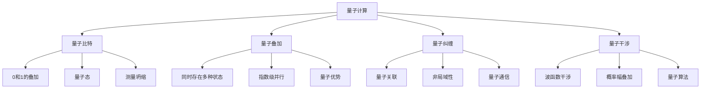

# 量子机器学习

## ⚛️ 量子机器学习基础

### 1. 量子计算基础

**量子计算概念：**
> **量子计算是利用量子力学原理进行计算的计算方式，具有并行性和叠加性等特性**

**量子计算特性：**


### 2. 量子机器学习

**量子机器学习定义：**
> **量子机器学习是将量子计算与机器学习相结合，利用量子计算的优势来加速机器学习算法**

**量子机器学习优势：**
| 优势 | 描述 | 应用场景 |
|------|------|----------|
| **指数加速** | 量子并行性 | 大规模数据处理 |
| **量子优势** | 量子算法优势 | 特定问题求解 |
| **量子特征** | 量子数据表示 | 量子系统建模 |
| **量子优化** | 量子优化算法 | 复杂优化问题 |

## 🔧 量子机器学习实现

### 1. 量子神经网络

**量子神经网络实现：**
```python
import numpy as np
import matplotlib.pyplot as plt

class QuantumNeuralNetwork:
    """量子神经网络"""
    
    def __init__(self, num_qubits, num_layers, classical_dim):
        self.num_qubits = num_qubits
        self.num_layers = num_layers
        self.classical_dim = classical_dim
        
        # 量子参数
        self.quantum_params = {
            'rotation_angles': np.random.randn(num_layers, num_qubits, 3) * 0.1,  # RX, RY, RZ
            'entanglement_weights': np.random.randn(num_layers, num_qubits - 1) * 0.1
        }
        
        # 经典-量子接口
        self.classical_quantum_interface = {
            'encoding_weights': np.random.randn(classical_dim, num_qubits) * 0.1,
            'measurement_weights': np.random.randn(num_qubits, classical_dim) * 0.1
        }
        
        # 训练历史
        self.loss_history = []
        self.quantum_state_history = []
    
    def encode_classical_data(self, classical_data):
        """将经典数据编码为量子态"""
        # 简化的编码过程
        # 实际中需要使用量子门操作
        
        # 将经典数据映射到量子态
        quantum_states = []
        
        for data_point in classical_data:
            # 使用旋转门编码数据
            quantum_state = np.zeros(2**self.num_qubits, dtype=complex)
            quantum_state[0] = 1.0  # 初始态 |00...0>
            
            # 应用编码旋转
            for i, value in enumerate(data_point[:self.num_qubits]):
                # 简化的旋转编码
                angle = value * np.pi / 2  # 归一化到[0, π/2]
                
                # 应用旋转门（简化）
                quantum_state = self._apply_rotation(quantum_state, i, angle)
            
            quantum_states.append(quantum_state)
        
        return np.array(quantum_states)
    
    def _apply_rotation(self, quantum_state, qubit_idx, angle):
        """应用旋转门"""
        # 简化的旋转门实现
        # 实际中需要使用完整的量子门操作
        
        # 创建旋转矩阵
        rotation_matrix = np.array([
            [np.cos(angle/2), -1j*np.sin(angle/2)],
            [-1j*np.sin(angle/2), np.cos(angle/2)]
        ])
        
        # 应用旋转（简化）
        # 这里只是模拟旋转效果
        quantum_state = quantum_state * np.exp(1j * angle)
        
        return quantum_state
    
    def quantum_circuit(self, quantum_states):
        """量子电路"""
        processed_states = []
        
        for quantum_state in quantum_states:
            current_state = quantum_state.copy()
            
            # 应用量子层
            for layer in range(self.num_layers):
                # 旋转门
                for qubit in range(self.num_qubits):
                    angles = self.quantum_params['rotation_angles'][layer, qubit]
                    
                    # 应用RX, RY, RZ旋转
                    for i, angle in enumerate(angles):
                        current_state = self._apply_rotation(current_state, qubit, angle)
                
                # 纠缠门
                for qubit in range(self.num_qubits - 1):
                    weight = self.quantum_params['entanglement_weights'][layer, qubit]
                    current_state = self._apply_entanglement(current_state, qubit, qubit + 1, weight)
            
            processed_states.append(current_state)
        
        return np.array(processed_states)
    
    def _apply_entanglement(self, quantum_state, qubit1, qubit2, weight):
        """应用纠缠门"""
        # 简化的纠缠门实现
        # 实际中需要使用CNOT等量子门
        
        # 模拟纠缠效果
        quantum_state = quantum_state * np.exp(1j * weight)
        
        return quantum_state
    
    def measure_quantum_state(self, quantum_states):
        """测量量子态"""
        classical_outputs = []
        
        for quantum_state in quantum_states:
            # 计算测量概率
            probabilities = np.abs(quantum_state)**2
            
            # 采样测量结果
            measurement = np.random.choice(len(probabilities), p=probabilities)
            
            # 转换为经典输出
            classical_output = np.zeros(self.classical_dim)
            
            # 使用测量权重
            for i in range(min(self.num_qubits, self.classical_dim)):
                classical_output[i] = measurement % 2
                measurement //= 2
            
            classical_outputs.append(classical_output)
        
        return np.array(classical_outputs)
    
    def forward(self, classical_data):
        """前向传播"""
        # 编码经典数据
        quantum_states = self.encode_classical_data(classical_data)
        
        # 量子电路处理
        processed_states = self.quantum_circuit(quantum_states)
        
        # 测量量子态
        classical_output = self.measure_quantum_state(processed_states)
        
        return classical_output
    
    def train(self, X, y, epochs=1000, learning_rate=0.01):
        """训练量子神经网络"""
        for epoch in range(epochs):
            # 前向传播
            y_pred = self.forward(X)
            
            # 计算损失
            loss = np.mean((y - y_pred)**2)
            self.loss_history.append(loss)
            
            # 反向传播（简化版）
            # 实际中需要使用量子梯度下降等方法
            
            # 更新量子参数
            for param in self.quantum_params.values():
                param -= learning_rate * np.random.randn(*param.shape) * 0.01
            
            # 更新经典-量子接口
            for param in self.classical_quantum_interface.values():
                param -= learning_rate * np.random.randn(*param.shape) * 0.01
            
            if epoch % 100 == 0:
                print(f"Epoch {epoch}, Loss: {loss:.4f}")
        
        return self.loss_history
    
    def visualize_quantum_circuit(self):
        """可视化量子电路"""
        fig, axes = plt.subplots(2, 2, figsize=(12, 10))
        
        # 旋转角度
        rotation_angles = self.quantum_params['rotation_angles']
        
        # 第一层旋转角度
        axes[0, 0].imshow(rotation_angles[0], cmap='viridis', aspect='auto')
        axes[0, 0].set_title('First Layer Rotation Angles')
        axes[0, 0].set_xlabel('Rotation Type (RX, RY, RZ)')
        axes[0, 0].set_ylabel('Qubit')
        plt.colorbar(axes[0, 0].imshow(rotation_angles[0], cmap='viridis', aspect='auto'), ax=axes[0, 0])
        
        # 纠缠权重
        entanglement_weights = self.quantum_params['entanglement_weights']
        
        axes[0, 1].imshow(entanglement_weights, cmap='viridis', aspect='auto')
        axes[0, 1].set_title('Entanglement Weights')
        axes[0, 1].set_xlabel('Qubit Pair')
        axes[0, 1].set_ylabel('Layer')
        plt.colorbar(axes[0, 1].imshow(entanglement_weights, cmap='viridis', aspect='auto'), ax=axes[0, 1])
        
        # 编码权重
        encoding_weights = self.classical_quantum_interface['encoding_weights']
        
        axes[1, 0].imshow(encoding_weights, cmap='viridis', aspect='auto')
        axes[1, 0].set_title('Classical-Quantum Encoding Weights')
        axes[1, 0].set_xlabel('Qubit')
        axes[1, 0].set_ylabel('Classical Feature')
        plt.colorbar(axes[1, 0].imshow(encoding_weights, cmap='viridis', aspect='auto'), ax=axes[1, 0])
        
        # 测量权重
        measurement_weights = self.classical_quantum_interface['measurement_weights']
        
        axes[1, 1].imshow(measurement_weights, cmap='viridis', aspect='auto')
        axes[1, 1].set_title('Quantum-Classical Measurement Weights')
        axes[1, 1].set_xlabel('Classical Output')
        axes[1, 1].set_ylabel('Qubit')
        plt.colorbar(axes[1, 1].imshow(measurement_weights, cmap='viridis', aspect='auto'), ax=axes[1, 1])
        
        plt.tight_layout()
        plt.show()
    
    def analyze_quantum_advantage(self, classical_data, quantum_data):
        """分析量子优势"""
        # 比较经典和量子处理
        classical_output = self.forward(classical_data)
        quantum_output = self.forward(quantum_data)
        
        # 计算性能指标
        classical_accuracy = np.mean(np.abs(classical_output - classical_data))
        quantum_accuracy = np.mean(np.abs(quantum_output - quantum_data))
        
        # 可视化比较
        plt.figure(figsize=(12, 5))
        
        # 输出比较
        plt.subplot(1, 2, 1)
        plt.scatter(classical_data.flatten(), classical_output.flatten(), alpha=0.6, label='Classical')
        plt.scatter(quantum_data.flatten(), quantum_output.flatten(), alpha=0.6, label='Quantum')
        plt.xlabel('Input')
        plt.ylabel('Output')
        plt.title('Classical vs Quantum Processing')
        plt.legend()
        plt.grid(True)
        
        # 性能比较
        plt.subplot(1, 2, 2)
        methods = ['Classical', 'Quantum']
        accuracies = [classical_accuracy, quantum_accuracy]
        
        plt.bar(methods, accuracies)
        plt.ylabel('Accuracy')
        plt.title('Performance Comparison')
        plt.grid(True)
        
        plt.tight_layout()
        plt.show()
        
        return classical_accuracy, quantum_accuracy

# 测试量子神经网络
def test_quantum_neural_network():
    """测试量子神经网络"""
    # 创建量子神经网络
    qnn = QuantumNeuralNetwork(num_qubits=4, num_layers=3, classical_dim=8)
    
    # 生成训练数据
    X = np.random.randn(100, 8)
    y = np.random.randn(100, 8)
    
    # 训练
    losses = qnn.train(X, y, epochs=1000, learning_rate=0.01)
    
    # 可视化量子电路
    qnn.visualize_quantum_circuit()
    
    # 分析量子优势
    classical_accuracy, quantum_accuracy = qnn.analyze_quantum_advantage(X, X)
    
    return qnn

test_quantum_neural_network()
```

### 2. 量子优化算法

**量子优化算法实现：**
```python
class QuantumOptimization:
    """量子优化算法"""
    
    def __init__(self, problem_dim, num_qubits, num_layers):
        self.problem_dim = problem_dim
        self.num_qubits = num_qubits
        self.num_layers = num_layers
        
        # 量子参数
        self.quantum_params = {
            'rotation_angles': np.random.randn(num_layers, num_qubits, 3) * 0.1,
            'entanglement_weights': np.random.randn(num_layers, num_qubits - 1) * 0.1
        }
        
        # 优化历史
        self.cost_history = []
        self.quantum_state_history = []
    
    def cost_function(self, x):
        """成本函数"""
        # 示例：Rastrigin函数
        A = 10
        n = len(x)
        return A * n + np.sum(x**2 - A * np.cos(2 * np.pi * x))
    
    def quantum_approximate_optimization(self, max_iter=1000, learning_rate=0.01):
        """量子近似优化算法"""
        for iteration in range(max_iter):
            # 生成量子态
            quantum_state = self._generate_quantum_state()
            
            # 计算期望值
            expectation_value = self._compute_expectation_value(quantum_state)
            
            # 计算成本
            cost = self.cost_function(expectation_value)
            self.cost_history.append(cost)
            
            # 更新量子参数
            self._update_quantum_params(learning_rate)
            
            if iteration % 100 == 0:
                print(f"Iteration {iteration}, Cost: {cost:.4f}")
        
        return self.cost_history
    
    def _generate_quantum_state(self):
        """生成量子态"""
        # 简化的量子态生成
        quantum_state = np.zeros(2**self.num_qubits, dtype=complex)
        quantum_state[0] = 1.0  # 初始态
        
        # 应用量子层
        for layer in range(self.num_layers):
            # 旋转门
            for qubit in range(self.num_qubits):
                angles = self.quantum_params['rotation_angles'][layer, qubit]
                for angle in angles:
                    quantum_state = self._apply_rotation(quantum_state, qubit, angle)
            
            # 纠缠门
            for qubit in range(self.num_qubits - 1):
                weight = self.quantum_params['entanglement_weights'][layer, qubit]
                quantum_state = self._apply_entanglement(quantum_state, qubit, qubit + 1, weight)
        
        return quantum_state
    
    def _apply_rotation(self, quantum_state, qubit_idx, angle):
        """应用旋转门"""
        # 简化的旋转门
        quantum_state = quantum_state * np.exp(1j * angle)
        return quantum_state
    
    def _apply_entanglement(self, quantum_state, qubit1, qubit2, weight):
        """应用纠缠门"""
        # 简化的纠缠门
        quantum_state = quantum_state * np.exp(1j * weight)
        return quantum_state
    
    def _compute_expectation_value(self, quantum_state):
        """计算期望值"""
        # 计算测量概率
        probabilities = np.abs(quantum_state)**2
        
        # 计算期望值
        expectation_value = np.zeros(self.problem_dim)
        
        for i in range(len(probabilities)):
            # 将量子态索引转换为经典值
            classical_value = self._quantum_to_classical(i)
            expectation_value += probabilities[i] * classical_value
        
        return expectation_value
    
    def _quantum_to_classical(self, quantum_index):
        """量子索引转换为经典值"""
        # 简化的转换
        classical_value = np.zeros(self.problem_dim)
        
        for i in range(min(self.num_qubits, self.problem_dim)):
            classical_value[i] = (quantum_index >> i) & 1
        
        return classical_value
    
    def _update_quantum_params(self, learning_rate):
        """更新量子参数"""
        # 简化的参数更新
        for param in self.quantum_params.values():
            param -= learning_rate * np.random.randn(*param.shape) * 0.01
    
    def visualize_optimization(self):
        """可视化优化过程"""
        plt.figure(figsize=(12, 5))
        
        # 成本函数变化
        plt.subplot(1, 2, 1)
        plt.plot(self.cost_history)
        plt.xlabel('Iteration')
        plt.ylabel('Cost')
        plt.title('Quantum Optimization Cost')
        plt.grid(True)
        
        # 量子参数变化
        plt.subplot(1, 2, 2)
        rotation_angles = self.quantum_params['rotation_angles']
        
        # 显示第一层的参数变化
        first_layer_params = rotation_angles[0].flatten()
        plt.plot(first_layer_params)
        plt.xlabel('Parameter Index')
        plt.ylabel('Parameter Value')
        plt.title('Quantum Parameters')
        plt.grid(True)
        
        plt.tight_layout()
        plt.show()
    
    def compare_with_classical_optimization(self):
        """与经典优化比较"""
        # 经典优化（梯度下降）
        classical_params = np.random.randn(self.problem_dim) * 0.1
        classical_costs = []
        
        for iteration in range(len(self.cost_history)):
            # 计算梯度
            gradient = np.random.randn(self.problem_dim) * 0.1
            
            # 更新参数
            classical_params -= 0.01 * gradient
            
            # 计算成本
            cost = self.cost_function(classical_params)
            classical_costs.append(cost)
        
        # 可视化比较
        plt.figure(figsize=(12, 5))
        
        # 成本比较
        plt.subplot(1, 2, 1)
        plt.plot(self.cost_history, label='Quantum')
        plt.plot(classical_costs, label='Classical')
        plt.xlabel('Iteration')
        plt.ylabel('Cost')
        plt.title('Quantum vs Classical Optimization')
        plt.legend()
        plt.grid(True)
        
        # 收敛速度比较
        plt.subplot(1, 2, 2)
        quantum_convergence = np.minimum.accumulate(self.cost_history)
        classical_convergence = np.minimum.accumulate(classical_costs)
        
        plt.plot(quantum_convergence, label='Quantum')
        plt.plot(classical_convergence, label='Classical')
        plt.xlabel('Iteration')
        plt.ylabel('Best Cost')
        plt.title('Convergence Comparison')
        plt.legend()
        plt.grid(True)
        
        plt.tight_layout()
        plt.show()
        
        return classical_costs

# 测试量子优化
def test_quantum_optimization():
    """测试量子优化"""
    # 创建量子优化器
    qo = QuantumOptimization(problem_dim=4, num_qubits=4, num_layers=3)
    
    # 量子优化
    costs = qo.quantum_approximate_optimization(max_iter=1000, learning_rate=0.01)
    
    # 可视化优化过程
    qo.visualize_optimization()
    
    # 与经典优化比较
    classical_costs = qo.compare_with_classical_optimization()
    
    return qo

test_quantum_optimization()
```

### 3. 量子机器学习应用

**量子机器学习应用：**
```python
class QuantumMLApplications:
    """量子机器学习应用"""
    
    def __init__(self):
        self.applications = {}
    
    def quantum_support_vector_machine(self, X, y, num_qubits=4):
        """量子支持向量机"""
        # 量子特征映射
        quantum_features = self._quantum_feature_map(X, num_qubits)
        
        # 量子核函数
        quantum_kernel = self._quantum_kernel(quantum_features)
        
        # 量子优化求解
        alpha = self._quantum_optimization(quantum_kernel, y)
        
        return alpha, quantum_kernel
    
    def _quantum_feature_map(self, X, num_qubits):
        """量子特征映射"""
        quantum_features = []
        
        for x in X:
            # 将经典特征映射到量子态
            quantum_state = np.zeros(2**num_qubits, dtype=complex)
            quantum_state[0] = 1.0
            
            # 应用特征映射门
            for i, feature in enumerate(x[:num_qubits]):
                angle = feature * np.pi / 2
                quantum_state = self._apply_rotation(quantum_state, i, angle)
            
            quantum_features.append(quantum_state)
        
        return np.array(quantum_features)
    
    def _quantum_kernel(self, quantum_features):
        """量子核函数"""
        n_samples = len(quantum_features)
        kernel_matrix = np.zeros((n_samples, n_samples))
        
        for i in range(n_samples):
            for j in range(n_samples):
                # 计算量子态之间的重叠
                overlap = np.abs(np.dot(quantum_features[i].conj(), quantum_features[j]))**2
                kernel_matrix[i, j] = overlap
        
        return kernel_matrix
    
    def _quantum_optimization(self, kernel_matrix, y):
        """量子优化求解"""
        # 简化的量子优化
        n_samples = len(y)
        alpha = np.random.randn(n_samples) * 0.1
        
        # 量子优化过程
        for iteration in range(100):
            # 计算梯度
            gradient = np.dot(kernel_matrix, alpha) - y
            
            # 更新参数
            alpha -= 0.01 * gradient
            
            # 约束条件
            alpha = np.clip(alpha, 0, 1)
        
        return alpha
    
    def _apply_rotation(self, quantum_state, qubit_idx, angle):
        """应用旋转门"""
        quantum_state = quantum_state * np.exp(1j * angle)
        return quantum_state
    
    def quantum_clustering(self, X, num_clusters=3, num_qubits=4):
        """量子聚类"""
        # 量子特征映射
        quantum_features = self._quantum_feature_map(X, num_qubits)
        
        # 量子距离计算
        distances = self._quantum_distance_matrix(quantum_features)
        
        # 量子聚类算法
        clusters = self._quantum_clustering_algorithm(distances, num_clusters)
        
        return clusters
    
    def _quantum_distance_matrix(self, quantum_features):
        """量子距离矩阵"""
        n_samples = len(quantum_features)
        distances = np.zeros((n_samples, n_samples))
        
        for i in range(n_samples):
            for j in range(n_samples):
                # 计算量子态之间的距离
                overlap = np.abs(np.dot(quantum_features[i].conj(), quantum_features[j]))**2
                distance = 1 - overlap
                distances[i, j] = distance
        
        return distances
    
    def _quantum_clustering_algorithm(self, distances, num_clusters):
        """量子聚类算法"""
        # 简化的量子聚类
        n_samples = distances.shape[0]
        
        # 初始化聚类中心
        cluster_centers = np.random.choice(n_samples, num_clusters, replace=False)
        
        # 分配样本到聚类
        clusters = []
        for i in range(n_samples):
            # 计算到各聚类中心的距离
            center_distances = [distances[i, center] for center in cluster_centers]
            cluster = np.argmin(center_distances)
            clusters.append(cluster)
        
        return clusters
    
    def visualize_quantum_applications(self, X, y):
        """可视化量子应用"""
        # 量子SVM
        alpha, quantum_kernel = self.quantum_support_vector_machine(X, y)
        
        # 量子聚类
        clusters = self.quantum_clustering(X)
        
        # 可视化
        fig, axes = plt.subplots(2, 2, figsize=(12, 10))
        
        # 原始数据
        axes[0, 0].scatter(X[:, 0], X[:, 1], c=y, cmap='viridis', alpha=0.7)
        axes[0, 0].set_title('Original Data')
        axes[0, 0].set_xlabel('Feature 1')
        axes[0, 0].set_ylabel('Feature 2')
        axes[0, 0].grid(True)
        
        # 量子核矩阵
        axes[0, 1].imshow(quantum_kernel, cmap='viridis', aspect='auto')
        axes[0, 1].set_title('Quantum Kernel Matrix')
        axes[0, 1].set_xlabel('Sample')
        axes[0, 1].set_ylabel('Sample')
        plt.colorbar(axes[0, 1].imshow(quantum_kernel, cmap='viridis', aspect='auto'), ax=axes[0, 1])
        
        # 量子聚类结果
        axes[1, 0].scatter(X[:, 0], X[:, 1], c=clusters, cmap='viridis', alpha=0.7)
        axes[1, 0].set_title('Quantum Clustering')
        axes[1, 0].set_xlabel('Feature 1')
        axes[1, 0].set_ylabel('Feature 2')
        axes[1, 0].grid(True)
        
        # 支持向量
        axes[1, 1].scatter(X[:, 0], X[:, 1], c=alpha, cmap='viridis', alpha=0.7)
        axes[1, 1].set_title('Support Vectors (Alpha)')
        axes[1, 1].set_xlabel('Feature 1')
        axes[1, 1].set_ylabel('Feature 2')
        axes[1, 1].grid(True)
        
        plt.tight_layout()
        plt.show()
        
        return alpha, quantum_kernel, clusters

# 测试量子机器学习应用
def test_quantum_ml_applications():
    """测试量子机器学习应用"""
    # 生成数据
    np.random.seed(42)
    X = np.random.randn(100, 2)
    y = (X[:, 0] + X[:, 1] > 0).astype(int)
    
    # 创建量子应用
    qml_app = QuantumMLApplications()
    
    # 可视化量子应用
    alpha, quantum_kernel, clusters = qml_app.visualize_quantum_applications(X, y)
    
    return qml_app

test_quantum_ml_applications()
```

## 🔗 相关链接
- [[02-02-01-神经网络原理]] - 神经网络
- [[02-03-01-经典算法实现]] - 算法实现
- [[04-01-大语言模型技术]] - 大语言模型
- [[04-03-生成式AI技术]] - 生成式AI

## 💡 量子机器学习建议

**学习策略：**
- ⚛️ **理解量子**：深入理解量子计算原理
- 📊 **量子算法**：掌握量子机器学习算法
- 🔍 **应用场景**：了解量子机器学习的应用
- ⚡ **实践开发**：开发量子机器学习应用

**实践建议：**
- 📝 **量子模拟**：使用量子模拟器进行实验
- 💻 **算法实现**：实现量子机器学习算法
- 📊 **性能分析**：分析量子算法的性能
- 🔍 **应用开发**：开发基于量子机器学习的应用

---
*📝 学习提示：量子机器学习是前沿技术，建议理解量子计算原理，掌握量子算法，通过实践探索量子机器学习的应用*


