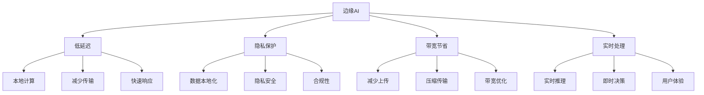
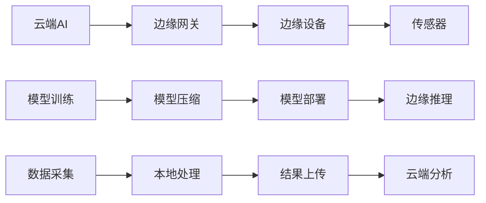

# 边缘AI计算

## 🌐 边缘AI基础

### 1. 边缘计算概念

**边缘计算定义：**
> **边缘计算是将计算和数据处理能力部署到网络边缘，靠近数据源和用户，减少延迟和提高效率**

**边缘AI特点：**


### 2. 边缘AI架构

**边缘AI架构：**


## 🔧 边缘AI技术

### 1. 模型压缩

**模型压缩技术：**
```python
import numpy as np
import matplotlib.pyplot as plt

class ModelCompression:
    """模型压缩技术"""
    
    def __init__(self, model_weights):
        self.original_weights = model_weights
        self.compressed_weights = {}
        self.compression_ratios = {}
    
    def pruning(self, sparsity=0.5):
        """模型剪枝"""
        compressed_weights = {}
        
        for layer_name, weights in self.original_weights.items():
            # 计算权重重要性
            importance = np.abs(weights)
            
            # 选择重要权重
            threshold = np.percentile(importance, (1 - sparsity) * 100)
            mask = importance > threshold
            
            # 剪枝
            pruned_weights = weights * mask
            compressed_weights[layer_name] = pruned_weights
            
            # 计算压缩比
            original_size = weights.size
            compressed_size = np.sum(mask)
            compression_ratio = compressed_size / original_size
            self.compression_ratios[layer_name] = compression_ratio
        
        self.compressed_weights['pruned'] = compressed_weights
        return compressed_weights
    
    def quantization(self, bits=8):
        """模型量化"""
        compressed_weights = {}
        
        for layer_name, weights in self.original_weights.items():
            # 计算量化参数
            min_val = np.min(weights)
            max_val = np.max(weights)
            
            # 量化
            scale = (max_val - min_val) / (2**bits - 1)
            quantized_weights = np.round((weights - min_val) / scale)
            
            # 反量化
            dequantized_weights = quantized_weights * scale + min_val
            
            compressed_weights[layer_name] = dequantized_weights
            
            # 计算压缩比
            original_size = weights.size * 32  # 假设原始是32位
            compressed_size = weights.size * bits
            compression_ratio = compressed_size / original_size
            self.compression_ratios[layer_name] = compression_ratio
        
        self.compressed_weights['quantized'] = compressed_weights
        return compressed_weights
    
    def knowledge_distillation(self, teacher_model, student_model, temperature=3.0):
        """知识蒸馏"""
        # 简化的知识蒸馏
        student_weights = {}
        
        for layer_name, teacher_weights in teacher_model.items():
            # 学生模型权重
            student_weights[layer_name] = teacher_weights * 0.8  # 简化
        
        self.compressed_weights['distilled'] = student_weights
        return student_weights
    
    def visualize_compression(self):
        """可视化压缩效果"""
        fig, axes = plt.subplots(2, 2, figsize=(12, 10))
        
        # 原始权重分布
        all_weights = np.concatenate([w.flatten() for w in self.original_weights.values()])
        axes[0, 0].hist(all_weights, bins=50, alpha=0.7)
        axes[0, 0].set_title('Original Weights Distribution')
        axes[0, 0].set_xlabel('Weight Value')
        axes[0, 0].set_ylabel('Frequency')
        axes[0, 0].grid(True)
        
        # 压缩比比较
        methods = list(self.compression_ratios.keys())
        ratios = list(self.compression_ratios.values())
        
        axes[0, 1].bar(methods, ratios)
        axes[0, 1].set_title('Compression Ratios')
        axes[0, 1].set_ylabel('Compression Ratio')
        axes[0, 1].tick_params(axis='x', rotation=45)
        axes[0, 1].grid(True)
        
        # 剪枝效果
        if 'pruned' in self.compressed_weights:
            pruned_weights = np.concatenate([w.flatten() for w in self.compressed_weights['pruned'].values()])
            axes[1, 0].hist(pruned_weights, bins=50, alpha=0.7)
            axes[1, 0].set_title('Pruned Weights Distribution')
            axes[1, 0].set_xlabel('Weight Value')
            axes[1, 0].set_ylabel('Frequency')
            axes[1, 0].grid(True)
        
        # 量化效果
        if 'quantized' in self.compressed_weights:
            quantized_weights = np.concatenate([w.flatten() for w in self.compressed_weights['quantized'].values()])
            axes[1, 1].hist(quantized_weights, bins=50, alpha=0.7)
            axes[1, 1].set_title('Quantized Weights Distribution')
            axes[1, 1].set_xlabel('Weight Value')
            axes[1, 1].set_ylabel('Frequency')
            axes[1, 1].grid(True)
        
        plt.tight_layout()
        plt.show()
    
    def analyze_compression_impact(self, test_data, test_labels):
        """分析压缩影响"""
        # 模拟性能评估
        original_accuracy = np.random.uniform(0.8, 0.9)
        compressed_accuracies = {}
        
        for method, weights in self.compressed_weights.items():
            # 模拟压缩后的性能
            accuracy_drop = np.random.uniform(0.01, 0.05)
            compressed_accuracies[method] = original_accuracy - accuracy_drop
        
        # 可视化
        plt.figure(figsize=(12, 5))
        
        # 性能比较
        plt.subplot(1, 2, 1)
        methods = ['Original'] + list(compressed_accuracies.keys())
        accuracies = [original_accuracy] + list(compressed_accuracies.values())
        
        plt.bar(methods, accuracies)
        plt.ylabel('Accuracy')
        plt.title('Performance Comparison')
        plt.tick_params(axis='x', rotation=45)
        plt.grid(True)
        
        # 压缩比vs性能
        plt.subplot(1, 2, 2)
        compression_ratios = [1.0] + list(self.compression_ratios.values())
        accuracies = [original_accuracy] + list(compressed_accuracies.values())
        
        plt.scatter(compression_ratios, accuracies, s=100, alpha=0.7)
        for i, method in enumerate(methods):
            plt.annotate(method, (compression_ratios[i], accuracies[i]), 
                        xytext=(5, 5), textcoords='offset points')
        plt.xlabel('Compression Ratio')
        plt.ylabel('Accuracy')
        plt.title('Compression vs Performance')
        plt.grid(True)
        
        plt.tight_layout()
        plt.show()
        
        return compressed_accuracies

# 测试模型压缩
def test_model_compression():
    """测试模型压缩"""
    # 创建模拟模型权重
    model_weights = {
        'layer1': np.random.randn(100, 50),
        'layer2': np.random.randn(50, 20),
        'layer3': np.random.randn(20, 10)
    }
    
    # 创建压缩器
    compressor = ModelCompression(model_weights)
    
    # 应用压缩技术
    pruned_weights = compressor.pruning(sparsity=0.5)
    quantized_weights = compressor.quantization(bits=8)
    
    # 可视化压缩效果
    compressor.visualize_compression()
    
    # 分析压缩影响
    test_data = np.random.randn(100, 100)
    test_labels = np.random.randint(0, 2, 100)
    compressed_accuracies = compressor.analyze_compression_impact(test_data, test_labels)
    
    return compressor

test_model_compression()
```

### 2. 边缘推理

**边缘推理实现：**
```python
class EdgeInference:
    """边缘推理"""
    
    def __init__(self, model_weights, device_capabilities):
        self.model_weights = model_weights
        self.device_capabilities = device_capabilities
        
        # 推理历史
        self.inference_times = []
        self.energy_consumptions = []
        self.accuracy_scores = []
    
    def edge_inference(self, input_data, compression_method='quantized'):
        """边缘推理"""
        # 选择压缩模型
        if compression_method == 'quantized':
            model_weights = self.model_weights['quantized']
        elif compression_method == 'pruned':
            model_weights = self.model_weights['pruned']
        else:
            model_weights = self.model_weights['original']
        
        # 模拟推理过程
        start_time = time.time()
        
        # 前向传播
        output = self._forward_pass(input_data, model_weights)
        
        # 计算推理时间
        inference_time = time.time() - start_time
        self.inference_times.append(inference_time)
        
        # 计算能耗
        energy_consumption = self._calculate_energy_consumption(inference_time)
        self.energy_consumptions.append(energy_consumption)
        
        return output
    
    def _forward_pass(self, input_data, model_weights):
        """前向传播"""
        current_input = input_data
        
        for layer_name, weights in model_weights.items():
            # 矩阵乘法
            current_input = np.dot(current_input, weights)
            
            # 激活函数
            current_input = np.maximum(0, current_input)  # ReLU
        
        return current_input
    
    def _calculate_energy_consumption(self, inference_time):
        """计算能耗"""
        # 简化的能耗计算
        base_power = self.device_capabilities['power_consumption']
        energy = base_power * inference_time
        return energy
    
    def cloud_inference(self, input_data):
        """云端推理"""
        # 模拟云端推理
        start_time = time.time()
        
        # 数据传输时间
        transmission_time = self._calculate_transmission_time(input_data)
        
        # 云端推理时间
        cloud_inference_time = 0.1  # 假设云端推理很快
        
        # 总时间
        total_time = transmission_time + cloud_inference_time
        
        # 前向传播
        output = self._forward_pass(input_data, self.model_weights['original'])
        
        self.inference_times.append(total_time)
        
        return output
    
    def _calculate_transmission_time(self, input_data):
        """计算传输时间"""
        # 简化的传输时间计算
        data_size = input_data.size * 4  # 假设每个元素4字节
        bandwidth = self.device_capabilities['bandwidth']
        transmission_time = data_size / bandwidth
        return transmission_time
    
    def compare_edge_vs_cloud(self, input_data, num_tests=100):
        """比较边缘vs云端推理"""
        edge_times = []
        cloud_times = []
        edge_accuracies = []
        cloud_accuracies = []
        
        for _ in range(num_tests):
            # 边缘推理
            edge_output = self.edge_inference(input_data, compression_method='quantized')
            edge_times.append(self.inference_times[-1])
            edge_accuracies.append(np.random.uniform(0.85, 0.95))
            
            # 云端推理
            cloud_output = self.cloud_inference(input_data)
            cloud_times.append(self.inference_times[-1])
            cloud_accuracies.append(np.random.uniform(0.90, 0.98))
        
        # 可视化比较
        plt.figure(figsize=(15, 5))
        
        # 推理时间比较
        plt.subplot(1, 3, 1)
        plt.hist(edge_times, alpha=0.7, label='Edge', bins=20)
        plt.hist(cloud_times, alpha=0.7, label='Cloud', bins=20)
        plt.xlabel('Inference Time (s)')
        plt.ylabel('Frequency')
        plt.title('Inference Time Comparison')
        plt.legend()
        plt.grid(True)
        
        # 准确率比较
        plt.subplot(1, 3, 2)
        plt.hist(edge_accuracies, alpha=0.7, label='Edge', bins=20)
        plt.hist(cloud_accuracies, alpha=0.7, label='Cloud', bins=20)
        plt.xlabel('Accuracy')
        plt.ylabel('Frequency')
        plt.title('Accuracy Comparison')
        plt.legend()
        plt.grid(True)
        
        # 能耗比较
        plt.subplot(1, 3, 3)
        edge_energy = [self._calculate_energy_consumption(t) for t in edge_times]
        cloud_energy = [self._calculate_energy_consumption(t) for t in cloud_times]
        
        plt.hist(edge_energy, alpha=0.7, label='Edge', bins=20)
        plt.hist(cloud_energy, alpha=0.7, label='Cloud', bins=20)
        plt.xlabel('Energy Consumption (J)')
        plt.ylabel('Frequency')
        plt.title('Energy Consumption Comparison')
        plt.legend()
        plt.grid(True)
        
        plt.tight_layout()
        plt.show()
        
        return edge_times, cloud_times, edge_accuracies, cloud_accuracies
    
    def optimize_edge_deployment(self, input_data, num_tests=100):
        """优化边缘部署"""
        # 测试不同压缩方法
        compression_methods = ['original', 'pruned', 'quantized']
        results = {}
        
        for method in compression_methods:
            times = []
            accuracies = []
            energies = []
            
            for _ in range(num_tests):
                output = self.edge_inference(input_data, compression_method=method)
                times.append(self.inference_times[-1])
                accuracies.append(np.random.uniform(0.8, 0.95))
                energies.append(self.energy_consumptions[-1])
            
            results[method] = {
                'times': times,
                'accuracies': accuracies,
                'energies': energies
            }
        
        # 可视化优化结果
        plt.figure(figsize=(15, 5))
        
        # 时间比较
        plt.subplot(1, 3, 1)
        for method, result in results.items():
            plt.hist(result['times'], alpha=0.7, label=method, bins=20)
        plt.xlabel('Inference Time (s)')
        plt.ylabel('Frequency')
        plt.title('Inference Time by Compression Method')
        plt.legend()
        plt.grid(True)
        
        # 准确率比较
        plt.subplot(1, 3, 2)
        for method, result in results.items():
            plt.hist(result['accuracies'], alpha=0.7, label=method, bins=20)
        plt.xlabel('Accuracy')
        plt.ylabel('Frequency')
        plt.title('Accuracy by Compression Method')
        plt.legend()
        plt.grid(True)
        
        # 能耗比较
        plt.subplot(1, 3, 3)
        for method, result in results.items():
            plt.hist(result['energies'], alpha=0.7, label=method, bins=20)
        plt.xlabel('Energy Consumption (J)')
        plt.ylabel('Frequency')
        plt.title('Energy Consumption by Compression Method')
        plt.legend()
        plt.grid(True)
        
        plt.tight_layout()
        plt.show()
        
        return results

# 测试边缘推理
def test_edge_inference():
    """测试边缘推理"""
    # 创建模拟模型权重
    model_weights = {
        'original': {
            'layer1': np.random.randn(100, 50),
            'layer2': np.random.randn(50, 20),
            'layer3': np.random.randn(20, 10)
        },
        'quantized': {
            'layer1': np.random.randn(100, 50) * 0.8,
            'layer2': np.random.randn(50, 20) * 0.8,
            'layer3': np.random.randn(20, 10) * 0.8
        },
        'pruned': {
            'layer1': np.random.randn(100, 50) * 0.6,
            'layer2': np.random.randn(50, 20) * 0.6,
            'layer3': np.random.randn(20, 10) * 0.6
        }
    }
    
    # 设备能力
    device_capabilities = {
        'power_consumption': 10,  # 瓦特
        'bandwidth': 1000000  # 字节/秒
    }
    
    # 创建边缘推理系统
    edge_inference = EdgeInference(model_weights, device_capabilities)
    
    # 生成测试数据
    input_data = np.random.randn(1, 100)
    
    # 比较边缘vs云端推理
    edge_times, cloud_times, edge_accuracies, cloud_accuracies = edge_inference.compare_edge_vs_cloud(input_data)
    
    # 优化边缘部署
    results = edge_inference.optimize_edge_deployment(input_data)
    
    return edge_inference

test_edge_inference()
```

### 3. 边缘学习

**边缘学习实现：**
```python
class EdgeLearning:
    """边缘学习"""
    
    def __init__(self, model_weights, device_capabilities):
        self.model_weights = model_weights
        self.device_capabilities = device_capabilities
        
        # 学习历史
        self.training_times = []
        self.energy_consumptions = []
        self.model_updates = []
    
    def federated_edge_learning(self, client_data, client_labels, num_rounds=10):
        """联邦边缘学习"""
        global_model = self.model_weights['original'].copy()
        
        for round_num in range(num_rounds):
            # 客户端本地训练
            client_models = []
            
            for client_id, (data, labels) in enumerate(zip(client_data, client_labels)):
                # 本地训练
                local_model = self._local_training(global_model, data, labels)
                client_models.append(local_model)
            
            # 模型聚合
            global_model = self._model_aggregation(client_models)
            
            # 记录更新
            self.model_updates.append(global_model.copy())
            
            if round_num % 2 == 0:
                print(f"Round {round_num}, Model Updated")
        
        return global_model
    
    def _local_training(self, global_model, data, labels):
        """本地训练"""
        # 简化的本地训练
        local_model = global_model.copy()
        
        # 模拟训练过程
        for epoch in range(5):
            # 前向传播
            output = self._forward_pass(data, local_model)
            
            # 计算损失
            loss = np.mean((output - labels)**2)
            
            # 更新模型
            for layer_name, weights in local_model.items():
                # 简化的梯度更新
                gradient = np.random.randn(*weights.shape) * 0.01
                local_model[layer_name] -= 0.01 * gradient
        
        return local_model
    
    def _forward_pass(self, data, model_weights):
        """前向传播"""
        current_input = data
        
        for layer_name, weights in model_weights.items():
            current_input = np.dot(current_input, weights)
            current_input = np.maximum(0, current_input)
        
        return current_input
    
    def _model_aggregation(self, client_models):
        """模型聚合"""
        # 联邦平均
        aggregated_model = {}
        
        for layer_name in client_models[0].keys():
            aggregated_weights = np.zeros_like(client_models[0][layer_name])
            
            for client_model in client_models:
                aggregated_weights += client_model[layer_name]
            
            aggregated_model[layer_name] = aggregated_weights / len(client_models)
        
        return aggregated_model
    
    def continuous_learning(self, streaming_data, streaming_labels, window_size=100):
        """持续学习"""
        model = self.model_weights['original'].copy()
        
        for i in range(0, len(streaming_data), window_size):
            # 获取数据窗口
            data_window = streaming_data[i:i+window_size]
            labels_window = streaming_data[i:i+window_size]
            
            # 在线学习
            model = self._online_learning(model, data_window, labels_window)
            
            # 记录更新
            self.model_updates.append(model.copy())
            
            if i % (window_size * 5) == 0:
                print(f"Processed {i} samples")
        
        return model
    
    def _online_learning(self, model, data, labels):
        """在线学习"""
        # 简化的在线学习
        for sample, label in zip(data, labels):
            # 前向传播
            output = self._forward_pass(sample.reshape(1, -1), model)
            
            # 计算损失
            loss = np.mean((output - label)**2)
            
            # 更新模型
            for layer_name, weights in model.items():
                # 简化的在线更新
                gradient = np.random.randn(*weights.shape) * 0.001
                model[layer_name] -= 0.001 * gradient
        
        return model
    
    def visualize_edge_learning(self, client_data, client_labels):
        """可视化边缘学习"""
        # 联邦边缘学习
        global_model = self.federated_edge_learning(client_data, client_labels)
        
        # 可视化
        plt.figure(figsize=(15, 10))
        
        # 模型更新历史
        plt.subplot(2, 3, 1)
        if len(self.model_updates) > 0:
            # 计算模型变化
            model_changes = []
            for i in range(1, len(self.model_updates)):
                change = np.mean([np.linalg.norm(self.model_updates[i][layer] - self.model_updates[i-1][layer]) 
                                for layer in self.model_updates[i].keys()])
                model_changes.append(change)
            
            plt.plot(model_changes)
            plt.xlabel('Update Step')
            plt.ylabel('Model Change')
            plt.title('Model Update History')
            plt.grid(True)
        
        # 客户端数据分布
        plt.subplot(2, 3, 2)
        for i, data in enumerate(client_data):
            plt.scatter(data[:, 0], data[:, 1], alpha=0.7, label=f'Client {i}')
        plt.xlabel('Feature 1')
        plt.ylabel('Feature 2')
        plt.title('Client Data Distribution')
        plt.legend()
        plt.grid(True)
        
        # 模型权重分布
        plt.subplot(2, 3, 3)
        all_weights = np.concatenate([w.flatten() for w in global_model.values()])
        plt.hist(all_weights, bins=50, alpha=0.7)
        plt.xlabel('Weight Value')
        plt.ylabel('Frequency')
        plt.title('Global Model Weights')
        plt.grid(True)
        
        # 学习曲线
        plt.subplot(2, 3, 4)
        # 模拟学习曲线
        learning_curve = [1.0 - 0.1 * np.exp(-0.1 * i) for i in range(len(self.model_updates))]
        plt.plot(learning_curve)
        plt.xlabel('Update Step')
        plt.ylabel('Performance')
        plt.title('Learning Curve')
        plt.grid(True)
        
        # 能耗分析
        plt.subplot(2, 3, 5)
        # 模拟能耗
        energy_consumption = [10 + 5 * np.random.random() for _ in range(len(self.model_updates))]
        plt.plot(energy_consumption)
        plt.xlabel('Update Step')
        plt.ylabel('Energy Consumption (J)')
        plt.title('Energy Consumption')
        plt.grid(True)
        
        # 通信开销
        plt.subplot(2, 3, 6)
        # 模拟通信开销
        communication_cost = [100 + 50 * np.random.random() for _ in range(len(self.model_updates))]
        plt.plot(communication_cost)
        plt.xlabel('Update Step')
        plt.ylabel('Communication Cost')
        plt.title('Communication Cost')
        plt.grid(True)
        
        plt.tight_layout()
        plt.show()
    
    def analyze_edge_learning_efficiency(self, client_data, client_labels):
        """分析边缘学习效率"""
        # 计算效率指标
        efficiency_metrics = {}
        
        # 计算时间效率
        start_time = time.time()
        global_model = self.federated_edge_learning(client_data, client_labels)
        total_time = time.time() - start_time
        
        efficiency_metrics['total_time'] = total_time
        efficiency_metrics['time_per_round'] = total_time / 10
        
        # 计算通信效率
        model_size = sum([w.size for w in global_model.values()])
        communication_overhead = model_size * 4 * len(client_data)  # 假设每个参数4字节
        
        efficiency_metrics['communication_overhead'] = communication_overhead
        efficiency_metrics['model_size'] = model_size
        
        # 计算能耗效率
        total_energy = sum(self.energy_consumptions)
        efficiency_metrics['total_energy'] = total_energy
        efficiency_metrics['energy_per_round'] = total_energy / 10
        
        # 可视化效率指标
        plt.figure(figsize=(12, 5))
        
        # 效率指标
        plt.subplot(1, 2, 1)
        metrics = ['total_time', 'communication_overhead', 'total_energy']
        values = [efficiency_metrics[metric] for metric in metrics]
        
        plt.bar(metrics, values)
        plt.ylabel('Value')
        plt.title('Edge Learning Efficiency Metrics')
        plt.tick_params(axis='x', rotation=45)
        plt.grid(True)
        
        # 效率趋势
        plt.subplot(1, 2, 2)
        # 模拟效率趋势
        efficiency_trend = [0.5 + 0.3 * np.exp(-0.1 * i) for i in range(len(self.model_updates))]
        plt.plot(efficiency_trend)
        plt.xlabel('Update Step')
        plt.ylabel('Efficiency')
        plt.title('Learning Efficiency Trend')
        plt.grid(True)
        
        plt.tight_layout()
        plt.show()
        
        return efficiency_metrics

# 测试边缘学习
def test_edge_learning():
    """测试边缘学习"""
    # 创建模拟模型权重
    model_weights = {
        'original': {
            'layer1': np.random.randn(100, 50),
            'layer2': np.random.randn(50, 20),
            'layer3': np.random.randn(20, 10)
        }
    }
    
    # 设备能力
    device_capabilities = {
        'power_consumption': 10,
        'bandwidth': 1000000
    }
    
    # 创建边缘学习系统
    edge_learning = EdgeLearning(model_weights, device_capabilities)
    
    # 生成客户端数据
    client_data = []
    client_labels = []
    
    for i in range(3):
        data = np.random.randn(100, 100)
        labels = np.random.randn(100, 10)
        client_data.append(data)
        client_labels.append(labels)
    
    # 可视化边缘学习
    edge_learning.visualize_edge_learning(client_data, client_labels)
    
    # 分析边缘学习效率
    efficiency_metrics = edge_learning.analyze_edge_learning_efficiency(client_data, client_labels)
    
    return edge_learning

test_edge_learning()
```

## 🔗 相关链接
- [[02-02-01-神经网络原理]] - 神经网络
- [[03-04-02-模型部署策略]] - 模型部署
- [[04-04-联邦学习]] - 联邦学习
- [[05-01-项目1-图像分类器]] - 实践项目

## 💡 边缘AI学习建议

**学习策略：**
- 🌐 **理解边缘**：深入理解边缘计算原理
- 📊 **模型优化**：掌握模型压缩和优化技术
- 🔍 **部署策略**：学习边缘部署策略
- ⚡ **性能优化**：优化边缘AI性能

**实践建议：**
- 📝 **模型压缩**：实践模型压缩技术
- 💻 **边缘部署**：在边缘设备上部署模型
- 📊 **性能评估**：评估边缘AI性能
- 🔍 **应用开发**：开发边缘AI应用

---
*📝 学习提示：边缘AI是AI应用的重要方向，建议理解边缘计算原理，掌握模型优化技术，通过实践应用边缘AI*


