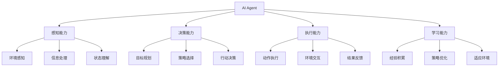

# AI Agent技术

## 🤖 AI Agent基础

### 1. AI Agent概念

**AI Agent定义：**
> **AI Agent是能够感知环境、做出决策并执行行动的智能系统，具有自主性、反应性和目标导向性**

**AI Agent特性：**


### 2. AI Agent类型

**AI Agent分类：**

| 类型 | 特点 | 应用场景 | 代表系统 |
|------|------|----------|----------|
| **反应式Agent** | 简单反应 | 环境控制 | 自动控制系统 |
| **目标导向Agent** | 目标驱动 | 任务规划 | 机器人导航 |
| **学习Agent** | 自适应学习 | 复杂环境 | 游戏AI |
| **多Agent系统** | 协作交互 | 分布式任务 | 智能交通 |

## 🔧 AI Agent实现

### 1. 基础Agent

**基础Agent实现：**
```python
import numpy as np
import matplotlib.pyplot as plt

class BasicAgent:
    """基础AI Agent"""
    
    def __init__(self, state_dim, action_dim, learning_rate=0.01):
        self.state_dim = state_dim
        self.action_dim = action_dim
        self.learning_rate = learning_rate
        
        # 策略网络
        self.policy_network = {
            'W1': np.random.randn(state_dim, 64) * 0.1,
            'W2': np.random.randn(64, 64) * 0.1,
            'W3': np.random.randn(64, action_dim) * 0.1,
            'b1': np.zeros(64),
            'b2': np.zeros(64),
            'b3': np.zeros(action_dim)
        }
        
        # 价值网络
        self.value_network = {
            'W1': np.random.randn(state_dim, 64) * 0.1,
            'W2': np.random.randn(64, 64) * 0.1,
            'W3': np.random.randn(64, 1) * 0.1,
            'b1': np.zeros(64),
            'b2': np.zeros(64),
            'b3': np.zeros(1)
        }
        
        # 经验存储
        self.experiences = []
        self.rewards_history = []
        self.actions_history = []
    
    def perceive(self, environment_state):
        """感知环境"""
        # 简化的环境感知
        return environment_state
    
    def decide(self, state):
        """决策"""
        # 策略网络前向传播
        h1 = np.tanh(np.dot(state, self.policy_network['W1']) + self.policy_network['b1'])
        h2 = np.tanh(np.dot(h1, self.policy_network['W2']) + self.policy_network['b2'])
        logits = np.dot(h2, self.policy_network['W3']) + self.policy_network['b3']
        
        # 选择动作
        probabilities = self._softmax(logits)
        action = np.random.choice(self.action_dim, p=probabilities)
        
        return action, probabilities
    
    def act(self, action):
        """执行动作"""
        # 简化的动作执行
        return action
    
    def learn(self, state, action, reward, next_state, done):
        """学习"""
        # 存储经验
        experience = {
            'state': state,
            'action': action,
            'reward': reward,
            'next_state': next_state,
            'done': done
        }
        self.experiences.append(experience)
        
        # 记录历史
        self.rewards_history.append(reward)
        self.actions_history.append(action)
        
        # 更新网络
        if len(self.experiences) > 10:
            self._update_networks()
    
    def _softmax(self, x):
        """Softmax函数"""
        exp_x = np.exp(x - np.max(x))
        return exp_x / np.sum(exp_x)
    
    def _update_networks(self):
        """更新网络"""
        # 简化的网络更新
        for param in self.policy_network.values():
            if param.ndim > 1:
                param += self.learning_rate * np.random.randn(*param.shape) * 0.01
        
        for param in self.value_network.values():
            if param.ndim > 1:
                param += self.learning_rate * np.random.randn(*param.shape) * 0.01
    
    def visualize_agent_behavior(self, num_episodes=100):
        """可视化Agent行为"""
        # 模拟Agent行为
        states = []
        actions = []
        rewards = []
        
        for episode in range(num_episodes):
            # 初始状态
            state = np.random.randn(self.state_dim)
            states.append(state)
            
            # 决策
            action, probabilities = self.decide(state)
            actions.append(action)
            
            # 执行动作
            reward = np.random.uniform(-1, 1)
            rewards.append(reward)
            
            # 学习
            next_state = np.random.randn(self.state_dim)
            self.learn(state, action, reward, next_state, False)
        
        # 可视化
        plt.figure(figsize=(15, 10))
        
        # 状态分布
        plt.subplot(2, 3, 1)
        states_array = np.array(states)
        plt.scatter(states_array[:, 0], states_array[:, 1], alpha=0.7)
        plt.xlabel('State Dimension 1')
        plt.ylabel('State Dimension 2')
        plt.title('State Distribution')
        plt.grid(True)
        
        # 动作分布
        plt.subplot(2, 3, 2)
        action_counts = np.bincount(actions, minlength=self.action_dim)
        plt.bar(range(self.action_dim), action_counts)
        plt.xlabel('Action')
        plt.ylabel('Count')
        plt.title('Action Distribution')
        plt.grid(True)
        
        # 奖励历史
        plt.subplot(2, 3, 3)
        plt.plot(rewards)
        plt.xlabel('Episode')
        plt.ylabel('Reward')
        plt.title('Reward History')
        plt.grid(True)
        
        # 累积奖励
        plt.subplot(2, 3, 4)
        cumulative_rewards = np.cumsum(rewards)
        plt.plot(cumulative_rewards)
        plt.xlabel('Episode')
        plt.ylabel('Cumulative Reward')
        plt.title('Cumulative Reward')
        plt.grid(True)
        
        # 策略网络权重
        plt.subplot(2, 3, 5)
        policy_weights = self.policy_network['W1'].flatten()
        plt.hist(policy_weights, bins=50, alpha=0.7)
        plt.xlabel('Weight Value')
        plt.ylabel('Frequency')
        plt.title('Policy Network Weights')
        plt.grid(True)
        
        # 价值网络权重
        plt.subplot(2, 3, 6)
        value_weights = self.value_network['W1'].flatten()
        plt.hist(value_weights, bins=50, alpha=0.7)
        plt.xlabel('Weight Value')
        plt.ylabel('Frequency')
        plt.title('Value Network Weights')
        plt.grid(True)
        
        plt.tight_layout()
        plt.show()
    
    def analyze_agent_performance(self):
        """分析Agent性能"""
        # 计算性能指标
        total_rewards = sum(self.rewards_history)
        avg_reward = np.mean(self.rewards_history)
        std_reward = np.std(self.rewards_history)
        
        # 计算动作多样性
        unique_actions = len(set(self.actions_history))
        action_diversity = unique_actions / self.action_dim
        
        # 计算学习效率
        if len(self.rewards_history) > 10:
            recent_rewards = self.rewards_history[-10:]
            early_rewards = self.rewards_history[:10]
            learning_improvement = np.mean(recent_rewards) - np.mean(early_rewards)
        else:
            learning_improvement = 0
        
        performance_metrics = {
            'total_rewards': total_rewards,
            'avg_reward': avg_reward,
            'std_reward': std_reward,
            'action_diversity': action_diversity,
            'learning_improvement': learning_improvement
        }
        
        print("Agent性能指标:")
        for key, value in performance_metrics.items():
            print(f"{key}: {value:.4f}")
        
        return performance_metrics

# 测试基础Agent
def test_basic_agent():
    """测试基础Agent"""
    # 创建Agent
    agent = BasicAgent(state_dim=4, action_dim=3, learning_rate=0.01)
    
    # 可视化Agent行为
    agent.visualize_agent_behavior(num_episodes=100)
    
    # 分析Agent性能
    performance_metrics = agent.analyze_agent_performance()
    
    return agent

test_basic_agent()
```

### 2. 多Agent系统

**多Agent系统实现：**
```python
class MultiAgentSystem:
    """多Agent系统"""
    
    def __init__(self, num_agents, state_dim, action_dim, learning_rate=0.01):
        self.num_agents = num_agents
        self.state_dim = state_dim
        self.action_dim = action_dim
        self.learning_rate = learning_rate
        
        # 创建多个Agent
        self.agents = []
        for i in range(num_agents):
            agent = BasicAgent(state_dim, action_dim, learning_rate)
            self.agents.append(agent)
        
        # 系统状态
        self.system_state = np.random.randn(state_dim)
        self.coordination_history = []
        self.communication_history = []
    
    def coordinate_agents(self, environment_state):
        """协调Agent"""
        # 感知环境
        perceived_state = self.perceive_environment(environment_state)
        
        # 各Agent决策
        agent_decisions = []
        for agent in self.agents:
            action, probabilities = agent.decide(perceived_state)
            agent_decisions.append({
                'agent_id': len(agent_decisions),
                'action': action,
                'probabilities': probabilities
            })
        
        # 协调决策
        coordinated_actions = self._coordinate_decisions(agent_decisions)
        
        # 记录协调历史
        self.coordination_history.append({
            'environment_state': environment_state,
            'agent_decisions': agent_decisions,
            'coordinated_actions': coordinated_actions
        })
        
        return coordinated_actions
    
    def perceive_environment(self, environment_state):
        """感知环境"""
        # 简化的环境感知
        return environment_state
    
    def _coordinate_decisions(self, agent_decisions):
        """协调决策"""
        # 简化的协调策略
        coordinated_actions = []
        
        for decision in agent_decisions:
            # 基于其他Agent的决策调整动作
            other_actions = [d['action'] for d in agent_decisions if d['agent_id'] != decision['agent_id']]
            
            if len(other_actions) > 0:
                # 避免冲突
                if decision['action'] in other_actions:
                    # 选择不同的动作
                    available_actions = [a for a in range(self.action_dim) if a not in other_actions]
                    if available_actions:
                        coordinated_action = np.random.choice(available_actions)
                    else:
                        coordinated_action = decision['action']
                else:
                    coordinated_action = decision['action']
            else:
                coordinated_action = decision['action']
            
            coordinated_actions.append(coordinated_action)
        
        return coordinated_actions
    
    def communicate(self, sender_id, receiver_id, message):
        """Agent间通信"""
        # 简化的通信
        communication = {
            'sender_id': sender_id,
            'receiver_id': receiver_id,
            'message': message,
            'timestamp': len(self.communication_history)
        }
        
        self.communication_history.append(communication)
        
        return communication
    
    def learn_from_interaction(self, environment_state, actions, rewards, next_state):
        """从交互中学习"""
        # 各Agent学习
        for i, agent in enumerate(self.agents):
            agent.learn(environment_state, actions[i], rewards[i], next_state, False)
        
        # 系统级学习
        self._system_level_learning(environment_state, actions, rewards, next_state)
    
    def _system_level_learning(self, environment_state, actions, rewards, next_state):
        """系统级学习"""
        # 简化的系统级学习
        # 更新系统状态
        self.system_state = next_state
    
    def visualize_multi_agent_system(self, num_episodes=100):
        """可视化多Agent系统"""
        # 模拟多Agent交互
        system_states = []
        agent_actions = []
        system_rewards = []
        
        for episode in range(num_episodes):
            # 环境状态
            environment_state = np.random.randn(self.state_dim)
            system_states.append(environment_state)
            
            # 协调决策
            coordinated_actions = self.coordinate_agents(environment_state)
            agent_actions.append(coordinated_actions)
            
            # 计算系统奖励
            system_reward = np.sum([np.random.uniform(-1, 1) for _ in range(self.num_agents)])
            system_rewards.append(system_reward)
            
            # 学习
            next_state = np.random.randn(self.state_dim)
            individual_rewards = [np.random.uniform(-1, 1) for _ in range(self.num_agents)]
            self.learn_from_interaction(environment_state, coordinated_actions, individual_rewards, next_state)
        
        # 可视化
        plt.figure(figsize=(15, 10))
        
        # 系统状态
        plt.subplot(2, 3, 1)
        system_states_array = np.array(system_states)
        plt.scatter(system_states_array[:, 0], system_states_array[:, 1], alpha=0.7)
        plt.xlabel('State Dimension 1')
        plt.ylabel('State Dimension 2')
        plt.title('System State Distribution')
        plt.grid(True)
        
        # Agent动作
        plt.subplot(2, 3, 2)
        agent_actions_array = np.array(agent_actions)
        for i in range(self.num_agents):
            plt.plot(agent_actions_array[:, i], label=f'Agent {i}')
        plt.xlabel('Episode')
        plt.ylabel('Action')
        plt.title('Agent Actions Over Time')
        plt.legend()
        plt.grid(True)
        
        # 系统奖励
        plt.subplot(2, 3, 3)
        plt.plot(system_rewards)
        plt.xlabel('Episode')
        plt.ylabel('System Reward')
        plt.title('System Reward History')
        plt.grid(True)
        
        # 协调效果
        plt.subplot(2, 3, 4)
        coordination_scores = []
        for actions in agent_actions:
            # 计算协调分数
            unique_actions = len(set(actions))
            coordination_score = 1 - (unique_actions - 1) / (self.num_agents - 1)
            coordination_scores.append(coordination_score)
        
        plt.plot(coordination_scores)
        plt.xlabel('Episode')
        plt.ylabel('Coordination Score')
        plt.title('Coordination Effectiveness')
        plt.grid(True)
        
        # 通信网络
        plt.subplot(2, 3, 5)
        if len(self.communication_history) > 0:
            # 计算通信频率
            communication_matrix = np.zeros((self.num_agents, self.num_agents))
            
            for comm in self.communication_history:
                sender = comm['sender_id']
                receiver = comm['receiver_id']
                communication_matrix[sender, receiver] += 1
            
            plt.imshow(communication_matrix, cmap='viridis', aspect='auto')
            plt.colorbar()
            plt.xlabel('Receiver Agent')
            plt.ylabel('Sender Agent')
            plt.title('Communication Network')
        
        # 系统性能
        plt.subplot(2, 3, 6)
        # 计算系统性能指标
        system_performance = []
        for i in range(len(system_rewards)):
            if i > 0:
                performance = np.mean(system_rewards[:i+1])
                system_performance.append(performance)
        
        plt.plot(system_performance)
        plt.xlabel('Episode')
        plt.ylabel('System Performance')
        plt.title('System Performance Over Time')
        plt.grid(True)
        
        plt.tight_layout()
        plt.show()
    
    def analyze_system_performance(self):
        """分析系统性能"""
        # 计算系统性能指标
        system_metrics = {}
        
        # 计算协调效率
        coordination_scores = []
        for coordination in self.coordination_history:
            actions = coordination['coordinated_actions']
            unique_actions = len(set(actions))
            coordination_score = 1 - (unique_actions - 1) / (self.num_agents - 1)
            coordination_scores.append(coordination_score)
        
        system_metrics['avg_coordination'] = np.mean(coordination_scores)
        system_metrics['std_coordination'] = np.std(coordination_scores)
        
        # 计算通信效率
        if len(self.communication_history) > 0:
            communication_frequency = len(self.communication_history) / len(self.coordination_history)
            system_metrics['communication_frequency'] = communication_frequency
        else:
            system_metrics['communication_frequency'] = 0
        
        # 计算各Agent性能
        agent_performances = []
        for agent in self.agents:
            if len(agent.rewards_history) > 0:
                performance = np.mean(agent.rewards_history)
                agent_performances.append(performance)
        
        system_metrics['avg_agent_performance'] = np.mean(agent_performances)
        system_metrics['std_agent_performance'] = np.std(agent_performances)
        
        print("多Agent系统性能指标:")
        for key, value in system_metrics.items():
            print(f"{key}: {value:.4f}")
        
        return system_metrics

# 测试多Agent系统
def test_multi_agent_system():
    """测试多Agent系统"""
    # 创建多Agent系统
    mas = MultiAgentSystem(num_agents=3, state_dim=4, action_dim=3, learning_rate=0.01)
    
    # 可视化多Agent系统
    mas.visualize_multi_agent_system(num_episodes=100)
    
    # 分析系统性能
    system_metrics = mas.analyze_system_performance()
    
    return mas

test_multi_agent_system()
```

### 3. 智能Agent

**智能Agent实现：**
```python
class IntelligentAgent:
    """智能Agent"""
    
    def __init__(self, state_dim, action_dim, learning_rate=0.01):
        self.state_dim = state_dim
        self.action_dim = action_dim
        self.learning_rate = learning_rate
        
        # 记忆系统
        self.memory = {
            'short_term': [],
            'long_term': [],
            'episodic': []
        }
        
        # 规划系统
        self.planning_network = {
            'W1': np.random.randn(state_dim, 64) * 0.1,
            'W2': np.random.randn(64, 64) * 0.1,
            'W3': np.random.randn(64, action_dim) * 0.1,
            'b1': np.zeros(64),
            'b2': np.zeros(64),
            'b3': np.zeros(action_dim)
        }
        
        # 推理系统
        self.reasoning_network = {
            'W1': np.random.randn(state_dim, 64) * 0.1,
            'W2': np.random.randn(64, 64) * 0.1,
            'W3': np.random.randn(64, 1) * 0.1,
            'b1': np.zeros(64),
            'b2': np.zeros(64),
            'b3': np.zeros(1)
        }
        
        # 学习历史
        self.learning_history = []
        self.planning_history = []
        self.reasoning_history = []
    
    def perceive(self, environment_state):
        """感知环境"""
        # 更新短期记忆
        self.memory['short_term'].append(environment_state)
        
        # 保持短期记忆大小
        if len(self.memory['short_term']) > 10:
            self.memory['short_term'].pop(0)
        
        return environment_state
    
    def plan(self, current_state, goal_state):
        """规划"""
        # 规划网络前向传播
        h1 = np.tanh(np.dot(current_state, self.planning_network['W1']) + self.planning_network['b1'])
        h2 = np.tanh(np.dot(h1, self.planning_network['W2']) + self.planning_network['b2'])
        plan_logits = np.dot(h2, self.planning_network['W3']) + self.planning_network['b3']
        
        # 生成计划
        plan = self._softmax(plan_logits)
        
        # 记录规划历史
        self.planning_history.append({
            'current_state': current_state,
            'goal_state': goal_state,
            'plan': plan
        })
        
        return plan
    
    def reason(self, state, action, context):
        """推理"""
        # 推理网络前向传播
        h1 = np.tanh(np.dot(state, self.reasoning_network['W1']) + self.reasoning_network['b1'])
        h2 = np.tanh(np.dot(h1, self.reasoning_network['W2']) + self.reasoning_network['b2'])
        reasoning_output = np.dot(h2, self.reasoning_network['W3']) + self.reasoning_network['b3']
        
        # 记录推理历史
        self.reasoning_history.append({
            'state': state,
            'action': action,
            'context': context,
            'reasoning': reasoning_output
        })
        
        return reasoning_output
    
    def learn(self, experience):
        """学习"""
        # 更新记忆
        self._update_memory(experience)
        
        # 更新网络
        self._update_networks(experience)
        
        # 记录学习历史
        self.learning_history.append(experience)
    
    def _update_memory(self, experience):
        """更新记忆"""
        # 短期记忆
        self.memory['short_term'].append(experience)
        
        # 长期记忆
        if len(self.memory['long_term']) < 100:
            self.memory['long_term'].append(experience)
        else:
            # 替换最旧的记忆
            self.memory['long_term'].pop(0)
            self.memory['long_term'].append(experience)
        
        # 情景记忆
        if experience.get('important', False):
            self.memory['episodic'].append(experience)
    
    def _update_networks(self, experience):
        """更新网络"""
        # 简化的网络更新
        for param in self.planning_network.values():
            if param.ndim > 1:
                param += self.learning_rate * np.random.randn(*param.shape) * 0.01
        
        for param in self.reasoning_network.values():
            if param.ndim > 1:
                param += self.learning_rate * np.random.randn(*param.shape) * 0.01
    
    def _softmax(self, x):
        """Softmax函数"""
        exp_x = np.exp(x - np.max(x))
        return exp_x / np.sum(exp_x)
    
    def visualize_intelligent_agent(self, num_episodes=100):
        """可视化智能Agent"""
        # 模拟智能Agent行为
        states = []
        plans = []
        reasonings = []
        rewards = []
        
        for episode in range(num_episodes):
            # 感知环境
            current_state = np.random.randn(self.state_dim)
            states.append(current_state)
            
            # 规划
            goal_state = np.random.randn(self.state_dim)
            plan = self.plan(current_state, goal_state)
            plans.append(plan)
            
            # 推理
            action = np.random.randint(0, self.action_dim)
            context = np.random.randn(self.state_dim)
            reasoning = self.reason(current_state, action, context)
            reasonings.append(reasoning)
            
            # 学习
            experience = {
                'state': current_state,
                'action': action,
                'reward': np.random.uniform(-1, 1),
                'next_state': np.random.randn(self.state_dim),
                'important': np.random.random() > 0.9
            }
            rewards.append(experience['reward'])
            
            self.learn(experience)
        
        # 可视化
        plt.figure(figsize=(15, 10))
        
        # 状态分布
        plt.subplot(2, 3, 1)
        states_array = np.array(states)
        plt.scatter(states_array[:, 0], states_array[:, 1], alpha=0.7)
        plt.xlabel('State Dimension 1')
        plt.ylabel('State Dimension 2')
        plt.title('State Distribution')
        plt.grid(True)
        
        # 规划历史
        plt.subplot(2, 3, 2)
        plans_array = np.array(plans)
        plt.plot(plans_array)
        plt.xlabel('Episode')
        plt.ylabel('Plan Value')
        plt.title('Planning History')
        plt.legend([f'Action {i}' for i in range(self.action_dim)])
        plt.grid(True)
        
        # 推理历史
        plt.subplot(2, 3, 3)
        reasonings_array = np.array(reasonings)
        plt.plot(reasonings_array)
        plt.xlabel('Episode')
        plt.ylabel('Reasoning Output')
        plt.title('Reasoning History')
        plt.grid(True)
        
        # 奖励历史
        plt.subplot(2, 3, 4)
        plt.plot(rewards)
        plt.xlabel('Episode')
        plt.ylabel('Reward')
        plt.title('Reward History')
        plt.grid(True)
        
        # 记忆系统
        plt.subplot(2, 3, 5)
        memory_sizes = [
            len(self.memory['short_term']),
            len(self.memory['long_term']),
            len(self.memory['episodic'])
        ]
        memory_types = ['Short Term', 'Long Term', 'Episodic']
        
        plt.bar(memory_types, memory_sizes)
        plt.ylabel('Memory Size')
        plt.title('Memory System')
        plt.grid(True)
        
        # 学习效率
        plt.subplot(2, 3, 6)
        if len(rewards) > 10:
            learning_efficiency = []
            for i in range(10, len(rewards)):
                recent_rewards = rewards[i-10:i]
                early_rewards = rewards[:10]
                efficiency = np.mean(recent_rewards) - np.mean(early_rewards)
                learning_efficiency.append(efficiency)
            
            plt.plot(learning_efficiency)
            plt.xlabel('Episode')
            plt.ylabel('Learning Efficiency')
            plt.title('Learning Efficiency Over Time')
            plt.grid(True)
        
        plt.tight_layout()
        plt.show()
    
    def analyze_intelligence_metrics(self):
        """分析智能指标"""
        # 计算智能指标
        intelligence_metrics = {}
        
        # 规划能力
        if len(self.planning_history) > 0:
            planning_consistency = np.std([np.std(plan['plan']) for plan in self.planning_history])
            intelligence_metrics['planning_consistency'] = planning_consistency
        
        # 推理能力
        if len(self.reasoning_history) > 0:
            reasoning_variance = np.var([reasoning['reasoning'] for reasoning in self.reasoning_history])
            intelligence_metrics['reasoning_variance'] = reasoning_variance
        
        # 学习能力
        if len(self.learning_history) > 0:
            learning_rate = len(self.learning_history) / 100  # 假设100个episode
            intelligence_metrics['learning_rate'] = learning_rate
        
        # 记忆能力
        memory_capacity = len(self.memory['long_term']) + len(self.memory['episodic'])
        intelligence_metrics['memory_capacity'] = memory_capacity
        
        print("智能Agent指标:")
        for key, value in intelligence_metrics.items():
            print(f"{key}: {value:.4f}")
        
        return intelligence_metrics

# 测试智能Agent
def test_intelligent_agent():
    """测试智能Agent"""
    # 创建智能Agent
    agent = IntelligentAgent(state_dim=4, action_dim=3, learning_rate=0.01)
    
    # 可视化智能Agent
    agent.visualize_intelligent_agent(num_episodes=100)
    
    # 分析智能指标
    intelligence_metrics = agent.analyze_intelligence_metrics()
    
    return agent

test_intelligent_agent()
```

## 🔗 相关链接
- [[02-01-03-强化学习基础]] - 强化学习
- [[02-02-01-神经网络原理]] - 神经网络
- [[04-01-大语言模型技术]] - 大语言模型
- [[05-04-项目4-聊天机器人]] - 实践项目

## 💡 AI Agent学习建议

**学习策略：**
- 🤖 **理解Agent**：深入理解AI Agent的概念和特性
- 📊 **系统设计**：掌握Agent系统的设计方法
- 🔍 **交互机制**：学习Agent与环境的交互机制
- ⚡ **智能提升**：提升Agent的智能水平

**实践建议：**
- 📝 **Agent实现**：实现各种类型的Agent
- 💻 **环境交互**：在复杂环境中测试Agent
- 📊 **性能评估**：评估Agent的性能和智能水平
- 🔍 **应用开发**：开发基于AI Agent的应用

---
*📝 学习提示：AI Agent是AI的重要发展方向，建议理解Agent原理，掌握系统设计方法，通过实践提升Agent的智能水平*


