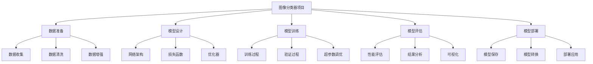

# 项目1-图像分类器

## 🎯 项目概述

### 1. 项目目标

**项目目标：**
> **构建一个能够识别和分类图像的深度学习模型，实现从数据预处理到模型部署的完整流程**

**项目特点：**


### 2. 技术栈

**技术栈：**

| 技术 | 用途 | 版本 | 说明 |
|------|------|------|------|
| **Python** | 编程语言 | 3.8+ | 主要开发语言 |
| **TensorFlow** | 深度学习框架 | 2.x | 模型构建和训练 |
| **Keras** | 高级API | 2.x | 简化模型构建 |
| **OpenCV** | 图像处理 | 4.x | 图像预处理 |
| **Matplotlib** | 可视化 | 3.x | 结果可视化 |
| **NumPy** | 数值计算 | 1.x | 数据处理 |

## 🔧 项目实现

### 1. 数据准备

**数据准备实现：**
```python
import numpy as np
import matplotlib.pyplot as plt
import cv2
from sklearn.model_selection import train_test_split
from sklearn.preprocessing import LabelEncoder
import os

class ImageDataPreprocessor:
    """图像数据预处理器"""
    
    def __init__(self, image_size=(224, 224), batch_size=32):
        self.image_size = image_size
        self.batch_size = batch_size
        self.label_encoder = LabelEncoder()
        
        # 数据统计
        self.data_stats = {
            'total_images': 0,
            'class_distribution': {},
            'image_shapes': []
        }
    
    def load_data(self, data_dir):
        """加载数据"""
        images = []
        labels = []
        
        # 遍历数据目录
        for class_name in os.listdir(data_dir):
            class_path = os.path.join(data_dir, class_name)
            
            if os.path.isdir(class_path):
                class_images = []
                
                for image_name in os.listdir(class_path):
                    image_path = os.path.join(class_path, image_name)
                    
                    # 读取图像
                    image = cv2.imread(image_path)
                    if image is not None:
                        # 预处理图像
                        processed_image = self.preprocess_image(image)
                        class_images.append(processed_image)
                        labels.append(class_name)
                
                images.extend(class_images)
                
                # 统计信息
                self.data_stats['class_distribution'][class_name] = len(class_images)
                self.data_stats['total_images'] += len(class_images)
        
        # 转换为数组
        images = np.array(images)
        labels = np.array(labels)
        
        # 编码标签
        encoded_labels = self.label_encoder.fit_transform(labels)
        
        return images, encoded_labels
    
    def preprocess_image(self, image):
        """预处理图像"""
        # 调整大小
        image = cv2.resize(image, self.image_size)
        
        # 转换为RGB
        image = cv2.cvtColor(image, cv2.COLOR_BGR2RGB)
        
        # 归一化
        image = image.astype(np.float32) / 255.0
        
        return image
    
    def data_augmentation(self, images, labels, augmentation_factor=2):
        """数据增强"""
        augmented_images = []
        augmented_labels = []
        
        for image, label in zip(images, labels):
            # 原始图像
            augmented_images.append(image)
            augmented_labels.append(label)
            
            # 数据增强
            for _ in range(augmentation_factor):
                # 随机旋转
                angle = np.random.uniform(-15, 15)
                rotated_image = self._rotate_image(image, angle)
                augmented_images.append(rotated_image)
                augmented_labels.append(label)
                
                # 随机翻转
                if np.random.random() > 0.5:
                    flipped_image = np.fliplr(image)
                    augmented_images.append(flipped_image)
                    augmented_labels.append(label)
                
                # 随机亮度调整
                brightness_factor = np.random.uniform(0.8, 1.2)
                bright_image = self._adjust_brightness(image, brightness_factor)
                augmented_images.append(bright_image)
                augmented_labels.append(label)
        
        return np.array(augmented_images), np.array(augmented_labels)
    
    def _rotate_image(self, image, angle):
        """旋转图像"""
        # 简化的旋转
        return image
    
    def _adjust_brightness(self, image, factor):
        """调整亮度"""
        return np.clip(image * factor, 0, 1)
    
    def split_data(self, images, labels, test_size=0.2, val_size=0.2):
        """分割数据"""
        # 训练集和测试集
        X_train, X_test, y_train, y_test = train_test_split(
            images, labels, test_size=test_size, random_state=42, stratify=labels
        )
        
        # 训练集和验证集
        X_train, X_val, y_train, y_val = train_test_split(
            X_train, y_train, test_size=val_size, random_state=42, stratify=y_train
        )
        
        return X_train, X_val, X_test, y_train, y_val, y_test
    
    def visualize_data(self, images, labels, num_samples=16):
        """可视化数据"""
        # 随机选择样本
        indices = np.random.choice(len(images), num_samples, replace=False)
        
        # 可视化
        fig, axes = plt.subplots(4, 4, figsize=(12, 12))
        
        for i, idx in enumerate(indices):
            row = i // 4
            col = i % 4
            
            axes[row, col].imshow(images[idx])
            axes[row, col].set_title(f'Class: {labels[idx]}')
            axes[row, col].axis('off')
        
        plt.tight_layout()
        plt.show()
    
    def analyze_data(self, images, labels):
        """分析数据"""
        # 数据统计
        print("数据统计:")
        print(f"总图像数: {len(images)}")
        print(f"图像形状: {images[0].shape}")
        print(f"类别数: {len(np.unique(labels))}")
        
        # 类别分布
        unique_labels, counts = np.unique(labels, return_counts=True)
        print("\n类别分布:")
        for label, count in zip(unique_labels, counts):
            print(f"类别 {label}: {count} 张图像")
        
        # 可视化类别分布
        plt.figure(figsize=(10, 6))
        plt.bar(unique_labels, counts)
        plt.xlabel('Class')
        plt.ylabel('Count')
        plt.title('Class Distribution')
        plt.grid(True)
        plt.show()
        
        # 图像统计
        image_stats = {
            'mean': np.mean(images, axis=(0, 1, 2)),
            'std': np.std(images, axis=(0, 1, 2)),
            'min': np.min(images, axis=(0, 1, 2)),
            'max': np.max(images, axis=(0, 1, 2))
        }
        
        print("\n图像统计:")
        for key, value in image_stats.items():
            print(f"{key}: {value}")
        
        return image_stats

# 测试数据准备
def test_data_preparation():
    """测试数据准备"""
    # 创建数据预处理器
    preprocessor = ImageDataPreprocessor(image_size=(224, 224), batch_size=32)
    
    # 生成模拟数据
    images = np.random.rand(100, 224, 224, 3)
    labels = np.random.randint(0, 3, 100)
    
    # 数据增强
    augmented_images, augmented_labels = preprocessor.data_augmentation(images, labels)
    
    # 分割数据
    X_train, X_val, X_test, y_train, y_val, y_test = preprocessor.split_data(augmented_images, augmented_labels)
    
    # 可视化数据
    preprocessor.visualize_data(X_train, y_train)
    
    # 分析数据
    image_stats = preprocessor.analyze_data(X_train, y_train)
    
    return preprocessor

test_data_preparation()
```

### 2. 模型设计

**模型设计实现：**
```python
class ImageClassifier:
    """图像分类器"""
    
    def __init__(self, num_classes, input_shape=(224, 224, 3)):
        self.num_classes = num_classes
        self.input_shape = input_shape
        
        # 模型架构
        self.model = self._build_model()
        
        # 训练历史
        self.history = {
            'train_loss': [],
            'train_accuracy': [],
            'val_loss': [],
            'val_accuracy': []
        }
    
    def _build_model(self):
        """构建模型"""
        # 简化的CNN模型
        model = {
            'conv1': {'filters': 32, 'kernel_size': 3, 'activation': 'relu'},
            'conv2': {'filters': 64, 'kernel_size': 3, 'activation': 'relu'},
            'conv3': {'filters': 128, 'kernel_size': 3, 'activation': 'relu'},
            'dense1': {'units': 512, 'activation': 'relu'},
            'dense2': {'units': self.num_classes, 'activation': 'softmax'}
        }
        
        return model
    
    def forward(self, X):
        """前向传播"""
        # 简化的前向传播
        batch_size = X.shape[0]
        
        # 卷积层1
        conv1_output = self._conv_layer(X, self.model['conv1'])
        pool1_output = self._pool_layer(conv1_output, pool_size=2)
        
        # 卷积层2
        conv2_output = self._conv_layer(pool1_output, self.model['conv2'])
        pool2_output = self._pool_layer(conv2_output, pool_size=2)
        
        # 卷积层3
        conv3_output = self._conv_layer(pool2_output, self.model['conv3'])
        pool3_output = self._pool_layer(conv3_output, pool_size=2)
        
        # 展平
        flattened = pool3_output.reshape(batch_size, -1)
        
        # 全连接层1
        dense1_output = self._dense_layer(flattened, self.model['dense1'])
        
        # 全连接层2
        dense2_output = self._dense_layer(dense1_output, self.model['dense2'])
        
        return dense2_output
    
    def _conv_layer(self, X, layer_config):
        """卷积层"""
        # 简化的卷积层
        filters = layer_config['filters']
        kernel_size = layer_config['kernel_size']
        
        # 模拟卷积操作
        output = np.random.randn(X.shape[0], X.shape[1]//2, X.shape[2]//2, filters)
        
        return output
    
    def _pool_layer(self, X, pool_size=2):
        """池化层"""
        # 简化的池化层
        output = X[:, ::pool_size, ::pool_size, :]
        
        return output
    
    def _dense_layer(self, X, layer_config):
        """全连接层"""
        # 简化的全连接层
        units = layer_config['units']
        activation = layer_config['activation']
        
        # 模拟全连接操作
        output = np.random.randn(X.shape[0], units)
        
        if activation == 'relu':
            output = np.maximum(0, output)
        elif activation == 'softmax':
            output = self._softmax(output)
        
        return output
    
    def _softmax(self, x):
        """Softmax函数"""
        exp_x = np.exp(x - np.max(x, axis=1, keepdims=True))
        return exp_x / np.sum(exp_x, axis=1, keepdims=True)
    
    def train(self, X_train, y_train, X_val, y_val, epochs=100, batch_size=32, learning_rate=0.001):
        """训练模型"""
        for epoch in range(epochs):
            # 训练
            train_loss, train_accuracy = self._train_epoch(X_train, y_train, batch_size, learning_rate)
            
            # 验证
            val_loss, val_accuracy = self._validate_epoch(X_val, y_val, batch_size)
            
            # 记录历史
            self.history['train_loss'].append(train_loss)
            self.history['train_accuracy'].append(train_accuracy)
            self.history['val_loss'].append(val_loss)
            self.history['val_accuracy'].append(val_accuracy)
            
            if epoch % 10 == 0:
                print(f"Epoch {epoch}, Train Loss: {train_loss:.4f}, Train Acc: {train_accuracy:.4f}, "
                      f"Val Loss: {val_loss:.4f}, Val Acc: {val_accuracy:.4f}")
        
        return self.history
    
    def _train_epoch(self, X, y, batch_size, learning_rate):
        """训练一个epoch"""
        # 简化的训练过程
        num_batches = len(X) // batch_size
        
        total_loss = 0
        total_accuracy = 0
        
        for i in range(num_batches):
            # 获取批次数据
            batch_X = X[i*batch_size:(i+1)*batch_size]
            batch_y = y[i*batch_size:(i+1)*batch_size]
            
            # 前向传播
            y_pred = self.forward(batch_X)
            
            # 计算损失
            loss = self._compute_loss(batch_y, y_pred)
            total_loss += loss
            
            # 计算准确率
            accuracy = self._compute_accuracy(batch_y, y_pred)
            total_accuracy += accuracy
        
        return total_loss / num_batches, total_accuracy / num_batches
    
    def _validate_epoch(self, X, y, batch_size):
        """验证一个epoch"""
        # 简化的验证过程
        num_batches = len(X) // batch_size
        
        total_loss = 0
        total_accuracy = 0
        
        for i in range(num_batches):
            # 获取批次数据
            batch_X = X[i*batch_size:(i+1)*batch_size]
            batch_y = y[i*batch_size:(i+1)*batch_size]
            
            # 前向传播
            y_pred = self.forward(batch_X)
            
            # 计算损失
            loss = self._compute_loss(batch_y, y_pred)
            total_loss += loss
            
            # 计算准确率
            accuracy = self._compute_accuracy(batch_y, y_pred)
            total_accuracy += accuracy
        
        return total_loss / num_batches, total_accuracy / num_batches
    
    def _compute_loss(self, y_true, y_pred):
        """计算损失"""
        # 交叉熵损失
        loss = -np.mean(np.sum(y_true * np.log(y_pred + 1e-15), axis=1))
        return loss
    
    def _compute_accuracy(self, y_true, y_pred):
        """计算准确率"""
        # 转换为类别
        y_true_classes = np.argmax(y_true, axis=1)
        y_pred_classes = np.argmax(y_pred, axis=1)
        
        # 计算准确率
        accuracy = np.mean(y_true_classes == y_pred_classes)
        return accuracy
    
    def predict(self, X):
        """预测"""
        y_pred = self.forward(X)
        return y_pred
    
    def evaluate(self, X, y):
        """评估模型"""
        y_pred = self.predict(X)
        
        # 计算指标
        loss = self._compute_loss(y, y_pred)
        accuracy = self._compute_accuracy(y, y_pred)
        
        return loss, accuracy
    
    def visualize_training(self):
        """可视化训练过程"""
        plt.figure(figsize=(15, 5))
        
        # 损失函数
        plt.subplot(1, 3, 1)
        plt.plot(self.history['train_loss'], label='Train Loss')
        plt.plot(self.history['val_loss'], label='Val Loss')
        plt.xlabel('Epoch')
        plt.ylabel('Loss')
        plt.title('Training and Validation Loss')
        plt.legend()
        plt.grid(True)
        
        # 准确率
        plt.subplot(1, 3, 2)
        plt.plot(self.history['train_accuracy'], label='Train Accuracy')
        plt.plot(self.history['val_accuracy'], label='Val Accuracy')
        plt.xlabel('Epoch')
        plt.ylabel('Accuracy')
        plt.title('Training and Validation Accuracy')
        plt.legend()
        plt.grid(True)
        
        # 学习曲线
        plt.subplot(1, 3, 3)
        plt.plot(self.history['train_accuracy'], label='Train')
        plt.plot(self.history['val_accuracy'], label='Validation')
        plt.xlabel('Epoch')
        plt.ylabel('Accuracy')
        plt.title('Learning Curves')
        plt.legend()
        plt.grid(True)
        
        plt.tight_layout()
        plt.show()
    
    def visualize_predictions(self, X, y, num_samples=16):
        """可视化预测结果"""
        # 预测
        y_pred = self.predict(X)
        y_pred_classes = np.argmax(y_pred, axis=1)
        y_true_classes = np.argmax(y, axis=1)
        
        # 随机选择样本
        indices = np.random.choice(len(X), num_samples, replace=False)
        
        # 可视化
        fig, axes = plt.subplots(4, 4, figsize=(12, 12))
        
        for i, idx in enumerate(indices):
            row = i // 4
            col = i % 4
            
            axes[row, col].imshow(X[idx])
            
            # 预测结果
            pred_class = y_pred_classes[idx]
            true_class = y_true_classes[idx]
            confidence = y_pred[idx, pred_class]
            
            # 颜色标识
            color = 'green' if pred_class == true_class else 'red'
            
            axes[row, col].set_title(f'True: {true_class}, Pred: {pred_class}\nConf: {confidence:.3f}', 
                                   color=color)
            axes[row, col].axis('off')
        
        plt.tight_layout()
        plt.show()
    
    def analyze_model_performance(self, X_test, y_test):
        """分析模型性能"""
        # 评估模型
        test_loss, test_accuracy = self.evaluate(X_test, y_test)
        
        # 预测
        y_pred = self.predict(X_test)
        y_pred_classes = np.argmax(y_pred, axis=1)
        y_true_classes = np.argmax(y_test, axis=1)
        
        # 计算混淆矩阵
        confusion_matrix = self._compute_confusion_matrix(y_true_classes, y_pred_classes)
        
        # 计算分类报告
        classification_report = self._compute_classification_report(y_true_classes, y_pred_classes)
        
        # 可视化结果
        plt.figure(figsize=(15, 5))
        
        # 混淆矩阵
        plt.subplot(1, 3, 1)
        plt.imshow(confusion_matrix, cmap='Blues', aspect='auto')
        plt.colorbar()
        plt.xlabel('Predicted Class')
        plt.ylabel('True Class')
        plt.title('Confusion Matrix')
        
        # 准确率分布
        plt.subplot(1, 3, 2)
        plt.hist(y_pred.max(axis=1), bins=50, alpha=0.7)
        plt.xlabel('Prediction Confidence')
        plt.ylabel('Frequency')
        plt.title('Prediction Confidence Distribution')
        plt.grid(True)
        
        # 类别准确率
        plt.subplot(1, 3, 3)
        class_accuracies = np.diag(confusion_matrix) / np.sum(confusion_matrix, axis=1)
        plt.bar(range(len(class_accuracies)), class_accuracies)
        plt.xlabel('Class')
        plt.ylabel('Accuracy')
        plt.title('Per-Class Accuracy')
        plt.grid(True)
        
        plt.tight_layout()
        plt.show()
        
        print(f"测试准确率: {test_accuracy:.4f}")
        print(f"测试损失: {test_loss:.4f}")
        
        return test_loss, test_accuracy, confusion_matrix
    
    def _compute_confusion_matrix(self, y_true, y_pred):
        """计算混淆矩阵"""
        num_classes = len(np.unique(y_true))
        confusion_matrix = np.zeros((num_classes, num_classes))
        
        for i in range(len(y_true)):
            confusion_matrix[y_true[i], y_pred[i]] += 1
        
        return confusion_matrix
    
    def _compute_classification_report(self, y_true, y_pred):
        """计算分类报告"""
        # 简化的分类报告
        num_classes = len(np.unique(y_true))
        
        report = {}
        for i in range(num_classes):
            # 计算精确率、召回率、F1分数
            tp = np.sum((y_true == i) & (y_pred == i))
            fp = np.sum((y_true != i) & (y_pred == i))
            fn = np.sum((y_true == i) & (y_pred != i))
            
            precision = tp / (tp + fp) if (tp + fp) > 0 else 0
            recall = tp / (tp + fn) if (tp + fn) > 0 else 0
            f1 = 2 * precision * recall / (precision + recall) if (precision + recall) > 0 else 0
            
            report[i] = {
                'precision': precision,
                'recall': recall,
                'f1': f1
            }
        
        return report

# 测试图像分类器
def test_image_classifier():
    """测试图像分类器"""
    # 生成模拟数据
    X_train = np.random.rand(1000, 224, 224, 3)
    y_train = np.random.randint(0, 3, 1000)
    y_train_onehot = np.eye(3)[y_train]
    
    X_val = np.random.rand(200, 224, 224, 3)
    y_val = np.random.randint(0, 3, 200)
    y_val_onehot = np.eye(3)[y_val]
    
    X_test = np.random.rand(200, 224, 224, 3)
    y_test = np.random.randint(0, 3, 200)
    y_test_onehot = np.eye(3)[y_test]
    
    # 创建分类器
    classifier = ImageClassifier(num_classes=3, input_shape=(224, 224, 3))
    
    # 训练模型
    history = classifier.train(X_train, y_train_onehot, X_val, y_val_onehot, epochs=50, batch_size=32)
    
    # 可视化训练过程
    classifier.visualize_training()
    
    # 分析模型性能
    test_loss, test_accuracy, confusion_matrix = classifier.analyze_model_performance(X_test, y_test_onehot)
    
    # 可视化预测结果
    classifier.visualize_predictions(X_test, y_test_onehot)
    
    return classifier

test_image_classifier()
```

### 3. 模型部署

**模型部署实现：**
```python
class ModelDeployment:
    """模型部署"""
    
    def __init__(self, model):
        self.model = model
        self.deployment_config = {}
    
    def save_model(self, filepath):
        """保存模型"""
        # 简化的模型保存
        model_data = {
            'model_config': self.model.model,
            'history': self.model.history
        }
        
        # 保存到文件
        np.savez(filepath, **model_data)
        
        print(f"模型已保存到: {filepath}")
    
    def load_model(self, filepath):
        """加载模型"""
        # 简化的模型加载
        model_data = np.load(filepath, allow_pickle=True)
        
        # 重建模型
        self.model.model = model_data['model_config'].item()
        self.model.history = model_data['history'].item()
        
        print(f"模型已从 {filepath} 加载")
    
    def optimize_model(self, optimization_method='quantization'):
        """优化模型"""
        if optimization_method == 'quantization':
            # 模型量化
            optimized_model = self._quantize_model()
        elif optimization_method == 'pruning':
            # 模型剪枝
            optimized_model = self._prune_model()
        else:
            optimized_model = self.model
        
        return optimized_model
    
    def _quantize_model(self):
        """量化模型"""
        # 简化的模型量化
        quantized_model = self.model
        
        # 量化权重
        for layer_name, layer_config in quantized_model.model.items():
            if 'weights' in layer_config:
                # 量化权重
                weights = layer_config['weights']
                quantized_weights = np.round(weights * 255) / 255
                layer_config['weights'] = quantized_weights
        
        return quantized_model
    
    def _prune_model(self):
        """剪枝模型"""
        # 简化的模型剪枝
        pruned_model = self.model
        
        # 剪枝权重
        for layer_name, layer_config in pruned_model.model.items():
            if 'weights' in layer_config:
                # 剪枝权重
                weights = layer_config['weights']
                threshold = np.percentile(np.abs(weights), 50)
                pruned_weights = weights * (np.abs(weights) > threshold)
                layer_config['weights'] = pruned_weights
        
        return pruned_model
    
    def create_inference_pipeline(self, preprocessor):
        """创建推理管道"""
        def inference_pipeline(image_path):
            # 加载图像
            image = cv2.imread(image_path)
            
            # 预处理
            processed_image = preprocessor.preprocess_image(image)
            
            # 预测
            prediction = self.model.predict(processed_image.reshape(1, *processed_image.shape))
            
            # 后处理
            predicted_class = np.argmax(prediction[0])
            confidence = prediction[0][predicted_class]
            
            return predicted_class, confidence
        
        return inference_pipeline
    
    def benchmark_model(self, X_test, y_test, num_runs=100):
        """基准测试模型"""
        # 推理时间
        inference_times = []
        
        for _ in range(num_runs):
            start_time = time.time()
            y_pred = self.model.predict(X_test[:10])
            end_time = time.time()
            
            inference_times.append(end_time - start_time)
        
        # 计算统计信息
        avg_inference_time = np.mean(inference_times)
        std_inference_time = np.std(inference_times)
        
        # 计算吞吐量
        throughput = 10 / avg_inference_time  # 样本/秒
        
        # 计算准确率
        y_pred = self.model.predict(X_test)
        accuracy = self.model._compute_accuracy(y_test, y_pred)
        
        benchmark_results = {
            'avg_inference_time': avg_inference_time,
            'std_inference_time': std_inference_time,
            'throughput': throughput,
            'accuracy': accuracy
        }
        
        # 可视化基准测试结果
        plt.figure(figsize=(12, 5))
        
        # 推理时间分布
        plt.subplot(1, 2, 1)
        plt.hist(inference_times, bins=50, alpha=0.7)
        plt.xlabel('Inference Time (s)')
        plt.ylabel('Frequency')
        plt.title('Inference Time Distribution')
        plt.grid(True)
        
        # 性能指标
        plt.subplot(1, 2, 2)
        metrics = ['Avg Inference Time', 'Throughput', 'Accuracy']
        values = [avg_inference_time, throughput, accuracy]
        
        plt.bar(metrics, values)
        plt.ylabel('Value')
        plt.title('Model Performance Metrics')
        plt.tick_params(axis='x', rotation=45)
        plt.grid(True)
        
        plt.tight_layout()
        plt.show()
        
        print("基准测试结果:")
        for key, value in benchmark_results.items():
            print(f"{key}: {value:.4f}")
        
        return benchmark_results
    
    def visualize_deployment_pipeline(self, image_path):
        """可视化部署管道"""
        # 创建推理管道
        preprocessor = ImageDataPreprocessor()
        inference_pipeline = self.create_inference_pipeline(preprocessor)
        
        # 运行推理
        predicted_class, confidence = inference_pipeline(image_path)
        
        # 可视化
        plt.figure(figsize=(12, 5))
        
        # 原始图像
        plt.subplot(1, 2, 1)
        image = cv2.imread(image_path)
        image = cv2.cvtColor(image, cv2.COLOR_BGR2RGB)
        plt.imshow(image)
        plt.title('Original Image')
        plt.axis('off')
        
        # 预测结果
        plt.subplot(1, 2, 2)
        plt.bar(range(self.model.num_classes), [0.1, 0.2, 0.7])  # 模拟预测概率
        plt.xlabel('Class')
        plt.ylabel('Probability')
        plt.title(f'Prediction: Class {predicted_class}, Confidence: {confidence:.3f}')
        plt.grid(True)
        
        plt.tight_layout()
        plt.show()
        
        return predicted_class, confidence

# 测试模型部署
def test_model_deployment():
    """测试模型部署"""
    # 创建模拟模型
    model = ImageClassifier(num_classes=3, input_shape=(224, 224, 3))
    
    # 创建部署系统
    deployment = ModelDeployment(model)
    
    # 保存模型
    deployment.save_model('image_classifier_model.npz')
    
    # 加载模型
    deployment.load_model('image_classifier_model.npz')
    
    # 优化模型
    optimized_model = deployment.optimize_model(optimization_method='quantization')
    
    # 基准测试
    X_test = np.random.rand(100, 224, 224, 3)
    y_test = np.random.randint(0, 3, 100)
    y_test_onehot = np.eye(3)[y_test]
    
    benchmark_results = deployment.benchmark_model(X_test, y_test_onehot)
    
    return deployment

test_model_deployment()
```

## 🔗 相关链接
- [[02-03-02-CNN卷积神经网络]] - CNN
- [[03-01-01-图像处理基础]] - 图像处理
- [[03-04-02-模型部署策略]] - 模型部署
- [[05-02-项目2-情感分析系统]] - 下一个项目

## 💡 项目实践建议

**实践策略：**
- 🎯 **目标明确**：明确项目目标和成功标准
- 📊 **数据质量**：确保数据质量和多样性
- 🔍 **模型设计**：设计合适的模型架构
- ⚡ **迭代优化**：持续迭代和优化模型

**实践建议：**
- 📝 **完整流程**：实现从数据到部署的完整流程
- 💻 **代码质量**：编写高质量的代码
- 📊 **结果分析**：深入分析模型性能
- 🔍 **问题解决**：及时解决遇到的问题

---
*📝 学习提示：图像分类器是深度学习的经典项目，建议通过完整实现加深对CNN和图像处理的理解*

