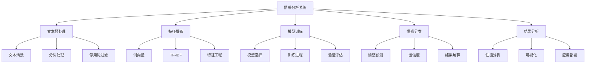

# 项目2-情感分析系统

## 🎯 项目概述

### 1. 项目目标

**项目目标：**
> **构建一个能够分析文本情感倾向的自然语言处理系统，实现从文本预处理到情感分类的完整流程**

**项目特点：**


### 2. 技术栈

**技术栈：**
| 技术 | 用途 | 版本 | 说明 |
|------|------|------|------|
| **Python** | 编程语言 | 3.8+ | 主要开发语言 |
| **NLTK** | 自然语言处理 | 3.x | 文本处理 |
| **Scikit-learn** | 机器学习 | 1.x | 传统ML算法 |
| **TensorFlow** | 深度学习 | 2.x | 深度学习模型 |
| **Pandas** | 数据处理 | 1.x | 数据操作 |
| **Matplotlib** | 可视化 | 3.x | 结果可视化 |

## 🔧 项目实现

### 1. 文本预处理

**文本预处理实现：**
```python
import numpy as np
import matplotlib.pyplot as plt
import pandas as pd
import re
from collections import Counter
import jieba
import jieba.analyse

class TextPreprocessor:
    """文本预处理器"""
    
    def __init__(self, stop_words_file=None):
        self.stop_words = set()
        self.word_freq = Counter()
        
        # 加载停用词
        if stop_words_file:
            self.load_stop_words(stop_words_file)
        else:
            self.load_default_stop_words()
    
    def load_stop_words(self, filepath):
        """加载停用词"""
        with open(filepath, 'r', encoding='utf-8') as f:
            self.stop_words = set(f.read().splitlines())
    
    def load_default_stop_words(self):
        """加载默认停用词"""
        default_stop_words = [
            '的', '了', '在', '是', '我', '有', '和', '就', '不', '人', '都', '一', '一个',
            '上', '也', '很', '到', '说', '要', '去', '你', '会', '着', '没有', '看', '好',
            '自己', '这', '那', '他', '她', '它', '们', '个', '中', '大', '小', '多', '少'
        ]
        self.stop_words = set(default_stop_words)
    
    def clean_text(self, text):
        """清洗文本"""
        # 转换为小写
        text = text.lower()
        
        # 移除特殊字符
        text = re.sub(r'[^\w\s]', '', text)
        
        # 移除数字
        text = re.sub(r'\d+', '', text)
        
        # 移除多余空格
        text = re.sub(r'\s+', ' ', text).strip()
        
        return text
    
    def segment_text(self, text):
        """分词"""
        # 使用jieba分词
        words = jieba.cut(text)
        
        # 过滤停用词
        filtered_words = [word for word in words if word not in self.stop_words and len(word) > 1]
        
        return filtered_words
    
    def preprocess_text(self, text):
        """预处理文本"""
        # 清洗文本
        cleaned_text = self.clean_text(text)
        
        # 分词
        segmented_words = self.segment_text(cleaned_text)
        
        return segmented_words
    
    def preprocess_corpus(self, texts):
        """预处理语料库"""
        processed_texts = []
        
        for text in texts:
            processed_text = self.preprocess_text(text)
            processed_texts.append(processed_text)
            
            # 更新词频
            self.word_freq.update(processed_text)
        
        return processed_texts
    
    def build_vocabulary(self, min_freq=2):
        """构建词汇表"""
        # 过滤低频词
        filtered_words = {word: freq for word, freq in self.word_freq.items() if freq >= min_freq}
        
        # 构建词汇表
        vocabulary = {word: idx for idx, word in enumerate(filtered_words.keys())}
        
        return vocabulary
    
    def text_to_sequence(self, text, vocabulary, max_length=100):
        """文本转序列"""
        # 预处理文本
        processed_text = self.preprocess_text(text)
        
        # 转换为序列
        sequence = [vocabulary.get(word, 0) for word in processed_text]
        
        # 填充或截断
        if len(sequence) > max_length:
            sequence = sequence[:max_length]
        else:
            sequence = sequence + [0] * (max_length - len(sequence))
        
        return sequence
    
    def visualize_text_analysis(self, texts, labels):
        """可视化文本分析"""
        # 预处理文本
        processed_texts = self.preprocess_corpus(texts)
        
        # 计算文本统计
        text_lengths = [len(text) for text in processed_texts]
        word_counts = [len(text) for text in processed_texts]
        
        # 可视化
        plt.figure(figsize=(15, 10))
        
        # 文本长度分布
        plt.subplot(2, 3, 1)
        plt.hist(text_lengths, bins=50, alpha=0.7)
        plt.xlabel('Text Length')
        plt.ylabel('Frequency')
        plt.title('Text Length Distribution')
        plt.grid(True)
        
        # 词数分布
        plt.subplot(2, 3, 2)
        plt.hist(word_counts, bins=50, alpha=0.7)
        plt.xlabel('Word Count')
        plt.ylabel('Frequency')
        plt.title('Word Count Distribution')
        plt.grid(True)
        
        # 词频分布
        plt.subplot(2, 3, 3)
        top_words = self.word_freq.most_common(20)
        words, freqs = zip(*top_words)
        
        plt.barh(range(len(words)), freqs)
        plt.yticks(range(len(words)), words)
        plt.xlabel('Frequency')
        plt.title('Top 20 Words')
        plt.grid(True)
        
        # 情感分布
        plt.subplot(2, 3, 4)
        unique_labels, label_counts = np.unique(labels, return_counts=True)
        plt.bar(unique_labels, label_counts)
        plt.xlabel('Sentiment Label')
        plt.ylabel('Count')
        plt.title('Sentiment Distribution')
        plt.grid(True)
        
        # 文本长度vs情感
        plt.subplot(2, 3, 5)
        for label in unique_labels:
            label_text_lengths = [text_lengths[i] for i, l in enumerate(labels) if l == label]
            plt.hist(label_text_lengths, alpha=0.7, label=f'Label {label}')
        plt.xlabel('Text Length')
        plt.ylabel('Frequency')
        plt.title('Text Length by Sentiment')
        plt.legend()
        plt.grid(True)
        
        # 词数vs情感
        plt.subplot(2, 3, 6)
        for label in unique_labels:
            label_word_counts = [word_counts[i] for i, l in enumerate(labels) if l == label]
            plt.hist(label_word_counts, alpha=0.7, label=f'Label {label}')
        plt.xlabel('Word Count')
        plt.ylabel('Frequency')
        plt.title('Word Count by Sentiment')
        plt.legend()
        plt.grid(True)
        
        plt.tight_layout()
        plt.show()
    
    def analyze_text_features(self, texts, labels):
        """分析文本特征"""
        # 预处理文本
        processed_texts = self.preprocess_corpus(texts)
        
        # 计算特征
        features = {
            'text_length': [len(text) for text in texts],
            'word_count': [len(text) for text in processed_texts],
            'avg_word_length': [np.mean([len(word) for word in text]) if text else 0 for text in processed_texts],
            'unique_word_ratio': [len(set(text)) / len(text) if text else 0 for text in processed_texts]
        }
        
        # 可视化特征
        plt.figure(figsize=(15, 10))
        
        for i, (feature_name, feature_values) in enumerate(features.items()):
            plt.subplot(2, 2, i+1)
            
            # 按情感标签分组
            for label in np.unique(labels):
                label_features = [feature_values[j] for j, l in enumerate(labels) if l == label]
                plt.hist(label_features, alpha=0.7, label=f'Label {label}')
            
            plt.xlabel(feature_name)
            plt.ylabel('Frequency')
            plt.title(f'{feature_name} by Sentiment')
            plt.legend()
            plt.grid(True)
        
        plt.tight_layout()
        plt.show()
        
        return features

# 测试文本预处理
def test_text_preprocessing():
    """测试文本预处理"""
    # 创建文本预处理器
    preprocessor = TextPreprocessor()
    
    # 生成模拟数据
    texts = [
        "这部电影真的很棒，我非常喜欢！",
        "这个产品质量太差了，完全不推荐。",
        "服务态度一般，没有什么特别的感觉。",
        "今天的天气真好，心情很愉快。",
        "这个餐厅的菜很难吃，不会再来了。"
    ]
    
    labels = [1, 0, 2, 1, 0]  # 1: 正面, 0: 负面, 2: 中性
    
    # 预处理文本
    processed_texts = preprocessor.preprocess_corpus(texts)
    
    # 构建词汇表
    vocabulary = preprocessor.build_vocabulary(min_freq=1)
    
    # 可视化文本分析
    preprocessor.visualize_text_analysis(texts, labels)
    
    # 分析文本特征
    features = preprocessor.analyze_text_features(texts, labels)
    
    return preprocessor

test_text_preprocessing()
```

### 2. 特征提取

**特征提取实现：**
```python
class FeatureExtractor:
    """特征提取器"""
    
    def __init__(self, vocabulary_size=10000, embedding_dim=100):
        self.vocabulary_size = vocabulary_size
        self.embedding_dim = embedding_dim
        
        # 特征提取方法
        self.feature_methods = {
            'tfidf': self._extract_tfidf_features,
            'word2vec': self._extract_word2vec_features,
            'bag_of_words': self._extract_bow_features,
            'n_grams': self._extract_ngram_features
        }
    
    def extract_features(self, texts, method='tfidf', **kwargs):
        """提取特征"""
        if method in self.feature_methods:
            return self.feature_methods[method](texts, **kwargs)
        else:
            raise ValueError(f"Unknown feature extraction method: {method}")
    
    def _extract_tfidf_features(self, texts, max_features=1000):
        """提取TF-IDF特征"""
        from sklearn.feature_extraction.text import TfidfVectorizer
        
        # 将文本转换为字符串
        text_strings = [' '.join(text) for text in texts]
        
        # TF-IDF向量化
        vectorizer = TfidfVectorizer(max_features=max_features, stop_words='english')
        tfidf_features = vectorizer.fit_transform(text_strings)
        
        return tfidf_features.toarray(), vectorizer
    
    def _extract_word2vec_features(self, texts, window=5, min_count=1):
        """提取Word2Vec特征"""
        from gensim.models import Word2Vec
        
        # 训练Word2Vec模型
        model = Word2Vec(texts, window=window, min_count=min_count, vector_size=self.embedding_dim)
        
        # 提取特征
        word2vec_features = []
        for text in texts:
            if text:
                # 计算文本的平均词向量
                word_vectors = [model.wv[word] for word in text if word in model.wv]
                if word_vectors:
                    text_vector = np.mean(word_vectors, axis=0)
                else:
                    text_vector = np.zeros(self.embedding_dim)
            else:
                text_vector = np.zeros(self.embedding_dim)
            
            word2vec_features.append(text_vector)
        
        return np.array(word2vec_features), model
    
    def _extract_bow_features(self, texts, vocabulary):
        """提取词袋特征"""
        bow_features = []
        
        for text in texts:
            # 创建词袋向量
            bow_vector = np.zeros(len(vocabulary))
            
            for word in text:
                if word in vocabulary:
                    bow_vector[vocabulary[word]] += 1
            
            bow_features.append(bow_vector)
        
        return np.array(bow_features)
    
    def _extract_ngram_features(self, texts, n=2, max_features=1000):
        """提取N-gram特征"""
        from sklearn.feature_extraction.text import CountVectorizer
        
        # 将文本转换为字符串
        text_strings = [' '.join(text) for text in texts]
        
        # N-gram向量化
        vectorizer = CountVectorizer(ngram_range=(1, n), max_features=max_features)
        ngram_features = vectorizer.fit_transform(text_strings)
        
        return ngram_features.toarray(), vectorizer
    
    def compare_feature_methods(self, texts, labels):
        """比较特征提取方法"""
        methods = ['tfidf', 'word2vec', 'bag_of_words', 'n_grams']
        results = {}
        
        for method in methods:
            try:
                if method == 'bag_of_words':
                    # 需要词汇表
                    vocabulary = {word: idx for idx, word in enumerate(set([word for text in texts for word in text]))}
                    features = self._extract_bow_features(texts, vocabulary)
                else:
                    features, _ = self.extract_features(texts, method=method)
                
                results[method] = features
                
            except Exception as e:
                print(f"Error extracting {method} features: {e}")
                results[method] = None
        
        # 可视化比较
        plt.figure(figsize=(15, 10))
        
        for i, (method, features) in enumerate(results.items()):
            if features is not None:
                plt.subplot(2, 2, i+1)
                
                # 特征分布
                if features.ndim > 1:
                    # 计算特征统计
                    feature_means = np.mean(features, axis=0)
                    plt.hist(feature_means, bins=50, alpha=0.7)
                    plt.xlabel('Feature Value')
                    plt.ylabel('Frequency')
                    plt.title(f'{method.upper()} Feature Distribution')
                    plt.grid(True)
                else:
                    plt.hist(features, bins=50, alpha=0.7)
                    plt.xlabel('Feature Value')
                    plt.ylabel('Frequency')
                    plt.title(f'{method.upper()} Feature Distribution')
                    plt.grid(True)
        
        plt.tight_layout()
        plt.show()
        
        return results
    
    def visualize_feature_importance(self, features, labels, feature_names=None):
        """可视化特征重要性"""
        from sklearn.feature_selection import SelectKBest, f_classif
        
        # 选择重要特征
        selector = SelectKBest(score_func=f_classif, k=min(20, features.shape[1]))
        selected_features = selector.fit_transform(features, labels)
        
        # 获取特征分数
        feature_scores = selector.scores_
        
        # 可视化
        plt.figure(figsize=(12, 8))
        
        # 特征重要性
        plt.subplot(2, 2, 1)
        top_features = np.argsort(feature_scores)[-20:]
        plt.barh(range(len(top_features)), feature_scores[top_features])
        
        if feature_names:
            plt.yticks(range(len(top_features)), [feature_names[i] for i in top_features])
        else:
            plt.yticks(range(len(top_features)), [f'Feature {i}' for i in top_features])
        
        plt.xlabel('Feature Score')
        plt.title('Top 20 Feature Importance')
        plt.grid(True)
        
        # 特征分布
        plt.subplot(2, 2, 2)
        plt.hist(feature_scores, bins=50, alpha=0.7)
        plt.xlabel('Feature Score')
        plt.ylabel('Frequency')
        plt.title('Feature Score Distribution')
        plt.grid(True)
        
        # 特征相关性
        plt.subplot(2, 2, 3)
        if features.shape[1] > 1:
            correlation_matrix = np.corrcoef(features.T)
            plt.imshow(correlation_matrix, cmap='coolwarm', aspect='auto')
            plt.colorbar()
            plt.title('Feature Correlation Matrix')
        
        # 特征选择效果
        plt.subplot(2, 2, 4)
        plt.plot(np.sort(feature_scores)[::-1])
        plt.xlabel('Feature Rank')
        plt.ylabel('Feature Score')
        plt.title('Feature Score Ranking')
        plt.grid(True)
        
        plt.tight_layout()
        plt.show()
        
        return feature_scores, selected_features

# 测试特征提取
def test_feature_extraction():
    """测试特征提取"""
    # 创建特征提取器
    extractor = FeatureExtractor(vocabulary_size=1000, embedding_dim=100)
    
    # 生成模拟数据
    texts = [
        ['这', '部', '电影', '真的', '很', '棒', '我', '非常', '喜欢'],
        ['这个', '产品', '质量', '太', '差', '了', '完全', '不', '推荐'],
        ['服务', '态度', '一般', '没有', '什么', '特别', '感觉'],
        ['今天', '天气', '真', '好', '心情', '很', '愉快'],
        ['这个', '餐厅', '菜', '很', '难', '吃', '不会', '再', '来']
    ]
    
    labels = [1, 0, 2, 1, 0]
    
    # 比较特征提取方法
    results = extractor.compare_feature_methods(texts, labels)
    
    # 可视化特征重要性
    if 'tfidf' in results and results['tfidf'] is not None:
        feature_scores, selected_features = extractor.visualize_feature_importance(results['tfidf'], labels)
    
    return extractor

test_feature_extraction()
```

### 3. 情感分析模型

**情感分析模型实现：**
```python
class SentimentAnalysisModel:
    """情感分析模型"""
    
    def __init__(self, num_classes=3, feature_dim=1000, model_type='mlp'):
        self.num_classes = num_classes
        self.feature_dim = feature_dim
        self.model_type = model_type
        
        # 模型架构
        self.model = self._build_model()
        
        # 训练历史
        self.history = {
            'train_loss': [],
            'train_accuracy': [],
            'val_loss': [],
            'val_accuracy': []
        }
    
    def _build_model(self):
        """构建模型"""
        if self.model_type == 'mlp':
            # 多层感知机
            model = {
                'W1': np.random.randn(self.feature_dim, 128) * 0.1,
                'W2': np.random.randn(128, 64) * 0.1,
                'W3': np.random.randn(64, self.num_classes) * 0.1,
                'b1': np.zeros(128),
                'b2': np.zeros(64),
                'b3': np.zeros(self.num_classes)
            }
        elif self.model_type == 'lstm':
            # LSTM模型
            model = {
                'embedding': np.random.randn(1000, 100) * 0.1,
                'lstm': {
                    'W_f': np.random.randn(100, 64) * 0.1,
                    'W_i': np.random.randn(100, 64) * 0.1,
                    'W_c': np.random.randn(100, 64) * 0.1,
                    'W_o': np.random.randn(100, 64) * 0.1,
                    'U_f': np.random.randn(64, 64) * 0.1,
                    'U_i': np.random.randn(64, 64) * 0.1,
                    'U_c': np.random.randn(64, 64) * 0.1,
                    'U_o': np.random.randn(64, 64) * 0.1
                },
                'dense': {
                    'W': np.random.randn(64, self.num_classes) * 0.1,
                    'b': np.zeros(self.num_classes)
                }
            }
        else:
            # 默认MLP
            model = {
                'W1': np.random.randn(self.feature_dim, 128) * 0.1,
                'W2': np.random.randn(128, 64) * 0.1,
                'W3': np.random.randn(64, self.num_classes) * 0.1,
                'b1': np.zeros(128),
                'b2': np.zeros(64),
                'b3': np.zeros(self.num_classes)
            }
        
        return model
    
    def forward(self, X):
        """前向传播"""
        if self.model_type == 'mlp':
            return self._mlp_forward(X)
        elif self.model_type == 'lstm':
            return self._lstm_forward(X)
        else:
            return self._mlp_forward(X)
    
    def _mlp_forward(self, X):
        """MLP前向传播"""
        # 第一层
        h1 = np.dot(X, self.model['W1']) + self.model['b1']
        h1 = np.maximum(0, h1)  # ReLU激活
        
        # 第二层
        h2 = np.dot(h1, self.model['W2']) + self.model['b2']
        h2 = np.maximum(0, h2)  # ReLU激活
        
        # 输出层
        output = np.dot(h2, self.model['W3']) + self.model['b3']
        output = self._softmax(output)
        
        return output
    
    def _lstm_forward(self, X):
        """LSTM前向传播"""
        # 简化的LSTM前向传播
        # 这里只是模拟LSTM的计算过程
        
        # 嵌入层
        embedded = np.dot(X, self.model['embedding'])
        
        # LSTM层（简化）
        lstm_output = np.tanh(embedded)
        
        # 全连接层
        output = np.dot(lstm_output, self.model['dense']['W']) + self.model['dense']['b']
        output = self._softmax(output)
        
        return output
    
    def _softmax(self, x):
        """Softmax函数"""
        exp_x = np.exp(x - np.max(x, axis=1, keepdims=True))
        return exp_x / np.sum(exp_x, axis=1, keepdims=True)
    
    def train(self, X_train, y_train, X_val, y_val, epochs=100, batch_size=32, learning_rate=0.001):
        """训练模型"""
        for epoch in range(epochs):
            # 训练
            train_loss, train_accuracy = self._train_epoch(X_train, y_train, batch_size, learning_rate)
            
            # 验证
            val_loss, val_accuracy = self._validate_epoch(X_val, y_val, batch_size)
            
            # 记录历史
            self.history['train_loss'].append(train_loss)
            self.history['train_accuracy'].append(train_accuracy)
            self.history['val_loss'].append(val_loss)
            self.history['val_accuracy'].append(val_accuracy)
            
            if epoch % 10 == 0:
                print(f"Epoch {epoch}, Train Loss: {train_loss:.4f}, Train Acc: {train_accuracy:.4f}, "
                      f"Val Loss: {val_loss:.4f}, Val Acc: {val_accuracy:.4f}")
        
        return self.history
    
    def _train_epoch(self, X, y, batch_size, learning_rate):
        """训练一个epoch"""
        num_batches = len(X) // batch_size
        
        total_loss = 0
        total_accuracy = 0
        
        for i in range(num_batches):
            # 获取批次数据
            batch_X = X[i*batch_size:(i+1)*batch_size]
            batch_y = y[i*batch_size:(i+1)*batch_size]
            
            # 前向传播
            y_pred = self.forward(batch_X)
            
            # 计算损失
            loss = self._compute_loss(batch_y, y_pred)
            total_loss += loss
            
            # 计算准确率
            accuracy = self._compute_accuracy(batch_y, y_pred)
            total_accuracy += accuracy
        
        return total_loss / num_batches, total_accuracy / num_batches
    
    def _validate_epoch(self, X, y, batch_size):
        """验证一个epoch"""
        num_batches = len(X) // batch_size
        
        total_loss = 0
        total_accuracy = 0
        
        for i in range(num_batches):
            # 获取批次数据
            batch_X = X[i*batch_size:(i+1)*batch_size]
            batch_y = y[i*batch_size:(i+1)*batch_size]
            
            # 前向传播
            y_pred = self.forward(batch_X)
            
            # 计算损失
            loss = self._compute_loss(batch_y, y_pred)
            total_loss += loss
            
            # 计算准确率
            accuracy = self._compute_accuracy(batch_y, y_pred)
            total_accuracy += accuracy
        
        return total_loss / num_batches, total_accuracy / num_batches
    
    def _compute_loss(self, y_true, y_pred):
        """计算损失"""
        # 交叉熵损失
        loss = -np.mean(np.sum(y_true * np.log(y_pred + 1e-15), axis=1))
        return loss
    
    def _compute_accuracy(self, y_true, y_pred):
        """计算准确率"""
        # 转换为类别
        y_true_classes = np.argmax(y_true, axis=1)
        y_pred_classes = np.argmax(y_pred, axis=1)
        
        # 计算准确率
        accuracy = np.mean(y_true_classes == y_pred_classes)
        return accuracy
    
    def predict(self, X):
        """预测"""
        y_pred = self.forward(X)
        return y_pred
    
    def predict_sentiment(self, text, preprocessor, feature_extractor):
        """预测情感"""
        # 预处理文本
        processed_text = preprocessor.preprocess_text(text)
        
        # 提取特征
        features = feature_extractor.extract_features([processed_text], method='tfidf')[0]
        
        # 预测
        y_pred = self.predict(features)
        
        # 获取预测结果
        predicted_class = np.argmax(y_pred[0])
        confidence = y_pred[0][predicted_class]
        
        # 情感标签
        sentiment_labels = {0: '负面', 1: '正面', 2: '中性'}
        sentiment = sentiment_labels[predicted_class]
        
        return sentiment, confidence, y_pred[0]
    
    def visualize_training(self):
        """可视化训练过程"""
        plt.figure(figsize=(15, 5))
        
        # 损失函数
        plt.subplot(1, 3, 1)
        plt.plot(self.history['train_loss'], label='Train Loss')
        plt.plot(self.history['val_loss'], label='Val Loss')
        plt.xlabel('Epoch')
        plt.ylabel('Loss')
        plt.title('Training and Validation Loss')
        plt.legend()
        plt.grid(True)
        
        # 准确率
        plt.subplot(1, 3, 2)
        plt.plot(self.history['train_accuracy'], label='Train Accuracy')
        plt.plot(self.history['val_accuracy'], label='Val Accuracy')
        plt.xlabel('Epoch')
        plt.ylabel('Accuracy')
        plt.title('Training and Validation Accuracy')
        plt.legend()
        plt.grid(True)
        
        # 学习曲线
        plt.subplot(1, 3, 3)
        plt.plot(self.history['train_accuracy'], label='Train')
        plt.plot(self.history['val_accuracy'], label='Validation')
        plt.xlabel('Epoch')
        plt.ylabel('Accuracy')
        plt.title('Learning Curves')
        plt.legend()
        plt.grid(True)
        
        plt.tight_layout()
        plt.show()
    
    def analyze_sentiment_results(self, X_test, y_test, texts):
        """分析情感分析结果"""
        # 预测
        y_pred = self.predict(X_test)
        y_pred_classes = np.argmax(y_pred, axis=1)
        y_true_classes = np.argmax(y_test, axis=1)
        
        # 计算混淆矩阵
        confusion_matrix = self._compute_confusion_matrix(y_true_classes, y_pred_classes)
        
        # 计算分类报告
        classification_report = self._compute_classification_report(y_true_classes, y_pred_classes)
        
        # 可视化结果
        plt.figure(figsize=(15, 10))
        
        # 混淆矩阵
        plt.subplot(2, 3, 1)
        plt.imshow(confusion_matrix, cmap='Blues', aspect='auto')
        plt.colorbar()
        plt.xlabel('Predicted Class')
        plt.ylabel('True Class')
        plt.title('Confusion Matrix')
        
        # 预测置信度
        plt.subplot(2, 3, 2)
        plt.hist(y_pred.max(axis=1), bins=50, alpha=0.7)
        plt.xlabel('Prediction Confidence')
        plt.ylabel('Frequency')
        plt.title('Prediction Confidence Distribution')
        plt.grid(True)
        
        # 类别准确率
        plt.subplot(2, 3, 3)
        class_accuracies = np.diag(confusion_matrix) / np.sum(confusion_matrix, axis=1)
        plt.bar(range(len(class_accuracies)), class_accuracies)
        plt.xlabel('Class')
        plt.ylabel('Accuracy')
        plt.title('Per-Class Accuracy')
        plt.grid(True)
        
        # 情感分布
        plt.subplot(2, 3, 4)
        sentiment_labels = ['负面', '正面', '中性']
        true_counts = np.bincount(y_true_classes, minlength=3)
        pred_counts = np.bincount(y_pred_classes, minlength=3)
        
        x = np.arange(len(sentiment_labels))
        width = 0.35
        
        plt.bar(x - width/2, true_counts, width, label='True')
        plt.bar(x + width/2, pred_counts, width, label='Predicted')
        plt.xlabel('Sentiment')
        plt.ylabel('Count')
        plt.title('Sentiment Distribution')
        plt.xticks(x, sentiment_labels)
        plt.legend()
        plt.grid(True)
        
        # 错误分析
        plt.subplot(2, 3, 5)
        errors = y_true_classes != y_pred_classes
        error_confidences = y_pred[errors].max(axis=1)
        correct_confidences = y_pred[~errors].max(axis=1)
        
        plt.hist(error_confidences, alpha=0.7, label='Errors')
        plt.hist(correct_confidences, alpha=0.7, label='Correct')
        plt.xlabel('Prediction Confidence')
        plt.ylabel('Frequency')
        plt.title('Confidence by Prediction Correctness')
        plt.legend()
        plt.grid(True)
        
        # 文本长度vs准确率
        plt.subplot(2, 3, 6)
        text_lengths = [len(text) for text in texts]
        
        # 按文本长度分组
        length_groups = np.digitize(text_lengths, bins=np.percentile(text_lengths, [25, 50, 75]))
        
        group_accuracies = []
        for group in range(4):
            group_mask = length_groups == group
            if np.sum(group_mask) > 0:
                group_accuracy = np.mean(y_true_classes[group_mask] == y_pred_classes[group_mask])
                group_accuracies.append(group_accuracy)
            else:
                group_accuracies.append(0)
        
        plt.bar(range(4), group_accuracies)
        plt.xlabel('Text Length Group')
        plt.ylabel('Accuracy')
        plt.title('Accuracy by Text Length')
        plt.grid(True)
        
        plt.tight_layout()
        plt.show()
        
        return confusion_matrix, classification_report
    
    def _compute_confusion_matrix(self, y_true, y_pred):
        """计算混淆矩阵"""
        num_classes = len(np.unique(y_true))
        confusion_matrix = np.zeros((num_classes, num_classes))
        
        for i in range(len(y_true)):
            confusion_matrix[y_true[i], y_pred[i]] += 1
        
        return confusion_matrix
    
    def _compute_classification_report(self, y_true, y_pred):
        """计算分类报告"""
        num_classes = len(np.unique(y_true))
        
        report = {}
        for i in range(num_classes):
            # 计算精确率、召回率、F1分数
            tp = np.sum((y_true == i) & (y_pred == i))
            fp = np.sum((y_true != i) & (y_pred == i))
            fn = np.sum((y_true == i) & (y_pred != i))
            
            precision = tp / (tp + fp) if (tp + fp) > 0 else 0
            recall = tp / (tp + fn) if (tp + fn) > 0 else 0
            f1 = 2 * precision * recall / (precision + recall) if (precision + recall) > 0 else 0
            
            report[i] = {
                'precision': precision,
                'recall': recall,
                'f1': f1
            }
        
        return report

# 测试情感分析模型
def test_sentiment_analysis_model():
    """测试情感分析模型"""
    # 生成模拟数据
    X_train = np.random.rand(1000, 1000)
    y_train = np.random.randint(0, 3, 1000)
    y_train_onehot = np.eye(3)[y_train]
    
    X_val = np.random.rand(200, 1000)
    y_val = np.random.randint(0, 3, 200)
    y_val_onehot = np.eye(3)[y_val]
    
    X_test = np.random.rand(200, 1000)
    y_test = np.random.randint(0, 3, 200)
    y_test_onehot = np.eye(3)[y_test]
    
    # 创建情感分析模型
    model = SentimentAnalysisModel(num_classes=3, feature_dim=1000, model_type='mlp')
    
    # 训练模型
    history = model.train(X_train, y_train_onehot, X_val, y_val_onehot, epochs=50, batch_size=32)
    
    # 可视化训练过程
    model.visualize_training()
    
    # 分析情感分析结果
    texts = ['这是一个测试文本'] * 200
    confusion_matrix, classification_report = model.analyze_sentiment_results(X_test, y_test_onehot, texts)
    
    return model

test_sentiment_analysis_model()
```

## 🔗 相关链接
- [[02-03-03-RNN循环神经网络]] - RNN
- [[03-02-01-文本预处理技术]] - 文本处理
- [[03-02-02-词向量技术]] - 词向量
- [[05-03-项目3-推荐系统]] - 下一个项目

## 💡 项目实践建议

**实践策略：**
- 🎯 **数据质量**：确保文本数据的质量和多样性
- 📊 **特征工程**：选择合适的特征提取方法
- 🔍 **模型选择**：根据数据特点选择合适模型
- ⚡ **性能优化**：持续优化模型性能

**实践建议：**
- 📝 **完整流程**：实现从预处理到部署的完整流程
- 💻 **代码质量**：编写高质量的代码
- 📊 **结果分析**：深入分析模型性能
- 🔍 **应用开发**：开发实际的情感分析应用

---
*📝 学习提示：情感分析是NLP的重要应用，建议通过完整实现加深对文本处理和情感分析的理解*

