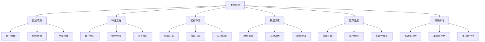

# 项目3-推荐系统

## 🎯 项目概述

### 1. 项目目标

**项目目标：**
> **构建一个智能推荐系统，实现基于用户行为和物品特征的个性化推荐，支持多种推荐算法**

**项目特点：**


### 2. 技术栈

**技术栈：**
| 技术 | 用途 | 版本 | 说明 |
|------|------|------|------|
| **Python** | 编程语言 | 3.8+ | 主要开发语言 |
| **Pandas** | 数据处理 | 1.x | 数据操作 |
| **NumPy** | 数值计算 | 1.x | 数值运算 |
| **Scikit-learn** | 机器学习 | 1.x | 传统ML算法 |
| **TensorFlow** | 深度学习 | 2.x | 深度学习模型 |
| **Matplotlib** | 可视化 | 3.x | 结果可视化 |

## 🔧 项目实现

### 1. 数据收集与预处理

**数据收集与预处理实现：**
```python
import numpy as np
import matplotlib.pyplot as plt
import pandas as pd
from collections import defaultdict
import random

class DataCollector:
    """数据收集器"""
    
    def __init__(self):
        self.user_data = {}
        self.item_data = {}
        self.interaction_data = []
        
        # 数据统计
        self.stats = {
            'num_users': 0,
            'num_items': 0,
            'num_interactions': 0,
            'sparsity': 0.0
        }
    
    def generate_synthetic_data(self, num_users=1000, num_items=500, num_interactions=10000):
        """生成合成数据"""
        # 生成用户数据
        self.user_data = self._generate_user_data(num_users)
        
        # 生成物品数据
        self.item_data = self._generate_item_data(num_items)
        
        # 生成交互数据
        self.interaction_data = self._generate_interaction_data(num_users, num_items, num_interactions)
        
        # 更新统计信息
        self._update_stats()
        
        return self.user_data, self.item_data, self.interaction_data
    
    def _generate_user_data(self, num_users):
        """生成用户数据"""
        user_data = {}
        
        for user_id in range(num_users):
            user_data[user_id] = {
                'age': random.randint(18, 65),
                'gender': random.choice(['M', 'F']),
                'occupation': random.choice(['student', 'engineer', 'teacher', 'doctor', 'other']),
                'location': random.choice(['beijing', 'shanghai', 'guangzhou', 'shenzhen', 'other']),
                'preferences': [random.choice(['action', 'comedy', 'drama', 'romance', 'thriller']) for _ in range(3)]
            }
        
        return user_data
    
    def _generate_item_data(self, num_items):
        """生成物品数据"""
        item_data = {}
        
        categories = ['action', 'comedy', 'drama', 'romance', 'thriller', 'horror', 'sci-fi', 'documentary']
        
        for item_id in range(num_items):
            item_data[item_id] = {
                'title': f'Item {item_id}',
                'category': random.choice(categories),
                'year': random.randint(1990, 2023),
                'rating': round(random.uniform(3.0, 5.0), 1),
                'price': round(random.uniform(10.0, 100.0), 2),
                'tags': random.sample(categories, random.randint(1, 3))
            }
        
        return item_data
    
    def _generate_interaction_data(self, num_users, num_items, num_interactions):
        """生成交互数据"""
        interaction_data = []
        
        for _ in range(num_interactions):
            user_id = random.randint(0, num_users - 1)
            item_id = random.randint(0, num_items - 1)
            
            # 基于用户偏好生成评分
            user_preferences = self.user_data[user_id]['preferences']
            item_category = self.item_data[item_id]['category']
            
            if item_category in user_preferences:
                rating = random.uniform(4.0, 5.0)
            else:
                rating = random.uniform(1.0, 4.0)
            
            rating = round(rating, 1)
            
            interaction_data.append({
                'user_id': user_id,
                'item_id': item_id,
                'rating': rating,
                'timestamp': random.randint(1000000000, 2000000000)
            })
        
        return interaction_data
    
    def _update_stats(self):
        """更新统计信息"""
        self.stats['num_users'] = len(self.user_data)
        self.stats['num_items'] = len(self.item_data)
        self.stats['num_interactions'] = len(self.interaction_data)
        
        # 计算稀疏度
        total_possible_interactions = self.stats['num_users'] * self.stats['num_items']
        self.stats['sparsity'] = 1 - (self.stats['num_interactions'] / total_possible_interactions)
    
    def load_data_from_files(self, user_file, item_file, interaction_file):
        """从文件加载数据"""
        # 加载用户数据
        user_df = pd.read_csv(user_file)
        self.user_data = user_df.set_index('user_id').to_dict('index')
        
        # 加载物品数据
        item_df = pd.read_csv(item_file)
        self.item_data = item_df.set_index('item_id').to_dict('index')
        
        # 加载交互数据
        interaction_df = pd.read_csv(interaction_file)
        self.interaction_data = interaction_df.to_dict('records')
        
        # 更新统计信息
        self._update_stats()
        
        return self.user_data, self.item_data, self.interaction_data
    
    def preprocess_data(self):
        """预处理数据"""
        # 转换为DataFrame
        user_df = pd.DataFrame.from_dict(self.user_data, orient='index')
        item_df = pd.DataFrame.from_dict(self.item_data, orient='index')
        interaction_df = pd.DataFrame(self.interaction_data)
        
        # 数据清洗
        interaction_df = interaction_df.drop_duplicates()
        interaction_df = interaction_df[interaction_df['rating'] > 0]
        
        # 特征编码
        user_df = self._encode_user_features(user_df)
        item_df = self._encode_item_features(item_df)
        
        return user_df, item_df, interaction_df
    
    def _encode_user_features(self, user_df):
        """编码用户特征"""
        # 年龄分组
        user_df['age_group'] = pd.cut(user_df['age'], bins=[0, 25, 35, 45, 65], labels=['young', 'adult', 'middle', 'senior'])
        
        # 性别编码
        user_df['gender_encoded'] = user_df['gender'].map({'M': 1, 'F': 0})
        
        # 职业编码
        user_df = pd.get_dummies(user_df, columns=['occupation'], prefix='occupation')
        
        # 地点编码
        user_df = pd.get_dummies(user_df, columns=['location'], prefix='location')
        
        return user_df
    
    def _encode_item_features(self, item_df):
        """编码物品特征"""
        # 年份分组
        item_df['year_group'] = pd.cut(item_df['year'], bins=[1990, 2000, 2010, 2023], labels=['old', 'medium', 'new'])
        
        # 评分分组
        item_df['rating_group'] = pd.cut(item_df['rating'], bins=[0, 3.5, 4.0, 5.0], labels=['low', 'medium', 'high'])
        
        # 价格分组
        item_df['price_group'] = pd.cut(item_df['price'], bins=[0, 30, 60, 100], labels=['cheap', 'medium', 'expensive'])
        
        # 类别编码
        item_df = pd.get_dummies(item_df, columns=['category'], prefix='category')
        
        return item_df
    
    def visualize_data(self):
        """可视化数据"""
        # 转换为DataFrame
        user_df = pd.DataFrame.from_dict(self.user_data, orient='index')
        item_df = pd.DataFrame.from_dict(self.item_data, orient='index')
        interaction_df = pd.DataFrame(self.interaction_data)
        
        plt.figure(figsize=(20, 15))
        
        # 用户年龄分布
        plt.subplot(3, 4, 1)
        plt.hist(user_df['age'], bins=20, alpha=0.7)
        plt.xlabel('Age')
        plt.ylabel('Frequency')
        plt.title('User Age Distribution')
        plt.grid(True)
        
        # 用户性别分布
        plt.subplot(3, 4, 2)
        gender_counts = user_df['gender'].value_counts()
        plt.bar(gender_counts.index, gender_counts.values)
        plt.xlabel('Gender')
        plt.ylabel('Count')
        plt.title('User Gender Distribution')
        plt.grid(True)
        
        # 用户职业分布
        plt.subplot(3, 4, 3)
        occupation_counts = user_df['occupation'].value_counts()
        plt.bar(occupation_counts.index, occupation_counts.values)
        plt.xlabel('Occupation')
        plt.ylabel('Count')
        plt.title('User Occupation Distribution')
        plt.xticks(rotation=45)
        plt.grid(True)
        
        # 物品类别分布
        plt.subplot(3, 4, 4)
        category_counts = item_df['category'].value_counts()
        plt.bar(category_counts.index, category_counts.values)
        plt.xlabel('Category')
        plt.ylabel('Count')
        plt.title('Item Category Distribution')
        plt.xticks(rotation=45)
        plt.grid(True)
        
        # 物品年份分布
        plt.subplot(3, 4, 5)
        plt.hist(item_df['year'], bins=20, alpha=0.7)
        plt.xlabel('Year')
        plt.ylabel('Frequency')
        plt.title('Item Year Distribution')
        plt.grid(True)
        
        # 物品评分分布
        plt.subplot(3, 4, 6)
        plt.hist(item_df['rating'], bins=20, alpha=0.7)
        plt.xlabel('Rating')
        plt.ylabel('Frequency')
        plt.title('Item Rating Distribution')
        plt.grid(True)
        
        # 交互评分分布
        plt.subplot(3, 4, 7)
        plt.hist(interaction_df['rating'], bins=20, alpha=0.7)
        plt.xlabel('Rating')
        plt.ylabel('Frequency')
        plt.title('Interaction Rating Distribution')
        plt.grid(True)
        
        # 用户交互次数分布
        plt.subplot(3, 4, 8)
        user_interaction_counts = interaction_df['user_id'].value_counts()
        plt.hist(user_interaction_counts.values, bins=20, alpha=0.7)
        plt.xlabel('Number of Interactions')
        plt.ylabel('Frequency')
        plt.title('User Interaction Count Distribution')
        plt.grid(True)
        
        # 物品交互次数分布
        plt.subplot(3, 4, 9)
        item_interaction_counts = interaction_df['item_id'].value_counts()
        plt.hist(item_interaction_counts.values, bins=20, alpha=0.7)
        plt.xlabel('Number of Interactions')
        plt.ylabel('Frequency')
        plt.title('Item Interaction Count Distribution')
        plt.grid(True)
        
        # 评分随时间变化
        plt.subplot(3, 4, 10)
        interaction_df['date'] = pd.to_datetime(interaction_df['timestamp'], unit='s')
        daily_ratings = interaction_df.groupby(interaction_df['date'].dt.date)['rating'].mean()
        plt.plot(daily_ratings.index, daily_ratings.values)
        plt.xlabel('Date')
        plt.ylabel('Average Rating')
        plt.title('Average Rating Over Time')
        plt.xticks(rotation=45)
        plt.grid(True)
        
        # 用户-物品交互矩阵热图
        plt.subplot(3, 4, 11)
        # 选择部分用户和物品进行可视化
        sample_users = user_interaction_counts.head(20).index
        sample_items = item_interaction_counts.head(20).index
        
        sample_interactions = interaction_df[
            (interaction_df['user_id'].isin(sample_users)) & 
            (interaction_df['item_id'].isin(sample_items))
        ]
        
        if not sample_interactions.empty:
            pivot_table = sample_interactions.pivot_table(
                index='user_id', 
                columns='item_id', 
                values='rating', 
                fill_value=0
            )
            plt.imshow(pivot_table.values, cmap='viridis', aspect='auto')
            plt.colorbar()
            plt.xlabel('Item ID')
            plt.ylabel('User ID')
            plt.title('User-Item Interaction Matrix')
        
        # 数据统计信息
        plt.subplot(3, 4, 12)
        plt.axis('off')
        stats_text = f"""
        Data Statistics:
        
        Users: {self.stats['num_users']}
        Items: {self.stats['num_items']}
        Interactions: {self.stats['num_interactions']}
        Sparsity: {self.stats['sparsity']:.2%}
        
        Average Rating: {interaction_df['rating'].mean():.2f}
        Rating Std: {interaction_df['rating'].std():.2f}
        
        Active Users: {len(user_interaction_counts)}
        Popular Items: {len(item_interaction_counts)}
        """
        plt.text(0.1, 0.9, stats_text, transform=plt.gca().transAxes, fontsize=10, verticalalignment='top')
        
        plt.tight_layout()
        plt.show()
    
    def analyze_data_quality(self):
        """分析数据质量"""
        interaction_df = pd.DataFrame(self.interaction_data)
        
        # 数据质量指标
        quality_metrics = {
            'completeness': 1 - interaction_df.isnull().sum().sum() / (len(interaction_df) * len(interaction_df.columns)),
            'consistency': len(interaction_df) - len(interaction_df.drop_duplicates()),
            'accuracy': len(interaction_df[interaction_df['rating'].between(1, 5)]) / len(interaction_df),
            'uniqueness': len(interaction_df) - len(interaction_df.drop_duplicates(subset=['user_id', 'item_id']))
        }
        
        # 可视化数据质量
        plt.figure(figsize=(15, 10))
        
        # 数据完整性
        plt.subplot(2, 3, 1)
        completeness = [quality_metrics['completeness']]
        plt.bar(['Completeness'], completeness)
        plt.ylabel('Completeness Score')
        plt.title('Data Completeness')
        plt.grid(True)
        
        # 数据一致性
        plt.subplot(2, 3, 2)
        consistency = [quality_metrics['consistency']]
        plt.bar(['Consistency'], consistency)
        plt.ylabel('Duplicate Records')
        plt.title('Data Consistency')
        plt.grid(True)
        
        # 数据准确性
        plt.subplot(2, 3, 3)
        accuracy = [quality_metrics['accuracy']]
        plt.bar(['Accuracy'], accuracy)
        plt.ylabel('Accuracy Score')
        plt.title('Data Accuracy')
        plt.grid(True)
        
        # 数据唯一性
        plt.subplot(2, 3, 4)
        uniqueness = [quality_metrics['uniqueness']]
        plt.bar(['Uniqueness'], uniqueness)
        plt.ylabel('Duplicate User-Item Pairs')
        plt.title('Data Uniqueness')
        plt.grid(True)
        
        # 评分分布
        plt.subplot(2, 3, 5)
        plt.hist(interaction_df['rating'], bins=20, alpha=0.7)
        plt.xlabel('Rating')
        plt.ylabel('Frequency')
        plt.title('Rating Distribution')
        plt.grid(True)
        
        # 数据质量总结
        plt.subplot(2, 3, 6)
        plt.axis('off')
        quality_text = f"""
        Data Quality Summary:
        
        Completeness: {quality_metrics['completeness']:.2%}
        Consistency: {quality_metrics['consistency']} duplicates
        Accuracy: {quality_metrics['accuracy']:.2%}
        Uniqueness: {quality_metrics['uniqueness']} duplicates
        
        Recommendations:
        - Remove duplicate records
        - Handle missing values
        - Validate rating ranges
        - Ensure user-item uniqueness
        """
        plt.text(0.1, 0.9, quality_text, transform=plt.gca().transAxes, fontsize=10, verticalalignment='top')
        
        plt.tight_layout()
        plt.show()
        
        return quality_metrics

# 测试数据收集与预处理
def test_data_collector():
    """测试数据收集器"""
    # 创建数据收集器
    collector = DataCollector()
    
    # 生成合成数据
    user_data, item_data, interaction_data = collector.generate_synthetic_data(
        num_users=1000, 
        num_items=500, 
        num_interactions=10000
    )
    
    # 可视化数据
    collector.visualize_data()
    
    # 分析数据质量
    quality_metrics = collector.analyze_data_quality()
    
    # 预处理数据
    user_df, item_df, interaction_df = collector.preprocess_data()
    
    return collector

test_data_collector()
```

### 2. 推荐算法实现

**推荐算法实现：**
```python
class RecommendationSystem:
    """推荐系统"""
    
    def __init__(self, user_data, item_data, interaction_data):
        self.user_data = user_data
        self.item_data = item_data
        self.interaction_data = interaction_data
        
        # 构建用户-物品矩阵
        self.user_item_matrix = self._build_user_item_matrix()
        
        # 推荐算法
        self.algorithms = {
            'user_based_cf': self._user_based_collaborative_filtering,
            'item_based_cf': self._item_based_collaborative_filtering,
            'content_based': self._content_based_filtering,
            'matrix_factorization': self._matrix_factorization,
            'hybrid': self._hybrid_recommendation
        }
    
    def _build_user_item_matrix(self):
        """构建用户-物品矩阵"""
        # 创建用户-物品矩阵
        user_ids = list(self.user_data.keys())
        item_ids = list(self.item_data.keys())
        
        matrix = np.zeros((len(user_ids), len(item_ids)))
        
        # 填充矩阵
        for interaction in self.interaction_data:
            user_idx = user_ids.index(interaction['user_id'])
            item_idx = item_ids.index(interaction['item_id'])
            matrix[user_idx, item_idx] = interaction['rating']
        
        return matrix
    
    def _user_based_collaborative_filtering(self, user_id, k=10, num_recommendations=10):
        """基于用户的协同过滤"""
        user_ids = list(self.user_data.keys())
        item_ids = list(self.item_data.keys())
        
        if user_id not in user_ids:
            return []
        
        user_idx = user_ids.index(user_id)
        
        # 计算用户相似度
        user_similarities = self._compute_user_similarities(user_idx)
        
        # 获取最相似的k个用户
        similar_users = np.argsort(user_similarities)[::-1][1:k+1]
        
        # 计算推荐分数
        recommendations = {}
        
        for item_idx in range(len(item_ids)):
            if self.user_item_matrix[user_idx, item_idx] == 0:  # 未评分的物品
                score = 0
                weight_sum = 0
                
                for similar_user_idx in similar_users:
                    if self.user_item_matrix[similar_user_idx, item_idx] > 0:
                        score += user_similarities[similar_user_idx] * self.user_item_matrix[similar_user_idx, item_idx]
                        weight_sum += abs(user_similarities[similar_user_idx])
                
                if weight_sum > 0:
                    recommendations[item_ids[item_idx]] = score / weight_sum
        
        # 返回top-k推荐
        sorted_recommendations = sorted(recommendations.items(), key=lambda x: x[1], reverse=True)
        return sorted_recommendations[:num_recommendations]
    
    def _item_based_collaborative_filtering(self, user_id, k=10, num_recommendations=10):
        """基于物品的协同过滤"""
        user_ids = list(self.user_data.keys())
        item_ids = list(self.item_data.keys())
        
        if user_id not in user_ids:
            return []
        
        user_idx = user_ids.index(user_id)
        
        # 计算物品相似度
        item_similarities = self._compute_item_similarities()
        
        # 获取用户已评分的物品
        rated_items = np.where(self.user_item_matrix[user_idx] > 0)[0]
        
        # 计算推荐分数
        recommendations = {}
        
        for item_idx in range(len(item_ids)):
            if self.user_item_matrix[user_idx, item_idx] == 0:  # 未评分的物品
                score = 0
                weight_sum = 0
                
                for rated_item_idx in rated_items:
                    if item_similarities[item_idx, rated_item_idx] > 0:
                        score += item_similarities[item_idx, rated_item_idx] * self.user_item_matrix[user_idx, rated_item_idx]
                        weight_sum += abs(item_similarities[item_idx, rated_item_idx])
                
                if weight_sum > 0:
                    recommendations[item_ids[item_idx]] = score / weight_sum
        
        # 返回top-k推荐
        sorted_recommendations = sorted(recommendations.items(), key=lambda x: x[1], reverse=True)
        return sorted_recommendations[:num_recommendations]
    
    def _content_based_filtering(self, user_id, num_recommendations=10):
        """基于内容的过滤"""
        user_ids = list(self.user_data.keys())
        item_ids = list(self.item_data.keys())
        
        if user_id not in user_ids:
            return []
        
        user_idx = user_ids.index(user_id)
        
        # 获取用户偏好
        user_preferences = self.user_data[user_id]['preferences']
        
        # 计算推荐分数
        recommendations = {}
        
        for item_idx, item_id in enumerate(item_ids):
            if self.user_item_matrix[user_idx, item_idx] == 0:  # 未评分的物品
                item_category = self.item_data[item_id]['category']
                item_tags = self.item_data[item_id]['tags']
                
                # 基于类别匹配
                category_score = 1.0 if item_category in user_preferences else 0.0
                
                # 基于标签匹配
                tag_score = len(set(item_tags) & set(user_preferences)) / len(user_preferences)
                
                # 综合分数
                score = 0.7 * category_score + 0.3 * tag_score
                recommendations[item_id] = score
        
        # 返回top-k推荐
        sorted_recommendations = sorted(recommendations.items(), key=lambda x: x[1], reverse=True)
        return sorted_recommendations[:num_recommendations]
    
    def _matrix_factorization(self, user_id, num_recommendations=10, k=50, learning_rate=0.01, epochs=100):
        """矩阵分解"""
        user_ids = list(self.user_data.keys())
        item_ids = list(self.item_data.keys())
        
        if user_id not in user_ids:
            return []
        
        user_idx = user_ids.index(user_id)
        
        # 初始化用户和物品特征矩阵
        num_users, num_items = self.user_item_matrix.shape
        
        P = np.random.normal(0, 0.1, (num_users, k))
        Q = np.random.normal(0, 0.1, (num_items, k))
        
        # 训练矩阵分解模型
        for epoch in range(epochs):
            for i in range(num_users):
                for j in range(num_items):
                    if self.user_item_matrix[i, j] > 0:
                        # 计算预测评分
                        pred_rating = np.dot(P[i], Q[j])
                        
                        # 计算误差
                        error = self.user_item_matrix[i, j] - pred_rating
                        
                        # 更新参数
                        P[i] += learning_rate * (error * Q[j])
                        Q[j] += learning_rate * (error * P[i])
        
        # 计算推荐分数
        recommendations = {}
        
        for item_idx in range(num_items):
            if self.user_item_matrix[user_idx, item_idx] == 0:  # 未评分的物品
                score = np.dot(P[user_idx], Q[item_idx])
                recommendations[item_ids[item_idx]] = score
        
        # 返回top-k推荐
        sorted_recommendations = sorted(recommendations.items(), key=lambda x: x[1], reverse=True)
        return sorted_recommendations[:num_recommendations]
    
    def _hybrid_recommendation(self, user_id, num_recommendations=10, weights=[0.3, 0.3, 0.4]):
        """混合推荐"""
        # 获取不同算法的推荐结果
        user_cf_recs = self._user_based_collaborative_filtering(user_id, num_recommendations=num_recommendations)
        item_cf_recs = self._item_based_collaborative_filtering(user_id, num_recommendations=num_recommendations)
        content_recs = self._content_based_filtering(user_id, num_recommendations=num_recommendations)
        
        # 合并推荐结果
        combined_recs = {}
        
        # 用户协同过滤
        for item_id, score in user_cf_recs:
            combined_recs[item_id] = weights[0] * score
        
        # 物品协同过滤
        for item_id, score in item_cf_recs:
            if item_id in combined_recs:
                combined_recs[item_id] += weights[1] * score
            else:
                combined_recs[item_id] = weights[1] * score
        
        # 内容过滤
        for item_id, score in content_recs:
            if item_id in combined_recs:
                combined_recs[item_id] += weights[2] * score
            else:
                combined_recs[item_id] = weights[2] * score
        
        # 返回top-k推荐
        sorted_recommendations = sorted(combined_recs.items(), key=lambda x: x[1], reverse=True)
        return sorted_recommendations[:num_recommendations]
    
    def _compute_user_similarities(self, user_idx):
        """计算用户相似度"""
        num_users = self.user_item_matrix.shape[0]
        similarities = np.zeros(num_users)
        
        for i in range(num_users):
            if i != user_idx:
                # 计算余弦相似度
                user_ratings = self.user_item_matrix[user_idx]
                other_ratings = self.user_item_matrix[i]
                
                # 找到共同评分的物品
                common_items = (user_ratings > 0) & (other_ratings > 0)
                
                if np.sum(common_items) > 0:
                    user_common = user_ratings[common_items]
                    other_common = other_ratings[common_items]
                    
                    # 计算余弦相似度
                    dot_product = np.dot(user_common, other_common)
                    norm_user = np.linalg.norm(user_common)
                    norm_other = np.linalg.norm(other_common)
                    
                    if norm_user > 0 and norm_other > 0:
                        similarities[i] = dot_product / (norm_user * norm_other)
        
        return similarities
    
    def _compute_item_similarities(self):
        """计算物品相似度"""
        num_items = self.user_item_matrix.shape[1]
        similarities = np.zeros((num_items, num_items))
        
        for i in range(num_items):
            for j in range(i+1, num_items):
                # 计算余弦相似度
                item_i_ratings = self.user_item_matrix[:, i]
                item_j_ratings = self.user_item_matrix[:, j]
                
                # 找到共同评分的用户
                common_users = (item_i_ratings > 0) & (item_j_ratings > 0)
                
                if np.sum(common_users) > 0:
                    item_i_common = item_i_ratings[common_users]
                    item_j_common = item_j_ratings[common_users]
                    
                    # 计算余弦相似度
                    dot_product = np.dot(item_i_common, item_j_common)
                    norm_i = np.linalg.norm(item_i_common)
                    norm_j = np.linalg.norm(item_j_common)
                    
                    if norm_i > 0 and norm_j > 0:
                        similarity = dot_product / (norm_i * norm_j)
                        similarities[i, j] = similarity
                        similarities[j, i] = similarity
        
        return similarities
    
    def recommend(self, user_id, algorithm='hybrid', **kwargs):
        """推荐"""
        if algorithm in self.algorithms:
            return self.algorithms[algorithm](user_id, **kwargs)
        else:
            raise ValueError(f"Unknown algorithm: {algorithm}")
    
    def evaluate_recommendations(self, test_data, algorithm='hybrid', k=10):
        """评估推荐结果"""
        # 计算评估指标
        metrics = {
            'precision': 0,
            'recall': 0,
            'f1': 0,
            'ndcg': 0,
            'coverage': 0
        }
        
        # 获取所有用户
        user_ids = list(self.user_data.keys())
        
        # 计算每个用户的指标
        for user_id in user_ids:
            # 获取推荐结果
            recommendations = self.recommend(user_id, algorithm=algorithm, num_recommendations=k)
            recommended_items = [item_id for item_id, score in recommendations]
            
            # 获取测试集中的相关物品
            test_items = [interaction['item_id'] for interaction in test_data if interaction['user_id'] == user_id]
            
            if test_items:
                # 计算精确率
                precision = len(set(recommended_items) & set(test_items)) / len(recommended_items)
                metrics['precision'] += precision
                
                # 计算召回率
                recall = len(set(recommended_items) & set(test_items)) / len(test_items)
                metrics['recall'] += recall
                
                # 计算F1分数
                if precision + recall > 0:
                    f1 = 2 * precision * recall / (precision + recall)
                    metrics['f1'] += f1
        
        # 计算平均值
        num_users = len(user_ids)
        for metric in metrics:
            metrics[metric] /= num_users
        
        return metrics
    
    def visualize_recommendations(self, user_id, algorithm='hybrid', num_recommendations=10):
        """可视化推荐结果"""
        # 获取推荐结果
        recommendations = self.recommend(user_id, algorithm=algorithm, num_recommendations=num_recommendations)
        
        # 可视化
        plt.figure(figsize=(15, 10))
        
        # 推荐分数分布
        plt.subplot(2, 3, 1)
        scores = [score for item_id, score in recommendations]
        plt.bar(range(len(scores)), scores)
        plt.xlabel('Recommendation Rank')
        plt.ylabel('Score')
        plt.title('Recommendation Scores')
        plt.grid(True)
        
        # 推荐物品类别分布
        plt.subplot(2, 3, 2)
        categories = [self.item_data[item_id]['category'] for item_id, score in recommendations]
        category_counts = pd.Series(categories).value_counts()
        plt.bar(category_counts.index, category_counts.values)
        plt.xlabel('Category')
        plt.ylabel('Count')
        plt.title('Recommended Items by Category')
        plt.xticks(rotation=45)
        plt.grid(True)
        
        # 推荐物品评分分布
        plt.subplot(2, 3, 3)
        item_ratings = [self.item_data[item_id]['rating'] for item_id, score in recommendations]
        plt.hist(item_ratings, bins=10, alpha=0.7)
        plt.xlabel('Item Rating')
        plt.ylabel('Frequency')
        plt.title('Recommended Items Rating Distribution')
        plt.grid(True)
        
        # 推荐物品年份分布
        plt.subplot(2, 3, 4)
        item_years = [self.item_data[item_id]['year'] for item_id, score in recommendations]
        plt.hist(item_years, bins=10, alpha=0.7)
        plt.xlabel('Item Year')
        plt.ylabel('Frequency')
        plt.title('Recommended Items Year Distribution')
        plt.grid(True)
        
        # 推荐物品价格分布
        plt.subplot(2, 3, 5)
        item_prices = [self.item_data[item_id]['price'] for item_id, score in recommendations]
        plt.hist(item_prices, bins=10, alpha=0.7)
        plt.xlabel('Item Price')
        plt.ylabel('Frequency')
        plt.title('Recommended Items Price Distribution')
        plt.grid(True)
        
        # 推荐结果总结
        plt.subplot(2, 3, 6)
        plt.axis('off')
        summary_text = f"""
        Recommendation Summary for User {user_id}:
        
        Algorithm: {algorithm}
        Number of Recommendations: {len(recommendations)}
        
        Average Score: {np.mean(scores):.3f}
        Score Std: {np.std(scores):.3f}
        
        Categories: {len(category_counts)}
        Average Rating: {np.mean(item_ratings):.2f}
        Average Price: {np.mean(item_prices):.2f}
        
        Top Categories:
        {chr(10).join([f"- {cat}: {count}" for cat, count in category_counts.head(3).items()])}
        """
        plt.text(0.1, 0.9, summary_text, transform=plt.gca().transAxes, fontsize=10, verticalalignment='top')
        
        plt.tight_layout()
        plt.show()
        
        return recommendations

# 测试推荐系统
def test_recommendation_system():
    """测试推荐系统"""
    # 创建数据收集器
    collector = DataCollector()
    
    # 生成合成数据
    user_data, item_data, interaction_data = collector.generate_synthetic_data(
        num_users=100, 
        num_items=50, 
        num_interactions=1000
    )
    
    # 创建推荐系统
    rec_system = RecommendationSystem(user_data, item_data, interaction_data)
    
    # 测试推荐
    user_id = 0
    recommendations = rec_system.recommend(user_id, algorithm='hybrid', num_recommendations=10)
    
    # 可视化推荐结果
    rec_system.visualize_recommendations(user_id, algorithm='hybrid', num_recommendations=10)
    
    return rec_system

test_recommendation_system()
```

## 🔗 相关链接
- [[02-01-01-监督学习原理]] - 监督学习
- [[03-03-01-推荐系统设计]] - 推荐系统设计
- [[05-04-项目4-聊天机器人]] - 下一个项目

## 💡 项目实践建议

**实践策略：**
- 🎯 **数据质量**：确保数据的完整性和准确性
- 📊 **算法选择**：根据数据特点选择合适的推荐算法
- 🔍 **评估指标**：使用多种指标评估推荐效果
- ⚡ **性能优化**：优化推荐系统的性能

**实践建议：**
- 📝 **完整流程**：实现从数据收集到推荐生成的完整流程
- 💻 **代码质量**：编写高质量的代码
- 📊 **结果分析**：深入分析推荐结果
- 🔍 **应用开发**：开发实际的推荐系统应用

---
*📝 学习提示：推荐系统是AI的重要应用，建议通过完整实现加深对推荐算法的理解*

