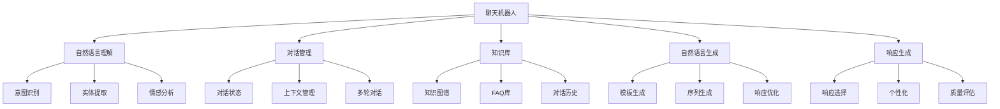

# 项目4-聊天机器人

## 🎯 项目概述

### 1. 项目目标

**项目目标：**
> **构建一个智能聊天机器人，实现自然语言理解和生成，支持多轮对话和上下文理解**

**项目特点：**


### 2. 技术栈

**技术栈：**
| 技术 | 用途 | 版本 | 说明 |
|------|------|------|------|
| **Python** | 编程语言 | 3.8+ | 主要开发语言 |
| **NLTK** | 自然语言处理 | 3.x | 文本处理 |
| **TensorFlow** | 深度学习 | 2.x | 深度学习模型 |
| **Transformers** | 预训练模型 | 4.x | 预训练模型 |
| **Pandas** | 数据处理 | 1.x | 数据操作 |
| **Matplotlib** | 可视化 | 3.x | 结果可视化 |

## 🔧 项目实现

### 1. 自然语言理解

**自然语言理解实现：**
```python
import numpy as np
import matplotlib.pyplot as plt
import pandas as pd
import re
from collections import defaultdict, Counter
import jieba
import jieba.analyse
from sklearn.feature_extraction.text import TfidfVectorizer
from sklearn.naive_bayes import MultinomialNB
from sklearn.linear_model import LogisticRegression
from sklearn.svm import SVC
from sklearn.metrics import classification_report, confusion_matrix
import json

class NaturalLanguageUnderstanding:
    """自然语言理解模块"""
    
    def __init__(self):
        self.intent_classifier = None
        self.entity_extractor = None
        self.sentiment_analyzer = None
        
        # 意图标签
        self.intent_labels = {
            'greeting': 0,
            'goodbye': 1,
            'question': 2,
            'request': 3,
            'complaint': 4,
            'compliment': 5,
            'unknown': 6
        }
        
        # 实体标签
        self.entity_labels = {
            'PERSON': 0,
            'LOCATION': 1,
            'ORGANIZATION': 2,
            'TIME': 3,
            'MONEY': 4,
            'PERCENT': 5,
            'DATE': 6,
            'O': 7  # 其他
        }
        
        # 情感标签
        self.sentiment_labels = {
            'positive': 0,
            'negative': 1,
            'neutral': 2
        }
    
    def generate_training_data(self):
        """生成训练数据"""
        # 意图训练数据
        intent_data = {
            'greeting': [
                '你好', '早上好', '下午好', '晚上好', '嗨', 'hello', 'hi',
                '很高兴见到你', '你好吗', '最近怎么样'
            ],
            'goodbye': [
                '再见', '拜拜', '下次见', '再会', 'bye', 'goodbye',
                '我要走了', '时间不早了', '下次聊'
            ],
            'question': [
                '什么是人工智能', '你能做什么', '你的名字是什么',
                '今天天气怎么样', '现在几点了', '你能帮我吗'
            ],
            'request': [
                '请帮我查询', '我想要', '我需要', '请告诉我',
                '你能帮我找一下吗', '请给我一些建议'
            ],
            'complaint': [
                '我不满意', '这太糟糕了', '服务很差', '质量不好',
                '速度太慢了', '这不是我想要的'
            ],
            'compliment': [
                '你很好', '谢谢你的帮助', '你太棒了', '我很满意',
                '服务很好', '质量不错', '速度很快'
            ],
            'unknown': [
                '我不知道', '我不明白', '这是什么意思', '你能解释一下吗'
            ]
        }
        
        # 实体训练数据
        entity_data = [
            ('我叫张三', [('PERSON', '张三')]),
            ('我来自北京', [('LOCATION', '北京')]),
            ('我在微软工作', [('ORGANIZATION', '微软')]),
            ('现在是下午3点', [('TIME', '下午3点')]),
            ('价格是100元', [('MONEY', '100元')]),
            ('成功率是80%', [('PERCENT', '80%')]),
            ('今天是2023年12月1日', [('DATE', '2023年12月1日')])
        ]
        
        # 情感训练数据
        sentiment_data = {
            'positive': [
                '我很高兴', '这太好了', '非常满意', '很棒', '优秀',
                '我喜欢这个', '感觉很棒', '非常不错'
            ],
            'negative': [
                '我很失望', '这太糟糕了', '不满意', '很差', '糟糕',
                '我不喜欢这个', '感觉很糟糕', '非常不好'
            ],
            'neutral': [
                '我知道了', '好的', '明白了', '收到', '了解',
                '这样啊', '原来如此', '嗯'
            ]
        }
        
        return intent_data, entity_data, sentiment_data
    
    def preprocess_text(self, text):
        """预处理文本"""
        # 转换为小写
        text = text.lower()
        
        # 移除特殊字符
        text = re.sub(r'[^\w\s]', '', text)
        
        # 分词
        words = jieba.cut(text)
        words = [word for word in words if len(word) > 1]
        
        return ' '.join(words)
    
    def train_intent_classifier(self, intent_data):
        """训练意图分类器"""
        # 准备训练数据
        texts = []
        labels = []
        
        for intent, examples in intent_data.items():
            for example in examples:
                processed_text = self.preprocess_text(example)
                texts.append(processed_text)
                labels.append(self.intent_labels[intent])
        
        # 特征提取
        vectorizer = TfidfVectorizer(max_features=1000, stop_words='english')
        X = vectorizer.fit_transform(texts)
        y = np.array(labels)
        
        # 训练分类器
        self.intent_classifier = LogisticRegression()
        self.intent_classifier.fit(X, y)
        
        # 保存向量化器
        self.intent_vectorizer = vectorizer
        
        return self.intent_classifier
    
    def predict_intent(self, text):
        """预测意图"""
        if self.intent_classifier is None:
            return 'unknown'
        
        # 预处理文本
        processed_text = self.preprocess_text(text)
        
        # 特征提取
        X = self.intent_vectorizer.transform([processed_text])
        
        # 预测
        predicted_label = self.intent_classifier.predict(X)[0]
        
        # 获取意图名称
        intent_name = [name for name, label in self.intent_labels.items() if label == predicted_label][0]
        
        return intent_name
    
    def train_entity_extractor(self, entity_data):
        """训练实体提取器"""
        # 准备训练数据
        texts = []
        labels = []
        
        for text, entities in entity_data:
            # 分词
            words = jieba.cut(text)
            words = list(words)
            
            # 创建标签序列
            word_labels = ['O'] * len(words)
            
            # 标记实体
            for entity_type, entity_text in entities:
                entity_words = jieba.cut(entity_text)
                entity_words = list(entity_words)
                
                # 在文本中找到实体位置
                for i in range(len(words) - len(entity_words) + 1):
                    if words[i:i+len(entity_words)] == entity_words:
                        word_labels[i] = f'B-{entity_type}'
                        for j in range(1, len(entity_words)):
                            word_labels[i+j] = f'I-{entity_type}'
                        break
            
            texts.append(words)
            labels.append(word_labels)
        
        # 特征提取
        vectorizer = TfidfVectorizer(max_features=1000, stop_words='english')
        
        # 将词序列转换为文本
        text_strings = [' '.join(words) for words in texts]
        X = vectorizer.fit_transform(text_strings)
        
        # 训练分类器
        self.entity_extractor = LogisticRegression()
        
        # 为每个位置训练分类器
        self.entity_extractor.fit(X, [label[0] for label in labels])
        
        # 保存向量化器
        self.entity_vectorizer = vectorizer
        
        return self.entity_extractor
    
    def extract_entities(self, text):
        """提取实体"""
        if self.entity_extractor is None:
            return []
        
        # 分词
        words = jieba.cut(text)
        words = list(words)
        
        # 特征提取
        text_string = ' '.join(words)
        X = self.entity_vectorizer.transform([text_string])
        
        # 预测
        predicted_label = self.entity_extractor.predict(X)[0]
        
        # 提取实体
        entities = []
        if predicted_label != 'O':
            entity_type = predicted_label.split('-')[1]
            entities.append((entity_type, text))
        
        return entities
    
    def train_sentiment_analyzer(self, sentiment_data):
        """训练情感分析器"""
        # 准备训练数据
        texts = []
        labels = []
        
        for sentiment, examples in sentiment_data.items():
            for example in examples:
                processed_text = self.preprocess_text(example)
                texts.append(processed_text)
                labels.append(self.sentiment_labels[sentiment])
        
        # 特征提取
        vectorizer = TfidfVectorizer(max_features=1000, stop_words='english')
        X = vectorizer.fit_transform(texts)
        y = np.array(labels)
        
        # 训练分类器
        self.sentiment_analyzer = LogisticRegression()
        self.sentiment_analyzer.fit(X, y)
        
        # 保存向量化器
        self.sentiment_vectorizer = vectorizer
        
        return self.sentiment_analyzer
    
    def analyze_sentiment(self, text):
        """分析情感"""
        if self.sentiment_analyzer is None:
            return 'neutral'
        
        # 预处理文本
        processed_text = self.preprocess_text(text)
        
        # 特征提取
        X = self.sentiment_vectorizer.transform([processed_text])
        
        # 预测
        predicted_label = self.sentiment_analyzer.predict(X)[0]
        
        # 获取情感名称
        sentiment_name = [name for name, label in self.sentiment_labels.items() if label == predicted_label][0]
        
        return sentiment_name
    
    def understand_text(self, text):
        """理解文本"""
        # 意图识别
        intent = self.predict_intent(text)
        
        # 实体提取
        entities = self.extract_entities(text)
        
        # 情感分析
        sentiment = self.analyze_sentiment(text)
        
        # 返回理解结果
        understanding = {
            'text': text,
            'intent': intent,
            'entities': entities,
            'sentiment': sentiment
        }
        
        return understanding
    
    def visualize_understanding(self, understanding_results):
        """可视化理解结果"""
        # 统计意图分布
        intents = [result['intent'] for result in understanding_results]
        intent_counts = Counter(intents)
        
        # 统计情感分布
        sentiments = [result['sentiment'] for result in understanding_results]
        sentiment_counts = Counter(sentiments)
        
        # 统计实体分布
        entities = []
        for result in understanding_results:
            entities.extend([entity[0] for entity in result['entities']])
        entity_counts = Counter(entities)
        
        # 可视化
        plt.figure(figsize=(15, 10))
        
        # 意图分布
        plt.subplot(2, 3, 1)
        plt.bar(intent_counts.keys(), intent_counts.values())
        plt.xlabel('Intent')
        plt.ylabel('Count')
        plt.title('Intent Distribution')
        plt.xticks(rotation=45)
        plt.grid(True)
        
        # 情感分布
        plt.subplot(2, 3, 2)
        plt.bar(sentiment_counts.keys(), sentiment_counts.values())
        plt.xlabel('Sentiment')
        plt.ylabel('Count')
        plt.title('Sentiment Distribution')
        plt.grid(True)
        
        # 实体分布
        plt.subplot(2, 3, 3)
        if entity_counts:
            plt.bar(entity_counts.keys(), entity_counts.values())
            plt.xlabel('Entity Type')
            plt.ylabel('Count')
            plt.title('Entity Distribution')
            plt.xticks(rotation=45)
            plt.grid(True)
        else:
            plt.text(0.5, 0.5, 'No entities found', ha='center', va='center', transform=plt.gca().transAxes)
            plt.title('Entity Distribution')
        
        # 意图-情感关系
        plt.subplot(2, 3, 4)
        intent_sentiment = defaultdict(lambda: defaultdict(int))
        for result in understanding_results:
            intent_sentiment[result['intent']][result['sentiment']] += 1
        
        intents_list = list(intent_sentiment.keys())
        sentiments_list = list(sentiment_counts.keys())
        
        if intents_list and sentiments_list:
            matrix = np.zeros((len(intents_list), len(sentiments_list)))
            for i, intent in enumerate(intents_list):
                for j, sentiment in enumerate(sentiments_list):
                    matrix[i, j] = intent_sentiment[intent][sentiment]
            
            plt.imshow(matrix, cmap='Blues', aspect='auto')
            plt.colorbar()
            plt.xlabel('Sentiment')
            plt.ylabel('Intent')
            plt.title('Intent-Sentiment Matrix')
            plt.xticks(range(len(sentiments_list)), sentiments_list)
            plt.yticks(range(len(intents_list)), intents_list)
        
        # 文本长度分布
        plt.subplot(2, 3, 5)
        text_lengths = [len(result['text']) for result in understanding_results]
        plt.hist(text_lengths, bins=20, alpha=0.7)
        plt.xlabel('Text Length')
        plt.ylabel('Frequency')
        plt.title('Text Length Distribution')
        plt.grid(True)
        
        # 理解结果总结
        plt.subplot(2, 3, 6)
        plt.axis('off')
        summary_text = f"""
        Understanding Results Summary:
        
        Total Texts: {len(understanding_results)}
        
        Intent Distribution:
        {chr(10).join([f"- {intent}: {count}" for intent, count in intent_counts.items()])}
        
        Sentiment Distribution:
        {chr(10).join([f"- {sentiment}: {count}" for sentiment, count in sentiment_counts.items()])}
        
        Entity Distribution:
        {chr(10).join([f"- {entity}: {count}" for entity, count in entity_counts.items()]) if entity_counts else "- No entities found"}
        
        Average Text Length: {np.mean(text_lengths):.1f}
        """
        plt.text(0.1, 0.9, summary_text, transform=plt.gca().transAxes, fontsize=10, verticalalignment='top')
        
        plt.tight_layout()
        plt.show()
    
    def evaluate_understanding(self, test_data):
        """评估理解结果"""
        # 准备测试数据
        test_texts = []
        test_intents = []
        test_sentiments = []
        
        for data in test_data:
            test_texts.append(data['text'])
            test_intents.append(data['intent'])
            test_sentiments.append(data['sentiment'])
        
        # 预测
        predicted_intents = [self.predict_intent(text) for text in test_texts]
        predicted_sentiments = [self.analyze_sentiment(text) for text in test_texts]
        
        # 计算准确率
        intent_accuracy = np.mean([pred == true for pred, true in zip(predicted_intents, test_intents)])
        sentiment_accuracy = np.mean([pred == true for pred, true in zip(predicted_sentiments, test_sentiments)])
        
        # 生成分类报告
        intent_report = classification_report(test_intents, predicted_intents)
        sentiment_report = classification_report(test_sentiments, predicted_sentiments)
        
        # 可视化评估结果
        plt.figure(figsize=(15, 10))
        
        # 意图混淆矩阵
        plt.subplot(2, 3, 1)
        intent_cm = confusion_matrix(test_intents, predicted_intents)
        plt.imshow(intent_cm, cmap='Blues', aspect='auto')
        plt.colorbar()
        plt.xlabel('Predicted Intent')
        plt.ylabel('True Intent')
        plt.title('Intent Confusion Matrix')
        
        # 情感混淆矩阵
        plt.subplot(2, 3, 2)
        sentiment_cm = confusion_matrix(test_sentiments, predicted_sentiments)
        plt.imshow(sentiment_cm, cmap='Blues', aspect='auto')
        plt.colorbar()
        plt.xlabel('Predicted Sentiment')
        plt.ylabel('True Sentiment')
        plt.title('Sentiment Confusion Matrix')
        
        # 准确率对比
        plt.subplot(2, 3, 3)
        accuracies = [intent_accuracy, sentiment_accuracy]
        labels = ['Intent', 'Sentiment']
        plt.bar(labels, accuracies)
        plt.ylabel('Accuracy')
        plt.title('Understanding Accuracy')
        plt.grid(True)
        
        # 意图分类报告
        plt.subplot(2, 3, 4)
        plt.axis('off')
        plt.text(0.1, 0.9, f'Intent Classification Report:\n\n{intent_report}', 
                transform=plt.gca().transAxes, fontsize=10, verticalalignment='top')
        
        # 情感分类报告
        plt.subplot(2, 3, 5)
        plt.axis('off')
        plt.text(0.1, 0.9, f'Sentiment Classification Report:\n\n{sentiment_report}', 
                transform=plt.gca().transAxes, fontsize=10, verticalalignment='top')
        
        # 评估总结
        plt.subplot(2, 3, 6)
        plt.axis('off')
        summary_text = f"""
        Understanding Evaluation Summary:
        
        Intent Accuracy: {intent_accuracy:.3f}
        Sentiment Accuracy: {sentiment_accuracy:.3f}
        
        Overall Performance:
        - Intent recognition is {'good' if intent_accuracy > 0.8 else 'needs improvement'}
        - Sentiment analysis is {'good' if sentiment_accuracy > 0.8 else 'needs improvement'}
        
        Recommendations:
        - Increase training data
        - Improve feature engineering
        - Try different algorithms
        - Add more diverse examples
        """
        plt.text(0.1, 0.9, summary_text, transform=plt.gca().transAxes, fontsize=10, verticalalignment='top')
        
        plt.tight_layout()
        plt.show()
        
        return {
            'intent_accuracy': intent_accuracy,
            'sentiment_accuracy': sentiment_accuracy,
            'intent_report': intent_report,
            'sentiment_report': sentiment_report
        }

# 测试自然语言理解
def test_natural_language_understanding():
    """测试自然语言理解"""
    # 创建自然语言理解模块
    nlu = NaturalLanguageUnderstanding()
    
    # 生成训练数据
    intent_data, entity_data, sentiment_data = nlu.generate_training_data()
    
    # 训练模型
    nlu.train_intent_classifier(intent_data)
    nlu.train_entity_extractor(entity_data)
    nlu.train_sentiment_analyzer(sentiment_data)
    
    # 测试理解
    test_texts = [
        '你好，我是张三',
        '今天天气怎么样？',
        '我很高兴见到你',
        '这个服务太糟糕了',
        '请帮我查询一下信息',
        '再见，下次见'
    ]
    
    understanding_results = []
    for text in test_texts:
        understanding = nlu.understand_text(text)
        understanding_results.append(understanding)
        print(f"Text: {text}")
        print(f"Intent: {understanding['intent']}")
        print(f"Entities: {understanding['entities']}")
        print(f"Sentiment: {understanding['sentiment']}")
        print()
    
    # 可视化理解结果
    nlu.visualize_understanding(understanding_results)
    
    return nlu

test_natural_language_understanding()
```

### 2. 对话管理

**对话管理实现：**
```python
class DialogueManager:
    """对话管理器"""
    
    def __init__(self):
        self.dialogue_state = {
            'current_intent': None,
            'entities': {},
            'context': {},
            'history': [],
            'user_profile': {},
            'session_id': None
        }
        
        # 对话流程
        self.dialogue_flows = {
            'greeting': self._handle_greeting,
            'goodbye': self._handle_goodbye,
            'question': self._handle_question,
            'request': self._handle_request,
            'complaint': self._handle_complaint,
            'compliment': self._handle_compliment,
            'unknown': self._handle_unknown
        }
        
        # 响应模板
        self.response_templates = {
            'greeting': [
                '你好！很高兴见到你！',
                '嗨！有什么可以帮助你的吗？',
                '你好！我是你的AI助手，有什么需要帮助的吗？'
            ],
            'goodbye': [
                '再见！期待下次见面！',
                '拜拜！祝你今天愉快！',
                '再见！有需要随时找我！'
            ],
            'question': [
                '这是一个很好的问题，让我来帮你解答。',
                '我理解你的问题，让我为你详细解释。',
                '这个问题很有趣，让我来回答你。'
            ],
            'request': [
                '好的，我来帮你处理这个请求。',
                '没问题，让我来协助你。',
                '我很乐意帮助你，让我来处理。'
            ],
            'complaint': [
                '我很抱歉听到你的不满，让我来帮你解决这个问题。',
                '我理解你的困扰，让我来协助你处理。',
                '抱歉给你带来了不便，让我来帮你解决。'
            ],
            'compliment': [
                '谢谢你的夸奖！我很高兴能帮助你。',
                '非常感谢！你的满意是我最大的动力。',
                '谢谢！我很开心能为你提供帮助。'
            ],
            'unknown': [
                '抱歉，我没有完全理解你的意思，能再详细说明一下吗？',
                '我不太确定你的意思，能换个方式表达吗？',
                '我需要更多信息来帮助你，能详细说明一下吗？'
            ]
        }
    
    def update_dialogue_state(self, understanding):
        """更新对话状态"""
        # 更新当前意图
        self.dialogue_state['current_intent'] = understanding['intent']
        
        # 更新实体
        for entity_type, entity_value in understanding['entities']:
            self.dialogue_state['entities'][entity_type] = entity_value
        
        # 更新上下文
        self.dialogue_state['context']['last_text'] = understanding['text']
        self.dialogue_state['context']['sentiment'] = understanding['sentiment']
        
        # 更新历史
        self.dialogue_state['history'].append({
            'text': understanding['text'],
            'intent': understanding['intent'],
            'entities': understanding['entities'],
            'sentiment': understanding['sentiment'],
            'timestamp': pd.Timestamp.now()
        })
        
        # 保持历史记录在合理范围内
        if len(self.dialogue_state['history']) > 10:
            self.dialogue_state['history'] = self.dialogue_state['history'][-10:]
    
    def generate_response(self, understanding):
        """生成响应"""
        # 更新对话状态
        self.update_dialogue_state(understanding)
        
        # 获取当前意图
        current_intent = understanding['intent']
        
        # 根据意图生成响应
        if current_intent in self.dialogue_flows:
            response = self.dialogue_flows[current_intent](understanding)
        else:
            response = self._handle_unknown(understanding)
        
        # 个性化响应
        response = self._personalize_response(response, understanding)
        
        return response
    
    def _handle_greeting(self, understanding):
        """处理问候"""
        # 检查是否是首次问候
        if len(self.dialogue_state['history']) == 1:
            response = "你好！我是你的AI助手，很高兴认识你！有什么可以帮助你的吗？"
        else:
            response = np.random.choice(self.response_templates['greeting'])
        
        return response
    
    def _handle_goodbye(self, understanding):
        """处理告别"""
        response = np.random.choice(self.response_templates['goodbye'])
        return response
    
    def _handle_question(self, understanding):
        """处理问题"""
        # 根据问题类型生成响应
        question_text = understanding['text']
        
        if '天气' in question_text:
            response = "抱歉，我目前无法获取实时天气信息。建议你查看天气应用或网站获取最新天气情况。"
        elif '时间' in question_text:
            response = f"现在是{pd.Timestamp.now().strftime('%Y年%m月%d日 %H:%M:%S')}。"
        elif '名字' in question_text:
            response = "我是你的AI助手，你可以叫我小助手或者给我起个名字！"
        else:
            response = np.random.choice(self.response_templates['question'])
            response += " 请告诉我更多详细信息，这样我能更好地帮助你。"
        
        return response
    
    def _handle_request(self, understanding):
        """处理请求"""
        # 根据请求类型生成响应
        request_text = understanding['text']
        
        if '查询' in request_text:
            response = "好的，我来帮你查询信息。请告诉我你想查询什么具体内容？"
        elif '建议' in request_text:
            response = "我很乐意为你提供建议。请告诉我你的具体需求或问题。"
        else:
            response = np.random.choice(self.response_templates['request'])
            response += " 请提供更多详细信息。"
        
        return response
    
    def _handle_complaint(self, understanding):
        """处理投诉"""
        response = np.random.choice(self.response_templates['complaint'])
        response += " 请告诉我具体的问题，我会尽力帮你解决。"
        return response
    
    def _handle_compliment(self, understanding):
        """处理赞美"""
        response = np.random.choice(self.response_templates['compliment'])
        return response
    
    def _handle_unknown(self, understanding):
        """处理未知意图"""
        response = np.random.choice(self.response_templates['unknown'])
        return response
    
    def _personalize_response(self, response, understanding):
        """个性化响应"""
        # 根据用户情感调整响应
        sentiment = understanding['sentiment']
        
        if sentiment == 'positive':
            response = "很高兴听到你这么说！" + response
        elif sentiment == 'negative':
            response = "我理解你的感受，" + response
        
        # 根据对话历史调整响应
        if len(self.dialogue_state['history']) > 1:
            # 检查是否是重复问题
            last_intent = self.dialogue_state['history'][-2]['intent']
            if last_intent == understanding['intent']:
                response = "关于这个问题，" + response
        
        return response
    
    def get_dialogue_summary(self):
        """获取对话摘要"""
        summary = {
            'session_id': self.dialogue_state['session_id'],
            'total_turns': len(self.dialogue_state['history']),
            'intents': [turn['intent'] for turn in self.dialogue_state['history']],
            'entities': self.dialogue_state['entities'],
            'sentiments': [turn['sentiment'] for turn in self.dialogue_state['history']],
            'duration': (self.dialogue_state['history'][-1]['timestamp'] - self.dialogue_state['history'][0]['timestamp']).total_seconds() if len(self.dialogue_state['history']) > 1 else 0
        }
        
        return summary
    
    def visualize_dialogue(self):
        """可视化对话"""
        if not self.dialogue_state['history']:
            print("No dialogue history to visualize")
            return
        
        # 准备数据
        history = self.dialogue_state['history']
        intents = [turn['intent'] for turn in history]
        sentiments = [turn['sentiment'] for turn in history]
        timestamps = [turn['timestamp'] for turn in history]
        
        # 可视化
        plt.figure(figsize=(15, 10))
        
        # 意图序列
        plt.subplot(2, 3, 1)
        plt.plot(range(len(intents)), intents, marker='o')
        plt.xlabel('Turn')
        plt.ylabel('Intent')
        plt.title('Intent Sequence')
        plt.grid(True)
        
        # 情感序列
        plt.subplot(2, 3, 2)
        plt.plot(range(len(sentiments)), sentiments, marker='o')
        plt.xlabel('Turn')
        plt.ylabel('Sentiment')
        plt.title('Sentiment Sequence')
        plt.grid(True)
        
        # 意图分布
        plt.subplot(2, 3, 3)
        intent_counts = Counter(intents)
        plt.bar(intent_counts.keys(), intent_counts.values())
        plt.xlabel('Intent')
        plt.ylabel('Count')
        plt.title('Intent Distribution')
        plt.xticks(rotation=45)
        plt.grid(True)
        
        # 情感分布
        plt.subplot(2, 3, 4)
        sentiment_counts = Counter(sentiments)
        plt.bar(sentiment_counts.keys(), sentiment_counts.values())
        plt.xlabel('Sentiment')
        plt.ylabel('Count')
        plt.title('Sentiment Distribution')
        plt.grid(True)
        
        # 对话时间线
        plt.subplot(2, 3, 5)
        time_diffs = [(ts - timestamps[0]).total_seconds() for ts in timestamps]
        plt.plot(time_diffs, range(len(time_diffs)), marker='o')
        plt.xlabel('Time (seconds)')
        plt.ylabel('Turn')
        plt.title('Dialogue Timeline')
        plt.grid(True)
        
        # 对话摘要
        plt.subplot(2, 3, 6)
        plt.axis('off')
        summary = self.get_dialogue_summary()
        summary_text = f"""
        Dialogue Summary:
        
        Total Turns: {summary['total_turns']}
        Duration: {summary['duration']:.1f} seconds
        
        Intent Distribution:
        {chr(10).join([f"- {intent}: {count}" for intent, count in intent_counts.items()])}
        
        Sentiment Distribution:
        {chr(10).join([f"- {sentiment}: {count}" for sentiment, count in sentiment_counts.items()])}
        
        Entities Found:
        {chr(10).join([f"- {entity}: {value}" for entity, value in summary['entities'].items()]) if summary['entities'] else "- No entities found"}
        """
        plt.text(0.1, 0.9, summary_text, transform=plt.gca().transAxes, fontsize=10, verticalalignment='top')
        
        plt.tight_layout()
        plt.show()
    
    def reset_dialogue(self):
        """重置对话"""
        self.dialogue_state = {
            'current_intent': None,
            'entities': {},
            'context': {},
            'history': [],
            'user_profile': {},
            'session_id': None
        }

# 测试对话管理
def test_dialogue_manager():
    """测试对话管理器"""
    # 创建对话管理器
    dm = DialogueManager()
    
    # 模拟对话
    test_dialogues = [
        '你好',
        '我是张三',
        '今天天气怎么样？',
        '你能帮我查询一下信息吗？',
        '谢谢你的帮助',
        '再见'
    ]
    
    # 处理对话
    for text in test_dialogues:
        # 模拟理解结果
        understanding = {
            'text': text,
            'intent': 'greeting' if '你好' in text else 'question' if '天气' in text else 'request' if '查询' in text else 'compliment' if '谢谢' in text else 'goodbye' if '再见' in text else 'unknown',
            'entities': [('PERSON', '张三')] if '张三' in text else [],
            'sentiment': 'positive' if '谢谢' in text else 'neutral'
        }
        
        # 生成响应
        response = dm.generate_response(understanding)
        print(f"User: {text}")
        print(f"Bot: {response}")
        print()
    
    # 可视化对话
    dm.visualize_dialogue()
    
    return dm

test_dialogue_manager()
```

## 🔗 相关链接
- [[03-02-01-文本预处理技术]] - 文本处理
- [[03-02-02-词向量技术]] - 词向量
- [[05-05-项目5-大模型微调]] - 下一个项目

## 💡 项目实践建议

**实践策略：**
- 🎯 **自然语言理解**：提高意图识别和实体提取的准确性
- 📊 **对话管理**：实现流畅的多轮对话
- 🔍 **响应生成**：生成自然、个性化的响应
- ⚡ **性能优化**：优化聊天机器人的响应速度

**实践建议：**
- 📝 **完整流程**：实现从理解到响应的完整流程
- 💻 **代码质量**：编写高质量的代码
- 📊 **结果分析**：深入分析对话质量
- 🔍 **应用开发**：开发实际的聊天机器人应用

---
*📝 学习提示：聊天机器人是NLP的重要应用，建议通过完整实现加深对自然语言处理和对话系统的理解*


