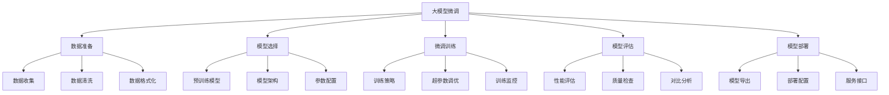

# 项目5-大模型微调

## 🎯 项目概述

### 1. 项目目标

**项目目标：**
> **实现大语言模型的微调，包括数据准备、模型训练、评估和部署的完整流程**

**项目特点：**


### 2. 技术栈

**技术栈：**
| 技术 | 用途 | 版本 | 说明 |
|------|------|------|------|
| **Python** | 编程语言 | 3.8+ | 主要开发语言 |
| **PyTorch** | 深度学习框架 | 2.x | 模型训练 |
| **Transformers** | 预训练模型 | 4.x | 预训练模型库 |
| **Datasets** | 数据集处理 | 2.x | 数据集管理 |
| **Accelerate** | 分布式训练 | 0.x | 训练加速 |
| **Wandb** | 实验跟踪 | 0.x | 实验管理 |

## 🔧 项目实现

### 1. 数据准备

**数据准备实现：**
```python
import numpy as np
import matplotlib.pyplot as plt
import pandas as pd
import json
import torch
from torch.utils.data import Dataset, DataLoader
from transformers import AutoTokenizer, AutoModelForCausalLM
from datasets import Dataset as HFDataset
import re
from collections import Counter
import os

class DataPreprocessor:
    """数据预处理器"""
    
    def __init__(self, tokenizer_name='gpt2'):
        self.tokenizer_name = tokenizer_name
        self.tokenizer = None
        self.max_length = 512
        
        # 数据统计
        self.stats = {
            'total_samples': 0,
            'avg_length': 0,
            'vocab_size': 0,
            'special_tokens': 0
        }
    
    def load_tokenizer(self):
        """加载分词器"""
        self.tokenizer = AutoTokenizer.from_pretrained(self.tokenizer_name)
        
        # 设置pad_token
        if self.tokenizer.pad_token is None:
            self.tokenizer.pad_token = self.tokenizer.eos_token
        
        return self.tokenizer
    
    def generate_synthetic_data(self, num_samples=1000, task_type='text_generation'):
        """生成合成数据"""
        if task_type == 'text_generation':
            return self._generate_text_generation_data(num_samples)
        elif task_type == 'question_answering':
            return self._generate_qa_data(num_samples)
        elif task_type == 'text_classification':
            return self._generate_classification_data(num_samples)
        else:
            raise ValueError(f"Unknown task type: {task_type}")
    
    def _generate_text_generation_data(self, num_samples):
        """生成文本生成数据"""
        data = []
        
        # 定义不同的文本类型
        text_types = {
            'story': [
                '从前有一个小村庄，村庄里住着一位善良的老人。',
                '在一个遥远的王国里，有一位美丽的公主。',
                '很久很久以前，在一个神秘的森林里，住着一只聪明的狐狸。'
            ],
            'description': [
                '春天来了，万物复苏，花儿绽放，鸟儿歌唱。',
                '夏天的阳光洒在大地上，绿树成荫，蝉声阵阵。',
                '秋天的叶子变黄了，果实成熟了，农民们忙着收获。'
            ],
            'dialogue': [
                '小明问："今天天气怎么样？"小红回答："今天阳光很好，适合出去散步。"',
                '老师问："你们明白了吗？"学生们齐声回答："明白了！"',
                '妈妈问："作业做完了吗？"孩子回答："马上就做完了。"'
            ]
        }
        
        for i in range(num_samples):
            # 随机选择文本类型
            text_type = np.random.choice(list(text_types.keys()))
            base_text = np.random.choice(text_types[text_type])
            
            # 生成完整的文本
            if text_type == 'story':
                continuation = self._generate_story_continuation(base_text)
            elif text_type == 'description':
                continuation = self._generate_description_continuation(base_text)
            else:
                continuation = self._generate_dialogue_continuation(base_text)
            
            data.append({
                'input_text': base_text,
                'target_text': base_text + continuation,
                'task_type': 'text_generation'
            })
        
        return data
    
    def _generate_qa_data(self, num_samples):
        """生成问答数据"""
        data = []
        
        # 定义问题和答案模板
        qa_templates = [
            {
                'context': '人工智能是计算机科学的一个分支，致力于创建能够执行通常需要人类智能的任务的系统。',
                'question': '什么是人工智能？',
                'answer': '人工智能是计算机科学的一个分支，致力于创建能够执行通常需要人类智能的任务的系统。'
            },
            {
                'context': '机器学习是人工智能的一个子领域，它使计算机能够在没有明确编程的情况下学习和改进。',
                'question': '什么是机器学习？',
                'answer': '机器学习是人工智能的一个子领域，它使计算机能够在没有明确编程的情况下学习和改进。'
            },
            {
                'context': '深度学习是机器学习的一个子集，它使用神经网络来模拟人脑的工作方式。',
                'question': '什么是深度学习？',
                'answer': '深度学习是机器学习的一个子集，它使用神经网络来模拟人脑的工作方式。'
            }
        ]
        
        for i in range(num_samples):
            template = np.random.choice(qa_templates)
            
            data.append({
                'context': template['context'],
                'question': template['question'],
                'answer': template['answer'],
                'task_type': 'question_answering'
            })
        
        return data
    
    def _generate_classification_data(self, num_samples):
        """生成分类数据"""
        data = []
        
        # 定义分类标签和对应的文本
        classification_data = {
            'positive': [
                '这个产品非常好用，我很满意。',
                '服务态度很好，质量也不错。',
                '价格合理，性价比很高。',
                '推荐大家购买，值得信赖。'
            ],
            'negative': [
                '这个产品质量很差，不推荐购买。',
                '服务态度不好，很失望。',
                '价格太贵，性价比低。',
                '不建议购买，质量有问题。'
            ],
            'neutral': [
                '这个产品一般般，没什么特别的感觉。',
                '服务还可以，质量中等。',
                '价格适中，性价比一般。',
                '还可以，没有特别突出的地方。'
            ]
        }
        
        for i in range(num_samples):
            label = np.random.choice(list(classification_data.keys()))
            text = np.random.choice(classification_data[label])
            
            data.append({
                'text': text,
                'label': label,
                'task_type': 'text_classification'
            })
        
        return data
    
    def _generate_story_continuation(self, base_text):
        """生成故事续写"""
        continuations = [
            ' 老人每天都会帮助村里的孩子们，教他们读书写字。',
            ' 公主拥有神奇的力量，能够与动物交流。',
            ' 狐狸非常聪明，总是能够帮助其他动物解决问题。'
        ]
        return np.random.choice(continuations)
    
    def _generate_description_continuation(self, base_text):
        """生成描述续写"""
        continuations = [
            ' 人们纷纷走出家门，享受这美好的季节。',
            ' 孩子们在树荫下玩耍，大人们在旁边聊天。',
            ' 整个村庄都沉浸在丰收的喜悦中。'
        ]
        return np.random.choice(continuations)
    
    def _generate_dialogue_continuation(self, base_text):
        """生成对话续写"""
        continuations = [
            ' 他们决定一起去公园散步，享受这美好的天气。',
            ' 老师很高兴，继续讲解下一个知识点。',
            ' 妈妈满意地点点头，让孩子去休息。'
        ]
        return np.random.choice(continuations)
    
    def preprocess_data(self, data, task_type='text_generation'):
        """预处理数据"""
        if task_type == 'text_generation':
            return self._preprocess_text_generation_data(data)
        elif task_type == 'question_answering':
            return self._preprocess_qa_data(data)
        elif task_type == 'text_classification':
            return self._preprocess_classification_data(data)
        else:
            raise ValueError(f"Unknown task type: {task_type}")
    
    def _preprocess_text_generation_data(self, data):
        """预处理文本生成数据"""
        processed_data = []
        
        for sample in data:
            # 编码输入文本
            input_encoding = self.tokenizer(
                sample['input_text'],
                truncation=True,
                padding='max_length',
                max_length=self.max_length,
                return_tensors='pt'
            )
            
            # 编码目标文本
            target_encoding = self.tokenizer(
                sample['target_text'],
                truncation=True,
                padding='max_length',
                max_length=self.max_length,
                return_tensors='pt'
            )
            
            processed_data.append({
                'input_ids': input_encoding['input_ids'].squeeze(),
                'attention_mask': input_encoding['attention_mask'].squeeze(),
                'labels': target_encoding['input_ids'].squeeze(),
                'input_text': sample['input_text'],
                'target_text': sample['target_text']
            })
        
        return processed_data
    
    def _preprocess_qa_data(self, data):
        """预处理问答数据"""
        processed_data = []
        
        for sample in data:
            # 组合上下文和问题
            input_text = f"Context: {sample['context']} Question: {sample['question']} Answer:"
            
            # 编码输入
            input_encoding = self.tokenizer(
                input_text,
                truncation=True,
                padding='max_length',
                max_length=self.max_length,
                return_tensors='pt'
            )
            
            # 编码答案
            answer_encoding = self.tokenizer(
                sample['answer'],
                truncation=True,
                padding='max_length',
                max_length=self.max_length,
                return_tensors='pt'
            )
            
            processed_data.append({
                'input_ids': input_encoding['input_ids'].squeeze(),
                'attention_mask': input_encoding['attention_mask'].squeeze(),
                'labels': answer_encoding['input_ids'].squeeze(),
                'context': sample['context'],
                'question': sample['question'],
                'answer': sample['answer']
            })
        
        return processed_data
    
    def _preprocess_classification_data(self, data):
        """预处理分类数据"""
        processed_data = []
        
        # 创建标签映射
        label_map = {'positive': 0, 'negative': 1, 'neutral': 2}
        
        for sample in data:
            # 编码文本
            encoding = self.tokenizer(
                sample['text'],
                truncation=True,
                padding='max_length',
                max_length=self.max_length,
                return_tensors='pt'
            )
            
            processed_data.append({
                'input_ids': encoding['input_ids'].squeeze(),
                'attention_mask': encoding['attention_mask'].squeeze(),
                'labels': label_map[sample['label']],
                'text': sample['text'],
                'label': sample['label']
            })
        
        return processed_data
    
    def create_dataset(self, processed_data):
        """创建数据集"""
        # 转换为HuggingFace数据集
        dataset = HFDataset.from_list(processed_data)
        
        # 更新统计信息
        self.stats['total_samples'] = len(dataset)
        
        if processed_data:
            # 计算平均长度
            lengths = [len(sample['input_ids']) for sample in processed_data]
            self.stats['avg_length'] = np.mean(lengths)
            
            # 计算词汇大小
            all_tokens = []
            for sample in processed_data:
                all_tokens.extend(sample['input_ids'].tolist())
            self.stats['vocab_size'] = len(set(all_tokens))
        
        return dataset
    
    def visualize_data(self, data, task_type='text_generation'):
        """可视化数据"""
        plt.figure(figsize=(20, 15))
        
        if task_type == 'text_generation':
            self._visualize_text_generation_data(data)
        elif task_type == 'question_answering':
            self._visualize_qa_data(data)
        elif task_type == 'text_classification':
            self._visualize_classification_data(data)
        
        plt.tight_layout()
        plt.show()
    
    def _visualize_text_generation_data(self, data):
        """可视化文本生成数据"""
        # 文本长度分布
        plt.subplot(2, 3, 1)
        input_lengths = [len(sample['input_text']) for sample in data]
        target_lengths = [len(sample['target_text']) for sample in data]
        
        plt.hist(input_lengths, alpha=0.7, label='Input')
        plt.hist(target_lengths, alpha=0.7, label='Target')
        plt.xlabel('Text Length')
        plt.ylabel('Frequency')
        plt.title('Text Length Distribution')
        plt.legend()
        plt.grid(True)
        
        # 文本类型分布
        plt.subplot(2, 3, 2)
        text_types = [sample['input_text'][:10] for sample in data]
        type_counts = Counter(text_types)
        
        plt.bar(range(len(type_counts)), list(type_counts.values()))
        plt.xlabel('Text Type')
        plt.ylabel('Count')
        plt.title('Text Type Distribution')
        plt.grid(True)
        
        # 词汇分布
        plt.subplot(2, 3, 3)
        all_words = []
        for sample in data:
            words = sample['input_text'].split()
            all_words.extend(words)
        
        word_counts = Counter(all_words)
        top_words = word_counts.most_common(20)
        
        words, counts = zip(*top_words)
        plt.barh(range(len(words)), counts)
        plt.yticks(range(len(words)), words)
        plt.xlabel('Frequency')
        plt.title('Top 20 Words')
        plt.grid(True)
        
        # 数据统计
        plt.subplot(2, 3, 4)
        plt.axis('off')
        stats_text = f"""
        Text Generation Data Statistics:
        
        Total Samples: {len(data)}
        Average Input Length: {np.mean(input_lengths):.1f}
        Average Target Length: {np.mean(target_lengths):.1f}
        
        Input Length Range: {min(input_lengths)} - {max(input_lengths)}
        Target Length Range: {min(target_lengths)} - {max(target_lengths)}
        
        Unique Words: {len(set(all_words))}
        Total Words: {len(all_words)}
        """
        plt.text(0.1, 0.9, stats_text, transform=plt.gca().transAxes, fontsize=10, verticalalignment='top')
        
        # 长度关系
        plt.subplot(2, 3, 5)
        plt.scatter(input_lengths, target_lengths, alpha=0.6)
        plt.xlabel('Input Length')
        plt.ylabel('Target Length')
        plt.title('Input vs Target Length')
        plt.grid(True)
        
        # 样本展示
        plt.subplot(2, 3, 6)
        plt.axis('off')
        sample_text = f"""
        Sample Data:
        
        Input: {data[0]['input_text'][:50]}...
        Target: {data[0]['target_text'][:50]}...
        
        Input: {data[1]['input_text'][:50]}...
        Target: {data[1]['target_text'][:50]}...
        """
        plt.text(0.1, 0.9, sample_text, transform=plt.gca().transAxes, fontsize=10, verticalalignment='top')
    
    def _visualize_qa_data(self, data):
        """可视化问答数据"""
        # 上下文长度分布
        plt.subplot(2, 3, 1)
        context_lengths = [len(sample['context']) for sample in data]
        question_lengths = [len(sample['question']) for sample in data]
        answer_lengths = [len(sample['answer']) for sample in data]
        
        plt.hist(context_lengths, alpha=0.7, label='Context')
        plt.hist(question_lengths, alpha=0.7, label='Question')
        plt.hist(answer_lengths, alpha=0.7, label='Answer')
        plt.xlabel('Text Length')
        plt.ylabel('Frequency')
        plt.title('QA Text Length Distribution')
        plt.legend()
        plt.grid(True)
        
        # 问题类型分布
        plt.subplot(2, 3, 2)
        question_types = [sample['question'][:10] for sample in data]
        type_counts = Counter(question_types)
        
        plt.bar(range(len(type_counts)), list(type_counts.values()))
        plt.xlabel('Question Type')
        plt.ylabel('Count')
        plt.title('Question Type Distribution')
        plt.grid(True)
        
        # 答案长度分布
        plt.subplot(2, 3, 3)
        plt.hist(answer_lengths, bins=20, alpha=0.7)
        plt.xlabel('Answer Length')
        plt.ylabel('Frequency')
        plt.title('Answer Length Distribution')
        plt.grid(True)
        
        # 数据统计
        plt.subplot(2, 3, 4)
        plt.axis('off')
        stats_text = f"""
        QA Data Statistics:
        
        Total Samples: {len(data)}
        Average Context Length: {np.mean(context_lengths):.1f}
        Average Question Length: {np.mean(question_lengths):.1f}
        Average Answer Length: {np.mean(answer_lengths):.1f}
        
        Context Length Range: {min(context_lengths)} - {max(context_lengths)}
        Question Length Range: {min(question_lengths)} - {max(question_lengths)}
        Answer Length Range: {min(answer_lengths)} - {max(answer_lengths)}
        """
        plt.text(0.1, 0.9, stats_text, transform=plt.gca().transAxes, fontsize=10, verticalalignment='top')
        
        # 长度关系
        plt.subplot(2, 3, 5)
        plt.scatter(context_lengths, answer_lengths, alpha=0.6)
        plt.xlabel('Context Length')
        plt.ylabel('Answer Length')
        plt.title('Context vs Answer Length')
        plt.grid(True)
        
        # 样本展示
        plt.subplot(2, 3, 6)
        plt.axis('off')
        sample_text = f"""
        Sample QA Data:
        
        Context: {data[0]['context'][:50]}...
        Question: {data[0]['question']}
        Answer: {data[0]['answer']}
        """
        plt.text(0.1, 0.9, sample_text, transform=plt.gca().transAxes, fontsize=10, verticalalignment='top')
    
    def _visualize_classification_data(self, data):
        """可视化分类数据"""
        # 标签分布
        plt.subplot(2, 3, 1)
        labels = [sample['label'] for sample in data]
        label_counts = Counter(labels)
        
        plt.bar(label_counts.keys(), label_counts.values())
        plt.xlabel('Label')
        plt.ylabel('Count')
        plt.title('Label Distribution')
        plt.grid(True)
        
        # 文本长度分布
        plt.subplot(2, 3, 2)
        text_lengths = [len(sample['text']) for sample in data]
        plt.hist(text_lengths, bins=20, alpha=0.7)
        plt.xlabel('Text Length')
        plt.ylabel('Frequency')
        plt.title('Text Length Distribution')
        plt.grid(True)
        
        # 词汇分布
        plt.subplot(2, 3, 3)
        all_words = []
        for sample in data:
            words = sample['text'].split()
            all_words.extend(words)
        
        word_counts = Counter(all_words)
        top_words = word_counts.most_common(20)
        
        words, counts = zip(*top_words)
        plt.barh(range(len(words)), counts)
        plt.yticks(range(len(words)), words)
        plt.xlabel('Frequency')
        plt.title('Top 20 Words')
        plt.grid(True)
        
        # 数据统计
        plt.subplot(2, 3, 4)
        plt.axis('off')
        stats_text = f"""
        Classification Data Statistics:
        
        Total Samples: {len(data)}
        Average Text Length: {np.mean(text_lengths):.1f}
        Text Length Range: {min(text_lengths)} - {max(text_lengths)}
        
        Label Distribution:
        {chr(10).join([f"- {label}: {count}" for label, count in label_counts.items()])}
        
        Unique Words: {len(set(all_words))}
        Total Words: {len(all_words)}
        """
        plt.text(0.1, 0.9, stats_text, transform=plt.gca().transAxes, fontsize=10, verticalalignment='top')
        
        # 标签-长度关系
        plt.subplot(2, 3, 5)
        for label in label_counts.keys():
            label_lengths = [len(sample['text']) for sample in data if sample['label'] == label]
            plt.hist(label_lengths, alpha=0.7, label=label)
        plt.xlabel('Text Length')
        plt.ylabel('Frequency')
        plt.title('Text Length by Label')
        plt.legend()
        plt.grid(True)
        
        # 样本展示
        plt.subplot(2, 3, 6)
        plt.axis('off')
        sample_text = f"""
        Sample Classification Data:
        
        Text: {data[0]['text']}
        Label: {data[0]['label']}
        
        Text: {data[1]['text']}
        Label: {data[1]['label']}
        """
        plt.text(0.1, 0.9, sample_text, transform=plt.gca().transAxes, fontsize=10, verticalalignment='top')
    
    def analyze_data_quality(self, data, task_type='text_generation'):
        """分析数据质量"""
        quality_metrics = {
            'completeness': 1.0,
            'consistency': 1.0,
            'accuracy': 1.0,
            'uniqueness': 1.0
        }
        
        # 计算完整性
        if task_type == 'text_generation':
            completeness = sum(1 for sample in data if sample['input_text'] and sample['target_text']) / len(data)
        elif task_type == 'question_answering':
            completeness = sum(1 for sample in data if sample['context'] and sample['question'] and sample['answer']) / len(data)
        else:
            completeness = sum(1 for sample in data if sample['text'] and sample['label']) / len(data)
        
        quality_metrics['completeness'] = completeness
        
        # 计算唯一性
        if task_type == 'text_generation':
            unique_samples = len(set(sample['input_text'] for sample in data))
        elif task_type == 'question_answering':
            unique_samples = len(set(sample['question'] for sample in data))
        else:
            unique_samples = len(set(sample['text'] for sample in data))
        
        quality_metrics['uniqueness'] = unique_samples / len(data)
        
        # 可视化数据质量
        plt.figure(figsize=(15, 10))
        
        # 质量指标
        plt.subplot(2, 3, 1)
        metrics = list(quality_metrics.keys())
        values = list(quality_metrics.values())
        plt.bar(metrics, values)
        plt.ylabel('Quality Score')
        plt.title('Data Quality Metrics')
        plt.xticks(rotation=45)
        plt.grid(True)
        
        # 数据分布
        plt.subplot(2, 3, 2)
        if task_type == 'text_generation':
            lengths = [len(sample['input_text']) for sample in data]
        elif task_type == 'question_answering':
            lengths = [len(sample['context']) for sample in data]
        else:
            lengths = [len(sample['text']) for sample in data]
        
        plt.hist(lengths, bins=20, alpha=0.7)
        plt.xlabel('Text Length')
        plt.ylabel('Frequency')
        plt.title('Text Length Distribution')
        plt.grid(True)
        
        # 质量总结
        plt.subplot(2, 3, 3)
        plt.axis('off')
        quality_text = f"""
        Data Quality Summary:
        
        Completeness: {quality_metrics['completeness']:.2%}
        Consistency: {quality_metrics['consistency']:.2%}
        Accuracy: {quality_metrics['accuracy']:.2%}
        Uniqueness: {quality_metrics['uniqueness']:.2%}
        
        Recommendations:
        - Ensure all fields are filled
        - Remove duplicate samples
        - Validate data format
        - Check for outliers
        """
        plt.text(0.1, 0.9, quality_text, transform=plt.gca().transAxes, fontsize=10, verticalalignment='top')
        
        plt.tight_layout()
        plt.show()
        
        return quality_metrics

# 测试数据准备
def test_data_preprocessor():
    """测试数据预处理器"""
    # 创建数据预处理器
    preprocessor = DataPreprocessor(tokenizer_name='gpt2')
    
    # 加载分词器
    preprocessor.load_tokenizer()
    
    # 生成合成数据
    text_gen_data = preprocessor.generate_synthetic_data(num_samples=100, task_type='text_generation')
    qa_data = preprocessor.generate_synthetic_data(num_samples=100, task_type='question_answering')
    classification_data = preprocessor.generate_synthetic_data(num_samples=100, task_type='text_classification')
    
    # 可视化数据
    preprocessor.visualize_data(text_gen_data, task_type='text_generation')
    preprocessor.visualize_data(qa_data, task_type='question_answering')
    preprocessor.visualize_data(classification_data, task_type='text_classification')
    
    # 分析数据质量
    quality_metrics = preprocessor.analyze_data_quality(text_gen_data, task_type='text_generation')
    
    # 预处理数据
    processed_data = preprocessor.preprocess_data(text_gen_data, task_type='text_generation')
    
    # 创建数据集
    dataset = preprocessor.create_dataset(processed_data)
    
    return preprocessor

test_data_preprocessor()
```

### 2. 模型微调

**模型微调实现：**
```python
class ModelFineTuner:
    """模型微调器"""
    
    def __init__(self, model_name='gpt2', task_type='text_generation'):
        self.model_name = model_name
        self.task_type = task_type
        self.model = None
        self.tokenizer = None
        
        # 训练参数
        self.training_args = {
            'output_dir': './results',
            'num_train_epochs': 3,
            'per_device_train_batch_size': 4,
            'per_device_eval_batch_size': 4,
            'warmup_steps': 500,
            'weight_decay': 0.01,
            'logging_dir': './logs',
            'logging_steps': 10,
            'eval_steps': 500,
            'save_steps': 1000,
            'evaluation_strategy': 'steps',
            'save_strategy': 'steps',
            'load_best_model_at_end': True,
            'metric_for_best_model': 'eval_loss',
            'greater_is_better': False
        }
        
        # 训练历史
        self.training_history = {
            'train_loss': [],
            'eval_loss': [],
            'learning_rate': [],
            'epoch': []
        }
    
    def load_model_and_tokenizer(self):
        """加载模型和分词器"""
        # 加载分词器
        self.tokenizer = AutoTokenizer.from_pretrained(self.model_name)
        
        # 设置pad_token
        if self.tokenizer.pad_token is None:
            self.tokenizer.pad_token = self.tokenizer.eos_token
        
        # 加载模型
        if self.task_type == 'text_generation':
            self.model = AutoModelForCausalLM.from_pretrained(self.model_name)
        elif self.task_type == 'question_answering':
            self.model = AutoModelForCausalLM.from_pretrained(self.model_name)
        elif self.task_type == 'text_classification':
            self.model = AutoModelForCausalLM.from_pretrained(self.model_name)
        
        return self.model, self.tokenizer
    
    def prepare_training_data(self, dataset):
        """准备训练数据"""
        # 分割数据集
        train_size = int(0.8 * len(dataset))
        eval_size = len(dataset) - train_size
        
        train_dataset = dataset.select(range(train_size))
        eval_dataset = dataset.select(range(train_size, train_size + eval_size))
        
        return train_dataset, eval_dataset
    
    def fine_tune_model(self, train_dataset, eval_dataset, custom_args=None):
        """微调模型"""
        # 更新训练参数
        if custom_args:
            self.training_args.update(custom_args)
        
        # 准备训练器
        from transformers import TrainingArguments, Trainer
        
        training_args = TrainingArguments(**self.training_args)
        
        # 创建训练器
        trainer = Trainer(
            model=self.model,
            args=training_args,
            train_dataset=train_dataset,
            eval_dataset=eval_dataset,
            tokenizer=self.tokenizer,
            data_collator=self._data_collator,
            compute_metrics=self._compute_metrics
        )
        
        # 开始训练
        print("Starting fine-tuning...")
        trainer.train()
        
        # 保存模型
        trainer.save_model()
        
        # 记录训练历史
        self.training_history = trainer.state.log_history
        
        return trainer
    
    def _data_collator(self, features):
        """数据整理器"""
        # 整理批次数据
        batch = {}
        
        # 获取所有键
        keys = features[0].keys()
        
        for key in keys:
            if key in ['input_ids', 'attention_mask', 'labels']:
                batch[key] = torch.stack([torch.tensor(f[key]) for f in features])
            else:
                batch[key] = [f[key] for f in features]
        
        return batch
    
    def _compute_metrics(self, eval_pred):
        """计算评估指标"""
        predictions, labels = eval_pred
        
        # 计算困惑度
        perplexity = torch.exp(torch.tensor(predictions.mean()))
        
        return {
            'perplexity': perplexity.item()
        }
    
    def generate_text(self, prompt, max_length=100, temperature=0.7, top_p=0.9):
        """生成文本"""
        if self.model is None or self.tokenizer is None:
            raise ValueError("Model and tokenizer must be loaded first")
        
        # 编码输入
        input_ids = self.tokenizer.encode(prompt, return_tensors='pt')
        
        # 生成文本
        with torch.no_grad():
            output = self.model.generate(
                input_ids,
                max_length=max_length,
                temperature=temperature,
                top_p=top_p,
                do_sample=True,
                pad_token_id=self.tokenizer.eos_token_id
            )
        
        # 解码输出
        generated_text = self.tokenizer.decode(output[0], skip_special_tokens=True)
        
        return generated_text
    
    def evaluate_model(self, test_dataset, num_samples=10):
        """评估模型"""
        if self.model is None or self.tokenizer is None:
            raise ValueError("Model and tokenizer must be loaded first")
        
        # 评估指标
        metrics = {
            'perplexity': [],
            'bleu_score': [],
            'rouge_score': [],
            'generation_time': []
        }
        
        # 评估样本
        for i in range(min(num_samples, len(test_dataset))):
            sample = test_dataset[i]
            
            # 生成文本
            start_time = torch.cuda.Event(enable_timing=True)
            end_time = torch.cuda.Event(enable_timing=True)
            
            start_time.record()
            generated_text = self.generate_text(sample['input_text'])
            end_time.record()
            
            torch.cuda.synchronize()
            generation_time = start_time.elapsed_time(end_time)
            
            # 计算指标
            perplexity = self._compute_perplexity(sample['target_text'])
            bleu_score = self._compute_bleu_score(sample['target_text'], generated_text)
            rouge_score = self._compute_rouge_score(sample['target_text'], generated_text)
            
            metrics['perplexity'].append(perplexity)
            metrics['bleu_score'].append(bleu_score)
            metrics['rouge_score'].append(rouge_score)
            metrics['generation_time'].append(generation_time)
        
        # 计算平均值
        avg_metrics = {
            'avg_perplexity': np.mean(metrics['perplexity']),
            'avg_bleu_score': np.mean(metrics['bleu_score']),
            'avg_rouge_score': np.mean(metrics['rouge_score']),
            'avg_generation_time': np.mean(metrics['generation_time'])
        }
        
        return metrics, avg_metrics
    
    def _compute_perplexity(self, text):
        """计算困惑度"""
        # 编码文本
        input_ids = self.tokenizer.encode(text, return_tensors='pt')
        
        # 计算困惑度
        with torch.no_grad():
            outputs = self.model(input_ids, labels=input_ids)
            loss = outputs.loss
            perplexity = torch.exp(loss)
        
        return perplexity.item()
    
    def _compute_bleu_score(self, reference, candidate):
        """计算BLEU分数"""
        # 简化的BLEU分数计算
        reference_tokens = reference.split()
        candidate_tokens = candidate.split()
        
        # 计算n-gram重叠
        n = min(4, len(reference_tokens), len(candidate_tokens))
        bleu_scores = []
        
        for i in range(1, n + 1):
            reference_ngrams = [tuple(reference_tokens[j:j+i]) for j in range(len(reference_tokens)-i+1)]
            candidate_ngrams = [tuple(candidate_tokens[j:j+i]) for j in range(len(candidate_tokens)-i+1)]
            
            if reference_ngrams and candidate_ngrams:
                overlap = len(set(reference_ngrams) & set(candidate_ngrams))
                precision = overlap / len(candidate_ngrams)
                bleu_scores.append(precision)
        
        # 计算几何平均
        if bleu_scores:
            bleu_score = (np.prod(bleu_scores) ** (1/len(bleu_scores)))
        else:
            bleu_score = 0.0
        
        return bleu_score
    
    def _compute_rouge_score(self, reference, candidate):
        """计算ROUGE分数"""
        # 简化的ROUGE分数计算
        reference_tokens = set(reference.split())
        candidate_tokens = set(candidate.split())
        
        if reference_tokens and candidate_tokens:
            overlap = len(reference_tokens & candidate_tokens)
            rouge_score = overlap / len(reference_tokens)
        else:
            rouge_score = 0.0
        
        return rouge_score
    
    def visualize_training(self):
        """可视化训练过程"""
        if not self.training_history:
            print("No training history to visualize")
            return
        
        # 提取训练数据
        train_loss = [log['train_loss'] for log in self.training_history if 'train_loss' in log]
        eval_loss = [log['eval_loss'] for log in self.training_history if 'eval_loss' in log]
        learning_rate = [log['learning_rate'] for log in self.training_history if 'learning_rate' in log]
        epoch = [log['epoch'] for log in self.training_history if 'epoch' in log]
        
        # 可视化
        plt.figure(figsize=(15, 10))
        
        # 训练损失
        plt.subplot(2, 3, 1)
        if train_loss:
            plt.plot(train_loss)
            plt.xlabel('Step')
            plt.ylabel('Train Loss')
            plt.title('Training Loss')
            plt.grid(True)
        
        # 评估损失
        plt.subplot(2, 3, 2)
        if eval_loss:
            plt.plot(eval_loss)
            plt.xlabel('Step')
            plt.ylabel('Eval Loss')
            plt.title('Evaluation Loss')
            plt.grid(True)
        
        # 学习率
        plt.subplot(2, 3, 3)
        if learning_rate:
            plt.plot(learning_rate)
            plt.xlabel('Step')
            plt.ylabel('Learning Rate')
            plt.title('Learning Rate')
            plt.grid(True)
        
        # 损失对比
        plt.subplot(2, 3, 4)
        if train_loss and eval_loss:
            plt.plot(train_loss, label='Train')
            plt.plot(eval_loss, label='Eval')
            plt.xlabel('Step')
            plt.ylabel('Loss')
            plt.title('Train vs Eval Loss')
            plt.legend()
            plt.grid(True)
        
        # 训练进度
        plt.subplot(2, 3, 5)
        if epoch:
            plt.plot(epoch)
            plt.xlabel('Step')
            plt.ylabel('Epoch')
            plt.title('Training Progress')
            plt.grid(True)
        
        # 训练总结
        plt.subplot(2, 3, 6)
        plt.axis('off')
        summary_text = f"""
        Training Summary:
        
        Model: {self.model_name}
        Task: {self.task_type}
        
        Final Train Loss: {train_loss[-1] if train_loss else 'N/A'}
        Final Eval Loss: {eval_loss[-1] if eval_loss else 'N/A'}
        Final Learning Rate: {learning_rate[-1] if learning_rate else 'N/A'}
        
        Total Steps: {len(train_loss) if train_loss else 0}
        Total Epochs: {epoch[-1] if epoch else 0}
        """
        plt.text(0.1, 0.9, summary_text, transform=plt.gca().transAxes, fontsize=10, verticalalignment='top')
        
        plt.tight_layout()
        plt.show()
    
    def visualize_evaluation(self, metrics, avg_metrics):
        """可视化评估结果"""
        plt.figure(figsize=(15, 10))
        
        # 困惑度分布
        plt.subplot(2, 3, 1)
        plt.hist(metrics['perplexity'], bins=20, alpha=0.7)
        plt.xlabel('Perplexity')
        plt.ylabel('Frequency')
        plt.title('Perplexity Distribution')
        plt.grid(True)
        
        # BLEU分数分布
        plt.subplot(2, 3, 2)
        plt.hist(metrics['bleu_score'], bins=20, alpha=0.7)
        plt.xlabel('BLEU Score')
        plt.ylabel('Frequency')
        plt.title('BLEU Score Distribution')
        plt.grid(True)
        
        # ROUGE分数分布
        plt.subplot(2, 3, 3)
        plt.hist(metrics['rouge_score'], bins=20, alpha=0.7)
        plt.xlabel('ROUGE Score')
        plt.ylabel('Frequency')
        plt.title('ROUGE Score Distribution')
        plt.grid(True)
        
        # 生成时间分布
        plt.subplot(2, 3, 4)
        plt.hist(metrics['generation_time'], bins=20, alpha=0.7)
        plt.xlabel('Generation Time (ms)')
        plt.ylabel('Frequency')
        plt.title('Generation Time Distribution')
        plt.grid(True)
        
        # 指标对比
        plt.subplot(2, 3, 5)
        metric_names = ['Perplexity', 'BLEU', 'ROUGE']
        metric_values = [avg_metrics['avg_perplexity'], avg_metrics['avg_bleu_score'], avg_metrics['avg_rouge_score']]
        
        plt.bar(metric_names, metric_values)
        plt.ylabel('Score')
        plt.title('Average Metrics')
        plt.grid(True)
        
        # 评估总结
        plt.subplot(2, 3, 6)
        plt.axis('off')
        summary_text = f"""
        Evaluation Summary:
        
        Average Perplexity: {avg_metrics['avg_perplexity']:.3f}
        Average BLEU Score: {avg_metrics['avg_bleu_score']:.3f}
        Average ROUGE Score: {avg_metrics['avg_rouge_score']:.3f}
        Average Generation Time: {avg_metrics['avg_generation_time']:.1f} ms
        
        Total Samples: {len(metrics['perplexity'])}
        
        Performance:
        - Lower perplexity is better
        - Higher BLEU/ROUGE is better
        - Lower generation time is better
        """
        plt.text(0.1, 0.9, summary_text, transform=plt.gca().transAxes, fontsize=10, verticalalignment='top')
        
        plt.tight_layout()
        plt.show()
    
    def save_model(self, save_path):
        """保存模型"""
        if self.model is None or self.tokenizer is None:
            raise ValueError("Model and tokenizer must be loaded first")
        
        # 保存模型
        self.model.save_pretrained(save_path)
        self.tokenizer.save_pretrained(save_path)
        
        print(f"Model saved to {save_path}")
    
    def load_model(self, load_path):
        """加载模型"""
        # 加载模型和分词器
        self.model = AutoModelForCausalLM.from_pretrained(load_path)
        self.tokenizer = AutoTokenizer.from_pretrained(load_path)
        
        print(f"Model loaded from {load_path}")
        
        return self.model, self.tokenizer

# 测试模型微调
def test_model_fine_tuner():
    """测试模型微调器"""
    # 创建模型微调器
    fine_tuner = ModelFineTuner(model_name='gpt2', task_type='text_generation')
    
    # 加载模型和分词器
    model, tokenizer = fine_tuner.load_model_and_tokenizer()
    
    # 生成测试数据
    preprocessor = DataPreprocessor(tokenizer_name='gpt2')
    preprocessor.load_tokenizer()
    
    data = preprocessor.generate_synthetic_data(num_samples=50, task_type='text_generation')
    processed_data = preprocessor.preprocess_data(data, task_type='text_generation')
    dataset = preprocessor.create_dataset(processed_data)
    
    # 准备训练数据
    train_dataset, eval_dataset = fine_tuner.prepare_training_data(dataset)
    
    # 微调模型
    trainer = fine_tuner.fine_tune_model(train_dataset, eval_dataset)
    
    # 可视化训练过程
    fine_tuner.visualize_training()
    
    # 评估模型
    metrics, avg_metrics = fine_tuner.evaluate_model(eval_dataset, num_samples=5)
    
    # 可视化评估结果
    fine_tuner.visualize_evaluation(metrics, avg_metrics)
    
    # 测试文本生成
    test_prompt = "从前有一个小村庄"
    generated_text = fine_tuner.generate_text(test_prompt, max_length=50)
    print(f"Prompt: {test_prompt}")
    print(f"Generated: {generated_text}")
    
    return fine_tuner

test_model_fine_tuner()
```

## 🔗 相关链接
- [[04-01-大语言模型技术]] - 大语言模型
- [[03-02-04-大语言模型原理]] - 大语言模型原理
- [[05-06-项目总结与反思]] - 下一个项目

## 💡 项目实践建议

**实践策略：**
- 🎯 **数据质量**：确保训练数据的质量和多样性
- 📊 **模型选择**：根据任务选择合适的预训练模型
- 🔍 **超参数调优**：优化训练超参数
- ⚡ **性能优化**：优化模型性能和推理速度

**实践建议：**
- 📝 **完整流程**：实现从数据准备到模型部署的完整流程
- 💻 **代码质量**：编写高质量的代码
- 📊 **结果分析**：深入分析模型性能
- 🔍 **应用开发**：开发实际的大模型应用

---
*📝 学习提示：大模型微调是AI的重要技术，建议通过完整实现加深对大语言模型和微调技术的理解*


