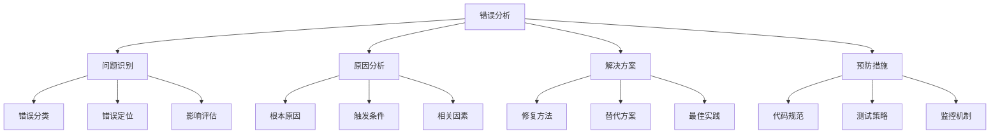

# 常见错误分析

## 🎯 概述

### 1. 错误分析的重要性

**错误分析的意义：**
> **通过系统性地分析AI开发中的常见错误，帮助开发者快速定位问题、提高开发效率、避免重复犯错**

**错误分析的价值：**


### 2. 错误分类体系

**错误分类：**
| 类别 | 子类别 | 典型错误 | 影响程度 |
|------|--------|----------|----------|
| **数据错误** | 数据质量 | 缺失值、异常值 | 高 |
| | 数据格式 | 格式不匹配、编码问题 | 中 |
| | 数据量 | 数据不足、数据倾斜 | 高 |
| **模型错误** | 架构问题 | 层数不当、激活函数错误 | 高 |
| | 参数问题 | 学习率不当、正则化过度 | 中 |
| | 训练问题 | 过拟合、欠拟合 | 高 |
| **代码错误** | 语法错误 | 拼写错误、语法问题 | 低 |
| | 逻辑错误 | 算法实现错误 | 高 |
| | 性能错误 | 内存泄漏、计算效率低 | 中 |

## 🔧 数据相关错误

### 1. 数据质量错误

**常见数据质量错误：**

```python
import numpy as np
import pandas as pd
import matplotlib.pyplot as plt
from sklearn.preprocessing import StandardScaler
from sklearn.model_selection import train_test_split
import warnings
warnings.filterwarnings('ignore')

class DataQualityAnalyzer:
    """数据质量分析器"""
    
    def __init__(self):
        self.quality_issues = []
        self.recommendations = []
    
    def analyze_missing_values(self, data):
        """分析缺失值"""
        print("=== 缺失值分析 ===")
        
        # 计算缺失值
        missing_counts = data.isnull().sum()
        missing_percentages = (missing_counts / len(data)) * 100
        
        # 识别问题
        high_missing_cols = missing_percentages[missing_percentages > 50]
        medium_missing_cols = missing_percentages[(missing_percentages > 10) & (missing_percentages <= 50)]
        
        if len(high_missing_cols) > 0:
            self.quality_issues.append(f"高缺失值列: {list(high_missing_cols.index)}")
            self.recommendations.append("考虑删除缺失值超过50%的列")
        
        if len(medium_missing_cols) > 0:
            self.quality_issues.append(f"中等缺失值列: {list(medium_missing_cols.index)}")
            self.recommendations.append("使用插值或删除策略处理中等缺失值")
        
        # 可视化
        plt.figure(figsize=(12, 6))
        plt.subplot(1, 2, 1)
        missing_percentages[missing_percentages > 0].plot(kind='bar')
        plt.title('缺失值百分比')
        plt.ylabel('缺失值百分比 (%)')
        plt.xticks(rotation=45)
        
        plt.subplot(1, 2, 2)
        plt.hist(missing_percentages[missing_percentages > 0], bins=20)
        plt.title('缺失值分布')
        plt.xlabel('缺失值百分比 (%)')
        plt.ylabel('列数')
        
        plt.tight_layout()
        plt.show()
        
        return missing_counts, missing_percentages
    
    def analyze_outliers(self, data, numerical_cols=None):
        """分析异常值"""
        print("=== 异常值分析 ===")
        
        if numerical_cols is None:
            numerical_cols = data.select_dtypes(include=[np.number]).columns
        
        outlier_info = {}
        
        for col in numerical_cols:
            if col in data.columns:
                # 使用IQR方法检测异常值
                Q1 = data[col].quantile(0.25)
                Q3 = data[col].quantile(0.75)
                IQR = Q3 - Q1
                
                lower_bound = Q1 - 1.5 * IQR
                upper_bound = Q3 + 1.5 * IQR
                
                outliers = data[(data[col] < lower_bound) | (data[col] > upper_bound)]
                outlier_percentage = (len(outliers) / len(data)) * 100
                
                outlier_info[col] = {
                    'count': len(outliers),
                    'percentage': outlier_percentage,
                    'lower_bound': lower_bound,
                    'upper_bound': upper_bound
                }
                
                if outlier_percentage > 10:
                    self.quality_issues.append(f"列 {col} 异常值过多: {outlier_percentage:.2f}%")
                    self.recommendations.append(f"考虑对列 {col} 进行异常值处理")
        
        # 可视化
        n_cols = min(4, len(numerical_cols))
        fig, axes = plt.subplots(2, n_cols, figsize=(15, 8))
        axes = axes.flatten()
        
        for i, col in enumerate(numerical_cols[:n_cols*2]):
            if i < len(axes):
                # 箱线图
                axes[i].boxplot(data[col].dropna())
                axes[i].set_title(f'{col} 箱线图')
                axes[i].set_ylabel('值')
        
        plt.tight_layout()
        plt.show()
        
        return outlier_info
    
    def analyze_data_consistency(self, data):
        """分析数据一致性"""
        print("=== 数据一致性分析 ===")
        
        consistency_issues = []
        
        # 检查数据类型一致性
        for col in data.columns:
            # 检查数值列中的非数值数据
            if data[col].dtype == 'object':
                try:
                    pd.to_numeric(data[col], errors='raise')
                except:
                    non_numeric = data[col][pd.to_numeric(data[col], errors='coerce').isna()]
                    if len(non_numeric) > 0:
                        consistency_issues.append(f"列 {col} 包含非数值数据: {len(non_numeric)} 个")
        
        # 检查重复数据
        duplicates = data.duplicated().sum()
        if duplicates > 0:
            consistency_issues.append(f"重复数据: {duplicates} 行")
            self.recommendations.append("删除重复数据")
        
        # 检查数据范围
        for col in data.select_dtypes(include=[np.number]).columns:
            if data[col].min() < 0 and col.lower() in ['age', 'price', 'score']:
                consistency_issues.append(f"列 {col} 包含负值，可能不合理")
        
        self.quality_issues.extend(consistency_issues)
        
        # 可视化
        plt.figure(figsize=(12, 6))
        
        # 数据类型分布
        plt.subplot(1, 2, 1)
        data_types = data.dtypes.value_counts()
        plt.pie(data_types.values, labels=data_types.index, autopct='%1.1f%%')
        plt.title('数据类型分布')
        
        # 重复数据
        plt.subplot(1, 2, 2)
        plt.bar(['唯一数据', '重复数据'], [len(data) - duplicates, duplicates])
        plt.title('数据唯一性')
        plt.ylabel('行数')
        
        plt.tight_layout()
        plt.show()
        
        return consistency_issues
    
    def analyze_data_balance(self, data, target_col):
        """分析数据平衡性"""
        print("=== 数据平衡性分析 ===")
        
        if target_col not in data.columns:
            print(f"目标列 {target_col} 不存在")
            return
        
        # 计算类别分布
        class_counts = data[target_col].value_counts()
        class_percentages = (class_counts / len(data)) * 100
        
        # 检查数据不平衡
        max_percentage = class_percentages.max()
        min_percentage = class_percentages.min()
        imbalance_ratio = max_percentage / min_percentage
        
        if imbalance_ratio > 10:
            self.quality_issues.append(f"严重数据不平衡: 比例 {imbalance_ratio:.2f}")
            self.recommendations.append("使用过采样或欠采样技术平衡数据")
        elif imbalance_ratio > 3:
            self.quality_issues.append(f"中等数据不平衡: 比例 {imbalance_ratio:.2f}")
            self.recommendations.append("考虑使用平衡采样技术")
        
        # 可视化
        plt.figure(figsize=(12, 6))
        
        plt.subplot(1, 2, 1)
        class_counts.plot(kind='bar')
        plt.title('类别分布')
        plt.ylabel('样本数')
        plt.xticks(rotation=45)
        
        plt.subplot(1, 2, 2)
        plt.pie(class_percentages.values, labels=class_percentages.index, autopct='%1.1f%%')
        plt.title('类别百分比')
        
        plt.tight_layout()
        plt.show()
        
        return class_counts, class_percentages
    
    def generate_quality_report(self, data, target_col=None):
        """生成数据质量报告"""
        print("=== 数据质量报告 ===")
        
        # 基本统计
        print(f"数据集形状: {data.shape}")
        print(f"数据类型: {data.dtypes.value_counts().to_dict()}")
        
        # 分析各项质量指标
        missing_counts, missing_percentages = self.analyze_missing_values(data)
        outlier_info = self.analyze_outliers(data)
        consistency_issues = self.analyze_data_consistency(data)
        
        if target_col:
            class_counts, class_percentages = self.analyze_data_balance(data, target_col)
        
        # 生成报告
        print("\n=== 质量问题和建议 ===")
        for i, issue in enumerate(self.quality_issues, 1):
            print(f"{i}. {issue}")
        
        print("\n=== 改进建议 ===")
        for i, recommendation in enumerate(self.recommendations, 1):
            print(f"{i}. {recommendation}")
        
        # 质量评分
        quality_score = self._calculate_quality_score(data, target_col)
        print(f"\n=== 数据质量评分: {quality_score:.2f}/100 ===")
        
        return {
            'quality_issues': self.quality_issues,
            'recommendations': self.recommendations,
            'quality_score': quality_score
        }
    
    def _calculate_quality_score(self, data, target_col=None):
        """计算数据质量评分"""
        score = 100
        
        # 缺失值扣分
        missing_percentage = (data.isnull().sum().sum() / (data.shape[0] * data.shape[1])) * 100
        score -= min(missing_percentage * 2, 30)
        
        # 重复数据扣分
        duplicates = data.duplicated().sum()
        duplicate_percentage = (duplicates / len(data)) * 100
        score -= min(duplicate_percentage * 5, 20)
        
        # 数据不平衡扣分
        if target_col and target_col in data.columns:
            class_counts = data[target_col].value_counts()
            if len(class_counts) > 1:
                imbalance_ratio = class_counts.max() / class_counts.min()
                if imbalance_ratio > 10:
                    score -= 20
                elif imbalance_ratio > 3:
                    score -= 10
        
        return max(score, 0)

# 测试数据质量分析
def test_data_quality_analysis():
    """测试数据质量分析"""
    # 创建有问题的数据集
    np.random.seed(42)
    n_samples = 1000
    
    # 正常数据
    data = pd.DataFrame({
        'age': np.random.randint(18, 80, n_samples),
        'income': np.random.normal(50000, 15000, n_samples),
        'score': np.random.uniform(0, 100, n_samples),
        'category': np.random.choice(['A', 'B', 'C'], n_samples, p=[0.7, 0.2, 0.1]),
        'text': [f'text_{i}' for i in range(n_samples)]
    })
    
    # 添加问题数据
    # 缺失值
    data.loc[data.sample(100).index, 'age'] = np.nan
    data.loc[data.sample(50).index, 'income'] = np.nan
    
    # 异常值
    data.loc[data.sample(20).index, 'income'] = np.random.normal(200000, 50000, 20)
    data.loc[data.sample(10).index, 'score'] = np.random.uniform(150, 200, 10)
    
    # 重复数据
    data = pd.concat([data, data.sample(50)], ignore_index=True)
    
    # 不一致数据
    data.loc[data.sample(30).index, 'age'] = -5
    
    # 分析数据质量
    analyzer = DataQualityAnalyzer()
    report = analyzer.generate_quality_report(data, target_col='category')
    
    return analyzer, data

test_data_quality_analysis()
```

### 2. 数据格式错误

**常见数据格式错误：**

```python
class DataFormatAnalyzer:
    """数据格式分析器"""
    
    def __init__(self):
        self.format_issues = []
        self.fix_suggestions = []
    
    def analyze_encoding_issues(self, file_path):
        """分析编码问题"""
        print("=== 编码问题分析 ===")
        
        encodings = ['utf-8', 'gbk', 'gb2312', 'latin-1', 'cp1252']
        encoding_results = {}
        
        for encoding in encodings:
            try:
                with open(file_path, 'r', encoding=encoding) as f:
                    content = f.read(1000)  # 只读前1000个字符
                encoding_results[encoding] = {
                    'success': True,
                    'sample': content[:100]
                }
            except Exception as e:
                encoding_results[encoding] = {
                    'success': False,
                    'error': str(e)
                }
        
        # 推荐最佳编码
        best_encoding = None
        for encoding, result in encoding_results.items():
            if result['success']:
                best_encoding = encoding
                break
        
        if best_encoding:
            print(f"推荐编码: {best_encoding}")
            self.fix_suggestions.append(f"使用 {best_encoding} 编码读取文件")
        else:
            print("无法确定合适的编码")
            self.format_issues.append("编码问题: 无法读取文件")
        
        return encoding_results, best_encoding
    
    def analyze_csv_format_issues(self, file_path):
        """分析CSV格式问题"""
        print("=== CSV格式问题分析 ===")
        
        format_issues = []
        
        # 尝试不同的分隔符
        separators = [',', ';', '\t', '|']
        separator_results = {}
        
        for sep in separators:
            try:
                df = pd.read_csv(file_path, sep=sep, nrows=5)
                separator_results[sep] = {
                    'success': True,
                    'columns': len(df.columns),
                    'sample': df.head(2)
                }
            except Exception as e:
                separator_results[sep] = {
                    'success': False,
                    'error': str(e)
                }
        
        # 找到最佳分隔符
        best_separator = None
        max_columns = 0
        
        for sep, result in separator_results.items():
            if result['success'] and result['columns'] > max_columns:
                best_separator = sep
                max_columns = result['columns']
        
        if best_separator:
            print(f"推荐分隔符: '{best_separator}'")
            self.fix_suggestions.append(f"使用分隔符 '{best_separator}' 读取CSV文件")
        else:
            format_issues.append("CSV格式问题: 无法确定分隔符")
        
        # 检查引号问题
        try:
            df_with_quotes = pd.read_csv(file_path, sep=best_separator, quotechar='"')
            df_without_quotes = pd.read_csv(file_path, sep=best_separator, quoting=3)
            
            if len(df_with_quotes.columns) != len(df_without_quotes.columns):
                format_issues.append("引号处理问题: 数据中包含未正确处理的引号")
                self.fix_suggestions.append("检查并处理数据中的引号字符")
        except:
            pass
        
        return separator_results, best_separator
    
    def analyze_datetime_format_issues(self, data, datetime_cols):
        """分析日期时间格式问题"""
        print("=== 日期时间格式问题分析 ===")
        
        datetime_issues = []
        
        for col in datetime_cols:
            if col in data.columns:
                # 尝试不同的日期格式
                date_formats = [
                    '%Y-%m-%d',
                    '%Y/%m/%d',
                    '%d/%m/%Y',
                    '%m/%d/%Y',
                    '%Y-%m-%d %H:%M:%S',
                    '%Y/%m/%d %H:%M:%S',
                    '%d/%m/%Y %H:%M:%S'
                ]
                
                format_results = {}
                
                for fmt in date_formats:
                    try:
                        parsed_dates = pd.to_datetime(data[col], format=fmt, errors='coerce')
                        valid_count = parsed_dates.notna().sum()
                        format_results[fmt] = {
                            'success': True,
                            'valid_count': valid_count,
                            'valid_percentage': (valid_count / len(data)) * 100
                        }
                    except:
                        format_results[fmt] = {
                            'success': False,
                            'valid_count': 0,
                            'valid_percentage': 0
                        }
                
                # 找到最佳格式
                best_format = None
                max_valid = 0
                
                for fmt, result in format_results.items():
                    if result['success'] and result['valid_percentage'] > max_valid:
                        best_format = fmt
                        max_valid = result['valid_percentage']
                
                if best_format and max_valid > 80:
                    print(f"列 {col} 推荐格式: {best_format} (有效率: {max_valid:.1f}%)")
                    self.fix_suggestions.append(f"使用格式 '{best_format}' 解析列 {col}")
                else:
                    datetime_issues.append(f"列 {col} 日期格式无法确定 (最高有效率: {max_valid:.1f}%)")
        
        return datetime_issues
    
    def analyze_numeric_format_issues(self, data, numeric_cols):
        """分析数值格式问题"""
        print("=== 数值格式问题分析 ===")
        
        numeric_issues = []
        
        for col in numeric_cols:
            if col in data.columns:
                # 检查非数值字符
                non_numeric = data[col][pd.to_numeric(data[col], errors='coerce').isna()]
                
                if len(non_numeric) > 0:
                    # 分析非数值字符
                    non_numeric_samples = non_numeric.unique()[:5]
                    numeric_issues.append(f"列 {col} 包含非数值数据: {list(non_numeric_samples)}")
                    
                    # 检查常见问题
                    if any('$' in str(val) for val in non_numeric_samples):
                        self.fix_suggestions.append(f"列 {col} 包含货币符号，需要清理")
                    
                    if any(',' in str(val) for val in non_numeric_samples):
                        self.fix_suggestions.append(f"列 {col} 包含千位分隔符，需要清理")
                    
                    if any('%' in str(val) for val in non_numeric_samples):
                        self.fix_suggestions.append(f"列 {col} 包含百分号，需要转换为小数")
                
                # 检查数据类型
                if data[col].dtype == 'object':
                    numeric_issues.append(f"列 {col} 应该是数值类型但被识别为对象类型")
                    self.fix_suggestions.append(f"将列 {col} 转换为数值类型")
        
        return numeric_issues
    
    def generate_format_report(self, file_path, data=None):
        """生成格式问题报告"""
        print("=== 数据格式问题报告 ===")
        
        # 分析编码问题
        encoding_results, best_encoding = self.analyze_encoding_issues(file_path)
        
        # 分析CSV格式问题
        separator_results, best_separator = self.analyze_csv_format_issues(file_path)
        
        # 如果提供了数据，分析其他格式问题
        if data is not None:
            # 分析日期时间格式
            datetime_cols = [col for col in data.columns if 'date' in col.lower() or 'time' in col.lower()]
            if datetime_cols:
                datetime_issues = self.analyze_datetime_format_issues(data, datetime_cols)
                self.format_issues.extend(datetime_issues)
            
            # 分析数值格式
            numeric_cols = data.select_dtypes(include=['object']).columns
            numeric_issues = self.analyze_numeric_format_issues(data, numeric_cols)
            self.format_issues.extend(numeric_issues)
        
        # 生成报告
        print("\n=== 格式问题和建议 ===")
        for i, issue in enumerate(self.format_issues, 1):
            print(f"{i}. {issue}")
        
        print("\n=== 修复建议 ===")
        for i, suggestion in enumerate(self.fix_suggestions, 1):
            print(f"{i}. {suggestion}")
        
        return {
            'format_issues': self.format_issues,
            'fix_suggestions': self.fix_suggestions,
            'best_encoding': best_encoding,
            'best_separator': best_separator
        }

# 测试数据格式分析
def test_data_format_analysis():
    """测试数据格式分析"""
    # 创建有格式问题的数据
    data = pd.DataFrame({
        'date': ['2023-01-01', '2023/01/02', '01/03/2023', '2023-01-04 10:30:00'],
        'price': ['$100.50', '200,000', '150.75', '300'],
        'score': ['95%', '85.5', '90', 'invalid'],
        'category': ['A', 'B', 'C', 'D']
    })
    
    # 保存到文件
    file_path = 'test_data.csv'
    data.to_csv(file_path, index=False)
    
    # 分析格式问题
    analyzer = DataFormatAnalyzer()
    report = analyzer.generate_format_report(file_path, data)
    
    return analyzer, data

test_data_format_analysis()
```

## 🔧 模型相关错误

### 1. 模型架构错误

**常见模型架构错误：**

```python
import torch
import torch.nn as nn
import torch.nn.functional as F
from torch.utils.data import DataLoader, TensorDataset
import numpy as np
import matplotlib.pyplot as plt

class ModelArchitectureAnalyzer:
    """模型架构分析器"""
    
    def __init__(self):
        self.architecture_issues = []
        self.performance_issues = []
        self.recommendations = []
    
    def analyze_layer_compatibility(self, model, input_shape):
        """分析层兼容性"""
        print("=== 层兼容性分析 ===")
        
        issues = []
        
        # 创建测试输入
        test_input = torch.randn(1, *input_shape)
        
        try:
            # 前向传播测试
            with torch.no_grad():
                output = model(test_input)
            
            print(f"输入形状: {test_input.shape}")
            print(f"输出形状: {output.shape}")
            
            # 检查输出形状
            if output.shape[0] != 1:
                issues.append("批次维度不匹配")
            
            # 检查输出值
            if torch.isnan(output).any():
                issues.append("输出包含NaN值")
                self.performance_issues.append("模型输出包含NaN，可能存在数值不稳定")
            
            if torch.isinf(output).any():
                issues.append("输出包含无穷大值")
                self.performance_issues.append("模型输出包含无穷大值，可能存在数值溢出")
            
        except Exception as e:
            issues.append(f"前向传播失败: {str(e)}")
            self.architecture_issues.append(f"模型架构错误: {str(e)}")
        
        return issues
    
    def analyze_activation_functions(self, model):
        """分析激活函数"""
        print("=== 激活函数分析 ===")
        
        activation_issues = []
        
        # 检查激活函数
        for name, module in model.named_modules():
            if isinstance(module, (nn.ReLU, nn.Sigmoid, nn.Tanh, nn.LeakyReLU)):
                print(f"层 {name} 使用激活函数: {type(module).__name__}")
                
                # 检查激活函数选择
                if isinstance(module, nn.Sigmoid) and 'output' in name.lower():
                    activation_issues.append(f"输出层使用Sigmoid可能导致梯度消失")
                    self.recommendations.append("考虑使用其他激活函数或适当的初始化")
                
                if isinstance(module, nn.ReLU) and 'input' in name.lower():
                    activation_issues.append(f"输入层使用ReLU可能导致死神经元")
                    self.recommendations.append("考虑使用LeakyReLU或适当的初始化")
        
        return activation_issues
    
    def analyze_parameter_initialization(self, model):
        """分析参数初始化"""
        print("=== 参数初始化分析 ===")
        
        init_issues = []
        
        for name, param in model.named_parameters():
            if param.requires_grad:
                # 检查参数值
                param_mean = param.data.mean().item()
                param_std = param.data.std().item()
                param_max = param.data.max().item()
                param_min = param.data.min().item()
                
                print(f"参数 {name}: 均值={param_mean:.4f}, 标准差={param_std:.4f}, 范围=[{param_min:.4f}, {param_max:.4f}]")
                
                # 检查初始化问题
                if param_std < 0.01:
                    init_issues.append(f"参数 {name} 标准差过小，可能导致梯度消失")
                    self.recommendations.append(f"重新初始化参数 {name}")
                
                if param_max > 10 or param_min < -10:
                    init_issues.append(f"参数 {name} 值过大，可能导致数值不稳定")
                    self.recommendations.append(f"使用更小的初始化范围初始化参数 {name}")
                
                # 检查权重共享
                if 'weight' in name and param.data.shape[0] == param.data.shape[1]:
                    if torch.allclose(param.data, param.data.T):
                        init_issues.append(f"参数 {name} 可能被错误地共享")
                        self.recommendations.append(f"检查参数 {name} 的共享设置")
        
        return init_issues
    
    def analyze_gradient_flow(self, model, input_data, target_data):
        """分析梯度流"""
        print("=== 梯度流分析 ===")
        
        gradient_issues = []
        
        # 前向传播
        output = model(input_data)
        loss = F.mse_loss(output, target_data)
        
        # 反向传播
        loss.backward()
        
        # 检查梯度
        for name, param in model.named_parameters():
            if param.grad is not None:
                grad_norm = param.grad.norm().item()
                grad_mean = param.grad.mean().item()
                grad_std = param.grad.std().item()
                
                print(f"参数 {name} 梯度: 范数={grad_norm:.6f}, 均值={grad_mean:.6f}, 标准差={grad_std:.6f}")
                
                # 检查梯度问题
                if grad_norm < 1e-6:
                    gradient_issues.append(f"参数 {name} 梯度过小，可能存在梯度消失")
                    self.performance_issues.append(f"梯度消失问题: {name}")
                    self.recommendations.append(f"检查参数 {name} 的初始化或使用残差连接")
                
                if grad_norm > 100:
                    gradient_issues.append(f"参数 {name} 梯度过大，可能存在梯度爆炸")
                    self.performance_issues.append(f"梯度爆炸问题: {name}")
                    self.recommendations.append(f"使用梯度裁剪或更小的学习率")
                
                if torch.isnan(param.grad).any():
                    gradient_issues.append(f"参数 {name} 梯度包含NaN值")
                    self.performance_issues.append(f"梯度NaN问题: {name}")
                    self.recommendations.append(f"检查损失函数和输入数据")
        
        return gradient_issues
    
    def analyze_model_complexity(self, model, input_shape):
        """分析模型复杂度"""
        print("=== 模型复杂度分析 ===")
        
        complexity_issues = []
        
        # 计算参数数量
        total_params = sum(p.numel() for p in model.parameters())
        trainable_params = sum(p.numel() for p in model.parameters() if p.requires_grad)
        
        print(f"总参数数量: {total_params:,}")
        print(f"可训练参数数量: {trainable_params:,}")
        
        # 计算模型大小
        model_size_mb = total_params * 4 / (1024 * 1024)  # 假设float32
        print(f"模型大小: {model_size_mb:.2f} MB")
        
        # 检查模型复杂度
        if total_params > 1000000:
            complexity_issues.append("模型参数过多，可能存在过拟合风险")
            self.recommendations.append("考虑使用正则化或减少模型复杂度")
        
        if total_params < 1000:
            complexity_issues.append("模型参数过少，可能存在欠拟合风险")
            self.recommendations.append("考虑增加模型复杂度")
        
        # 计算FLOPs (简化版本)
        test_input = torch.randn(1, *input_shape)
        with torch.no_grad():
            output = model(test_input)
        
        # 估算FLOPs
        estimated_flops = total_params * 2  # 简化的估算
        print(f"估算FLOPs: {estimated_flops:,}")
        
        return complexity_issues
    
    def analyze_memory_usage(self, model, input_shape, batch_size=32):
        """分析内存使用"""
        print("=== 内存使用分析 ===")
        
        memory_issues = []
        
        # 计算模型内存
        model_memory = sum(p.numel() * p.element_size() for p in model.parameters())
        model_memory_mb = model_memory / (1024 * 1024)
        
        print(f"模型内存: {model_memory_mb:.2f} MB")
        
        # 估算训练内存
        test_input = torch.randn(batch_size, *input_shape)
        test_output = model(test_input)
        
        input_memory = test_input.numel() * test_input.element_size()
        output_memory = test_output.numel() * test_output.element_size()
        
        # 估算梯度内存
        gradient_memory = model_memory  # 梯度通常与参数大小相同
        
        total_training_memory = model_memory + input_memory + output_memory + gradient_memory
        total_training_memory_mb = total_training_memory / (1024 * 1024)
        
        print(f"训练内存估算: {total_training_memory_mb:.2f} MB")
        
        # 检查内存问题
        if total_training_memory_mb > 8000:  # 8GB
            memory_issues.append("训练内存需求过高，可能导致OOM错误")
            self.recommendations.append("考虑使用梯度累积或减少批次大小")
        
        return memory_issues
    
    def generate_architecture_report(self, model, input_shape, input_data=None, target_data=None):
        """生成架构分析报告"""
        print("=== 模型架构分析报告 ===")
        
        # 分析各项指标
        layer_issues = self.analyze_layer_compatibility(model, input_shape)
        activation_issues = self.analyze_activation_functions(model)
        init_issues = self.analyze_parameter_initialization(model)
        complexity_issues = self.analyze_model_complexity(model, input_shape)
        memory_issues = self.analyze_memory_usage(model, input_shape)
        
        # 如果有数据，分析梯度流
        gradient_issues = []
        if input_data is not None and target_data is not None:
            gradient_issues = self.analyze_gradient_flow(model, input_data, target_data)
        
        # 汇总问题
        all_issues = layer_issues + activation_issues + init_issues + complexity_issues + memory_issues + gradient_issues
        self.architecture_issues.extend(all_issues)
        
        # 生成报告
        print("\n=== 架构问题和建议 ===")
        for i, issue in enumerate(self.architecture_issues, 1):
            print(f"{i}. {issue}")
        
        print("\n=== 性能问题和建议 ===")
        for i, issue in enumerate(self.performance_issues, 1):
            print(f"{i}. {issue}")
        
        print("\n=== 改进建议 ===")
        for i, recommendation in enumerate(self.recommendations, 1):
            print(f"{i}. {recommendation}")
        
        return {
            'architecture_issues': self.architecture_issues,
            'performance_issues': self.performance_issues,
            'recommendations': self.recommendations
        }

# 测试模型架构分析
def test_model_architecture_analysis():
    """测试模型架构分析"""
    # 创建有问题的模型
    class ProblematicModel(nn.Module):
        def __init__(self):
            super().__init__()
            self.fc1 = nn.Linear(784, 128)
            self.fc2 = nn.Linear(128, 64)
            self.fc3 = nn.Linear(64, 10)
            self.sigmoid = nn.Sigmoid()
        
        def forward(self, x):
            x = x.view(x.size(0), -1)
            x = self.sigmoid(self.fc1(x))
            x = self.sigmoid(self.fc2(x))
            x = self.sigmoid(self.fc3(x))
            return x
    
    # 创建模型
    model = ProblematicModel()
    
    # 创建测试数据
    input_shape = (784,)
    input_data = torch.randn(32, 784)
    target_data = torch.randn(32, 10)
    
    # 分析模型架构
    analyzer = ModelArchitectureAnalyzer()
    report = analyzer.generate_architecture_report(model, input_shape, input_data, target_data)
    
    return analyzer, model

test_model_architecture_analysis()
```

## 🔗 相关链接
- [[06-02-调试技巧总结]] - 调试技巧
- [[06-03-性能瓶颈诊断]] - 性能诊断
- [[06-04-数据质量问题]] - 数据质量

## 💡 错误分析建议

**分析策略：**
- 🎯 **系统化分析**：建立完整的错误分析体系
- 📊 **分类管理**：按类型和严重程度分类错误
- 🔍 **根本原因**：深入分析错误的根本原因
- ⚡ **预防措施**：建立错误预防机制

**实践建议：**
- 📝 **记录错误**：建立错误记录和跟踪系统
- 💻 **自动化检测**：使用工具自动检测常见错误
- 📊 **定期审查**：定期审查和更新错误分析
- 🔍 **知识分享**：分享错误分析经验和解决方案

---
*📝 学习提示：错误分析是提高开发效率的关键，建议建立系统化的错误分析和预防机制*

