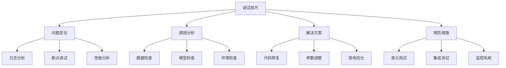

# 调试技巧总结

## 🎯 概述

### 1. 调试的重要性

**调试的意义：**
> **调试是AI开发中的核心技能，通过系统性的调试方法快速定位和解决问题，提高开发效率和代码质量**

**调试的价值：**


### 2. 调试方法论

**调试方法论：**
| 方法 | 适用场景 | 优势 | 局限性 |
|------|----------|------|--------|
| **日志调试** | 生产环境、复杂流程 | 非侵入性、历史记录 | 信息量大、分析复杂 |
| **断点调试** | 开发环境、逻辑错误 | 精确控制、实时观察 | 需要调试器、影响性能 |
| **单元测试** | 函数级别、回归测试 | 快速反馈、自动化 | 需要编写测试用例 |
| **性能分析** | 性能问题、资源使用 | 详细指标、瓶颈识别 | 需要专业工具 |

## 🔧 日志调试技巧

### 1. 结构化日志

**结构化日志实现：**

```python
import logging
import json
import time
import functools
from datetime import datetime
import traceback
import sys
import os

class StructuredLogger:
    """结构化日志记录器"""
    
    def __init__(self, name='AI_Logger', level=logging.INFO):
        self.logger = logging.getLogger(name)
        self.logger.setLevel(level)
        
        # 避免重复添加处理器
        if not self.logger.handlers:
            # 控制台处理器
            console_handler = logging.StreamHandler()
            console_handler.setLevel(level)
            
            # 文件处理器
            file_handler = logging.FileHandler('ai_debug.log')
            file_handler.setLevel(level)
            
            # 设置格式
            formatter = logging.Formatter(
                '%(asctime)s - %(name)s - %(levelname)s - %(message)s'
            )
            console_handler.setFormatter(formatter)
            file_handler.setFormatter(formatter)
            
            self.logger.addHandler(console_handler)
            self.logger.addHandler(file_handler)
    
    def log_data_info(self, data_name, data_shape, data_type, data_stats=None):
        """记录数据信息"""
        log_data = {
            'event': 'data_info',
            'data_name': data_name,
            'shape': data_shape,
            'dtype': str(data_type),
            'stats': data_stats,
            'timestamp': datetime.now().isoformat()
        }
        self.logger.info(json.dumps(log_data, default=str))
    
    def log_model_info(self, model_name, model_params, model_size_mb):
        """记录模型信息"""
        log_data = {
            'event': 'model_info',
            'model_name': model_name,
            'parameters': model_params,
            'size_mb': model_size_mb,
            'timestamp': datetime.now().isoformat()
        }
        self.logger.info(json.dumps(log_data, default=str))
    
    def log_training_step(self, epoch, step, loss, accuracy, learning_rate):
        """记录训练步骤"""
        log_data = {
            'event': 'training_step',
            'epoch': epoch,
            'step': step,
            'loss': float(loss),
            'accuracy': float(accuracy),
            'learning_rate': float(learning_rate),
            'timestamp': datetime.now().isoformat()
        }
        self.logger.info(json.dumps(log_data, default=str))
    
    def log_error(self, error_type, error_message, stack_trace=None, context=None):
        """记录错误信息"""
        log_data = {
            'event': 'error',
            'error_type': error_type,
            'error_message': error_message,
            'stack_trace': stack_trace,
            'context': context,
            'timestamp': datetime.now().isoformat()
        }
        self.logger.error(json.dumps(log_data, default=str))
    
    def log_performance(self, operation, duration, memory_usage, cpu_usage):
        """记录性能信息"""
        log_data = {
            'event': 'performance',
            'operation': operation,
            'duration_ms': duration,
            'memory_mb': memory_usage,
            'cpu_percent': cpu_usage,
            'timestamp': datetime.now().isoformat()
        }
        self.logger.info(json.dumps(log_data, default=str))

# 装饰器用于自动记录函数执行
def log_function_execution(logger):
    """函数执行日志装饰器"""
    def decorator(func):
        @functools.wraps(func)
        def wrapper(*args, **kwargs):
            start_time = time.time()
            logger.logger.info(f"开始执行函数: {func.__name__}")
            
            try:
                result = func(*args, **kwargs)
                end_time = time.time()
                duration = (end_time - start_time) * 1000
                
                logger.logger.info(f"函数 {func.__name__} 执行成功，耗时: {duration:.2f}ms")
                return result
            except Exception as e:
                end_time = time.time()
                duration = (end_time - start_time) * 1000
                
                logger.log_error(
                    error_type=type(e).__name__,
                    error_message=str(e),
                    stack_trace=traceback.format_exc(),
                    context={'function': func.__name__, 'duration_ms': duration}
                )
                raise
        return wrapper
    return decorator

# 测试结构化日志
def test_structured_logging():
    """测试结构化日志"""
    logger = StructuredLogger('TestLogger')
    
    # 记录数据信息
    logger.log_data_info('training_data', (1000, 784), 'float32', {'mean': 0.5, 'std': 0.2})
    
    # 记录模型信息
    logger.log_model_info('MLP', 1000000, 4.0)
    
    # 记录训练步骤
    logger.log_training_step(1, 100, 0.5, 0.85, 0.001)
    
    # 记录性能信息
    logger.log_performance('forward_pass', 50.5, 512, 25.0)
    
    # 测试装饰器
    @log_function_execution(logger)
    def test_function():
        time.sleep(0.1)
        return "success"
    
    result = test_function()
    print(f"函数执行结果: {result}")

test_structured_logging()
```

### 2. 日志分析工具

**日志分析工具实现：**

```python
import pandas as pd
import matplotlib.pyplot as plt
import seaborn as sns
from collections import defaultdict
import re
import json

class LogAnalyzer:
    """日志分析器"""
    
    def __init__(self, log_file='ai_debug.log'):
        self.log_file = log_file
        self.log_data = []
        self.parsed_logs = []
    
    def parse_log_file(self):
        """解析日志文件"""
        print("=== 解析日志文件 ===")
        
        with open(self.log_file, 'r', encoding='utf-8') as f:
            for line in f:
                self.log_data.append(line.strip())
        
        # 解析结构化日志
        for line in self.log_data:
            try:
                # 提取JSON部分
                json_match = re.search(r'\{.*\}', line)
                if json_match:
                    log_entry = json.loads(json_match.group())
                    log_entry['raw_line'] = line
                    self.parsed_logs.append(log_entry)
            except:
                # 如果不是JSON格式，解析传统日志
                parts = line.split(' - ')
                if len(parts) >= 4:
                    log_entry = {
                        'timestamp': parts[0],
                        'logger': parts[1],
                        'level': parts[2],
                        'message': ' - '.join(parts[3:]),
                        'raw_line': line
                    }
                    self.parsed_logs.append(log_entry)
        
        print(f"解析了 {len(self.parsed_logs)} 条日志记录")
        return self.parsed_logs
    
    def analyze_error_patterns(self):
        """分析错误模式"""
        print("=== 错误模式分析 ===")
        
        error_logs = [log for log in self.parsed_logs if log.get('level') == 'ERROR' or log.get('event') == 'error']
        
        if not error_logs:
            print("没有找到错误日志")
            return
        
        # 错误类型统计
        error_types = defaultdict(int)
        error_messages = defaultdict(int)
        
        for log in error_logs:
            if 'error_type' in log:
                error_types[log['error_type']] += 1
            if 'error_message' in log:
                error_messages[log['error_message']] += 1
        
        # 可视化错误分析
        plt.figure(figsize=(15, 10))
        
        # 错误类型分布
        plt.subplot(2, 3, 1)
        if error_types:
            plt.bar(error_types.keys(), error_types.values())
            plt.title('错误类型分布')
            plt.xlabel('错误类型')
            plt.ylabel('次数')
            plt.xticks(rotation=45)
        
        # 错误消息频率
        plt.subplot(2, 3, 2)
        if error_messages:
            top_errors = dict(sorted(error_messages.items(), key=lambda x: x[1], reverse=True)[:10])
            plt.barh(range(len(top_errors)), list(top_errors.values()))
            plt.yticks(range(len(top_errors)), list(top_errors.keys()))
            plt.title('Top 10 错误消息')
            plt.xlabel('次数')
        
        # 错误时间分布
        plt.subplot(2, 3, 3)
        error_times = []
        for log in error_logs:
            if 'timestamp' in log:
                try:
                    time_obj = pd.to_datetime(log['timestamp'])
                    error_times.append(time_obj)
                except:
                    pass
        
        if error_times:
            plt.hist(error_times, bins=20)
            plt.title('错误时间分布')
            plt.xlabel('时间')
            plt.ylabel('错误次数')
            plt.xticks(rotation=45)
        
        plt.tight_layout()
        plt.show()
        
        return error_types, error_messages
    
    def analyze_performance_trends(self):
        """分析性能趋势"""
        print("=== 性能趋势分析 ===")
        
        performance_logs = [log for log in self.parsed_logs if log.get('event') == 'performance']
        
        if not performance_logs:
            print("没有找到性能日志")
            return
        
        # 转换为DataFrame
        perf_data = []
        for log in performance_logs:
            perf_data.append({
                'timestamp': log.get('timestamp'),
                'operation': log.get('operation'),
                'duration_ms': log.get('duration_ms'),
                'memory_mb': log.get('memory_mb'),
                'cpu_percent': log.get('cpu_percent')
            })
        
        df = pd.DataFrame(perf_data)
        
        if df.empty:
            print("性能数据为空")
            return
        
        # 可视化性能分析
        plt.figure(figsize=(15, 10))
        
        # 操作耗时分布
        plt.subplot(2, 3, 1)
        if 'duration_ms' in df.columns:
            plt.hist(df['duration_ms'], bins=20)
            plt.title('操作耗时分布')
            plt.xlabel('耗时 (ms)')
            plt.ylabel('次数')
        
        # 内存使用分布
        plt.subplot(2, 3, 2)
        if 'memory_mb' in df.columns:
            plt.hist(df['memory_mb'], bins=20)
            plt.title('内存使用分布')
            plt.xlabel('内存 (MB)')
            plt.ylabel('次数')
        
        # CPU使用分布
        plt.subplot(2, 3, 3)
        if 'cpu_percent' in df.columns:
            plt.hist(df['cpu_percent'], bins=20)
            plt.title('CPU使用分布')
            plt.xlabel('CPU (%)')
            plt.ylabel('次数')
        
        # 操作类型耗时对比
        plt.subplot(2, 3, 4)
        if 'operation' in df.columns and 'duration_ms' in df.columns:
            operation_duration = df.groupby('operation')['duration_ms'].mean()
            plt.bar(operation_duration.index, operation_duration.values)
            plt.title('各操作平均耗时')
            plt.xlabel('操作类型')
            plt.ylabel('平均耗时 (ms)')
            plt.xticks(rotation=45)
        
        # 性能趋势
        plt.subplot(2, 3, 5)
        if 'timestamp' in df.columns and 'duration_ms' in df.columns:
            df['timestamp'] = pd.to_datetime(df['timestamp'])
            df_sorted = df.sort_values('timestamp')
            plt.plot(df_sorted['timestamp'], df_sorted['duration_ms'])
            plt.title('性能趋势')
            plt.xlabel('时间')
            plt.ylabel('耗时 (ms)')
            plt.xticks(rotation=45)
        
        # 性能统计
        plt.subplot(2, 3, 6)
        plt.axis('off')
        stats_text = f"""
        性能统计:
        
        总操作数: {len(df)}
        平均耗时: {df['duration_ms'].mean():.2f} ms
        最大耗时: {df['duration_ms'].max():.2f} ms
        最小耗时: {df['duration_ms'].min():.2f} ms
        
        平均内存: {df['memory_mb'].mean():.2f} MB
        最大内存: {df['memory_mb'].max():.2f} MB
        
        平均CPU: {df['cpu_percent'].mean():.2f} %
        最大CPU: {df['cpu_percent'].max():.2f} %
        """
        plt.text(0.1, 0.9, stats_text, transform=plt.gca().transAxes, fontsize=10, verticalalignment='top')
        
        plt.tight_layout()
        plt.show()
        
        return df
    
    def analyze_training_progress(self):
        """分析训练进度"""
        print("=== 训练进度分析 ===")
        
        training_logs = [log for log in self.parsed_logs if log.get('event') == 'training_step']
        
        if not training_logs:
            print("没有找到训练日志")
            return
        
        # 转换为DataFrame
        train_data = []
        for log in training_logs:
            train_data.append({
                'timestamp': log.get('timestamp'),
                'epoch': log.get('epoch'),
                'step': log.get('step'),
                'loss': log.get('loss'),
                'accuracy': log.get('accuracy'),
                'learning_rate': log.get('learning_rate')
            })
        
        df = pd.DataFrame(train_data)
        
        if df.empty:
            print("训练数据为空")
            return
        
        # 可视化训练分析
        plt.figure(figsize=(15, 10))
        
        # 损失曲线
        plt.subplot(2, 3, 1)
        plt.plot(df['step'], df['loss'])
        plt.title('训练损失曲线')
        plt.xlabel('步数')
        plt.ylabel('损失')
        plt.grid(True)
        
        # 准确率曲线
        plt.subplot(2, 3, 2)
        plt.plot(df['step'], df['accuracy'])
        plt.title('训练准确率曲线')
        plt.xlabel('步数')
        plt.ylabel('准确率')
        plt.grid(True)
        
        # 学习率曲线
        plt.subplot(2, 3, 3)
        plt.plot(df['step'], df['learning_rate'])
        plt.title('学习率曲线')
        plt.xlabel('步数')
        plt.ylabel('学习率')
        plt.grid(True)
        
        # 损失-准确率关系
        plt.subplot(2, 3, 4)
        plt.scatter(df['loss'], df['accuracy'], alpha=0.6)
        plt.title('损失-准确率关系')
        plt.xlabel('损失')
        plt.ylabel('准确率')
        plt.grid(True)
        
        # 按epoch分组
        plt.subplot(2, 3, 5)
        epoch_stats = df.groupby('epoch').agg({
            'loss': ['mean', 'min', 'max'],
            'accuracy': ['mean', 'min', 'max']
        }).round(4)
        
        plt.plot(epoch_stats.index, epoch_stats[('loss', 'mean')], label='平均损失')
        plt.plot(epoch_stats.index, epoch_stats[('accuracy', 'mean')], label='平均准确率')
        plt.title('按Epoch统计')
        plt.xlabel('Epoch')
        plt.ylabel('值')
        plt.legend()
        plt.grid(True)
        
        # 训练统计
        plt.subplot(2, 3, 6)
        plt.axis('off')
        stats_text = f"""
        训练统计:
        
        总步数: {len(df)}
        总Epoch: {df['epoch'].max()}
        
        最终损失: {df['loss'].iloc[-1]:.4f}
        最终准确率: {df['accuracy'].iloc[-1]:.4f}
        
        最小损失: {df['loss'].min():.4f}
        最大准确率: {df['accuracy'].max():.4f}
        
        平均学习率: {df['learning_rate'].mean():.6f}
        """
        plt.text(0.1, 0.9, stats_text, transform=plt.gca().transAxes, fontsize=10, verticalalignment='top')
        
        plt.tight_layout()
        plt.show()
        
        return df
    
    def generate_debug_report(self):
        """生成调试报告"""
        print("=== 生成调试报告 ===")
        
        # 解析日志
        self.parse_log_file()
        
        # 分析各项指标
        error_analysis = self.analyze_error_patterns()
        performance_analysis = self.analyze_performance_trends()
        training_analysis = self.analyze_training_progress()
        
        # 生成总结报告
        print("\n=== 调试报告总结 ===")
        print(f"总日志条数: {len(self.parsed_logs)}")
        print(f"错误日志条数: {len([log for log in self.parsed_logs if log.get('level') == 'ERROR' or log.get('event') == 'error'])}")
        print(f"性能日志条数: {len([log for log in self.parsed_logs if log.get('event') == 'performance'])}")
        print(f"训练日志条数: {len([log for log in self.parsed_logs if log.get('event') == 'training_step'])}")
        
        return {
            'total_logs': len(self.parsed_logs),
            'error_analysis': error_analysis,
            'performance_analysis': performance_analysis,
            'training_analysis': training_analysis
        }

# 测试日志分析
def test_log_analysis():
    """测试日志分析"""
    # 创建测试日志文件
    logger = StructuredLogger('TestLogger')
    
    # 生成一些测试日志
    for i in range(100):
        logger.log_training_step(i//10, i, 1.0 - i*0.01, 0.5 + i*0.005, 0.001)
        logger.log_performance('forward_pass', 50 + i*0.1, 512, 25.0)
    
    # 生成一些错误日志
    logger.log_error('ValueError', 'Invalid input shape', context={'step': 50})
    logger.log_error('RuntimeError', 'CUDA out of memory', context={'step': 75})
    
    # 分析日志
    analyzer = LogAnalyzer('ai_debug.log')
    report = analyzer.generate_debug_report()
    
    return analyzer, report

test_log_analysis()
```

## 🔧 断点调试技巧

### 1. 智能断点设置

**智能断点设置实现：**

```python
import pdb
import sys
import traceback
from functools import wraps
import inspect

class SmartDebugger:
    """智能调试器"""
    
    def __init__(self):
        self.breakpoints = {}
        self.watchpoints = {}
        self.conditions = {}
    
    def set_conditional_breakpoint(self, func_name, condition, description=""):
        """设置条件断点"""
        if func_name not in self.breakpoints:
            self.breakpoints[func_name] = []
        
        self.breakpoints[func_name].append({
            'condition': condition,
            'description': description,
            'hit_count': 0
        })
        
        print(f"设置条件断点: {func_name} - {description}")
    
    def set_watchpoint(self, var_name, condition, description=""):
        """设置监视点"""
        self.watchpoints[var_name] = {
            'condition': condition,
            'description': description,
            'hit_count': 0
        }
        
        print(f"设置监视点: {var_name} - {description}")
    
    def debug_decorator(self, func):
        """调试装饰器"""
        @wraps(func)
        def wrapper(*args, **kwargs):
            func_name = func.__name__
            
            # 检查是否有断点
            if func_name in self.breakpoints:
                for bp in self.breakpoints[func_name]:
                    try:
                        if bp['condition'](*args, **kwargs):
                            bp['hit_count'] += 1
                            print(f"断点触发: {func_name} - {bp['description']}")
                            print(f"参数: args={args}, kwargs={kwargs}")
                            
                            # 进入调试器
                            pdb.set_trace()
                    except Exception as e:
                        print(f"断点条件执行错误: {e}")
            
            # 执行函数
            try:
                result = func(*args, **kwargs)
                
                # 检查监视点
                self._check_watchpoints(locals(), globals())
                
                return result
            except Exception as e:
                print(f"函数执行错误: {func_name}")
                print(f"错误信息: {e}")
                traceback.print_exc()
                pdb.set_trace()
                raise
        
        return wrapper
    
    def _check_watchpoints(self, local_vars, global_vars):
        """检查监视点"""
        for var_name, wp in self.watchpoints.items():
            if var_name in local_vars:
                var_value = local_vars[var_name]
                try:
                    if wp['condition'](var_value):
                        wp['hit_count'] += 1
                        print(f"监视点触发: {var_name} - {wp['description']}")
                        print(f"变量值: {var_value}")
                        pdb.set_trace()
                except Exception as e:
                    print(f"监视点条件执行错误: {e}")
    
    def print_breakpoint_stats(self):
        """打印断点统计"""
        print("=== 断点统计 ===")
        for func_name, bps in self.breakpoints.items():
            print(f"函数: {func_name}")
            for bp in bps:
                print(f"  - {bp['description']}: 触发 {bp['hit_count']} 次")
        
        print("\n=== 监视点统计 ===")
        for var_name, wp in self.watchpoints.items():
            print(f"变量: {var_name} - {wp['description']}: 触发 {wp['hit_count']} 次")

# 测试智能调试器
def test_smart_debugger():
    """测试智能调试器"""
    debugger = SmartDebugger()
    
    # 设置条件断点
    debugger.set_conditional_breakpoint(
        'test_function',
        lambda *args, **kwargs: len(args) > 2,
        "参数数量大于2"
    )
    
    debugger.set_conditional_breakpoint(
        'test_function',
        lambda *args, **kwargs: any(isinstance(arg, str) and len(arg) > 10 for arg in args),
        "包含长度大于10的字符串参数"
    )
    
    # 设置监视点
    debugger.set_watchpoint(
        'result',
        lambda value: isinstance(value, (int, float)) and value > 100,
        "结果值大于100"
    )
    
    # 测试函数
    @debugger.debug_decorator
    def test_function(a, b, c="default"):
        result = a + b + len(c)
        return result
    
    # 测试调用
    print("测试调用1:")
    result1 = test_function(1, 2, "short")
    print(f"结果1: {result1}")
    
    print("\n测试调用2:")
    result2 = test_function(1, 2, "very long string")
    print(f"结果2: {result2}")
    
    print("\n测试调用3:")
    result3 = test_function(1, 2, 3, 4, 5)
    print(f"结果3: {result3}")
    
    # 打印统计
    debugger.print_breakpoint_stats()

test_smart_debugger()
```

### 2. 动态调试工具

**动态调试工具实现：**

```python
import torch
import numpy as np
import matplotlib.pyplot as plt
from collections import defaultdict
import time

class DynamicDebugger:
    """动态调试器"""
    
    def __init__(self):
        self.tensor_history = defaultdict(list)
        self.gradient_history = defaultdict(list)
        self.activation_history = defaultdict(list)
        self.performance_history = defaultdict(list)
    
    def track_tensor(self, tensor, name, step=None):
        """跟踪张量"""
        if step is None:
            step = len(self.tensor_history[name])
        
        tensor_info = {
            'step': step,
            'shape': tensor.shape,
            'dtype': tensor.dtype,
            'device': tensor.device,
            'mean': tensor.mean().item(),
            'std': tensor.std().item(),
            'min': tensor.min().item(),
            'max': tensor.max().item(),
            'nan_count': torch.isnan(tensor).sum().item(),
            'inf_count': torch.isinf(tensor).sum().item()
        }
        
        self.tensor_history[name].append(tensor_info)
        
        # 检查异常值
        if tensor_info['nan_count'] > 0:
            print(f"警告: 张量 {name} 包含 {tensor_info['nan_count']} 个NaN值")
        
        if tensor_info['inf_count'] > 0:
            print(f"警告: 张量 {name} 包含 {tensor_info['inf_count']} 个无穷大值")
        
        if tensor_info['std'] < 1e-6:
            print(f"警告: 张量 {name} 标准差过小: {tensor_info['std']}")
    
    def track_gradients(self, model, step=None):
        """跟踪梯度"""
        if step is None:
            step = len(self.gradient_history['total_norm'])
        
        total_norm = 0
        param_count = 0
        
        for name, param in model.named_parameters():
            if param.grad is not None:
                param_norm = param.grad.data.norm(2)
                total_norm += param_norm.item() ** 2
                param_count += 1
                
                grad_info = {
                    'step': step,
                    'param_name': name,
                    'norm': param_norm.item(),
                    'mean': param.grad.data.mean().item(),
                    'std': param.grad.data.std().item()
                }
                
                self.gradient_history[name].append(grad_info)
        
        total_norm = total_norm ** (1. / 2)
        self.gradient_history['total_norm'].append({
            'step': step,
            'norm': total_norm,
            'param_count': param_count
        })
        
        # 检查梯度问题
        if total_norm > 100:
            print(f"警告: 梯度范数过大: {total_norm}")
        elif total_norm < 1e-6:
            print(f"警告: 梯度范数过小: {total_norm}")
    
    def track_activations(self, model, input_data, step=None):
        """跟踪激活值"""
        if step is None:
            step = len(self.activation_history['input'])
        
        # 跟踪输入
        self.track_tensor(input_data, 'input', step)
        
        # 前向传播并跟踪中间激活
        activations = {}
        def hook_fn(name):
            def hook(module, input, output):
                if isinstance(output, torch.Tensor):
                    activations[name] = output.detach()
            return hook
        
        hooks = []
        for name, module in model.named_modules():
            if len(list(module.children())) == 0:  # 叶子模块
                hook = module.register_forward_hook(hook_fn(name))
                hooks.append(hook)
        
        # 执行前向传播
        with torch.no_grad():
            output = model(input_data)
        
        # 移除钩子
        for hook in hooks:
            hook.remove()
        
        # 记录激活值
        for name, activation in activations.items():
            self.track_tensor(activation, f'activation_{name}', step)
        
        # 跟踪输出
        self.track_tensor(output, 'output', step)
    
    def track_performance(self, operation_name, start_time, end_time, memory_usage=None):
        """跟踪性能"""
        duration = (end_time - start_time) * 1000  # 转换为毫秒
        
        perf_info = {
            'operation': operation_name,
            'duration_ms': duration,
            'memory_mb': memory_usage,
            'timestamp': time.time()
        }
        
        self.performance_history[operation_name].append(perf_info)
        
        # 检查性能问题
        if duration > 1000:  # 超过1秒
            print(f"警告: 操作 {operation_name} 耗时过长: {duration:.2f}ms")
    
    def visualize_tensor_history(self, tensor_name):
        """可视化张量历史"""
        if tensor_name not in self.tensor_history:
            print(f"没有找到张量 {tensor_name} 的历史记录")
            return
        
        history = self.tensor_history[tensor_name]
        
        plt.figure(figsize=(15, 10))
        
        # 均值和标准差
        plt.subplot(2, 3, 1)
        steps = [h['step'] for h in history]
        means = [h['mean'] for h in history]
        stds = [h['std'] for h in history]
        
        plt.plot(steps, means, label='均值')
        plt.plot(steps, stds, label='标准差')
        plt.title(f'{tensor_name} 统计信息')
        plt.xlabel('步数')
        plt.ylabel('值')
        plt.legend()
        plt.grid(True)
        
        # 最小值和最大值
        plt.subplot(2, 3, 2)
        mins = [h['min'] for h in history]
        maxs = [h['max'] for h in history]
        
        plt.plot(steps, mins, label='最小值')
        plt.plot(steps, maxs, label='最大值')
        plt.title(f'{tensor_name} 范围')
        plt.xlabel('步数')
        plt.ylabel('值')
        plt.legend()
        plt.grid(True)
        
        # NaN和Inf计数
        plt.subplot(2, 3, 3)
        nan_counts = [h['nan_count'] for h in history]
        inf_counts = [h['inf_count'] for h in history]
        
        plt.plot(steps, nan_counts, label='NaN计数')
        plt.plot(steps, inf_counts, label='Inf计数')
        plt.title(f'{tensor_name} 异常值')
        plt.xlabel('步数')
        plt.ylabel('计数')
        plt.legend()
        plt.grid(True)
        
        # 形状变化
        plt.subplot(2, 3, 4)
        shapes = [str(h['shape']) for h in history]
        unique_shapes = list(set(shapes))
        shape_counts = [shapes.count(shape) for shape in unique_shapes]
        
        plt.bar(range(len(unique_shapes)), shape_counts)
        plt.title(f'{tensor_name} 形状分布')
        plt.xlabel('形状')
        plt.ylabel('出现次数')
        plt.xticks(range(len(unique_shapes)), unique_shapes, rotation=45)
        
        # 设备信息
        plt.subplot(2, 3, 5)
        devices = [h['device'] for h in history]
        device_counts = {}
        for device in devices:
            device_counts[device] = device_counts.get(device, 0) + 1
        
        plt.bar(device_counts.keys(), device_counts.values())
        plt.title(f'{tensor_name} 设备分布')
        plt.xlabel('设备')
        plt.ylabel('次数')
        
        # 统计总结
        plt.subplot(2, 3, 6)
        plt.axis('off')
        stats_text = f"""
        {tensor_name} 统计总结:
        
        总记录数: {len(history)}
        平均均值: {np.mean(means):.4f}
        平均标准差: {np.mean(stds):.4f}
        
        最小均值: {min(means):.4f}
        最大均值: {max(means):.4f}
        
        总NaN数: {sum(nan_counts)}
        总Inf数: {sum(inf_counts)}
        
        形状变化: {len(unique_shapes)} 种
        """
        plt.text(0.1, 0.9, stats_text, transform=plt.gca().transAxes, fontsize=10, verticalalignment='top')
        
        plt.tight_layout()
        plt.show()
    
    def visualize_gradient_history(self):
        """可视化梯度历史"""
        if not self.gradient_history:
            print("没有梯度历史记录")
            return
        
        plt.figure(figsize=(15, 10))
        
        # 总梯度范数
        plt.subplot(2, 3, 1)
        if 'total_norm' in self.gradient_history:
            history = self.gradient_history['total_norm']
            steps = [h['step'] for h in history]
            norms = [h['norm'] for h in history]
            
            plt.plot(steps, norms)
            plt.title('总梯度范数')
            plt.xlabel('步数')
            plt.ylabel('梯度范数')
            plt.grid(True)
        
        # 各参数梯度范数
        plt.subplot(2, 3, 2)
        param_names = [name for name in self.gradient_history.keys() if name != 'total_norm']
        
        for name in param_names[:5]:  # 只显示前5个参数
            history = self.gradient_history[name]
            steps = [h['step'] for h in history]
            norms = [h['norm'] for h in history]
            
            plt.plot(steps, norms, label=name)
        
        plt.title('各参数梯度范数')
        plt.xlabel('步数')
        plt.ylabel('梯度范数')
        plt.legend()
        plt.grid(True)
        
        # 梯度统计
        plt.subplot(2, 3, 3)
        if 'total_norm' in self.gradient_history:
            history = self.gradient_history['total_norm']
            norms = [h['norm'] for h in history]
            
            plt.hist(norms, bins=20)
            plt.title('梯度范数分布')
            plt.xlabel('梯度范数')
            plt.ylabel('频率')
        
        plt.tight_layout()
        plt.show()
    
    def generate_debug_report(self):
        """生成调试报告"""
        print("=== 动态调试报告 ===")
        
        print(f"跟踪的张量数量: {len(self.tensor_history)}")
        print(f"跟踪的梯度参数数量: {len(self.gradient_history)}")
        print(f"跟踪的性能操作数量: {len(self.performance_history)}")
        
        # 检查问题
        issues = []
        
        # 检查张量问题
        for name, history in self.tensor_history.items():
            for h in history:
                if h['nan_count'] > 0:
                    issues.append(f"张量 {name} 包含NaN值")
                if h['inf_count'] > 0:
                    issues.append(f"张量 {name} 包含无穷大值")
                if h['std'] < 1e-6:
                    issues.append(f"张量 {name} 标准差过小")
        
        # 检查梯度问题
        if 'total_norm' in self.gradient_history:
            history = self.gradient_history['total_norm']
            for h in history:
                if h['norm'] > 100:
                    issues.append("梯度范数过大")
                elif h['norm'] < 1e-6:
                    issues.append("梯度范数过小")
        
        # 检查性能问题
        for op_name, history in self.performance_history.items():
            for h in history:
                if h['duration_ms'] > 1000:
                    issues.append(f"操作 {op_name} 耗时过长")
        
        print(f"\n发现的问题数量: {len(issues)}")
        for i, issue in enumerate(issues[:10], 1):  # 只显示前10个问题
            print(f"{i}. {issue}")
        
        return {
            'tensor_count': len(self.tensor_history),
            'gradient_count': len(self.gradient_history),
            'performance_count': len(self.performance_history),
            'issues': issues
        }

# 测试动态调试器
def test_dynamic_debugger():
    """测试动态调试器"""
    debugger = DynamicDebugger()
    
    # 创建简单的模型
    model = torch.nn.Sequential(
        torch.nn.Linear(10, 5),
        torch.nn.ReLU(),
        torch.nn.Linear(5, 1)
    )
    
    # 创建测试数据
    input_data = torch.randn(32, 10)
    target_data = torch.randn(32, 1)
    
    # 训练循环
    optimizer = torch.optim.SGD(model.parameters(), lr=0.01)
    criterion = torch.nn.MSELoss()
    
    for step in range(10):
        # 跟踪激活值
        debugger.track_activations(model, input_data, step)
        
        # 前向传播
        start_time = time.time()
        output = model(input_data)
        end_time = time.time()
        
        # 跟踪性能
        debugger.track_performance('forward_pass', start_time, end_time)
        
        # 计算损失
        loss = criterion(output, target_data)
        
        # 反向传播
        start_time = time.time()
        loss.backward()
        end_time = time.time()
        
        # 跟踪性能
        debugger.track_performance('backward_pass', start_time, end_time)
        
        # 跟踪梯度
        debugger.track_gradients(model, step)
        
        # 更新参数
        optimizer.step()
        optimizer.zero_grad()
    
    # 生成报告
    report = debugger.generate_debug_report()
    
    # 可视化
    debugger.visualize_tensor_history('input')
    debugger.visualize_gradient_history()
    
    return debugger, report

test_dynamic_debugger()
```

## 🔗 相关链接
- [[06-01-常见错误分析]] - 错误分析
- [[06-03-性能瓶颈诊断]] - 性能诊断
- [[06-04-数据质量问题]] - 数据质量

## 💡 调试技巧建议

**调试策略：**
- 🎯 **系统性方法**：建立完整的调试流程和方法
- 📊 **工具使用**：熟练使用各种调试工具
- 🔍 **问题定位**：快速准确地定位问题根源
- ⚡ **效率提升**：提高调试效率和问题解决速度

**实践建议：**
- 📝 **日志记录**：建立完善的日志记录系统
- 💻 **工具掌握**：掌握各种调试工具的使用
- 📊 **经验积累**：积累调试经验和最佳实践
- 🔍 **自动化**：使用自动化工具提高调试效率

---
*📝 学习提示：调试是开发中的重要技能，建议通过实践掌握各种调试技巧和方法*

