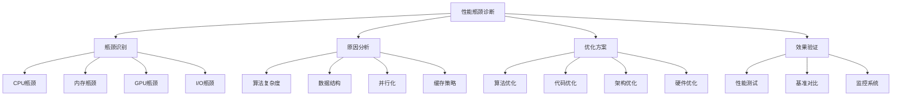

# 性能瓶颈诊断

## 🎯 概述

### 1. 性能瓶颈的重要性

**性能瓶颈的意义：**
> **通过系统性地诊断AI系统中的性能瓶颈，识别和解决影响系统效率的关键问题，提升整体性能**

**性能瓶颈的价值：**


### 2. 性能瓶颈分类

**性能瓶颈分类：**
| 类别 | 子类别 | 典型表现 | 影响程度 |
|------|--------|----------|----------|
| **计算瓶颈** | CPU密集型 | CPU使用率100% | 高 |
| | GPU密集型 | GPU使用率100% | 高 |
| | 算法复杂度 | 执行时间过长 | 高 |
| **内存瓶颈** | 内存不足 | OOM错误 | 高 |
| | 内存泄漏 | 内存持续增长 | 中 |
| | 缓存未命中 | 频繁磁盘访问 | 中 |
| **I/O瓶颈** | 磁盘I/O | 磁盘使用率100% | 中 |
| | 网络I/O | 网络延迟高 | 中 |
| | 数据加载 | 数据读取慢 | 中 |

## 🔧 性能监控工具

### 1. 系统性能监控

**系统性能监控实现：**

```python
import psutil
import time
import threading
import matplotlib.pyplot as plt
import numpy as np
from collections import defaultdict, deque
import pandas as pd
import GPUtil
import torch

class SystemPerformanceMonitor:
    """系统性能监控器"""
    
    def __init__(self, interval=1.0):
        self.interval = interval
        self.monitoring = False
        self.monitor_thread = None
        
        # 性能数据存储
        self.cpu_data = deque(maxlen=1000)
        self.memory_data = deque(maxlen=1000)
        self.disk_data = deque(maxlen=1000)
        self.network_data = deque(maxlen=1000)
        self.gpu_data = deque(maxlen=1000)
        
        # 时间戳
        self.timestamps = deque(maxlen=1000)
        
        # 性能阈值
        self.thresholds = {
            'cpu': 80.0,
            'memory': 80.0,
            'disk': 80.0,
            'gpu': 80.0
        }
    
    def start_monitoring(self):
        """开始监控"""
        if self.monitoring:
            print("监控已在运行")
            return
        
        self.monitoring = True
        self.monitor_thread = threading.Thread(target=self._monitor_loop)
        self.monitor_thread.daemon = True
        self.monitor_thread.start()
        print("系统性能监控已启动")
    
    def stop_monitoring(self):
        """停止监控"""
        self.monitoring = False
        if self.monitor_thread:
            self.monitor_thread.join()
        print("系统性能监控已停止")
    
    def _monitor_loop(self):
        """监控循环"""
        while self.monitoring:
            try:
                timestamp = time.time()
                self.timestamps.append(timestamp)
                
                # CPU监控
                cpu_percent = psutil.cpu_percent(interval=None)
                self.cpu_data.append(cpu_percent)
                
                # 内存监控
                memory = psutil.virtual_memory()
                self.memory_data.append(memory.percent)
                
                # 磁盘监控
                disk = psutil.disk_usage('/')
                disk_percent = (disk.used / disk.total) * 100
                self.disk_data.append(disk_percent)
                
                # 网络监控
                network = psutil.net_io_counters()
                self.network_data.append({
                    'bytes_sent': network.bytes_sent,
                    'bytes_recv': network.bytes_recv,
                    'packets_sent': network.packets_sent,
                    'packets_recv': network.packets_recv
                })
                
                # GPU监控
                try:
                    gpus = GPUtil.getGPUs()
                    if gpus:
                        gpu = gpus[0]  # 使用第一个GPU
                        self.gpu_data.append({
                            'load': gpu.load * 100,
                            'memory_used': gpu.memoryUsed,
                            'memory_total': gpu.memoryTotal,
                            'memory_percent': (gpu.memoryUsed / gpu.memoryTotal) * 100,
                            'temperature': gpu.temperature
                        })
                except:
                    pass
                
                # 检查阈值
                self._check_thresholds(cpu_percent, memory.percent, disk_percent)
                
                time.sleep(self.interval)
                
            except Exception as e:
                print(f"监控错误: {e}")
                time.sleep(self.interval)
    
    def _check_thresholds(self, cpu_percent, memory_percent, disk_percent):
        """检查性能阈值"""
        if cpu_percent > self.thresholds['cpu']:
            print(f"警告: CPU使用率过高: {cpu_percent:.1f}%")
        
        if memory_percent > self.thresholds['memory']:
            print(f"警告: 内存使用率过高: {memory_percent:.1f}%")
        
        if disk_percent > self.thresholds['disk']:
            print(f"警告: 磁盘使用率过高: {disk_percent:.1f}%")
        
        if self.gpu_data:
            gpu_data = self.gpu_data[-1]
            if gpu_data['load'] > self.thresholds['gpu']:
                print(f"警告: GPU使用率过高: {gpu_data['load']:.1f}%")
    
    def get_current_stats(self):
        """获取当前统计信息"""
        stats = {
            'cpu_percent': psutil.cpu_percent(interval=None),
            'memory': psutil.virtual_memory()._asdict(),
            'disk': psutil.disk_usage('/')._asdict(),
            'network': psutil.net_io_counters()._asdict()
        }
        
        # GPU信息
        try:
            gpus = GPUtil.getGPUs()
            if gpus:
                gpu = gpus[0]
                stats['gpu'] = {
                    'name': gpu.name,
                    'load': gpu.load * 100,
                    'memory_used': gpu.memoryUsed,
                    'memory_total': gpu.memoryTotal,
                    'memory_percent': (gpu.memoryUsed / gpu.memoryTotal) * 100,
                    'temperature': gpu.temperature
                }
        except:
            pass
        
        return stats
    
    def visualize_performance(self, duration_minutes=5):
        """可视化性能数据"""
        if not self.cpu_data:
            print("没有性能数据可显示")
            return
        
        # 计算显示范围
        data_points = min(len(self.cpu_data), int(duration_minutes * 60 / self.interval))
        start_idx = len(self.cpu_data) - data_points
        
        # 准备数据
        timestamps = list(self.timestamps)[start_idx:]
        cpu_data = list(self.cpu_data)[start_idx:]
        memory_data = list(self.memory_data)[start_idx:]
        disk_data = list(self.disk_data)[start_idx:]
        
        # 转换时间戳为相对时间
        if timestamps:
            start_time = timestamps[0]
            relative_times = [(t - start_time) / 60 for t in timestamps]  # 转换为分钟
        
        plt.figure(figsize=(15, 10))
        
        # CPU使用率
        plt.subplot(2, 3, 1)
        plt.plot(relative_times, cpu_data, label='CPU使用率')
        plt.axhline(y=self.thresholds['cpu'], color='r', linestyle='--', label='阈值')
        plt.title('CPU使用率')
        plt.xlabel('时间 (分钟)')
        plt.ylabel('使用率 (%)')
        plt.legend()
        plt.grid(True)
        
        # 内存使用率
        plt.subplot(2, 3, 2)
        plt.plot(relative_times, memory_data, label='内存使用率')
        plt.axhline(y=self.thresholds['memory'], color='r', linestyle='--', label='阈值')
        plt.title('内存使用率')
        plt.xlabel('时间 (分钟)')
        plt.ylabel('使用率 (%)')
        plt.legend()
        plt.grid(True)
        
        # 磁盘使用率
        plt.subplot(2, 3, 3)
        plt.plot(relative_times, disk_data, label='磁盘使用率')
        plt.axhline(y=self.thresholds['disk'], color='r', linestyle='--', label='阈值')
        plt.title('磁盘使用率')
        plt.xlabel('时间 (分钟)')
        plt.ylabel('使用率 (%)')
        plt.legend()
        plt.grid(True)
        
        # GPU使用率
        plt.subplot(2, 3, 4)
        if self.gpu_data:
            gpu_data = list(self.gpu_data)[start_idx:]
            gpu_loads = [g['load'] for g in gpu_data]
            plt.plot(relative_times, gpu_loads, label='GPU使用率')
            plt.axhline(y=self.thresholds['gpu'], color='r', linestyle='--', label='阈值')
            plt.title('GPU使用率')
            plt.xlabel('时间 (分钟)')
            plt.ylabel('使用率 (%)')
            plt.legend()
            plt.grid(True)
        
        # 网络流量
        plt.subplot(2, 3, 5)
        if self.network_data:
            network_data = list(self.network_data)[start_idx:]
            bytes_sent = [n['bytes_sent'] for n in network_data]
            bytes_recv = [n['bytes_recv'] for n in network_data]
            
            plt.plot(relative_times, bytes_sent, label='发送字节')
            plt.plot(relative_times, bytes_recv, label='接收字节')
            plt.title('网络流量')
            plt.xlabel('时间 (分钟)')
            plt.ylabel('字节数')
            plt.legend()
            plt.grid(True)
        
        # 性能统计
        plt.subplot(2, 3, 6)
        plt.axis('off')
        
        stats_text = f"""
        性能统计 (最近 {duration_minutes} 分钟):
        
        CPU:
        平均使用率: {np.mean(cpu_data):.1f}%
        最大使用率: {np.max(cpu_data):.1f}%
        
        内存:
        平均使用率: {np.mean(memory_data):.1f}%
        最大使用率: {np.max(memory_data):.1f}%
        
        磁盘:
        平均使用率: {np.mean(disk_data):.1f}%
        最大使用率: {np.max(disk_data):.1f}%
        """
        
        if self.gpu_data:
            gpu_loads = [g['load'] for g in gpu_data]
            stats_text += f"""
        
        GPU:
        平均使用率: {np.mean(gpu_loads):.1f}%
        最大使用率: {np.max(gpu_loads):.1f}%
            """
        
        plt.text(0.1, 0.9, stats_text, transform=plt.gca().transAxes, fontsize=10, verticalalignment='top')
        
        plt.tight_layout()
        plt.show()
    
    def generate_performance_report(self):
        """生成性能报告"""
        if not self.cpu_data:
            print("没有性能数据可分析")
            return
        
        print("=== 系统性能报告 ===")
        
        # 基本统计
        cpu_stats = {
            'mean': np.mean(self.cpu_data),
            'max': np.max(self.cpu_data),
            'min': np.min(self.cpu_data),
            'std': np.std(self.cpu_data)
        }
        
        memory_stats = {
            'mean': np.mean(self.memory_data),
            'max': np.max(self.memory_data),
            'min': np.min(self.memory_data),
            'std': np.std(self.memory_data)
        }
        
        disk_stats = {
            'mean': np.mean(self.disk_data),
            'max': np.max(self.disk_data),
            'min': np.min(self.disk_data),
            'std': np.std(self.disk_data)
        }
        
        print(f"CPU使用率统计:")
        print(f"  平均: {cpu_stats['mean']:.1f}%")
        print(f"  最大: {cpu_stats['max']:.1f}%")
        print(f"  最小: {cpu_stats['min']:.1f}%")
        print(f"  标准差: {cpu_stats['std']:.1f}%")
        
        print(f"\n内存使用率统计:")
        print(f"  平均: {memory_stats['mean']:.1f}%")
        print(f"  最大: {memory_stats['max']:.1f}%")
        print(f"  最小: {memory_stats['min']:.1f}%")
        print(f"  标准差: {memory_stats['std']:.1f}%")
        
        print(f"\n磁盘使用率统计:")
        print(f"  平均: {disk_stats['mean']:.1f}%")
        print(f"  最大: {disk_stats['max']:.1f}%")
        print(f"  最小: {disk_stats['min']:.1f}%")
        print(f"  标准差: {disk_stats['std']:.1f}%")
        
        # GPU统计
        if self.gpu_data:
            gpu_loads = [g['load'] for g in self.gpu_data]
            gpu_memory = [g['memory_percent'] for g in self.gpu_data]
            
            print(f"\nGPU使用率统计:")
            print(f"  平均: {np.mean(gpu_loads):.1f}%")
            print(f"  最大: {np.max(gpu_loads):.1f}%")
            print(f"  最小: {np.min(gpu_loads):.1f}%")
            
            print(f"\nGPU内存使用率统计:")
            print(f"  平均: {np.mean(gpu_memory):.1f}%")
            print(f"  最大: {np.max(gpu_memory):.1f}%")
            print(f"  最小: {np.min(gpu_memory):.1f}%")
        
        # 性能问题分析
        issues = []
        
        if cpu_stats['max'] > self.thresholds['cpu']:
            issues.append(f"CPU使用率过高: 最大 {cpu_stats['max']:.1f}%")
        
        if memory_stats['max'] > self.thresholds['memory']:
            issues.append(f"内存使用率过高: 最大 {memory_stats['max']:.1f}%")
        
        if disk_stats['max'] > self.thresholds['disk']:
            issues.append(f"磁盘使用率过高: 最大 {disk_stats['max']:.1f}%")
        
        if self.gpu_data:
            gpu_loads = [g['load'] for g in self.gpu_data]
            if np.max(gpu_loads) > self.thresholds['gpu']:
                issues.append(f"GPU使用率过高: 最大 {np.max(gpu_loads):.1f}%")
        
        if issues:
            print(f"\n发现的性能问题:")
            for i, issue in enumerate(issues, 1):
                print(f"  {i}. {issue}")
        else:
            print(f"\n未发现明显的性能问题")
        
        return {
            'cpu_stats': cpu_stats,
            'memory_stats': memory_stats,
            'disk_stats': disk_stats,
            'issues': issues
        }

# 测试系统性能监控
def test_system_performance_monitor():
    """测试系统性能监控"""
    monitor = SystemPerformanceMonitor(interval=0.5)
    
    # 开始监控
    monitor.start_monitoring()
    
    # 模拟一些工作负载
    print("模拟工作负载...")
    for i in range(10):
        # CPU密集型任务
        start_time = time.time()
        while time.time() - start_time < 0.1:
            _ = sum(range(1000))
        
        time.sleep(0.5)
    
    # 停止监控
    monitor.stop_monitoring()
    
    # 生成报告
    report = monitor.generate_performance_report()
    
    # 可视化性能
    monitor.visualize_performance(duration_minutes=1)
    
    return monitor, report

test_system_performance_monitor()
```

### 2. 应用性能分析

**应用性能分析实现：**

```python
import cProfile
import pstats
import io
import time
import functools
from contextlib import contextmanager
import line_profiler
import memory_profiler
import torch
import numpy as np

class ApplicationPerformanceAnalyzer:
    """应用性能分析器"""
    
    def __init__(self):
        self.profiler = cProfile.Profile()
        self.performance_data = {}
        self.memory_data = {}
        self.timing_data = {}
    
    @contextmanager
    def profile_context(self, name):
        """性能分析上下文管理器"""
        self.profiler.enable()
        start_time = time.time()
        start_memory = self._get_memory_usage()
        
        try:
            yield
        finally:
            end_time = time.time()
            end_memory = self._get_memory_usage()
            self.profiler.disable()
            
            # 记录性能数据
            self.performance_data[name] = {
                'duration': end_time - start_time,
                'memory_delta': end_memory - start_memory,
                'start_memory': start_memory,
                'end_memory': end_memory
            }
    
    def _get_memory_usage(self):
        """获取内存使用量"""
        try:
            import psutil
            process = psutil.Process()
            return process.memory_info().rss / 1024 / 1024  # MB
        except:
            return 0
    
    def profile_function(self, func):
        """函数性能分析装饰器"""
        @functools.wraps(func)
        def wrapper(*args, **kwargs):
            func_name = func.__name__
            
            # 开始分析
            self.profiler.enable()
            start_time = time.time()
            start_memory = self._get_memory_usage()
            
            try:
                result = func(*args, **kwargs)
                return result
            finally:
                # 结束分析
                end_time = time.time()
                end_memory = self._get_memory_usage()
                self.profiler.disable()
                
                # 记录数据
                if func_name not in self.performance_data:
                    self.performance_data[func_name] = []
                
                self.performance_data[func_name].append({
                    'duration': end_time - start_time,
                    'memory_delta': end_memory - start_memory,
                    'start_memory': start_memory,
                    'end_memory': end_memory,
                    'timestamp': time.time()
                })
        
        return wrapper
    
    def analyze_cpu_usage(self, func, *args, **kwargs):
        """分析CPU使用情况"""
        print(f"=== 分析函数 {func.__name__} 的CPU使用情况 ===")
        
        # 使用cProfile分析
        self.profiler.enable()
        start_time = time.time()
        
        try:
            result = func(*args, **kwargs)
        finally:
            end_time = time.time()
            self.profiler.disable()
        
        # 生成分析报告
        s = io.StringIO()
        ps = pstats.Stats(self.profiler, stream=s)
        ps.sort_stats('cumulative')
        ps.print_stats(20)  # 显示前20个最耗时的函数
        
        print(f"执行时间: {end_time - start_time:.4f} 秒")
        print("CPU使用分析:")
        print(s.getvalue())
        
        return result
    
    def analyze_memory_usage(self, func, *args, **kwargs):
        """分析内存使用情况"""
        print(f"=== 分析函数 {func.__name__} 的内存使用情况 ===")
        
        # 使用memory_profiler分析
        try:
            # 创建内存分析器
            profiler = memory_profiler.LineProfiler()
            profiler.add_function(func)
            
            # 执行函数
            result = profiler(func)(*args, **kwargs)
            
            # 打印内存分析结果
            profiler.print_stats()
            
            return result
        except Exception as e:
            print(f"内存分析失败: {e}")
            return func(*args, **kwargs)
    
    def analyze_line_by_line(self, func, *args, **kwargs):
        """逐行分析性能"""
        print(f"=== 逐行分析函数 {func.__name__} ===")
        
        try:
            # 创建行分析器
            profiler = line_profiler.LineProfiler()
            profiler.add_function(func)
            
            # 执行函数
            result = profiler(func)(*args, **kwargs)
            
            # 打印逐行分析结果
            profiler.print_stats()
            
            return result
        except Exception as e:
            print(f"逐行分析失败: {e}")
            return func(*args, **kwargs)
    
    def benchmark_functions(self, functions, test_data, iterations=10):
        """基准测试多个函数"""
        print("=== 函数基准测试 ===")
        
        benchmark_results = {}
        
        for func_name, func in functions.items():
            print(f"\n测试函数: {func_name}")
            
            times = []
            memory_usage = []
            
            for i in range(iterations):
                # 清理内存
                if torch.cuda.is_available():
                    torch.cuda.empty_cache()
                
                # 测试执行时间
                start_time = time.time()
                start_memory = self._get_memory_usage()
                
                result = func(test_data)
                
                end_time = time.time()
                end_memory = self._get_memory_usage()
                
                times.append(end_time - start_time)
                memory_usage.append(end_memory - start_memory)
            
            # 计算统计信息
            benchmark_results[func_name] = {
                'mean_time': np.mean(times),
                'std_time': np.std(times),
                'min_time': np.min(times),
                'max_time': np.max(times),
                'mean_memory': np.mean(memory_usage),
                'std_memory': np.std(memory_usage),
                'min_memory': np.min(memory_usage),
                'max_memory': np.max(memory_usage)
            }
            
            print(f"  平均时间: {np.mean(times):.4f} ± {np.std(times):.4f} 秒")
            print(f"  时间范围: {np.min(times):.4f} - {np.max(times):.4f} 秒")
            print(f"  平均内存: {np.mean(memory_usage):.2f} ± {np.std(memory_usage):.2f} MB")
            print(f"  内存范围: {np.min(memory_usage):.2f} - {np.max(memory_usage):.2f} MB")
        
        # 可视化基准测试结果
        self._visualize_benchmark_results(benchmark_results)
        
        return benchmark_results
    
    def _visualize_benchmark_results(self, benchmark_results):
        """可视化基准测试结果"""
        if not benchmark_results:
            return
        
        fig, axes = plt.subplots(2, 2, figsize=(15, 10))
        
        # 执行时间对比
        func_names = list(benchmark_results.keys())
        mean_times = [benchmark_results[name]['mean_time'] for name in func_names]
        std_times = [benchmark_results[name]['std_time'] for name in func_names]
        
        axes[0, 0].bar(func_names, mean_times, yerr=std_times, capsize=5)
        axes[0, 0].set_title('平均执行时间')
        axes[0, 0].set_ylabel('时间 (秒)')
        axes[0, 0].tick_params(axis='x', rotation=45)
        
        # 内存使用对比
        mean_memory = [benchmark_results[name]['mean_memory'] for name in func_names]
        std_memory = [benchmark_results[name]['std_memory'] for name in func_names]
        
        axes[0, 1].bar(func_names, mean_memory, yerr=std_memory, capsize=5)
        axes[0, 1].set_title('平均内存使用')
        axes[0, 1].set_ylabel('内存 (MB)')
        axes[0, 1].tick_params(axis='x', rotation=45)
        
        # 时间分布
        axes[1, 0].boxplot([benchmark_results[name]['mean_time'] for name in func_names], labels=func_names)
        axes[1, 0].set_title('执行时间分布')
        axes[1, 0].set_ylabel('时间 (秒)')
        axes[1, 0].tick_params(axis='x', rotation=45)
        
        # 内存分布
        axes[1, 1].boxplot([benchmark_results[name]['mean_memory'] for name in func_names], labels=func_names)
        axes[1, 1].set_title('内存使用分布')
        axes[1, 1].set_ylabel('内存 (MB)')
        axes[1, 1].tick_params(axis='x', rotation=45)
        
        plt.tight_layout()
        plt.show()
    
    def analyze_torch_model_performance(self, model, input_data, target_data=None):
        """分析PyTorch模型性能"""
        print("=== PyTorch模型性能分析 ===")
        
        model.eval()
        
        # 预热
        with torch.no_grad():
            for _ in range(10):
                _ = model(input_data)
        
        # 分析前向传播
        print("\n前向传播分析:")
        with self.profile_context('forward_pass'):
            with torch.no_grad():
                output = model(input_data)
        
        # 分析反向传播（如果有目标数据）
        if target_data is not None:
            print("\n反向传播分析:")
            model.train()
            criterion = torch.nn.MSELoss()
            optimizer = torch.optim.SGD(model.parameters(), lr=0.01)
            
            with self.profile_context('backward_pass'):
                output = model(input_data)
                loss = criterion(output, target_data)
                loss.backward()
                optimizer.step()
        
        # GPU内存分析
        if torch.cuda.is_available():
            print(f"\nGPU内存使用:")
            print(f"  已分配: {torch.cuda.memory_allocated() / 1024**2:.2f} MB")
            print(f"  缓存: {torch.cuda.memory_reserved() / 1024**2:.2f} MB")
            print(f"  最大已分配: {torch.cuda.max_memory_allocated() / 1024**2:.2f} MB")
        
        # 模型参数统计
        total_params = sum(p.numel() for p in model.parameters())
        trainable_params = sum(p.numel() for p in model.parameters() if p.requires_grad)
        
        print(f"\n模型参数统计:")
        print(f"  总参数: {total_params:,}")
        print(f"  可训练参数: {trainable_params:,}")
        print(f"  模型大小: {total_params * 4 / 1024**2:.2f} MB")
        
        return output
    
    def generate_performance_report(self):
        """生成性能报告"""
        print("=== 应用性能报告 ===")
        
        if not self.performance_data:
            print("没有性能数据可分析")
            return
        
        # 分析性能数据
        for name, data in self.performance_data.items():
            if isinstance(data, list):
                # 多次调用的数据
                durations = [d['duration'] for d in data]
                memory_deltas = [d['memory_delta'] for d in data]
                
                print(f"\n函数 {name} 统计:")
                print(f"  调用次数: {len(data)}")
                print(f"  平均执行时间: {np.mean(durations):.4f} ± {np.std(durations):.4f} 秒")
                print(f"  平均内存变化: {np.mean(memory_deltas):.2f} ± {np.std(memory_deltas):.2f} MB")
            else:
                # 单次调用的数据
                print(f"\n操作 {name} 统计:")
                print(f"  执行时间: {data['duration']:.4f} 秒")
                print(f"  内存变化: {data['memory_delta']:.2f} MB")
        
        # 性能建议
        print(f"\n性能建议:")
        
        # 找出最耗时的操作
        max_duration = 0
        slowest_operation = None
        
        for name, data in self.performance_data.items():
            if isinstance(data, list):
                avg_duration = np.mean([d['duration'] for d in data])
            else:
                avg_duration = data['duration']
            
            if avg_duration > max_duration:
                max_duration = avg_duration
                slowest_operation = name
        
        if slowest_operation:
            print(f"  最耗时的操作: {slowest_operation} ({max_duration:.4f} 秒)")
            print(f"  建议: 优化 {slowest_operation} 的实现")
        
        # 内存使用建议
        max_memory = 0
        memory_heavy_operation = None
        
        for name, data in self.performance_data.items():
            if isinstance(data, list):
                avg_memory = np.mean([abs(d['memory_delta']) for d in data])
            else:
                avg_memory = abs(data['memory_delta'])
            
            if avg_memory > max_memory:
                max_memory = avg_memory
                memory_heavy_operation = name
        
        if memory_heavy_operation:
            print(f"  内存使用最多的操作: {memory_heavy_operation} ({max_memory:.2f} MB)")
            print(f"  建议: 检查 {memory_heavy_operation} 的内存使用")
        
        return self.performance_data

# 测试应用性能分析
def test_application_performance_analyzer():
    """测试应用性能分析"""
    analyzer = ApplicationPerformanceAnalyzer()
    
    # 测试函数
    @analyzer.profile_function
    def slow_function(n):
        result = 0
        for i in range(n):
            result += i ** 2
        return result
    
    @analyzer.profile_function
    def fast_function(n):
        return sum(i ** 2 for i in range(n))
    
    # 测试函数性能
    print("测试慢函数:")
    result1 = slow_function(10000)
    
    print("测试快函数:")
    result2 = fast_function(10000)
    
    # 基准测试
    functions = {
        'slow_function': slow_function,
        'fast_function': fast_function
    }
    
    benchmark_results = analyzer.benchmark_functions(functions, 10000, iterations=5)
    
    # 生成报告
    report = analyzer.generate_performance_report()
    
    return analyzer, report

test_application_performance_analyzer()
```

## 🔗 相关链接
- [[06-01-常见错误分析]] - 错误分析
- [[06-02-调试技巧总结]] - 调试技巧
- [[06-04-数据质量问题]] - 数据质量

## 💡 性能瓶颈诊断建议

**诊断策略：**
- 🎯 **系统性分析**：建立完整的性能监控和分析体系
- 📊 **多维度监控**：监控CPU、内存、GPU、I/O等多个维度
- 🔍 **瓶颈识别**：快速准确地识别性能瓶颈
- ⚡ **优化方案**：提供针对性的优化建议

**实践建议：**
- 📝 **持续监控**：建立持续的性能监控系统
- 💻 **工具使用**：熟练使用各种性能分析工具
- 📊 **基准测试**：建立性能基准和对比体系
- 🔍 **优化迭代**：持续优化和迭代改进

---
*📝 学习提示：性能瓶颈诊断是优化AI系统的重要技能，建议通过实践掌握各种性能分析工具和方法*


