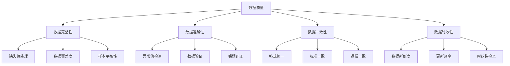

# 数据质量问题

## 🎯 概述

### 1. 数据质量的重要性

**数据质量的意义：**
> **数据质量是AI系统成功的关键因素，高质量的数据是训练出优秀模型的基础，直接影响模型的性能和可靠性**

**数据质量的价值：**


### 2. 数据质量维度

**数据质量维度：**
| 维度 | 定义 | 影响 | 检测方法 |
|------|------|------|----------|
| **完整性** | 数据的完整程度 | 模型训练效果 | 缺失值统计 |
| **准确性** | 数据的正确程度 | 模型准确性 | 异常值检测 |
| **一致性** | 数据的一致程度 | 模型稳定性 | 格式检查 |
| **时效性** | 数据的新鲜程度 | 模型适用性 | 时间戳分析 |
| **唯一性** | 数据的唯一程度 | 模型偏差 | 重复值检测 |
| **有效性** | 数据的有效程度 | 模型可靠性 | 范围检查 |

## 🔧 数据质量检测

### 1. 完整性检测

**完整性检测实现：**

```python
import numpy as np
import pandas as pd
import matplotlib.pyplot as plt
import seaborn as sns
from sklearn.impute import SimpleImputer, KNNImputer
from sklearn.ensemble import IsolationForest
from sklearn.preprocessing import StandardScaler
import warnings
warnings.filterwarnings('ignore')

class DataCompletenessAnalyzer:
    """数据完整性分析器"""
    
    def __init__(self):
        self.completeness_stats = {}
        self.missing_patterns = {}
        self.imputation_strategies = {}
    
    def analyze_missing_values(self, data):
        """分析缺失值"""
        print("=== 缺失值分析 ===")
        
        # 基本统计
        missing_counts = data.isnull().sum()
        missing_percentages = (missing_counts / len(data)) * 100
        
        # 分类缺失值严重程度
        complete_cols = missing_percentages[missing_percentages == 0].index.tolist()
        low_missing_cols = missing_percentages[(missing_percentages > 0) & (missing_percentages <= 5)].index.tolist()
        medium_missing_cols = missing_percentages[(missing_percentages > 5) & (missing_percentages <= 20)].index.tolist()
        high_missing_cols = missing_percentages[(missing_percentages > 20) & (missing_percentages <= 50)].index.tolist()
        critical_missing_cols = missing_percentages[missing_percentages > 50].index.tolist()
        
        # 存储统计信息
        self.completeness_stats = {
            'total_rows': len(data),
            'total_cols': len(data.columns),
            'complete_cols': len(complete_cols),
            'low_missing_cols': len(low_missing_cols),
            'medium_missing_cols': len(medium_missing_cols),
            'high_missing_cols': len(high_missing_cols),
            'critical_missing_cols': len(critical_missing_cols),
            'missing_counts': missing_counts,
            'missing_percentages': missing_percentages
        }
        
        # 打印统计信息
        print(f"总行数: {len(data)}")
        print(f"总列数: {len(data.columns)}")
        print(f"完全完整列: {len(complete_cols)}")
        print(f"低缺失列 (0-5%): {len(low_missing_cols)}")
        print(f"中等缺失列 (5-20%): {len(medium_missing_cols)}")
        print(f"高缺失列 (20-50%): {len(high_missing_cols)}")
        print(f"严重缺失列 (>50%): {len(critical_missing_cols)}")
        
        # 可视化缺失值
        self._visualize_missing_values(data, missing_percentages)
        
        return self.completeness_stats
    
    def _visualize_missing_values(self, data, missing_percentages):
        """可视化缺失值"""
        plt.figure(figsize=(15, 10))
        
        # 缺失值热图
        plt.subplot(2, 3, 1)
        missing_data = data.isnull()
        sns.heatmap(missing_data, cbar=True, yticklabels=False, cmap='viridis')
        plt.title('缺失值热图')
        plt.xlabel('列')
        plt.ylabel('行')
        
        # 缺失值百分比条形图
        plt.subplot(2, 3, 2)
        missing_percentages_sorted = missing_percentages.sort_values(ascending=True)
        plt.barh(range(len(missing_percentages_sorted)), missing_percentages_sorted.values)
        plt.yticks(range(len(missing_percentages_sorted)), missing_percentages_sorted.index)
        plt.xlabel('缺失值百分比 (%)')
        plt.title('各列缺失值百分比')
        
        # 缺失值分布
        plt.subplot(2, 3, 3)
        plt.hist(missing_percentages.values, bins=20, alpha=0.7)
        plt.xlabel('缺失值百分比 (%)')
        plt.ylabel('列数')
        plt.title('缺失值分布')
        plt.grid(True)
        
        # 缺失值模式分析
        plt.subplot(2, 3, 4)
        missing_patterns = self._analyze_missing_patterns(data)
        if missing_patterns:
            pattern_counts = list(missing_patterns.values())
            pattern_labels = list(missing_patterns.keys())
            plt.pie(pattern_counts, labels=pattern_labels, autopct='%1.1f%%')
            plt.title('缺失值模式分布')
        
        # 行缺失统计
        plt.subplot(2, 3, 5)
        row_missing_counts = data.isnull().sum(axis=1)
        plt.hist(row_missing_counts, bins=20, alpha=0.7)
        plt.xlabel('每行缺失值数量')
        plt.ylabel('行数')
        plt.title('行缺失值分布')
        plt.grid(True)
        
        # 完整性评分
        plt.subplot(2, 3, 6)
        completeness_score = self._calculate_completeness_score()
        plt.bar(['完整性评分'], [completeness_score])
        plt.ylim(0, 100)
        plt.ylabel('评分')
        plt.title('数据完整性评分')
        plt.grid(True)
        
        plt.tight_layout()
        plt.show()
    
    def _analyze_missing_patterns(self, data):
        """分析缺失值模式"""
        missing_data = data.isnull()
        
        # 计算缺失值模式
        patterns = {}
        for idx, row in missing_data.iterrows():
            pattern = tuple(row.values)
            patterns[pattern] = patterns.get(pattern, 0) + 1
        
        # 只保留出现频率较高的模式
        threshold = len(data) * 0.01  # 至少出现1%的行
        significant_patterns = {k: v for k, v in patterns.items() if v >= threshold}
        
        self.missing_patterns = significant_patterns
        return significant_patterns
    
    def _calculate_completeness_score(self):
        """计算完整性评分"""
        if not self.completeness_stats:
            return 0
        
        total_cells = self.completeness_stats['total_rows'] * self.completeness_stats['total_cols']
        missing_cells = self.completeness_stats['missing_counts'].sum()
        completeness_ratio = (total_cells - missing_cells) / total_cells
        
        return completeness_ratio * 100
    
    def recommend_imputation_strategies(self, data):
        """推荐插值策略"""
        print("=== 插值策略推荐 ===")
        
        strategies = {}
        
        for col in data.columns:
            missing_percentage = self.completeness_stats['missing_percentages'][col]
            
            if missing_percentage == 0:
                strategies[col] = '无需插值'
            elif missing_percentage > 50:
                strategies[col] = '删除列'
            else:
                # 根据数据类型推荐策略
                if data[col].dtype in ['int64', 'float64']:
                    if missing_percentage < 10:
                        strategies[col] = '均值插值'
                    elif missing_percentage < 30:
                        strategies[col] = 'KNN插值'
                    else:
                        strategies[col] = '中位数插值'
                else:
                    if missing_percentage < 10:
                        strategies[col] = '众数插值'
                    else:
                        strategies[col] = '删除行'
        
        self.imputation_strategies = strategies
        
        # 打印推荐策略
        for col, strategy in strategies.items():
            print(f"{col}: {strategy}")
        
        return strategies
    
    def apply_imputation(self, data, strategies=None):
        """应用插值"""
        if strategies is None:
            strategies = self.imputation_strategies
        
        print("=== 应用插值 ===")
        
        imputed_data = data.copy()
        
        for col, strategy in strategies.items():
            if strategy == '无需插值':
                continue
            elif strategy == '删除列':
                imputed_data = imputed_data.drop(columns=[col])
                print(f"删除列: {col}")
            elif strategy == '删除行':
                imputed_data = imputed_data.dropna(subset=[col])
                print(f"删除包含缺失值的行: {col}")
            elif strategy == '均值插值':
                imputer = SimpleImputer(strategy='mean')
                imputed_data[col] = imputer.fit_transform(imputed_data[[col]]).flatten()
                print(f"均值插值: {col}")
            elif strategy == '中位数插值':
                imputer = SimpleImputer(strategy='median')
                imputed_data[col] = imputer.fit_transform(imputed_data[[col]]).flatten()
                print(f"中位数插值: {col}")
            elif strategy == '众数插值':
                imputer = SimpleImputer(strategy='most_frequent')
                imputed_data[col] = imputer.fit_transform(imputed_data[[col]]).flatten()
                print(f"众数插值: {col}")
            elif strategy == 'KNN插值':
                # 只对数值列使用KNN
                numeric_cols = imputed_data.select_dtypes(include=[np.number]).columns
                if col in numeric_cols:
                    imputer = KNNImputer(n_neighbors=5)
                    imputed_data[col] = imputer.fit_transform(imputed_data[numeric_cols])[:, list(numeric_cols).index(col)]
                    print(f"KNN插值: {col}")
        
        return imputed_data
    
    def generate_completeness_report(self, data):
        """生成完整性报告"""
        print("=== 数据完整性报告 ===")
        
        # 分析缺失值
        stats = self.analyze_missing_values(data)
        
        # 推荐插值策略
        strategies = self.recommend_imputation_strategies(data)
        
        # 计算完整性评分
        completeness_score = self._calculate_completeness_score()
        
        # 生成报告
        report = {
            'completeness_score': completeness_score,
            'stats': stats,
            'strategies': strategies,
            'recommendations': self._generate_recommendations(stats, strategies)
        }
        
        print(f"\n完整性评分: {completeness_score:.2f}/100")
        print(f"\n建议:")
        for rec in report['recommendations']:
            print(f"  - {rec}")
        
        return report
    
    def _generate_recommendations(self, stats, strategies):
        """生成建议"""
        recommendations = []
        
        if stats['critical_missing_cols'] > 0:
            recommendations.append(f"删除 {stats['critical_missing_cols']} 个严重缺失的列")
        
        if stats['high_missing_cols'] > 0:
            recommendations.append(f"重点关注 {stats['high_missing_cols']} 个高缺失列的数据收集")
        
        if stats['medium_missing_cols'] > 0:
            recommendations.append(f"对 {stats['medium_missing_cols']} 个中等缺失列进行插值处理")
        
        if stats['low_missing_cols'] > 0:
            recommendations.append(f"对 {stats['low_missing_cols']} 个低缺失列进行简单插值")
        
        # 检查插值策略
        delete_cols = sum(1 for s in strategies.values() if s == '删除列')
        if delete_cols > 0:
            recommendations.append(f"考虑删除 {delete_cols} 个缺失严重的列")
        
        return recommendations

# 测试数据完整性分析
def test_data_completeness_analysis():
    """测试数据完整性分析"""
    # 创建有缺失值的数据
    np.random.seed(42)
    n_samples = 1000
    
    data = pd.DataFrame({
        'age': np.random.randint(18, 80, n_samples),
        'income': np.random.normal(50000, 15000, n_samples),
        'education': np.random.choice(['high', 'medium', 'low'], n_samples),
        'city': np.random.choice(['A', 'B', 'C', 'D'], n_samples),
        'score': np.random.uniform(0, 100, n_samples)
    })
    
    # 添加缺失值
    # 随机缺失
    missing_indices = np.random.choice(n_samples, size=int(0.1 * n_samples), replace=False)
    data.loc[missing_indices, 'age'] = np.nan
    
    # 条件缺失
    data.loc[data['income'] > 70000, 'education'] = np.nan
    
    # 完全缺失
    data.loc[data['city'] == 'D', 'score'] = np.nan
    
    # 分析完整性
    analyzer = DataCompletenessAnalyzer()
    report = analyzer.generate_completeness_report(data)
    
    # 应用插值
    imputed_data = analyzer.apply_imputation(data)
    
    return analyzer, data, imputed_data

test_data_completeness_analysis()
```

### 2. 准确性检测

**准确性检测实现：**

```python
class DataAccuracyAnalyzer:
    """数据准确性分析器"""
    
    def __init__(self):
        self.accuracy_stats = {}
        self.outlier_info = {}
        self.validation_rules = {}
    
    def detect_outliers(self, data, method='iqr', threshold=1.5):
        """检测异常值"""
        print("=== 异常值检测 ===")
        
        numeric_cols = data.select_dtypes(include=[np.number]).columns
        outlier_info = {}
        
        for col in numeric_cols:
            if method == 'iqr':
                outliers = self._detect_outliers_iqr(data[col], threshold)
            elif method == 'zscore':
                outliers = self._detect_outliers_zscore(data[col], threshold)
            elif method == 'isolation_forest':
                outliers = self._detect_outliers_isolation_forest(data[col])
            else:
                raise ValueError(f"未知的异常值检测方法: {method}")
            
            outlier_info[col] = {
                'outliers': outliers,
                'count': len(outliers),
                'percentage': (len(outliers) / len(data)) * 100,
                'method': method
            }
        
        self.outlier_info = outlier_info
        
        # 打印统计信息
        for col, info in outlier_info.items():
            print(f"{col}: {info['count']} 个异常值 ({info['percentage']:.2f}%)")
        
        # 可视化异常值
        self._visualize_outliers(data, outlier_info)
        
        return outlier_info
    
    def _detect_outliers_iqr(self, series, threshold=1.5):
        """使用IQR方法检测异常值"""
        Q1 = series.quantile(0.25)
        Q3 = series.quantile(0.75)
        IQR = Q3 - Q1
        
        lower_bound = Q1 - threshold * IQR
        upper_bound = Q3 + threshold * IQR
        
        outliers = series[(series < lower_bound) | (series > upper_bound)]
        return outliers
    
    def _detect_outliers_zscore(self, series, threshold=3):
        """使用Z-score方法检测异常值"""
        z_scores = np.abs((series - series.mean()) / series.std())
        outliers = series[z_scores > threshold]
        return outliers
    
    def _detect_outliers_isolation_forest(self, series):
        """使用孤立森林检测异常值"""
        # 重塑数据
        X = series.values.reshape(-1, 1)
        
        # 训练孤立森林
        iso_forest = IsolationForest(contamination=0.1, random_state=42)
        outlier_labels = iso_forest.fit_predict(X)
        
        # 获取异常值
        outliers = series[outlier_labels == -1]
        return outliers
    
    def _visualize_outliers(self, data, outlier_info):
        """可视化异常值"""
        numeric_cols = data.select_dtypes(include=[np.number]).columns
        
        n_cols = min(4, len(numeric_cols))
        fig, axes = plt.subplots(2, n_cols, figsize=(15, 10))
        axes = axes.flatten()
        
        for i, col in enumerate(numeric_cols[:n_cols*2]):
            if i < len(axes):
                # 箱线图
                box_plot = axes[i].boxplot(data[col].dropna(), patch_artist=True)
                box_plot['boxes'][0].set_facecolor('lightblue')
                
                # 标记异常值
                if col in outlier_info:
                    outliers = outlier_info[col]['outliers']
                    if len(outliers) > 0:
                        axes[i].scatter([1] * len(outliers), outliers.values, color='red', s=50, alpha=0.7)
                
                axes[i].set_title(f'{col} 异常值检测')
                axes[i].set_ylabel('值')
                axes[i].grid(True)
        
        plt.tight_layout()
        plt.show()
    
    def validate_data_rules(self, data, rules):
        """验证数据规则"""
        print("=== 数据规则验证 ===")
        
        validation_results = {}
        
        for rule_name, rule in rules.items():
            print(f"\n验证规则: {rule_name}")
            
            if rule['type'] == 'range':
                result = self._validate_range_rule(data, rule)
            elif rule['type'] == 'format':
                result = self._validate_format_rule(data, rule)
            elif rule['type'] == 'logic':
                result = self._validate_logic_rule(data, rule)
            elif rule['type'] == 'custom':
                result = self._validate_custom_rule(data, rule)
            else:
                raise ValueError(f"未知的规则类型: {rule['type']}")
            
            validation_results[rule_name] = result
            
            # 打印结果
            print(f"  通过: {result['passed']} 行")
            print(f"  失败: {result['failed']} 行")
            print(f"  通过率: {result['pass_rate']:.2f}%")
        
        self.validation_rules = validation_results
        return validation_results
    
    def _validate_range_rule(self, data, rule):
        """验证范围规则"""
        col = rule['column']
        min_val = rule.get('min')
        max_val = rule.get('max')
        
        if col not in data.columns:
            return {'passed': 0, 'failed': len(data), 'pass_rate': 0, 'errors': ['列不存在']}
        
        # 检查范围
        passed = 0
        failed = 0
        errors = []
        
        for idx, value in data[col].items():
            if pd.isna(value):
                continue
            
            if min_val is not None and value < min_val:
                failed += 1
                errors.append(f"行 {idx}: 值 {value} 小于最小值 {min_val}")
            elif max_val is not None and value > max_val:
                failed += 1
                errors.append(f"行 {idx}: 值 {value} 大于最大值 {max_val}")
            else:
                passed += 1
        
        total = passed + failed
        pass_rate = (passed / total * 100) if total > 0 else 0
        
        return {
            'passed': passed,
            'failed': failed,
            'pass_rate': pass_rate,
            'errors': errors[:10]  # 只返回前10个错误
        }
    
    def _validate_format_rule(self, data, rule):
        """验证格式规则"""
        col = rule['column']
        pattern = rule['pattern']
        
        if col not in data.columns:
            return {'passed': 0, 'failed': len(data), 'pass_rate': 0, 'errors': ['列不存在']}
        
        import re
        
        passed = 0
        failed = 0
        errors = []
        
        for idx, value in data[col].items():
            if pd.isna(value):
                continue
            
            if not re.match(pattern, str(value)):
                failed += 1
                errors.append(f"行 {idx}: 值 '{value}' 不符合格式 '{pattern}'")
            else:
                passed += 1
        
        total = passed + failed
        pass_rate = (passed / total * 100) if total > 0 else 0
        
        return {
            'passed': passed,
            'failed': failed,
            'pass_rate': pass_rate,
            'errors': errors[:10]
        }
    
    def _validate_logic_rule(self, data, rule):
        """验证逻辑规则"""
        condition = rule['condition']
        
        try:
            # 使用pandas的query方法
            result = data.query(condition)
            passed = len(result)
            failed = len(data) - passed
            pass_rate = (passed / len(data) * 100) if len(data) > 0 else 0
            
            return {
                'passed': passed,
                'failed': failed,
                'pass_rate': pass_rate,
                'errors': []
            }
        except Exception as e:
            return {
                'passed': 0,
                'failed': len(data),
                'pass_rate': 0,
                'errors': [f"条件解析错误: {str(e)}"]
            }
    
    def _validate_custom_rule(self, data, rule):
        """验证自定义规则"""
        func = rule['function']
        
        try:
            result = func(data)
            if isinstance(result, dict):
                return result
            else:
                return {
                    'passed': result,
                    'failed': len(data) - result,
                    'pass_rate': (result / len(data) * 100) if len(data) > 0 else 0,
                    'errors': []
                }
        except Exception as e:
            return {
                'passed': 0,
                'failed': len(data),
                'pass_rate': 0,
                'errors': [f"自定义函数错误: {str(e)}"]
            }
    
    def generate_accuracy_report(self, data, rules=None):
        """生成准确性报告"""
        print("=== 数据准确性报告 ===")
        
        # 检测异常值
        outlier_info = self.detect_outliers(data)
        
        # 验证数据规则
        validation_results = {}
        if rules:
            validation_results = self.validate_data_rules(data, rules)
        
        # 计算准确性评分
        accuracy_score = self._calculate_accuracy_score(outlier_info, validation_results)
        
        # 生成报告
        report = {
            'accuracy_score': accuracy_score,
            'outlier_info': outlier_info,
            'validation_results': validation_results,
            'recommendations': self._generate_accuracy_recommendations(outlier_info, validation_results)
        }
        
        print(f"\n准确性评分: {accuracy_score:.2f}/100")
        print(f"\n建议:")
        for rec in report['recommendations']:
            print(f"  - {rec}")
        
        return report
    
    def _calculate_accuracy_score(self, outlier_info, validation_results):
        """计算准确性评分"""
        score = 100
        
        # 异常值扣分
        for col, info in outlier_info.items():
            if info['percentage'] > 10:
                score -= 20
            elif info['percentage'] > 5:
                score -= 10
            elif info['percentage'] > 1:
                score -= 5
        
        # 规则验证扣分
        for rule_name, result in validation_results.items():
            if result['pass_rate'] < 80:
                score -= 15
            elif result['pass_rate'] < 90:
                score -= 10
            elif result['pass_rate'] < 95:
                score -= 5
        
        return max(score, 0)
    
    def _generate_accuracy_recommendations(self, outlier_info, validation_results):
        """生成准确性建议"""
        recommendations = []
        
        # 异常值建议
        high_outlier_cols = [col for col, info in outlier_info.items() if info['percentage'] > 10]
        if high_outlier_cols:
            recommendations.append(f"重点关注 {len(high_outlier_cols)} 个高异常值列的数据质量")
        
        medium_outlier_cols = [col for col, info in outlier_info.items() if 5 < info['percentage'] <= 10]
        if medium_outlier_cols:
            recommendations.append(f"对 {len(medium_outlier_cols)} 个中等异常值列进行数据清洗")
        
        # 规则验证建议
        low_pass_rules = [rule for rule, result in validation_results.items() if result['pass_rate'] < 80]
        if low_pass_rules:
            recommendations.append(f"修复 {len(low_pass_rules)} 个低通过率的数据规则")
        
        return recommendations

# 测试数据准确性分析
def test_data_accuracy_analysis():
    """测试数据准确性分析"""
    # 创建有异常值的数据
    np.random.seed(42)
    n_samples = 1000
    
    data = pd.DataFrame({
        'age': np.random.randint(18, 80, n_samples),
        'income': np.random.normal(50000, 15000, n_samples),
        'email': [f'user{i}@example.com' for i in range(n_samples)],
        'phone': [f'138{i:08d}' for i in range(n_samples)]
    })
    
    # 添加异常值
    # 年龄异常值
    data.loc[0:10, 'age'] = [200, 300, -10, -5, 150, 180, 250, 1000, 500, 800, 1200]
    
    # 收入异常值
    data.loc[10:20, 'income'] = np.random.normal(200000, 50000, 11)
    
    # 格式错误
    data.loc[20:30, 'email'] = ['invalid_email', 'test@', '@domain.com', 'no_at_symbol']
    data.loc[30:40, 'phone'] = ['123', 'abc', '1381234567890123', 'invalid_phone']
    
    # 定义验证规则
    rules = {
        'age_range': {
            'type': 'range',
            'column': 'age',
            'min': 0,
            'max': 120
        },
        'income_range': {
            'type': 'range',
            'column': 'income',
            'min': 0,
            'max': 1000000
        },
        'email_format': {
            'type': 'format',
            'column': 'email',
            'pattern': r'^[a-zA-Z0-9._%+-]+@[a-zA-Z0-9.-]+\.[a-zA-Z]{2,}$'
        },
        'phone_format': {
            'type': 'format',
            'column': 'phone',
            'pattern': r'^1[3-9]\d{9}$'
        },
        'age_income_logic': {
            'type': 'logic',
            'condition': 'age >= 18 and income >= 0'
        }
    }
    
    # 分析准确性
    analyzer = DataAccuracyAnalyzer()
    report = analyzer.generate_accuracy_report(data, rules)
    
    return analyzer, data, report

test_data_accuracy_analysis()
```

## 🔗 相关链接
- [[06-01-常见错误分析]] - 错误分析
- [[06-02-调试技巧总结]] - 调试技巧
- [[06-03-性能瓶颈诊断]] - 性能诊断

## 💡 数据质量问题建议

**质量保证策略：**
- 🎯 **系统性检测**：建立完整的数据质量检测体系
- 📊 **多维度分析**：从完整性、准确性、一致性等多个维度分析
- 🔍 **自动化处理**：使用自动化工具进行数据质量检测和处理
- ⚡ **持续监控**：建立持续的数据质量监控机制

**实践建议：**
- 📝 **质量标准**：建立明确的数据质量标准
- 💻 **工具使用**：熟练使用各种数据质量检测工具
- 📊 **流程规范**：建立数据质量管理的标准流程
- 🔍 **团队协作**：建立跨团队的数据质量管理机制

---
*📝 学习提示：数据质量是AI成功的基础，建议建立完善的数据质量管理和监控体系*

