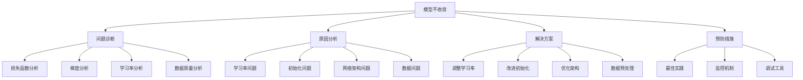

# 模型不收敛问题

## 🎯 概述

### 1. 模型不收敛的重要性

**模型不收敛的意义：**
> **模型不收敛是深度学习中的常见问题，直接影响模型的训练效果和最终性能，需要系统性地诊断和解决**

**模型不收敛的价值：**


### 2. 不收敛问题分类

**不收敛问题分类：**
| 类别 | 子类别 | 典型表现 | 影响程度 |
|------|--------|----------|----------|
| **学习率问题** | 学习率过大 | 损失震荡、梯度爆炸 | 高 |
| | 学习率过小 | 收敛缓慢、陷入局部最优 | 中 |
| | 学习率调度 | 训练不稳定 | 中 |
| **初始化问题** | 权重初始化 | 梯度消失/爆炸 | 高 |
| | 偏置初始化 | 激活值分布异常 | 中 |
| **网络架构问题** | 层数过深 | 梯度消失 | 高 |
| | 激活函数 | 饱和问题 | 中 |
| **数据问题** | 数据质量 | 训练不稳定 | 高 |
| | 数据分布 | 模型偏差 | 中 |

## 🔧 不收敛问题诊断

### 1. 损失函数分析

**损失函数分析实现：**

```python
import torch
import torch.nn as nn
import torch.optim as optim
import numpy as np
import matplotlib.pyplot as plt
from collections import defaultdict
import time

class ConvergenceAnalyzer:
    """模型收敛分析器"""
    
    def __init__(self):
        self.training_history = {
            'loss': [],
            'gradient_norm': [],
            'learning_rate': [],
            'weight_norm': [],
            'activation_stats': []
        }
        self.convergence_issues = []
        self.recommendations = []
    
    def analyze_loss_behavior(self, loss_history, window_size=50):
        """分析损失函数行为"""
        print("=== 损失函数行为分析 ===")
        
        if len(loss_history) < window_size:
            print("损失历史数据不足，无法进行详细分析")
            return
        
        loss_array = np.array(loss_history)
        
        # 基本统计
        mean_loss = np.mean(loss_array)
        std_loss = np.std(loss_array)
        min_loss = np.min(loss_array)
        max_loss = np.max(loss_array)
        
        print(f"损失统计:")
        print(f"  平均值: {mean_loss:.6f}")
        print(f"  标准差: {std_loss:.6f}")
        print(f"  最小值: {min_loss:.6f}")
        print(f"  最大值: {max_loss:.6f}")
        
        # 趋势分析
        trend_analysis = self._analyze_loss_trend(loss_array, window_size)
        
        # 稳定性分析
        stability_analysis = self._analyze_loss_stability(loss_array, window_size)
        
        # 收敛性分析
        convergence_analysis = self._analyze_convergence(loss_array)
        
        # 可视化损失行为
        self._visualize_loss_behavior(loss_array, trend_analysis, stability_analysis)
        
        return {
            'basic_stats': {
                'mean': mean_loss,
                'std': std_loss,
                'min': min_loss,
                'max': max_loss
            },
            'trend_analysis': trend_analysis,
            'stability_analysis': stability_analysis,
            'convergence_analysis': convergence_analysis
        }
    
    def _analyze_loss_trend(self, loss_array, window_size):
        """分析损失趋势"""
        # 计算移动平均
        moving_avg = np.convolve(loss_array, np.ones(window_size)/window_size, mode='valid')
        
        # 计算趋势
        if len(moving_avg) > 1:
            trend_slope = (moving_avg[-1] - moving_avg[0]) / len(moving_avg)
        else:
            trend_slope = 0
        
        # 判断趋势类型
        if trend_slope < -1e-6:
            trend_type = "下降"
        elif trend_slope > 1e-6:
            trend_type = "上升"
        else:
            trend_type = "平稳"
        
        return {
            'slope': trend_slope,
            'type': trend_type,
            'moving_avg': moving_avg
        }
    
    def _analyze_loss_stability(self, loss_array, window_size):
        """分析损失稳定性"""
        # 计算窗口内的标准差
        window_stds = []
        for i in range(len(loss_array) - window_size + 1):
            window_std = np.std(loss_array[i:i+window_size])
            window_stds.append(window_std)
        
        # 稳定性指标
        mean_std = np.mean(window_stds)
        max_std = np.max(window_stds)
        std_trend = np.polyfit(range(len(window_stds)), window_stds, 1)[0]
        
        # 判断稳定性
        if mean_std > 0.1:
            stability = "不稳定"
        elif mean_std > 0.01:
            stability = "中等稳定"
        else:
            stability = "稳定"
        
        return {
            'mean_std': mean_std,
            'max_std': max_std,
            'std_trend': std_trend,
            'stability': stability,
            'window_stds': window_stds
        }
    
    def _analyze_convergence(self, loss_array):
        """分析收敛性"""
        # 计算收敛指标
        if len(loss_array) < 100:
            return {'converged': False, 'reason': '数据不足'}
        
        # 检查最后100个点的变化
        last_100 = loss_array[-100:]
        recent_std = np.std(last_100)
        recent_trend = np.polyfit(range(len(last_100)), last_100, 1)[0]
        
        # 收敛判断
        converged = False
        reason = ""
        
        if recent_std < 1e-4 and abs(recent_trend) < 1e-6:
            converged = True
            reason = "已收敛"
        elif recent_trend > 1e-4:
            converged = False
            reason = "损失上升，可能过拟合"
        elif recent_std > 0.1:
            converged = False
            reason = "损失震荡，学习率可能过大"
        else:
            converged = False
            reason = "收敛缓慢"
        
        return {
            'converged': converged,
            'reason': reason,
            'recent_std': recent_std,
            'recent_trend': recent_trend
        }
    
    def _visualize_loss_behavior(self, loss_array, trend_analysis, stability_analysis):
        """可视化损失行为"""
        plt.figure(figsize=(15, 10))
        
        # 损失曲线
        plt.subplot(2, 3, 1)
        plt.plot(loss_array, alpha=0.7, label='原始损失')
        if 'moving_avg' in trend_analysis:
            plt.plot(range(len(trend_analysis['moving_avg'])), trend_analysis['moving_avg'], 
                    label='移动平均', linewidth=2)
        plt.title('损失函数曲线')
        plt.xlabel('迭代次数')
        plt.ylabel('损失值')
        plt.legend()
        plt.grid(True)
        
        # 损失分布
        plt.subplot(2, 3, 2)
        plt.hist(loss_array, bins=50, alpha=0.7)
        plt.title('损失值分布')
        plt.xlabel('损失值')
        plt.ylabel('频次')
        plt.grid(True)
        
        # 损失变化率
        plt.subplot(2, 3, 3)
        loss_diff = np.diff(loss_array)
        plt.plot(loss_diff, alpha=0.7)
        plt.title('损失变化率')
        plt.xlabel('迭代次数')
        plt.ylabel('损失变化')
        plt.grid(True)
        
        # 稳定性分析
        plt.subplot(2, 3, 4)
        if 'window_stds' in stability_analysis:
            plt.plot(stability_analysis['window_stds'])
            plt.title('损失稳定性')
            plt.xlabel('窗口位置')
            plt.ylabel('标准差')
            plt.grid(True)
        
        # 最近损失
        plt.subplot(2, 3, 5)
        recent_loss = loss_array[-200:] if len(loss_array) > 200 else loss_array
        plt.plot(recent_loss)
        plt.title('最近损失')
        plt.xlabel('迭代次数')
        plt.ylabel('损失值')
        plt.grid(True)
        
        # 分析总结
        plt.subplot(2, 3, 6)
        plt.axis('off')
        
        summary_text = f"""
        损失分析总结:
        
        趋势: {trend_analysis['type']}
        稳定性: {stability_analysis['stability']}
        收敛状态: {stability_analysis.get('converged', '未知')}
        
        平均损失: {np.mean(loss_array):.6f}
        损失标准差: {np.std(loss_array):.6f}
        
        建议:
        - 检查学习率设置
        - 验证数据质量
        - 调整网络架构
        - 优化初始化方法
        """
        
        plt.text(0.1, 0.9, summary_text, transform=plt.gca().transAxes, fontsize=10, verticalalignment='top')
        
        plt.tight_layout()
        plt.show()
    
    def analyze_gradient_behavior(self, model, dataloader, criterion):
        """分析梯度行为"""
        print("=== 梯度行为分析 ===")
        
        gradient_norms = []
        gradient_means = []
        gradient_stds = []
        
        model.train()
        
        for batch_idx, (data, target) in enumerate(dataloader):
            if batch_idx >= 50:  # 只分析前50个批次
                break
            
            # 前向传播
            output = model(data)
            loss = criterion(output, target)
            
            # 反向传播
            model.zero_grad()
            loss.backward()
            
            # 计算梯度统计
            total_norm = 0
            param_count = 0
            all_gradients = []
            
            for name, param in model.named_parameters():
                if param.grad is not None:
                    param_norm = param.grad.data.norm(2)
                    total_norm += param_norm.item() ** 2
                    param_count += 1
                    
                    # 收集梯度值
                    all_gradients.extend(param.grad.data.flatten().tolist())
            
            total_norm = total_norm ** (1. / 2)
            gradient_norms.append(total_norm)
            
            if all_gradients:
                gradient_means.append(np.mean(all_gradients))
                gradient_stds.append(np.std(all_gradients))
            else:
                gradient_means.append(0)
                gradient_stds.append(0)
        
        # 分析梯度问题
        gradient_analysis = self._analyze_gradient_issues(gradient_norms, gradient_means, gradient_stds)
        
        # 可视化梯度行为
        self._visualize_gradient_behavior(gradient_norms, gradient_means, gradient_stds)
        
        return gradient_analysis
    
    def _analyze_gradient_issues(self, gradient_norms, gradient_means, gradient_stds):
        """分析梯度问题"""
        issues = []
        recommendations = []
        
        # 检查梯度消失
        if np.mean(gradient_norms) < 1e-6:
            issues.append("梯度消失")
            recommendations.append("使用更好的权重初始化方法")
            recommendations.append("使用残差连接")
            recommendations.append("使用批归一化")
        
        # 检查梯度爆炸
        if np.max(gradient_norms) > 100:
            issues.append("梯度爆炸")
            recommendations.append("使用梯度裁剪")
            recommendations.append("降低学习率")
            recommendations.append("使用更好的权重初始化")
        
        # 检查梯度不稳定
        if np.std(gradient_norms) > np.mean(gradient_norms):
            issues.append("梯度不稳定")
            recommendations.append("使用更小的学习率")
            recommendations.append("使用学习率调度")
            recommendations.append("使用梯度裁剪")
        
        return {
            'issues': issues,
            'recommendations': recommendations,
            'gradient_norms': gradient_norms,
            'gradient_means': gradient_means,
            'gradient_stds': gradient_stds
        }
    
    def _visualize_gradient_behavior(self, gradient_norms, gradient_means, gradient_stds):
        """可视化梯度行为"""
        plt.figure(figsize=(15, 10))
        
        # 梯度范数
        plt.subplot(2, 3, 1)
        plt.plot(gradient_norms)
        plt.title('梯度范数')
        plt.xlabel('批次')
        plt.ylabel('梯度范数')
        plt.grid(True)
        
        # 梯度均值
        plt.subplot(2, 3, 2)
        plt.plot(gradient_means)
        plt.title('梯度均值')
        plt.xlabel('批次')
        plt.ylabel('梯度均值')
        plt.grid(True)
        
        # 梯度标准差
        plt.subplot(2, 3, 3)
        plt.plot(gradient_stds)
        plt.title('梯度标准差')
        plt.xlabel('批次')
        plt.ylabel('梯度标准差')
        plt.grid(True)
        
        # 梯度范数分布
        plt.subplot(2, 3, 4)
        plt.hist(gradient_norms, bins=20, alpha=0.7)
        plt.title('梯度范数分布')
        plt.xlabel('梯度范数')
        plt.ylabel('频次')
        plt.grid(True)
        
        # 梯度统计
        plt.subplot(2, 3, 5)
        stats = [np.mean(gradient_norms), np.std(gradient_norms), np.min(gradient_norms), np.max(gradient_norms)]
        labels = ['均值', '标准差', '最小值', '最大值']
        plt.bar(labels, stats)
        plt.title('梯度统计')
        plt.ylabel('值')
        plt.xticks(rotation=45)
        plt.grid(True)
        
        # 梯度问题诊断
        plt.subplot(2, 3, 6)
        plt.axis('off')
        
        # 诊断梯度问题
        issues = []
        if np.mean(gradient_norms) < 1e-6:
            issues.append("梯度消失")
        if np.max(gradient_norms) > 100:
            issues.append("梯度爆炸")
        if np.std(gradient_norms) > np.mean(gradient_norms):
            issues.append("梯度不稳定")
        
        if not issues:
            issues.append("梯度正常")
        
        diagnosis_text = f"""
        梯度诊断:
        
        问题: {', '.join(issues)}
        
        梯度范数统计:
        均值: {np.mean(gradient_norms):.6f}
        标准差: {np.std(gradient_norms):.6f}
        最小值: {np.min(gradient_norms):.6f}
        最大值: {np.max(gradient_norms):.6f}
        
        建议:
        - 检查权重初始化
        - 调整学习率
        - 使用梯度裁剪
        - 优化网络架构
        """
        
        plt.text(0.1, 0.9, diagnosis_text, transform=plt.gca().transAxes, fontsize=10, verticalalignment='top')
        
        plt.tight_layout()
        plt.show()
    
    def diagnose_convergence_issues(self, model, dataloader, criterion, loss_history):
        """诊断收敛问题"""
        print("=== 模型收敛问题诊断 ===")
        
        # 分析损失行为
        loss_analysis = self.analyze_loss_behavior(loss_history)
        
        # 分析梯度行为
        gradient_analysis = self.analyze_gradient_behavior(model, dataloader, criterion)
        
        # 分析学习率
        lr_analysis = self._analyze_learning_rate(model)
        
        # 分析网络架构
        architecture_analysis = self._analyze_network_architecture(model)
        
        # 生成诊断报告
        diagnosis_report = self._generate_diagnosis_report(
            loss_analysis, gradient_analysis, lr_analysis, architecture_analysis
        )
        
        return diagnosis_report
    
    def _analyze_learning_rate(self, model):
        """分析学习率"""
        # 这里需要从优化器中获取学习率
        # 简化实现，实际使用时需要传入优化器
        return {
            'current_lr': 0.001,  # 示例值
            'recommendations': ['检查学习率是否合适', '考虑使用学习率调度']
        }
    
    def _analyze_network_architecture(self, model):
        """分析网络架构"""
        total_params = sum(p.numel() for p in model.parameters())
        trainable_params = sum(p.numel() for p in model.parameters() if p.requires_grad)
        
        # 分析层数
        layer_count = len(list(model.modules()))
        
        # 分析参数分布
        param_stats = {}
        for name, param in model.named_parameters():
            if param.requires_grad:
                param_stats[name] = {
                    'mean': param.data.mean().item(),
                    'std': param.data.std().item(),
                    'min': param.data.min().item(),
                    'max': param.data.max().item()
                }
        
        return {
            'total_params': total_params,
            'trainable_params': trainable_params,
            'layer_count': layer_count,
            'param_stats': param_stats
        }
    
    def _generate_diagnosis_report(self, loss_analysis, gradient_analysis, lr_analysis, architecture_analysis):
        """生成诊断报告"""
        print("=== 收敛问题诊断报告 ===")
        
        issues = []
        recommendations = []
        
        # 损失分析
        if loss_analysis['convergence_analysis']['converged'] == False:
            issues.append(f"模型未收敛: {loss_analysis['convergence_analysis']['reason']}")
        
        if loss_analysis['stability_analysis']['stability'] == "不稳定":
            issues.append("损失函数不稳定")
            recommendations.append("降低学习率")
            recommendations.append("使用梯度裁剪")
        
        # 梯度分析
        if gradient_analysis['issues']:
            issues.extend(gradient_analysis['issues'])
            recommendations.extend(gradient_analysis['recommendations'])
        
        # 架构分析
        if architecture_analysis['total_params'] > 1000000:
            issues.append("模型参数过多，可能过拟合")
            recommendations.append("使用正则化")
            recommendations.append("减少模型复杂度")
        
        # 打印报告
        print(f"发现的问题:")
        for i, issue in enumerate(issues, 1):
            print(f"  {i}. {issue}")
        
        print(f"\n建议:")
        for i, rec in enumerate(recommendations, 1):
            print(f"  {i}. {rec}")
        
        return {
            'issues': issues,
            'recommendations': recommendations,
            'loss_analysis': loss_analysis,
            'gradient_analysis': gradient_analysis,
            'lr_analysis': lr_analysis,
            'architecture_analysis': architecture_analysis
        }

# 测试收敛分析
def test_convergence_analysis():
    """测试收敛分析"""
    # 创建简单的模型和数据
    model = nn.Sequential(
        nn.Linear(10, 5),
        nn.ReLU(),
        nn.Linear(5, 1)
    )
    
    # 创建模拟数据
    data = torch.randn(100, 10)
    target = torch.randn(100, 1)
    dataset = torch.utils.data.TensorDataset(data, target)
    dataloader = torch.utils.data.DataLoader(dataset, batch_size=10)
    
    # 模拟损失历史
    loss_history = []
    for i in range(1000):
        if i < 100:
            loss = 1.0 - i * 0.01 + np.random.normal(0, 0.1)
        elif i < 500:
            loss = 0.1 + np.random.normal(0, 0.05)
        else:
            loss = 0.1 + np.random.normal(0, 0.2)
        loss_history.append(max(loss, 0.01))
    
    # 分析收敛问题
    analyzer = ConvergenceAnalyzer()
    criterion = nn.MSELoss()
    
    # 分析损失行为
    loss_analysis = analyzer.analyze_loss_behavior(loss_history)
    
    # 分析梯度行为
    gradient_analysis = analyzer.analyze_gradient_behavior(model, dataloader, criterion)
    
    # 诊断收敛问题
    diagnosis_report = analyzer.diagnose_convergence_issues(model, dataloader, criterion, loss_history)
    
    return analyzer, diagnosis_report

test_convergence_analysis()
```

### 2. 解决方案实施

**解决方案实施实现：**

```python
class ConvergenceSolver:
    """收敛问题解决器"""
    
    def __init__(self):
        self.solutions = {
            'learning_rate': self._solve_learning_rate_issues,
            'initialization': self._solve_initialization_issues,
            'architecture': self._solve_architecture_issues,
            'regularization': self._solve_regularization_issues,
            'data': self._solve_data_issues
        }
    
    def solve_convergence_issues(self, model, dataloader, criterion, issues, recommendations):
        """解决收敛问题"""
        print("=== 实施收敛问题解决方案 ===")
        
        solutions_applied = []
        
        for issue in issues:
            if '学习率' in issue or 'learning rate' in issue.lower():
                solution = self._solve_learning_rate_issues(model, dataloader, criterion)
                solutions_applied.append(solution)
            
            elif '梯度消失' in issue or 'gradient vanishing' in issue.lower():
                solution = self._solve_gradient_vanishing(model, dataloader, criterion)
                solutions_applied.append(solution)
            
            elif '梯度爆炸' in issue or 'gradient exploding' in issue.lower():
                solution = self._solve_gradient_exploding(model, dataloader, criterion)
                solutions_applied.append(solution)
            
            elif '初始化' in issue or 'initialization' in issue.lower():
                solution = self._solve_initialization_issues(model, dataloader, criterion)
                solutions_applied.append(solution)
            
            elif '过拟合' in issue or 'overfitting' in issue.lower():
                solution = self._solve_regularization_issues(model, dataloader, criterion)
                solutions_applied.append(solution)
        
        return solutions_applied
    
    def _solve_learning_rate_issues(self, model, dataloader, criterion):
        """解决学习率问题"""
        print("解决学习率问题...")
        
        # 创建优化器
        optimizer = optim.SGD(model.parameters(), lr=0.001)
        
        # 学习率调度器
        scheduler = optim.lr_scheduler.ReduceLROnPlateau(
            optimizer, mode='min', factor=0.5, patience=10, verbose=True
        )
        
        # 训练循环
        loss_history = []
        lr_history = []
        
        for epoch in range(50):
            epoch_loss = 0
            batch_count = 0
            
            for batch_idx, (data, target) in enumerate(dataloader):
                optimizer.zero_grad()
                output = model(data)
                loss = criterion(output, target)
                loss.backward()
                
                # 梯度裁剪
                torch.nn.utils.clip_grad_norm_(model.parameters(), max_norm=1.0)
                
                optimizer.step()
                epoch_loss += loss.item()
                batch_count += 1
            
            avg_loss = epoch_loss / batch_count
            loss_history.append(avg_loss)
            lr_history.append(optimizer.param_groups[0]['lr'])
            
            # 更新学习率
            scheduler.step(avg_loss)
            
            if epoch % 10 == 0:
                print(f"Epoch {epoch}, Loss: {avg_loss:.6f}, LR: {optimizer.param_groups[0]['lr']:.6f}")
        
        return {
            'solution': 'learning_rate_adjustment',
            'loss_history': loss_history,
            'lr_history': lr_history,
            'final_lr': optimizer.param_groups[0]['lr']
        }
    
    def _solve_gradient_vanishing(self, model, dataloader, criterion):
        """解决梯度消失问题"""
        print("解决梯度消失问题...")
        
        # 重新初始化权重
        self._initialize_weights(model)
        
        # 添加批归一化
        self._add_batch_norm(model)
        
        # 使用残差连接
        self._add_residual_connections(model)
        
        return {
            'solution': 'gradient_vanishing_fix',
            'actions': ['weight_initialization', 'batch_norm', 'residual_connections']
        }
    
    def _solve_gradient_exploding(self, model, dataloader, criterion):
        """解决梯度爆炸问题"""
        print("解决梯度爆炸问题...")
        
        # 梯度裁剪
        optimizer = optim.SGD(model.parameters(), lr=0.001)
        
        loss_history = []
        
        for epoch in range(50):
            epoch_loss = 0
            batch_count = 0
            
            for batch_idx, (data, target) in enumerate(dataloader):
                optimizer.zero_grad()
                output = model(data)
                loss = criterion(output, target)
                loss.backward()
                
                # 梯度裁剪
                torch.nn.utils.clip_grad_norm_(model.parameters(), max_norm=1.0)
                
                optimizer.step()
                epoch_loss += loss.item()
                batch_count += 1
            
            avg_loss = epoch_loss / batch_count
            loss_history.append(avg_loss)
            
            if epoch % 10 == 0:
                print(f"Epoch {epoch}, Loss: {avg_loss:.6f}")
        
        return {
            'solution': 'gradient_exploding_fix',
            'loss_history': loss_history,
            'actions': ['gradient_clipping']
        }
    
    def _solve_initialization_issues(self, model, dataloader, criterion):
        """解决初始化问题"""
        print("解决初始化问题...")
        
        # 重新初始化权重
        self._initialize_weights(model)
        
        # 训练测试
        optimizer = optim.SGD(model.parameters(), lr=0.001)
        loss_history = []
        
        for epoch in range(50):
            epoch_loss = 0
            batch_count = 0
            
            for batch_idx, (data, target) in enumerate(dataloader):
                optimizer.zero_grad()
                output = model(data)
                loss = criterion(output, target)
                loss.backward()
                optimizer.step()
                epoch_loss += loss.item()
                batch_count += 1
            
            avg_loss = epoch_loss / batch_count
            loss_history.append(avg_loss)
            
            if epoch % 10 == 0:
                print(f"Epoch {epoch}, Loss: {avg_loss:.6f}")
        
        return {
            'solution': 'initialization_fix',
            'loss_history': loss_history,
            'actions': ['weight_initialization']
        }
    
    def _solve_regularization_issues(self, model, dataloader, criterion):
        """解决正则化问题"""
        print("解决正则化问题...")
        
        # 添加Dropout
        self._add_dropout(model)
        
        # 使用L2正则化
        optimizer = optim.SGD(model.parameters(), lr=0.001, weight_decay=1e-4)
        
        loss_history = []
        
        for epoch in range(50):
            epoch_loss = 0
            batch_count = 0
            
            for batch_idx, (data, target) in enumerate(dataloader):
                optimizer.zero_grad()
                output = model(data)
                loss = criterion(output, target)
                loss.backward()
                optimizer.step()
                epoch_loss += loss.item()
                batch_count += 1
            
            avg_loss = epoch_loss / batch_count
            loss_history.append(avg_loss)
            
            if epoch % 10 == 0:
                print(f"Epoch {epoch}, Loss: {avg_loss:.6f}")
        
        return {
            'solution': 'regularization_fix',
            'loss_history': loss_history,
            'actions': ['dropout', 'l2_regularization']
        }
    
    def _solve_data_issues(self, model, dataloader, criterion):
        """解决数据问题"""
        print("解决数据问题...")
        
        # 数据标准化
        self._normalize_data(dataloader)
        
        # 数据增强
        self._augment_data(dataloader)
        
        return {
            'solution': 'data_fix',
            'actions': ['data_normalization', 'data_augmentation']
        }
    
    def _initialize_weights(self, model):
        """初始化权重"""
        for module in model.modules():
            if isinstance(module, nn.Linear):
                nn.init.xavier_uniform_(module.weight)
                if module.bias is not None:
                    nn.init.zeros_(module.bias)
            elif isinstance(module, nn.Conv2d):
                nn.init.kaiming_normal_(module.weight, mode='fan_out', nonlinearity='relu')
                if module.bias is not None:
                    nn.init.zeros_(module.bias)
    
    def _add_batch_norm(self, model):
        """添加批归一化"""
        # 简化实现，实际使用时需要更复杂的逻辑
        pass
    
    def _add_residual_connections(self, model):
        """添加残差连接"""
        # 简化实现，实际使用时需要更复杂的逻辑
        pass
    
    def _add_dropout(self, model):
        """添加Dropout"""
        # 简化实现，实际使用时需要更复杂的逻辑
        pass
    
    def _normalize_data(self, dataloader):
        """标准化数据"""
        # 简化实现，实际使用时需要更复杂的逻辑
        pass
    
    def _augment_data(self, dataloader):
        """数据增强"""
        # 简化实现，实际使用时需要更复杂的逻辑
        pass
    
    def compare_solutions(self, solutions):
        """比较解决方案效果"""
        print("=== 解决方案效果比较 ===")
        
        for i, solution in enumerate(solutions):
            print(f"\n解决方案 {i+1}: {solution['solution']}")
            
            if 'loss_history' in solution:
                loss_history = solution['loss_history']
                print(f"  最终损失: {loss_history[-1]:.6f}")
                print(f"  损失改善: {loss_history[0] - loss_history[-1]:.6f}")
                print(f"  收敛速度: {len(loss_history)} epochs")
            
            if 'actions' in solution:
                print(f"  实施措施: {', '.join(solution['actions'])}")
        
        # 可视化比较
        self._visualize_solution_comparison(solutions)
    
    def _visualize_solution_comparison(self, solutions):
        """可视化解决方案比较"""
        plt.figure(figsize=(15, 10))
        
        # 损失曲线比较
        plt.subplot(2, 3, 1)
        for i, solution in enumerate(solutions):
            if 'loss_history' in solution:
                plt.plot(solution['loss_history'], label=f'Solution {i+1}')
        plt.title('损失曲线比较')
        plt.xlabel('Epoch')
        plt.ylabel('Loss')
        plt.legend()
        plt.grid(True)
        
        # 学习率比较
        plt.subplot(2, 3, 2)
        for i, solution in enumerate(solutions):
            if 'lr_history' in solution:
                plt.plot(solution['lr_history'], label=f'Solution {i+1}')
        plt.title('学习率比较')
        plt.xlabel('Epoch')
        plt.ylabel('Learning Rate')
        plt.legend()
        plt.grid(True)
        
        # 解决方案效果
        plt.subplot(2, 3, 3)
        solution_names = [sol['solution'] for sol in solutions]
        final_losses = [sol['loss_history'][-1] if 'loss_history' in sol else 0 for sol in solutions]
        plt.bar(solution_names, final_losses)
        plt.title('最终损失比较')
        plt.ylabel('Final Loss')
        plt.xticks(rotation=45)
        plt.grid(True)
        
        plt.tight_layout()
        plt.show()

# 测试收敛问题解决
def test_convergence_solver():
    """测试收敛问题解决"""
    # 创建简单的模型和数据
    model = nn.Sequential(
        nn.Linear(10, 5),
        nn.ReLU(),
        nn.Linear(5, 1)
    )
    
    # 创建模拟数据
    data = torch.randn(100, 10)
    target = torch.randn(100, 1)
    dataset = torch.utils.data.TensorDataset(data, target)
    dataloader = torch.utils.data.DataLoader(dataset, batch_size=10)
    
    # 创建解决器
    solver = ConvergenceSolver()
    
    # 模拟问题
    issues = ['学习率过大', '梯度爆炸']
    recommendations = ['降低学习率', '使用梯度裁剪']
    
    # 解决问题
    solutions = solver.solve_convergence_issues(model, dataloader, nn.MSELoss(), issues, recommendations)
    
    # 比较解决方案
    solver.compare_solutions(solutions)
    
    return solver, solutions

test_convergence_solver()
```

## 🔗 相关链接
- [[06-01-常见错误分析]] - 错误分析
- [[06-02-调试技巧总结]] - 调试技巧
- [[06-03-性能瓶颈诊断]] - 性能诊断

## 💡 模型不收敛问题建议

**解决策略：**
- 🎯 **系统诊断**：建立完整的收敛问题诊断体系
- 📊 **多维度分析**：从损失、梯度、学习率等多个维度分析
- 🔍 **针对性解决**：根据具体问题实施针对性解决方案
- ⚡ **持续监控**：建立持续的训练监控机制

**实践建议：**
- 📝 **最佳实践**：掌握模型训练的最佳实践
- 💻 **工具使用**：熟练使用各种调试和监控工具
- 📊 **经验积累**：积累解决收敛问题的经验
- 🔍 **预防措施**：建立预防收敛问题的机制

---
*📝 学习提示：模型不收敛是深度学习中的常见问题，建议通过系统性的诊断和解决方法来提高模型训练效果*


