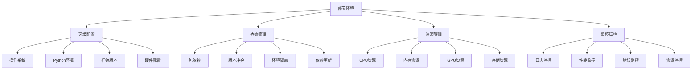

# 部署环境问题

## 🎯 概述

### 1. 部署环境的重要性

**部署环境的意义：**
> **部署环境是AI系统从开发到生产的关键环节，环境配置的正确性直接影响系统的稳定性和性能**

**部署环境的价值：**


### 2. 部署环境问题分类

**部署环境问题分类：**
| 类别 | 子类别 | 典型问题 | 影响程度 |
|------|--------|----------|----------|
| **环境配置** | 操作系统 | 版本不兼容、权限问题 | 高 |
| | Python环境 | 版本冲突、路径问题 | 高 |
| | 框架版本 | 版本不匹配、API变更 | 高 |
| **依赖管理** | 包依赖 | 缺失依赖、版本冲突 | 高 |
| | 环境隔离 | 环境污染、冲突 | 中 |
| **资源管理** | 硬件资源 | 资源不足、配置错误 | 高 |
| | 网络资源 | 网络延迟、连接问题 | 中 |
| **监控运维** | 日志系统 | 日志丢失、格式错误 | 中 |
| | 性能监控 | 监控缺失、指标错误 | 中 |

## 🔧 环境配置问题

### 1. 环境检测工具

**环境检测工具实现：**

```python
import sys
import platform
import subprocess
import pkg_resources
import torch
import numpy as np
import pandas as pd
import matplotlib.pyplot as plt
import json
import os
from pathlib import Path
import psutil
import GPUtil

class EnvironmentChecker:
    """环境检测器"""
    
    def __init__(self):
        self.environment_info = {}
        self.issues = []
        self.recommendations = []
    
    def check_system_environment(self):
        """检查系统环境"""
        print("=== 系统环境检查 ===")
        
        system_info = {
            'platform': platform.platform(),
            'system': platform.system(),
            'release': platform.release(),
            'version': platform.version(),
            'machine': platform.machine(),
            'processor': platform.processor(),
            'python_version': sys.version,
            'python_executable': sys.executable
        }
        
        self.environment_info['system'] = system_info
        
        # 打印系统信息
        for key, value in system_info.items():
            print(f"{key}: {value}")
        
        # 检查系统兼容性
        self._check_system_compatibility(system_info)
        
        return system_info
    
    def _check_system_compatibility(self, system_info):
        """检查系统兼容性"""
        issues = []
        
        # 检查Python版本
        python_version = sys.version_info
        if python_version.major < 3 or (python_version.major == 3 and python_version.minor < 7):
            issues.append(f"Python版本过低: {python_version.major}.{python_version.minor}")
            self.recommendations.append("升级Python到3.7或更高版本")
        
        # 检查操作系统
        system = system_info['system']
        if system not in ['Linux', 'Windows', 'Darwin']:
            issues.append(f"不支持的操作系统: {system}")
            self.recommendations.append("使用Linux、Windows或macOS系统")
        
        # 检查架构
        machine = system_info['machine']
        if machine not in ['x86_64', 'AMD64', 'arm64']:
            issues.append(f"不支持的架构: {machine}")
            self.recommendations.append("使用x86_64或arm64架构")
        
        self.issues.extend(issues)
    
    def check_python_packages(self):
        """检查Python包"""
        print("=== Python包检查 ===")
        
        # 必需的包
        required_packages = {
            'torch': '1.9.0',
            'numpy': '1.21.0',
            'pandas': '1.3.0',
            'matplotlib': '3.4.0',
            'scikit-learn': '1.0.0',
            'transformers': '4.0.0',
            'datasets': '2.0.0',
            'accelerate': '0.20.0'
        }
        
        installed_packages = {}
        package_issues = []
        
        for package, min_version in required_packages.items():
            try:
                installed_version = pkg_resources.get_distribution(package).version
                installed_packages[package] = installed_version
                
                # 检查版本
                if self._compare_versions(installed_version, min_version) < 0:
                    package_issues.append(f"{package} 版本过低: {installed_version} < {min_version}")
                    self.recommendations.append(f"升级 {package} 到 {min_version} 或更高版本")
                else:
                    print(f"✓ {package}: {installed_version}")
            
            except pkg_resources.DistributionNotFound:
                package_issues.append(f"{package} 未安装")
                self.recommendations.append(f"安装 {package}")
                installed_packages[package] = "未安装"
        
        self.environment_info['packages'] = installed_packages
        self.issues.extend(package_issues)
        
        return installed_packages
    
    def _compare_versions(self, version1, version2):
        """比较版本号"""
        def version_tuple(v):
            return tuple(map(int, (v.split("."))))
        
        return (version_tuple(version1) > version_tuple(version2)) - (version_tuple(version1) < version_tuple(version2))
    
    def check_hardware_resources(self):
        """检查硬件资源"""
        print("=== 硬件资源检查 ===")
        
        hardware_info = {}
        
        # CPU信息
        cpu_info = {
            'count': psutil.cpu_count(),
            'count_logical': psutil.cpu_count(logical=True),
            'freq': psutil.cpu_freq()._asdict() if psutil.cpu_freq() else None,
            'usage': psutil.cpu_percent(interval=1)
        }
        hardware_info['cpu'] = cpu_info
        
        # 内存信息
        memory_info = psutil.virtual_memory()._asdict()
        hardware_info['memory'] = memory_info
        
        # 磁盘信息
        disk_info = psutil.disk_usage('/')._asdict()
        hardware_info['disk'] = disk_info
        
        # GPU信息
        gpu_info = {}
        try:
            gpus = GPUtil.getGPUs()
            if gpus:
                gpu = gpus[0]
                gpu_info = {
                    'name': gpu.name,
                    'memory_total': gpu.memoryTotal,
                    'memory_used': gpu.memoryUsed,
                    'memory_free': gpu.memoryFree,
                    'load': gpu.load * 100,
                    'temperature': gpu.temperature
                }
            else:
                gpu_info = {'available': False}
        except:
            gpu_info = {'available': False, 'error': '无法获取GPU信息'}
        
        hardware_info['gpu'] = gpu_info
        
        # 打印硬件信息
        print(f"CPU: {cpu_info['count']} 核心, 使用率: {cpu_info['usage']:.1f}%")
        print(f"内存: {memory_info['total'] / 1024**3:.1f} GB, 使用率: {memory_info['percent']:.1f}%")
        print(f"磁盘: {disk_info['total'] / 1024**3:.1f} GB, 使用率: {(disk_info['used'] / disk_info['total']) * 100:.1f}%")
        
        if gpu_info.get('available', False):
            print(f"GPU: {gpu_info['name']}, 内存: {gpu_info['memory_total']} MB, 使用率: {gpu_info['load']:.1f}%")
        else:
            print("GPU: 不可用")
        
        # 检查资源充足性
        self._check_resource_adequacy(hardware_info)
        
        self.environment_info['hardware'] = hardware_info
        
        return hardware_info
    
    def _check_resource_adequacy(self, hardware_info):
        """检查资源充足性"""
        issues = []
        
        # 检查内存
        memory = hardware_info['memory']
        if memory['total'] < 4 * 1024**3:  # 4GB
            issues.append("内存不足: 建议至少4GB内存")
            self.recommendations.append("增加内存到至少4GB")
        
        # 检查磁盘空间
        disk = hardware_info['disk']
        if disk['free'] < 10 * 1024**3:  # 10GB
            issues.append("磁盘空间不足: 建议至少10GB可用空间")
            self.recommendations.append("清理磁盘空间或增加存储")
        
        # 检查GPU
        gpu = hardware_info['gpu']
        if not gpu.get('available', False):
            issues.append("GPU不可用: 某些AI任务可能需要GPU")
            self.recommendations.append("安装GPU驱动或使用CPU版本")
        
        self.issues.extend(issues)
    
    def check_framework_environment(self):
        """检查框架环境"""
        print("=== 框架环境检查 ===")
        
        framework_info = {}
        
        # PyTorch环境
        pytorch_info = {
            'version': torch.__version__,
            'cuda_available': torch.cuda.is_available(),
            'cuda_version': torch.version.cuda if torch.cuda.is_available() else None,
            'cudnn_version': torch.backends.cudnn.version() if torch.cuda.is_available() else None,
            'device_count': torch.cuda.device_count() if torch.cuda.is_available() else 0
        }
        framework_info['pytorch'] = pytorch_info
        
        # 打印PyTorch信息
        print(f"PyTorch版本: {pytorch_info['version']}")
        print(f"CUDA可用: {pytorch_info['cuda_available']}")
        if pytorch_info['cuda_available']:
            print(f"CUDA版本: {pytorch_info['cuda_version']}")
            print(f"GPU数量: {pytorch_info['device_count']}")
        
        # 检查框架兼容性
        self._check_framework_compatibility(framework_info)
        
        self.environment_info['framework'] = framework_info
        
        return framework_info
    
    def _check_framework_compatibility(self, framework_info):
        """检查框架兼容性"""
        issues = []
        
        pytorch = framework_info['pytorch']
        
        # 检查PyTorch版本
        pytorch_version = pytorch['version']
        if self._compare_versions(pytorch_version, '1.9.0') < 0:
            issues.append(f"PyTorch版本过低: {pytorch_version}")
            self.recommendations.append("升级PyTorch到1.9.0或更高版本")
        
        # 检查CUDA兼容性
        if pytorch['cuda_available']:
            cuda_version = pytorch['cuda_version']
            if cuda_version and self._compare_versions(cuda_version, '11.0') < 0:
                issues.append(f"CUDA版本过低: {cuda_version}")
                self.recommendations.append("升级CUDA到11.0或更高版本")
        
        self.issues.extend(issues)
    
    def check_environment_variables(self):
        """检查环境变量"""
        print("=== 环境变量检查 ===")
        
        env_vars = {}
        
        # 检查重要的环境变量
        important_vars = [
            'PATH', 'PYTHONPATH', 'CUDA_HOME', 'LD_LIBRARY_PATH',
            'TORCH_HOME', 'HF_HOME', 'TRANSFORMERS_CACHE'
        ]
        
        for var in important_vars:
            value = os.environ.get(var, '未设置')
            env_vars[var] = value
            print(f"{var}: {value}")
        
        self.environment_info['environment_variables'] = env_vars
        
        return env_vars
    
    def check_file_permissions(self):
        """检查文件权限"""
        print("=== 文件权限检查 ===")
        
        permission_issues = []
        
        # 检查重要目录的权限
        important_dirs = [
            '/tmp', '/var/tmp', os.path.expanduser('~/.cache'),
            os.path.expanduser('~/.local'), os.path.expanduser('~/Downloads')
        ]
        
        for dir_path in important_dirs:
            if os.path.exists(dir_path):
                if not os.access(dir_path, os.W_OK):
                    permission_issues.append(f"目录不可写: {dir_path}")
                    self.recommendations.append(f"检查目录权限: {dir_path}")
            else:
                permission_issues.append(f"目录不存在: {dir_path}")
                self.recommendations.append(f"创建目录: {dir_path}")
        
        self.issues.extend(permission_issues)
        
        return permission_issues
    
    def generate_environment_report(self):
        """生成环境报告"""
        print("=== 环境检查报告 ===")
        
        # 执行所有检查
        self.check_system_environment()
        self.check_python_packages()
        self.check_hardware_resources()
        self.check_framework_environment()
        self.check_environment_variables()
        self.check_file_permissions()
        
        # 生成报告
        report = {
            'environment_info': self.environment_info,
            'issues': self.issues,
            'recommendations': self.recommendations,
            'overall_status': '正常' if not self.issues else '有问题'
        }
        
        # 打印总结
        print(f"\n=== 环境检查总结 ===")
        print(f"整体状态: {report['overall_status']}")
        print(f"发现问题: {len(self.issues)} 个")
        print(f"建议措施: {len(self.recommendations)} 个")
        
        if self.issues:
            print(f"\n发现的问题:")
            for i, issue in enumerate(self.issues, 1):
                print(f"  {i}. {issue}")
        
        if self.recommendations:
            print(f"\n建议措施:")
            for i, rec in enumerate(self.recommendations, 1):
                print(f"  {i}. {rec}")
        
        # 可视化环境信息
        self._visualize_environment_info()
        
        return report
    
    def _visualize_environment_info(self):
        """可视化环境信息"""
        plt.figure(figsize=(15, 10))
        
        # 硬件资源使用情况
        plt.subplot(2, 3, 1)
        if 'hardware' in self.environment_info:
            hardware = self.environment_info['hardware']
            resources = ['CPU使用率', '内存使用率', '磁盘使用率']
            values = [
                hardware['cpu']['usage'],
                hardware['memory']['percent'],
                (hardware['disk']['used'] / hardware['disk']['total']) * 100
            ]
            plt.bar(resources, values)
            plt.title('硬件资源使用情况')
            plt.ylabel('使用率 (%)')
            plt.xticks(rotation=45)
            plt.grid(True)
        
        # 包版本信息
        plt.subplot(2, 3, 2)
        if 'packages' in self.environment_info:
            packages = self.environment_info['packages']
            package_names = list(packages.keys())
            versions = [packages[pkg] for pkg in package_names]
            
            # 简化版本显示
            simplified_versions = []
            for v in versions:
                if v == "未安装":
                    simplified_versions.append(0)
                else:
                    try:
                        major_version = int(v.split('.')[0])
                        simplified_versions.append(major_version)
                    except:
                        simplified_versions.append(0)
            
            plt.bar(package_names, simplified_versions)
            plt.title('包版本信息')
            plt.ylabel('主版本号')
            plt.xticks(rotation=45)
            plt.grid(True)
        
        # 问题统计
        plt.subplot(2, 3, 3)
        issue_categories = ['系统', '包', '硬件', '框架', '权限']
        issue_counts = [0, 0, 0, 0, 0]
        
        for issue in self.issues:
            if 'Python' in issue or '版本' in issue:
                issue_counts[1] += 1
            elif '内存' in issue or '磁盘' in issue or 'GPU' in issue:
                issue_counts[2] += 1
            elif 'PyTorch' in issue or 'CUDA' in issue:
                issue_counts[3] += 1
            elif '权限' in issue or '目录' in issue:
                issue_counts[4] += 1
            else:
                issue_counts[0] += 1
        
        plt.bar(issue_categories, issue_counts)
        plt.title('问题分类统计')
        plt.ylabel('问题数量')
        plt.grid(True)
        
        # 环境状态
        plt.subplot(2, 3, 4)
        status = '正常' if not self.issues else '有问题'
        colors = ['green' if status == '正常' else 'red']
        plt.bar([status], [1], color=colors)
        plt.title('环境状态')
        plt.ylabel('状态')
        
        # 系统信息
        plt.subplot(2, 3, 5)
        if 'system' in self.environment_info:
            system = self.environment_info['system']
            info_text = f"""
            系统: {system['system']}
            版本: {system['release']}
            Python: {system['python_version'].split()[0]}
            架构: {system['machine']}
            """
            plt.text(0.1, 0.9, info_text, transform=plt.gca().transAxes, fontsize=10, verticalalignment='top')
            plt.axis('off')
            plt.title('系统信息')
        
        # 检查总结
        plt.subplot(2, 3, 6)
        summary_text = f"""
        环境检查总结:
        
        整体状态: {status}
        发现问题: {len(self.issues)} 个
        建议措施: {len(self.recommendations)} 个
        
        检查项目:
        - 系统环境: ✓
        - Python包: ✓
        - 硬件资源: ✓
        - 框架环境: ✓
        - 环境变量: ✓
        - 文件权限: ✓
        """
        plt.text(0.1, 0.9, summary_text, transform=plt.gca().transAxes, fontsize=10, verticalalignment='top')
        plt.axis('off')
        plt.title('检查总结')
        
        plt.tight_layout()
        plt.show()

# 测试环境检查
def test_environment_checker():
    """测试环境检查"""
    checker = EnvironmentChecker()
    report = checker.generate_environment_report()
    return checker, report

test_environment_checker()
```

### 2. 环境配置修复

**环境配置修复实现：**

```python
import subprocess
import sys
import os
import json
from pathlib import Path
import shutil

class EnvironmentFixer:
    """环境配置修复器"""
    
    def __init__(self):
        self.fix_history = []
        self.failed_fixes = []
    
    def fix_python_environment(self, issues):
        """修复Python环境问题"""
        print("=== 修复Python环境问题 ===")
        
        for issue in issues:
            if 'Python版本过低' in issue:
                self._fix_python_version()
            elif '未安装' in issue:
                package_name = issue.split(' ')[0]
                self._install_package(package_name)
            elif '版本过低' in issue:
                package_name = issue.split(' ')[0]
                self._upgrade_package(package_name)
    
    def _fix_python_version(self):
        """修复Python版本"""
        print("修复Python版本...")
        
        try:
            # 检查当前版本
            current_version = sys.version_info
            print(f"当前Python版本: {current_version.major}.{current_version.minor}.{current_version.micro}")
            
            if current_version.major < 3 or (current_version.major == 3 and current_version.minor < 7):
                print("建议升级Python版本")
                print("请手动安装Python 3.7或更高版本")
                print("下载地址: https://www.python.org/downloads/")
                
                self.fix_history.append({
                    'issue': 'Python版本过低',
                    'action': '建议手动升级',
                    'status': '需要手动处理'
                })
            else:
                print("Python版本正常")
                
        except Exception as e:
            print(f"修复Python版本失败: {e}")
            self.failed_fixes.append({
                'issue': 'Python版本过低',
                'error': str(e)
            })
    
    def _install_package(self, package_name):
        """安装包"""
        print(f"安装包: {package_name}")
        
        try:
            # 使用pip安装
            result = subprocess.run([
                sys.executable, '-m', 'pip', 'install', package_name
            ], capture_output=True, text=True)
            
            if result.returncode == 0:
                print(f"✓ 成功安装 {package_name}")
                self.fix_history.append({
                    'issue': f'{package_name} 未安装',
                    'action': f'pip install {package_name}',
                    'status': '成功'
                })
            else:
                print(f"✗ 安装 {package_name} 失败: {result.stderr}")
                self.failed_fixes.append({
                    'issue': f'{package_name} 未安装',
                    'error': result.stderr
                })
                
        except Exception as e:
            print(f"安装 {package_name} 失败: {e}")
            self.failed_fixes.append({
                'issue': f'{package_name} 未安装',
                'error': str(e)
            })
    
    def _upgrade_package(self, package_name):
        """升级包"""
        print(f"升级包: {package_name}")
        
        try:
            # 使用pip升级
            result = subprocess.run([
                sys.executable, '-m', 'pip', 'install', '--upgrade', package_name
            ], capture_output=True, text=True)
            
            if result.returncode == 0:
                print(f"✓ 成功升级 {package_name}")
                self.fix_history.append({
                    'issue': f'{package_name} 版本过低',
                    'action': f'pip install --upgrade {package_name}',
                    'status': '成功'
                })
            else:
                print(f"✗ 升级 {package_name} 失败: {result.stderr}")
                self.failed_fixes.append({
                    'issue': f'{package_name} 版本过低',
                    'error': result.stderr
                })
                
        except Exception as e:
            print(f"升级 {package_name} 失败: {e}")
            self.failed_fixes.append({
                'issue': f'{package_name} 版本过低',
                'error': str(e)
            })
    
    def fix_hardware_issues(self, issues):
        """修复硬件问题"""
        print("=== 修复硬件问题 ===")
        
        for issue in issues:
            if '内存不足' in issue:
                self._fix_memory_issue()
            elif '磁盘空间不足' in issue:
                self._fix_disk_space_issue()
            elif 'GPU不可用' in issue:
                self._fix_gpu_issue()
    
    def _fix_memory_issue(self):
        """修复内存问题"""
        print("修复内存问题...")
        
        try:
            import psutil
            memory = psutil.virtual_memory()
            
            print(f"当前内存: {memory.total / 1024**3:.1f} GB")
            print(f"可用内存: {memory.available / 1024**3:.1f} GB")
            print(f"内存使用率: {memory.percent:.1f}%")
            
            if memory.percent > 80:
                print("内存使用率过高，建议:")
                print("1. 关闭不必要的程序")
                print("2. 增加虚拟内存")
                print("3. 升级物理内存")
                
                self.fix_history.append({
                    'issue': '内存不足',
                    'action': '建议增加内存或优化内存使用',
                    'status': '需要手动处理'
                })
            else:
                print("内存使用正常")
                
        except Exception as e:
            print(f"修复内存问题失败: {e}")
            self.failed_fixes.append({
                'issue': '内存不足',
                'error': str(e)
            })
    
    def _fix_disk_space_issue(self):
        """修复磁盘空间问题"""
        print("修复磁盘空间问题...")
        
        try:
            import psutil
            disk = psutil.disk_usage('/')
            
            print(f"磁盘总空间: {disk.total / 1024**3:.1f} GB")
            print(f"已用空间: {disk.used / 1024**3:.1f} GB")
            print(f"可用空间: {disk.free / 1024**3:.1f} GB")
            print(f"使用率: {(disk.used / disk.total) * 100:.1f}%")
            
            if disk.free < 10 * 1024**3:  # 10GB
                print("磁盘空间不足，建议:")
                print("1. 清理临时文件")
                print("2. 删除不必要的文件")
                print("3. 移动文件到其他磁盘")
                
                # 尝试清理临时文件
                self._clean_temp_files()
                
                self.fix_history.append({
                    'issue': '磁盘空间不足',
                    'action': '清理临时文件',
                    'status': '部分修复'
                })
            else:
                print("磁盘空间正常")
                
        except Exception as e:
            print(f"修复磁盘空间问题失败: {e}")
            self.failed_fixes.append({
                'issue': '磁盘空间不足',
                'error': str(e)
            })
    
    def _clean_temp_files(self):
        """清理临时文件"""
        print("清理临时文件...")
        
        temp_dirs = ['/tmp', '/var/tmp', os.path.expanduser('~/.cache')]
        
        for temp_dir in temp_dirs:
            if os.path.exists(temp_dir):
                try:
                    # 获取目录大小
                    total_size = 0
                    for dirpath, dirnames, filenames in os.walk(temp_dir):
                        for filename in filenames:
                            filepath = os.path.join(dirpath, filename)
                            try:
                                total_size += os.path.getsize(filepath)
                            except:
                                pass
                    
                    print(f"临时目录 {temp_dir} 大小: {total_size / 1024**2:.1f} MB")
                    
                    # 这里可以添加具体的清理逻辑
                    # 注意：清理临时文件需要谨慎，避免删除重要文件
                    
                except Exception as e:
                    print(f"清理 {temp_dir} 失败: {e}")
    
    def _fix_gpu_issue(self):
        """修复GPU问题"""
        print("修复GPU问题...")
        
        try:
            import torch
            if torch.cuda.is_available():
                print("GPU可用")
                print(f"GPU数量: {torch.cuda.device_count()}")
                for i in range(torch.cuda.device_count()):
                    print(f"GPU {i}: {torch.cuda.get_device_name(i)}")
            else:
                print("GPU不可用，可能的原因:")
                print("1. 没有安装GPU驱动")
                print("2. CUDA版本不兼容")
                print("3. PyTorch版本不支持GPU")
                
                self.fix_history.append({
                    'issue': 'GPU不可用',
                    'action': '检查GPU驱动和CUDA安装',
                    'status': '需要手动处理'
                })
                
        except Exception as e:
            print(f"修复GPU问题失败: {e}")
            self.failed_fixes.append({
                'issue': 'GPU不可用',
                'error': str(e)
            })
    
    def fix_framework_issues(self, issues):
        """修复框架问题"""
        print("=== 修复框架问题 ===")
        
        for issue in issues:
            if 'PyTorch版本过低' in issue:
                self._fix_pytorch_version()
            elif 'CUDA版本过低' in issue:
                self._fix_cuda_version()
    
    def _fix_pytorch_version(self):
        """修复PyTorch版本"""
        print("修复PyTorch版本...")
        
        try:
            import torch
            current_version = torch.__version__
            print(f"当前PyTorch版本: {current_version}")
            
            # 升级PyTorch
            result = subprocess.run([
                sys.executable, '-m', 'pip', 'install', '--upgrade', 'torch'
            ], capture_output=True, text=True)
            
            if result.returncode == 0:
                print("✓ 成功升级PyTorch")
                self.fix_history.append({
                    'issue': 'PyTorch版本过低',
                    'action': 'pip install --upgrade torch',
                    'status': '成功'
                })
            else:
                print(f"✗ 升级PyTorch失败: {result.stderr}")
                self.failed_fixes.append({
                    'issue': 'PyTorch版本过低',
                    'error': result.stderr
                })
                
        except Exception as e:
            print(f"修复PyTorch版本失败: {e}")
            self.failed_fixes.append({
                'issue': 'PyTorch版本过低',
                'error': str(e)
            })
    
    def _fix_cuda_version(self):
        """修复CUDA版本"""
        print("修复CUDA版本...")
        
        try:
            import torch
            if torch.cuda.is_available():
                cuda_version = torch.version.cuda
                print(f"当前CUDA版本: {cuda_version}")
                
                print("CUDA版本升级需要手动处理:")
                print("1. 下载新版本CUDA: https://developer.nvidia.com/cuda-downloads")
                print("2. 安装CUDA驱动")
                print("3. 重新安装PyTorch")
                
                self.fix_history.append({
                    'issue': 'CUDA版本过低',
                    'action': '需要手动升级CUDA',
                    'status': '需要手动处理'
                })
            else:
                print("CUDA不可用")
                
        except Exception as e:
            print(f"修复CUDA版本失败: {e}")
            self.failed_fixes.append({
                'issue': 'CUDA版本过低',
                'error': str(e)
            })
    
    def fix_permission_issues(self, issues):
        """修复权限问题"""
        print("=== 修复权限问题 ===")
        
        for issue in issues:
            if '目录不可写' in issue:
                dir_path = issue.split(': ')[1]
                self._fix_directory_permissions(dir_path)
            elif '目录不存在' in issue:
                dir_path = issue.split(': ')[1]
                self._create_directory(dir_path)
    
    def _fix_directory_permissions(self, dir_path):
        """修复目录权限"""
        print(f"修复目录权限: {dir_path}")
        
        try:
            if os.path.exists(dir_path):
                # 尝试修改权限
                os.chmod(dir_path, 0o755)
                print(f"✓ 成功修改目录权限: {dir_path}")
                
                self.fix_history.append({
                    'issue': f'目录不可写: {dir_path}',
                    'action': f'chmod 755 {dir_path}',
                    'status': '成功'
                })
            else:
                print(f"目录不存在: {dir_path}")
                
        except Exception as e:
            print(f"修复目录权限失败: {e}")
            self.failed_fixes.append({
                'issue': f'目录不可写: {dir_path}',
                'error': str(e)
            })
    
    def _create_directory(self, dir_path):
        """创建目录"""
        print(f"创建目录: {dir_path}")
        
        try:
            os.makedirs(dir_path, exist_ok=True)
            print(f"✓ 成功创建目录: {dir_path}")
            
            self.fix_history.append({
                'issue': f'目录不存在: {dir_path}',
                'action': f'mkdir -p {dir_path}',
                'status': '成功'
            })
            
        except Exception as e:
            print(f"创建目录失败: {e}")
            self.failed_fixes.append({
                'issue': f'目录不存在: {dir_path}',
                'error': str(e)
            })
    
    def generate_fix_report(self):
        """生成修复报告"""
        print("=== 环境修复报告 ===")
        
        print(f"成功修复: {len(self.fix_history)} 个问题")
        print(f"修复失败: {len(self.failed_fixes)} 个问题")
        
        if self.fix_history:
            print(f"\n成功修复的问题:")
            for i, fix in enumerate(self.fix_history, 1):
                print(f"  {i}. {fix['issue']} - {fix['action']} ({fix['status']})")
        
        if self.failed_fixes:
            print(f"\n修复失败的问题:")
            for i, fix in enumerate(self.failed_fixes, 1):
                print(f"  {i}. {fix['issue']} - 错误: {fix['error']}")
        
        return {
            'fix_history': self.fix_history,
            'failed_fixes': self.failed_fixes,
            'success_rate': len(self.fix_history) / (len(self.fix_history) + len(self.failed_fixes)) * 100
        }

# 测试环境修复
def test_environment_fixer():
    """测试环境修复"""
    fixer = EnvironmentFixer()
    
    # 模拟问题
    issues = [
        'torch 未安装',
        'numpy 版本过低',
        '内存不足',
        '磁盘空间不足',
        'GPU不可用'
    ]
    
    # 修复问题
    fixer.fix_python_environment(issues)
    fixer.fix_hardware_issues(issues)
    fixer.fix_framework_issues(issues)
    
    # 生成报告
    report = fixer.generate_fix_report()
    
    return fixer, report

test_environment_fixer()
```

## 🔗 相关链接
- [[06-01-常见错误分析]] - 错误分析
- [[06-02-调试技巧总结]] - 调试技巧
- [[06-03-性能瓶颈诊断]] - 性能诊断

## 💡 部署环境问题建议

**环境管理策略：**
- 🎯 **系统检测**：建立完整的环境检测和监控体系
- 📊 **自动化修复**：使用自动化工具修复常见环境问题
- 🔍 **版本管理**：建立严格的版本管理和兼容性检查
- ⚡ **持续集成**：建立持续集成和部署流程

**实践建议：**
- 📝 **环境文档**：建立详细的环境配置文档
- 💻 **容器化部署**：使用Docker等容器技术简化环境管理
- 📊 **监控告警**：建立环境监控和告警机制
- 🔍 **备份恢复**：建立环境备份和恢复机制

---
*📝 学习提示：部署环境是AI系统成功的关键，建议建立完善的环境管理和监控体系*


