# 知识体系总结

## 🎯 概述

### 1. 知识体系架构

**AI知识体系全景：**
> **构建完整的AI知识体系，从基础认知到前沿应用，形成系统性的学习路径和实践框架**

**知识体系结构：**

```mermaid
graph TD
    A[AI知识体系] --> B[基础认知层]
    A --> C[理解层]
    A --> D[应用层]
    A --> E[前沿技术]
    A --> F[实践项目]
    A --> G[问题解决]
    
    B --> B1[AI基本概念]
    B --> B2[数学基础]
    B --> B3[编程基础]
    
    C --> C1[机器学习核心]
    C --> C2[深度学习基础]
    C --> C3[算法与模型]
    
    D --> D1[计算机视觉]
    D --> D2[自然语言处理]
    D --> D3[实际应用领域]
    D --> D4[工程实践]
    
    E --> E1[大语言模型]
    E --> E2[多模态学习]
    E --> E3[生成式AI]
    E --> E4[其他前沿技术]
    
    F --> F1[图像分类器]
    F --> F2[情感分析系统]
    F --> F3[推荐系统]
    F --> F4[聊天机器人]
    F --> F5[大模型微调]
    
    G --> G1[错误分析]
    G --> G2[调试技巧]
    G --> G3[性能诊断]
    G --> G4[数据质量]
    G --> G5[模型收敛]
    G --> G6[部署环境]
```

### 2. 知识层次关系

**知识层次关系：**
| 层次 | 内容 | 依赖关系 | 学习目标 |
|------|------|----------|----------|
| **基础认知层** | 概念、数学、编程 | 无 | 建立基础认知 |
| **理解层** | 算法、模型、原理 | 基础认知层 | 深入理解原理 |
| **应用层** | 具体应用、工程实践 | 理解层 | 实际应用能力 |
| **前沿技术** | 最新技术、发展趋势 | 应用层 | 前沿技术掌握 |
| **实践项目** | 完整项目实现 | 应用层 | 综合实践能力 |
| **问题解决** | 问题诊断、解决方案 | 全层次 | 问题解决能力 |

## 🔧 核心知识点总结

### 1. 基础认知层总结

**AI基本概念：**
- **定义与分类**：弱AI、强AI、超AI的分类体系
- **发展历程**：从符号主义到连接主义的历史演进
- **技术方法**：符号主义、连接主义、行为主义三大流派
- **应用领域**：计算机视觉、自然语言处理、机器人等
- **伦理影响**：AI伦理、社会影响、责任问题

**数学基础：**
- **线性代数**：向量、矩阵、张量运算，特征值分解
- **概率统计**：概率分布、贝叶斯定理、假设检验
- **微积分**：导数、积分、梯度、优化理论
- **信息论**：熵、交叉熵、KL散度、互信息

**编程基础：**
- **Python语法**：基础语法、数据结构、面向对象
- **数据处理**：NumPy数组操作、Pandas数据分析
- **可视化**：Matplotlib绘图、数据可视化技巧
- **开发环境**：Jupyter使用、调试技巧、最佳实践

### 2. 理解层总结

**机器学习核心：**
- **监督学习**：回归、分类、损失函数、优化算法
- **无监督学习**：聚类、降维、关联规则挖掘
- **强化学习**：智能体、环境、奖励、策略学习
- **模型评估**：交叉验证、性能指标、模型选择
- **正则化**：过拟合、欠拟合、L1/L2正则化

**深度学习基础：**
- **神经网络**：感知机、多层感知机、反向传播
- **激活函数**：ReLU、Sigmoid、Tanh等函数特性
- **优化算法**：SGD、Adam、RMSprop等优化器
- **网络架构**：CNN、RNN、Transformer等架构
- **梯度问题**：梯度消失、梯度爆炸、解决方案

**算法与模型：**
- **经典算法**：线性回归、逻辑回归、决策树、SVM
- **深度学习模型**：CNN、RNN、LSTM、Transformer
- **集成学习**：Bagging、Boosting、Stacking
- **模型选择**：超参数调优、模型比较、选择策略

### 3. 应用层总结

**计算机视觉：**
- **图像处理**：预处理、特征提取、图像增强
- **目标检测**：YOLO、R-CNN、SSD等算法
- **图像分割**：语义分割、实例分割、全景分割
- **人脸识别**：特征提取、人脸检测、识别系统
- **应用案例**：医疗影像、自动驾驶、安防监控

**自然语言处理：**
- **文本预处理**：分词、去停用词、词性标注
- **词向量**：Word2Vec、GloVe、BERT等表示方法
- **语言模型**：N-gram、RNN、Transformer模型
- **大语言模型**：GPT、BERT、T5等预训练模型
- **应用案例**：机器翻译、文本摘要、问答系统

**实际应用领域：**
- **推荐系统**：协同过滤、内容过滤、混合推荐
- **自动驾驶**：感知、决策、控制技术
- **医疗AI**：医学影像、药物发现、诊断辅助
- **金融AI**：风险控制、量化交易、智能投顾
- **工程实践**：MLOps、模型部署、性能优化

### 4. 前沿技术总结

**大语言模型技术：**
- **预训练模型**：GPT、BERT、T5等架构
- **微调技术**：LoRA、Adapter、Prompt Tuning
- **多模态融合**：文本、图像、音频多模态学习
- **应用场景**：对话系统、代码生成、创意写作

**生成式AI技术：**
- **生成模型**：GAN、VAE、Diffusion Model
- **图像生成**：DALL-E、Midjourney、Stable Diffusion
- **文本生成**：GPT系列、ChatGPT、Claude
- **视频生成**：Sora、Runway、Pika等模型

**其他前沿技术：**
- **多模态学习**：跨模态理解、多模态融合
- **联邦学习**：隐私保护、分布式训练
- **神经架构搜索**：自动化网络设计
- **量子机器学习**：量子计算与AI结合
- **边缘AI计算**：移动端、嵌入式AI部署

## 🔧 实践项目总结

### 1. 项目实现概览

**项目1-图像分类器：**
- **技术栈**：CNN、PyTorch、数据增强
- **核心功能**：图像预处理、模型训练、性能评估
- **学习要点**：卷积神经网络、图像数据处理、模型优化

**项目2-情感分析系统：**
- **技术栈**：NLP、文本预处理、分类算法
- **核心功能**：文本理解、特征提取、情感分类
- **学习要点**：自然语言处理、文本挖掘、情感分析

**项目3-推荐系统：**
- **技术栈**：协同过滤、矩阵分解、混合推荐
- **核心功能**：用户建模、物品建模、推荐生成
- **学习要点**：推荐算法、用户行为分析、系统设计

**项目4-聊天机器人：**
- **技术栈**：NLP、对话管理、响应生成
- **核心功能**：意图识别、实体提取、对话管理
- **学习要点**：对话系统、自然语言理解、多轮对话

**项目5-大模型微调：**
- **技术栈**：Transformer、预训练模型、微调技术
- **核心功能**：数据准备、模型微调、性能评估
- **学习要点**：大语言模型、迁移学习、模型优化

### 2. 项目技能总结

**技术技能：**
- **编程能力**：Python、PyTorch、数据处理
- **算法理解**：机器学习、深度学习算法
- **系统设计**：架构设计、模块化开发
- **性能优化**：模型优化、系统优化

**工程技能：**
- **项目管理**：需求分析、任务分解、进度管理
- **代码质量**：代码规范、测试、文档
- **部署运维**：环境配置、模型部署、监控
- **问题解决**：调试、性能分析、问题定位

## 🔧 问题解决能力总结

### 1. 问题诊断能力

**错误分析：**
- **数据错误**：缺失值、异常值、格式问题
- **模型错误**：架构问题、参数问题、训练问题
- **代码错误**：语法错误、逻辑错误、性能错误

**调试技巧：**
- **日志调试**：结构化日志、日志分析
- **断点调试**：智能断点、动态调试
- **性能分析**：性能监控、瓶颈诊断

### 2. 解决方案能力

**性能优化：**
- **系统监控**：CPU、内存、GPU、I/O监控
- **应用分析**：函数分析、内存分析、逐行分析
- **优化策略**：算法优化、代码优化、架构优化

**问题修复：**
- **数据质量**：完整性检测、准确性检测、一致性检测
- **模型收敛**：损失分析、梯度分析、收敛诊断
- **部署环境**：环境检测、配置修复、依赖管理

## 🔧 学习成果评估

### 1. 知识掌握程度

**基础认知层：**
- ✅ **AI概念**：完全掌握AI定义、分类、发展历程
- ✅ **数学基础**：熟练掌握线性代数、概率统计、微积分
- ✅ **编程基础**：熟练使用Python、NumPy、Pandas等工具

**理解层：**
- ✅ **机器学习**：深入理解监督、无监督、强化学习
- ✅ **深度学习**：掌握神经网络、反向传播、优化算法
- ✅ **算法模型**：理解经典算法和深度学习模型

**应用层：**
- ✅ **计算机视觉**：掌握图像处理、目标检测、图像分割
- ✅ **自然语言处理**：掌握文本处理、词向量、语言模型
- ✅ **工程实践**：掌握MLOps、模型部署、性能优化

### 2. 实践能力评估

**项目实现能力：**
- ✅ **图像分类器**：能够独立实现CNN图像分类系统
- ✅ **情感分析**：能够构建完整的情感分析系统
- ✅ **推荐系统**：能够实现多种推荐算法
- ✅ **聊天机器人**：能够构建对话系统
- ✅ **大模型微调**：能够进行模型微调和优化

**问题解决能力：**
- ✅ **错误诊断**：能够快速定位和诊断问题
- ✅ **性能优化**：能够进行系统性能分析和优化
- ✅ **环境管理**：能够处理部署环境问题

### 3. 综合能力评估

**技术能力：**
- **算法理解**：深入理解各种AI算法原理
- **编程实现**：能够将算法转化为代码实现
- **系统设计**：能够设计完整的AI系统架构
- **性能优化**：能够优化系统性能和效率

**工程能力：**
- **项目管理**：能够管理AI项目开发流程
- **代码质量**：能够编写高质量的代码
- **部署运维**：能够部署和维护AI系统
- **团队协作**：能够与团队协作开发项目

## 🔧 未来学习方向

### 1. 技术深化方向

**算法研究：**
- **理论研究**：深入理解算法数学原理
- **新算法**：关注最新算法发展
- **算法优化**：研究算法优化方法

**系统架构：**
- **分布式系统**：大规模分布式AI系统
- **边缘计算**：边缘AI部署和优化
- **云原生**：云原生AI系统设计

### 2. 应用拓展方向

**垂直领域：**
- **医疗AI**：医学影像、药物发现
- **金融AI**：风险控制、量化交易
- **教育AI**：个性化学习、智能辅导

**跨领域融合：**
- **AI+IoT**：物联网与AI结合
- **AI+区块链**：区块链与AI融合
- **AI+量子**：量子计算与AI结合

### 3. 职业发展路径

**技术专家：**
- **算法工程师**：专注于算法研究和优化
- **系统架构师**：专注于系统架构设计
- **技术专家**：在特定领域成为专家

**管理岗位：**
- **技术经理**：管理技术团队和项目
- **产品经理**：负责AI产品规划和管理
- **技术总监**：负责技术战略和规划

## 🔗 相关链接
- [[99-02-学习心得与反思]] - 学习心得
- [[99-03-未来学习规划]] - 学习规划
- [[99-04-常用工具与资源]] - 工具资源

## 💡 知识体系建议

**学习策略：**
- 🎯 **系统性学习**：按照知识体系结构系统学习
- 📊 **实践导向**：通过项目实践巩固理论知识
- 🔍 **问题驱动**：通过解决问题提升能力
- ⚡ **持续更新**：关注技术发展，持续学习

**实践建议：**
- 📝 **知识整理**：建立个人知识库和笔记系统
- 💻 **项目实践**：通过完整项目提升实践能力
- 📊 **经验总结**：定期总结学习经验和心得
- 🔍 **技术分享**：通过分享加深理解和记忆

---
*📝 学习提示：知识体系总结是学习的重要环节，建议定期回顾和更新知识体系，形成完整的学习闭环*

