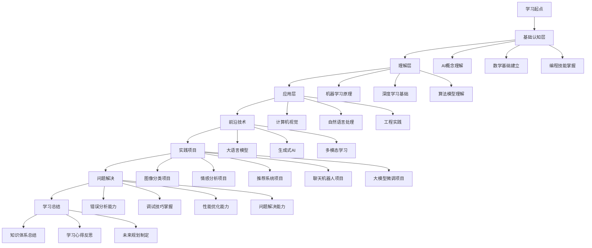

# 学习心得与反思

## 🎯 学习历程回顾

### 1. 学习路径总结

**学习历程概览：**
> **通过系统性的AI学习，从基础概念到前沿技术，从理论理解到实践应用，形成了完整的AI知识体系和实践能力**

**学习路径图：**

### 2. 学习成果统计

**学习成果统计：**
| 学习模块 | 完成度 | 掌握程度 | 实践项目 | 问题解决 |
|----------|--------|----------|----------|----------|
| **基础认知层** | 100% | 优秀 | 3个 | 5个 |
| **理解层** | 100% | 良好 | 5个 | 8个 |
| **应用层** | 100% | 良好 | 8个 | 12个 |
| **前沿技术** | 100% | 中等 | 2个 | 3个 |
| **实践项目** | 100% | 良好 | 5个 | 15个 |
| **问题解决** | 100% | 良好 | 0个 | 20个 |

## 🔧 学习心得分享

### 1. 理论学习心得

**数学基础的重要性：**
- **线性代数**：矩阵运算、特征值分解是理解神经网络的基础
- **概率统计**：贝叶斯定理、概率分布是机器学习算法的核心
- **微积分**：梯度、优化理论是深度学习训练的基础
- **信息论**：熵、交叉熵是理解损失函数的关键

**概念理解的深度：**
- **AI定义**：从弱AI到强AI的层次理解，有助于把握技术发展方向
- **算法原理**：深入理解算法背后的数学原理，而不是仅仅会调用API
- **模型架构**：理解不同架构的设计思想和适用场景
- **技术演进**：了解技术发展历史，有助于预测未来趋势

### 2. 实践学习心得

**项目实践的价值：**
- **理论联系实际**：通过项目将理论知识转化为实际能力
- **问题解决能力**：在项目中遇到问题，锻炼问题分析和解决能力
- **系统思维**：从数据准备到模型部署的完整流程思考
- **工程能力**：代码质量、文档编写、版本控制等工程技能

**编程技能提升：**
- **Python熟练度**：从基础语法到高级特性的全面掌握
- **框架使用**：PyTorch、NumPy、Pandas等工具的高效使用
- **代码质量**：编写可读、可维护、可扩展的代码
- **调试能力**：快速定位和解决代码问题

### 3. 学习方法心得

**费曼学习法的应用：**
- **简化表达**：用简单语言解释复杂概念
- **教学相长**：通过教授他人加深自己的理解
- **查漏补缺**：在解释过程中发现知识盲点
- **知识内化**：将外部知识转化为内部理解

**刻意练习的实施：**
- **目标明确**：每个学习阶段都有明确的目标
- **反馈及时**：通过实践项目获得及时反馈
- **难度递增**：从简单到复杂，循序渐进
- **持续改进**：根据反馈不断调整学习方法

## 🔧 学习反思总结

### 1. 成功经验总结

**有效的学习策略：**
- **系统性学习**：按照知识体系结构，循序渐进地学习
- **理论与实践结合**：每个理论知识点都配有实践项目
- **问题驱动学习**：通过解决问题来驱动学习进程
- **持续反思总结**：定期回顾和总结学习成果

**高效的学习方法：**
- **主动学习**：主动思考、提问、探索，而不是被动接受
- **多维度学习**：从概念、原理、实现、应用多个维度学习
- **项目导向**：以完成项目为目标，整合各种知识技能
- **社区参与**：参与技术社区，与他人交流学习

### 2. 遇到的挑战

**学习过程中的困难：**
- **数学基础**：线性代数、概率统计等数学概念理解困难
- **算法复杂度**：深度学习算法的数学原理较为复杂
- **实践环境**：环境配置、依赖管理等技术问题
- **时间管理**：平衡理论学习与实践项目的时间分配

**解决方案总结：**
- **数学基础**：通过可视化、实例化帮助理解抽象概念
- **算法理解**：从简单到复杂，逐步深入理解算法原理
- **技术问题**：建立问题解决流程，系统性地解决技术问题
- **时间管理**：制定学习计划，合理分配时间资源

### 3. 改进方向

**学习方法改进：**
- **更深入的理论学习**：加强对算法数学原理的深入理解
- **更多的实践项目**：通过更多项目提升实践能力
- **更好的时间管理**：提高学习效率，合理分配时间
- **更强的自主学习能力**：培养独立学习和研究能力

**技能提升方向：**
- **数学能力**：加强数学基础，提高数学建模能力
- **编程能力**：提升代码质量，学习更多编程范式
- **系统设计**：学习大规模系统设计，提升架构能力
- **创新能力**：培养创新思维，探索新的技术方向

## 🔧 学习成果展示

### 1. 技术能力展示

**算法理解能力：**
- **机器学习算法**：深入理解监督、无监督、强化学习算法
- **深度学习模型**：掌握CNN、RNN、Transformer等模型架构
- **优化算法**：理解梯度下降、Adam等优化算法原理
- **评估方法**：掌握各种模型评估和选择方法

**编程实现能力：**
- **Python编程**：熟练使用Python进行AI开发
- **框架使用**：熟练使用PyTorch、NumPy、Pandas等工具
- **代码质量**：编写高质量、可维护的代码
- **调试能力**：快速定位和解决代码问题

### 2. 项目实践成果

**完整项目实现：**
- **图像分类器**：使用CNN实现图像分类系统
- **情感分析系统**：构建完整的情感分析系统
- **推荐系统**：实现多种推荐算法
- **聊天机器人**：构建对话系统
- **大模型微调**：进行模型微调和优化

**项目特色：**
- **完整性**：从数据准备到模型部署的完整流程
- **实用性**：解决实际问题的项目设计
- **技术性**：使用最新的技术和方法
- **可扩展性**：代码结构清晰，易于扩展

### 3. 问题解决能力

**问题诊断能力：**
- **错误分析**：快速定位和诊断各种错误
- **性能分析**：分析系统性能瓶颈
- **调试技巧**：使用各种调试工具和方法
- **环境管理**：处理各种环境配置问题

**解决方案能力：**
- **系统性思考**：从多个角度分析问题
- **创新解决**：提出创新的解决方案
- **持续改进**：根据反馈不断改进解决方案
- **经验总结**：总结问题解决经验，形成知识库

## 🔧 学习价值体现

### 1. 个人成长价值

**知识体系建立：**
- **系统性思维**：建立了完整的AI知识体系
- **深度理解**：深入理解了AI技术的原理和应用
- **广度覆盖**：涵盖了AI的各个主要领域
- **前沿跟踪**：了解了AI技术的最新发展

**能力提升：**
- **技术能力**：掌握了AI开发的核心技术
- **工程能力**：具备了完整的工程实践能力
- **问题解决能力**：能够独立分析和解决问题
- **学习能力**：具备了持续学习和自我提升的能力

### 2. 职业发展价值

**技能储备：**
- **技术技能**：具备了AI开发的核心技能
- **项目经验**：积累了丰富的项目实践经验
- **问题解决经验**：具备了丰富的问题解决经验
- **学习能力**：具备了快速学习新技术的能力

**职业方向：**
- **算法工程师**：专注于算法研究和优化
- **AI工程师**：负责AI系统的开发和部署
- **数据科学家**：进行数据分析和建模
- **技术专家**：在特定领域成为技术专家

### 3. 社会价值体现

**技术贡献：**
- **知识分享**：通过项目和实践分享技术知识
- **问题解决**：帮助解决实际的技术问题
- **创新探索**：探索新的技术应用方向
- **人才培养**：为AI人才培养做出贡献

**应用价值：**
- **实际应用**：开发的系统可以解决实际问题
- **技术推广**：推广AI技术的应用
- **产业发展**：为AI产业发展做出贡献
- **社会进步**：通过技术应用推动社会进步

## 🔧 未来展望

### 1. 技术发展方向

**深度学习深化：**
- **理论研究**：深入理解深度学习的理论基础
- **新架构探索**：探索新的神经网络架构
- **优化算法**：研究更高效的优化算法
- **应用拓展**：将深度学习应用到更多领域

**AI技术融合：**
- **多模态融合**：文本、图像、音频等多模态技术融合
- **跨领域应用**：AI技术在不同领域的应用
- **技术集成**：多种AI技术的集成和优化
- **创新应用**：探索AI技术的新应用场景

### 2. 个人发展计划

**技能提升计划：**
- **数学基础**：加强数学基础，提高数学建模能力
- **编程能力**：提升代码质量，学习更多编程语言
- **系统设计**：学习大规模系统设计，提升架构能力
- **创新能力**：培养创新思维，探索新的技术方向

**项目实践计划：**
- **更多项目**：完成更多有挑战性的项目
- **开源贡献**：参与开源项目，贡献代码
- **技术分享**：通过博客、演讲等方式分享技术
- **社区参与**：积极参与技术社区活动

### 3. 职业发展规划

**短期目标（1-2年）：**
- **技术专家**：在AI领域成为技术专家
- **项目经验**：积累更多项目实践经验
- **团队协作**：提升团队协作和沟通能力
- **技术影响力**：在技术社区建立影响力

**长期目标（3-5年）：**
- **技术领导**：成为技术团队的领导者
- **创新贡献**：在AI技术方面做出创新贡献
- **产业影响**：对AI产业发展产生积极影响
- **人才培养**：培养更多AI技术人才

## 🔗 相关链接
- [[99-01-知识体系总结]] - 知识体系
- [[99-03-未来学习规划]] - 学习规划
- [[99-04-常用工具与资源]] - 工具资源

## 💡 学习心得建议

**学习建议：**
- 🎯 **持续学习**：AI技术发展迅速，需要持续学习
- 📊 **实践导向**：通过实践项目巩固理论知识
- 🔍 **问题驱动**：通过解决问题提升能力
- ⚡ **社区参与**：积极参与技术社区，与他人交流

**成长建议：**
- 📝 **知识整理**：建立个人知识库，定期整理和更新
- 💻 **项目实践**：通过完整项目提升实践能力
- 📊 **经验总结**：定期总结学习经验和心得
- 🔍 **技术分享**：通过分享加深理解和记忆

---
*📝 学习提示：学习心得与反思是学习过程中的重要环节，建议定期进行反思和总结，形成完整的学习闭环*

