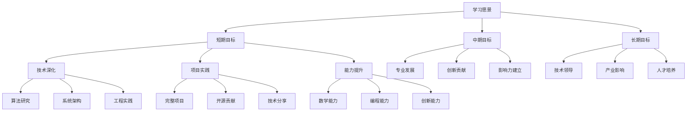

# 未来学习规划

## 🎯 学习目标设定

### 1. 总体学习目标

**学习愿景：**
> **成为AI领域的专家，具备深厚的理论基础、丰富的实践经验和创新能力，能够在AI技术发展和应用中发挥重要作用**

**学习目标体系：**

### 2. 分阶段学习目标

**短期目标（1-2年）：**
| 目标类别 | 具体目标 | 完成时间 | 评估标准 |
|----------|----------|----------|----------|
| **技术深化** | 深入理解深度学习理论 | 6个月 | 能够独立推导算法 |
| | 掌握最新AI技术 | 12个月 | 能够应用新技术 |
| | 提升数学基础 | 18个月 | 数学建模能力提升 |
| **项目实践** | 完成5个完整项目 | 12个月 | 项目质量评估 |
| | 参与开源项目 | 18个月 | 代码贡献量 |
| | 技术博客写作 | 24个月 | 文章质量和影响力 |
| **能力提升** | 提升编程能力 | 12个月 | 代码质量评估 |
| | 增强系统设计能力 | 18个月 | 架构设计能力 |
| | 培养创新能力 | 24个月 | 创新项目数量 |

**中期目标（3-5年）：**
| 目标类别 | 具体目标 | 完成时间 | 评估标准 |
|----------|----------|----------|----------|
| **专业发展** | 成为技术专家 | 36个月 | 行业认可度 |
| | 建立技术影响力 | 48个月 | 技术社区影响力 |
| | 获得专业认证 | 60个月 | 相关认证证书 |
| **创新贡献** | 发表技术论文 | 42个月 | 论文质量和数量 |
| | 申请技术专利 | 54个月 | 专利数量和质量 |
| | 开发创新产品 | 60个月 | 产品市场表现 |
| **影响力建立** | 技术演讲 | 36个月 | 演讲次数和质量 |
| | 技术培训 | 48个月 | 培训效果评估 |
| | 技术咨询 | 60个月 | 咨询项目数量 |

**长期目标（5-10年）：**
| 目标类别 | 具体目标 | 完成时间 | 评估标准 |
|----------|----------|----------|----------|
| **技术领导** | 成为技术总监 | 72个月 | 职位晋升 |
| | 建立技术团队 | 84个月 | 团队规模和能力 |
| | 制定技术战略 | 96个月 | 战略执行效果 |
| **产业影响** | 推动行业发展 | 108个月 | 行业影响力 |
| | 参与标准制定 | 120个月 | 标准参与度 |
| | 促进技术普及 | 120个月 | 技术普及程度 |
| **人才培养** | 培养技术人才 | 96个月 | 培养人才数量 |
| | 建立教育体系 | 108个月 | 教育体系完善度 |
| | 传承技术经验 | 120个月 | 经验传承效果 |

## 🔧 学习计划制定

### 1. 技术深化计划

**深度学习理论深化：**
- **数学基础强化**：
  - 线性代数：矩阵理论、特征值分解、SVD分解
  - 概率统计：贝叶斯理论、概率分布、统计推断
  - 微积分：优化理论、梯度方法、变分法
  - 信息论：熵理论、信息度量、编码理论

- **算法原理研究**：
  - 监督学习：线性模型、树模型、神经网络
  - 无监督学习：聚类、降维、生成模型
  - 强化学习：价值函数、策略梯度、Actor-Critic
  - 深度学习：CNN、RNN、Transformer、GAN

- **前沿技术跟踪**：
  - 大语言模型：GPT、BERT、T5等模型研究
  - 多模态学习：视觉-语言模型、跨模态理解
  - 生成式AI：Diffusion Model、VAE、GAN
  - 联邦学习：隐私保护、分布式训练

**系统架构能力提升：**
- **分布式系统**：
  - 大规模训练：数据并行、模型并行、流水线并行
  - 分布式存储：HDFS、分布式数据库、缓存系统
  - 微服务架构：服务拆分、服务治理、服务监控
  - 容器化部署：Docker、Kubernetes、云原生

- **性能优化**：
  - 算法优化：时间复杂度、空间复杂度优化
  - 系统优化：内存管理、CPU优化、GPU优化
  - 网络优化：模型压缩、量化、剪枝
  - 工程优化：代码优化、编译优化、运行时优化

### 2. 项目实践计划

**完整项目开发：**
- **项目1：智能推荐系统**
  - 技术栈：协同过滤、深度学习、实时推荐
  - 功能：用户画像、物品建模、推荐算法、A/B测试
  - 时间：3个月
  - 目标：构建完整的推荐系统

- **项目2：多模态对话系统**
  - 技术栈：大语言模型、多模态融合、对话管理
  - 功能：文本理解、图像理解、多轮对话、情感分析
  - 时间：4个月
  - 目标：实现多模态智能对话

- **项目3：自动化机器学习平台**
  - 技术栈：AutoML、模型选择、超参数优化
  - 功能：自动特征工程、模型选择、超参数调优、模型部署
  - 时间：6个月
  - 目标：构建AutoML平台

- **项目4：边缘AI部署系统**
  - 技术栈：模型压缩、边缘计算、实时推理
  - 功能：模型优化、边缘部署、实时推理、性能监控
  - 时间：4个月
  - 目标：实现边缘AI部署

- **项目5：AI安全与隐私保护**
  - 技术栈：差分隐私、同态加密、联邦学习
  - 功能：隐私保护、数据安全、模型安全、攻击防御
  - 时间：5个月
  - 目标：构建AI安全系统

**开源项目贡献：**
- **参与知名项目**：
  - PyTorch：贡献核心功能、优化性能
  - Transformers：贡献新模型、改进现有模型
  - Scikit-learn：贡献算法实现、优化性能
  - TensorFlow：贡献功能、修复bug

- **自主开源项目**：
  - AI工具库：开发实用的AI工具库
  - 教程项目：创建高质量的学习教程
  - 研究项目：开源研究成果和代码
  - 社区项目：为社区提供有价值的项目

### 3. 能力提升计划

**数学能力提升：**
- **学习计划**：
  - 线性代数：3个月，每天2小时
  - 概率统计：3个月，每天2小时
  - 微积分：3个月，每天2小时
  - 信息论：2个月，每天1小时

- **实践方式**：
  - 理论学习：阅读经典教材，完成习题
  - 应用实践：在AI项目中应用数学知识
  - 论文阅读：阅读相关数学论文
  - 数学建模：参与数学建模竞赛

**编程能力提升：**
- **语言学习**：
  - Python：深度学习，高级特性
  - C++：高性能计算，系统编程
  - Go：并发编程，微服务开发
  - Rust：内存安全，系统编程

- **技能提升**：
  - 算法与数据结构：LeetCode刷题，算法竞赛
  - 设计模式：学习常用设计模式
  - 代码质量：代码审查，重构实践
  - 性能优化：性能分析，优化技巧

**创新能力培养：**
- **创新思维**：
  - 问题发现：识别现有技术的不足
  - 解决方案：提出创新的解决方案
  - 实验验证：通过实验验证想法
  - 成果转化：将研究成果转化为实际应用

- **创新实践**：
  - 研究项目：参与前沿研究项目
  - 专利申请：申请技术专利
  - 论文发表：发表高质量论文
  - 产品开发：开发创新产品

## 🔧 学习资源规划

### 1. 学习资源分类

**理论学习资源：**
- **经典教材**：
  - 《深度学习》（Ian Goodfellow）
  - 《机器学习》（周志华）
  - 《统计学习方法》（李航）
  - 《模式识别与机器学习》（Bishop）

- **在线课程**：
  - Coursera：机器学习、深度学习课程
  - edX：MIT、Stanford等名校课程
  - Udacity：AI纳米学位项目
  - 中国大学MOOC：国内优质课程

- **论文资源**：
  - arXiv：最新研究论文
  - Google Scholar：学术论文搜索
  - IEEE Xplore：IEEE期刊论文
  - ACM Digital Library：ACM期刊论文

**实践学习资源：**
- **开发工具**：
  - PyTorch：深度学习框架
  - TensorFlow：机器学习平台
  - Jupyter：交互式开发环境
  - VS Code：代码编辑器

- **数据集**：
  - ImageNet：图像分类数据集
  - COCO：目标检测数据集
  - GLUE：自然语言理解基准
  - Kaggle：数据科学竞赛平台

- **云平台**：
  - Google Colab：免费GPU资源
  - AWS：云计算服务
  - Azure：微软云平台
  - 阿里云：国内云服务

### 2. 学习时间规划

**每日学习时间分配：**
| 时间段 | 学习内容 | 时间分配 | 学习方式 |
|--------|----------|----------|----------|
| **早晨** | 理论学习 | 1小时 | 阅读教材、论文 |
| **上午** | 编程实践 | 2小时 | 代码编写、调试 |
| **下午** | 项目开发 | 3小时 | 项目实现、测试 |
| **晚上** | 总结反思 | 1小时 | 笔记整理、反思 |
| **周末** | 深度学习 | 4小时 | 专题研究、实验 |

**每周学习计划：**
- **周一**：理论学习日，专注数学和算法理论
- **周二**：编程实践日，提升编程技能
- **周三**：项目开发日，推进项目进度
- **周四**：论文阅读日，跟踪最新研究
- **周五**：技术分享日，整理和分享知识
- **周六**：实验研究日，进行创新实验
- **周日**：总结规划日，总结本周，规划下周

**每月学习主题：**
- **第1月**：深度学习基础理论
- **第2月**：计算机视觉技术
- **第3月**：自然语言处理
- **第4月**：强化学习
- **第5月**：生成式AI
- **第6月**：大语言模型
- **第7月**：多模态学习
- **第8月**：联邦学习
- **第9月**：边缘AI
- **第10月**：AI安全
- **第11月**：系统架构
- **第12月**：综合应用

### 3. 学习效果评估

**学习效果评估体系：**
- **理论知识评估**：
  - 定期测试：每月进行理论知识测试
  - 论文理解：能够理解并复现论文
  - 算法推导：能够独立推导算法
  - 数学建模：能够建立数学模型

- **实践能力评估**：
  - 项目完成度：项目完成质量和进度
  - 代码质量：代码规范性、可读性、效率
  - 问题解决：独立解决问题的能力
  - 创新贡献：创新想法和实现

- **综合能力评估**：
  - 技术深度：对技术的深入理解
  - 技术广度：技术领域的覆盖范围
  - 应用能力：技术应用的实际效果
  - 影响力：在技术社区的影响力

**学习反馈机制：**
- **自我评估**：定期进行自我评估和反思
- **同行评价**：与同行交流，获得反馈
- **导师指导**：寻求导师的指导和建议
- **社区反馈**：通过技术社区获得反馈

## 🔧 职业发展规划

### 1. 职业发展路径

**技术专家路径：**
- **初级工程师**（1-2年）：
  - 掌握基础技术，能够独立完成简单项目
  - 参与团队项目，积累实践经验
  - 学习新技术，提升技术能力

- **中级工程师**（3-5年）：
  - 深入理解技术原理，能够解决复杂问题
  - 负责重要项目，具备项目管理能力
  - 指导初级工程师，具备团队协作能力

- **高级工程师**（5-8年）：
  - 成为技术专家，在特定领域有深度
  - 负责技术架构设计，具备系统思维
  - 参与技术决策，具备战略思维

- **技术专家**（8-10年）：
  - 在行业内有影响力，成为技术领袖
  - 推动技术发展，具备创新能力
  - 培养技术人才，具备领导能力

**管理发展路径：**
- **技术经理**（5-8年）：
  - 管理技术团队，具备团队管理能力
  - 负责项目交付，具备项目管理能力
  - 协调资源分配，具备资源管理能力

- **技术总监**（8-12年）：
  - 制定技术战略，具备战略思维
  - 管理多个团队，具备组织管理能力
  - 推动技术创新，具备创新能力

- **CTO**（12年以上）：
  - 负责技术愿景，具备愿景领导能力
  - 管理技术组织，具备组织建设能力
  - 推动技术变革，具备变革领导能力

### 2. 技能发展计划

**技术技能发展：**
- **算法能力**：
  - 深入理解各种算法的原理和应用
  - 能够设计和实现新的算法
  - 具备算法优化和性能调优能力

- **系统设计能力**：
  - 能够设计大规模分布式系统
  - 具备系统架构和模块设计能力
  - 能够进行系统性能优化和扩展

- **工程实践能力**：
  - 具备完整的软件开发能力
  - 能够进行代码审查和质量控制
  - 具备DevOps和持续集成能力

**软技能发展：**
- **沟通能力**：
  - 能够清晰表达技术想法
  - 具备跨部门协作能力
  - 能够进行技术培训和指导

- **领导能力**：
  - 具备团队管理和激励能力
  - 能够制定和执行技术战略
  - 具备决策和问题解决能力

- **创新能力**：
  - 具备创新思维和探索精神
  - 能够识别和把握技术机会
  - 具备风险管理和应对能力

### 3. 职业发展策略

**短期策略（1-2年）：**
- **技术深化**：在AI领域建立深度专业能力
- **项目积累**：通过项目积累丰富的实践经验
- **网络建设**：建立专业网络和人际关系
- **品牌建设**：在技术社区建立个人品牌

**中期策略（3-5年）：**
- **专业发展**：成为AI领域的技术专家
- **影响力建立**：在行业和技术社区建立影响力
- **团队建设**：建立和管理技术团队
- **创新贡献**：在技术创新方面做出贡献

**长期策略（5-10年）：**
- **技术领导**：成为技术团队的领导者
- **产业影响**：对AI产业发展产生积极影响
- **人才培养**：培养和指导技术人才
- **社会贡献**：通过技术为社会做出贡献

## 🔗 相关链接
- [[99-01-知识体系总结]] - 知识体系
- [[99-02-学习心得与反思]] - 学习心得
- [[99-04-常用工具与资源]] - 工具资源

## 💡 学习规划建议

**规划原则：**
- 🎯 **目标明确**：设定清晰、可衡量的学习目标
- 📊 **计划合理**：制定切实可行的学习计划
- 🔍 **持续调整**：根据实际情况调整学习计划
- ⚡ **执行到位**：严格执行学习计划，确保效果

**实施建议：**
- 📝 **定期回顾**：定期回顾和评估学习进度
- 💻 **实践导向**：以实践项目驱动理论学习
- 📊 **反馈机制**：建立有效的学习反馈机制
- 🔍 **持续改进**：根据反馈持续改进学习方法

---
*📝 学习提示：未来学习规划是持续学习的重要指导，建议定期更新和调整学习规划，确保与个人发展和行业趋势保持一致*

