# 常用工具与资源

## 🎯 工具资源概览

### 1. 工具资源分类

**工具资源体系：**
> **构建完整的AI开发工具链，从开发环境到部署运维，从理论学习到实践应用，形成系统性的工具资源库**

**工具资源架构：**

```mermaid
graph TD
    A[AI工具资源] --> B[开发环境]
    A --> C[编程工具]
    A --> D[数据处理]
    A --> E[模型训练]
    A --> F[模型部署]
    A --> G[监控运维]
    A --> H[学习资源]
    
    B --> B1[IDE编辑器]
    B --> B2[版本控制]
    B --> B3[环境管理]
    B --> B4[包管理]
    
    C --> C1[编程语言]
    C --> C2[框架库]
    C --> C3[调试工具]
    C --> C4[测试工具]
    
    D --> D1[数据收集]
    D --> D2[数据清洗]
    D --> D3[数据可视化]
    D --> D4[数据存储]
    
    E --> E1[训练框架]
    E --> E2[优化工具]
    E --> E3[实验管理]
    E --> E4[模型评估]
    
    F --> F1[模型转换]
    F --> F2[容器化]
    F --> F3[云平台]
    F --> F4[边缘部署]
    
    G --> G1[日志监控]
    G --> G2[性能监控]
    G --> G3[错误追踪]
    G --> G4[告警系统]
    
    H --> H1[在线课程]
    H --> H2[技术文档]
    H --> H3[论文资源]
    H --> H4[社区论坛]
```


### 2. 工具选择标准

**工具选择标准：**
| 标准 | 权重 | 说明 |
|------|------|------|
| **功能性** | 30% | 工具功能是否满足需求 |
| **易用性** | 25% | 工具是否易于学习和使用 |
| **稳定性** | 20% | 工具是否稳定可靠 |
| **社区支持** | 15% | 社区活跃度和支持程度 |
| **成本效益** | 10% | 工具的成本和效益比 |

## 🔧 开发环境工具

### 1. IDE与编辑器

**推荐IDE：**
- **PyCharm**：
  - 功能：Python专业IDE，智能代码补全
  - 优势：强大的调试功能，集成版本控制
  - 适用：大型Python项目开发
  - 版本：Professional（付费）、Community（免费）

- **VS Code**：
  - 功能：轻量级编辑器，丰富的扩展生态
  - 优势：跨平台，免费，扩展丰富
  - 适用：中小型项目，多语言开发
  - 扩展：Python、Jupyter、Git等

- **Jupyter Notebook**：
  - 功能：交互式开发环境，支持代码和文档
  - 优势：适合数据科学，可视化友好
  - 适用：数据分析、模型实验
  - 变体：JupyterLab、Google Colab

**编辑器配置：**
```json
{
  "python.defaultInterpreterPath": "/usr/bin/python3",
  "python.linting.enabled": true,
  "python.linting.pylintEnabled": true,
  "python.formatting.provider": "black",
  "python.testing.pytestEnabled": true,
  "jupyter.askForKernelRestart": false,
  "files.autoSave": "afterDelay",
  "editor.formatOnSave": true
}
```

### 2. 版本控制工具

**Git工具：**
- **Git命令行**：
  - 功能：分布式版本控制系统
  - 优势：功能强大，灵活性高
  - 适用：所有项目版本控制
  - 学习：Git官方文档和教程

- **GitHub Desktop**：
  - 功能：Git图形化界面
  - 优势：易于使用，可视化操作
  - 适用：初学者，简单项目
  - 平台：Windows、macOS

- **SourceTree**：
  - 功能：Git图形化客户端
  - 优势：功能丰富，界面友好
  - 适用：复杂项目，团队协作
  - 平台：Windows、macOS

**Git工作流：**
```bash
# 初始化仓库
git init
git remote add origin <repository-url>

# 日常开发流程
git checkout -b feature/new-feature
git add .
git commit -m "Add new feature"
git push origin feature/new-feature

# 合并分支
git checkout main
git merge feature/new-feature
git push origin main
```

### 3. 环境管理工具

**Python环境管理：**
- **Conda**：
  - 功能：包管理和环境管理
  - 优势：跨语言支持，依赖解决
  - 适用：数据科学，多语言项目
  - 发行版：Anaconda、Miniconda

- **Virtualenv**：
  - 功能：Python虚拟环境创建
  - 优势：轻量级，简单易用
  - 适用：纯Python项目
  - 工具：virtualenv、venv

- **Poetry**：
  - 功能：依赖管理和打包工具
  - 优势：现代化，依赖锁定
  - 适用：Python包开发
  - 特性：依赖解析、版本管理

**环境管理命令：**
```bash
# Conda环境管理
conda create -n ai_env python=3.9
conda activate ai_env
conda install pytorch torchvision -c pytorch
conda deactivate

# Virtualenv环境管理
python -m venv ai_env
source ai_env/bin/activate  # Linux/macOS
ai_env\Scripts\activate     # Windows
pip install -r requirements.txt
deactivate

# Poetry依赖管理
poetry init
poetry add torch torchvision
poetry install
poetry shell
```

## 🔧 编程开发工具

### 1. 编程语言与框架

**Python生态系统：**
- **核心库**：
  - NumPy：数值计算基础库
  - Pandas：数据分析和处理
  - Matplotlib：数据可视化
  - Scikit-learn：机器学习算法

- **深度学习框架**：
  - PyTorch：动态图，研究友好
  - TensorFlow：静态图，生产就绪
  - JAX：函数式编程，高性能
  - PaddlePaddle：百度开源框架

- **自然语言处理**：
  - Transformers：预训练模型库
  - NLTK：自然语言处理工具包
  - SpaCy：工业级NLP库
  - Gensim：主题建模和词向量

**框架选择指南：**
```python
# PyTorch示例
import torch
import torch.nn as nn

class SimpleNet(nn.Module):
    def __init__(self):
        super().__init__()
        self.fc1 = nn.Linear(784, 128)
        self.fc2 = nn.Linear(128, 10)
    
    def forward(self, x):
        x = torch.relu(self.fc1(x))
        x = self.fc2(x)
        return x

# TensorFlow示例
import tensorflow as tf

model = tf.keras.Sequential([
    tf.keras.layers.Dense(128, activation='relu', input_shape=(784,)),
    tf.keras.layers.Dense(10, activation='softmax')
])
```

### 2. 调试与测试工具

**调试工具：**
- **pdb**：
  - 功能：Python内置调试器
  - 优势：简单易用，无需额外安装
  - 适用：简单调试需求
  - 使用：在代码中插入断点

- **PyCharm Debugger**：
  - 功能：图形化调试器
  - 优势：可视化调试，功能丰富
  - 适用：复杂项目调试
  - 特性：变量监视、条件断点

- **Jupyter Debugger**：
  - 功能：Jupyter环境调试
  - 优势：交互式调试，可视化
  - 适用：数据科学项目
  - 扩展：ipdb、pdb++

**测试工具：**
- **pytest**：
  - 功能：Python测试框架
  - 优势：简单易用，功能强大
  - 适用：单元测试、集成测试
  - 特性：参数化测试、fixture

- **unittest**：
  - 功能：Python标准测试库
  - 优势：内置支持，标准兼容
  - 适用：基础测试需求
  - 特性：测试发现、断言

**调试测试示例：**
```python
# 调试示例
import pdb

def complex_function(x, y):
    pdb.set_trace()  # 设置断点
    result = x * y
    return result

# 测试示例
import pytest

def test_addition():
    assert 1 + 1 == 2

@pytest.mark.parametrize("input,expected", [
    (1, 2),
    (2, 4),
    (3, 6)
])
def test_multiply_by_two(input, expected):
    assert input * 2 == expected
```

## 🔧 数据处理工具

### 1. 数据收集与存储

**数据收集工具：**
- **爬虫工具**：
  - Scrapy：Python爬虫框架
  - BeautifulSoup：HTML解析库
  - Selenium：浏览器自动化
  - Requests：HTTP请求库

- **API工具**：
  - Postman：API测试工具
  - curl：命令行HTTP工具
  - httpx：现代HTTP客户端
  - aiohttp：异步HTTP客户端

**数据存储工具：**
- **关系型数据库**：
  - PostgreSQL：开源关系数据库
  - MySQL：流行关系数据库
  - SQLite：轻量级数据库
  - SQLAlchemy：Python ORM

- **NoSQL数据库**：
  - MongoDB：文档数据库
  - Redis：内存数据库
  - Cassandra：列式数据库
  - Elasticsearch：搜索引擎

**数据收集示例：**
```python
# 爬虫示例
import requests
from bs4 import BeautifulSoup

def scrape_data(url):
    response = requests.get(url)
    soup = BeautifulSoup(response.content, 'html.parser')
    data = []
    for item in soup.find_all('div', class_='item'):
        data.append(item.text.strip())
    return data

# API调用示例
import requests

def fetch_api_data(url, params):
    response = requests.get(url, params=params)
    return response.json()
```

### 2. 数据清洗与处理

**数据清洗工具：**
- **Pandas**：
  - 功能：数据分析和处理
  - 优势：功能全面，性能优秀
  - 适用：结构化数据处理
  - 特性：数据清洗、转换、聚合

- **Dask**：
  - 功能：并行计算框架
  - 优势：处理大数据，分布式计算
  - 适用：大规模数据处理
  - 特性：延迟计算、内存优化

- **Apache Spark**：
  - 功能：大数据处理引擎
  - 优势：分布式计算，高性能
  - 适用：超大规模数据处理
  - 特性：内存计算、流处理

**数据可视化工具：**
- **Matplotlib**：
  - 功能：基础绘图库
  - 优势：功能全面，高度可定制
  - 适用：科学绘图，自定义图表
  - 特性：2D/3D绘图，动画

- **Seaborn**：
  - 功能：统计可视化库
  - 优势：美观的默认样式
  - 适用：统计图表，数据探索
  - 特性：统计图表，颜色主题

- **Plotly**：
  - 功能：交互式可视化
  - 优势：交互性强，Web友好
  - 适用：交互式图表，仪表板
  - 特性：3D图表，动画

**数据处理示例：**
```python
# 数据清洗示例
import pandas as pd
import numpy as np

def clean_data(df):
    # 处理缺失值
    df = df.dropna()
    
    # 处理异常值
    Q1 = df.quantile(0.25)
    Q3 = df.quantile(0.75)
    IQR = Q3 - Q1
    df = df[~((df < (Q1 - 1.5 * IQR)) | (df > (Q3 + 1.5 * IQR))).any(axis=1)]
    
    # 数据类型转换
    df['date'] = pd.to_datetime(df['date'])
    
    return df

# 数据可视化示例
import matplotlib.pyplot as plt
import seaborn as sns

def visualize_data(df):
    plt.figure(figsize=(12, 8))
    
    # 散点图
    plt.subplot(2, 2, 1)
    plt.scatter(df['x'], df['y'])
    plt.title('Scatter Plot')
    
    # 直方图
    plt.subplot(2, 2, 2)
    plt.hist(df['value'], bins=30)
    plt.title('Histogram')
    
    # 箱线图
    plt.subplot(2, 2, 3)
    sns.boxplot(data=df)
    plt.title('Box Plot')
    
    # 热力图
    plt.subplot(2, 2, 4)
    sns.heatmap(df.corr(), annot=True)
    plt.title('Correlation Heatmap')
    
    plt.tight_layout()
    plt.show()
```

## 🔧 模型训练工具

### 1. 训练框架

**深度学习框架：**
- **PyTorch**：
  - 功能：动态图深度学习框架
  - 优势：研究友好，调试方便
  - 适用：研究和原型开发
  - 特性：动态计算图、Pythonic

- **TensorFlow**：
  - 功能：静态图深度学习框架
  - 优势：生产就绪，性能优秀
  - 适用：生产环境部署
  - 特性：静态计算图、TensorBoard

- **JAX**：
  - 功能：函数式编程框架
  - 优势：高性能，自动微分
  - 适用：科学计算，研究
  - 特性：JIT编译、向量化

**实验管理工具：**
- **Weights & Biases**：
  - 功能：实验跟踪和可视化
  - 优势：功能全面，界面友好
  - 适用：机器学习实验管理
  - 特性：超参数调优、模型版本管理

- **MLflow**：
  - 功能：机器学习生命周期管理
  - 优势：开源，集成度高
  - 适用：MLOps，模型管理
  - 特性：实验跟踪、模型注册

- **TensorBoard**：
  - 功能：TensorFlow可视化工具
  - 优势：集成度高，功能丰富
  - 适用：TensorFlow项目
  - 特性：训练监控、模型分析

**训练示例：**
```python
# PyTorch训练示例
import torch
import torch.nn as nn
import torch.optim as optim

def train_model(model, train_loader, val_loader, epochs=10):
    criterion = nn.CrossEntropyLoss()
    optimizer = optim.Adam(model.parameters(), lr=0.001)
    
    for epoch in range(epochs):
        model.train()
        train_loss = 0
        for batch_idx, (data, target) in enumerate(train_loader):
            optimizer.zero_grad()
            output = model(data)
            loss = criterion(output, target)
            loss.backward()
            optimizer.step()
            train_loss += loss.item()
        
        # 验证
        model.eval()
        val_loss = 0
        with torch.no_grad():
            for data, target in val_loader:
                output = model(data)
                val_loss += criterion(output, target).item()
        
        print(f'Epoch {epoch+1}: Train Loss: {train_loss/len(train_loader):.4f}, '
              f'Val Loss: {val_loss/len(val_loader):.4f}')

# 实验跟踪示例
import wandb

def track_experiment():
    wandb.init(project="ai-project", name="experiment-1")
    
    # 记录超参数
    wandb.config.learning_rate = 0.001
    wandb.config.batch_size = 32
    
    # 记录指标
    wandb.log({"loss": loss, "accuracy": accuracy})
    
    # 记录模型
    wandb.save("model.pth")
```

### 2. 模型评估工具

**评估指标库：**
- **Scikit-learn**：
  - 功能：机器学习评估指标
  - 优势：功能全面，易于使用
  - 适用：传统机器学习
  - 特性：分类、回归、聚类指标

- **TorchMetrics**：
  - 功能：PyTorch评估指标
  - 优势：GPU加速，分布式支持
  - 适用：深度学习模型
  - 特性：模块化设计、高效计算

- **TensorFlow Metrics**：
  - 功能：TensorFlow评估指标
  - 优势：集成度高，性能优秀
  - 适用：TensorFlow项目
  - 特性：流式计算、分布式支持

**模型分析工具：**
- **SHAP**：
  - 功能：模型解释性分析
  - 优势：理论基础扎实，可视化好
  - 适用：模型可解释性分析
  - 特性：SHAP值计算、可视化

- **LIME**：
  - 功能：局部可解释性分析
  - 优势：简单易用，通用性强
  - 适用：模型解释性分析
  - 特性：局部近似、多模态支持

- **Captum**：
  - 功能：PyTorch模型解释
  - 优势：集成度高，功能丰富
  - 适用：PyTorch模型分析
  - 特性：多种归因方法、可视化

**评估示例：**
```python
# 模型评估示例
from sklearn.metrics import classification_report, confusion_matrix
import torchmetrics

def evaluate_model(model, test_loader):
    model.eval()
    all_preds = []
    all_targets = []
    
    with torch.no_grad():
        for data, target in test_loader:
            output = model(data)
            preds = output.argmax(dim=1)
            all_preds.extend(preds.cpu().numpy())
            all_targets.extend(target.cpu().numpy())
    
    # 计算指标
    accuracy = torchmetrics.functional.accuracy(
        torch.tensor(all_preds), torch.tensor(all_targets)
    )
    
    # 分类报告
    report = classification_report(all_targets, all_preds)
    print(report)
    
    return accuracy

# 模型解释示例
import shap

def explain_model(model, data):
    # 创建解释器
    explainer = shap.Explainer(model, data)
    
    # 计算SHAP值
    shap_values = explainer(data)
    
    # 可视化
    shap.plots.waterfall(shap_values[0])
    shap.plots.beeswarm(shap_values)
```

## 🔧 模型部署工具

### 1. 模型转换与优化

**模型转换工具：**
- **ONNX**：
  - 功能：开放神经网络交换格式
  - 优势：跨平台，标准化
  - 适用：模型格式转换
  - 特性：多框架支持、优化

- **TensorRT**：
  - 功能：NVIDIA推理优化
  - 优势：高性能，GPU优化
  - 适用：NVIDIA GPU部署
  - 特性：量化、剪枝、融合

- **OpenVINO**：
  - 功能：Intel推理优化
  - 优势：跨平台，硬件优化
  - 适用：Intel硬件部署
  - 特性：模型优化、硬件加速

**模型优化工具：**
- **模型压缩**：
  - 量化：INT8、FP16量化
  - 剪枝：结构化、非结构化剪枝
  - 蒸馏：知识蒸馏、模型压缩
  - 低秩分解：SVD、CP分解

- **推理优化**：
  - 图优化：算子融合、常量折叠
  - 内存优化：内存池、动态内存
  - 并行优化：数据并行、模型并行
  - 缓存优化：计算缓存、数据缓存

**模型转换示例：**
```python
# ONNX转换示例
import torch
import torch.onnx

def convert_to_onnx(model, input_shape, output_path):
    model.eval()
    dummy_input = torch.randn(1, *input_shape)
    
    torch.onnx.export(
        model,
        dummy_input,
        output_path,
        export_params=True,
        opset_version=11,
        do_constant_folding=True,
        input_names=['input'],
        output_names=['output']
    )

# 模型量化示例
import torch.quantization as quantization

def quantize_model(model):
    # 准备量化
    model.qconfig = quantization.get_default_qconfig('fbgemm')
    quantization.prepare(model, inplace=True)
    
    # 校准
    # ... 校准数据 ...
    
    # 转换
    quantized_model = quantization.convert(model, inplace=False)
    return quantized_model
```

### 2. 容器化与云平台

**容器化工具：**
- **Docker**：
  - 功能：容器化平台
  - 优势：标准化，可移植
  - 适用：应用容器化
  - 特性：镜像管理、网络管理

- **Kubernetes**：
  - 功能：容器编排平台
  - 优势：自动化，可扩展
  - 适用：大规模部署
  - 特性：服务发现、负载均衡

- **Docker Compose**：
  - 功能：多容器应用管理
  - 优势：简单易用，开发友好
  - 适用：开发环境，小规模部署
  - 特性：服务编排、网络管理

**云平台服务：**
- **AWS**：
  - 服务：SageMaker、EC2、Lambda
  - 优势：功能全面，生态丰富
  - 适用：企业级部署
  - 特性：托管服务、自动扩展

- **Google Cloud**：
  - 服务：AI Platform、Compute Engine
  - 优势：AI服务丰富，性能优秀
  - 适用：AI应用部署
  - 特性：TPU支持、ML服务

- **Azure**：
  - 服务：ML Studio、Container Instances
  - 优势：企业集成，安全性高
  - 适用：企业环境
  - 特性：混合云、安全合规

**容器化示例：**
```dockerfile
# Dockerfile示例
FROM python:3.9-slim

WORKDIR /app

COPY requirements.txt .
RUN pip install -r requirements.txt

COPY . .

EXPOSE 8000

CMD ["python", "app.py"]
```

```yaml
# docker-compose.yml示例
version: '3.8'
services:
  web:
    build: .
    ports:
      - "8000:8000"
    volumes:
      - .:/app
    environment:
      - FLASK_ENV=development
  
  redis:
    image: redis:alpine
    ports:
      - "6379:6379"
```

## 🔧 学习资源

### 1. 在线课程

**免费课程：**
- **Coursera**：
  - 课程：机器学习、深度学习专项课程
  - 提供者：Stanford、deeplearning.ai
  - 优势：质量高，系统性强
  - 证书：付费获得证书

- **edX**：
  - 课程：MIT、Harvard等名校课程
  - 提供者：世界顶级大学
  - 优势：学术性强，理论深入
  - 证书：付费获得证书

- **Udacity**：
  - 课程：AI纳米学位项目
  - 提供者：行业专家
  - 优势：实践导向，项目丰富
  - 证书：付费获得证书

**付费课程：**
- **Fast.ai**：
  - 课程：实用深度学习课程
  - 提供者：Jeremy Howard
  - 优势：实用性强，易于理解
  - 特色：自顶向下学习方法

- **DeepLearning.AI**：
  - 课程：深度学习专项课程
  - 提供者：Andrew Ng
  - 优势：理论基础扎实
  - 特色：系统性学习路径

### 2. 技术文档

**官方文档：**
- **PyTorch文档**：
  - 内容：API参考、教程、示例
  - 优势：权威性高，更新及时
  - 适用：PyTorch开发
  - 特色：交互式教程

- **TensorFlow文档**：
  - 内容：指南、API、示例
  - 优势：功能全面，文档详细
  - 适用：TensorFlow开发
  - 特色：多语言支持

- **Scikit-learn文档**：
  - 内容：用户指南、API参考
  - 优势：示例丰富，易于理解
  - 适用：机器学习开发
  - 特色：实践导向

**第三方文档：**
- **Papers With Code**：
  - 内容：论文和代码实现
  - 优势：最新研究，代码可用
  - 适用：研究学习
  - 特色：论文与代码结合

- **Towards Data Science**：
  - 内容：数据科学文章
  - 优势：内容丰富，实用性强
  - 适用：实践学习
  - 特色：社区驱动

### 3. 论文资源

**论文数据库：**
- **arXiv**：
  - 内容：最新研究论文
  - 优势：更新及时，免费访问
  - 适用：跟踪最新研究
  - 特色：预印本平台

- **Google Scholar**：
  - 内容：学术论文搜索
  - 优势：搜索功能强大
  - 适用：文献调研
  - 特色：引用分析

- **IEEE Xplore**：
  - 内容：IEEE期刊和会议论文
  - 优势：质量高，权威性强
  - 适用：学术研究
  - 特色：正式发表

**重要会议：**
- **NeurIPS**：神经信息处理系统会议
- **ICML**：国际机器学习会议
- **ICLR**：国际学习表征会议
- **AAAI**：人工智能协会会议
- **IJCAI**：国际人工智能联合会议

### 4. 社区论坛

**技术社区：**
- **Stack Overflow**：
  - 内容：编程问答社区
  - 优势：问题解答质量高
  - 适用：技术问题解决
  - 特色：投票机制

- **Reddit**：
  - 内容：机器学习、深度学习版块
  - 优势：讨论活跃，内容丰富
  - 适用：技术讨论
  - 特色：社区驱动

- **GitHub**：
  - 内容：开源项目、代码分享
  - 优势：项目丰富，代码可用
  - 适用：项目学习
  - 特色：版本控制

**中文社区：**
- **知乎**：
  - 内容：AI相关问题讨论
  - 优势：中文内容，易于理解
  - 适用：中文学习
  - 特色：问答形式

- **CSDN**：
  - 内容：技术博客、教程
  - 优势：内容丰富，更新频繁
  - 适用：技术学习
  - 特色：博客平台

- **机器之心**：
  - 内容：AI新闻、技术解读
  - 优势：专业性强，内容质量高
  - 适用：行业动态
  - 特色：专业媒体

## 🔗 相关链接
- [[99-01-知识体系总结]] - 知识体系
- [[99-02-学习心得与反思]] - 学习心得
- [[99-03-未来学习规划]] - 学习规划

## 💡 工具使用建议

**工具选择建议：**
- 🎯 **需求导向**：根据具体需求选择合适的工具
- 📊 **学习成本**：考虑工具的学习成本和收益
- 🔍 **社区支持**：选择有活跃社区支持的工具
- ⚡ **持续更新**：关注工具的更新和发展趋势

**使用建议：**
- 📝 **文档阅读**：仔细阅读工具文档和教程
- 💻 **实践练习**：通过实际项目练习工具使用
- 📊 **经验总结**：总结工具使用经验和技巧
- 🔍 **社区参与**：积极参与工具社区讨论

---
*📝 学习提示：工具和资源是AI开发的重要支撑，建议建立个人工具库，持续更新和优化工具使用经验*

