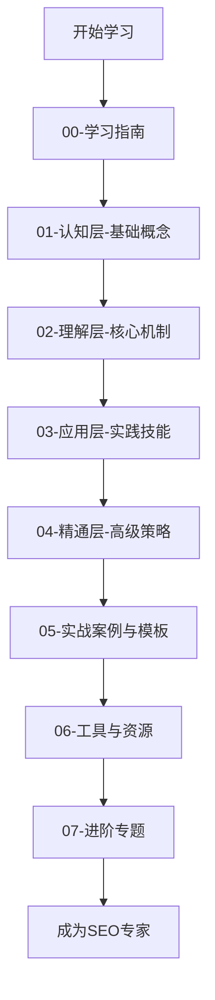

# Google SEO学习路径图

## 🎯 学习目标
掌握Google SEO从基础到精通的完整知识体系，具备独立进行SEO策略制定和执行的能力。

## 📚 学习路径概览

## 🗺️ 详细学习路径

### 阶段一：认知层（1-2周）
**目标**：建立SEO基础认知框架
- [[01-SEO定义与核心概念]] - 理解SEO本质
- [[02-SEO发展历史]] - 了解发展脉络
- [[03-SEO类型分类]] - 掌握分类体系
- [[04-SEO与SEM关系]] - 区分相关概念

### 阶段二：理解层（3-4周）
**目标**：深入理解SEO核心机制
- [[Google核心算法]] - 掌握算法原理
- [[关键词研究基础]] - 学会关键词策略
- [[技术SEO]] - 理解技术要素
- [[内容SEO]] - 掌握内容优化

### 阶段三：应用层（4-6周）
**目标**：具备实际操作能力
- [[SEO工具精通]] - 熟练使用工具
- [[网站审计]] - 掌握审计方法
- [[竞争分析]] - 学会分析技巧
- [[项目管理]] - 具备管理能力

### 阶段四：精通层（6-8周）
**目标**：成为SEO专家
- [[企业级SEO策略]] - 制定高级策略
- [[国际SEO]] - 掌握国际化
- [[本地SEO]] - 精通本地化
- [[危机管理]] - 应对复杂情况

## ⏱️ 学习时间规划

| 阶段 | 时间 | 重点 | 输出 |
|------|------|------|------|
| 认知层 | 1-2周 | 概念理解 | 知识框架 |
| 理解层 | 3-4周 | 机制掌握 | 分析能力 |
| 应用层 | 4-6周 | 技能实践 | 操作能力 |
| 精通层 | 6-8周 | 策略制定 | 专家水平 |

## 🎯 学习检查点

### 检查点1：基础认知（第2周末）
- [ ] 能解释SEO的基本概念
- [ ] 了解搜索引擎工作原理
- [ ] 掌握SEO价值评估方法

### 检查点2：核心理解（第6周末）
- [ ] 理解Google算法机制
- [ ] 掌握关键词研究技能
- [ ] 具备技术SEO基础

### 检查点3：实践应用（第12周末）
- [ ] 能独立进行网站审计
- [ ] 具备竞争分析能力
- [ ] 掌握项目管理技能

### 检查点4：专家精通（第20周末）
- [ ] 能制定企业级SEO策略
- [ ] 具备危机处理能力
- [ ] 掌握前沿技术趋势

## 🔄 学习方法建议

### 费曼学习法应用
1. **选择概念**：从简单概念开始
2. **教授他人**：用简单语言解释
3. **识别盲点**：发现理解不足
4. **重新学习**：回到源头学习

### 刻意练习要点
- **明确目标**：每次学习都有具体目标
- **专注练习**：避免分散注意力
- **及时反馈**：通过实践验证理解
- **持续改进**：不断优化学习方法

## 📖 相关链接
- [[02-技能评估表]] - 评估当前水平
- [[03-学习计划模板]] - 制定个人计划
- [[04-知识体系概览]] - 了解整体结构
