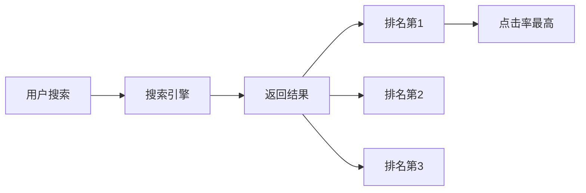
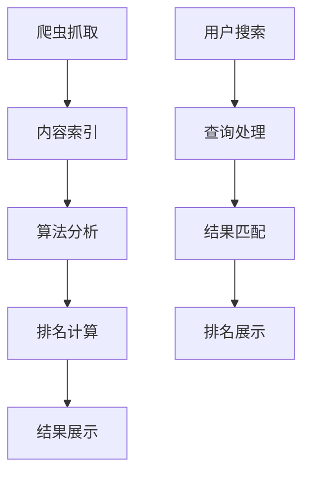

# SEO定义与核心概念

## 🎯 学习目标
- 理解SEO的本质定义
- 掌握SEO的核心概念
- 了解SEO的基本原理
- 建立SEO认知框架

## 📖 SEO定义

### 官方定义
**SEO（Search Engine Optimization）**：搜索引擎优化，是通过优化网站内容、结构和技术要素，提高网站在搜索引擎自然搜索结果中排名的过程。

### 通俗理解
SEO就是让搜索引擎"喜欢"你的网站，让用户在搜索相关关键词时更容易找到你的网站。

## 🔑 核心概念

### 1. 搜索引擎排名
**定义**：网站在搜索结果中的位置
**重要性**：排名越高，获得点击的机会越大

### 2. 关键词
**定义**：用户在搜索引擎中输入的搜索词
**类型**：
- **主关键词**：核心业务词
- **长尾关键词**：更具体的搜索词
- **语义关键词**：相关含义的词

### 3. 自然搜索
**定义**：非付费的搜索结果
**特点**：
- 免费获得流量
- 需要时间积累
- 长期稳定效果

### 4. 搜索意图
**定义**：用户搜索背后的真实需求
**类型**：
- **信息型**：获取信息
- **导航型**：找到特定网站
- **交易型**：购买产品或服务

## 🏗️ SEO基本原理

### 搜索引擎工作原理

### SEO优化原理
1. **内容优化**：提供高质量、相关的内容
2. **技术优化**：确保网站技术结构良好
3. **用户体验**：提升用户访问体验
4. **权威性建设**：建立网站权威性

## 📊 SEO价值体现

### 商业价值
| 价值类型 | 具体表现 | 量化指标 |
|----------|----------|----------|
| 流量价值 | 增加网站访问量 | 自然流量增长 |
| 品牌价值 | 提升品牌知名度 | 品牌搜索量 |
| 转化价值 | 提高业务转化 | 转化率提升 |
| 成本价值 | 降低获客成本 | CPC降低 |

### ROI计算
**公式**：ROI = (SEO收益 - SEO成本) / SEO成本 × 100%

**示例**：
- SEO成本：10万元/年
- 自然流量价值：50万元/年
- ROI = (50-10)/10 × 100% = 400%

## 🎯 SEO目标设定

### 短期目标（1-3个月）
- 提升关键词排名
- 增加自然流量
- 改善技术指标

### 中期目标（3-6个月）
- 建立内容权威性
- 提升用户体验
- 扩大关键词覆盖

### 长期目标（6-12个月）
- 成为行业权威
- 建立品牌影响力
- 实现业务增长

## ⚠️ SEO常见误区

### 误区1：SEO是万能的
**现实**：SEO是营销手段之一，需要与其他渠道配合

### 误区2：SEO效果立竿见影
**现实**：SEO需要3-6个月才能看到明显效果

### 误区3：关键词密度越高越好
**现实**：过度优化可能被搜索引擎惩罚

### 误区4：SEO就是发外链
**现实**：SEO包含内容、技术、用户体验等多个方面

## 🔄 SEO发展趋势

### 当前趋势
- **用户体验优先**：Core Web Vitals成为重要指标
- **内容质量**：E-A-T（专业性、权威性、可信度）
- **移动优先**：移动端体验至关重要
- **AI影响**：人工智能改变搜索行为

### 未来方向
- **语音搜索**：语音助手普及
- **视觉搜索**：图像识别技术
- **个性化搜索**：基于用户行为
- **零点击搜索**：直接答案展示

## 📚 学习路径

### 基础阶段
1. [[02-SEO发展历史]] - 了解发展脉络
2. [[03-SEO类型分类]] - 掌握分类体系
3. [[04-SEO与SEM关系]] - 区分相关概念

### 进阶阶段
1. [[01-Google搜索工作原理]] - 理解搜索机制
2. [[01-关键词研究基础]] - 掌握关键词策略
3. [[01-技术SEO]] - 学习技术优化

## 🎯 实践建议

### 初学者
- 从基础概念开始学习
- 关注行业动态和趋势
- 实践简单的优化技巧

### 进阶者
- 深入学习算法原理
- 掌握专业工具使用
- 建立系统化思维

### 专家级
- 制定企业级SEO策略
- 创新SEO优化方法
- 引领行业发展趋势

## 📖 相关链接
- [[02-SEO发展历史]] - 了解SEO发展历程
- [[03-SEO类型分类]] - 掌握SEO分类体系
- [[04-SEO与SEM关系]] - 理解SEO与SEM区别
- [[01-Google搜索工作原理]] - 学习搜索引擎原理
