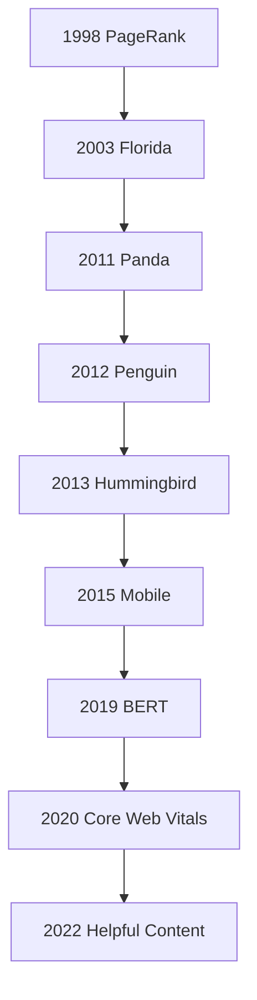
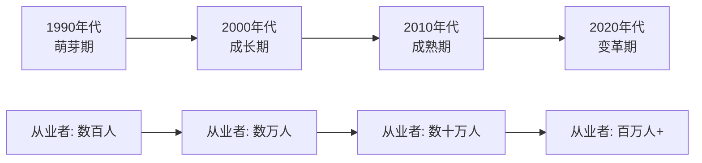

# SEO发展历史

## 🎯 学习目标
- 了解SEO的发展历程
- 掌握重要历史节点
- 理解SEO演变规律
- 预测未来发展趋势

## 📅 SEO发展时间线

### 1990年代：搜索引擎诞生
**1994年**：Yahoo!成立，人工编辑目录
**1995年**：AltaVista推出，支持全文搜索
**1996年**：Google成立，引入PageRank算法

### 2000年代：SEO兴起
**2000年**：Google成为主流搜索引擎
**2003年**：Florida更新，打击关键词堆砌
**2004年**：Google IPO，SEO行业爆发

### 2010年代：算法成熟
**2011年**：Panda更新，重视内容质量
**2012年**：Penguin更新，打击垃圾链接
**2013年**：Hummingbird更新，理解语义搜索

### 2020年代：AI时代
**2020年**：Core Web Vitals推出
**2022年**：Helpful Content更新
**2023年**：AI搜索革命开始

## 🔄 重要算法更新

### Google核心算法演进

### 算法更新影响
| 算法 | 发布时间 | 主要影响 | SEO策略变化 |
|------|----------|----------|-------------|
| PageRank | 1998 | 链接权重计算 | 重视外链建设 |
| Florida | 2003 | 关键词堆砌惩罚 | 内容自然化 |
| Panda | 2011 | 内容质量评估 | 重视原创内容 |
| Penguin | 2012 | 垃圾链接惩罚 | 外链质量化 |
| Hummingbird | 2013 | 语义搜索 | 理解用户意图 |
| Mobile | 2015 | 移动优先 | 响应式设计 |
| BERT | 2019 | 自然语言理解 | 内容语义化 |
| Core Web Vitals | 2020 | 用户体验 | 页面性能优化 |

## 📊 SEO行业演变

### 技术演变
**早期（1990-2000）**：
- 关键词密度优化
- Meta标签优化
- 目录提交

**中期（2000-2010）**：
- 链接建设兴起
- 内容营销开始
- 工具化发展

**现代（2010-2020）**：
- 用户体验优先
- 技术SEO成熟
- 数据分析驱动

**未来（2020+）**：
- AI技术应用
- 语音搜索优化
- 个性化搜索

### 行业规模变化

## 🎯 重要里程碑

### 1998年：Google成立
**意义**：改变了搜索引擎格局
**影响**：PageRank算法成为SEO基础

### 2003年：Florida更新
**意义**：第一次大规模算法更新
**影响**：SEO从技术转向内容

### 2011年：Panda更新
**意义**：内容质量成为核心
**影响**：低质量内容网站大量被惩罚

### 2012年：Penguin更新
**意义**：垃圾链接建设被严厉打击
**影响**：外链建设从数量转向质量

### 2013年：Hummingbird更新
**意义**：语义搜索时代开始
**影响**：SEO需要理解用户意图

### 2020年：Core Web Vitals
**意义**：用户体验成为排名因素
**影响**：技术SEO重要性提升

## 🔮 未来趋势预测

### 技术趋势
- **AI驱动**：人工智能深度应用
- **语音搜索**：语音助手普及
- **视觉搜索**：图像识别技术
- **个性化**：基于用户行为定制

### 行业趋势
- **专业化**：SEO分工更细
- **工具化**：自动化工具普及
- **数据化**：数据驱动决策
- **整合化**：与其他营销渠道融合

## 📚 历史经验总结

### 成功经验
1. **内容为王**：始终重视内容质量
2. **用户体验**：以用户为中心
3. **技术基础**：技术SEO是基础
4. **持续学习**：算法不断更新

### 失败教训
1. **过度优化**：避免黑帽技术
2. **忽视用户体验**：不能只关注排名
3. **缺乏耐心**：SEO需要时间积累
4. **单一策略**：需要多元化方法

## 🎯 学习启示

### 对初学者的启示
- 了解历史有助于理解现状
- 学习经典案例和失败教训
- 关注行业发展趋势

### 对从业者的启示
- 保持学习，适应变化
- 建立系统化思维
- 重视长期价值

### 对企业的启示
- SEO是长期投资
- 需要专业团队
- 与其他营销渠道配合

## 📖 相关链接
- [[01-SEO定义与核心概念]] - 理解SEO本质
- [[03-SEO类型分类]] - 了解SEO分类
- [[01-Google搜索工作原理]] - 学习搜索机制
- [[01-Google核心算法]] - 深入理解算法
