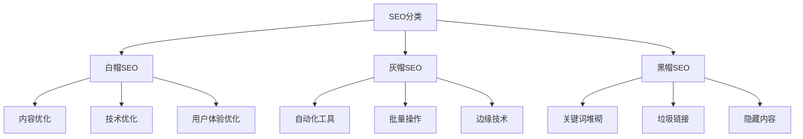
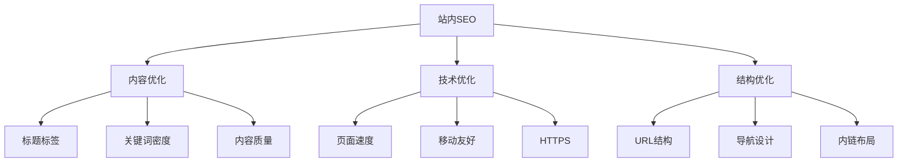

# SEO类型分类

## 🎯 学习目标
- 掌握SEO的分类体系
- 理解不同SEO类型的特点
- 了解各种SEO方法的适用场景
- 建立SEO分类认知框架

## 📊 SEO分类体系

### 按技术手段分类

## ⚪ 白帽SEO

### 定义与特点
**定义**：遵循搜索引擎指南的合法SEO方法
**特点**：
- 长期稳定效果
- 符合搜索引擎规则
- 注重用户体验
- 可持续发展

### 主要方法
| 方法类型 | 具体技术 | 效果特点 |
|----------|----------|----------|
| 内容优化 | 原创内容、关键词优化 | 长期稳定 |
| 技术优化 | 网站结构、页面速度 | 基础保障 |
| 用户体验 | 易用性、移动友好 | 提升转化 |
| 链接建设 | 高质量外链、内链优化 | 提升权威性 |

### 优势与劣势
**优势**：
- ✅ 效果稳定持久
- ✅ 风险较低
- ✅ 符合搜索引擎价值观
- ✅ 提升品牌形象

**劣势**：
- ❌ 见效较慢
- ❌ 需要持续投入
- ❌ 技术要求较高
- ❌ 竞争激烈

## ⚫ 黑帽SEO

### 定义与特点
**定义**：违反搜索引擎指南的作弊SEO方法
**特点**：
- 短期快速效果
- 违反搜索引擎规则
- 忽视用户体验
- 高风险高回报

### 主要方法
| 方法类型 | 具体技术 | 风险等级 |
|----------|----------|----------|
| 内容作弊 | 关键词堆砌、隐藏文字 | 高风险 |
| 链接作弊 | 垃圾链接、链接农场 | 高风险 |
| 技术作弊 | 门页、重定向滥用 | 高风险 |
| 自动化作弊 | 机器人流量、虚假点击 | 极高风险 |

### 风险与后果
**短期风险**：
- 排名快速上升
- 流量短期增长
- 成本相对较低

**长期后果**：
- 🚫 搜索引擎惩罚
- 🚫 排名大幅下降
- 🚫 网站被降权
- 🚫 品牌形象受损

## ⚫ 灰帽SEO

### 定义与特点
**定义**：介于白帽和黑帽之间的SEO方法
**特点**：
- 效果与风险并存
- 技术手段边缘化
- 需要谨慎使用
- 效果不稳定

### 主要方法
| 方法类型 | 具体技术 | 风险评估 |
|----------|----------|----------|
| 自动化工具 | 批量提交、自动外链 | 中等风险 |
| 边缘技术 | PBN网络、内容农场 | 高风险 |
| 灰色地带 | 付费链接、软文推广 | 低风险 |
| 技术技巧 | 301重定向、canonical标签 | 低风险 |

### 适用场景
- **竞争激烈行业**：需要快速提升排名
- **资源有限**：无法投入大量人力
- **测试阶段**：验证技术效果
- **短期项目**：需要快速见效

## 🎯 按优化对象分类

### 站内SEO（On-Page SEO）
**定义**：优化网站内部要素的SEO方法

**主要内容**：

### 站外SEO（Off-Page SEO）
**定义**：优化网站外部要素的SEO方法

**主要内容**：
- **外链建设**：获取高质量外部链接
- **社交媒体**：社交媒体信号优化
- **品牌建设**：提升品牌知名度和权威性
- **本地优化**：本地搜索优化

## 🌐 按搜索类型分类

### 通用SEO
**定义**：针对通用搜索结果的优化
**特点**：
- 面向全国或全球用户
- 竞争激烈
- 需要大量资源投入
- 效果相对稳定

### 本地SEO
**定义**：针对本地搜索结果的优化
**特点**：
- 面向本地用户
- 竞争相对较小
- 转化率较高
- 需要本地化策略

### 垂直SEO
**定义**：针对特定行业或领域的优化
**特点**：
- 面向特定用户群体
- 技术要求专业
- 竞争相对较小
- 需要行业专业知识

## 📱 按设备类型分类

### 桌面SEO
**传统优化方法**：
- 基于桌面用户体验
- 重视页面加载速度
- 关注屏幕分辨率
- 优化鼠标交互

### 移动SEO
**移动优先优化**：
- 响应式设计
- 触摸友好界面
- 移动页面速度
- 本地化功能

## 🎯 选择SEO类型的建议

### 企业选择标准
| 企业类型 | 推荐SEO类型 | 原因 |
|----------|-------------|------|
| 大型企业 | 白帽SEO | 品牌形象、长期发展 |
| 中小企业 | 白帽+灰帽 | 资源有限、需要效果 |
| 创业公司 | 灰帽SEO | 快速验证、快速成长 |
| 个人网站 | 白帽SEO | 风险控制、可持续发展 |

### 行业选择标准
| 行业类型 | 推荐策略 | 原因 |
|----------|----------|------|
| 电商行业 | 白帽+技术优化 | 用户体验重要 |
| 内容网站 | 白帽+内容优化 | 内容为王 |
| 服务行业 | 本地SEO | 本地化需求 |
| 技术行业 | 白帽+专业内容 | 专业性要求高 |

## ⚖️ 风险与合规

### 合规建议
1. **遵循指南**：严格按照搜索引擎指南操作
2. **用户体验**：始终以用户为中心
3. **长期思维**：注重可持续发展
4. **风险控制**：避免高风险操作

### 风险管控
- **监控排名**：及时发现异常波动
- **备份策略**：准备应急恢复方案
- **合规检查**：定期检查合规性
- **专业咨询**：寻求专业建议

## 📚 学习路径

### 基础阶段
1. [[01-SEO定义与核心概念]] - 理解SEO本质
2. [[02-SEO发展历史]] - 了解发展脉络
3. [[04-SEO与SEM关系]] - 区分相关概念

### 实践阶段
1. [[01-内容策略规划]] - 学习内容优化
2. [[01-网站结构优化]] - 掌握技术优化
3. [[01-链接建设原理]] - 理解链接建设

## 📖 相关链接
- [[01-SEO定义与核心概念]] - 理解SEO本质
- [[02-SEO发展历史]] - 了解SEO发展
- [[04-SEO与SEM关系]] - 区分SEO与SEM
- [[01-Google搜索工作原理]] - 学习搜索机制
