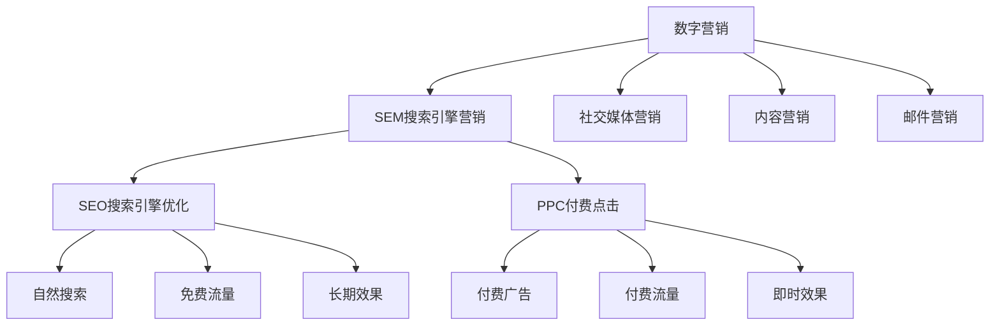
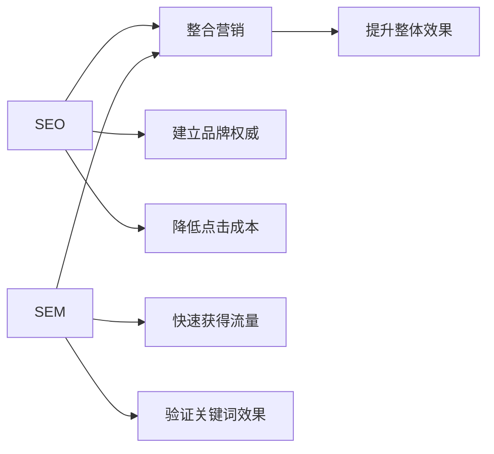

# SEO与SEM关系

## 🎯 学习目标
- 理解SEO与SEM的定义和区别
- 掌握两者的优劣势对比
- 了解如何整合SEO与SEM策略
- 建立数字营销整体认知

## 📖 基本定义

### SEO定义
**SEO（Search Engine Optimization）**：搜索引擎优化
- 通过优化网站内容和技术要素
- 提高自然搜索排名
- 获得免费流量

### SEM定义
**SEM（Search Engine Marketing）**：搜索引擎营销
- 通过付费广告在搜索引擎中推广
- 包括SEO和PPC（付费点击）
- 获得付费流量

## 🔄 关系图解

## ⚖️ 详细对比

### 成本对比
| 方面 | SEO | SEM |
|------|-----|-----|
| 初期成本 | 低 | 高 |
| 持续成本 | 人力成本 | 广告费用 |
| 总成本 | 相对较低 | 相对较高 |
| ROI | 长期高 | 短期高 |

### 效果对比
| 方面 | SEO | SEM |
|------|-----|-----|
| 见效时间 | 3-6个月 | 立即 |
| 效果持续性 | 长期稳定 | 付费期间有效 |
| 流量质量 | 高 | 中等 |
| 竞争难度 | 高 | 中等 |

### 风险对比
| 方面 | SEO | SEM |
|------|-----|-----|
| 算法风险 | 高 | 低 |
| 竞争风险 | 高 | 中等 |
| 技术风险 | 中等 | 低 |
| 预算风险 | 低 | 高 |

## 🎯 SEO优势与劣势

### 优势
**✅ 成本效益高**
- 长期免费流量
- 无需持续广告费用
- ROI相对较高

**✅ 用户信任度高**
- 自然搜索结果
- 用户主动点击
- 转化率相对较高

**✅ 品牌建设**
- 提升品牌权威性
- 建立行业地位
- 长期品牌价值

**✅ 可持续性**
- 效果长期稳定
- 不受预算限制
- 持续积累价值

### 劣势
**❌ 见效慢**
- 需要3-6个月
- 初期投入大
- 效果不确定

**❌ 技术要求高**
- 需要专业知识
- 技术门槛较高
- 持续学习成本

**❌ 竞争激烈**
- 排名竞争激烈
- 需要持续优化
- 算法变化影响

**❌ 控制力有限**
- 无法完全控制排名
- 受算法影响大
- 恢复周期长

## 💰 SEM优势与劣势

### 优势
**✅ 即时效果**
- 立即获得流量
- 快速验证策略
- 即时调整优化

**✅ 精准控制**
- 精确控制预算
- 灵活调整策略
- 实时监控效果

**✅ 竞争透明**
- 出价竞争机制
- 效果可预测
- 数据透明

**✅ 技术门槛低**
- 操作相对简单
- 学习成本较低
- 快速上手

### 劣势
**❌ 成本较高**
- 持续广告费用
- 竞争推高成本
- ROI可能较低

**❌ 效果依赖预算**
- 停止付费即停止效果
- 预算限制流量
- 成本不断上升

**❌ 用户信任度低**
- 付费广告标识
- 用户可能忽略
- 点击率相对较低

**❌ 竞争激烈**
- 关键词竞争激烈
- 成本不断上升
- 利润空间压缩

## 🤝 整合策略

### 协同效应

### 具体整合方法

#### 1. 关键词策略整合
**SEO作用**：
- 研究关键词需求
- 分析竞争情况
- 制定长期策略

**SEM作用**：
- 快速测试关键词
- 验证商业价值
- 获得即时数据

#### 2. 内容策略整合
**SEO内容**：
- 深度专业内容
- 长期价值内容
- 品牌建设内容

**SEM内容**：
- 转化导向内容
- 即时响应内容
- 促销活动内容

#### 3. 数据整合分析
**共同指标**：
- 点击率（CTR）
- 转化率
- 用户行为数据

**差异化分析**：
- SEO：排名变化、自然流量
- SEM：广告质量、成本效益

## 📊 选择建议

### 企业类型选择
| 企业类型 | 推荐策略 | 原因 |
|----------|----------|------|
| 大型企业 | SEO+SEM | 资源充足，需要全面覆盖 |
| 中小企业 | SEO为主，SEM为辅 | 成本控制，长期发展 |
| 创业公司 | SEM为主，SEO为辅 | 快速验证，快速成长 |
| 个人网站 | SEO为主 | 成本控制，长期建设 |

### 行业特点选择
| 行业类型 | 推荐策略 | 原因 |
|----------|----------|------|
| 电商行业 | SEO+SEM | 竞争激烈，需要多渠道 |
| 服务行业 | SEO为主 | 信任度重要，长期建设 |
| 内容网站 | SEO为主 | 内容为王，自然流量 |
| B2B行业 | SEO+SEM | 决策周期长，需要持续影响 |

### 发展阶段选择
| 发展阶段 | 推荐策略 | 原因 |
|----------|----------|------|
| 启动期 | SEM为主 | 快速获得流量，验证市场 |
| 成长期 | SEO+SEM | 建立品牌，扩大影响 |
| 成熟期 | SEO为主 | 降低成本，稳定发展 |
| 衰退期 | SEM为主 | 快速调整，应对变化 |

## 🎯 最佳实践

### SEO最佳实践
1. **内容为王**：持续产出高质量内容
2. **技术基础**：确保网站技术指标良好
3. **用户体验**：优化用户访问体验
4. **链接建设**：获取高质量外部链接

### SEM最佳实践
1. **关键词研究**：精准选择关键词
2. **广告创意**：制作吸引人的广告
3. **着陆页优化**：提升转化率
4. **数据分析**：持续优化广告效果

### 整合最佳实践
1. **统一策略**：制定统一的营销策略
2. **数据共享**：共享用户行为数据
3. **内容复用**：SEO内容用于SEM
4. **效果互补**：发挥各自优势

## 📚 学习路径

### 基础理解
1. [[01-SEO定义与核心概念]] - 理解SEO本质
2. [[02-SEO发展历史]] - 了解SEO发展
3. [[03-SEO类型分类]] - 掌握SEO分类

### 深入应用
1. [[01-Google搜索工作原理]] - 学习搜索机制
2. [[01-SEO与PPC整合]] - 学习整合策略
3. [[01-全渠道SEO策略]] - 掌握全渠道营销

## 📖 相关链接
- [[01-SEO定义与核心概念]] - 理解SEO本质
- [[02-SEO发展历史]] - 了解SEO发展
- [[03-SEO类型分类]] - 掌握SEO分类
- [[01-SEO与PPC整合]] - 学习整合策略
