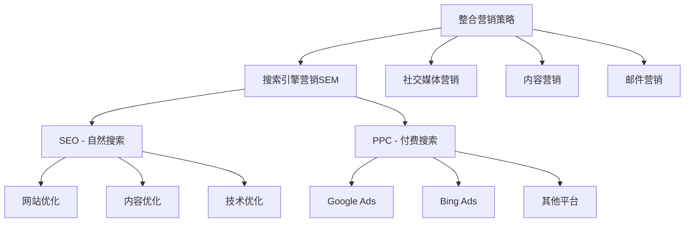
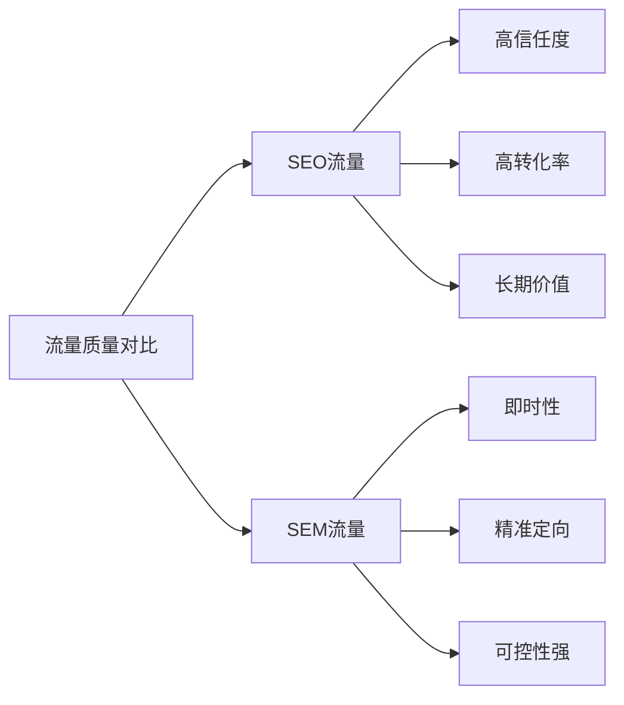
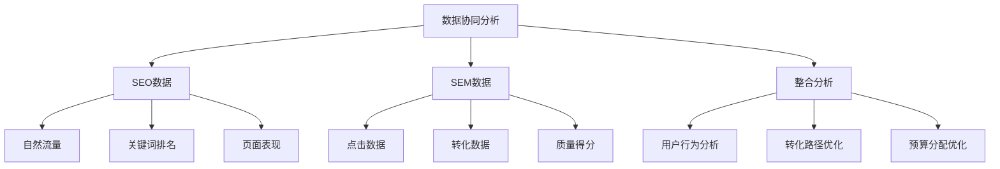
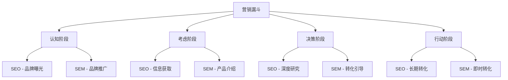
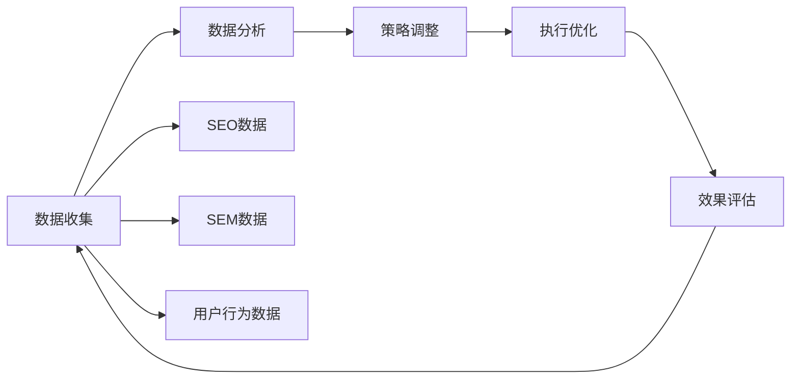
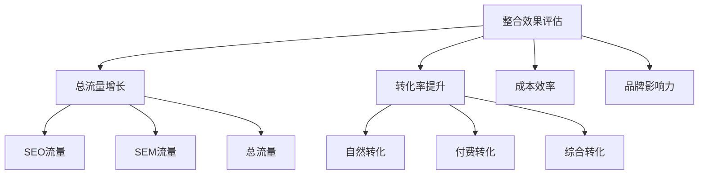

# SEO与SEM关系

## 🎯 学习目标
- 深入理解SEO与SEM的本质区别
- 掌握两者在数字营销中的定位
- 学会SEO与SEM的协同策略
- 建立整合营销思维框架

## 🧠 SEO与SEM核心概念

### 定义对比
| 概念 | SEO | SEM |
|------|-----|-----|
| **全称** | Search Engine Optimization | Search Engine Marketing |
| **中文** | 搜索引擎优化 | 搜索引擎营销 |
| **定义** | 通过优化网站获得自然搜索流量 | 通过付费广告获得搜索流量 |
| **成本** | 免费（时间成本） | 付费（点击成本） |
| **效果** | 长期稳定 | 即时见效 |

### 关系图解

## 🔍 SEO vs SEM 深度对比

### 1. 成本结构
| 维度 | SEO | SEM |
|------|-----|-----|
| **初期成本** | 低（主要是人力） | 高（广告预算） |
| **持续成本** | 中等（维护优化） | 高（持续投放） |
| **成本控制** | 相对可控 | 需要预算管理 |
| **ROI周期** | 6-12个月 | 即时 |

### 2. 效果特征
| 特征 | SEO | SEM |
|------|-----|-----|
| **见效时间** | 3-6个月 | 立即 |
| **效果稳定性** | 高 | 中（依赖预算） |
| **竞争激烈度** | 高 | 高 |
| **技术要求** | 高 | 中 |

### 3. 流量质量

## 🎯 SEO与SEM协同策略

### 1. 关键词策略协同
| 策略 | SEO重点 | SEM重点 | 协同效果 |
|------|----------|----------|----------|
| **品牌词** | 品牌保护 | 品牌推广 | 双重覆盖 |
| **产品词** | 长期排名 | 即时转化 | 互补效应 |
| **长尾词** | 内容优化 | 精准定向 | 全面覆盖 |
| **竞品词** | 内容竞争 | 直接竞争 | 竞争策略 |

### 2. 数据协同分析

### 3. 内容策略协同
- **SEO内容**：深度、权威、长期价值
- **SEM内容**：精准、转化导向、即时效果
- **协同策略**：SEO内容为SEM提供素材，SEM数据指导SEO内容方向

## 📊 整合营销框架

### 1. 营销漏斗整合

### 2. 预算分配策略
| 阶段 | SEO预算 | SEM预算 | 比例建议 |
|------|---------|---------|----------|
| **启动期** | 70% | 30% | 建立基础 |
| **成长期** | 50% | 50% | 平衡发展 |
| **成熟期** | 40% | 60% | 快速扩张 |
| **维护期** | 60% | 40% | 稳定运营 |

### 3. 时间规划
- **短期（1-3个月）**：SEM为主，SEO基础建设
- **中期（3-6个月）**：SEM+SEO并重，数据积累
- **长期（6-12个月）**：SEO为主，SEM精准投放

## 🔄 协同工作流程

### 1. 数据共享流程

### 2. 关键词协同流程
1. **关键词研究**：SEM数据指导SEO关键词选择
2. **内容规划**：SEO内容为SEM提供素材
3. **投放优化**：SEO排名影响SEM出价策略
4. **效果评估**：综合评估关键词效果

### 3. 转化路径优化
- **SEO路径**：搜索→浏览→深度阅读→转化
- **SEM路径**：搜索→点击→着陆页→转化
- **协同优化**：SEM着陆页优化指导SEO页面改进

## 📈 效果评估指标

### 1. SEO关键指标
| 指标 | 说明 | 目标 |
|------|------|------|
| **有机流量** | 自然搜索流量 | 持续增长 |
| **关键词排名** | 目标关键词位置 | 前3页 |
| **转化率** | 自然流量转化 | 行业平均以上 |
| **品牌提及** | 品牌搜索量 | 持续提升 |

### 2. SEM关键指标
| 指标 | 说明 | 目标 |
|------|------|------|
| **点击率CTR** | 广告点击率 | >2% |
| **质量得分** | Google质量得分 | >7分 |
| **转化率** | 付费流量转化 | 优化ROI |
| **成本控制** | CPC和CPA | 预算范围内 |

### 3. 整合指标

## 🎯 最佳实践策略

### 1. 启动策略
- **SEO基础**：网站结构、技术优化、内容规划
- **SEM测试**：小预算测试关键词和创意
- **数据收集**：建立数据监控体系

### 2. 发展阶段
- **SEO深化**：内容优化、外链建设、用户体验
- **SEM扩展**：扩大投放范围、优化转化路径
- **协同优化**：数据共享、策略调整

### 3. 成熟阶段
- **SEO维护**：持续优化、内容更新、技术升级
- **SEM精准**：精准投放、高转化关键词
- **创新探索**：新技术、新渠道、新策略

## 📚 学习路径

### 基础理解
1. [[01-SEO定义与核心概念]] - SEO基础概念
2. [[02-SEO发展历史]] - SEO发展历程
3. [[03-SEO类型分类]] - SEO分类体系

### 深入应用
1. [[02-理解层-核心机制#2.1-Google算法深度解析]] - 算法理解
2. [[03-应用层-实践技能#3.1-SEO工具精通]] - 工具应用
3. [[04-精通层-高级策略#4.1-企业级SEO策略]] - 高级策略

### 实战练习
1. [[03-应用层-实践技能#3.4-项目管理#SEO项目规划]] - 项目管理
2. [[05-实战案例与模板#5.1-成功案例分析]] - 案例分析
3. [[06-工具与资源#6.1-SEO工具大全]] - 工具资源

## 📖 相关链接
- [[01-SEO定义与核心概念]] - SEO基础概念
- [[02-SEO发展历史]] - SEO发展历程
- [[03-SEO类型分类]] - SEO分类体系
- [[01-SEO商业价值]] - SEO商业价值
- [[02-SEO对业务影响]] - 业务影响分析
- [[03-SEO投资回报]] - ROI分析
