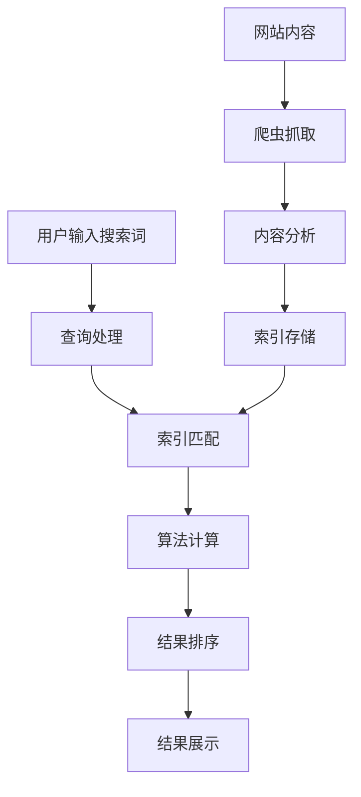
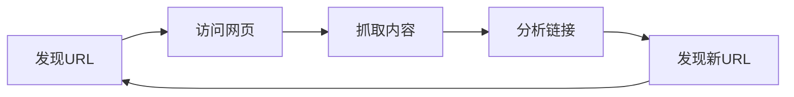
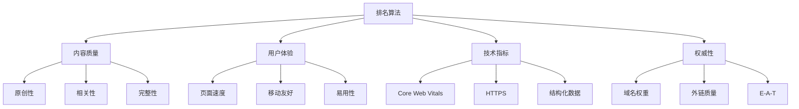
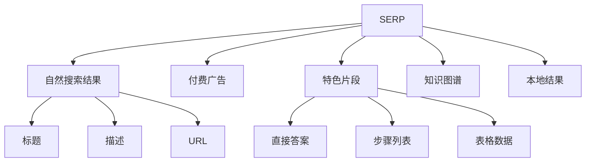

# Google搜索工作原理

## 🎯 学习目标
- 理解Google搜索的基本流程
- 掌握爬虫、索引、排名机制
- 了解搜索算法工作原理
- 建立搜索引擎认知框架

## 🔍 Google搜索流程

### 完整搜索流程

### 三大核心环节
1. **爬取（Crawling）**：发现和抓取网页
2. **索引（Indexing）**：分析和存储内容
3. **排名（Ranking）**：计算和排序结果

## 🕷️ 爬虫机制

### 爬虫工作原理
**定义**：Googlebot是Google的网页爬虫程序
**功能**：自动发现、访问和抓取网页内容

### 爬取过程

### 爬取影响因素
| 因素 | 影响 | 优化建议 |
|------|------|----------|
| 网站结构 | 影响爬取效率 | 清晰的URL结构 |
| 页面速度 | 影响爬取频率 | 优化加载速度 |
| 内容质量 | 影响爬取深度 | 提供优质内容 |
| 链接结构 | 影响发现能力 | 合理内链布局 |

## 📚 索引机制

### 索引过程
**定义**：将网页内容转换为可搜索的数据库
**目的**：快速匹配用户查询

### 索引步骤
1. **内容分析**：提取文本、图片、视频等
2. **关键词提取**：识别重要词汇
3. **语义理解**：理解内容含义
4. **分类存储**：按主题分类存储

### 索引影响因素
- **内容质量**：原创性、相关性
- **技术结构**：HTML标签、结构化数据
- **用户体验**：页面速度、移动友好
- **权威性**：域名权重、外链质量

## 🏆 排名算法

### PageRank算法
**核心思想**：链接数量和质量决定页面重要性
**计算公式**：PR(A) = (1-d) + d(PR(T1)/C(T1) + ... + PR(Tn)/C(Tn))

### 现代排名因素

## 🎯 搜索意图理解

### 搜索意图分类
| 意图类型 | 特征 | 优化策略 |
|----------|------|----------|
| 信息型 | 获取信息、学习知识 | 提供详细内容 |
| 导航型 | 找到特定网站 | 品牌词优化 |
| 交易型 | 购买产品或服务 | 产品页优化 |
| 本地型 | 寻找本地服务 | 本地SEO优化 |

### 意图识别机制
1. **关键词分析**：分析搜索词特征
2. **用户行为**：分析点击和停留时间
3. **上下文理解**：结合用户历史
4. **语义匹配**：理解真实需求

## 📊 搜索结果展示

### SERP组成要素

### 结果展示优化
- **标题优化**：吸引点击的标题
- **描述优化**：准确描述内容
- **结构化数据**：获得丰富摘要
- **特色片段**：争取零点击搜索

## 🔄 算法更新机制

### 更新类型
1. **核心算法更新**：重大算法改进
2. **垃圾信息更新**：打击低质量内容
3. **产品更新**：新功能推出
4. **系统更新**：技术系统改进

### 更新影响
- **排名波动**：搜索结果位置变化
- **流量变化**：网站流量增减
- **策略调整**：SEO策略需要调整
- **工具更新**：SEO工具功能更新

## 🎯 优化建议

### 技术优化
- **网站结构**：清晰的层次结构
- **页面速度**：优化加载时间
- **移动友好**：响应式设计
- **HTTPS**：安全连接

### 内容优化
- **原创内容**：提供独特价值
- **关键词优化**：自然融入关键词
- **内容深度**：提供详细信息
- **更新频率**：定期更新内容

### 用户体验优化
- **易用性**：清晰的导航
- **可读性**：良好的排版
- **交互性**：用户参与功能
- **个性化**：基于用户偏好

## 📚 学习路径

### 基础理解
1. [[02-搜索引擎算法基础]] - 算法原理
2. [[03-搜索意图理解]] - 意图分析
3. [[04-搜索结果页面结构]] - SERP分析

### 深入应用
1. [[01-网站结构优化]] - 技术优化
2. [[01-内容策略规划]] - 内容优化
3. [[01-用户体验指标]] - 体验优化

## 📖 相关链接
- [[02-搜索引擎算法基础]] - 学习算法原理
- [[03-搜索意图理解]] - 理解用户意图
- [[04-搜索结果页面结构]] - 了解SERP结构
- [[01-Google核心算法]] - 深入理解算法
