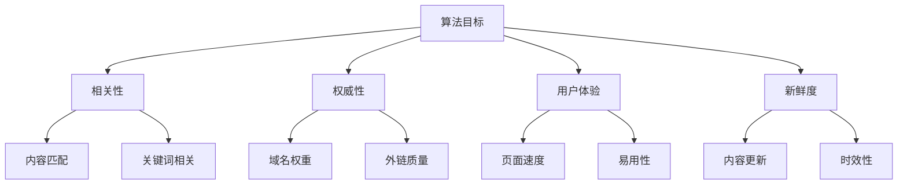
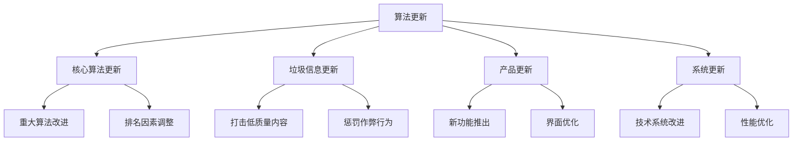

# 搜索引擎算法基础

## 🎯 学习目标
- 理解搜索引擎算法的基本原理
- 掌握核心算法要素
- 了解算法评估标准
- 建立算法认知框架

## 🧠 算法基本原理

### 算法定义
**搜索引擎算法**：一套复杂的数学公式和规则，用于评估网页与搜索查询的相关性和质量，并据此对搜索结果进行排序。

### 核心目标


## 🔢 核心算法要素

### 1. 相关性算法
**目的**：评估内容与搜索查询的匹配程度

**主要因素**：
- **关键词匹配**：查询词在页面中的出现
- **语义相关性**：理解词汇的语义关系
- **内容深度**：内容的完整性和详细程度
- **用户意图**：理解用户真实需求

### 2. 权威性算法
**目的**：评估网站和页面的可信度和权威性

**主要因素**：
- **域名权重**：域名的整体权威性
- **外链质量**：来自权威网站的链接
- **内容质量**：内容的原创性和专业性
- **作者权威**：内容作者的权威性

### 3. 用户体验算法
**目的**：评估用户访问网站的体验质量

**主要因素**：
- **页面速度**：加载时间快慢
- **移动友好**：移动设备适配
- **易用性**：导航和操作便利性
- **安全性**：HTTPS等安全措施

## 📊 算法评估维度

### 内容质量评估
| 维度 | 评估标准 | 权重 |
|------|----------|------|
| 原创性 | 内容是否原创 | 高 |
| 深度 | 内容详细程度 | 中 |
| 准确性 | 信息准确性 | 高 |
| 完整性 | 信息完整性 | 中 |

### 技术质量评估
| 维度 | 评估标准 | 权重 |
|------|----------|------|
| 页面速度 | Core Web Vitals | 高 |
| 移动友好 | 响应式设计 | 高 |
| 安全性 | HTTPS协议 | 中 |
| 结构化 | Schema标记 | 中 |

### 用户体验评估
| 维度 | 评估标准 | 权重 |
|------|----------|------|
| 点击率 | CTR表现 | 高 |
| 停留时间 | 用户参与度 | 中 |
| 跳出率 | 页面相关性 | 中 |
| 返回率 | 用户满意度 | 低 |

## 🎯 主要算法类型

### PageRank算法
**核心思想**：链接数量和质量决定页面重要性

**计算公式**：
```
PR(A) = (1-d) + d(PR(T1)/C(T1) + ... + PR(Tn)/C(Tn))
```

**影响因素**：
- 链接数量
- 链接质量
- 链接文本相关性
- 链接页面权威性

### TF-IDF算法
**核心思想**：词频-逆文档频率，评估词汇重要性

**计算原理**：
- **TF（词频）**：词汇在文档中的频率
- **IDF（逆文档频率）**：词汇在语料库中的稀有程度

**应用场景**：
- 关键词密度计算
- 内容相关性评估
- 重复内容检测

### 机器学习算法
**核心思想**：通过机器学习不断优化搜索结果

**主要技术**：
- **神经网络**：深度学习理解内容
- **自然语言处理**：理解语义和语境
- **用户行为分析**：基于用户行为优化

## 🔄 算法更新机制

### 更新类型


### 更新频率
| 更新类型 | 频率 | 影响范围 |
|----------|------|----------|
| 核心算法 | 每年1-2次 | 全局影响 |
| 垃圾信息 | 每月1-2次 | 特定网站 |
| 产品更新 | 不定期 | 功能影响 |
| 系统更新 | 持续进行 | 技术优化 |

## 📈 算法发展趋势

### 当前趋势
- **用户体验优先**：Core Web Vitals成为重要指标
- **内容质量**：E-A-T（专业性、权威性、可信度）
- **移动优先**：移动端体验至关重要
- **AI驱动**：人工智能深度应用

### 未来方向
- **个性化搜索**：基于用户行为定制
- **语音搜索**：语音助手普及
- **视觉搜索**：图像识别技术
- **零点击搜索**：直接答案展示

## 🎯 算法优化策略

### 内容优化
1. **原创性**：提供独特价值内容
2. **深度**：详细全面的信息
3. **更新**：定期更新内容
4. **相关性**：与目标关键词高度相关

### 技术优化
1. **页面速度**：优化加载时间
2. **移动友好**：响应式设计
3. **安全性**：HTTPS协议
4. **结构化**：Schema标记

### 用户体验优化
1. **易用性**：清晰的导航
2. **可读性**：良好的排版
3. **交互性**：用户参与功能
4. **个性化**：基于用户偏好

## ⚠️ 算法风险与应对

### 常见风险
- **算法更新**：排名波动
- **竞争加剧**：排名下降
- **技术问题**：网站故障
- **内容问题**：质量下降

### 应对策略
- **监控排名**：及时发现变化
- **备份策略**：准备应急方案
- **持续优化**：不断改进
- **专业咨询**：寻求专业帮助

## 📚 学习路径

### 基础理解
1. [[01-Google搜索工作原理]] - 理解搜索机制
2. [[03-搜索意图理解]] - 学习意图分析
3. [[04-搜索结果页面结构]] - 了解SERP

### 深入应用
1. [[01-Google核心算法]] - 深入学习算法
2. [[01-关键词研究基础]] - 掌握关键词策略
3. [[01-技术SEO]] - 学习技术优化

## 📖 相关链接
- [[01-Google搜索工作原理]] - 理解搜索机制
- [[03-搜索意图理解]] - 学习意图分析
- [[04-搜索结果页面结构]] - 了解SERP结构
- [[01-Google核心算法]] - 深入学习算法
