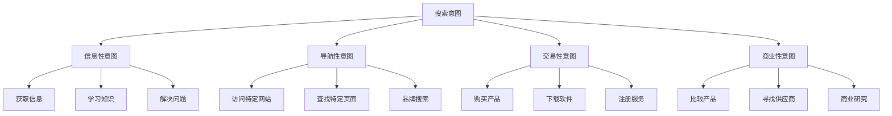
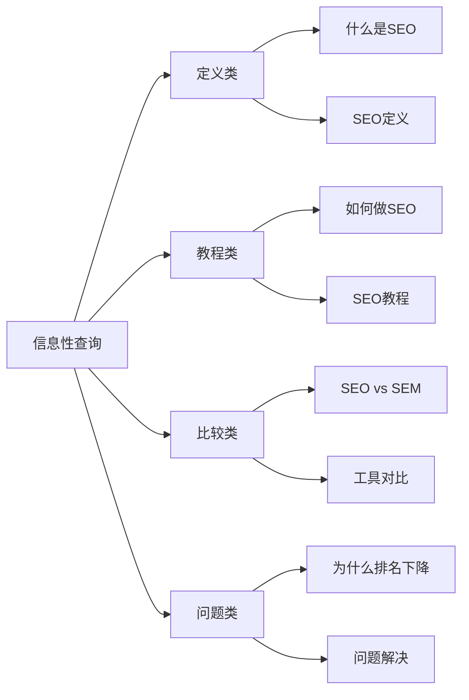
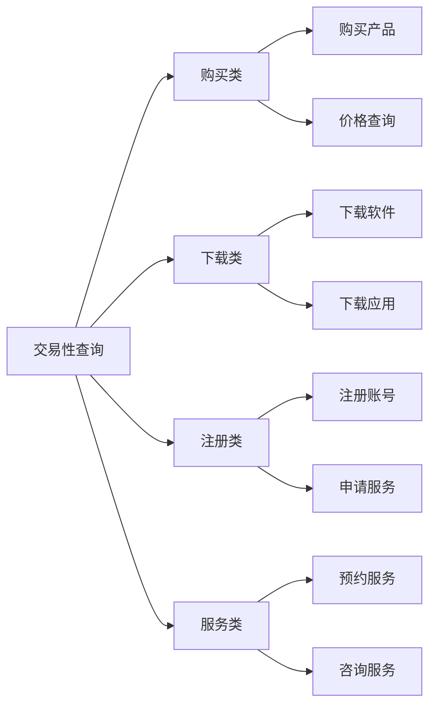
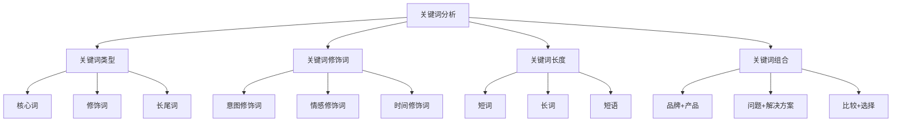
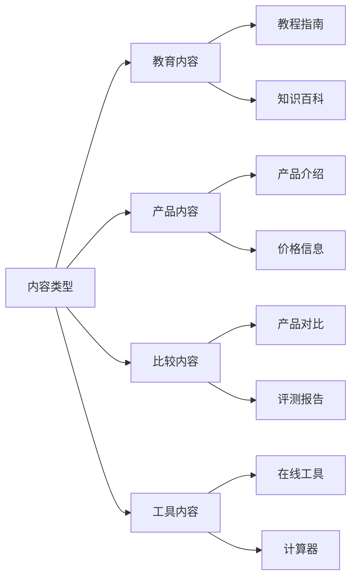
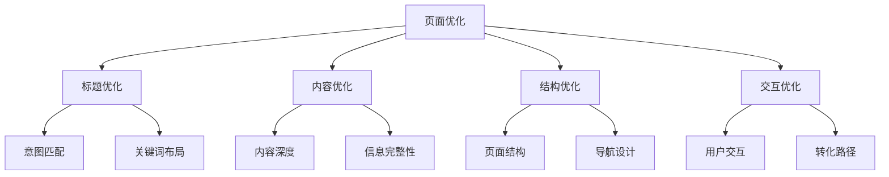
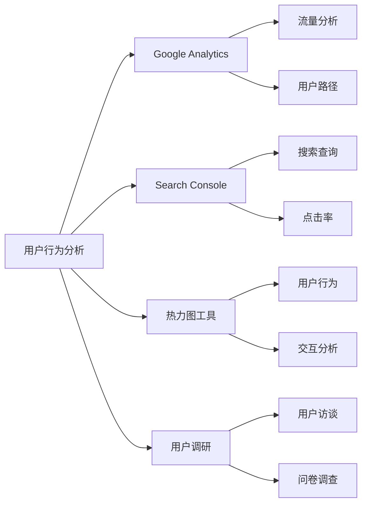
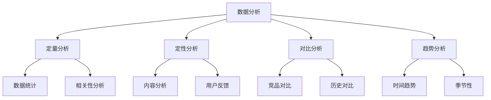

# 搜索意图理解

## 🎯 学习目标
- 深入理解用户搜索意图的本质
- 掌握搜索意图的分类和识别方法
- 学会基于搜索意图优化内容策略
- 建立搜索意图分析认知框架

## 🧠 搜索意图核心概念

### 定义与意义
**搜索意图**：用户在搜索引擎中输入查询时想要实现的目标或满足的需求

### 搜索意图的重要性
- **用户体验**：理解用户真实需求
- **内容匹配**：提供精准的内容解决方案
- **转化优化**：提升用户转化率
- **竞争优势**：超越竞争对手的搜索体验

## 📊 搜索意图分类体系

### 1. 信息性意图（Informational Intent）
**目标**：获取信息、学习知识、解决问题

#### 特征分析
| 特征 | 具体表现 | 优化策略 |
|------|----------|----------|
| **查询类型** | "什么是"、"如何"、"为什么" | 教育性内容、教程指南 |
| **用户行为** | 浏览多个页面、深度阅读 | 内容深度、信息全面 |
| **转化期望** | 低转化期望、高信息价值 | 建立信任、品牌认知 |
| **内容需求** | 详细解释、步骤指导 | 结构化内容、可视化 |

#### 常见查询模式

### 2. 导航性意图（Navigational Intent）
**目标**：访问特定网站或页面

#### 特征分析
| 特征 | 具体表现 | 优化策略 |
|------|----------|----------|
| **查询类型** | 品牌名、网站名 | 品牌优化、网站结构 |
| **用户行为** | 直接点击、快速离开 | 快速加载、清晰导航 |
| **转化期望** | 高转化期望、品牌忠诚 | 品牌体验、用户服务 |
| **内容需求** | 品牌信息、产品展示 | 品牌页面、产品页面 |

#### 常见查询模式
- **品牌搜索**：公司名、产品名
- **网站搜索**：特定网站访问
- **页面搜索**：特定页面查找
- **功能搜索**：特定功能使用

### 3. 交易性意图（Transactional Intent）
**目标**：完成购买、下载、注册等交易行为

#### 特征分析
| 特征 | 具体表现 | 优化策略 |
|------|----------|----------|
| **查询类型** | "购买"、"下载"、"注册" | 产品页面、转化优化 |
| **用户行为** | 快速决策、直接转化 | 简化流程、信任建立 |
| **转化期望** | 极高转化期望 | 转化路径优化 |
| **内容需求** | 产品信息、价格、评价 | 产品详情、用户评价 |

#### 常见查询模式

### 4. 商业性意图（Commercial Intent）
**目标**：比较产品、寻找供应商、商业研究

#### 特征分析
| 特征 | 具体表现 | 优化策略 |
|------|----------|----------|
| **查询类型** | "最佳"、"推荐"、"比较" | 比较内容、推荐列表 |
| **用户行为** | 深度比较、多页面浏览 | 详细对比、专业分析 |
| **转化期望** | 中等转化期望 | 建立权威、提供价值 |
| **内容需求** | 专业分析、客观评价 | 专业内容、数据支持 |

#### 常见查询模式
- **比较查询**：产品对比、服务比较
- **推荐查询**：最佳选择、推荐列表
- **评价查询**：用户评价、专业评测
- **研究查询**：市场研究、行业分析

## 🔍 搜索意图识别方法

### 1. 关键词分析

### 2. 用户行为分析
| 行为指标 | 信息性 | 导航性 | 交易性 | 商业性 |
|----------|--------|--------|--------|--------|
| **页面停留时间** | 长 | 短 | 中等 | 长 |
| **页面浏览量** | 多 | 少 | 中等 | 多 |
| **跳出率** | 低 | 高 | 中等 | 低 |
| **转化率** | 低 | 高 | 高 | 中等 |

### 3. 内容类型分析

## 📈 搜索意图优化策略

### 1. 内容策略优化
| 意图类型 | 内容策略 | 优化重点 | 转化目标 |
|----------|----------|----------|----------|
| **信息性** | 教育性内容、深度分析 | 内容质量、权威性 | 品牌认知、信任建立 |
| **导航性** | 品牌页面、产品展示 | 用户体验、加载速度 | 直接转化、用户服务 |
| **交易性** | 产品页面、购买流程 | 转化路径、信任建立 | 直接销售、注册 |
| **商业性** | 比较内容、专业分析 | 客观性、专业性 | 线索获取、品牌权威 |

### 2. 页面优化策略

### 3. 用户体验优化
- **信息性意图**：提供全面、准确的信息
- **导航性意图**：快速、准确的页面定位
- **交易性意图**：简化、安全的交易流程
- **商业性意图**：专业、客观的比较分析

## 🎯 搜索意图分析工具

### 1. 关键词工具
| 工具类型 | 工具名称 | 功能特点 | 适用场景 |
|----------|----------|----------|----------|
| **关键词研究** | Google Keyword Planner | 搜索量、竞争度 | 关键词发现 |
| **关键词分析** | SEMrush | 意图分析、竞争分析 | 深度分析 |
| **长尾关键词** | Answer The Public | 问题挖掘、意图发现 | 内容规划 |
| **语义分析** | Text Optimizer | 语义相关、意图匹配 | 内容优化 |

### 2. 用户行为分析

### 3. 内容分析工具
- **内容质量分析**：内容深度、原创性
- **意图匹配分析**：内容与意图的匹配度
- **竞争内容分析**：竞争对手的内容策略
- **用户反馈分析**：用户对内容的反馈

## 📊 搜索意图数据收集

### 1. 数据来源
| 数据来源 | 数据类型 | 收集方法 | 分析价值 |
|----------|----------|----------|----------|
| **搜索查询** | 关键词、搜索量 | Search Console | 意图识别 |
| **用户行为** | 点击、停留、转化 | Analytics | 行为分析 |
| **内容表现** | 排名、流量、转化 | 工具监控 | 效果评估 |
| **用户反馈** | 评价、建议、投诉 | 调研收集 | 需求洞察 |

### 2. 数据分析方法

### 3. 数据应用策略
- **意图识别**：基于数据识别用户真实意图
- **内容优化**：根据数据优化内容策略
- **用户体验**：基于数据改善用户体验
- **转化优化**：利用数据提升转化效果

## 🎯 搜索意图优化实践

### 1. 短期优化（1-3个月）
- **关键词研究**：深入分析目标关键词的搜索意图
- **内容审计**：评估现有内容与搜索意图的匹配度
- **页面优化**：优化页面标题、描述和内容结构
- **用户体验**：改善页面加载速度和用户交互

### 2. 中期优化（3-6个月）
- **内容策略**：制定基于搜索意图的内容策略
- **页面重构**：重构页面以更好匹配搜索意图
- **转化优化**：优化转化路径和转化率
- **竞争分析**：分析竞争对手的意图优化策略

### 3. 长期优化（6-12个月）
- **品牌建设**：建立品牌在搜索意图中的权威性
- **用户洞察**：深入理解用户需求和行为模式
- **创新策略**：开发创新的意图优化策略
- **持续优化**：建立持续优化的机制和流程

## 📚 学习路径

### 基础理解
1. [[01-Google搜索工作原理]] - 搜索工作原理
2. [[02-搜索引擎算法基础]] - 算法基础
3. [[04-搜索结果页面结构]] - 搜索结果结构

### 深入应用
1. [[02-理解层-核心机制#2.2-关键词策略]] - 关键词策略
2. [[02-理解层-核心机制#2.4-内容SEO]] - 内容优化
3. [[02-理解层-核心机制#2.5-用户体验]] - 用户体验

### 实战练习
1. [[03-应用层-实践技能#3.1-SEO工具精通]] - 工具应用
2. [[03-应用层-实践技能#3.3-竞争分析]] - 竞争分析
3. [[05-实战案例与模板#5.1-成功案例分析]] - 案例分析

## 📖 相关链接
- [[01-Google搜索工作原理]] - 搜索工作原理
- [[02-搜索引擎算法基础]] - 算法基础
- [[04-搜索结果页面结构]] - 搜索结果结构
- [[02-理解层-核心机制#2.2-关键词策略]] - 关键词策略
- [[02-理解层-核心机制#2.4-内容SEO]] - 内容优化
- [[02-理解层-核心机制#2.5-用户体验]] - 用户体验
