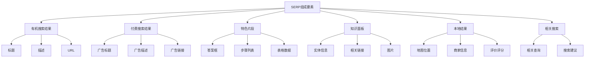
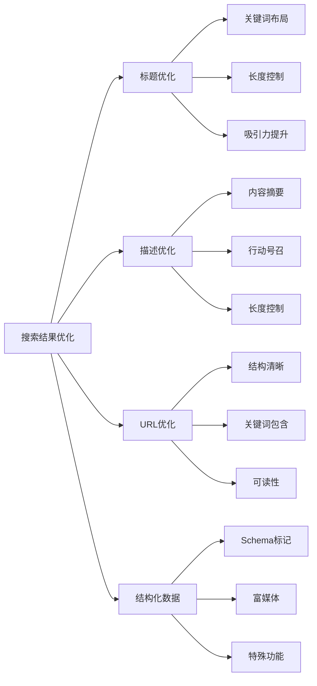
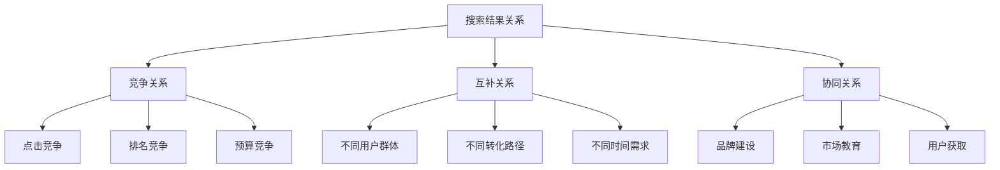
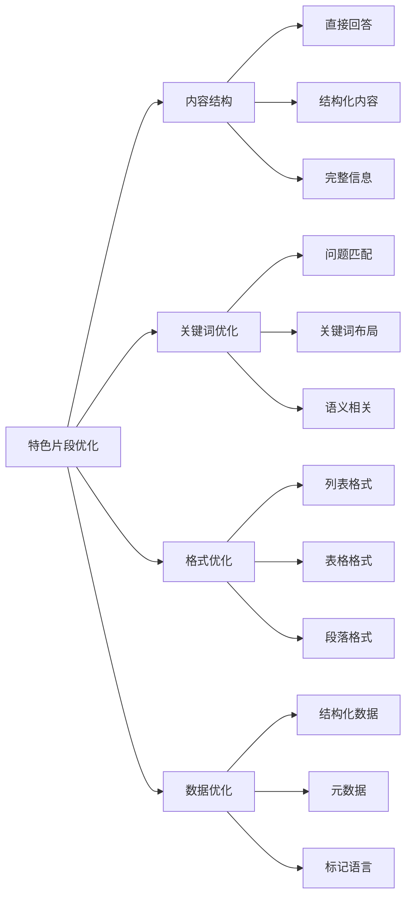
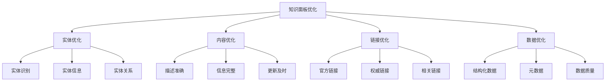
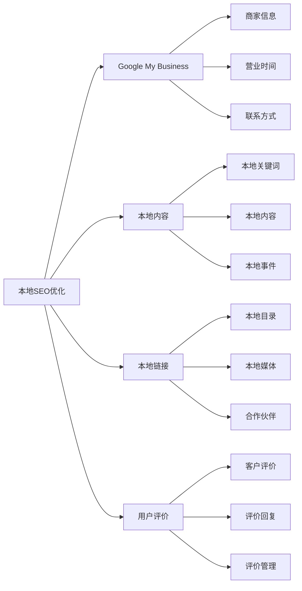
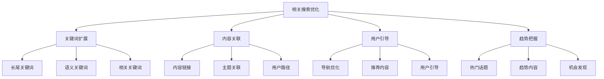
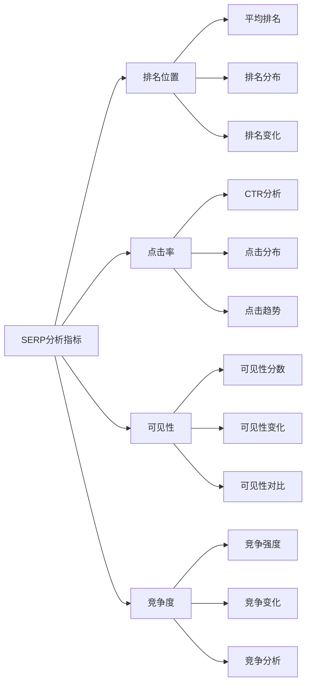
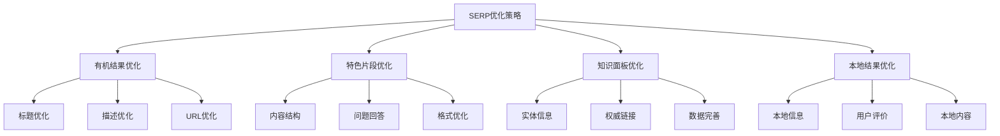

# 搜索结果页面结构

## 🎯 学习目标
- 深入理解搜索结果页面（SERP）的组成要素
- 掌握不同类型搜索结果的优化策略
- 学会SERP分析和竞争策略制定
- 建立SERP优化认知框架

## 📄 SERP核心概念

### 定义与意义
**SERP（Search Engine Results Page）**：搜索引擎结果页面，用户搜索后显示的包含各种搜索结果的页面

### SERP的重要性
- **用户体验**：直接影响用户搜索体验
- **点击分布**：影响搜索结果点击分布
- **竞争格局**：反映搜索竞争格局
- **优化方向**：指导SEO优化方向

## 🔍 有机搜索结果结构

### 1. 标准搜索结果
| 元素 | 内容 | 优化重点 | 影响因子 |
|------|------|----------|----------|
| **标题（Title）** | 页面标题 | 关键词匹配、吸引力 | 点击率、相关性 |
| **描述（Description）** | 页面描述 | 内容摘要、行动号召 | 点击率、用户体验 |
| **URL** | 页面地址 | 结构清晰、关键词 | 信任度、相关性 |
| **面包屑** | 导航路径 | 网站结构、关键词 | 用户体验、理解度 |

### 2. 搜索结果优化

### 3. 点击率优化策略
- **标题吸引力**：使用数字、问题、情感词汇
- **描述价值**：突出内容价值和用户利益
- **品牌信任**：建立品牌知名度和信任度
- **相关性匹配**：确保内容与搜索意图匹配

## 💰 付费搜索结果

### 1. 广告结构分析
| 广告元素 | 内容要求 | 优化策略 | 影响因素 |
|----------|----------|----------|----------|
| **广告标题** | 25字符限制 | 关键词匹配、吸引力 | 质量得分、点击率 |
| **广告描述** | 90字符限制 | 价值主张、行动号召 | 转化率、相关性 |
| **显示URL** | 域名显示 | 品牌识别、信任度 | 品牌认知、点击率 |
| **扩展信息** | 附加链接 | 更多信息、导航 | 用户体验、转化 |

### 2. 广告与有机结果关系

### 3. 付费结果优化
- **关键词策略**：精准匹配用户搜索意图
- **广告创意**：吸引人的标题和描述
- **着陆页优化**：与广告内容高度相关
- **质量得分**：提升广告质量和相关性

## ⭐ 特色片段（Featured Snippets）

### 1. 特色片段类型
| 片段类型 | 内容形式 | 优化策略 | 获取难度 |
|----------|----------|----------|----------|
| **段落片段** | 文字段落 | 直接回答、结构化内容 | 中等 |
| **列表片段** | 有序/无序列表 | 列表格式、步骤清晰 | 容易 |
| **表格片段** | 表格数据 | 结构化数据、对比清晰 | 中等 |
| **视频片段** | 视频内容 | 视频优化、字幕添加 | 困难 |

### 2. 特色片段优化策略

### 3. 特色片段获取方法
- **问题回答**：直接回答用户问题
- **内容结构**：使用清晰的标题和段落
- **数据展示**：使用表格和列表格式
- **技术优化**：添加结构化数据标记

## 🧠 知识面板（Knowledge Panel）

### 1. 知识面板组成
| 面板元素 | 内容类型 | 数据来源 | 优化策略 |
|----------|----------|----------|----------|
| **基本信息** | 名称、描述、图片 | 结构化数据、权威来源 | 完善实体信息 |
| **相关链接** | 官方网站、社交媒体 | 官方渠道、权威链接 | 建立权威链接 |
| **事实信息** | 成立时间、创始人 | 维基百科、官方资料 | 信息准确性 |
| **用户评价** | 评分、评论 | 用户生成内容 | 用户满意度 |

### 2. 知识面板优化

### 3. 知识面板获取策略
- **实体建设**：建立清晰的品牌实体
- **内容权威**：提供权威、准确的内容
- **链接建设**：获得权威网站的链接
- **数据完善**：完善所有相关信息

## 📍 本地搜索结果

### 1. 本地结果结构
| 结果元素 | 内容信息 | 优化重点 | 影响因素 |
|----------|----------|----------|----------|
| **地图位置** | 地理位置、路线 | 位置准确性、服务范围 | 本地相关性 |
| **商家信息** | 名称、地址、电话 | 信息完整性、准确性 | 本地信任度 |
| **评价评分** | 星级、评论数量 | 服务质量、用户满意度 | 用户评价 |
| **营业时间** | 开放时间、服务时间 | 时间准确性、可用性 | 用户体验 |

### 2. 本地SEO优化

### 3. 本地结果优化策略
- **Google My Business**：完善商家信息
- **本地关键词**：优化本地相关关键词
- **用户评价**：鼓励用户评价和反馈
- **本地内容**：创建本地相关的内容

## 🔗 相关搜索和建议

### 1. 相关搜索类型
| 搜索类型 | 内容形式 | 优化价值 | 利用策略 |
|----------|----------|----------|----------|
| **相关查询** | 相关搜索词 | 关键词扩展、内容规划 | 内容策略制定 |
| **搜索建议** | 自动完成建议 | 用户意图理解 | 用户体验优化 |
| **相关话题** | 相关主题 | 内容关联、用户引导 | 内容关联优化 |
| **热门搜索** | 热门关键词 | 趋势把握、机会发现 | 趋势内容创作 |

### 2. 相关搜索优化

### 3. 相关搜索利用策略
- **关键词研究**：发现新的关键词机会
- **内容规划**：制定相关内容策略
- **用户体验**：改善用户导航和引导
- **趋势跟踪**：把握搜索趋势和机会

## 📊 SERP分析工具

### 1. 分析工具类型
| 工具类型 | 工具名称 | 功能特点 | 适用场景 |
|----------|----------|----------|----------|
| **SERP分析** | SEMrush | 排名分析、竞争分析 | 竞争研究 |
| **关键词工具** | Ahrefs | 关键词排名、SERP分析 | 关键词研究 |
| **排名监控** | RankIQ | 排名跟踪、SERP监控 | 排名监控 |
| **特色片段** | Sistrix | 特色片段分析 | 片段优化 |

### 2. SERP分析指标

### 3. SERP分析应用
- **竞争分析**：了解竞争对手的SERP表现
- **机会发现**：发现SERP优化机会
- **策略制定**：制定SERP优化策略
- **效果评估**：评估SERP优化效果

## 🎯 SERP优化策略

### 1. 综合优化策略

### 2. 优化优先级
| 优化类型 | 优先级 | 实施难度 | 预期效果 |
|----------|--------|----------|----------|
| **有机结果** | 高 | 中等 | 高 |
| **特色片段** | 中 | 中等 | 中 |
| **知识面板** | 中 | 困难 | 高 |
| **本地结果** | 中 | 容易 | 中 |

### 3. 优化实施步骤
1. **SERP分析**：分析目标关键词的SERP
2. **竞争分析**：分析竞争对手的SERP表现
3. **机会识别**：识别SERP优化机会
4. **策略制定**：制定具体的优化策略
5. **实施优化**：实施SERP优化措施
6. **效果监控**：监控优化效果和调整策略

## 📚 学习路径

### 基础理解
1. [[01-Google搜索工作原理]] - 搜索工作原理
2. [[02-搜索引擎算法基础]] - 算法基础
3. [[03-搜索意图理解]] - 搜索意图理解

### 深入应用
1. [[02-理解层-核心机制#2.2-关键词策略]] - 关键词策略
2. [[02-理解层-核心机制#2.4-内容SEO]] - 内容优化
3. [[02-理解层-核心机制#2.5-用户体验]] - 用户体验

### 实战练习
1. [[03-应用层-实践技能#3.1-SEO工具精通]] - 工具应用
2. [[03-应用层-实践技能#3.3-竞争分析]] - 竞争分析
3. [[05-实战案例与模板#5.1-成功案例分析]] - 案例分析

## 📖 相关链接
- [[01-Google搜索工作原理]] - 搜索工作原理
- [[02-搜索引擎算法基础]] - 算法基础
- [[03-搜索意图理解]] - 搜索意图理解
- [[02-理解层-核心机制#2.2-关键词策略]] - 关键词策略
- [[02-理解层-核心机制#2.4-内容SEO]] - 内容优化
- [[02-理解层-核心机制#2.5-用户体验]] - 用户体验
