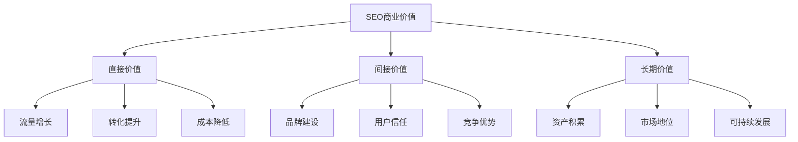
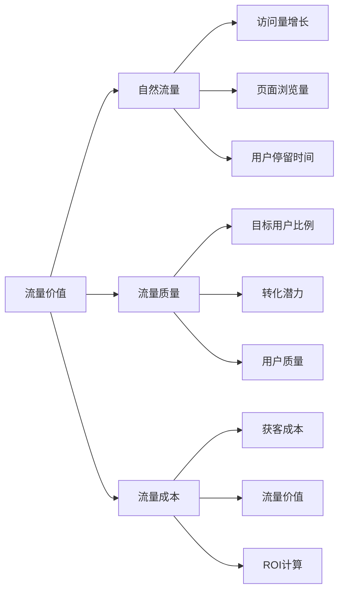
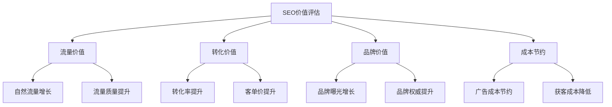
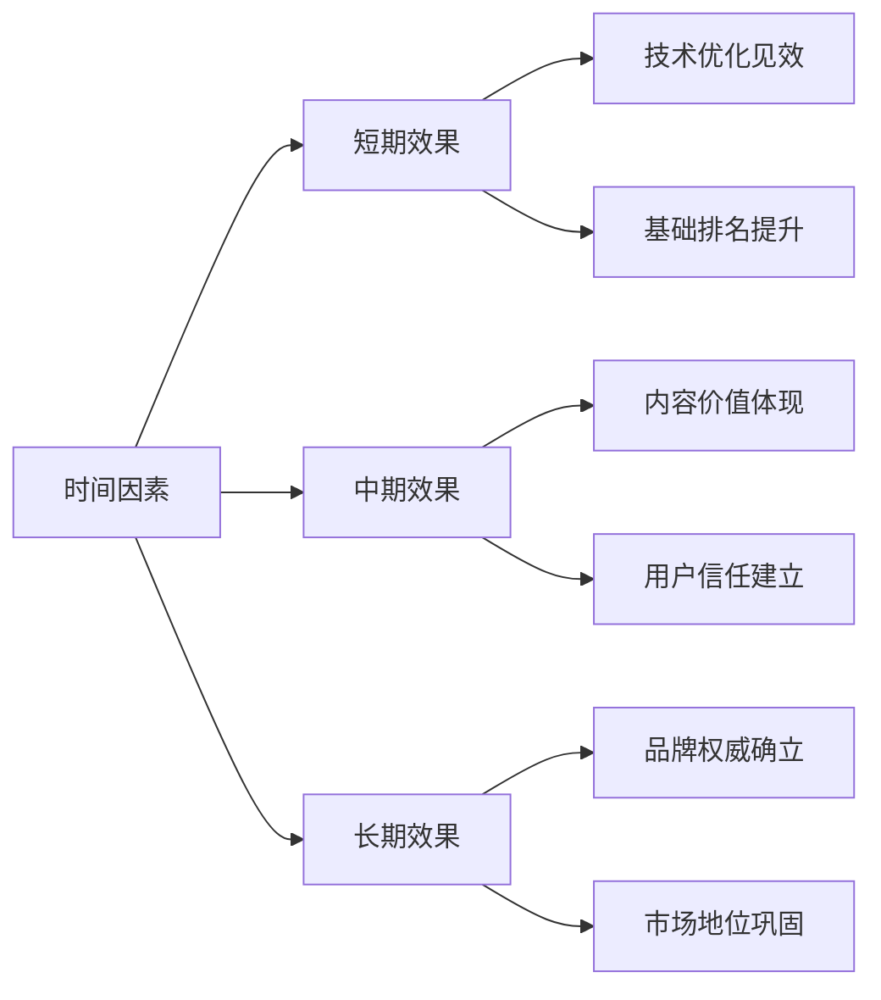
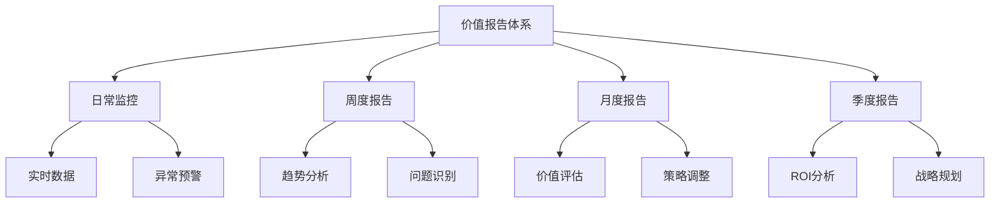
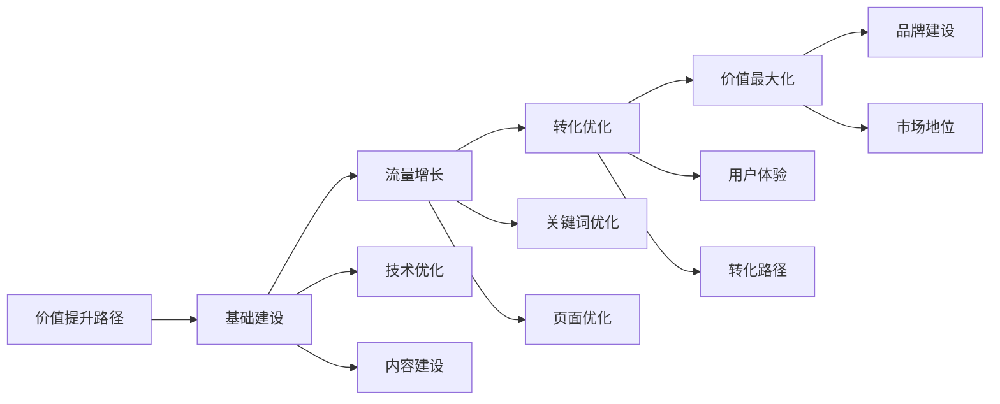

# SEO商业价值

## 🎯 学习目标
- 深入理解SEO的商业价值本质
- 掌握SEO价值评估方法
- 学会量化SEO投资回报
- 建立SEO商业价值认知框架

## 💰 SEO商业价值概述

### 核心价值定义
**SEO商业价值**：通过搜索引擎优化为企业带来的商业收益和竞争优势



### 价值层次分析
| 价值层次 | 具体表现 | 量化指标 | 时间周期 |
|----------|----------|----------|----------|
| **短期价值** | 流量增长、排名提升 | 访问量、排名位置 | 1-3个月 |
| **中期价值** | 转化提升、收入增长 | 转化率、收入 | 3-12个月 |
| **长期价值** | 品牌建设、市场地位 | 品牌提及、市场份额 | 12个月以上 |

## 📊 SEO价值量化分析

### 1. 流量价值


### 2. 转化价值
| 转化类型 | 价值计算 | 影响因素 | 优化方向 |
|----------|----------|----------|----------|
| **直接销售** | 销售额 × 转化率 | 产品吸引力、价格 | 产品页面优化 |
| **线索获取** | 线索数量 × 线索价值 | 表单设计、信任度 | 着陆页优化 |
| **品牌曝光** | 曝光次数 × 品牌价值 | 内容质量、权威性 | 内容营销 |
| **用户留存** | 留存率 × 用户价值 | 用户体验、价值提供 | 用户体验优化 |

### 3. 成本节约价值
- **广告成本节约**：减少付费广告依赖
- **获客成本降低**：自然流量获客成本更低
- **运营效率提升**：自动化流量获取
- **竞争成本降低**：建立竞争壁垒

## 🎯 不同行业SEO价值分析

### 1. 电商行业
| 价值维度 | 具体表现 | 量化方法 |
|----------|----------|----------|
| **销售增长** | 产品页面排名提升 | 销售额 × 流量增长 |
| **品牌建设** | 品牌词搜索量增长 | 品牌提及 × 品牌价值 |
| **用户获取** | 新用户注册增长 | 注册用户 × 用户价值 |
| **复购提升** | 用户忠诚度提升 | 复购率 × 客单价 |

### 2. B2B行业
| 价值维度 | 具体表现 | 量化方法 |
|----------|----------|----------|
| **线索获取** | 高质量潜在客户 | 线索数量 × 线索价值 |
| **品牌权威** | 行业权威地位 | 权威链接 × 品牌价值 |
| **销售支持** | 销售线索质量提升 | 转化率 × 客单价 |
| **市场教育** | 行业知识普及 | 内容传播 × 影响力 |

### 3. 服务行业
| 价值维度 | 具体表现 | 量化方法 |
|----------|----------|----------|
| **客户获取** | 本地客户增长 | 本地搜索 × 服务价值 |
| **信任建立** | 专业形象提升 | 信任指标 × 品牌价值 |
| **口碑传播** | 用户推荐增长 | 推荐率 × 客户价值 |
| **服务优化** | 用户体验提升 | 满意度 × 服务价值 |

## 📈 SEO价值评估模型

### 1. 基础评估模型


### 2. 价值计算公式
**总SEO价值** = 流量价值 + 转化价值 + 品牌价值 + 成本节约

**流量价值** = 自然流量增长 × 平均流量价值
**转化价值** = 转化增长 × 平均转化价值
**品牌价值** = 品牌曝光增长 × 品牌价值系数
**成本节约** = 广告成本节约 + 获客成本节约

### 3. ROI计算模型
```mermaid
graph LR
    A[SEO ROI] --> B[投资成本]
    A --> C[收益价值]
    A --> D[ROI计算]
    
    B --> B1[人力成本]
    B --> B2[工具成本]
    B --> B3[时间成本]
    
    C --> C1[直接收益]
    C --> C2[间接收益]
    C --> C3[长期收益]
    
    D --> D1[ROI = (收益-成本)/成本]
    D --> D2[投资回收期]
    D --> D3[净现值NPV]
```

## 🔍 SEO价值影响因素

### 1. 内部因素
| 因素 | 影响程度 | 优化方向 |
|------|----------|----------|
| **网站质量** | 高 | 技术优化、用户体验 |
| **内容质量** | 高 | 内容策略、原创性 |
| **用户体验** | 高 | 页面设计、交互优化 |
| **技术基础** | 中 | 网站架构、性能优化 |

### 2. 外部因素
| 因素 | 影响程度 | 应对策略 |
|------|----------|----------|
| **竞争环境** | 高 | 差异化策略、创新 |
| **行业趋势** | 中 | 趋势跟踪、适应 |
| **算法变化** | 中 | 合规优化、风险控制 |
| **用户行为** | 中 | 用户研究、体验优化 |

### 3. 时间因素


## 📊 价值监控体系

### 1. 关键指标监控
| 指标类别 | 具体指标 | 监控频率 | 目标设定 |
|----------|----------|----------|----------|
| **流量指标** | 自然流量、页面浏览量 | 每日 | 月度增长目标 |
| **排名指标** | 关键词排名、可见性 | 每周 | 排名提升目标 |
| **转化指标** | 转化率、转化数量 | 每日 | 转化增长目标 |
| **品牌指标** | 品牌搜索、品牌提及 | 每月 | 品牌影响力目标 |

### 2. 价值报告体系


### 3. 价值优化流程
1. **数据收集**：收集各维度数据
2. **价值分析**：分析价值贡献
3. **问题识别**：识别价值瓶颈
4. **策略调整**：调整优化策略
5. **效果验证**：验证优化效果

## 🎯 SEO价值最大化策略

### 1. 价值提升路径


### 2. 价值优化策略
- **流量价值优化**：提升流量质量和数量
- **转化价值优化**：优化转化路径和转化率
- **品牌价值优化**：建立品牌权威和信任
- **成本价值优化**：降低获客成本和运营成本

### 3. 价值保护策略
- **排名保护**：维护现有排名优势
- **流量保护**：防止流量流失
- **品牌保护**：维护品牌形象
- **合规保护**：避免算法惩罚

## 📚 学习路径

### 基础理解
1. [[01-SEO定义与核心概念]] - SEO基础概念
2. [[04-SEO与SEM关系]] - SEO与SEM关系
3. [[02-SEO对业务影响]] - 业务影响分析

### 深入应用
1. [[03-SEO投资回报]] - ROI计算方法
2. [[02-理解层-核心机制#2.1-Google算法深度解析]] - 算法理解
3. [[03-应用层-实践技能#3.5-数据分析]] - 数据分析技能

### 实战练习
1. [[03-应用层-实践技能#3.4-项目管理#SEO项目规划]] - 项目管理
2. [[05-实战案例与模板#5.1-成功案例分析]] - 案例分析
3. [[06-工具与资源#6.1-SEO工具大全]] - 工具应用

## 📖 相关链接
- [[01-SEO定义与核心概念]] - SEO基础概念
- [[04-SEO与SEM关系]] - SEO与SEM关系
- [[02-SEO对业务影响]] - 业务影响分析
- [[03-SEO投资回报]] - ROI分析
- [[04-SEO风险与挑战]] - 风险分析
- [[02-理解层-核心机制]] - 核心机制理解
