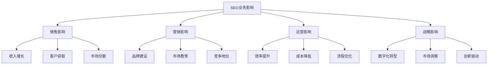
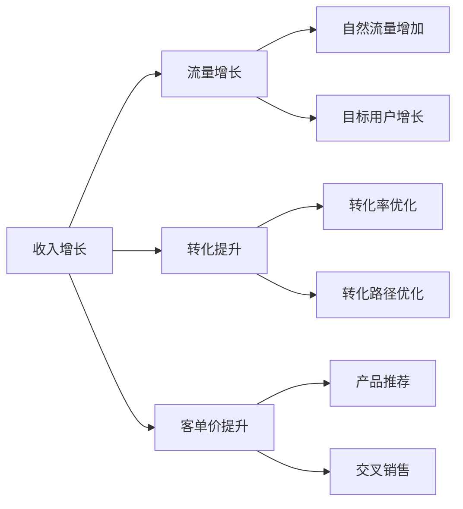
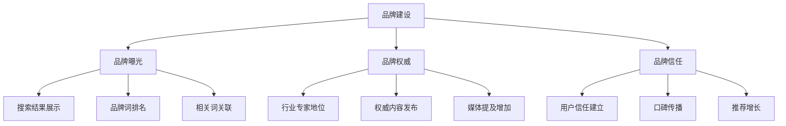
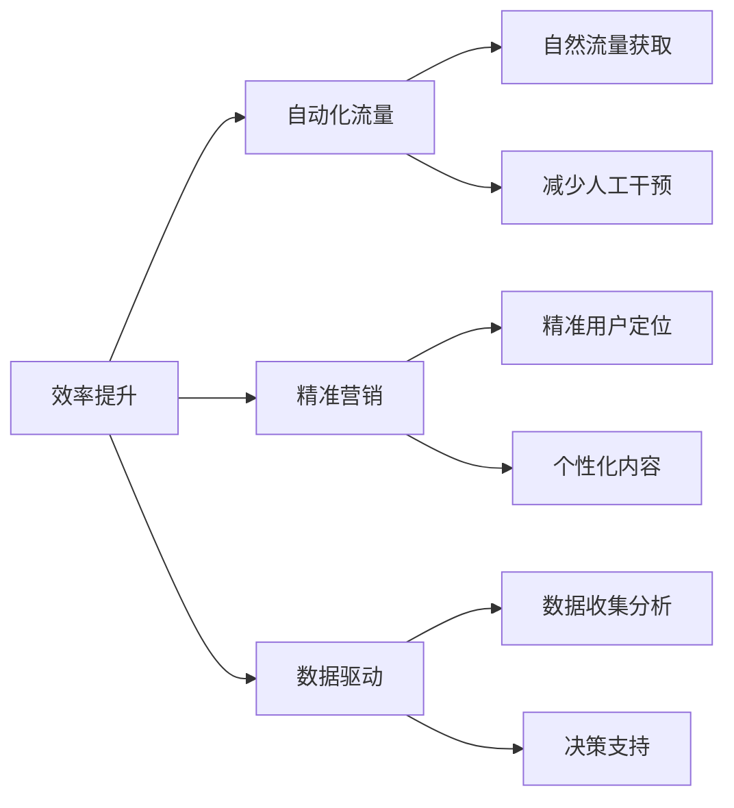
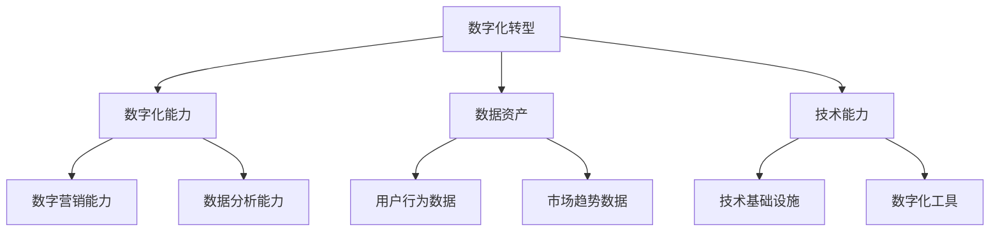
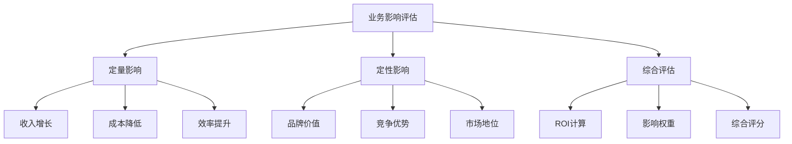
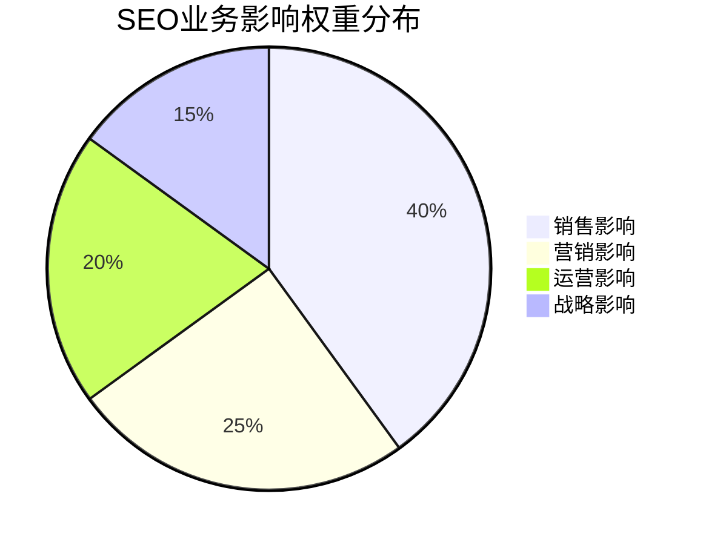
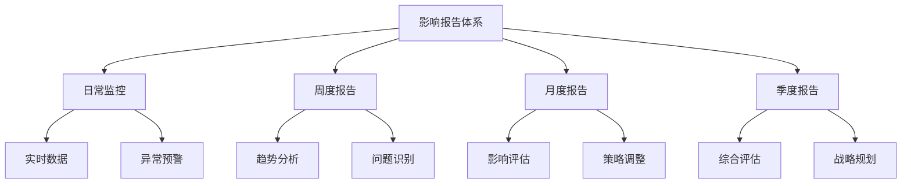
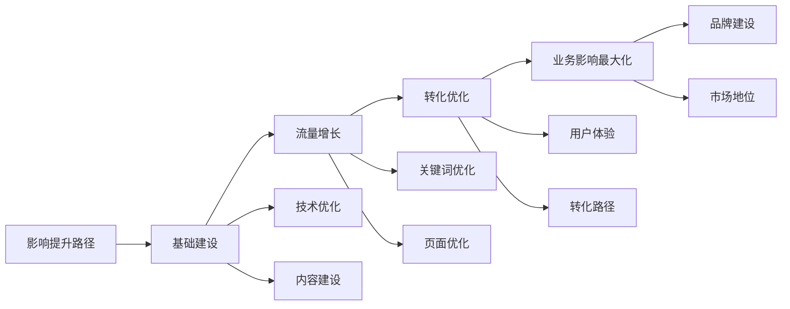

# SEO对业务影响

## 🎯 学习目标
- 深入理解SEO对业务的多维度影响
- 掌握业务影响评估方法
- 学会量化SEO业务贡献
- 建立SEO业务影响认知框架

## 🏢 SEO业务影响概述

### 核心影响定义
**SEO业务影响**：搜索引擎优化对企业业务运营、发展和竞争力的全方位影响

### 影响层次分析
| 影响层次 | 影响范围 | 影响深度 | 时间周期 |
|----------|----------|----------|----------|
| **直接影响** | 销售、流量 | 高 | 短期 |
| **间接影响** | 品牌、信任 | 中 | 中期 |
| **战略影响** | 市场地位、竞争力 | 高 | 长期 |

## 📈 销售业务影响

### 1. 收入增长影响

### 2. 客户获取影响
| 影响维度 | 具体表现 | 量化指标 | 优化策略 |
|----------|----------|----------|----------|
| **新客户获取** | 自然搜索带来新客户 | 新客户数量、获客成本 | 关键词优化、内容营销 |
| **客户质量** | 搜索用户转化质量高 | 客户生命周期价值 | 精准关键词、用户体验 |
| **客户留存** | SEO用户忠诚度高 | 复购率、留存率 | 内容价值、用户体验 |
| **客户推荐** | 满意用户主动推荐 | 推荐率、口碑传播 | 品牌建设、信任建立 |

### 3. 市场份额影响
- **搜索可见性**：提升品牌在搜索结果中的曝光
- **竞争地位**：在关键搜索词上超越竞争对手
- **市场教育**：通过内容营销教育市场
- **行业权威**：建立行业权威地位

## 🎯 营销业务影响

### 1. 品牌建设影响

### 2. 市场教育影响
| 教育方式 | 影响效果 | 业务价值 | 实施策略 |
|----------|----------|----------|----------|
| **内容营销** | 教育潜在客户 | 提升品牌认知 | 高质量内容、SEO优化 |
| **知识分享** | 建立专业形象 | 增强信任度 | 专业内容、专家形象 |
| **问题解答** | 解决用户痛点 | 提升转化率 | FAQ优化、问题解答 |
| **趋势分析** | 行业洞察分享 | 建立权威地位 | 行业报告、趋势分析 |

### 3. 竞争地位影响
- **搜索排名**：在关键搜索词上超越竞争对手
- **内容优势**：提供更优质的内容体验
- **用户体验**：更好的网站体验和转化路径
- **品牌差异化**：通过SEO建立独特的品牌形象

## ⚙️ 运营业务影响

### 1. 效率提升影响

### 2. 成本降低影响
| 成本类型 | 降低方式 | 节约效果 | 优化策略 |
|----------|----------|----------|----------|
| **获客成本** | 自然流量替代付费流量 | 显著降低 | SEO优化、内容营销 |
| **广告成本** | 减少付费广告依赖 | 长期节约 | 品牌建设、排名提升 |
| **营销成本** | 内容营销效率提升 | 成本效益优化 | 内容策略、SEO优化 |
| **运营成本** | 自动化流程优化 | 效率提升 | 技术优化、流程改进 |

### 3. 流程优化影响
- **营销流程**：SEO驱动的营销流程优化
- **销售流程**：高质量线索提升销售效率
- **客户服务**：SEO内容支持客户自助服务
- **产品开发**：搜索数据指导产品方向

## 🎯 战略业务影响

### 1. 数字化转型影响

### 2. 市场洞察影响
| 洞察类型 | 数据来源 | 业务价值 | 应用场景 |
|----------|----------|----------|----------|
| **用户行为** | 搜索数据、网站分析 | 了解用户需求 | 产品开发、营销策略 |
| **市场趋势** | 关键词趋势、竞争分析 | 把握市场机会 | 战略规划、市场进入 |
| **竞争态势** | 竞争对手SEO表现 | 竞争策略制定 | 差异化定位、竞争策略 |
| **行业动态** | 行业搜索趋势 | 行业趋势把握 | 业务调整、创新方向 |

### 3. 创新驱动影响
- **产品创新**：搜索数据指导产品创新方向
- **服务创新**：用户需求驱动服务模式创新
- **营销创新**：SEO技术推动营销方式创新
- **商业模式**：数字化能力支撑商业模式创新

## 📊 业务影响评估模型

### 1. 影响评估框架

### 2. 影响量化方法
| 影响类型 | 量化指标 | 计算方法 | 评估周期 |
|----------|----------|----------|----------|
| **销售影响** | 收入增长、客户增长 | 对比分析、趋势分析 | 月度 |
| **营销影响** | 品牌提及、市场份额 | 品牌监测、市场分析 | 季度 |
| **运营影响** | 成本节约、效率提升 | 成本分析、效率对比 | 月度 |
| **战略影响** | 市场地位、竞争力 | 综合评估、对比分析 | 年度 |

### 3. 影响权重分配

## 🔍 不同业务类型影响分析

### 1. B2C业务影响
| 影响维度 | 具体表现 | 量化指标 | 优化重点 |
|----------|----------|----------|----------|
| **销售增长** | 产品页面排名提升 | 销售额、订单量 | 产品页面优化 |
| **品牌建设** | 品牌搜索量增长 | 品牌提及、口碑 | 品牌内容营销 |
| **用户体验** | 搜索到购买路径优化 | 转化率、用户满意度 | 用户体验优化 |
| **客户忠诚** | 高质量内容建立信任 | 复购率、推荐率 | 内容价值建设 |

### 2. B2B业务影响
| 影响维度 | 具体表现 | 量化指标 | 优化重点 |
|----------|----------|----------|----------|
| **线索获取** | 高质量潜在客户 | 线索数量、质量 | 内容营销、关键词优化 |
| **品牌权威** | 行业专家地位 | 权威链接、媒体提及 | 专业内容、行业报告 |
| **销售支持** | 销售线索质量提升 | 转化率、客单价 | 销售支持内容 |
| **市场教育** | 行业知识普及 | 内容传播、影响力 | 教育内容、知识分享 |

### 3. 本地业务影响
| 影响维度 | 具体表现 | 量化指标 | 优化重点 |
|----------|----------|----------|----------|
| **本地客户** | 本地搜索排名提升 | 本地流量、客户数量 | 本地SEO、Google My Business |
| **信任建立** | 本地权威地位 | 本地提及、口碑 | 本地内容、客户评价 |
| **服务推广** | 服务页面排名 | 服务咨询、预约 | 服务页面优化 |
| **社区影响** | 社区参与度提升 | 社区提及、参与 | 社区内容、活动营销 |

## 📈 业务影响监控体系

### 1. 关键指标监控
| 指标类别 | 具体指标 | 监控频率 | 目标设定 |
|----------|----------|----------|----------|
| **销售指标** | 收入、客户、转化率 | 每日 | 月度增长目标 |
| **营销指标** | 品牌提及、市场份额 | 每周 | 品牌影响力目标 |
| **运营指标** | 成本、效率、质量 | 每日 | 运营效率目标 |
| **战略指标** | 市场地位、竞争力 | 每月 | 战略目标达成 |

### 2. 影响报告体系

### 3. 影响优化流程
1. **数据收集**：收集各业务维度数据
2. **影响分析**：分析SEO对各业务的影响
3. **问题识别**：识别影响瓶颈和机会
4. **策略调整**：调整SEO策略以最大化业务影响
5. **效果验证**：验证优化效果和业务影响

## 🎯 业务影响最大化策略

### 1. 影响提升路径

### 2. 影响优化策略
- **销售影响优化**：提升转化率和客单价
- **营销影响优化**：加强品牌建设和市场教育
- **运营影响优化**：提升效率和降低成本
- **战略影响优化**：增强竞争力和市场地位

### 3. 影响保护策略
- **排名保护**：维护现有排名优势
- **流量保护**：防止流量流失
- **品牌保护**：维护品牌形象和声誉
- **竞争保护**：保持竞争优势

## 📚 学习路径

### 基础理解
1. [[01-SEO商业价值]] - SEO商业价值
2. [[04-SEO与SEM关系]] - SEO与SEM关系
3. [[03-SEO投资回报]] - ROI分析

### 深入应用
1. [[02-理解层-核心机制#2.1-Google算法深度解析]] - 算法理解
2. [[03-应用层-实践技能#3.5-数据分析]] - 数据分析技能
3. [[04-精通层-高级策略#4.1-企业级SEO策略]] - 高级策略

### 实战练习
1. [[03-应用层-实践技能#3.4-项目管理#SEO项目规划]] - 项目管理
2. [[05-实战案例与模板#5.1-成功案例分析]] - 案例分析
3. [[06-工具与资源#6.1-SEO工具大全]] - 工具应用

## 📖 相关链接
- [[01-SEO商业价值]] - SEO商业价值
- [[04-SEO与SEM关系]] - SEO与SEM关系
- [[03-SEO投资回报]] - ROI分析
- [[04-SEO风险与挑战]] - 风险分析
- [[02-理解层-核心机制]] - 核心机制理解
- [[03-应用层-实践技能]] - 实践技能
