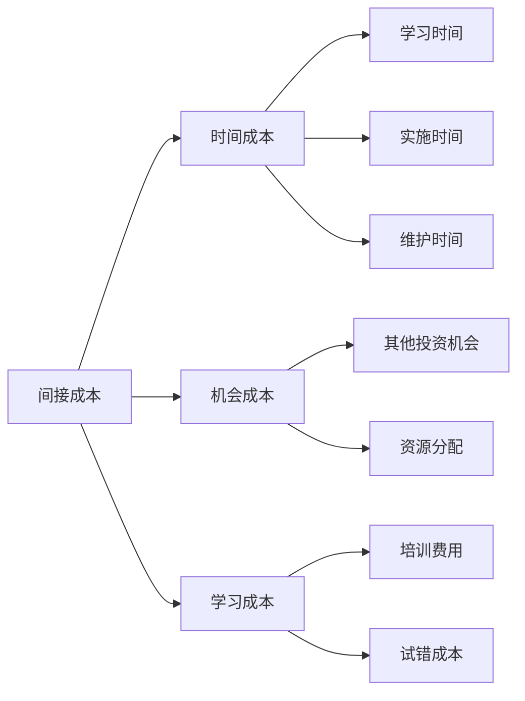
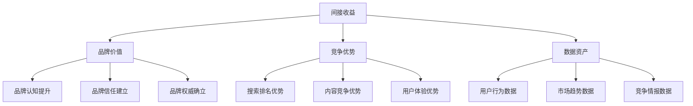
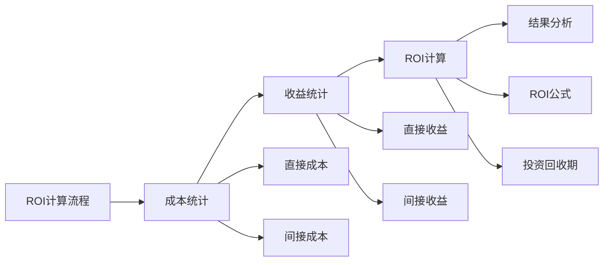
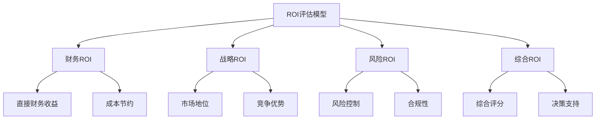
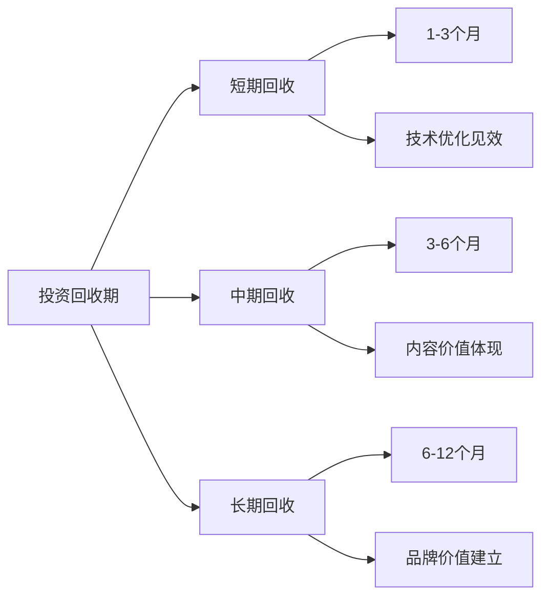
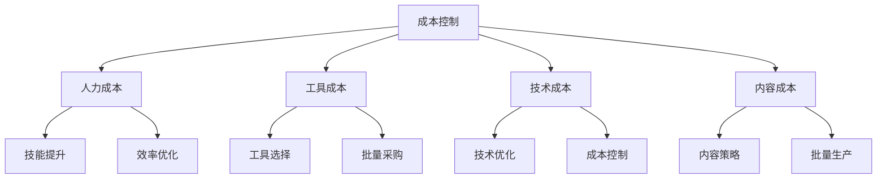
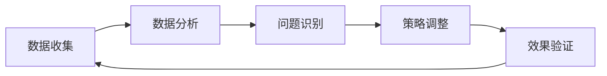

# SEO投资回报

## 🎯 学习目标
- 深入理解SEO投资回报的计算方法
- 掌握ROI评估和优化策略
- 学会SEO投资决策分析
- 建立SEO投资回报认知框架

## 💰 SEO投资回报概述

### 核心概念定义
**SEO投资回报（ROI）**：搜索引擎优化投资产生的收益与投资成本的比率

```mermaid
graph TD
    A[SEO投资回报] --> B[投资成本]
    A --> C[收益价值]
    A --> D[ROI计算]
    
    B --> B1[人力成本]
    B --> B2[工具成本]
    B --> B3[时间成本]
    B --> B4[机会成本]
    
    C --> C1[直接收益]
    C --> C2[间接收益]
    C --> C3[长期收益]
    
    D --> D1[ROI = (收益-成本)/成本]
    D --> D2[投资回收期]
    D --> D3[净现值NPV]
```

### ROI计算公式
**基础ROI公式**：ROI = (收益 - 投资成本) / 投资成本 × 100%

**扩展ROI公式**：ROI = (总收益 - 总成本) / 总成本 × 100%

## 📊 SEO投资成本分析

### 1. 直接成本
| 成本类型 | 具体项目 | 成本范围 | 优化策略 |
|----------|----------|----------|----------|
| **人力成本** | SEO专员、内容创作、技术开发 | 月薪3K-15K | 技能提升、效率优化 |
| **工具成本** | SEO工具、分析工具、监控工具 | 月费100-2000元 | 工具选择、批量采购 |
| **技术成本** | 网站开发、服务器、CDN | 月费500-5000元 | 技术优化、成本控制 |
| **内容成本** | 内容创作、图片、视频 | 单篇100-1000元 | 内容策略、批量生产 |

### 2. 间接成本


### 3. 成本控制策略
- **预算规划**：制定合理的SEO预算
- **成本监控**：定期监控成本变化
- **效率优化**：提升工作效率降低成本
- **工具选择**：选择性价比高的工具

## 📈 SEO收益分析

### 1. 直接收益
| 收益类型 | 计算方式 | 影响因素 | 优化方向 |
|----------|----------|----------|----------|
| **流量收益** | 自然流量 × 流量价值 | 流量质量、转化率 | 关键词优化、内容质量 |
| **转化收益** | 转化数量 × 客单价 | 转化率、产品价值 | 用户体验、转化路径 |
| **品牌收益** | 品牌曝光 × 品牌价值 | 品牌认知、权威性 | 品牌建设、内容营销 |
| **成本节约** | 广告成本节约 | 付费广告替代 | 排名提升、品牌建设 |

### 2. 间接收益


### 3. 长期收益
- **资产积累**：网站SEO资产持续增值
- **市场地位**：建立长期竞争优势
- **用户基础**：积累忠实用户群体
- **品牌价值**：提升品牌长期价值

## 🧮 ROI计算方法

### 1. 基础ROI计算


### 2. 详细ROI计算示例
**假设案例**：
- 投资成本：月薪8000元 × 12个月 = 96,000元
- 工具成本：月费500元 × 12个月 = 6,000元
- 总成本：102,000元

- 流量收益：月增1000访客 × 12个月 × 10元/访客 = 120,000元
- 转化收益：月增50订单 × 12个月 × 200元/订单 = 120,000元
- 总收益：240,000元

**ROI计算**：(240,000 - 102,000) / 102,000 × 100% = 135%

### 3. 不同行业ROI基准
| 行业类型 | 平均ROI | ROI范围 | 影响因素 |
|----------|---------|---------|----------|
| **电商** | 200-400% | 100-800% | 转化率、客单价 |
| **B2B** | 150-300% | 100-500% | 线索质量、客单价 |
| **本地服务** | 300-600% | 200-1000% | 本地竞争、服务价值 |
| **内容媒体** | 100-200% | 50-400% | 流量价值、广告收入 |

## 📊 ROI评估模型

### 1. 多维度ROI评估


### 2. ROI评估指标
| 指标类型 | 具体指标 | 计算方法 | 目标值 |
|----------|----------|----------|--------|
| **财务指标** | ROI、ROAS、NPV | 标准财务公式 | ROI > 200% |
| **效率指标** | 获客成本、转化成本 | 成本/收益 | 持续降低 |
| **质量指标** | 流量质量、转化质量 | 质量评估 | 持续提升 |
| **风险指标** | 算法风险、竞争风险 | 风险评估 | 风险可控 |

### 3. ROI优化策略
- **成本优化**：降低投资成本
- **收益优化**：提升收益价值
- **效率优化**：提升投资效率
- **风险控制**：控制投资风险

## ⏱️ 投资回收期分析

### 1. 回收期计算
**投资回收期** = 投资成本 / 月均收益

**示例**：
- 投资成本：102,000元
- 月均收益：20,000元
- 回收期：102,000 / 20,000 = 5.1个月

### 2. 不同阶段回收期


### 3. 回收期影响因素
| 因素 | 影响程度 | 优化方向 |
|------|----------|----------|
| **投资规模** | 高 | 合理控制投资规模 |
| **收益速度** | 高 | 提升收益实现速度 |
| **竞争环境** | 中 | 差异化策略 |
| **技术基础** | 中 | 技术基础建设 |

## 📈 ROI提升策略

### 1. 成本控制策略


### 2. 收益提升策略
- **流量提升**：扩大流量规模和提升流量质量
- **转化优化**：提升转化率和客单价
- **品牌建设**：建立品牌价值和权威性
- **成本节约**：减少其他营销成本

### 3. 效率提升策略
- **自动化工具**：使用自动化工具提升效率
- **流程优化**：优化工作流程和标准
- **技能提升**：提升团队技能水平
- **数据驱动**：基于数据做决策优化

## 🔍 ROI监控体系

### 1. 监控指标
| 监控维度 | 关键指标 | 监控频率 | 预警阈值 |
|----------|----------|----------|----------|
| **成本监控** | 月度成本、成本趋势 | 每月 | 超出预算20% |
| **收益监控** | 月度收益、收益趋势 | 每月 | 低于预期20% |
| **ROI监控** | ROI变化、ROI趋势 | 每月 | ROI < 100% |
| **效率监控** | 成本效率、收益效率 | 每月 | 效率下降10% |

### 2. 监控流程


### 3. 报告体系
- **日常监控**：实时数据监控
- **周度报告**：趋势分析和问题识别
- **月度报告**：ROI评估和策略调整
- **季度报告**：综合评估和战略规划

## 🎯 ROI优化实践

### 1. 短期优化（1-3个月）
- **成本控制**：控制初期投资成本
- **快速见效**：选择快速见效的优化项目
- **数据收集**：建立数据收集体系
- **基础建设**：完成基础技术优化

### 2. 中期优化（3-6个月）
- **收益提升**：重点提升收益价值
- **效率优化**：优化工作流程和效率
- **策略调整**：基于数据调整策略
- **团队建设**：提升团队技能水平

### 3. 长期优化（6-12个月）
- **品牌建设**：建立品牌价值和权威性
- **竞争优势**：建立长期竞争优势
- **资产积累**：积累SEO资产价值
- **战略规划**：制定长期战略规划

## 📚 学习路径

### 基础理解
1. [[01-SEO商业价值]] - SEO商业价值
2. [[02-SEO对业务影响]] - 业务影响分析
3. [[04-SEO与SEM关系]] - SEO与SEM关系

### 深入应用
1. [[02-理解层-核心机制#2.1-Google算法深度解析]] - 算法理解
2. [[03-应用层-实践技能#3.5-数据分析]] - 数据分析技能
3. [[03-应用层-实践技能#3.4-项目管理]] - 项目管理

### 实战练习
1. [[03-应用层-实践技能#3.4-项目管理#SEO项目规划]] - 项目管理
2. [[05-实战案例与模板#5.1-成功案例分析]] - 案例分析
3. [[06-工具与资源#6.1-SEO工具大全]] - 工具应用

## 📖 相关链接
- [[01-SEO商业价值]] - SEO商业价值
- [[02-SEO对业务影响]] - 业务影响分析
- [[04-SEO与SEM关系]] - SEO与SEM关系
- [[04-SEO风险与挑战]] - 风险分析
- [[02-理解层-核心机制]] - 核心机制理解
- [[03-应用层-实践技能]] - 实践技能
