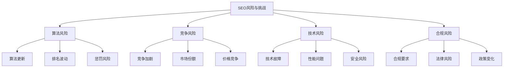
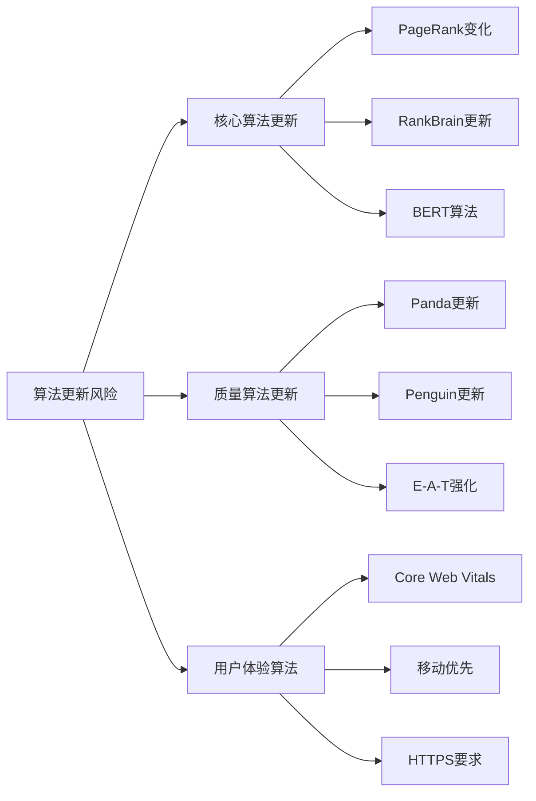
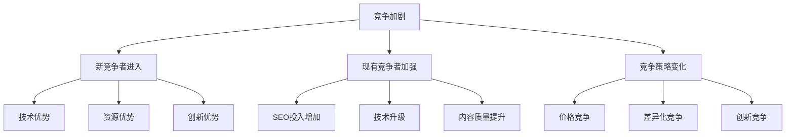
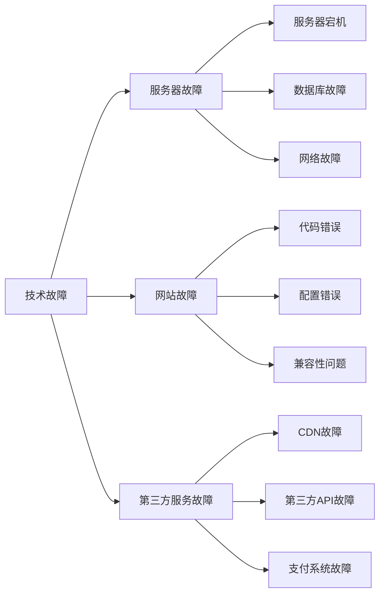
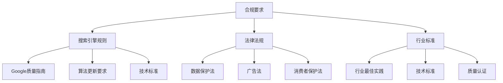
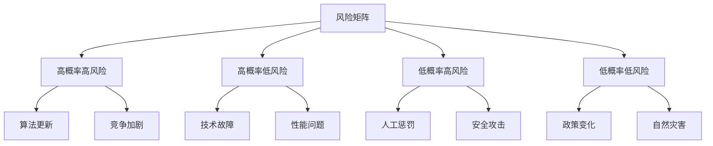
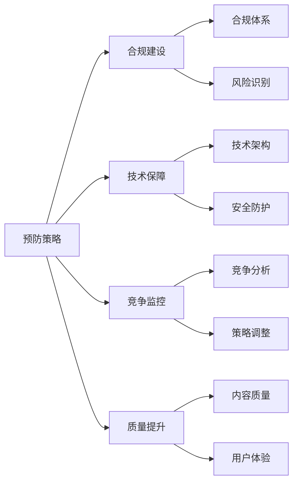
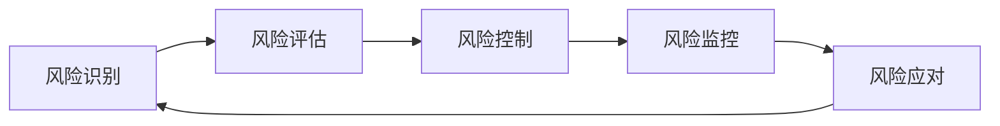

# SEO风险与挑战

## 🎯 学习目标
- 深入理解SEO面临的主要风险和挑战
- 掌握风险识别和评估方法
- 学会风险控制和应对策略
- 建立SEO风险管理认知框架

## ⚠️ SEO风险与挑战概述

### 核心概念定义
**SEO风险**：搜索引擎优化过程中可能对网站排名、流量和业务产生负面影响的不确定因素

### 风险分类体系
| 风险类型 | 风险等级 | 影响范围 | 应对难度 |
|----------|----------|----------|----------|
| **算法风险** | 高 | 全站 | 困难 |
| **竞争风险** | 高 | 关键词 | 中等 |
| **技术风险** | 中 | 特定功能 | 容易 |
| **合规风险** | 中 | 全站 | 中等 |

## 🔍 算法风险分析

### 1. 算法更新风险

### 2. 排名波动风险
| 波动类型 | 影响程度 | 持续时间 | 应对策略 |
|----------|----------|----------|----------|
| **季节性波动** | 中 | 3-6个月 | 季节性策略调整 |
| **竞争波动** | 高 | 持续 | 竞争监控、策略调整 |
| **技术波动** | 中 | 1-2周 | 技术问题快速修复 |
| **内容波动** | 中 | 1-3个月 | 内容质量持续提升 |

### 3. 惩罚风险
- **算法惩罚**：自动检测的违规行为
- **人工惩罚**：人工审核的严重违规
- **技术惩罚**：技术问题导致的排名下降
- **内容惩罚**：低质量内容导致的降权

## 🏆 竞争风险分析

### 1. 竞争加剧风险

### 2. 市场份额风险
| 风险类型 | 具体表现 | 影响程度 | 应对策略 |
|----------|----------|----------|----------|
| **市场份额下降** | 排名位置下降 | 高 | 竞争分析、策略调整 |
| **流量被分流** | 竞争对手获得更多流量 | 高 | 差异化策略、价值提升 |
| **品牌影响力下降** | 品牌搜索量下降 | 中 | 品牌建设、内容营销 |
| **用户流失** | 用户转向竞争对手 | 高 | 用户体验优化、价值提升 |

### 3. 竞争策略风险
- **价格竞争**：竞争对手降低价格
- **技术竞争**：竞争对手技术升级
- **内容竞争**：竞争对手内容质量提升
- **营销竞争**：竞争对手营销投入增加

## ⚙️ 技术风险分析

### 1. 技术故障风险

### 2. 性能问题风险
| 问题类型 | 影响程度 | 解决难度 | 预防策略 |
|----------|----------|----------|----------|
| **页面加载慢** | 高 | 中等 | 性能优化、CDN使用 |
| **移动端问题** | 高 | 容易 | 响应式设计、移动优化 |
| **用户体验差** | 中 | 中等 | 用户体验测试、持续优化 |
| **技术债务** | 中 | 困难 | 技术架构优化、代码重构 |

### 3. 安全风险
- **数据泄露**：用户数据安全风险
- **网站被黑**：恶意攻击风险
- **恶意软件**：网站感染恶意软件
- **钓鱼攻击**：用户被钓鱼攻击

## 📋 合规风险分析

### 1. 合规要求风险

### 2. 法律风险
| 风险类型 | 具体表现 | 影响程度 | 应对策略 |
|----------|----------|----------|----------|
| **版权风险** | 内容版权问题 | 高 | 原创内容、版权检查 |
| **隐私风险** | 用户隐私保护 | 高 | 隐私政策、数据保护 |
| **广告风险** | 广告合规问题 | 中 | 广告审核、合规检查 |
| **消费者保护** | 消费者权益保护 | 中 | 服务条款、用户协议 |

### 3. 政策变化风险
- **搜索引擎政策**：搜索引擎规则变化
- **政府政策**：相关法律法规变化
- **行业政策**：行业标准和规范变化
- **国际政策**：跨境业务政策变化

## 📊 风险评估模型

### 1. 风险矩阵评估

### 2. 风险评估指标
| 评估维度 | 评估指标 | 权重 | 评分标准 |
|----------|----------|------|----------|
| **发生概率** | 风险发生可能性 | 30% | 1-10分 |
| **影响程度** | 风险影响大小 | 40% | 1-10分 |
| **可控程度** | 风险可控性 | 20% | 1-10分 |
| **应对成本** | 应对成本高低 | 10% | 1-10分 |

### 3. 风险等级划分
- **高风险**：评分8-10分，需要重点关注
- **中风险**：评分5-7分，需要监控管理
- **低风险**：评分1-4分，定期检查即可

## 🛡️ 风险控制策略

### 1. 预防策略

### 2. 监控策略
- **实时监控**：关键指标实时监控
- **定期检查**：定期风险评估检查
- **预警机制**：异常情况预警提醒
- **趋势分析**：风险趋势分析预测

### 3. 应对策略
- **快速响应**：风险发生时快速响应
- **应急处理**：制定应急处理预案
- **恢复策略**：制定恢复和修复策略
- **经验总结**：总结经验教训改进

## 🎯 风险应对实践

### 1. 算法风险应对
| 应对策略 | 具体措施 | 实施难度 | 效果预期 |
|----------|----------|----------|----------|
| **合规优化** | 遵循搜索引擎指南 | 中等 | 降低惩罚风险 |
| **质量提升** | 提升内容和技术质量 | 困难 | 提升排名稳定性 |
| **多样化策略** | 不依赖单一排名因素 | 中等 | 降低风险集中度 |
| **持续监控** | 监控算法变化 | 容易 | 及时调整策略 |

### 2. 竞争风险应对
- **差异化策略**：建立差异化竞争优势
- **价值提升**：持续提升用户价值
- **创新驱动**：通过创新保持领先
- **合作策略**：寻求合作降低竞争

### 3. 技术风险应对
- **技术架构**：建立稳定可靠的技术架构
- **备份策略**：建立完善的备份和恢复机制
- **监控体系**：建立技术监控和预警体系
- **团队建设**：建设技术团队和技能

### 4. 合规风险应对
- **合规体系**：建立完善的合规管理体系
- **法律咨询**：定期法律咨询和合规检查
- **政策跟踪**：跟踪政策变化及时调整
- **培训教育**：团队合规培训和教育

## 📈 风险管理体系

### 1. 风险管理流程

### 2. 风险管理组织
- **风险管理委员会**：负责风险管理决策
- **风险管理部门**：负责风险管理执行
- **风险监控团队**：负责风险监控预警
- **应急响应团队**：负责风险应急处理

### 3. 风险管理工具
- **风险评估工具**：风险识别和评估工具
- **监控预警工具**：风险监控和预警工具
- **应急响应工具**：应急处理和恢复工具
- **报告分析工具**：风险报告和分析工具

## 📚 学习路径

### 基础理解
1. [[01-SEO商业价值]] - SEO商业价值
2. [[02-SEO对业务影响]] - 业务影响分析
3. [[03-SEO投资回报]] - ROI分析

### 深入应用
1. [[02-理解层-核心机制#2.1-Google算法深度解析#05-算法惩罚机制]] - 算法惩罚机制
2. [[03-应用层-实践技能#3.6-问题诊断与解决]] - 问题诊断与解决
3. [[04-精通层-高级策略#4.7-SEO危机管理]] - 危机管理

### 实战练习
1. [[03-应用层-实践技能#3.2-网站审计]] - 网站审计
2. [[05-实战案例与模板#5.2-失败案例研究]] - 失败案例分析
3. [[06-工具与资源#6.1-SEO工具大全]] - 工具应用

## 📖 相关链接
- [[01-SEO商业价值]] - SEO商业价值
- [[02-SEO对业务影响]] - 业务影响分析
- [[03-SEO投资回报]] - ROI分析
- [[04-SEO与SEM关系]] - SEO与SEM关系
- [[02-理解层-核心机制#2.1-Google算法深度解析]] - 算法理解
- [[03-应用层-实践技能]] - 实践技能
