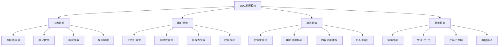
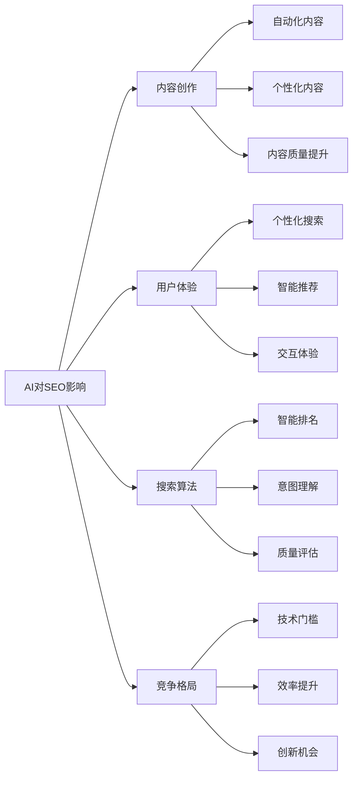
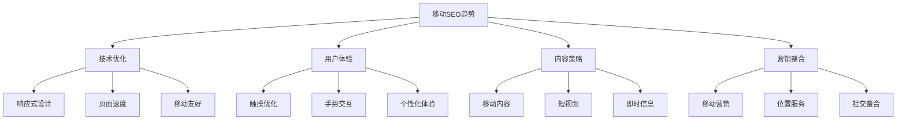
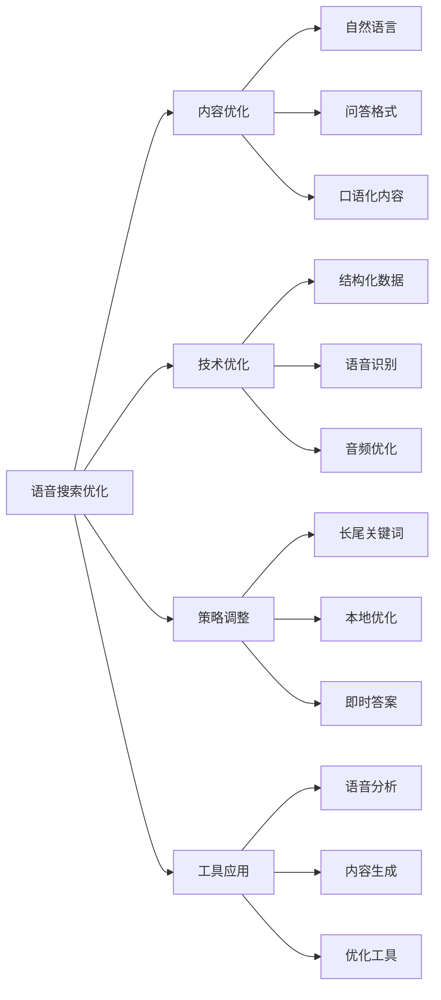
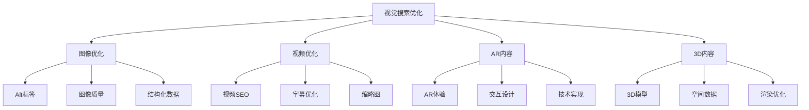
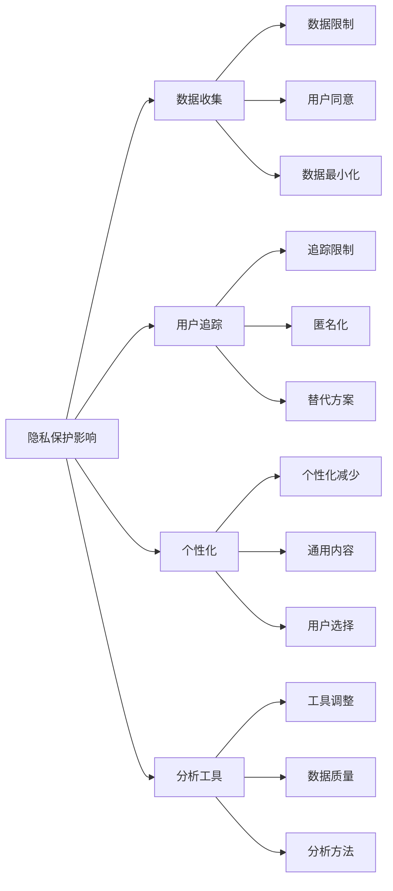
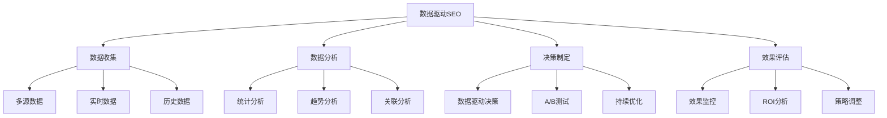

# SEO发展趋势

## 🎯 学习目标
- 深入理解SEO行业发展趋势
- 掌握未来SEO发展方向
- 学会趋势分析和预测方法
- 建立SEO趋势认知框架

## 📈 SEO发展趋势概述

### 核心趋势定义
**SEO发展趋势**：搜索引擎优化行业在技术、策略、用户行为等方面的演进方向

### 趋势分析框架
| 分析维度 | 具体内容 | 分析方法 | 应用价值 |
|----------|----------|----------|----------|
| **技术趋势** | 新技术、新工具 | 技术跟踪、实验分析 | 技术升级、工具选择 |
| **用户趋势** | 行为变化、需求演进 | 用户研究、数据分析 | 策略调整、体验优化 |
| **算法趋势** | 算法更新、规则变化 | 官方信息、影响分析 | 合规优化、风险控制 |
| **竞争趋势** | 竞争格局、策略变化 | 竞争分析、市场研究 | 差异化策略、竞争优势 |

## 🤖 AI技术趋势

### 1. AI在SEO中的应用
| AI技术 | 应用场景 | 影响程度 | 发展趋势 |
|--------|----------|----------|----------|
| **自然语言处理** | 内容生成、语义理解 | 高 | 持续深化 |
| **机器学习** | 排名算法、个性化 | 高 | 智能化提升 |
| **计算机视觉** | 图像识别、视觉搜索 | 中 | 快速发展 |
| **语音技术** | 语音搜索、语音交互 | 中 | 普及应用 |

### 2. AI对SEO的影响

### 3. AI技术发展趋势
- **大语言模型**：GPT、BERT等模型持续进化
- **多模态AI**：文本、图像、语音融合处理
- **实时AI**：实时数据处理和决策
- **边缘AI**：本地化AI处理能力

## 📱 移动优先趋势

### 1. 移动搜索发展
| 指标 | 当前状态 | 发展趋势 | 影响分析 |
|------|----------|----------|----------|
| **移动搜索占比** | 60%+ | 持续增长 | 移动SEO重要性提升 |
| **移动用户体验** | Core Web Vitals | 标准提升 | 技术要求提高 |
| **移动支付** | 普及应用 | 深度整合 | 转化路径优化 |
| **移动社交** | 高度活跃 | 商业化发展 | 社交SEO重要性 |

### 2. 移动SEO趋势

### 3. 移动优先策略
- **技术优先**：移动端技术优化优先
- **内容优先**：移动端内容体验优先
- **用户体验优先**：移动端用户体验优先
- **转化优先**：移动端转化路径优化

## 🎤 语音搜索趋势

### 1. 语音搜索发展
| 发展指标 | 当前水平 | 增长趋势 | SEO影响 |
|----------|----------|----------|---------|
| **语音搜索使用率** | 20%+ | 快速增长 | 长尾关键词重要性 |
| **智能音箱普及** | 30%+ | 持续增长 | 本地SEO机会 |
| **语音助手功能** | 基础功能 | 功能扩展 | 内容策略调整 |
| **语音商务** | 起步阶段 | 快速发展 | 转化路径创新 |

### 2. 语音搜索优化趋势

### 3. 语音搜索策略
- **内容策略**：问答式内容、自然语言
- **关键词策略**：长尾关键词、口语化表达
- **技术策略**：结构化数据、语音优化
- **本地策略**：本地信息、即时服务

## 👁️ 视觉搜索趋势

### 1. 视觉搜索发展
| 技术领域 | 发展水平 | 应用场景 | SEO影响 |
|----------|----------|----------|---------|
| **图像识别** | 成熟应用 | 商品识别、内容理解 | 图像SEO重要性 |
| **AR技术** | 快速发展 | 虚拟试穿、空间搜索 | 沉浸式体验 |
| **视频搜索** | 技术成熟 | 视频内容、实时搜索 | 视频SEO优化 |
| **3D搜索** | 起步阶段 | 产品展示、空间搜索 | 3D内容优化 |

### 2. 视觉搜索优化

### 3. 视觉搜索策略
- **图像优化**：高质量图像、准确描述
- **视频优化**：视频SEO、字幕添加
- **AR内容**：增强现实体验、交互设计
- **3D内容**：三维模型、空间搜索

## 🔒 隐私保护趋势

### 1. 隐私法规影响
| 法规类型 | 影响范围 | 技术要求 | SEO影响 |
|----------|----------|----------|---------|
| **GDPR** | 欧盟用户 | 数据保护、用户同意 | 数据收集限制 |
| **CCPA** | 加州用户 | 数据透明、用户控制 | 隐私政策要求 |
| **Cookie法规** | 全球影响 | Cookie同意、追踪限制 | 分析数据减少 |
| **第三方Cookie** | 浏览器限制 | 替代方案、第一方数据 | 追踪技术变化 |

### 2. 隐私保护对SEO的影响

### 3. 隐私保护策略
- **合规建设**：隐私政策、用户同意
- **数据策略**：第一方数据、匿名化处理
- **技术调整**：追踪技术、分析工具
- **内容策略**：通用内容、用户价值

## 📊 数据驱动趋势

### 1. 数据分析发展
| 数据类型 | 应用场景 | 技术工具 | SEO价值 |
|----------|----------|----------|---------|
| **用户行为数据** | 行为分析、体验优化 | Analytics、热力图 | 用户体验优化 |
| **搜索数据** | 关键词研究、趋势分析 | Search Console、工具 | 内容策略制定 |
| **竞争数据** | 竞争分析、策略制定 | SEMrush、Ahrefs | 竞争策略优化 |
| **技术数据** | 性能监控、问题诊断 | Lighthouse、工具 | 技术优化指导 |

### 2. 数据驱动SEO

### 3. 数据驱动策略
- **数据收集**：多源数据、实时监控
- **数据分析**：深度分析、趋势预测
- **决策制定**：数据驱动、科学决策
- **效果评估**：持续监控、策略调整

## 🎯 未来趋势预测

### 1. 短期趋势（1-2年）
- **AI内容生成**：AI辅助内容创作普及
- **Core Web Vitals 2.0**：更严格的性能标准
- **隐私保护强化**：更严格的隐私法规
- **移动体验提升**：移动端体验标准提高

### 2. 中期趋势（3-5年）
- **多模态搜索**：文本、图像、语音融合
- **个性化搜索**：高度个性化的搜索体验
- **实时搜索**：实时信息、即时更新
- **沉浸式体验**：AR/VR搜索体验

### 3. 长期趋势（5-10年）
- **智能搜索**：完全智能化的搜索体验
- **预测搜索**：预测用户需求的搜索
- **全息搜索**：全息显示、空间搜索
- **脑机接口**：思维搜索、直接交互

## 📚 学习路径

### 基础理解
1. [[02-AI对SEO影响]] - AI技术影响
2. [[03-移动优先索引]] - 移动端优化
3. [[04-语音搜索优化]] - 语音搜索优化

### 深入应用
1. [[02-理解层-核心机制#2.1-Google算法深度解析]] - 算法理解
2. [[03-应用层-实践技能#3.5-数据分析]] - 数据分析
3. [[04-精通层-高级策略#4.5-SEO自动化与AI]] - AI应用

### 实战练习
1. [[03-应用层-实践技能#3.1-SEO工具精通]] - 工具应用
2. [[05-实战案例与模板#5.1-成功案例分析]] - 案例分析
3. [[06-工具与资源#6.1-SEO工具大全]] - 工具资源

## 📖 相关链接
- [[02-AI对SEO影响]] - AI技术影响
- [[03-移动优先索引]] - 移动端优化
- [[04-语音搜索优化]] - 语音搜索优化
- [[02-理解层-核心机制]] - 核心机制理解
- [[03-应用层-实践技能]] - 实践技能
- [[04-精通层-高级策略]] - 高级策略
