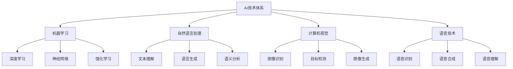
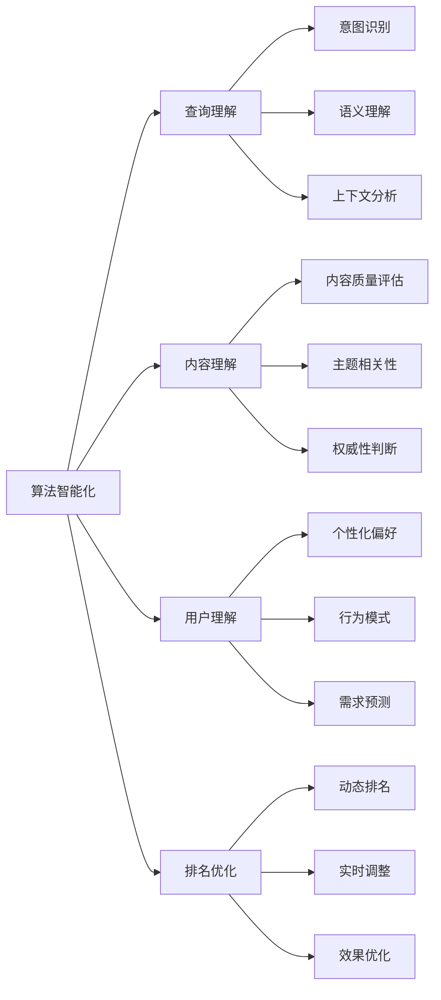
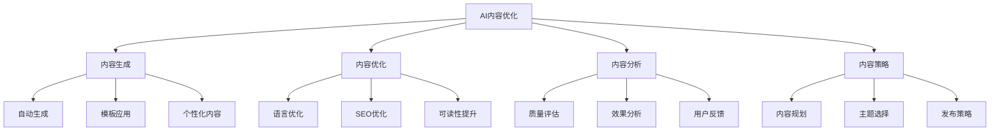
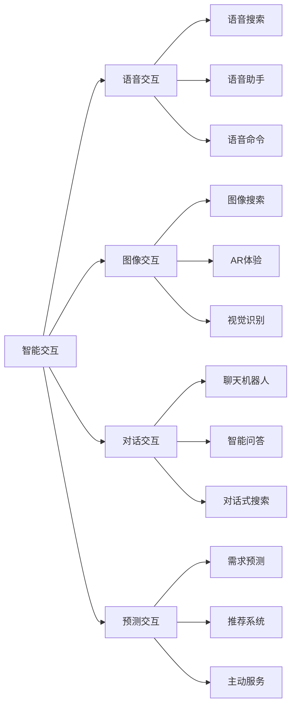
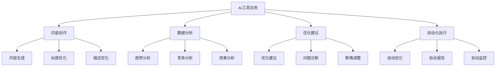
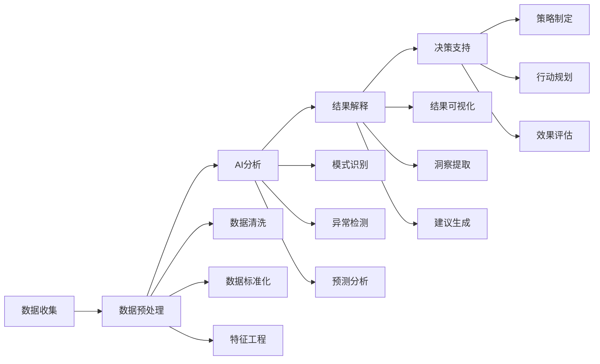
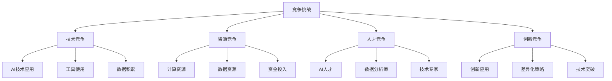

# AI对SEO影响

## 🎯 学习目标
- 深入理解AI技术在SEO中的应用
- 掌握AI对搜索算法和用户体验的影响
- 学会AI时代的SEO策略调整
- 建立AI-SEO认知框架

## 🤖 AI技术概述

### AI技术分类
**人工智能（AI）**：模拟人类智能的技术，包括机器学习、自然语言处理、计算机视觉等

### AI在搜索中的应用
| AI技术 | 搜索应用 | 影响程度 | 发展趋势 |
|--------|----------|----------|----------|
| **RankBrain** | 查询理解、排名调整 | 高 | 持续优化 |
| **BERT** | 自然语言理解 | 高 | 模型升级 |
| **MUM** | 多模态理解 | 中 | 功能扩展 |
| **LaMDA** | 对话式搜索 | 中 | 商业化应用 |

## 🔍 AI对搜索算法的影响

### 1. 算法智能化

### 2. 核心AI算法
| 算法名称 | 发布时间 | 核心功能 | SEO影响 |
|----------|----------|----------|---------|
| **PageRank** | 1998 | 链接分析 | 基础排名算法 |
| **Hummingbird** | 2013 | 语义搜索 | 语义理解重要性 |
| **RankBrain** | 2015 | 机器学习排名 | 查询理解优化 |
| **BERT** | 2019 | 双向语言理解 | 自然语言优化 |
| **MUM** | 2021 | 多模态理解 | 多模态内容优化 |

### 3. AI算法发展趋势
- **理解能力提升**：从关键词匹配到语义理解
- **个性化增强**：基于用户行为的个性化搜索
- **实时性提升**：实时数据处理和排名调整
- **多模态融合**：文本、图像、语音综合理解

## 📝 AI对内容创作的影响

### 1. AI内容生成
| AI工具 | 功能特点 | 应用场景 | SEO影响 |
|--------|----------|----------|---------|
| **GPT系列** | 文本生成、对话 | 内容创作、问答 | 内容生产效率 |
| **DALL-E** | 图像生成 | 视觉内容创作 | 图像内容优化 |
| **Jasper** | 营销内容生成 | 广告文案、产品描述 | 营销内容优化 |
| **Copy.ai** | 创意文案生成 | 标题、描述创作 | 内容吸引力提升 |

### 2. AI内容优化

### 3. AI内容策略
- **内容生成**：AI辅助内容创作，提高效率
- **内容优化**：AI优化语言表达和SEO元素
- **内容分析**：AI分析内容效果和用户反馈
- **内容策略**：AI辅助内容规划和策略制定

## 👤 AI对用户体验的影响

### 1. 个性化搜索
| 个性化维度 | AI技术 | 实现方式 | 用户体验 |
|------------|--------|----------|----------|
| **搜索历史** | 机器学习 | 历史行为分析 | 个性化结果 |
| **地理位置** | 位置AI | GPS定位分析 | 本地化结果 |
| **设备偏好** | 设备识别 | 设备特征分析 | 适配性优化 |
| **时间偏好** | 时间分析 | 时间模式识别 | 时效性优化 |

### 2. 智能交互

### 3. 用户体验优化
- **个性化体验**：基于AI的个性化内容推荐
- **智能交互**：多模态交互方式
- **预测服务**：AI预测用户需求
- **实时优化**：AI实时调整用户体验

## 🛠️ AI工具在SEO中的应用

### 1. SEO工具AI化
| 工具类型 | AI功能 | 应用价值 | 发展趋势 |
|----------|--------|----------|----------|
| **关键词工具** | 语义分析、意图识别 | 关键词研究优化 | 智能化程度提升 |
| **内容工具** | 内容生成、优化建议 | 内容创作效率 | AI辅助创作 |
| **分析工具** | 数据洞察、趋势预测 | 决策支持优化 | 预测性分析 |
| **监控工具** | 异常检测、自动报告 | 监控效率提升 | 自动化监控 |

### 2. AI工具应用场景

### 3. AI工具选择策略
- **功能匹配**：选择符合需求的AI功能
- **数据质量**：确保AI工具的数据准确性
- **集成能力**：考虑与其他工具的集成
- **成本效益**：评估AI工具的投资回报

## 📊 AI对数据分析的影响

### 1. 智能数据分析
| 分析类型 | AI技术 | 分析能力 | SEO价值 |
|----------|--------|----------|---------|
| **用户行为分析** | 机器学习 | 行为模式识别 | 用户体验优化 |
| **内容效果分析** | NLP | 内容质量评估 | 内容策略优化 |
| **竞争分析** | 深度学习 | 竞争策略识别 | 竞争策略制定 |
| **趋势预测** | 时间序列分析 | 未来趋势预测 | 策略前瞻性 |

### 2. AI数据分析流程

### 3. AI数据分析优势
- **处理能力**：处理大规模复杂数据
- **洞察深度**：发现隐藏的数据模式
- **预测能力**：预测未来趋势和变化
- **自动化**：自动化数据分析和报告

## ⚠️ AI时代的SEO挑战

### 1. 技术挑战
| 挑战类型 | 具体表现 | 影响程度 | 应对策略 |
|----------|----------|----------|----------|
| **算法黑盒** | AI算法不透明 | 高 | 持续学习、实验验证 |
| **技术门槛** | AI技术复杂度高 | 中 | 技能提升、工具使用 |
| **数据依赖** | 需要大量数据 | 中 | 数据积累、质量提升 |
| **更新频率** | AI技术快速更新 | 高 | 持续学习、技术跟踪 |

### 2. 竞争挑战

### 3. 应对策略
- **技术学习**：持续学习AI技术和应用
- **工具应用**：充分利用AI工具提升效率
- **数据积累**：建立高质量的数据资产
- **创新实践**：探索AI在SEO中的创新应用

## 🎯 AI时代SEO策略

### 1. 技术策略
- **AI工具集成**：集成AI工具到SEO工作流
- **数据驱动**：基于AI分析制定策略
- **自动化优化**：利用AI实现自动化优化
- **持续学习**：跟踪AI技术发展

### 2. 内容策略
- **AI辅助创作**：使用AI工具辅助内容创作
- **语义优化**：优化内容的语义相关性
- **个性化内容**：基于AI分析创建个性化内容
- **多模态内容**：创建文本、图像、视频融合内容

### 3. 用户体验策略
- **个性化体验**：基于AI提供个性化体验
- **智能交互**：优化多模态交互体验
- **预测服务**：利用AI预测用户需求
- **实时优化**：基于AI实时优化用户体验

## 📚 学习路径

### 基础理解
1. [[01-SEO发展趋势]] - SEO发展趋势
2. [[03-移动优先索引]] - 移动端优化
3. [[04-语音搜索优化]] - 语音搜索优化

### 深入应用
1. [[02-理解层-核心机制#2.1-Google算法深度解析]] - 算法理解
2. [[03-应用层-实践技能#3.5-数据分析]] - 数据分析
3. [[04-精通层-高级策略#4.5-SEO自动化与AI]] - AI应用

### 实战练习
1. [[03-应用层-实践技能#3.1-SEO工具精通]] - 工具应用
2. [[05-实战案例与模板#5.1-成功案例分析]] - 案例分析
3. [[06-工具与资源#6.1-SEO工具大全]] - 工具资源

## 📖 相关链接
- [[01-SEO发展趋势]] - SEO发展趋势
- [[03-移动优先索引]] - 移动端优化
- [[04-语音搜索优化]] - 语音搜索优化
- [[02-理解层-核心机制]] - 核心机制理解
- [[03-应用层-实践技能]] - 实践技能
- [[04-精通层-高级策略]] - 高级策略
