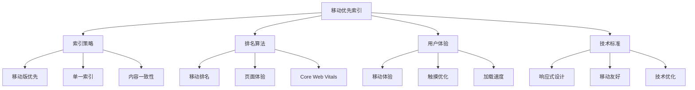
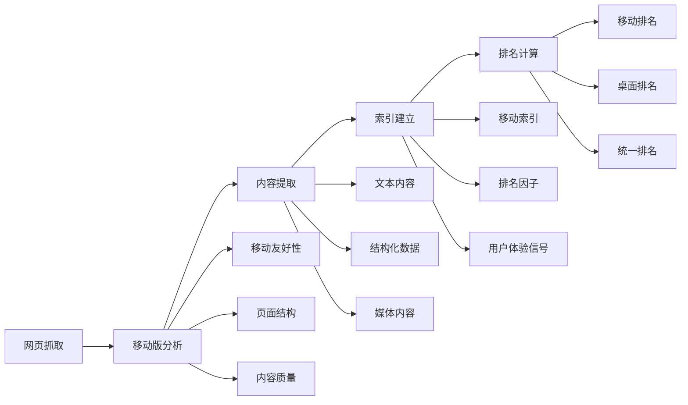
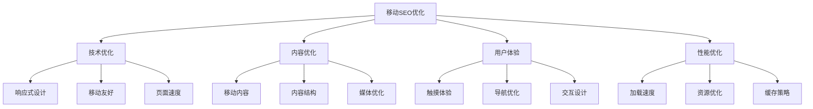
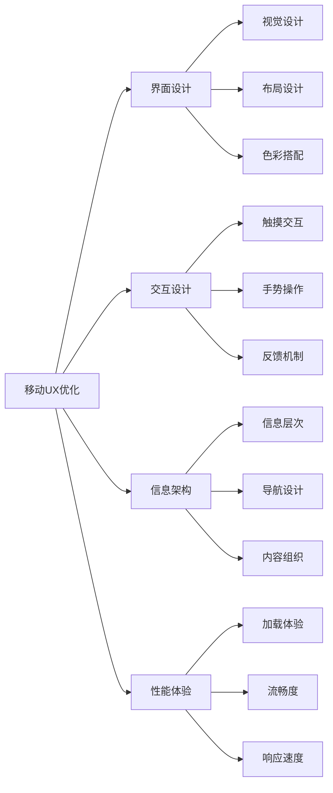
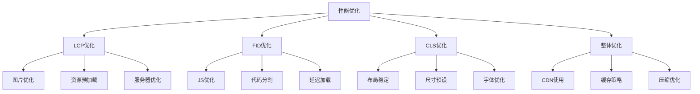
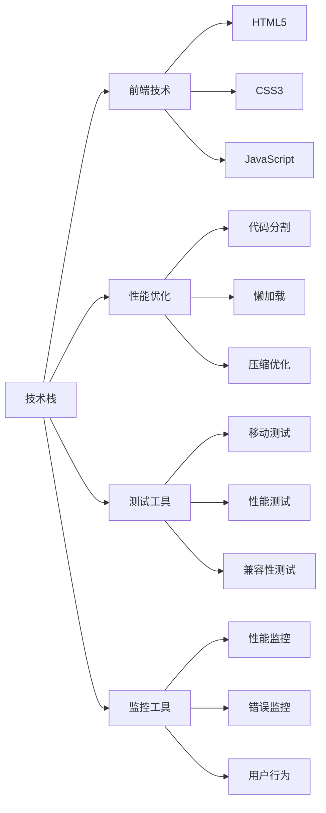
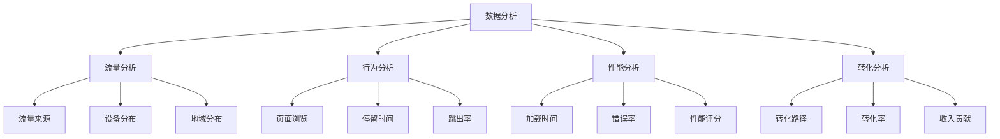
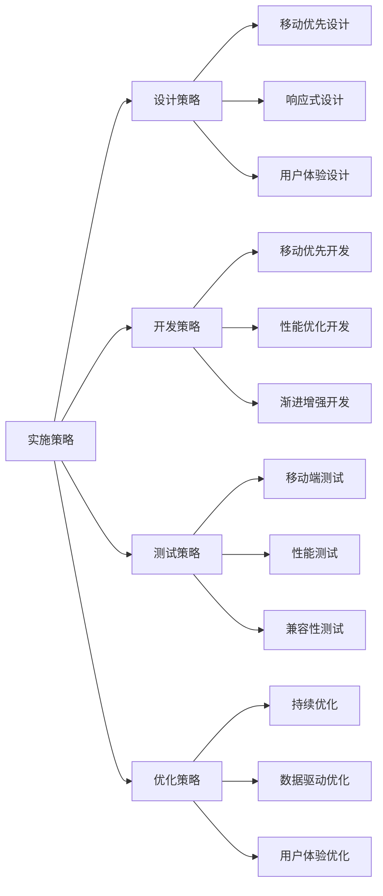

# 移动优先索引

## 🎯 学习目标
- 深入理解移动优先索引的概念和意义
- 掌握移动端SEO优化策略
- 学会移动用户体验优化方法
- 建立移动优先SEO认知框架

## 📱 移动优先索引概述

### 核心概念
**移动优先索引**：Google优先使用移动版网页内容进行索引和排名，而非桌面版

### 移动优先索引的重要性
| 重要性维度 | 具体表现 | 影响分析 | 优化价值 |
|------------|----------|----------|----------|
| **搜索流量** | 移动搜索占60%+ | 移动端流量主导 | 移动优化必要性 |
| **用户体验** | 移动体验标准提升 | 用户期望提高 | 体验优化重要性 |
| **排名影响** | 移动体验影响排名 | 直接影响SEO效果 | 移动优化紧迫性 |
| **技术趋势** | 移动技术快速发展 | 技术标准提升 | 技术升级需求 |

## 🔍 移动优先索引机制

### 1. 索引工作原理

### 2. 移动优先因素
| 排名因子 | 移动权重 | 影响程度 | 优化策略 |
|----------|----------|----------|----------|
| **页面速度** | 高 | 高 | 性能优化 |
| **移动友好性** | 高 | 高 | 响应式设计 |
| **用户体验** | 高 | 高 | UX优化 |
| **内容质量** | 中 | 高 | 内容优化 |
| **结构化数据** | 中 | 中 | 数据标记 |

### 3. 移动优先检查
- **移动友好性测试**：使用Google工具测试
- **页面速度测试**：Core Web Vitals评估
- **用户体验评估**：移动端用户体验分析
- **内容一致性检查**：移动版与桌面版内容对比

## 📊 移动端SEO优化

### 1. 技术优化
| 优化项目 | 技术要求 | 实现方法 | 效果评估 |
|----------|----------|----------|----------|
| **响应式设计** | 自适应布局 | CSS媒体查询 | 多设备兼容性 |
| **页面速度** | 快速加载 | 代码优化、CDN | Core Web Vitals |
| **移动友好** | 触摸优化 | 按钮大小、间距 | 移动友好性测试 |
| **结构化数据** | 移动适配 | Schema标记 | 富媒体显示 |

### 2. 移动SEO优化策略

### 3. 移动端优化重点
- **页面速度**：优化加载时间，提升Core Web Vitals
- **移动友好性**：确保移动端良好的用户体验
- **内容适配**：内容在移动端的可读性和可用性
- **技术实现**：响应式设计、移动端技术优化

## 🎨 移动用户体验优化

### 1. 移动UX设计原则
| 设计原则 | 具体要求 | 实现方法 | 用户体验 |
|----------|----------|----------|----------|
| **触摸友好** | 按钮大小44px+ | 合适的触摸目标 | 操作便利性 |
| **简洁设计** | 减少视觉干扰 | 清晰的信息层次 | 认知负荷降低 |
| **快速访问** | 重要信息前置 | 信息架构优化 | 查找效率提升 |
| **一致性** | 统一的设计语言 | 设计系统应用 | 学习成本降低 |

### 2. 移动用户体验优化

### 3. 移动UX最佳实践
- **触摸优化**：合适的按钮大小和间距
- **导航简化**：简化移动端导航结构
- **内容优先**：重要内容优先显示
- **加载优化**：优化页面加载体验

## ⚡ Core Web Vitals与移动优化

### 1. Core Web Vitals指标
| 指标 | 定义 | 移动影响 | 优化策略 |
|------|------|----------|----------|
| **LCP** | 最大内容绘制 | 加载体验 | 资源优化、CDN |
| **FID** | 首次输入延迟 | 交互响应 | JavaScript优化 |
| **CLS** | 累积布局偏移 | 视觉稳定性 | 布局优化 |

### 2. 移动端性能优化

### 3. 移动性能优化策略
- **资源优化**：压缩图片、优化代码
- **加载优化**：预加载关键资源
- **交互优化**：减少JavaScript阻塞
- **布局优化**：避免布局偏移

## 🛠️ 移动端技术实现

### 1. 响应式设计
| 技术要素 | 实现方法 | 技术要求 | 兼容性 |
|----------|----------|----------|--------|
| **弹性布局** | Flexbox、Grid | CSS3支持 | 现代浏览器 |
| **媒体查询** | @media规则 | 断点设计 | 广泛支持 |
| **弹性图片** | max-width: 100% | 图片适配 | 全浏览器 |
| **弹性字体** | rem、em单位 | 字体缩放 | 现代浏览器 |

### 2. 移动端技术栈

### 3. 移动端开发最佳实践
- **渐进增强**：基础功能优先，增强功能渐进
- **性能优先**：性能优化贯穿开发过程
- **测试驱动**：多设备、多浏览器测试
- **持续优化**：基于数据持续优化

## 📈 移动端数据分析

### 1. 移动端关键指标
| 指标类型 | 具体指标 | 分析价值 | 优化方向 |
|----------|----------|----------|----------|
| **流量指标** | 移动流量占比 | 移动重要性 | 移动优化投入 |
| **性能指标** | Core Web Vitals | 用户体验 | 性能优化 |
| **行为指标** | 移动端行为模式 | 用户习惯 | 交互优化 |
| **转化指标** | 移动端转化率 | 商业价值 | 转化优化 |

### 2. 移动端数据分析

### 3. 移动端数据应用
- **趋势分析**：移动端流量和用户行为趋势
- **问题诊断**：移动端性能和使用问题
- **优化指导**：基于数据的优化方向
- **效果评估**：移动端优化效果评估

## 🎯 移动优先策略

### 1. 移动优先设计原则
- **移动优先**：设计从移动端开始
- **内容优先**：重要内容优先展示
- **性能优先**：移动端性能优化优先
- **体验优先**：移动端用户体验优先

### 2. 移动优先实施策略

### 3. 移动优先最佳实践
- **设计阶段**：移动优先的设计思维
- **开发阶段**：移动端技术实现
- **测试阶段**：移动端全面测试
- **优化阶段**：基于数据的持续优化

## 📚 学习路径

### 基础理解
1. [[01-SEO发展趋势]] - SEO发展趋势
2. [[02-AI对SEO影响]] - AI技术影响
3. [[04-语音搜索优化]] - 语音搜索优化

### 深入应用
1. [[02-理解层-核心机制#2.3-技术SEO]] - 技术SEO
2. [[02-理解层-核心机制#2.5-用户体验]] - 用户体验
3. [[03-应用层-实践技能#3.2-网站审计]] - 网站审计

### 实战练习
1. [[03-应用层-实践技能#3.1-SEO工具精通]] - 工具应用
2. [[05-实战案例与模板#5.1-成功案例分析]] - 案例分析
3. [[06-工具与资源#6.1-SEO工具大全]] - 工具资源

## 📖 相关链接
- [[01-SEO发展趋势]] - SEO发展趋势
- [[02-AI对SEO影响]] - AI技术影响
- [[04-语音搜索优化]] - 语音搜索优化
- [[02-理解层-核心机制]] - 核心机制理解
- [[03-应用层-实践技能]] - 实践技能
- [[04-精通层-高级策略]] - 高级策略
