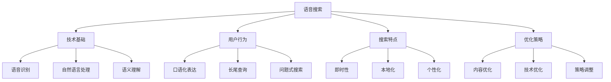
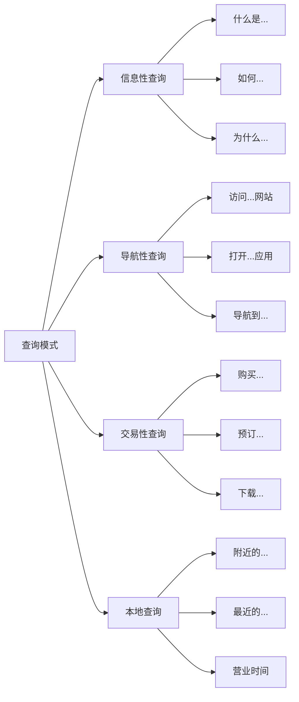
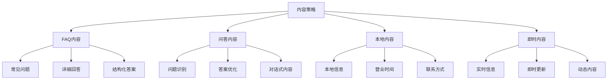
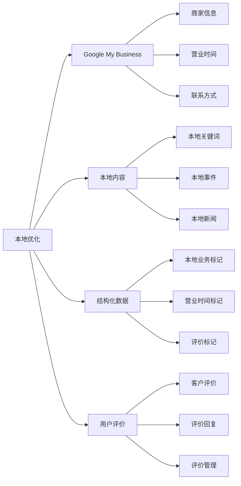
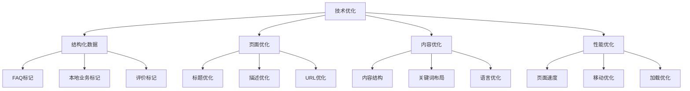
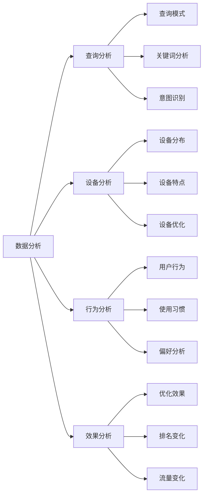
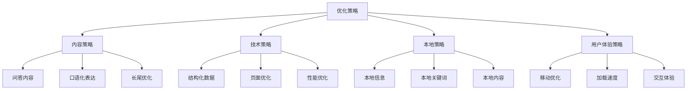
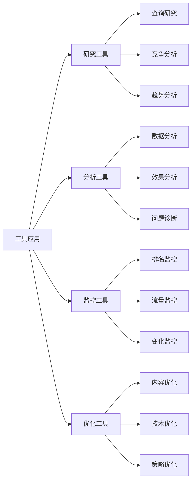
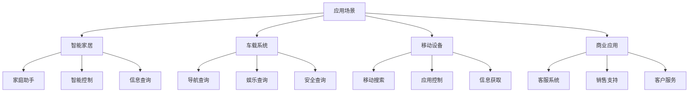

# 语音搜索优化

## 🎯 学习目标
- 深入理解语音搜索的发展趋势和特点
- 掌握语音搜索优化的核心策略
- 学会语音搜索内容优化方法
- 建立语音搜索SEO认知框架

## 🎤 语音搜索概述

### 核心概念
**语音搜索**：用户通过语音输入进行搜索，而非传统的文字输入方式

### 语音搜索发展现状
| 发展指标 | 当前水平 | 增长趋势 | SEO影响 |
|----------|----------|----------|---------|
| **使用率** | 20%+ | 快速增长 | 长尾关键词重要性 |
| **设备普及** | 智能音箱30%+ | 持续增长 | 本地SEO机会 |
| **功能扩展** | 基础功能 | 功能丰富化 | 内容策略调整 |
| **商务应用** | 起步阶段 | 快速发展 | 转化路径创新 |

## 🔍 语音搜索特点分析

### 1. 搜索行为特点
| 行为特征 | 具体表现 | 优化影响 | 策略调整 |
|----------|----------|----------|----------|
| **口语化** | 自然语言表达 | 内容语言优化 | 口语化内容创作 |
| **长尾性** | 完整句子查询 | 长尾关键词重要 | 长尾关键词策略 |
| **问题式** | 疑问句形式 | 问答内容需求 | FAQ内容优化 |
| **本地化** | 本地信息查询 | 本地SEO重要 | 本地内容优化 |

### 2. 语音搜索查询模式

### 3. 语音搜索技术特点
- **自然语言处理**：理解口语化表达
- **上下文理解**：理解对话上下文
- **多轮对话**：支持连续对话
- **个性化**：基于用户历史个性化

## 📝 语音搜索内容优化

### 1. 内容语言优化
| 优化维度 | 具体要求 | 实现方法 | 效果评估 |
|----------|----------|----------|----------|
| **口语化** | 自然语言表达 | 对话式内容 | 语音搜索匹配度 |
| **问答格式** | FAQ式内容 | 问题-答案结构 | 语音回答质量 |
| **长尾优化** | 完整句子匹配 | 长尾关键词布局 | 语音查询覆盖 |
| **本地化** | 本地信息完整 | 本地内容优化 | 本地语音搜索 |

### 2. 语音搜索内容策略

### 3. 语音搜索内容优化重点
- **问答格式**：采用问题-答案的内容结构
- **口语化表达**：使用自然、口语化的语言
- **完整信息**：提供完整、准确的答案
- **本地信息**：完善本地相关信息

## 🏠 本地语音搜索优化

### 1. 本地语音搜索特点
| 搜索类型 | 查询模式 | 优化重点 | 内容需求 |
|----------|----------|----------|----------|
| **位置查询** | "附近的餐厅" | 地理位置优化 | 位置信息准确 |
| **服务查询** | "最近的加油站" | 服务信息完整 | 服务详情完整 |
| **时间查询** | "营业时间" | 时间信息准确 | 营业时间更新 |
| **评价查询** | "评价如何" | 评价信息展示 | 用户评价展示 |

### 2. 本地语音搜索优化

### 3. 本地语音搜索策略
- **Google My Business**：完善本地商家信息
- **本地关键词**：优化本地相关关键词
- **结构化数据**：添加本地业务标记
- **用户评价**：鼓励用户评价和反馈

## 🔧 技术优化策略

### 1. 结构化数据优化
| 数据类型 | Schema标记 | 语音搜索价值 | 实现方法 |
|----------|-------------|--------------|----------|
| **FAQ** | FAQPage | 问答内容识别 | FAQ结构化数据 |
| **本地业务** | LocalBusiness | 本地信息展示 | 本地业务标记 |
| **营业时间** | OpeningHours | 时间信息准确 | 时间标记 |
| **评价** | Review | 评价信息展示 | 评价标记 |

### 2. 技术优化实现

### 3. 技术优化重点
- **结构化数据**：添加语音搜索相关的Schema标记
- **页面优化**：优化页面标题、描述等元素
- **内容优化**：优化内容结构和语言表达
- **性能优化**：确保页面快速加载

## 📊 语音搜索数据分析

### 1. 语音搜索关键指标
| 指标类型 | 具体指标 | 分析价值 | 优化方向 |
|----------|----------|----------|----------|
| **查询分析** | 语音查询模式 | 用户意图理解 | 内容策略调整 |
| **设备分析** | 设备使用分布 | 设备优化重点 | 设备适配优化 |
| **地域分析** | 地域查询特点 | 本地化策略 | 本地内容优化 |
| **时间分析** | 查询时间模式 | 内容发布时机 | 时间策略优化 |

### 2. 语音搜索数据分析

### 3. 语音搜索数据应用
- **内容策略**：基于查询分析调整内容策略
- **技术优化**：基于设备分析优化技术实现
- **本地优化**：基于地域分析优化本地内容
- **效果评估**：基于数据分析评估优化效果

## 🎯 语音搜索优化策略

### 1. 内容优化策略
- **问答格式**：采用FAQ式内容结构
- **口语化表达**：使用自然、口语化的语言
- **长尾关键词**：优化长尾关键词布局
- **本地信息**：完善本地相关信息

### 2. 技术优化策略

### 3. 语音搜索优化实施
- **内容创建**：创建语音搜索友好的内容
- **技术实现**：实现语音搜索技术优化
- **本地优化**：优化本地语音搜索表现
- **效果监控**：监控语音搜索优化效果

## 🛠️ 语音搜索工具应用

### 1. 语音搜索分析工具
| 工具类型 | 工具名称 | 功能特点 | 应用场景 |
|----------|----------|----------|----------|
| **查询分析** | Answer The Public | 问题挖掘 | 语音查询研究 |
| **本地分析** | Google My Business | 本地表现分析 | 本地语音搜索 |
| **内容分析** | SEMrush | 语音搜索分析 | 内容优化指导 |
| **监控工具** | Google Search Console | 语音搜索监控 | 效果监控 |

### 2. 工具应用策略

### 3. 工具使用最佳实践
- **工具组合**：使用多种工具组合分析
- **数据整合**：整合不同工具的数据
- **持续监控**：持续监控语音搜索表现
- **策略调整**：基于工具数据调整策略

## 📈 语音搜索未来趋势

### 1. 技术发展趋势
- **AI技术提升**：语音识别和理解能力提升
- **多模态融合**：语音、图像、文本融合
- **个性化增强**：基于用户历史的个性化
- **实时性提升**：实时语音搜索和回答

### 2. 应用场景扩展

### 3. 未来优化方向
- **多模态优化**：优化多模态搜索体验
- **个性化优化**：基于用户个性化优化
- **实时优化**：实时语音搜索优化
- **商业优化**：语音搜索商业应用优化

## 📚 学习路径

### 基础理解
1. [[01-SEO发展趋势]] - SEO发展趋势
2. [[02-AI对SEO影响]] - AI技术影响
3. [[03-移动优先索引]] - 移动端优化

### 深入应用
1. [[02-理解层-核心机制#2.2-关键词策略]] - 关键词策略
2. [[02-理解层-核心机制#2.4-内容SEO]] - 内容优化
3. [[04-精通层-高级策略#4.3-本地SEO]] - 本地SEO

### 实战练习
1. [[03-应用层-实践技能#3.1-SEO工具精通]] - 工具应用
2. [[05-实战案例与模板#5.1-成功案例分析]] - 案例分析
3. [[06-工具与资源#6.1-SEO工具大全]] - 工具资源

## 📖 相关链接
- [[01-SEO发展趋势]] - SEO发展趋势
- [[02-AI对SEO影响]] - AI技术影响
- [[03-移动优先索引]] - 移动端优化
- [[02-理解层-核心机制]] - 核心机制理解
- [[03-应用层-实践技能]] - 实践技能
- [[04-精通层-高级策略]] - 高级策略
