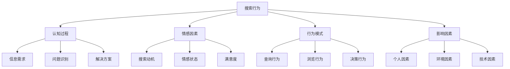
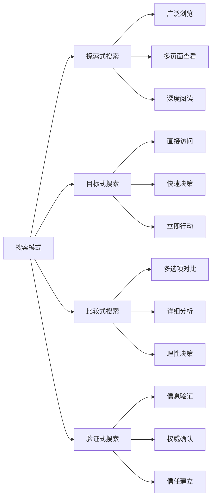
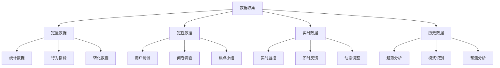
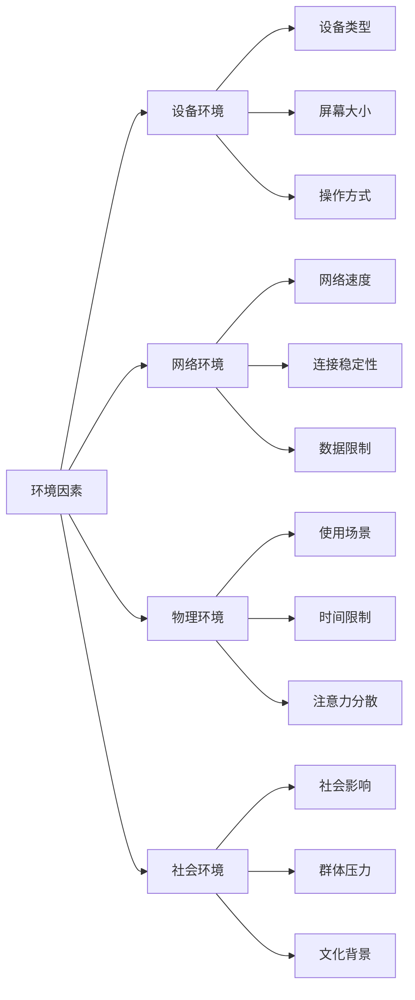
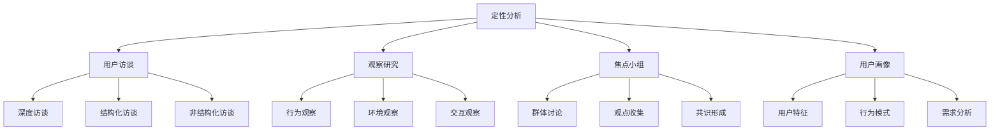
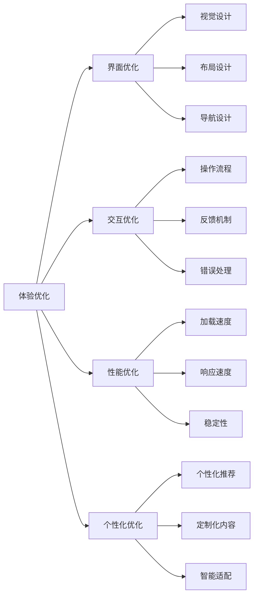
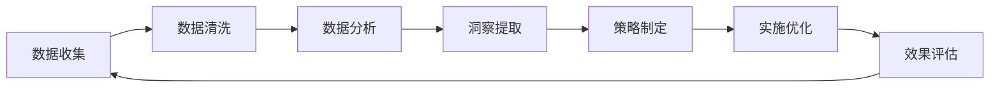

# 用户搜索行为分析

## 🎯 学习目标
- 深入理解用户搜索行为的心理机制
- 掌握搜索行为分析的方法和工具
- 学会基于用户行为优化SEO策略
- 建立用户行为分析认知框架

## 🧠 搜索行为心理学基础

### 核心概念
**用户搜索行为**：用户在搜索引擎中寻找信息、解决问题、满足需求的行为模式

### 搜索行为的重要性
| 重要性维度 | 具体表现 | 分析价值 | 优化应用 |
|------------|----------|----------|----------|
| **用户理解** | 深度理解用户需求 | 精准内容匹配 | 内容策略制定 |
| **体验优化** | 改善搜索体验 | 提升用户满意度 | 用户体验优化 |
| **转化提升** | 优化转化路径 | 提高商业价值 | 转化率优化 |
| **竞争优势** | 超越竞争对手 | 获得竞争优势 | 差异化策略 |

## 🔍 搜索行为类型分析

### 1. 按搜索意图分类
| 搜索类型 | 行为特征 | 心理动机 | 优化策略 |
|----------|----------|----------|----------|
| **信息性搜索** | 获取信息、学习 | 知识需求、好奇心 | 教育性内容、深度信息 |
| **导航性搜索** | 访问特定网站 | 目标明确、效率需求 | 品牌优化、快速访问 |
| **交易性搜索** | 完成购买行为 | 购买需求、决策压力 | 产品页面、转化优化 |
| **商业性搜索** | 比较研究 | 谨慎决策、风险规避 | 比较内容、专业分析 |

### 2. 搜索行为模式

### 3. 搜索行为特征
- **探索性**：用户通过搜索探索未知领域
- **目标性**：用户有明确的搜索目标
- **比较性**：用户通过搜索比较不同选项
- **验证性**：用户通过搜索验证信息准确性

## 📊 搜索行为数据收集

### 1. 数据来源分析
| 数据来源 | 数据类型 | 收集方法 | 分析价值 |
|----------|----------|----------|----------|
| **搜索查询** | 关键词、搜索量 | Search Console | 用户需求分析 |
| **用户行为** | 点击、停留、转化 | Analytics | 行为模式分析 |
| **用户反馈** | 评价、建议、投诉 | 调研、访谈 | 满意度分析 |
| **竞争数据** | 竞争对手行为 | 工具分析 | 竞争策略分析 |

### 2. 行为数据收集

### 3. 数据收集策略
- **多源整合**：整合多个数据源的信息
- **实时监控**：实时监控用户行为变化
- **深度分析**：深入分析用户行为模式
- **持续优化**：基于数据持续优化策略

## 🎯 搜索行为影响因素

### 1. 个人因素
| 个人因素 | 影响表现 | 优化策略 | 应用场景 |
|----------|----------|----------|----------|
| **知识水平** | 查询复杂度 | 内容难度适配 | 目标用户定位 |
| **经验背景** | 搜索习惯 | 个性化体验 | 用户分群 |
| **兴趣爱好** | 内容偏好 | 兴趣匹配 | 内容推荐 |
| **时间压力** | 搜索效率 | 快速访问 | 用户体验优化 |

### 2. 环境因素

### 3. 技术因素
- **搜索引擎**：不同搜索引擎的使用习惯
- **设备类型**：移动端vs桌面端行为差异
- **网络条件**：网络速度对搜索行为的影响
- **界面设计**：搜索界面设计对行为的影响

## 📈 搜索行为分析方法

### 1. 定量分析方法
| 分析方法 | 分析内容 | 分析工具 | 应用价值 |
|----------|----------|----------|----------|
| **统计分析** | 行为数据统计 | Analytics、工具 | 行为模式识别 |
| **趋势分析** | 行为趋势变化 | 时间序列分析 | 趋势预测 |
| **关联分析** | 行为关联关系 | 相关性分析 | 行为关联发现 |
| **聚类分析** | 用户行为分群 | 机器学习 | 用户分群 |

### 2. 定性分析方法

### 3. 混合分析方法
- **定量+定性**：结合数据分析和用户研究
- **实时+历史**：结合实时监控和历史分析
- **个体+群体**：结合个人行为和群体行为
- **主观+客观**：结合主观感受和客观数据

## 🎨 搜索行为优化策略

### 1. 内容优化策略
| 优化维度 | 优化策略 | 实现方法 | 效果评估 |
|----------|----------|----------|----------|
| **内容匹配** | 精准匹配用户需求 | 用户需求分析 | 内容相关性 |
| **内容结构** | 优化内容结构 | 信息架构优化 | 用户理解度 |
| **内容深度** | 适配用户知识水平 | 内容难度调整 | 用户满意度 |
| **内容更新** | 保持内容新鲜度 | 内容更新策略 | 用户粘性 |

### 2. 用户体验优化

### 3. 转化路径优化
- **路径分析**：分析用户转化路径
- **障碍识别**：识别转化过程中的障碍
- **优化实施**：实施转化路径优化
- **效果评估**：评估优化效果

## 🛠️ 搜索行为分析工具

### 1. 分析工具类型
| 工具类型 | 工具名称 | 功能特点 | 应用场景 |
|----------|----------|----------|----------|
| **行为分析** | Google Analytics | 用户行为跟踪 | 行为模式分析 |
| **搜索分析** | Search Console | 搜索查询分析 | 搜索行为分析 |
| **热力图** | Hotjar | 用户交互分析 | 界面优化 |
| **用户研究** | UserTesting | 用户测试 | 用户体验研究 |

### 2. 工具应用策略

### 3. 工具使用最佳实践
- **工具组合**：使用多种工具组合分析
- **数据整合**：整合不同工具的数据
- **持续监控**：持续监控用户行为
- **迭代优化**：基于数据迭代优化

## 📊 搜索行为数据应用

### 1. 数据应用场景
| 应用场景 | 数据需求 | 分析方法 | 优化效果 |
|----------|----------|----------|----------|
| **内容策略** | 用户需求数据 | 需求分析 | 内容匹配度提升 |
| **用户体验** | 行为数据 | 行为分析 | 用户体验改善 |
| **转化优化** | 转化数据 | 路径分析 | 转化率提升 |
| **竞争分析** | 竞争数据 | 对比分析 | 竞争优势获得 |

### 2. 数据应用流程

### 3. 数据应用最佳实践
- **数据驱动**：基于数据制定策略
- **持续优化**：持续优化和改进
- **效果评估**：评估优化效果
- **迭代改进**：基于效果迭代改进

## 🎯 搜索行为优化实践

### 1. 短期优化（1-3个月）
- **行为分析**：深入分析用户搜索行为
- **问题识别**：识别用户体验问题
- **快速优化**：实施快速优化措施
- **效果监控**：监控优化效果

### 2. 中期优化（3-6个月）
- **策略制定**：制定基于行为的优化策略
- **系统优化**：系统性优化用户体验
- **个性化**：实施个性化优化
- **竞争分析**：分析竞争对手行为策略

### 3. 长期优化（6-12个月）
- **用户洞察**：深入理解用户需求和行为
- **创新策略**：开发创新的优化策略
- **技术升级**：升级分析技术和工具
- **持续改进**：建立持续改进机制

## 📚 学习路径

### 基础理解
1. [[02-搜索心理因素]] - 搜索心理因素
2. [[03-用户决策过程]] - 用户决策过程
3. [[1.2-搜索引擎原理#03-搜索意图理解]] - 搜索意图理解

### 深入应用
1. [[02-理解层-核心机制#2.4-内容SEO]] - 内容优化
2. [[02-理解层-核心机制#2.5-用户体验]] - 用户体验
3. [[03-应用层-实践技能#3.5-数据分析]] - 数据分析

### 实战练习
1. [[03-应用层-实践技能#3.1-SEO工具精通]] - 工具应用
2. [[05-实战案例与模板#5.1-成功案例分析]] - 案例分析
3. [[06-工具与资源#6.1-SEO工具大全]] - 工具资源

## 📖 相关链接
- [[02-搜索心理因素]] - 搜索心理因素
- [[03-用户决策过程]] - 用户决策过程
- [[1.2-搜索引擎原理#03-搜索意图理解]] - 搜索意图理解
- [[02-理解层-核心机制]] - 核心机制理解
- [[03-应用层-实践技能]] - 实践技能
- [[04-精通层-高级策略]] - 高级策略
