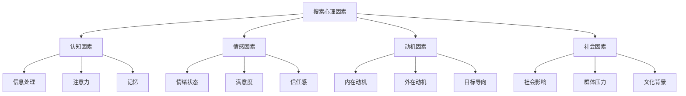
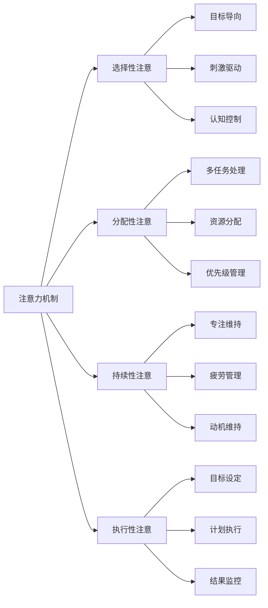
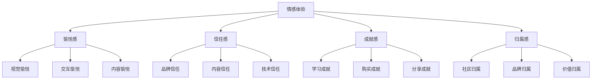
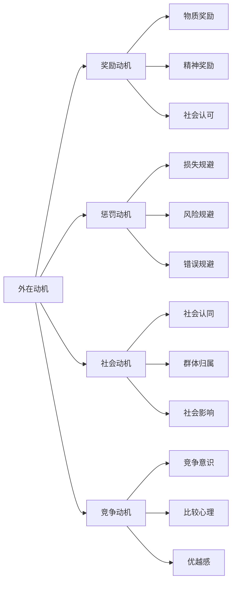
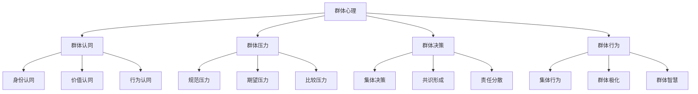
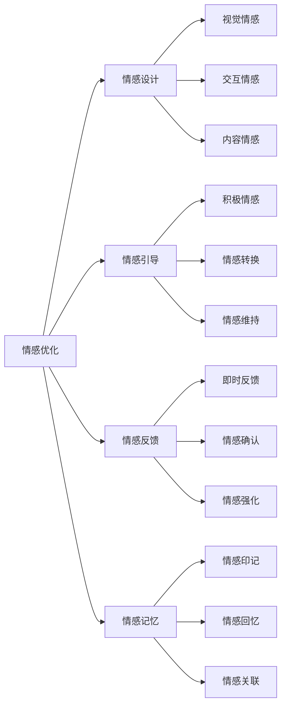
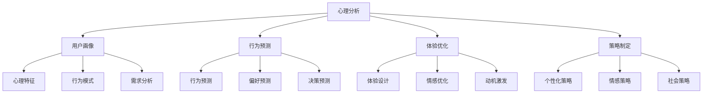
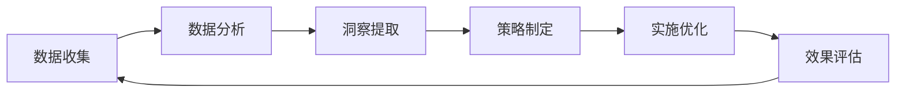

# 搜索心理因素

## 🎯 学习目标
- 深入理解影响用户搜索行为的心理因素
- 掌握搜索心理学的核心理论和应用
- 学会基于心理因素优化SEO策略
- 建立搜索心理学认知框架

## 🧠 搜索心理学基础

### 核心概念
**搜索心理因素**：影响用户搜索行为、决策过程和体验感受的心理机制

### 搜索心理学的重要性
| 重要性维度 | 具体表现 | 分析价值 | 优化应用 |
|------------|----------|----------|----------|
| **用户理解** | 深度理解用户心理 | 精准用户画像 | 个性化策略 |
| **体验优化** | 改善心理体验 | 提升用户满意度 | 体验设计优化 |
| **转化提升** | 优化心理转化路径 | 提高转化效率 | 转化率优化 |
| **竞争优势** | 心理差异化优势 | 获得心理优势 | 差异化策略 |

## 🧩 认知心理因素

### 1. 信息处理模式
| 处理模式 | 特征描述 | 搜索行为 | 优化策略 |
|----------|----------|----------|----------|
| **系统化处理** | 深度思考、理性分析 | 详细比较、多轮搜索 | 详细内容、对比信息 |
| **启发式处理** | 快速判断、经验依赖 | 快速浏览、直觉选择 | 简洁信息、视觉引导 |
| **情感化处理** | 情感驱动、主观判断 | 情感化搜索、品牌偏好 | 情感内容、品牌建设 |

### 2. 注意力机制

### 3. 记忆系统
- **工作记忆**：临时存储和处理信息
- **长期记忆**：持久存储知识和经验
- **情景记忆**：特定情境下的记忆
- **语义记忆**：概念和知识记忆

## 💭 情感心理因素

### 1. 情绪状态影响
| 情绪状态 | 搜索特征 | 行为表现 | 优化策略 |
|----------|----------|----------|----------|
| **积极情绪** | 开放探索、风险接受 | 广泛浏览、尝试新内容 | 创新内容、积极体验 |
| **消极情绪** | 保守谨慎、风险规避 | 谨慎选择、依赖权威 | 权威内容、安全体验 |
| **中性情绪** | 理性分析、客观判断 | 系统比较、客观评估 | 客观信息、理性内容 |

### 2. 情感体验优化

### 3. 情感设计原则
- **情感共鸣**：与用户情感产生共鸣
- **情感引导**：引导用户积极情感
- **情感反馈**：提供情感反馈机制
- **情感记忆**：创造难忘的情感体验

## 🎯 动机心理因素

### 1. 内在动机
| 内在动机 | 心理需求 | 搜索行为 | 优化策略 |
|----------|----------|----------|----------|
| **好奇心** | 知识探索需求 | 探索性搜索、学习 | 教育内容、知识分享 |
| **成就感** | 自我实现需求 | 目标导向搜索 | 目标达成、成就展示 |
| **自主性** | 控制感需求 | 个性化搜索 | 个性化体验、用户控制 |

### 2. 外在动机

### 3. 动机激发策略
- **内在动机激发**：满足用户内在需求
- **外在动机设计**：设计合理的奖励机制
- **动机维持**：持续激发和维持动机
- **动机转化**：将外在动机转化为内在动机

## 👥 社会心理因素

### 1. 社会影响机制
| 影响机制 | 影响方式 | 搜索行为 | 优化策略 |
|----------|----------|----------|----------|
| **从众效应** | 跟随群体行为 | 热门内容偏好 | 热门内容展示 |
| **权威效应** | 信任权威信息 | 权威来源偏好 | 权威内容建设 |
| **社会证明** | 他人行为参考 | 评价和推荐依赖 | 用户评价展示 |

### 2. 群体心理

### 3. 社会因素优化
- **社会证明**：展示他人行为和评价
- **群体归属**：建立用户群体归属感
- **社会互动**：促进用户社会互动
- **社会影响**：利用社会影响机制

## 🎨 心理因素优化策略

### 1. 认知优化策略
| 优化维度 | 优化策略 | 实现方法 | 效果评估 |
|----------|----------|----------|----------|
| **信息架构** | 优化信息组织 | 清晰分类、逻辑结构 | 用户理解度 |
| **注意力引导** | 引导用户注意力 | 视觉设计、信息层次 | 注意力集中度 |
| **记忆辅助** | 辅助用户记忆 | 重复信息、记忆线索 | 记忆保持度 |

### 2. 情感优化策略

### 3. 动机优化策略
- **内在动机激发**：满足用户内在需求
- **外在动机设计**：设计合理的激励机制
- **动机维持**：持续激发和维持动机
- **动机转化**：将外在动机转化为内在动机

## 🛠️ 心理因素分析工具

### 1. 心理分析工具
| 工具类型 | 工具名称 | 功能特点 | 应用场景 |
|----------|----------|----------|----------|
| **用户研究** | UserTesting | 用户行为观察 | 心理行为分析 |
| **情感分析** | Sentiment Analysis | 情感状态分析 | 情感体验优化 |
| **动机分析** | Motivation Research | 动机因素分析 | 动机策略制定 |
| **社会分析** | Social Analytics | 社会行为分析 | 社会因素优化 |

### 2. 心理分析应用

### 3. 心理分析最佳实践
- **多维度分析**：从多个维度分析心理因素
- **持续监控**：持续监控心理因素变化
- **实验验证**：通过实验验证心理假设
- **迭代优化**：基于分析结果迭代优化

## 📊 心理因素数据应用

### 1. 心理数据收集
| 数据类型 | 收集方法 | 分析价值 | 应用场景 |
|----------|----------|----------|----------|
| **行为数据** | 行为跟踪 | 行为模式分析 | 行为预测 |
| **情感数据** | 情感分析 | 情感状态分析 | 情感优化 |
| **动机数据** | 动机调研 | 动机因素分析 | 动机激发 |
| **社会数据** | 社会分析 | 社会影响分析 | 社会优化 |

### 2. 心理数据应用

### 3. 心理数据应用策略
- **数据驱动**：基于心理数据制定策略
- **个性化**：基于心理特征个性化体验
- **预测性**：基于心理数据预测行为
- **优化性**：基于心理数据持续优化

## 🎯 心理因素优化实践

### 1. 短期优化（1-3个月）
- **心理分析**：分析用户心理因素
- **快速优化**：实施快速心理优化
- **效果监控**：监控心理优化效果
- **策略调整**：基于效果调整策略

### 2. 中期优化（3-6个月）
- **深度分析**：深入分析心理因素
- **系统优化**：系统性心理优化
- **个性化**：实施个性化心理策略
- **实验验证**：验证心理优化假设

### 3. 长期优化（6-12个月）
- **心理洞察**：深入理解用户心理
- **创新策略**：开发创新心理策略
- **技术升级**：升级心理分析技术
- **持续改进**：建立持续改进机制

## 📚 学习路径

### 基础理解
1. [[01-用户搜索行为分析]] - 搜索行为分析
2. [[03-用户决策过程]] - 用户决策过程
3. [[1.2-搜索引擎原理#03-搜索意图理解]] - 搜索意图理解

### 深入应用
1. [[02-理解层-核心机制#2.4-内容SEO]] - 内容优化
2. [[02-理解层-核心机制#2.5-用户体验]] - 用户体验
3. [[03-应用层-实践技能#3.5-数据分析]] - 数据分析

### 实战练习
1. [[03-应用层-实践技能#3.1-SEO工具精通]] - 工具应用
2. [[05-实战案例与模板#5.1-成功案例分析]] - 案例分析
3. [[06-工具与资源#6.1-SEO工具大全]] - 工具资源

## 📖 相关链接
- [[01-用户搜索行为分析]] - 搜索行为分析
- [[03-用户决策过程]] - 用户决策过程
- [[1.2-搜索引擎原理#03-搜索意图理解]] - 搜索意图理解
- [[02-理解层-核心机制]] - 核心机制理解
- [[03-应用层-实践技能]] - 实践技能
- [[04-精通层-高级策略]] - 高级策略
