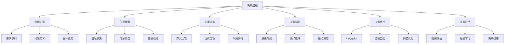
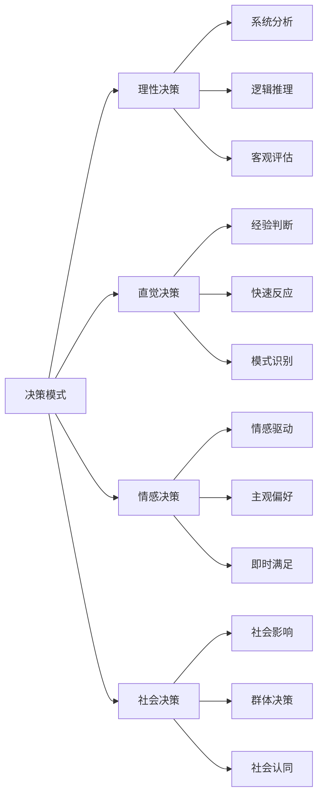
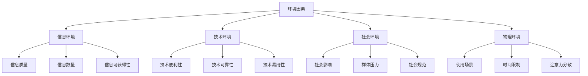
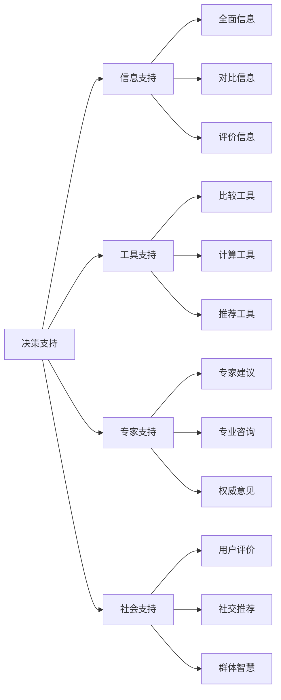
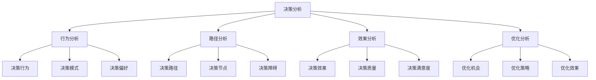
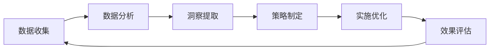
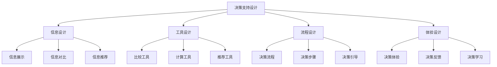

# 用户决策过程

## 🎯 学习目标
- 深入理解用户决策过程的心理机制
- 掌握决策过程分析和优化方法
- 学会基于决策过程优化SEO策略
- 建立用户决策分析认知框架

## 🧠 决策过程心理学基础

### 核心概念
**用户决策过程**：用户在搜索、浏览、选择、购买等行为中的心理决策机制

### 决策过程的重要性
| 重要性维度 | 具体表现 | 分析价值 | 优化应用 |
|------------|----------|----------|----------|
| **用户理解** | 深度理解决策机制 | 精准决策预测 | 决策路径优化 |
| **转化优化** | 优化决策转化路径 | 提升转化效率 | 转化率优化 |
| **体验改善** | 改善决策体验 | 提升用户满意度 | 体验设计优化 |
| **竞争优势** | 决策差异化优势 | 获得决策优势 | 差异化策略 |

## 🔍 决策过程类型分析

### 1. 按决策复杂度分类
| 决策类型 | 特征描述 | 决策过程 | 优化策略 |
|----------|----------|----------|----------|
| **简单决策** | 低风险、低复杂度 | 快速决策、直觉判断 | 简化流程、快速响应 |
| **复杂决策** | 高风险、高复杂度 | 深度分析、理性判断 | 详细信息、专业支持 |
| **习惯性决策** | 重复性、自动化 | 经验依赖、模式匹配 | 个性化、便捷性 |
| **冲动性决策** | 情感驱动、即时性 | 情感决策、快速行动 | 情感激发、即时满足 |

### 2. 决策过程模式

### 3. 决策过程特征
- **多阶段性**：决策过程包含多个阶段
- **动态性**：决策过程会动态调整
- **个性化**：不同用户决策过程不同
- **情境性**：决策过程受情境影响

## 📊 决策过程影响因素

### 1. 个人因素
| 个人因素 | 影响表现 | 决策行为 | 优化策略 |
|----------|----------|----------|----------|
| **认知能力** | 信息处理能力 | 分析深度、决策质量 | 信息适配、认知辅助 |
| **经验背景** | 决策经验 | 经验依赖、模式匹配 | 经验展示、专业支持 |
| **风险偏好** | 风险承受度 | 风险选择、决策风格 | 风险信息、安全保障 |
| **时间压力** | 时间限制 | 决策速度、信息需求 | 快速响应、简化流程 |

### 2. 环境因素

### 3. 产品因素
- **产品特性**：产品功能、质量、价格
- **品牌形象**：品牌认知、信任度、声誉
- **服务质量**：服务体验、支持质量
- **用户体验**：界面设计、交互体验

## 🎯 决策过程优化策略

### 1. 信息优化策略
| 优化维度 | 优化策略 | 实现方法 | 效果评估 |
|----------|----------|----------|----------|
| **信息质量** | 提供准确信息 | 信息验证、权威来源 | 信息可信度 |
| **信息结构** | 优化信息组织 | 清晰分类、逻辑结构 | 信息理解度 |
| **信息呈现** | 优化信息展示 | 视觉设计、信息层次 | 信息获取效率 |
| **信息个性化** | 个性化信息 | 用户画像、偏好匹配 | 信息相关性 |

### 2. 决策支持优化

### 3. 决策流程优化
- **流程简化**：简化决策流程
- **步骤优化**：优化决策步骤
- **障碍消除**：消除决策障碍
- **效率提升**：提升决策效率

## 🛠️ 决策过程分析工具

### 1. 决策分析工具
| 工具类型 | 工具名称 | 功能特点 | 应用场景 |
|----------|----------|----------|----------|
| **行为分析** | Google Analytics | 用户行为跟踪 | 决策行为分析 |
| **路径分析** | Path Analysis | 用户路径分析 | 决策路径优化 |
| **A/B测试** | A/B Testing | 决策效果测试 | 决策优化验证 |
| **用户研究** | User Research | 用户决策研究 | 决策过程理解 |

### 2. 决策分析应用

### 3. 决策分析最佳实践
- **多维度分析**：从多个维度分析决策过程
- **持续监控**：持续监控决策过程变化
- **实验验证**：通过实验验证决策假设
- **迭代优化**：基于分析结果迭代优化

## 📈 决策过程数据应用

### 1. 决策数据收集
| 数据类型 | 收集方法 | 分析价值 | 应用场景 |
|----------|----------|----------|----------|
| **行为数据** | 行为跟踪 | 决策行为分析 | 决策行为预测 |
| **路径数据** | 路径分析 | 决策路径分析 | 决策路径优化 |
| **反馈数据** | 用户反馈 | 决策满意度分析 | 决策体验优化 |
| **结果数据** | 结果分析 | 决策效果分析 | 决策效果评估 |

### 2. 决策数据应用

### 3. 决策数据应用策略
- **数据驱动**：基于决策数据制定策略
- **个性化**：基于决策特征个性化体验
- **预测性**：基于决策数据预测行为
- **优化性**：基于决策数据持续优化

## 🎨 决策过程设计优化

### 1. 决策界面设计
| 设计要素 | 设计原则 | 实现方法 | 效果评估 |
|----------|----------|----------|----------|
| **信息架构** | 清晰的信息组织 | 分类设计、层次结构 | 信息获取效率 |
| **视觉设计** | 吸引人的视觉设计 | 色彩搭配、布局设计 | 视觉吸引力 |
| **交互设计** | 便捷的交互设计 | 操作流程、反馈机制 | 交互便利性 |
| **响应设计** | 快速响应设计 | 加载速度、响应时间 | 响应速度 |

### 2. 决策支持设计

### 3. 决策体验优化
- **决策便利性**：提升决策便利性
- **决策准确性**：提升决策准确性
- **决策满意度**：提升决策满意度
- **决策效率**：提升决策效率

## 🎯 决策过程优化实践

### 1. 短期优化（1-3个月）
- **决策分析**：分析用户决策过程
- **问题识别**：识别决策过程中的问题
- **快速优化**：实施快速优化措施
- **效果监控**：监控优化效果

### 2. 中期优化（3-6个月）
- **深度分析**：深入分析决策过程
- **系统优化**：系统性优化决策过程
- **个性化**：实施个性化决策支持
- **实验验证**：验证决策优化假设

### 3. 长期优化（6-12个月）
- **决策洞察**：深入理解用户决策机制
- **创新策略**：开发创新决策策略
- **技术升级**：升级决策分析技术
- **持续改进**：建立持续改进机制

## 📚 学习路径

### 基础理解
1. [[01-用户搜索行为分析]] - 搜索行为分析
2. [[02-搜索心理因素]] - 搜索心理因素
3. [[1.2-搜索引擎原理#03-搜索意图理解]] - 搜索意图理解

### 深入应用
1. [[02-理解层-核心机制#2.4-内容SEO]] - 内容优化
2. [[02-理解层-核心机制#2.5-用户体验]] - 用户体验
3. [[03-应用层-实践技能#3.5-数据分析]] - 数据分析

### 实战练习
1. [[03-应用层-实践技能#3.1-SEO工具精通]] - 工具应用
2. [[05-实战案例与模板#5.1-成功案例分析]] - 案例分析
3. [[06-工具与资源#6.1-SEO工具大全]] - 工具资源

## 📖 相关链接
- [[01-用户搜索行为分析]] - 搜索行为分析
- [[02-搜索心理因素]] - 搜索心理因素
- [[1.2-搜索引擎原理#03-搜索意图理解]] - 搜索意图理解
- [[02-理解层-核心机制]] - 核心机制理解
- [[03-应用层-实践技能]] - 实践技能
- [[04-精通层-高级策略]] - 高级策略
