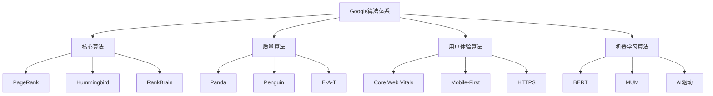
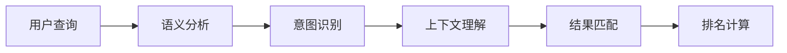
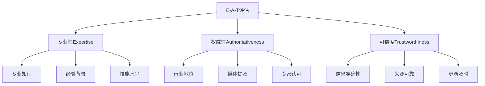
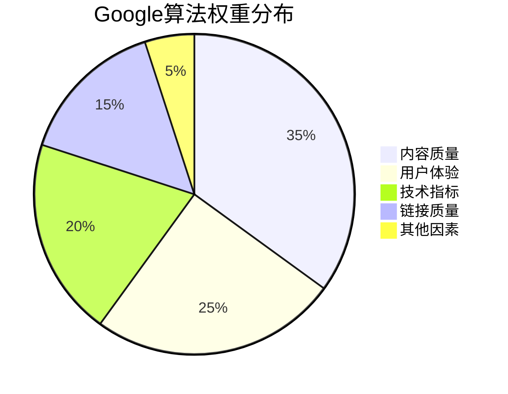

# Google核心算法

## 🎯 学习目标
- 深入理解Google核心算法机制
- 掌握PageRank、RankBrain等关键算法
- 了解算法权重分配和影响因素
- 建立Google算法认知框架

## 🧠 Google算法体系

### 算法架构


## 🔢 PageRank算法

### 核心原理
**PageRank**：基于链接分析的网页重要性评估算法

**基本思想**：
- 链接数量越多，页面越重要
- 来自重要页面的链接更有价值
- 链接质量比数量更重要

### 计算公式
```
PR(A) = (1-d) + d(PR(T1)/C(T1) + PR(T2)/C(T2) + ... + PR(Tn)/C(Tn))
```

**参数说明**：
- **PR(A)**：页面A的PageRank值
- **d**：阻尼系数（通常为0.85）
- **PR(Ti)**：链接到A的页面Ti的PageRank值
- **C(Ti)**：页面Ti的出链数量

### 影响因素
| 因素 | 影响程度 | 说明 |
|------|----------|------|
| 链接数量 | 中等 | 数量多但质量更重要 |
| 链接质量 | 高 | 权威网站链接价值高 |
| 链接文本 | 高 | 锚文本相关性重要 |
| 链接位置 | 中等 | 正文链接比侧边栏重要 |

## 🐦 Hummingbird算法

### 核心特性
**Hummingbird**：语义搜索算法，理解搜索意图

**主要改进**：
- **语义理解**：理解词汇的语义关系
- **上下文分析**：考虑搜索上下文
- **意图识别**：理解用户真实需求
- **长尾查询**：更好处理复杂查询

### 工作原理


### 优化策略
1. **语义关键词**：使用相关词汇
2. **内容深度**：提供全面信息
3. **用户意图**：满足真实需求
4. **上下文相关**：考虑搜索背景

## 🧠 RankBrain算法

### 核心功能
**RankBrain**：机器学习算法，处理复杂查询

**主要能力**：
- **查询理解**：理解复杂搜索查询
- **结果学习**：从用户行为中学习
- **排名调整**：动态调整排名
- **新查询处理**：处理从未见过的查询

### 学习机制
| 学习类型 | 数据来源 | 应用场景 |
|----------|----------|----------|
| 用户行为 | 点击、停留时间 | 排名调整 |
| 查询模式 | 搜索历史 | 意图理解 |
| 内容质量 | 用户反馈 | 质量评估 |
| 相关性 | 用户行为 | 相关性计算 |

## 🐼 Panda算法

### 核心目标
**Panda**：内容质量算法，打击低质量内容

**评估标准**：
- **原创性**：内容是否原创
- **深度**：内容详细程度
- **准确性**：信息准确性
- **用户体验**：页面易用性

### 惩罚因素
| 因素 | 风险等级 | 影响 |
|------|----------|------|
| 重复内容 | 高 | 排名大幅下降 |
| 低质量内容 | 高 | 流量减少 |
| 广告过多 | 中 | 用户体验差 |
| 内容稀少 | 中 | 价值低 |

### 优化策略
1. **原创内容**：提供独特价值
2. **内容深度**：详细全面信息
3. **定期更新**：保持内容新鲜
4. **用户导向**：以用户为中心

## 🐧 Penguin算法

### 核心目标
**Penguin**：链接质量算法，打击垃圾链接

**检测机制**：
- **链接模式**：识别不自然链接
- **链接质量**：评估链接来源
- **链接速度**：检测异常增长
- **链接文本**：分析锚文本模式

### 惩罚类型
| 类型 | 特征 | 后果 |
|------|------|------|
| 垃圾链接 | 低质量来源 | 排名下降 |
| 过度优化 | 关键词堆砌 | 降权处理 |
| 链接农场 | 大量低质量链接 | 严重惩罚 |
| 付费链接 | 未声明付费 | 排名波动 |

### 恢复策略
1. **链接审计**：识别问题链接
2. **链接清理**：移除垃圾链接
3. **质量建设**：获取高质量链接
4. **自然增长**：保持自然链接模式

## 🎯 E-A-T概念

### 核心要素
**E-A-T**：专业性（Expertise）、权威性（Authoritativeness）、可信度（Trustworthiness）

### 评估维度


### 优化策略
| 要素 | 优化方法 | 具体措施 |
|------|----------|----------|
| 专业性 | 内容深度 | 详细专业内容 |
| 权威性 | 外链建设 | 权威网站链接 |
| 可信度 | 信息准确 | 事实核查更新 |

## 📊 Core Web Vitals

### 核心指标
**Core Web Vitals**：用户体验核心指标

**三大指标**：
1. **LCP（Largest Contentful Paint）**：最大内容绘制
2. **FID（First Input Delay）**：首次输入延迟
3. **CLS（Cumulative Layout Shift）**：累积布局偏移

### 优化目标
| 指标 | 良好 | 需要改进 | 差 |
|------|------|----------|-----|
| LCP | ≤2.5秒 | 2.5-4秒 | >4秒 |
| FID | ≤100毫秒 | 100-300毫秒 | >300毫秒 |
| CLS | ≤0.1 | 0.1-0.25 | >0.25 |

### 优化策略
1. **LCP优化**：优化图片、字体加载
2. **FID优化**：减少JavaScript阻塞
3. **CLS优化**：避免布局偏移

## 🤖 BERT算法

### 核心能力
**BERT**：双向编码器表示变换器

**主要功能**：
- **自然语言理解**：理解语言含义
- **上下文分析**：考虑完整语境
- **语义匹配**：精确匹配用户意图
- **长尾查询**：处理复杂查询

### 应用场景
- **搜索查询理解**：理解用户意图
- **内容相关性**：评估内容匹配度
- **特色片段**：生成准确答案
- **多语言搜索**：跨语言理解

## 📈 算法权重分配

### 权重分布


### 影响因素
| 因素类别 | 权重 | 主要指标 |
|----------|------|----------|
| 内容质量 | 35% | 原创性、深度、准确性 |
| 用户体验 | 25% | Core Web Vitals、易用性 |
| 技术指标 | 20% | 页面速度、移动友好 |
| 链接质量 | 15% | 外链质量、内链结构 |
| 其他因素 | 5% | 新鲜度、个性化 |

## 🎯 算法优化策略

### 内容优化
1. **原创性**：提供独特价值内容
2. **深度**：详细全面的信息
3. **准确性**：确保信息准确
4. **更新**：定期更新内容

### 技术优化
1. **页面速度**：优化Core Web Vitals
2. **移动友好**：响应式设计
3. **安全性**：HTTPS协议
4. **结构化**：Schema标记

### 用户体验优化
1. **易用性**：清晰的导航
2. **可读性**：良好的排版
3. **交互性**：用户参与功能
4. **个性化**：基于用户偏好

## 📚 学习路径

### 基础理解
1. [[02-算法更新历史]] - 了解算法发展
2. [[03-E-A-T概念详解]] - 掌握E-A-T
3. [[04-Core Web Vitals]] - 学习核心指标

### 深入应用
1. [[01-关键词研究基础]] - 掌握关键词策略
2. [[01-内容策略规划]] - 学习内容优化
3. [[01-技术SEO]] - 学习技术优化

## 📖 相关链接
- [[02-算法更新历史]] - 了解算法发展历程
- [[03-E-A-T概念详解]] - 深入学习E-A-T
- [[04-Core Web Vitals]] - 掌握核心指标
- [[05-算法惩罚机制]] - 了解惩罚机制
