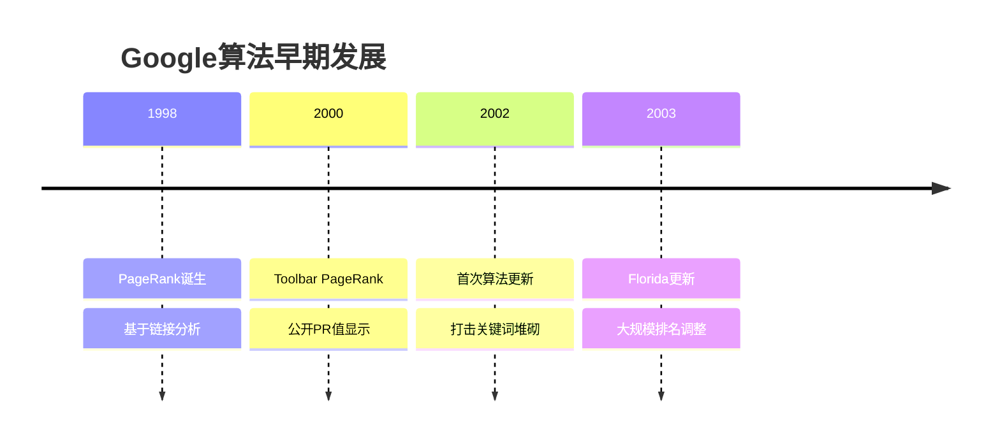
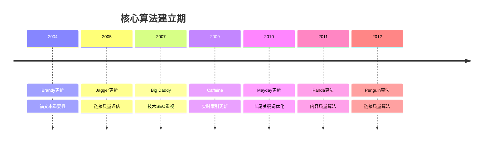
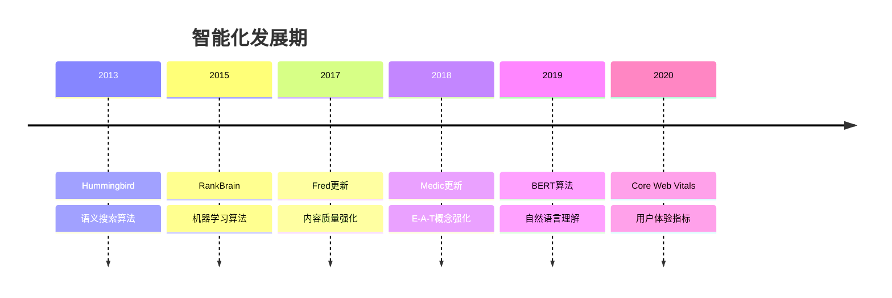
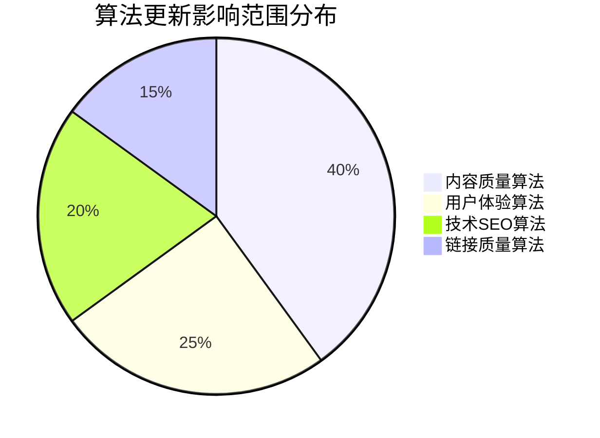

# Google算法更新历史

## 🎯 学习目标
- 掌握Google算法发展脉络
- 理解每次更新的核心目的
- 建立算法演进认知框架
- 预测未来算法趋势

## 📅 算法发展时间线

### 早期算法（1998-2003）

### 核心算法建立（2004-2012）

### 智能化发展（2013-2020）

## 🔥 重大算法更新详解

### 1. PageRank（1998）
**核心思想**：链接即投票
- **影响**：建立链接权重概念
- **优化方向**：高质量外链建设
- **现代意义**：仍是排名基础因素

### 2. Panda算法（2011）
**核心目标**：打击低质量内容
- **影响范围**：12%搜索查询
- **主要特征**：
  - 重复内容惩罚
  - 内容农场打击
  - 用户体验重视
- **优化策略**：[[03-E-A-T概念详解#内容质量优化]]

### 3. Penguin算法（2012）
**核心目标**：打击垃圾链接
- **影响范围**：3%搜索查询
- **主要特征**：
  - 过度优化惩罚
  - 垃圾链接识别
  - 自然链接模式
- **恢复策略**：[[05-算法惩罚机制#链接惩罚恢复]]

### 4. Hummingbird算法（2013）
**核心目标**：语义搜索理解
- **影响范围**：90%搜索查询
- **主要特征**：
  - 语义理解能力
  - 上下文分析
  - 意图识别
- **优化策略**：[[02-关键词策略#语义关键词]]

### 5. RankBrain算法（2015）
**核心目标**：机器学习排名
- **影响范围**：15%搜索查询
- **主要特征**：
  - 查询理解学习
  - 用户行为分析
  - 动态排名调整
- **优化策略**：[[02-用户体验#用户行为优化]]

### 6. BERT算法（2019）
**核心目标**：自然语言理解
- **影响范围**：10%搜索查询
- **主要特征**：
  - 双向语言理解
  - 上下文关联
  - 长尾查询优化
- **优化策略**：[[02-内容SEO#自然语言优化]]

### 7. Core Web Vitals（2021）
**核心目标**：用户体验量化
- **影响范围**：所有搜索查询
- **主要特征**：
  - LCP性能指标
  - FID交互指标
  - CLS视觉指标
- **优化策略**：[[04-Core Web Vitals#详细优化指南]]

## 📊 算法更新影响分析

### 更新频率统计
| 时期 | 更新频率 | 主要特征 | 影响程度 |
|------|----------|----------|----------|
| 1998-2003 | 年更新 | 基础算法建立 | 中等 |
| 2004-2012 | 季度更新 | 核心算法完善 | 高 |
| 2013-2020 | 月度更新 | 智能化发展 | 极高 |
| 2021-至今 | 实时更新 | AI驱动优化 | 持续 |

### 影响范围分析

## 🎯 算法更新应对策略

### 1. 预防性策略
- **内容质量**：持续提供高质量内容
- **技术优化**：保持网站技术健康
- **用户体验**：优化用户交互体验
- **合规性**：遵循Google指南

### 2. 监控策略
- **排名监控**：跟踪关键词排名变化
- **流量分析**：分析流量波动原因
- **竞争对手**：监控竞争对手表现
- **算法信号**：关注Google官方信息

### 3. 恢复策略
- **问题诊断**：快速识别问题原因
- **影响评估**：评估更新影响范围
- **修复实施**：针对性修复问题
- **效果验证**：验证修复效果

## 🔮 未来算法趋势

### 1. AI驱动优化
- **MUM算法**：多模态理解
- **LaMDA**：对话式搜索
- **PaLM**：大规模语言模型

### 2. 用户体验深化
- **个性化搜索**：基于用户偏好
- **上下文理解**：深度语义理解
- **多模态搜索**：文本+图像+语音

### 3. 技术标准提升
- **Core Web Vitals 2.0**：更严格标准
- **移动优先**：移动体验优化
- **隐私保护**：用户隐私重视

## 📚 学习路径

### 基础理解
1. [[01-Google核心算法]] - 掌握核心算法原理
2. [[03-E-A-T概念详解]] - 理解质量评估标准
3. [[04-Core Web Vitals]] - 学习用户体验指标

### 深入应用
1. [[02-关键词策略#算法适配]] - 关键词策略调整
2. [[02-内容SEO#算法优化]] - 内容优化策略
3. [[02-技术SEO#算法适配]] - 技术优化方向

### 实战练习
1. [[03-应用层-实践技能#3.2-网站审计]] - 算法影响审计
2. [[03-应用层-实践技能#3.6-问题诊断与解决]] - 算法问题诊断
3. [[05-实战案例与模板#5.1-成功案例分析]] - 算法更新案例

## 📖 相关链接
- [[01-Google核心算法]] - 核心算法原理
- [[03-E-A-T概念详解]] - 质量评估标准
- [[04-Core Web Vitals]] - 用户体验指标
- [[05-算法惩罚机制]] - 惩罚机制详解
- [[02-关键词策略]] - 关键词优化策略
- [[02-内容SEO]] - 内容优化策略
