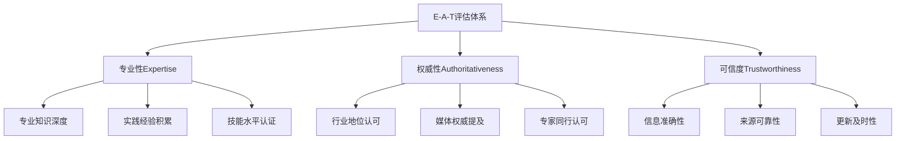
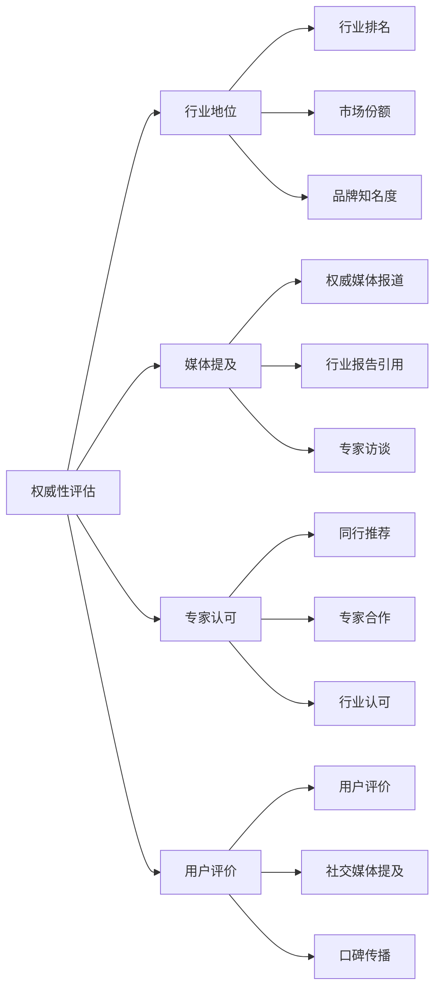
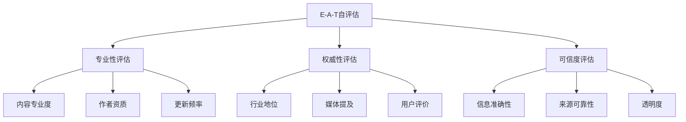

# E-A-T概念详解

## 🎯 学习目标
- 深入理解E-A-T三大核心要素
- 掌握专业性、权威性、可信度评估方法
- 建立E-A-T优化实践框架
- 学会不同行业的E-A-T应用策略

## 🧠 E-A-T核心概念

### 定义解析
**E-A-T** = **E**xpertise（专业性）+ **A**uthoritativeness（权威性）+ **T**rustworthiness（可信度）

## 🎓 专业性（Expertise）

### 核心要素
**专业性**：在特定领域具备深度知识和实践经验

### 评估维度
| 维度 | 评估标准 | 具体指标 |
|------|----------|----------|
| **知识深度** | 专业内容质量 | 技术细节、深度分析 |
| **实践经验** | 实际应用能力 | 案例研究、实战经验 |
| **持续学习** | 知识更新能力 | 最新趋势、技术发展 |
| **专业认证** | 资质证明 | 证书、学位、奖项 |

### 优化策略
1. **内容深度**：提供专业级技术内容
2. **实践经验**：分享真实案例和经验
3. **持续更新**：跟进行业最新发展
4. **专业认证**：展示相关资质证明

## 👑 权威性（Authoritativeness）

### 核心要素
**权威性**：在行业内被认可的地位和影响力

### 评估维度

### 建立权威性
| 策略 | 具体方法 | 预期效果 |
|------|----------|----------|
| **内容权威** | 原创研究、深度分析 | 建立专业声誉 |
| **媒体关系** | 权威媒体合作 | 提升品牌权威性 |
| **专家网络** | 行业专家合作 | 获得专业认可 |
| **用户口碑** | 优质服务体验 | 建立用户信任 |

## 🛡️ 可信度（Trustworthiness）

### 核心要素
**可信度**：信息准确、来源可靠、更新及时

### 评估维度
| 维度 | 评估标准 | 具体指标 |
|------|----------|----------|
| **信息准确性** | 事实核查 | 数据来源、引用规范 |
| **来源可靠性** | 权威来源 | 官方数据、专家观点 |
| **更新及时性** | 信息新鲜度 | 最新数据、定期更新 |
| **透明度** | 信息公开 | 作者信息、利益声明 |

### 建立可信度
1. **事实核查**：确保信息准确性
2. **来源标注**：明确信息来源
3. **定期更新**：保持信息时效性
4. **透明度**：公开作者和利益关系

## 🏥 不同行业的E-A-T要求

### YMYL（Your Money Your Life）行业
**高E-A-T要求**：金融、医疗、法律等

#### 医疗健康
| 要素 | 特殊要求 | 优化策略 |
|------|----------|----------|
| **专业性** | 医学资质认证 | 医生作者、医学背景 |
| **权威性** | 医疗机构认可 | 医院合作、专家推荐 |
| **可信度** | 医疗准确性 | 医学文献引用、免责声明 |

#### 金融服务
| 要素 | 特殊要求 | 优化策略 |
|------|----------|----------|
| **专业性** | 金融资质认证 | CFA、CPA等认证 |
| **权威性** | 监管机构认可 | 合规经营、监管报告 |
| **可信度** | 风险披露 | 风险提示、合规声明 |

### 一般商业行业
**标准E-A-T要求**：电商、教育、娱乐等

#### 电商平台
| 要素 | 优化重点 | 具体措施 |
|------|----------|----------|
| **专业性** | 产品知识 | 详细产品信息、使用指南 |
| **权威性** | 品牌声誉 | 用户评价、媒体报道 |
| **可信度** | 交易安全 | 安全支付、退换政策 |

## 📊 E-A-T评估框架

### 自评估工具

### 评估标准
| 等级 | 专业性 | 权威性 | 可信度 | 综合评分 |
|------|--------|--------|--------|----------|
| **优秀** | 9-10分 | 9-10分 | 9-10分 | A级 |
| **良好** | 7-8分 | 7-8分 | 7-8分 | B级 |
| **一般** | 5-6分 | 5-6分 | 5-6分 | C级 |
| **较差** | 3-4分 | 3-4分 | 3-4分 | D级 |
| **很差** | 1-2分 | 1-2分 | 1-2分 | F级 |

## 🎯 E-A-T优化策略

### 内容优化
1. **专业内容**：提供深度专业分析
2. **原创研究**：进行行业调研分析
3. **案例研究**：分享真实成功案例
4. **技术细节**：提供具体技术指导

### 作者优化
1. **作者简介**：详细专业背景介绍
2. **专业认证**：展示相关资质证书
3. **联系方式**：提供专业联系方式
4. **社交媒体**：建立专业形象

### 网站优化
1. **关于页面**：详细公司/个人介绍
2. **团队介绍**：展示专业团队
3. **资质证明**：展示相关认证
4. **联系方式**：提供多种联系方式

### 外链建设
1. **权威网站**：获得权威网站链接
2. **行业媒体**：获得行业媒体报道
3. **专家推荐**：获得专家认可推荐
4. **用户评价**：获得用户正面评价

## 📈 E-A-T提升路径

### 短期策略（1-3个月）
- **内容质量**：提升现有内容专业度
- **作者信息**：完善作者简介和资质
- **网站信息**：完善关于页面和联系方式
- **基础外链**：获得基础权威链接

### 中期策略（3-6个月）
- **原创研究**：发布行业调研报告
- **专家合作**：与行业专家建立合作
- **媒体关系**：建立媒体合作关系
- **用户口碑**：提升用户满意度

### 长期策略（6-12个月）
- **行业地位**：建立行业权威地位
- **品牌声誉**：建立强大品牌声誉
- **专家网络**：建立广泛专家网络
- **持续影响**：保持持续影响力

## 🔍 E-A-T监控指标

### 专业性指标
- **内容深度**：技术细节丰富度
- **更新频率**：内容更新及时性
- **专业认证**：作者资质完整性
- **实践经验**：案例研究数量

### 权威性指标
- **媒体提及**：权威媒体报道数量
- **专家认可**：行业专家推荐数量
- **用户评价**：用户满意度评分
- **行业地位**：行业排名和认可度

### 可信度指标
- **信息准确性**：事实核查通过率
- **来源可靠性**：权威来源引用比例
- **更新及时性**：信息时效性
- **透明度**：信息公开完整性

## 📚 学习路径

### 基础理解
1. [[01-Google核心算法#E-A-T概念]] - 核心算法中的E-A-T
2. [[02-算法更新历史#Medic更新]] - E-A-T算法更新
3. [[04-Core Web Vitals]] - 用户体验与E-A-T关系

### 深入应用
1. [[02-内容SEO#E-A-T内容优化]] - 内容层面的E-A-T优化
2. [[02-链接建设#权威链接建设]] - 权威性建设策略
3. [[02-技术SEO#E-A-T技术优化]] - 技术层面的E-A-T支持

### 实战练习
1. [[03-应用层-实践技能#3.2-网站审计#E-A-T审计]] - E-A-T审计方法
2. [[03-应用层-实践技能#3.3-竞争分析#E-A-T竞争分析]] - 竞争对手E-A-T分析
3. [[05-实战案例与模板#5.1-成功案例分析#E-A-T案例]] - E-A-T成功案例

## 📖 相关链接
- [[01-Google核心算法]] - 核心算法原理
- [[02-算法更新历史]] - 算法发展历程
- [[04-Core Web Vitals]] - 用户体验指标
- [[05-算法惩罚机制]] - 惩罚机制详解
- [[02-内容SEO]] - 内容优化策略
- [[02-链接建设]] - 链接建设策略
