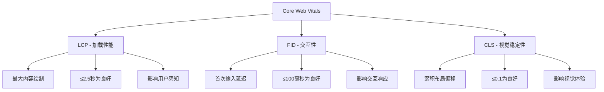
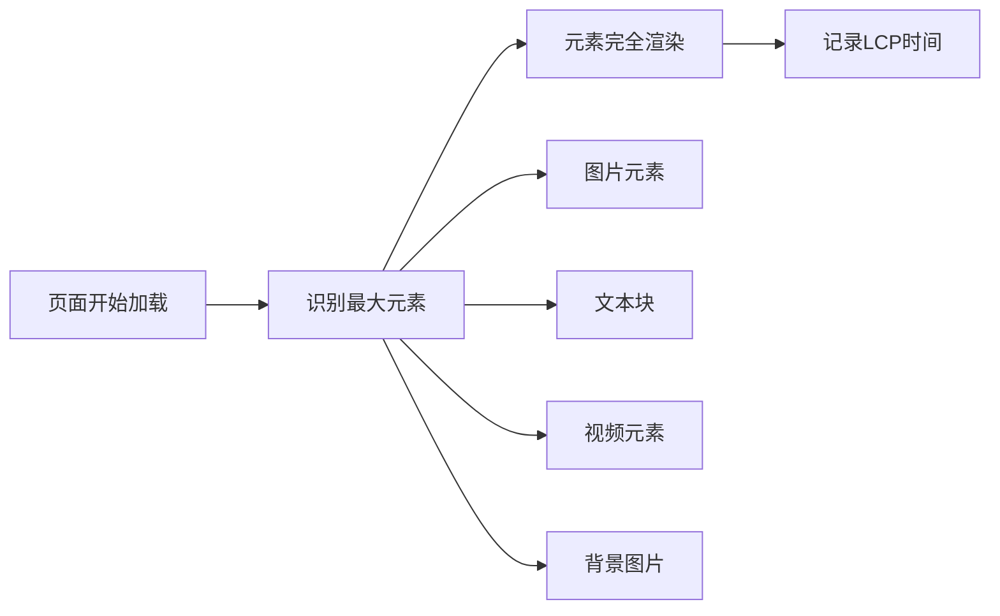
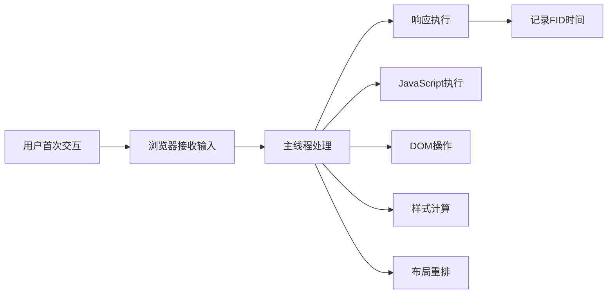
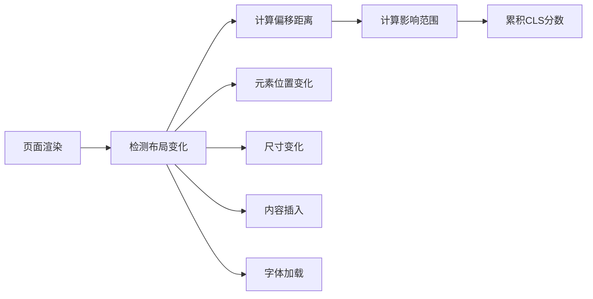
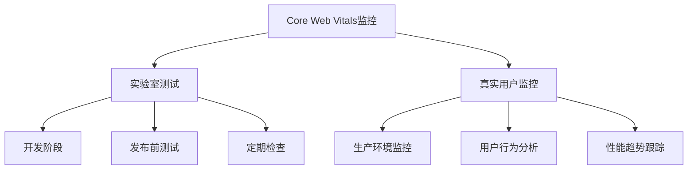
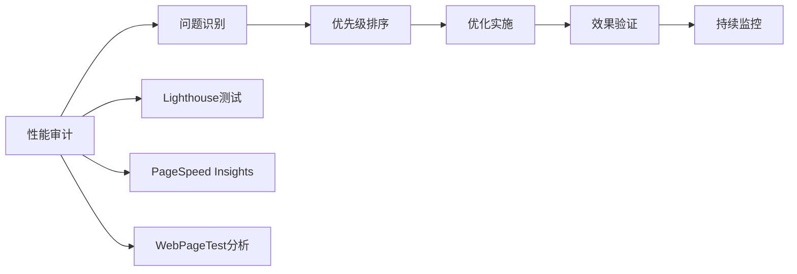

# Core Web Vitals详解

## 🎯 学习目标
- 深入理解Core Web Vitals三大核心指标
- 掌握LCP、FID、CLS的测量和优化方法
- 建立用户体验量化评估体系
- 学会Core Web Vitals优化实践策略

## 🚀 Core Web Vitals核心概念

### 定义与意义
**Core Web Vitals**：Google用户体验核心指标，衡量网页加载、交互性和视觉稳定性



### 评分标准
| 指标 | 良好 | 需要改进 | 差 |
|------|------|----------|-----|
| **LCP** | ≤2.5秒 | 2.5-4秒 | >4秒 |
| **FID** | ≤100毫秒 | 100-300毫秒 | >300毫秒 |
| **CLS** | ≤0.1 | 0.1-0.25 | >0.25 |

## ⚡ LCP（Largest Contentful Paint）

### 核心定义
**LCP**：最大内容绘制，测量页面主要内容加载完成的时间

### 测量原理


### 影响因素
| 因素 | 影响程度 | 优化方向 |
|------|----------|----------|
| **服务器响应时间** | 高 | CDN、服务器优化 |
| **资源加载时间** | 高 | 资源压缩、预加载 |
| **渲染阻塞** | 中 | CSS/JS优化 |
| **网络条件** | 中 | 资源优化 |

### 优化策略
1. **服务器优化**
   - 使用CDN加速
   - 优化服务器配置
   - 启用Gzip压缩
   - 使用HTTP/2

2. **资源优化**
   - 图片压缩和格式优化
   - 字体预加载
   - 关键CSS内联
   - JavaScript延迟加载

3. **渲染优化**
   - 避免渲染阻塞资源
   - 优化关键渲染路径
   - 使用资源提示
   - 预加载关键资源

## 🖱️ FID（First Input Delay）

### 核心定义
**FID**：首次输入延迟，测量用户首次交互到浏览器响应的延迟时间

### 测量原理


### 影响因素
| 因素 | 影响程度 | 优化方向 |
|------|----------|----------|
| **JavaScript执行** | 高 | 代码分割、延迟加载 |
| **主线程阻塞** | 高 | 异步处理、Web Workers |
| **第三方脚本** | 中 | 延迟加载、优化集成 |
| **DOM操作** | 中 | 批量操作、虚拟DOM |

### 优化策略
1. **JavaScript优化**
   - 代码分割和懒加载
   - 移除未使用的代码
   - 使用Web Workers
   - 优化第三方脚本

2. **主线程优化**
   - 减少长时间任务
   - 使用requestIdleCallback
   - 批量DOM操作
   - 避免强制同步布局

3. **交互优化**
   - 预加载关键资源
   - 优化事件处理
   - 使用防抖和节流
   - 异步处理非关键操作

## 📐 CLS（Cumulative Layout Shift）

### 核心定义
**CLS**：累积布局偏移，测量页面加载过程中意外布局偏移的程度

### 测量原理


### 影响因素
| 因素 | 影响程度 | 优化方向 |
|------|----------|----------|
| **图片无尺寸** | 高 | 设置图片尺寸 |
| **字体加载** | 高 | 字体预加载、回退 |
| **动态内容** | 中 | 预留空间、骨架屏 |
| **广告插入** | 中 | 预留广告位 |

### 优化策略
1. **图片优化**
   - 设置width和height属性
   - 使用aspect-ratio
   - 预加载关键图片
   - 使用占位符

2. **字体优化**
   - 使用font-display: swap
   - 预加载关键字体
   - 设置字体回退
   - 避免字体闪烁

3. **动态内容优化**
   - 预留动态内容空间
   - 使用骨架屏
   - 避免动态插入内容
   - 优化广告加载

## 📊 Core Web Vitals监控

### 测量工具
| 工具类型 | 工具名称 | 适用场景 | 特点 |
|----------|----------|----------|------|
| **实验室工具** | PageSpeed Insights | 开发测试 | 可控环境 |
| **实验室工具** | Lighthouse | 本地测试 | 详细报告 |
| **实验室工具** | WebPageTest | 深度分析 | 瀑布图 |
| **真实用户** | Google Analytics | 生产环境 | 真实数据 |
| **真实用户** | Search Console | 搜索影响 | Google官方 |

### 监控策略


### 监控指标
- **LCP监控**：页面加载性能趋势
- **FID监控**：用户交互响应趋势
- **CLS监控**：视觉稳定性趋势
- **整体评分**：Core Web Vitals综合评分

## 🎯 优化实施策略

### 优先级排序
1. **高优先级**：影响LCP的关键资源
2. **中优先级**：影响FID的JavaScript
3. **低优先级**：影响CLS的布局问题

### 优化流程


### 优化检查清单
- [ ] **LCP优化**
  - [ ] 服务器响应时间优化
  - [ ] 关键资源预加载
  - [ ] 图片优化和压缩
  - [ ] CSS/JS优化

- [ ] **FID优化**
  - [ ] JavaScript代码分割
  - [ ] 第三方脚本优化
  - [ ] 主线程优化
  - [ ] 交互响应优化

- [ ] **CLS优化**
  - [ ] 图片尺寸设置
  - [ ] 字体加载优化
  - [ ] 动态内容预留空间
  - [ ] 布局稳定性检查

## 🔧 技术实现

### 代码优化示例
```javascript
// LCP优化 - 图片预加载
const preloadImage = (src) => {
  const link = document.createElement('link');
  link.rel = 'preload';
  link.as = 'image';
  link.href = src;
  document.head.appendChild(link);
};

// FID优化 - 延迟非关键JavaScript
const loadNonCriticalJS = () => {
  const script = document.createElement('script');
  script.src = 'non-critical.js';
  script.async = true;
  document.head.appendChild(script);
};

// CLS优化 - 设置图片尺寸

```

### CSS优化示例
```css
/* CLS优化 - 字体加载 */
@font-face {
  font-family: 'CustomFont';
  src: url('font.woff2') format('woff2');
  font-display: swap; /* 避免字体闪烁 */
}

/* LCP优化 - 关键CSS内联 */
.critical-css {
  /* 关键样式内联 */
}
```

## 📈 性能提升路径

### 短期优化（1-2周）
- **图片优化**：压缩、格式转换、尺寸设置
- **资源压缩**：启用Gzip、Brotli压缩
- **CDN部署**：使用CDN加速静态资源
- **缓存策略**：设置合理的缓存策略

### 中期优化（1-2个月）
- **代码分割**：JavaScript代码分割和懒加载
- **关键路径优化**：优化关键渲染路径
- **第三方脚本优化**：延迟加载非关键脚本
- **服务器优化**：优化服务器配置和响应

### 长期优化（3-6个月）
- **架构优化**：整体架构性能优化
- **新技术应用**：使用最新Web技术
- **持续监控**：建立性能监控体系
- **团队培训**：提升团队性能意识

## 📚 学习路径

### 基础理解
1. [[01-Google核心算法#Core Web Vitals]] - 核心算法中的用户体验
2. [[02-算法更新历史#Core Web Vitals更新]] - 算法更新背景
3. [[03-E-A-T概念详解#用户体验与E-A-T]] - E-A-T与用户体验关系

### 深入应用
1. [[02-技术SEO#页面速度优化]] - 技术层面的性能优化
2. [[02-用户体验#Core Web Vitals优化]] - 用户体验优化策略
3. [[02-内容SEO#多媒体优化]] - 内容层面的性能优化

### 实战练习
1. [[03-应用层-实践技能#3.2-网站审计#性能审计]] - 性能审计方法
2. [[03-应用层-实践技能#3.5-数据分析#性能数据分析]] - 性能数据分析
3. [[05-实战案例与模板#5.1-成功案例分析#性能优化案例]] - 性能优化案例

## 📖 相关链接
- [[01-Google核心算法]] - 核心算法原理
- [[02-算法更新历史]] - 算法发展历程
- [[03-E-A-T概念详解]] - 质量评估标准
- [[05-算法惩罚机制]] - 惩罚机制详解
- [[02-技术SEO]] - 技术优化策略
- [[02-用户体验]] - 用户体验优化
