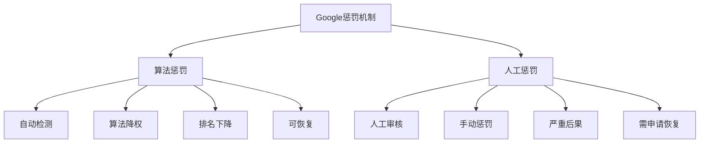
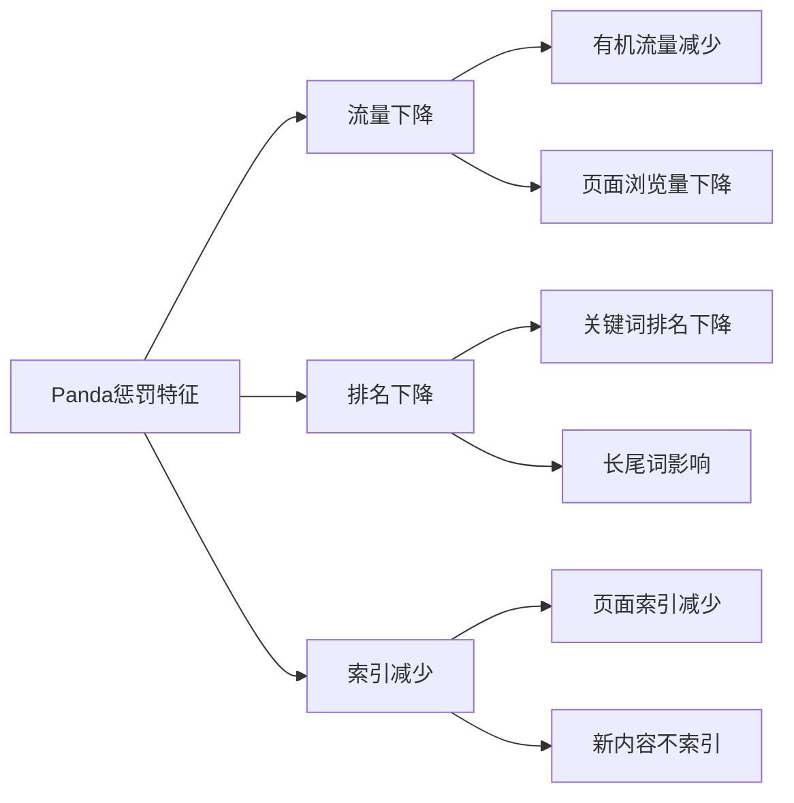
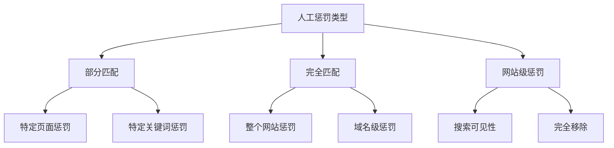
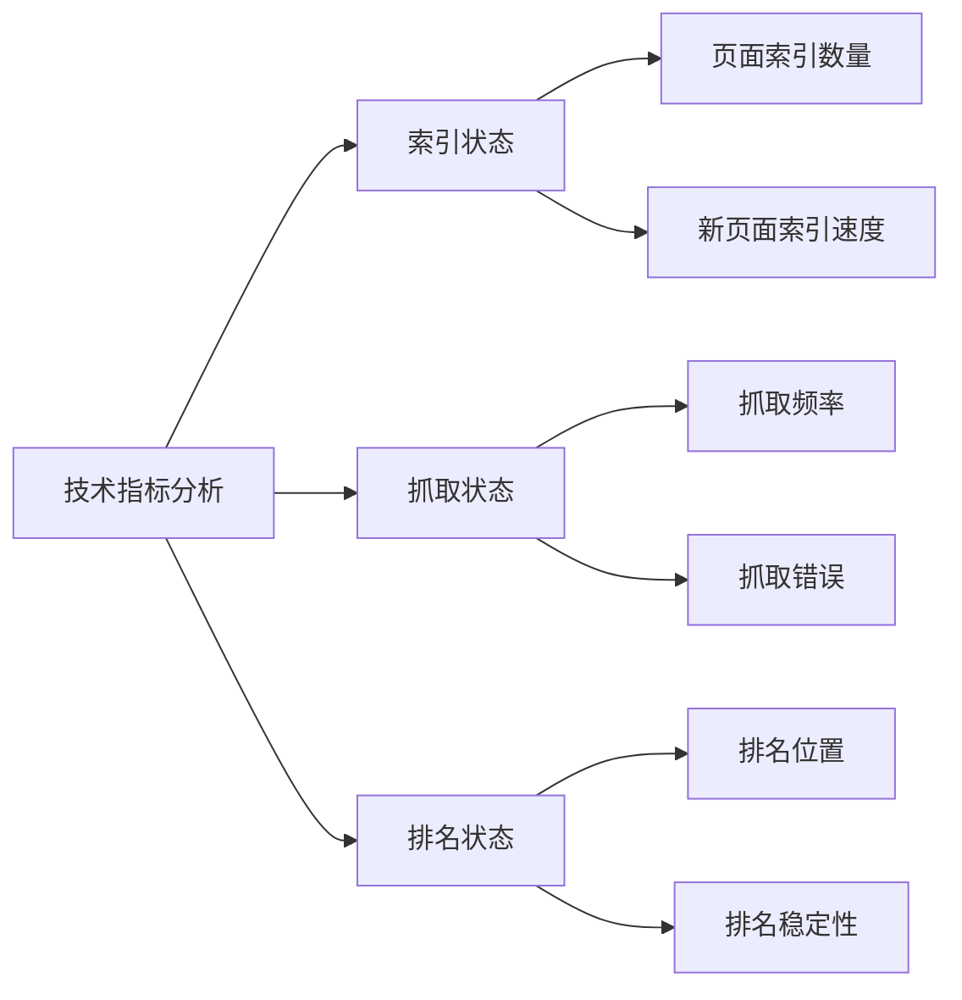
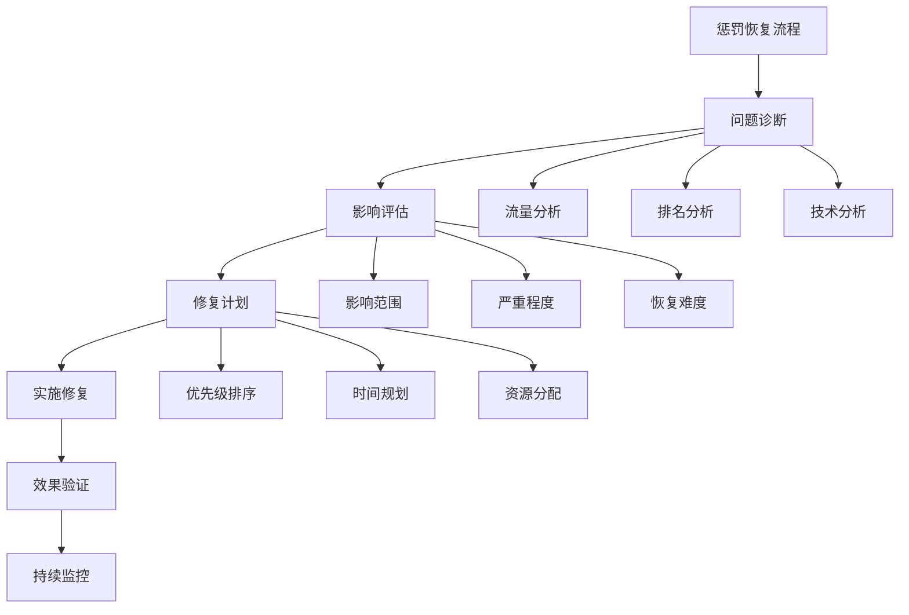
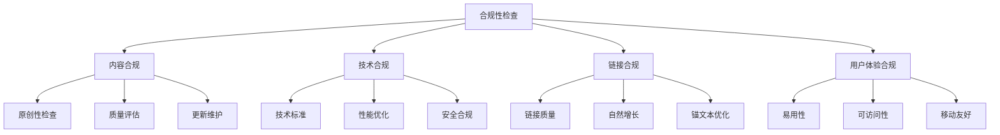

# Google算法惩罚机制

## 🎯 学习目标
- 深入理解Google算法惩罚机制
- 掌握不同类型惩罚的识别方法
- 建立惩罚恢复策略框架
- 学会预防算法惩罚的最佳实践

## ⚠️ 惩罚机制概述

### 核心概念
**算法惩罚**：Google通过算法自动检测和惩罚违反搜索质量指南的网站

### 惩罚类型分类
| 惩罚类型 | 触发方式 | 影响范围 | 恢复难度 |
|----------|----------|----------|----------|
| **算法惩罚** | 自动检测 | 部分或全部页面 | 中等 |
| **人工惩罚** | 人工审核 | 整个网站 | 困难 |
| **技术惩罚** | 技术问题 | 特定技术问题 | 容易 |
| **内容惩罚** | 内容质量 | 低质量页面 | 中等 |

## 🔍 算法惩罚类型详解

### 1. Panda惩罚
**核心目标**：打击低质量内容

#### 触发条件
- 重复内容过多
- 内容质量低下
- 用户体验差
- 内容农场特征

#### 识别特征

#### 恢复策略
1. **内容质量提升**
   - 删除重复内容
   - 提升内容原创性
   - 增加内容深度
   - 改善用户体验

2. **内容结构优化**
   - 优化内容层次
   - 改善页面布局
   - 提升可读性
   - 增加用户价值

### 2. Penguin惩罚
**核心目标**：打击垃圾链接

#### 触发条件
- 垃圾链接过多
- 过度优化锚文本
- 链接农场参与
- 付费链接未声明

#### 识别特征
| 特征 | 具体表现 | 影响程度 |
|------|----------|----------|
| **链接质量** | 大量低质量外链 | 高 |
| **链接模式** | 不自然链接增长 | 高 |
| **锚文本** | 过度优化关键词 | 中 |
| **链接来源** | 垃圾网站链接 | 高 |

#### 恢复策略
1. **链接审计**
   - 识别问题链接
   - 分析链接质量
   - 评估链接风险
   - 制定清理计划

2. **链接清理**
   - 移除垃圾链接
   - 申请拒绝链接
   - 清理过度优化
   - 建立自然链接

### 3. 人工惩罚
**核心目标**：处理严重违规行为

#### 触发条件
- 严重违反质量指南
- 恶意SEO行为
- 用户投诉举报
- 算法无法处理

#### 惩罚类型

#### 恢复流程
1. **问题识别**
   - 分析Search Console通知
   - 识别违规行为
   - 评估影响范围
   - 制定修复计划

2. **问题修复**
   - 移除违规内容
   - 修复技术问题
   - 改善用户体验
   - 建立合规体系

3. **重新审核申请**
   - 提交重新审核申请
   - 说明修复措施
   - 提供证据材料
   - 等待Google审核

## 📊 惩罚识别方法

### 流量分析
| 指标 | 正常表现 | 惩罚表现 | 分析要点 |
|------|----------|----------|----------|
| **有机流量** | 稳定增长 | 突然下降 | 下降时间和幅度 |
| **关键词排名** | 稳定波动 | 大幅下降 | 影响关键词范围 |
| **页面浏览量** | 正常分布 | 集中下降 | 受影响页面类型 |
| **跳出率** | 行业正常 | 异常升高 | 用户体验问题 |

### 技术指标

### 竞争对手分析
- **排名对比**：与竞争对手排名变化对比
- **流量对比**：流量变化趋势对比
- **内容对比**：内容质量和策略对比
- **链接对比**：外链质量和数量对比

## 🛠️ 惩罚恢复策略

### 恢复流程框架

### 具体恢复措施

#### 内容惩罚恢复
1. **内容质量提升**
   - 删除重复和低质量内容
   - 增加原创和深度内容
   - 改善内容结构和可读性
   - 提升用户体验

2. **内容策略调整**
   - 建立内容质量标准
   - 实施内容审核流程
   - 定期内容更新维护
   - 用户反馈收集改进

#### 链接惩罚恢复
1. **链接清理**
   - 识别和移除垃圾链接
   - 使用Google拒绝工具
   - 清理过度优化锚文本
   - 建立自然链接模式

2. **链接建设**
   - 获取高质量相关链接
   - 建立自然链接增长
   - 提升链接多样性
   - 监控链接质量

#### 技术惩罚恢复
1. **技术问题修复**
   - 修复爬虫抓取问题
   - 优化网站技术结构
   - 改善页面加载速度
   - 提升移动友好性

2. **技术优化**
   - 实施技术SEO最佳实践
   - 优化Core Web Vitals
   - 改善用户体验指标
   - 建立技术监控体系

## ⏱️ 恢复时间预期

### 恢复时间表
| 惩罚类型 | 修复时间 | 恢复时间 | 影响因素 |
|----------|----------|----------|----------|
| **技术惩罚** | 1-2周 | 2-4周 | 问题复杂度 |
| **内容惩罚** | 1-3个月 | 3-6个月 | 内容质量提升 |
| **链接惩罚** | 3-6个月 | 6-12个月 | 链接清理程度 |
| **人工惩罚** | 6-12个月 | 12-24个月 | 违规严重程度 |

### 影响因素
- **问题严重程度**：问题越严重，恢复时间越长
- **修复质量**：修复质量越高，恢复越快
- **网站历史**：历史表现影响恢复速度
- **竞争环境**：竞争激烈恢复更慢

## 🚫 预防策略

### 合规性检查

### 监控体系
1. **流量监控**
   - 有机流量变化
   - 关键词排名监控
   - 页面性能监控
   - 用户行为分析

2. **技术监控**
   - 爬虫抓取监控
   - 索引状态监控
   - 技术错误监控
   - 性能指标监控

3. **内容监控**
   - 内容质量评估
   - 重复内容检测
   - 更新频率监控
   - 用户反馈收集

## 📚 学习路径

### 基础理解
1. [[01-Google核心算法#Panda算法]] - Panda算法原理
2. [[01-Google核心算法#Penguin算法]] - Penguin算法原理
3. [[02-算法更新历史#重大算法更新]] - 算法更新影响

### 深入应用
1. [[02-内容SEO#内容质量优化]] - 内容层面预防
2. [[02-链接建设#链接质量评估]] - 链接层面预防
3. [[02-技术SEO#技术合规]] - 技术层面预防

### 实战练习
1. [[03-应用层-实践技能#3.2-网站审计#惩罚风险评估]] - 惩罚风险评估
2. [[03-应用层-实践技能#3.6-问题诊断与解决#惩罚恢复]] - 惩罚恢复实践
3. [[05-实战案例与模板#5.2-失败案例研究#惩罚案例]] - 惩罚案例分析

## 📖 相关链接
- [[01-Google核心算法]] - 核心算法原理
- [[02-算法更新历史]] - 算法发展历程
- [[03-E-A-T概念详解]] - 质量评估标准
- [[04-Core Web Vitals]] - 用户体验指标
- [[02-内容SEO]] - 内容优化策略
- [[02-链接建设]] - 链接建设策略
- [[02-技术SEO]] - 技术优化策略
